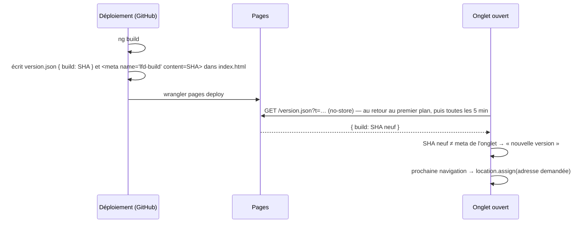

# Un onglet apprend qu'une nouvelle version est en ligne

> 🟡 **Bâti le 2026-10-08, pas encore vu en production** (non commité à
> l'écriture de ce bandeau).
>
> - **N1** — l'étape « Write build identity » des deux workflows
>   (`deploy_lfd_backoffice.yml`, `deploy_lfc_boutique.yml`), juste après
>   `ng build --configuration cloudflare` : le fichier de version et la balise
>   `lfd-build` d'`index.html`, depuis `github.sha`. L'étape échoue si
>   `index.html` n'a pas de `</head>` ou si la balise n'a pas été posée.
> - **N2** — `packages/front-ops/src/new-version.ts` (décisions pures,
>   `__tests__/new-version.spec.ts`) et `new-version-watch.ts`
>   (`provideNewVersionWatch()`, le signal `NEW_VERSION`), branchés dans les
>   deux `app.config.ts`. **Écart mécanique au § 2** : la décision se prend à
>   `RoutesRecognized`, pas à `NavigationStart` — c'est le premier événement
>   qui connaît la `data` de la route cible. La garde anti-boucle est celle de
>   `stale-bundle.ts` (`shouldReload`, même clé, même délai).
> - **N3** — `/coursier`, `/coursier/mes-donnees` et
>   `/coursier/:roundId/chargement` portent `data: { newVersion: "banner" }` ;
>   le bandeau est `shared/new-version-banner/`, posé au-dessus du
>   `router-outlet` dans `app.html`.
>
> **Reste à vérifier au premier déploiement** : `https://<front>/version.json`
> rend le SHA de `main` et `index.html` porte la balise (un YAML n'est lu que
> par GitHub ; l'étape n'a été rejouée qu'en local, sur une copie) ; un onglet
> ouvert avant le déploiement recharge à la navigation suivante ; le bandeau
> s'affiche sous `/coursier` sans décaler la mise en page. Le provider n'a pas
> de test sous `TestBed` (le jest du paquet tourne en `node`) : seules les
> décisions pures sont testées.
>
> 📐 Plan validé par Hugo le 2026-10-08 (2026-10-08, Hugo : « pour tous mes fronts, je ne
> devrais pas avoir un auto refresh quand je pousse une nouvelle version ? »).
> Hors des quatre cas de `vitruve` (ni argent, ni migration, ni sécurité, ni
> runbook) : affirmations vérifiées dans le dépôt le 2026-10-08.

## 1. Ce qui existe

- **Le rechargement après coup** (`packages/front-ops/src/stale-bundle.ts`,
  `stale-bundle-reload.ts`, posé le 2026-09-28). Un onglet resté sur une
  version retirée demande un morceau d'écran qui n'existe plus ; l'import
  échoue, et l'onglet se recharge **une fois** sur l'adresse demandée
  (`RELOAD_GUARD_MS` = 10 s contre la boucle). Branché dans les deux fronts
  (`provideStaleBundleReload()`, `app.config.ts` du back-office l. 48 et de la
  boutique l. 78).
- **Ce qu'il ne voit pas** : un onglet qui ne charge **aucun** écran neuf.
  Ouvert sur « Tournées » ou « Ma tournée », il reste des heures sur l'ancien
  code et parle à l'API avec l'ancien contrat. En pré-release, où un contrat
  se casse dans le même déploiement (CLAUDE.md § 0), c'est le cas que le
  retrait de `slots` a dû prévoir (« un onglet resté sur l'ancien front »).
- **Les deux fronts sont du statique** sur Cloudflare Pages : `ng build
--configuration cloudflare` puis `wrangler pages deploy` du dossier
  `browser` (`deploy_lfd_backoffice.yml` l. 102 et 156,
  `deploy_lfc_boutique.yml` l. 127 et 184). L'application mobile du
  back-office (Capacitor) charge le même site distant (`capacitor.config.ts`,
  `server.url`) : elle suit sans rien de plus.
- **Le modèle de veille** existe : `day-version-watcher.ts` relit toutes les
  5 min, onglet visible seulement (`SAFETY_NET_MS`).

## 2. Le mécanisme

### N1 — Chaque build dit qui il est (les deux workflows de déploiement)

Après `ng build`, une étape écrit dans le dossier `browser` :

- le fichier de version, servi à la racine du site : `{ "build": "<GITHUB_SHA>" }` ;
- la même valeur dans `index.html`, en `<meta name="lfd-build" content="…">`.

Les deux sortent **de la même étape**, donc du même SHA. Sans la balise (dev
local, `ng serve`), la veille ne démarre pas : rien à comparer.

### N2 — La veille (`packages/front-ops`, `provideNewVersionWatch()`)

- Lit la balise au démarrage. Relit le fichier de version (`cache: "no-store"`,
  paramètre anti-cache) au retour de l'onglet au premier plan
  (`visibilitychange`) et toutes les 5 min **onglet visible seulement**.
- Un `build` différent de la balise → un signal `newVersion` passe à vrai.
  Une lecture ratée (réseau, 404 pendant un déploiement) ne dit rien.
- **À la prochaine navigation** (`NavigationStart`), si `newVersion` est vrai
  et que la route ne l'a pas exclue : `location.assign(event.url)`. On ne
  recharge jamais au milieu d'un écran — un formulaire en cours n'est pas
  perdu. La garde anti-boucle de `stale-bundle` (même clé, 10 s) s'applique.
- Fonctions pures testées sans navigateur (la décision, la lecture de la
  balise, la comparaison), comme `shouldReload`.

### N3 — Les écrans qui ne rechargent pas d'eux-mêmes

Une route porte `data: { newVersion: "banner" }` : la veille n'y recharge
pas, et l'application affiche un bandeau « Une nouvelle version est en
ligne — Recharger » (bouton = `location.reload()`).

- **« Ma tournée » (`/coursier/**`)** : un livreur en pleine tournée ne doit
  pas voir son écran repartir de zéro (le plan hors-ligne prévoit une file de
  gestes locale, `plan-hors-ligne-eta-et-livraisons-ratees.md`). Bandeau.
- Le bandeau est un composant fold du back-office ; `front-ops` ne fournit
  que le signal (il n'a pas d'interface).

### Ce qui n'est pas fait

- Pas de service worker (`@angular/service-worker`) : il ajouterait un cache
  à invalider, pour un besoin qu'une lecture de 40 octets couvre.
- Pas de notification poussée au déploiement : la relecture au premier plan
  suffit, et ne demande ni socket ni serveur.

## 3. Tests et vérification

- `front-ops` : la décision (même build, build neuf, lecture ratée, balise
  absente, garde anti-boucle), et le provider sous `TestBed` (navigation →
  `location.assign`, route `banner` → pas de rechargement).
- Back-office : le bandeau sur `/coursier`.
- Workflows : un YAML n'est lu que par GitHub — vérifier sur le premier
  déploiement que `https://<front>/version.json` rend le SHA de `main`, et
  que `index.html` porte la balise.
- Taille : rien de `@lfd/contracts` au démarrage de la boutique (budget
  1,30 Mo).

## 4. Décisions d'Hugo (2026-10-08)

- **Q1 — oui** : le bandeau sur « Ma tournée » et le chargement du véhicule
  (`/coursier/**`), les deux écrans de terrain ; le colisage recharge à la
  navigation comme le reste.
- **Q2 — oui** : la boutique recharge à la navigation, le panier vit côté
  serveur.
