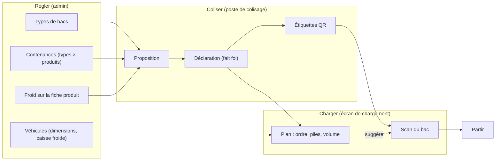
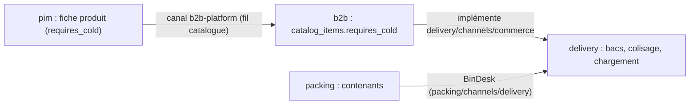

# Les bacs — coliser, charger, partir

> **Référence, état du code au 2026-09-29** (lot 2 bis et lot 4 bis du
> [plan de préparation de tournée](../livraisons/plan-preparation-de-tournee.md)). Chaque
> affirmation ci-dessous a été relue dans le code ce jour-là ; le plan garde
> l'histoire et les décisions, ce document dit ce qui existe.
>
> **§ 5 mis à jour le 2026-10-02** : lots PC1, PC2 et PC3 de
> [`../livraisons/decisions-par-defaut-2026-10-02.md`](../livraisons/decisions-par-defaut-2026-10-02.md)
> (la rangée « + format », le poste rangé par tournée, l'étiquette qui porte
> la tournée). Ces décisions sont **par défaut, à revoir avec Hugo**.
>
> ⚠️ **§ 5 périmé par K2b et K3 (2026-10-05).** Le poste ne déclare plus les
> bacs par la livraison : il ouvre des **contenants** au colisage (bacs en
> livraison, sacs en retrait), y répartit les lignes, applique « Proposer »
> d'un coup, partage une moitié, puis ferme. La rangée « + format », le panneau
> « Bacs » après « prête » et le compte anonyme de containers sont retirés.
> L'état du poste est dans [`colisage.md`](colisage.md). Les §§ 4, 5.3 (étiquettes),
> 5.5 (« à refaire »), 6 et suivants restent justes.

## 1. En deux phrases

Tout ce qui part en livraison part dans un **bac typé** — un bac entier ou une
moitié de bac cloisonné — qu'on déclare au poste de colisage, qu'on étiquette
d'un QR et qu'on scanne en le chargeant ; les sacs ne sont plus qu'un compte
posé dans le bac. Parce que chaque type de bac a des dimensions et une
contenance par produit, le serveur **propose** le colisage d'une commande et un
**plan de chargement** (ordre, piles, volume sec et froid) de chaque tournée.

## 2. Les mots

| Mot                    | Ce que c'est                                                                                                                                                                                   |
| ---------------------- | ---------------------------------------------------------------------------------------------------------------------------------------------------------------------------------------------- |
| **Type de bac**        | Un modèle de bac du catalogue : nom, dimensions extérieures et intérieures, isotherme ou non, hauteur de pile, cloisonnable ou non. Un réglage de la livraison.                                |
| **Bac**                | Un bac **déclaré** pour une commande : l'unité qu'on scanne. Il a un QR (son identifiant) et un code court de six caractères. Il appartient à la commande.                                     |
| **Demi-bac** (moitié)  | Un côté (`left` ou `right`) d'un bac physique d'un type **cloisonnable**. Une moitié est un bac à part entière : son QR, son code, sa commande.                                                |
| **Bac physique**       | L'objet qu'on porte. Un bac entier EST son bac physique ; deux moitiés partagent le même `physicalBinId`.                                                                                      |
| **Bac partagé**        | Un bac physique dont les deux moitiés sont à **deux commandes** d'arrêts consécutifs de la même tournée. Dernier recours, jamais le cas normal.                                                |
| **Contenance**         | Combien d'unités d'un produit tient un bac **entier** d'un type. Une case de la grille types × produits ; une case vide veut dire « ne va pas dans ce type ».                                  |
| **Sacs dans un bac**   | Un compte (0 à 50) de sacs posés dans le bac, imprimé sur l'étiquette. Sans QR, sans scan : informatif.                                                                                        |
| **Froid**              | Une propriété du **produit** (« Demande le froid », fiche du référentiel). Un produit froid ne va que dans un type isotherme, jamais avec du sec.                                              |
| **Colisage proposé**   | Ce que le serveur suggère pour une commande (« 2 Bac M + ½ Bac S »). Une lecture : rien ne s'écrit.                                                                                            |
| **Colisage déclaré**   | Les bacs réellement déclarés pour la commande. **C'est la déclaration qui fait foi**, qu'elle suive la proposition ou non.                                                                     |
| **À refaire**          | Un bac partagé dont les deux commandes ne sont plus à des arrêts consécutifs. Calculé à chaque lecture, jamais écrit.                                                                          |
| **Plan de chargement** | Pour une tournée : l'ordre suggéré de chargement (dernier arrêt d'abord), les piles, le volume sec et froid face au véhicule, et les alertes. Un plan d'ordre et de volume, pas une géométrie. |

## 3. Le flux

## 4. Régler

Tout se règle dans **Livraison** du back-office, sous le droit
`delivery_settings` (sauf le froid, qui est sur la fiche produit du
référentiel).

### 4.1 Les types de bacs — `Livraison → Bacs`

Un type porte :

| Champ                        | Règle (tenue par le domaine, refus 400 avec la phrase)                                                                                                                                                                 |
| ---------------------------- | ---------------------------------------------------------------------------------------------------------------------------------------------------------------------------------------------------------------------- |
| Nom                          | 1 à 60 caractères, espaces retirés. **Unique parmi les types non archivés** (refus 409 nommé ; la base le tient aussi, § 8).                                                                                           |
| Dimensions **extérieures**   | Longueur, largeur, hauteur **au millimètre** depuis le 2026-10-07 (saisies en cm à une décimale : 66,5), 1 à 300 cm. Ce sont elles qui comptent au **chargement** ; le plancher du véhicule, en cm, s'y convertit ×10. |
| Dimensions **intérieures**   | Mêmes bornes, et **jamais plus grandes** que l'extérieur, dimension par dimension (le refus nomme la première qui déborde). Elles servent à la **proposition** (départage par volume).                                 |
| Volume intérieur             | Dérivé : L × l × h (mm³) / 1 000 000, arrondi à l'**inférieur**. Jamais saisi, jamais stocké.                                                                                                                          |
| Isotherme                    | Oui / non. Seuls les isothermes reçoivent du froid.                                                                                                                                                                    |
| Hauteur de pile (`maxStack`) | Entier de 1 à 20 : combien de bacs de ce type se superposent.                                                                                                                                                          |
| Cloisonnable (`divisible`)   | Accepte une cloison : le bac se déclare aussi en demi-bacs.                                                                                                                                                            |

**Corriger** remplace la fiche entière ; c'est permis sur un type archivé, et
ne le remet pas en service. **Archiver** retire le type des propositions, de la
grille des contenances et des déclarations nouvelles (« type archivé » refusé à
la déclaration comme au partage) ; les bacs déjà déclarés de ce type restent
lisibles. **Réactiver** le remet en service. Un type n'est **jamais supprimé**.

### 4.2 Les contenances — `Livraison → Contenances`

Une grille : en lignes les produits vendus du catalogue B2B, en colonnes les
types **en service**. Une case dit combien d'unités du produit tient un bac
**entier** du type : un entier de 1 à 10 000. On pose ou on vide **une case à
la fois**. Zéro n'existe pas : « ne va pas dans ce type » est une case vide.

- Une case ne se **pose** pas sur un type archivé (refus 409) ; elle peut s'y
  **vider**.
- Une case d'un produit qui ne se vend plus reste en base, et n'est plus
  affichée tant que le produit n'est pas relisté.
- La grille montre aussi le froid de chaque produit, lu sur le catalogue.

**La règle de place, unique** : une unité d'un produit occupe
`1 / contenance(type, produit)` d'un bac entier. Un demi-bac offre **0,5**. Les
produits d'une même commande se mélangent dans un bac en additionnant leurs
places — 12 croissants dans un type qui en tient 24 occupent 0,5 ; ajoutés à 5
baguettes sur 20, on arrive à 0,75.

**Les manques sont signalés, jamais devinés.** Un produit sans aucune case
utilisable n'est pas placé par la proposition : il sort en « Non placés » avec
sa raison (§ 5.1), et le poste de colisage offre un lien vers les
Contenances à qui a le droit de les régler.

### 4.3 Le froid, sur la fiche produit

La case **« Demande le froid (conservation réfrigérée) »** est dans la carte
**Logistique** de la fiche produit du référentiel (droit `pim_catalog`). Elle
vaut « non » par défaut : `false` ne dit pas « supporte l'ambiant », il dit
« personne ne l'a qualifié ». Le changement est journalisé
(`product.cold_requirement_changed`), publié dans le catalogue B2B
(`catalog_items.requires_cold`), et relayé à la livraison par le canal
commerce (§ 10.2).

### 4.4 Les véhicules — `Livraison → Véhicules`

| Champ                 | Règle                                                                                                                                            |
| --------------------- | ------------------------------------------------------------------------------------------------------------------------------------------------ |
| Dimensions utiles     | Longueur, largeur, hauteur intérieures, cm entiers de 1 à 1 000. **Les trois ou aucune.** Volume utile dérivé, en litres arrondis à l'inférieur. |
| Caisse réfrigérée     | Absente (véhicule sec) ou complète : volume de 1 à 20 000 L, température minimale et maximale de −30 à +15 °C, minimum ≤ maximum.                |
| Caisse ≤ volume utile | Quand les dimensions sont connues, le volume réfrigéré ne les dépasse pas : la caisse est **dans** le volume utile.                              |
| Énergie               | Facultative : électrique, hybride, gazole, essence, gaz (GNV ou GPL). Affichée seulement ; aucun calcul ne la lit.                               |

## 5. Coliser, au poste de colisage

> ⚠️ Périmé depuis K3 (2026-10-05) — voir [`colisage.md`](colisage.md) §4 et §6.
> Le texte ci-dessous décrit le poste du 2026-10-02.

Le poste de colisage du fournil (`/production/colisage`, ou
`/colisage/:reference` ouvert par le QR de la feuille) porte, pour une
commande **en livraison**, deux gestes sur les bacs, tous deux réservés à qui
a `production_packing:write` **ou** `delivery_loading:write` (les autres
lisent « Les bacs se déclarent au comptoir. ») :

- **la rangée « + format »** (§ 5.0), au-dessus des lignes, pendant tout le
  colisage — elle remplace le compte anonyme de containers ;
- **le panneau « Bacs »** (§ 5.1 à 5.4), sous la commande une fois déclarée
  prête : la proposition détaillée, la saisie libre, le partage.

Une commande inconnue, annulée ou en retrait au comptoir est refusée (409
`delivery.bins_not_declarable`). Une commande **en retrait** garde son compte
anonyme de containers (`+ / −`), inchangé
(décision D4 du plan du « + » qui choisit un bac, retiré le 2026-10-05).

### 5.0 La rangée « + format » (lot PC1)

Un bouton par type de bac **en service** — `+ Bac S ❄`, `+ Bac M`,
`+ ½ Bac L` pour un type cloisonnable. Un appui déclare **un** bac tout de
suite, par la route de déclaration (`whole: 1`, ou `whole: 0, half: true`) ;
« **−** », sur le dernier bac de la liste seulement, l'**annule**. Un bac
chargé refuse (on décharge d'abord) : le message du serveur s'affiche tel
quel. Changer un M en L, c'est « − » puis « + » : une nouvelle étiquette (Q4).

- Le compte de la bande **est** la liste des bacs déclarés, et chaque bac a
  son lien « Étiquette ». « Sacs dans le prochain bac » s'imprime sur
  l'étiquette du bac suivant.
- Le format que la **proposition** retiendrait (§ 5.1) est **en couleur** —
  rien n'est déclaré d'office (Q2).
- Au premier appui sur « Déclarer prête », l'écran **avertit** s'il n'y a
  aucun bac, ou du froid (`requiresCold` d'une ligne de la proposition) sans
  bac isotherme ; un second appui (« Déclarer prête quand même ») déclare.
  Ce sont des avertissements d'écran : le serveur ne demande aucun bac pour
  déclarer prête, et « Partir » refuse déjà une tournée incomplète (§ 6.3).
- `production_orders.containers` n'est plus écrit pour une livraison ; la
  colonne reste (aucune migration).

### 5.0 bis Le poste rangé par tournée (lot PC2)

La liste des commandes suit les **tournées du jour**, dans l'ordre de la
composition, et dans chaque tournée **du dernier arrêt au premier** — l'ordre
où les bacs entrent dans le véhicule. La commande ouverte d'elle-même est donc
le dernier arrêt de la première tournée. C'est un ordre d'**affichage** : on
ouvre n'importe quelle commande. Le retrait et les livraisons pas encore
réparties suivent, sous « Hors tournée », dans l'ordre des références.

- En tête de chaque tournée : « **n commandes prêtes sur m** », compté par la
  livraison d'après le commerce (la même source que « Ma tournée »).
- Sur chaque commande : « arrêt n », et deux pastilles —
  « **Retenue au contrôle** » (un verdict bloquant du superviseur, lu par le
  fournil : `PackingSheet.qualityHeld`, même règle que le comptoir) et
  « **À refaire : annuler et recoliser** » (un bac partagé à refaire, § 5.5).
- La lecture est `GET admin/livraison/colisage/tournees?jour=`, sous
  `production_packing:read` **ou** `delivery_loading:read`. Le fournil
  n'importe pas la livraison : c'est l'écran qui lit les deux. Sans elle, la
  liste garde l'ordre servi et le dit. Elle se relit avec la journée du
  fournil, et au plus tard toutes les cinq minutes (le filet du veilleur) :
  une tournée recomposée sans geste au fournil peut attendre ce délai.
  **2026-10-02** : le poste suit aussi la journée de la **livraison**
  (`GET admin/livraison/version`) — mais seulement s'il porte
  `delivery_rounds:read` ou `delivery_loading:read`, les deux droits de cette
  route ; elle ne s'ouvre pas à `production_packing:read`, et ce lot ne l'a pas
  élargie. Un poste qui n'a que le colisage garde le filet de cinq minutes.

### 5.1 La proposition

Le serveur lit les lignes de la commande (fusionnées par produit), le froid de
chaque produit, les types **en service** et leurs contenances. Puis, en mots
simples :

1. **Trier en trois groupes qui ne partagent jamais un bac**
   - le **froid** : dans les types isothermes seulement ;
   - le **sec** : dans les types non isothermes ;
   - le **sec qu'aucun type non isotherme ne contient** : en isotherme, plutôt
     que sans bac.

   Un produit froid qu'aucun isotherme ne contient sort en « Non placés —
   froid sans bac isotherme » ; un produit qu'aucun type ne contient sort en
   « Non placés — sans contenance ».

2. **Coliser chaque groupe, avec le moins de bacs possible, et à égalité le
   moins de volume** — comme le ferait un préparateur :
   - si **tout ce qui reste** tient dans un seul bac, on prend le **plus
     petit** type qui le prend ; et si ce reste tient dans une **moitié**
     (≤ 0,5) d'un type cloisonnable, la moitié compte pour la moitié du volume
     et gagne souvent : c'est le **demi-bac pour un reste** ;
   - sinon, on **remplit un bac entier** du type qui demanderait le moins de
     bacs pour tout le reste (à égalité, le moins de volume), et on
     recommence : on remplit en grand, puis on « descend d'une taille » pour la
     fin ;
   - si aucun type ne contient tous les produits restants, on remplit un bac
     du type qui en contient le plus.

   Le volume comparé est le volume **intérieur**. Les égalités se départagent
   par l'ordre du catalogue : mêmes entrées, même proposition.

L'écran montre la proposition par type (« ❄ » pour le froid), le contenu, et
le remplissage du **dernier** bac (une moitié pleine = 100 %). C'est une
heuristique gloutonne, lisible et testée — pas l'optimum mathématique.

### 5.2 Déclarer

- **« Déclarer comme proposé »** déclare chaque entrée de la proposition. Le
  bouton est inactif si des bacs sont **déjà** déclarés pour la commande :
  on annule d'abord.
- **« Autre colisage »** ouvre la saisie libre : un type, un nombre de bacs
  entiers (0 à 20), et **« Et une moitié de bac »** si le type est
  cloisonnable. Au moins un bac. Si ce qui est déclaré diffère de la
  proposition, l'écran le dit (« autre que la proposition — la déclaration
  fait foi »).
- **« Sacs dans chaque bac »** (0 à 50) s'applique à chaque bac d'une même
  déclaration.

Une déclaration crée les bacs entiers, puis la moitié : la **gauche** d'un bac
physique neuf, dont la droite reste libre. Chaque bac reçoit un code court tiré
au hasard (six caractères Crockford, sans I, L, O, U) ; deux déclarations
simultanées qui tireraient le même code sont refusées, rien n'est écrit, on
redéclare. Une tournée **partie** ne reçoit plus de bac.

**Annuler** un bac de trop : son étiquette ne vaut plus, le bac reste en base
(jamais supprimé). Refusé s'il est chargé (on décharge d'abord) ou si sa
tournée est partie. Annuler une moitié libère son côté du bac physique.
Le bouton de la fiche d'un bac se montre sous `production_packing:write`
**ou** `delivery_loading:write`, comme le serveur (2026-10-02 ; il ne suivait
que le second).

### 5.3 Les étiquettes

`Livraison → Étiquettes` (`/livraison/etiquettes/:orderId`, ouverte depuis le
panneau ou de la rangée) imprime une étiquette par bac, ou toutes. **En tête et
en très gros, la tournée et le rang d'arrêt** (« Kangoo · passage 2 »,
« Arrêt 3 » — lot PC3) : on pose le bac dans la zone de sa tournée ; hors
tournée, rien n'est imprimé à cette place. Puis numéro de commande, client,
rang du bac, type (et côté pour une moitié), avec qui il est partagé, le nombre
de sacs, le **QR** et le **code court**. Imprimer est une lecture : réimprimer
ne crée rien. Le QR ouvre `/livraison/bac/:binId`, la fiche du bac.

### 5.4 Le partage, en dernier recours

La proposition cherche en plus un **partage** : le dernier bac d'une de ses
entrées tiendrait-il dans la moitié libre d'un bac déjà déclaré pour un arrêt
voisin ? Elle le propose seulement si **toutes** ces conditions tiennent :

- la commande est dans une tournée **non partie** ;
- un arrêt **consécutif** (juste avant ou juste après) porte une moitié non
  annulée, d'un type **en service**, dont l'autre côté est libre ;
- cette moitié est du **même genre** que le bac qu'elle remplacerait
  (isotherme pour isotherme, sec pour sec) — la cloison sépare deux clients,
  pas le froid du sec ;
- le contenu de ce dernier bac tient dans **0,5** du type de la moitié.

« **Déclarer ainsi** » déclare la proposition sans ce dernier bac, puis
déclare l'autre côté du bac partenaire. Le partage se fait aussi à la main,
depuis « Autre colisage », en choisissant la **moitié partenaire**.

Au partage, le serveur refuse : un bac partenaire annulé, entier, ou de la
même commande ; un côté déjà pris ; un type archivé ou non cloisonnable ; une
tournée partie ; deux commandes qui ne sont pas à des arrêts consécutifs de la
même tournée. ⚠️ Il ne revérifie **ni la place ni le froid** : ce contrôle
n'est fait que par la proposition. Un partage à la main est donc jugé par
celui qui le fait.

### 5.5 « À refaire »

Un bac partagé n'a de sens qu'entre deux arrêts **consécutifs** : il descend
au premier, remonte, et part au second. Si la tournée est recomposée (arrêt
retiré, déplacé, tournée réordonnée) et que ce n'est plus vrai, le bac est
**« à refaire »**. Ce n'est pas un drapeau : c'est recalculé à chaque lecture
depuis l'ordre des arrêts vivants, donc remettre les arrêts côte à côte le
répare sans aucun geste sur le bac.

On le voit au poste de colisage (pastille sur la commande, § 5.0 bis), sur
l'écran de chargement (badge « À refaire », bandeau), sur la fiche du bac, et
dans les alertes du plan ; « Partir » le refuse (§ 6.3). La
sortie : annuler les deux moitiés et recoliser, ou remettre les arrêts côte à
côte.

## 6. Charger

L'écran `Livraison → Chargement` liste les tournées du jour ;
`/livraison/chargement/:roundId` ouvre celle d'un véhicule.

### 6.1 Le scan

On charge un bac en scannant son **QR** (la caméra de l'écran) ou en tapant son
**code court** (« Code du bac »). Une moitié se scanne comme un bac : un QR
chacune. Le serveur :

- refuse un bac d'une **autre tournée** en nommant le véhicule, le jour et le
  passage où il doit partir — le bon bac dans la mauvaise camionnette ;
- refuse un bac annulé, un bac d'une commande dans aucune tournée, une tournée
  partie ;
- ignore un second scan du même bac (il ne compte qu'une fois).

**Décharger** remet le bac à charger ; refusé après le départ. Un arrêt dont un
bac est chargé ne se **déplace** pas vers une autre tournée : on décharge
d'abord.

### 6.2 Le plan de chargement

Dans l'écran de chargement d'une tournée, la carte « Plan de chargement »
(`livraison/loading-plan/`, lue par
`GET admin/livraison/chargement/:roundId/plan`) montre, pour la tournée :

- **L'ordre suggéré** : des étapes dans l'ordre **inverse de la tournée** — le
  dernier arrêt livré est chargé d'abord, au fond. Un arrêt sans bac garde son
  étape, vide.
- **Le bac partagé** : ses deux moitiés sont listées ensemble à l'étape du
  **premier** des deux arrêts, en **dernier** de l'étape — en haut au moment où
  on l'atteint. Si l'autre commande n'est pas dans la tournée, la moitié reste
  à son arrêt (et le plan alerte).
- **Les piles** : chaque bac physique va sur la dernière pile ouverte de son
  type tant qu'elle n'a pas atteint la hauteur de pile du type, sinon il en
  ouvre une. Une pile porte donc souvent plusieurs arrêts : celui qu'on charge
  après — livré avant — est au-dessus. Chaque bac porte le numéro de sa pile.
- **Le volume** : la somme des volumes **extérieurs** des bacs physiques (un bac
  partagé compte une fois), arrondie au litre **supérieur**, en deux comptes :
  - **froid** : les isothermes, face au volume de la caisse réfrigérée ;
  - **sec** : le reste, face au volume utile **moins** la caisse réfrigérée.
    Sans caisse réfrigérée, les isothermes comptent au sec.
- **Les alertes**, chacune avec son geste de sortie :

| Alerte                            | Quand                                                                        |
| --------------------------------- | ---------------------------------------------------------------------------- |
| `unknown_cargo`                   | Les dimensions utiles du véhicule ne sont pas renseignées — même sans bac.   |
| `dry_over`                        | Le sec dépasse le disponible : « déplacez un arrêt vers une autre tournée ». |
| `cold_over`                       | Les isothermes dépassent la caisse réfrigérée.                               |
| `cold_bins_without_refrigeration` | Des isothermes partent dans un véhicule sans caisse réfrigérée.              |
| `bin_to_redo`                     | Un bac partagé à refaire (une alerte par bac physique).                      |

Le plan **suggère** l'ordre, il ne l'impose pas : scanner un bac hors de son
étape est accepté, le scan ne vérifie que la tournée. Le composant front
(`livraison/loading-plan/`, jauges de volume, étapes, piles, alertes) est
**affiché dans l'écran de chargement** (`loading-round.html`,
`<app-loading-plan>`) — relevé le 2026-10-01 ; le texte d'origine (2026-09-29)
le disait « en cours de bâti ».

### 6.3 Partir

« **Partir** » fige la tournée : plus rien ne s'y compose, ne s'y charge, ne
s'y déclare ni ne s'y annule. Il est refusé, avec la phrase qui nomme le cas :

- une tournée **vide** ;
- un arrêt **sans bac déclaré**, ou dont un bac **reste à charger** (les
  références sont listées : « déclarez et chargez leurs bacs, ou retirez ces
  arrêts ») ;
- un **bac partagé à refaire** (le refus liste le code et la commande) — c'est
  la **tournée** qui ne part pas ;
- une commande **annulée** depuis sa composition, ou que le commerce ne sert
  plus ;
- une tournée qui a changé depuis que l'écran l'a lue (le geste porte la
  version lue).

## 7. Qui peut quoi

| Geste                                                                                             | Droit                                                    | Rôles (grille par défaut)                                                                                   |
| ------------------------------------------------------------------------------------------------- | -------------------------------------------------------- | ----------------------------------------------------------------------------------------------------------- |
| Lire types de bacs, contenances, véhicules                                                        | `delivery_settings:read` **ou** `delivery_rounds:read`   | admin, comptoir                                                                                             |
| Créer, corriger, archiver un type ; poser une contenance ; régler un véhicule                     | `delivery_settings:write`                                | admin                                                                                                       |
| Écrans Bacs, Contenances, Véhicules (front)                                                       | `delivery_settings:read`                                 | admin, comptoir                                                                                             |
| Cocher « Demande le froid » sur la fiche                                                          | `pim_catalog:write`                                      | selon la grille du référentiel                                                                              |
| Lire la proposition, les moitiés libres, les bacs, le plan, l'écran de chargement, les étiquettes | `delivery_loading:read`                                  | admin, comptoir                                                                                             |
| Déclarer, partager, annuler, charger, décharger, partir                                           | `delivery_loading:write`                                 | admin, comptoir                                                                                             |
| Ouvrir le poste de colisage                                                                       | `production_packing:read`                                | (la rangée et le panneau « Bacs » demandent en plus `production_packing:write` ou `delivery_loading:write`) |
| Lire les tournées du poste (`colisage/tournees`)                                                  | `production_packing:read` **ou** `delivery_loading:read` | qui ouvre le poste                                                                                          |

**2026-10-02** : l'écran des étiquettes (`/livraison/etiquettes/:orderId`) se
garde sous `production_packing:write` **ou** `delivery_loading:write` — il lit
la liste des bacs d'une commande, qui est le panneau du geste et que le serveur
ouvre sous ces deux droits. La ligne « Lire … les étiquettes » ci-dessus le
disait sous `delivery_loading:read` : la route s'ouvrait alors sur un refus.

Les écritures se déduisent du verbe HTTP (`@AdminSurface`) ; une lecture
ouverte à deux droits porte `@RequireAnyPermission`. Une dérogation
individuelle peut élargir ou retirer un droit à une personne.

## 8. Ce que la base tient d'elle-même

Schéma `production` :

| Règle                                                                                           | Où                                                                     |
| ----------------------------------------------------------------------------------------------- | ---------------------------------------------------------------------- |
| Nom de type unique parmi les non archivés                                                       | index unique partiel `delivery_bin_type_active_name_key`               |
| Intérieur > 0 et ≤ extérieur, dimension par dimension ; pile ≥ 1                                | CHECK `delivery_bin_type_dimensions`, `…_max_stack`                    |
| Une contenance ≥ 1 ; une seule case par type × produit                                          | CHECK `delivery_bin_capacity_units`, clé primaire                      |
| Un type cité par une contenance ou un bac ne se supprime pas                                    | clés étrangères `ON DELETE RESTRICT`                                   |
| `half` vaut `left`, `right` ou rien                                                             | CHECK `delivery_bin_half`                                              |
| Une moitié a un bac physique, un bac entier n'en a pas — un bac entier ne peut pas être partagé | CHECK `delivery_bin_half_has_physical_bin`                             |
| **Jamais deux fois le même côté d'un bac physique parmi les bacs non annulés**                  | index unique partiel `delivery_bin_physical_half_key`                  |
| Sacs ≥ 0                                                                                        | CHECK `delivery_bin_inner_bags`                                        |
| Code court unique sur tous les bacs, au format Crockford                                        | index `delivery_bin_code_key`, CHECK `…_code_crockford`                |
| Un bac chargé une fois par arrêt ; chargé = date, auteur et moyen, tous ou aucun                | index `delivery_bin_load_stop_id_bin_id_key`, CHECK `…_all_or_nothing` |
| Véhicule : dimensions toutes ou aucune, caisse complète ou absente, min ≤ max, énergie connue   | CHECK `delivery_vehicle_*`                                             |

Une course entre deux partages du même côté bute sur l'index des moitiés, et le
serveur la traduit en refus lisible.

## 9. Ce que ce n'est pas encore

- **Pas de géométrie du plancher** : le plan dit un ordre, des piles et des
  litres, jamais où poser une pile. Le volume est une somme, pas un rangement :
  « ça tient en litres » ne garantit pas que ça tient en forme.
- **Le calculateur de tournée n'utilise ni le volume ni le froid** : il répartit
  sans savoir si les bacs tiennent dans le véhicule ni si un arrêt froid tombe
  dans un véhicule sec. Le plan l'alerte après coup.
- **Pas de retour des bacs vides** : un bac est un objet de la commande, pas un
  inventaire. Rien ne compte les bacs physiques possédés, ni ceux qui reviennent.
- **Pas de verrou sur l'ordre de scan** : le plan suggère, le scan accepte
  n'importe quel bac de la tournée.
- **Le partage à la main n'est pas contrôlé en place ni en froid** (§ 5.4).
- **La température de la caisse réfrigérée n'est pas lue** : ni produit ni
  type de bac ne porte de plage de température.
- **L'énergie du véhicule n'est lue par aucun calcul.**
- ~~**Le plan de chargement n'est pas encore à l'écran** (§ 6.2).~~ ✅ **À l'écran** (relevé le 2026-10-01, `loading-round.html`).
- **Un produit non qualifié est traité comme sec** : `requiresCold = false` par
  défaut.

## 10. Pour le développeur

### 10.1 Où vit quoi

**Serveur — `apps/lfd-api/src/delivery/`**

| Sujet                         | Fichiers                                                                                                                                                                                                             |
| ----------------------------- | -------------------------------------------------------------------------------------------------------------------------------------------------------------------------------------------------------------------- |
| Type de bac, contenance       | `domain/entities/bin-type.ts`, `domain/entities/bin-capacity.ts`, `domain/value-objects/bin-dimensions.ts`, `domain/value-objects/bin-capacity-units.ts`                                                             |
| Bac déclaré, moitiés, partage | `domain/entities/delivery-bin.ts`, `domain/value-objects/bin-declaration.ts`, `domain/value-objects/bin-code.ts`, `domain/entities/shared-bin.ts` (« à refaire »)                                                    |
| Proposition                   | `domain/services/propose-packing.ts` (groupes), `domain/services/pack-group.ts` (heuristique), `domain/services/share-candidate.ts`, `domain/services/free-halves.ts`                                                |
| Chargement d'un arrêt         | `domain/entities/stop-loading.ts` ; départ : `domain/entities/delivery-round.ts` (`depart`)                                                                                                                          |
| Plan de chargement            | `domain/services/loading-plan.ts`, `domain/services/loading-volume.ts`, `domain/services/loading-warnings.ts` ; lecture : `infrastructure/prisma-loading-plan.reader.ts`                                             |
| Véhicule                      | `domain/entities/vehicle.ts`, `domain/value-objects/cargo-space.ts`, `domain/value-objects/refrigerated-compartment.ts`, `domain/value-objects/vehicle-energy.ts`                                                    |
| Erreurs                       | `domain/errors/delivery-bin-errors.ts`, `domain/errors/delivery-bin-declaration-errors.ts`, `domain/errors/delivery-loading-errors.ts`                                                                               |
| Routes                        | `http/bin-types.controller.ts`, `http/bin-capacities.controller.ts`, `http/delivery-packing.controller.ts`, `http/delivery-bins.controller.ts`, `http/delivery-loading.controller.ts`, `http/vehicles.controller.ts` |

Le cœur (proposition, partage, moitiés libres, plan, volume, alertes) est
**pur** : ni horloge, ni base, ni aléa. Les handlers lisent et traduisent.

**Contrats — `packages/contracts/src/`** : `delivery-bins.ts` (types,
contenances), `delivery-packing.ts` (proposition, moitiés libres),
`delivery-loading.ts` (déclaration, partage, scan, départ),
`delivery-loading-plan.ts` (plan), `delivery-settings.ts` (véhicules).

**Front — `apps/lfd-backoffice-frontend/src/app/`** :
`livraison/bins-page/` et `livraison/bin-type-dialog/` (types),
`livraison/bin-capacities-page/` (grille), `production/colisage/packing-rounds.ts`
(le rangement par tournée) — le poste lui-même est décrit dans
[`colisage.md`](colisage.md) §6, `livraison/bin-labels-page/` et
`livraison/bin-label/` (étiquettes), `livraison/bin-page/` (le QR ouvert),
`livraison/loading-page/` et `livraison/loading-round-page/` (chargement,
scan, Partir), `livraison/loading-plan/` (plan).

**Référentiel** : `apps/lfd-api/src/pim/catalogue/product/application/set-product-cold-requirement.ts`
et la section `pim/catalogue/product-form/form-sections/cold-requirement/` du
front.

**Migrations** (`apps/lfd-api/prisma/migrations/`) :
`20260929220000_le_chargement_d_un_vehicule`,
`20260929223000_l_energie_d_un_vehicule`, `20260929230000_les_types_de_bacs`,
`20260929234500_le_froid_des_produits`,
`20260930000000_les_bacs_remplacent_les_sacs` (renommage en place de
`delivery_bag`, qui s'arrête si la table porte un seul sac).

### 10.2 Le sens des canaux

- Le froid est un fait du **produit**, écrit au référentiel, publié par le
  canal `pim/channels/b2b-platform/` dans le catalogue B2B.
- `delivery` **déclare** ce dont il a besoin dans `delivery/channels/commerce/`
  — `DeliveryProductsReader` (produits vendus, noms, froid),
  `DeliveryOrderLinesReader` (lignes d'une commande : SKU, nom figé, quantité,
  aucun montant), `DeliveryOrdersReader` — et le commerce l'implémente ;
  `appBootstrap` les relie. `delivery` ne lit jamais une table du commerce ni
  du référentiel ; le SKU est un identifiant opaque.
- Depuis K2b, le poste de colisage n'appelle plus les routes de `delivery`
  pour déclarer ses bacs : le bloc `packing` les déclare par `BinDesk`, que la
  livraison implémente ([`colisage.md`](colisage.md) §2).

### 10.3 Les faits du journal

| Fait                                          | Sujet                 | Charge                                                             |
| --------------------------------------------- | --------------------- | ------------------------------------------------------------------ |
| `delivery_bin_type.added`                     | type de bac           | `bin` (la fiche)                                                   |
| `delivery_bin_type.corrected`                 | type de bac           | `before`, `after`                                                  |
| `delivery_bin_type.archived` / `.reactivated` | type de bac           | `bin`                                                              |
| `delivery_bin_capacity.set`                   | type de bac           | `sku`, `before`, `after` (`null` = pas de contenance)              |
| `product.cold_requirement_changed`            | produit (référentiel) | `from`, `to`                                                       |
| `delivery_bin.declared`                       | commande              | `binType`, `innerBags`, `bins[] = { bin, half }`                   |
| `delivery_bin.shared`                         | commande              | `binType`, `innerBags`, `bin`, `half`, `partner`, `partnerOrder`   |
| `delivery_bin.voided`                         | bac                   | `order`                                                            |
| `delivery_bin.loaded`                         | bac                   | `order`, la tournée, `via` (`scan` ou `code`)                      |
| `delivery_bin.unloaded`                       | bac                   | `order`, la tournée, le chargement effacé (`loadedAt`, `loadedBy`) |
| `delivery_round.departed`                     | tournée               | jour, passage, nombre d'arrêts et de bacs                          |

Proposer un colisage et lire un plan n'écrivent **rien** au journal : ce sont
des lectures.
