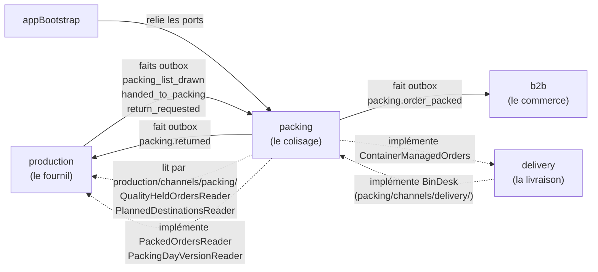
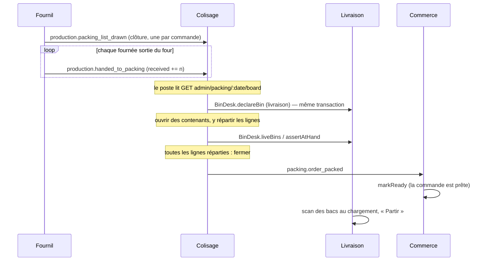
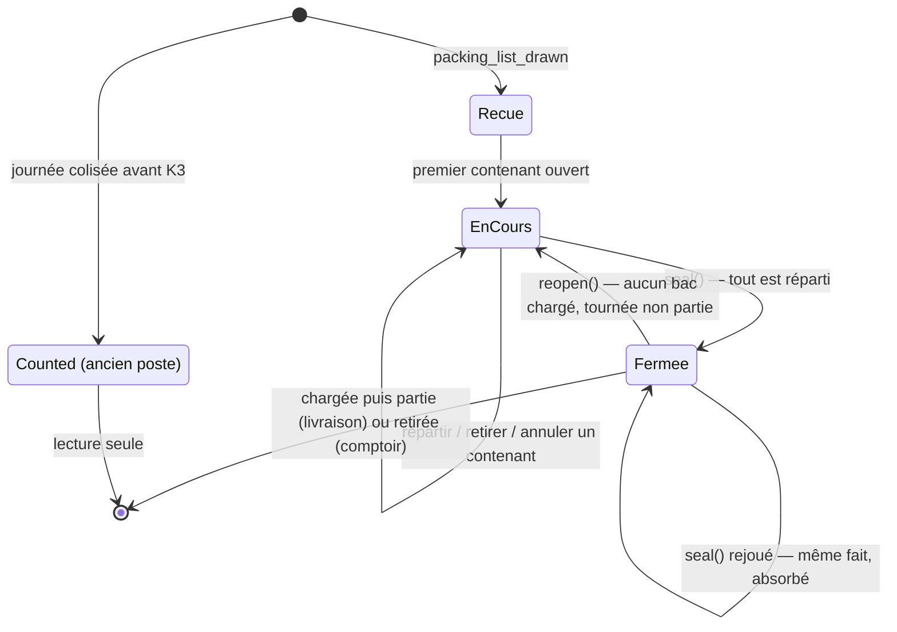

# Le colisage — le bloc `packing`

> **Référence, état du code au 2026-10-05** (après `753f3e4f8`, K3c). Écrite en
> relisant `apps/lfd-api/src/packing/`, `production/channels/packing/`,
> `packing/channels/delivery/`, `prisma/schema/packing.prisma` et l'écran
> `apps/lfd-backoffice-frontend/src/app/production/colisage/`. Elle remplace
> les quatre plans du chantier (domaine, bacs au colisage, poste, « + » qui
> choisit un bac), retirés le même jour.
>
> ⚠️ Le code cite encore les paragraphes de ces plans (« K2b », « §12.2 »,
> « §17.6 »…). Ils vivent dans l'historique git :
> `git show a03a95f50:documentation/colisage/plan-domaine-colisage.md`, et de
> même au commit `a03a95f50` pour les trois autres (`plan-les-bacs-au-colisage`,
> `plan-poste-de-colisage`, `plan-le-plus-choisit-un-bac`). Ce document-ci dit
> ce qui existe ; eux disent pourquoi.

## 1. Le rôle du bloc

Le colisage met les commandes d'une journée **dans leurs contenants** : des
**bacs** pour une livraison, des **sacs** pour un retrait au comptoir. C'est
une **balance** : d'un côté ce que le fournil a sorti du four et remis au
colisage, de l'autre le bon de commande. Quand toutes les lignes d'une
commande sont réparties, le coliseur la **ferme** (« déclarer prête ») et le
commerce la passe `ready`.

Ce que le colisage ne fait pas :

- **produire** — c'est le fournil (`production/`), qui lui remet les pièces ;
- **tenir les bacs physiques** — code court, QR, étiquette, chargement,
  départ : c'est la livraison (`delivery/`). Le colisage tient le **contenu**
  des contenants, la livraison tient le **bac** ;
- **remettre la marchandise** — c'est le retrait (`handover/`).

Le bloc vit dans `apps/lfd-api/src/packing/`, son schéma Postgres est
`packing`, et **personne ne l'importe** : il n'expose que ce que déclarent
les canaux des autres (CLAUDE.md §3).

## 2. Les frontières

| Canal                          | Déclaré par | Ce qu'il porte                                                                                                                                              | Implémenté par                                                                   |
| ------------------------------ | ----------- | ----------------------------------------------------------------------------------------------------------------------------------------------------------- | -------------------------------------------------------------------------------- |
| `production/channels/packing/` | le fournil  | les cinq faits (§2.1), et les lecteurs `QualityHeldOrdersReader`, `PlannedDestinationsReader` (que le colisage lit)                                         | le fournil (`appBootstrap/packing-feed.module.ts`)                               |
| idem                           | le fournil  | `PackedOrdersReader` (« cette commande est-elle colisée ? », pour l'état du jour et le contrôle qualité) et `PackingDayVersionReader` (la version du poste) | le colisage (`PrismaPackedOrdersReader`, `PrismaPackingDayVersionReader`)        |
| `packing/channels/delivery/`   | le colisage | `BinDesk` : déclarer, annuler, partager un bac ; proposer ; contenances ; moitiés libres ; `assertAtHand` (aucun bac chargé ni tournée partie) ; `liveBins` | la livraison (`DeliveryBinDesk`, `appBootstrap/packing-delivery-feed.module.ts`) |
| idem                           | le colisage | `ContainerManagedOrders` : les anciennes routes des bacs de la livraison refusent une commande que le colisage tient                                        | le colisage (`PrismaContainerManagedOrders`)                                     |

`production → packing` et `packing → delivery` restent interdits : le fournil
publie sans savoir qui écoute, et le colisage déclare `BinDesk` sans savoir qui
le branche. `BinDesk` rejoint la transaction de l'appelant : déclarer un bac et
ouvrir le contenant se font dans la même unité de travail.

### 2.1 Les faits

Tous passent par la boîte d'envoi, et leurs abonnés sont des
`@DurableHandler` — un redémarrage ne perd rien, et une même clé ne s'applique
qu'une fois.

| Fait                            | Publié par | Quand                                                             | Abonné                                                                   |
| ------------------------------- | ---------- | ----------------------------------------------------------------- | ------------------------------------------------------------------------ |
| `production.packing_list_drawn` | fournil    | la clôture de la journée : une commande, ses lignes, son échéance | `OnPackingListDrawn` — crée la `packing_order` et ses lignes             |
| `production.handed_to_packing`  | fournil    | une fournée sort du four : des pièces sont remises au colisage    | `OnHandedToPacking` — `received` de la réserve, un reçu par remise       |
| `production.return_requested`   | fournil    | une fournée remise est annulée ou décochée                        | `OnReturnRequested` — rend ce qui n'est pas au bac (`PackingReturnDesk`) |
| `packing.returned`              | colisage   | la réponse à une demande de retour (rendu, éventuellement `0`)    | `OnPackingReturned` (fournil)                                            |
| `packing.order_packed`          | colisage   | une commande est fermée — clé `packing.order_packed:<orderId>`    | `OnPackingOrderPacked` (commerce) — `markReady`                          |

Les trois abonnés du colisage écrivent par `PackingShadowLedger` : le nom date
de l'ombre du premier lot, et reste parce que les noms d'abonnés sont les clés
des reçus déjà posés.

Les gestes sur les contenants sont **journalisés** (pas publiés) :
`packing_container.opened | filled | emptied | voided`, sujet la commande.
Rouvrir une commande ne l'est pas : aucun type de fait n'existe pour lui.

## 3. Le flux d'une journée

1. **La clôture** du fournil publie la liste à coliser : une
   `packing_order` par commande, avec ses lignes. La destination n'y est
   **pas** : le board la lit au fournil par `PlannedDestinationsReader`.
2. **La sortie du four** remet des pièces : la réserve d'un article
   (`packing_stock.received`) monte.
3. **Au poste**, le coliseur ouvre des contenants et y répartit les lignes,
   dans la limite de ce qui est disponible.
4. **Fermer** publie `packing.order_packed` ; le commerce passe la commande
   `ready`.
5. **La livraison** charge les bacs (ils existent chez elle depuis leur
   déclaration au poste) et part. Le chargement et le départ sont décrits dans
   [`chargement-les-bacs.md`](chargement-les-bacs.md) §6.

## 4. Le modèle

### 4.1 `PackingSheet` — la commande au poste

L'agrégat du poste (`domain/entities/packing-sheet.ts`). Il porte la commande,
ses lignes, sa marque de fermeture (`packedAt` / `packedBy`) et ses
contenants (`OrderContents`).

- **`containerMode`** : `listed` (tout ce que le colisage crée) ou `counted`
  (une commande colisée avec l'ancien poste du fournil, avant K3). Une
  commande `counted` est **en lecture seule jusque dans l'agrégat** :
  `seal()` et `reopen()` la refusent (`ContainersCountedError`, « colisée avec
  l'ancien poste : elle ne se modifie plus ici »), et l'écran l'affiche sans
  « Prête » ni « Rouvrir ».
- **`seal(mark)`** — fermer. Refusé tant qu'une ligne n'est pas entièrement
  répartie (`UnallocatedLinesError`). Fermer une commande déjà fermée réannonce
  (`fresh: false`) ; la même clé de fait est absorbée par le commerce.
- **`reopen()`** — rouvrir le **rangement** seulement. Le handler demande
  d'abord à la livraison, dans la même unité de travail, qu'aucun bac vivant ne
  soit chargé ni sa tournée partie (`BinDesk.assertAtHand`). La commande reste
  `ready` au commerce ; aucun fait n'est publié, et la refermer republie la
  même clé.
- Une ligne est « au bac » quand toute sa quantité est répartie entre des
  contenants vivants.

### 4.2 `OrderContents` — les contenants

- **`bag`** — un sac, né au colisage. **Refusé sur une commande livrée**
  (`BagOnDeliveryError`) : livraison = bacs, retrait = sacs.
- **`bin`** — un bac de livraison. Son identifiant, son code court et sa
  moitié (`left` / `right` / entier) sont un **instantané** pris à la
  déclaration par `BinDesk`, sans clé étrangère vers `delivery`.
- **Le demi-bac partagé** : `GET …/shareable-halves` rend les moitiés libres
  d'un bac voisin (la règle d'adjacence est celle de la livraison), et le
  contenant s'ouvre dessus par `POST …/containers`
  (`{ nature: "bin", partnerBinId, innerBags }`). C'est un dernier recours, à
  la main : « Proposer » ne le fait jamais.
- **Répartir** (`allocate`) et **retirer** (`withdraw`, partiel permis) bougent
  une quantité d'un article dans un contenant vivant. Répartir vérifie que le
  bac est encore vivant chez la livraison (`liveBins`).
- **Annuler** un contenant (`voidContainer`) rend son contenu à la réserve ; un
  bac annulé l'est aussi chez la livraison (`BinDesk.voidBin`).
- Le nombre de contenants vivants est borné (`MAX_CONTAINERS_PER_ORDER`).

### 4.3 `PackingStock` — la réserve d'un article pour une journée

L'invariant du colisage : **au bac ≤ reçu − rendu**
(`domain/entities/packing-stock.ts`). `received` monte à chaque remise du
fournil, `returned` à chaque retour accepté, `packed` est la **somme** de ce
qui est dans les contenants, tous confondus. C'est la ligne verrouillée
(`SELECT … FOR UPDATE`) : la mise au bac et le retour passent tous deux par
elle, ce qui empêche deux postes de prendre les mêmes pièces et le fournil de
reprendre ce qui est déjà dans un bac. Répartir plus que le disponible est
refusé (`LineNotProducedYetError`) ; l'écran montre ce qui reste « à
répartir ».

L'ordre des verrous, le même pour tous les gestes : la commande, puis les bacs
chez la livraison, puis la réserve de chaque article dans l'ordre des SKU.

### 4.4 « Proposer »

`GET …/proposal` rend la proposition de la livraison (`BinDesk.propose`) :
froid et sec séparés, le moins de bacs possible, une moitié pour un reste.
`POST …/proposal/apply` l'**applique d'un coup**, en une unité de travail, par
la règle pure `distributeProposal` (`domain/services/proposal-distribution.ts`) :

1. les bacs d'une entrée sont ses `whole` bacs entiers puis sa moitié ; les
   entrées gardent l'ordre de la livraison (froid d'abord) ;
2. chaque bac se remplit avant le suivant, article par article dans l'ordre
   des SKU ; une unité occupe `1 / contenance(type, SKU)` d'un bac, une moitié
   offre 0,5 ;
3. on ne place que ce qui est **disponible** — le reste de la ligne, borné par
   la réserve ; ce qui ne rentre pas ou n'est pas encore sorti reste « à
   répartir » ;
4. un bac proposé naît même vide : la marchandise qui sortira ira dedans.

Refusé si la commande a déjà un contenant vivant
(`packing.proposal.containers_exist`) — une commande dont tous les contenants
sont annulés se repropose — et si la proposition est vide
(`packing.proposal.empty`, renvoi à l'écran « Contenances »).

### 4.5 Les retours

Quand le fournil annule ou décoche une fournée déjà remise, il publie
`production.return_requested`. `PackingReturnDesk` rend **ce qui n'est pas au
bac** (sous le verrou de la réserve), inscrit la réponse dans
`packing.packing_return`, et publie `packing.returned` ; le fournil l'inscrit
sur sa demande. Un retour peut rendre `0`.

### 4.6 `production_day.packing_owner`

Écrit à la clôture d'une journée : `legacy` (l'ancien poste du fournil) ou
`packing`. Depuis K2, la clôture écrit **toujours** `packing`. Le fournil ne
s'en sert plus que pour l'annulation d'une fournée : sur une journée
`packing`, elle passe par une demande de retour ; sur une journée `legacy`,
elle reste immédiate et le fait `return_requested` le dit (`legacy: true`).
Pour tout le reste, une journée `legacy` n'a plus de bac fermé aux yeux du
fournil (`SealedDayReading` demande au colisage pour toute journée).

## 5. Les routes HTTP

Toutes dans `apps/lfd-api/src/packing/http/`, sous la ressource
`production_packing` (`@AdminSurface`) : `read` pour les lectures, `write` pour
les écritures. Les contrôleurs n'injectent que les bus.

| Route                                                  | Effet                                                     | Droit                                                   |
| ------------------------------------------------------ | --------------------------------------------------------- | ------------------------------------------------------- |
| `GET admin/packing/:date/board`                        | le poste entier (`ProductionPackingView`)                 | `production_packing:read` **ou** `b2b_supervision:read` |
| `POST admin/packing/:date/orders/:orderId/containers`  | ouvrir un sac, un bac, ou l'autre moitié d'un bac partagé | `production_packing:write`                              |
| `POST …/containers/:containerId/lines/:sku`            | répartir une quantité                                     | idem                                                    |
| `POST …/containers/:containerId/lines/:sku/withdrawal` | retirer une quantité (partiel permis)                     | idem                                                    |
| `POST …/containers/:containerId/void`                  | annuler un contenant                                      | idem                                                    |
| `GET …/proposal`                                       | la proposition de la livraison                            | `production_packing:read`                               |
| `POST …/proposal/apply`                                | appliquer la proposition, d'un coup (`204`)               | `production_packing:write`                              |
| `GET …/shareable-halves`                               | les moitiés libres d'un bac voisin                        | `production_packing:read`                               |
| `POST admin/packing/:date/orders/:orderId/close`       | fermer — déclarer prête (`204`)                           | `production_packing:write`                              |
| `POST admin/packing/:date/orders/:orderId/reopen`      | rouvrir le rangement (`204`)                              | idem                                                    |

Les écritures rendent peu ou rien : l'écran relit le `board`.

## 6. Les écrans du back-office

- **`/colisage`** (`production_packing:read`) — le poste ouvert sur la liste
  des commandes, au premier niveau du rail ; **`/colisage/:reference`**
  (`production_packing:write`) — le même poste ouvert sur une commande, par le
  QR de la feuille d'atelier. Composant
  `apps/lfd-backoffice-frontend/src/app/production/colisage/` : la liste rangée
  par tournée, dernier arrêt d'abord (`packing-orders`, `packing-rounds`), la
  commande ouverte (`packing-open-order`) avec ses deux colonnes **Produits** et
  **Contenants** (`packing-container-board`), « Proposer », le bouton « Prête
  pour la livraison / le retrait » actif selon `canDeclareReady` du serveur, et
  « Rouvrir le rangement des bacs » sur une commande fermée. Une commande
  `counted` s'affiche en lecture seule : « Commande colisée avec l'ancien
  poste : elle ne se modifie plus ici. » Services :
  `production/packing.service.ts`, `production/packing-containers.service.ts`.
- **La Supervision** (`/supervision`) — sa colonne colisage lit le même
  `board` (`supervision/supervision.service.ts`), sous `b2b_supervision:read`.
- **Les étiquettes** des bacs et le chargement restent des écrans de la
  livraison ([`chargement-les-bacs.md`](chargement-les-bacs.md) §5.3, §6).

## 7. Le schéma Postgres `packing`

`apps/lfd-api/prisma/schema/packing.prisma`. Aucune clé étrangère vers
`production`, `delivery` ni `public` : une commande et un bac y sont des
identifiants opaques plus un instantané.

| Table             | Clé                            | Ce qu'elle tient                                                                               |
| ----------------- | ------------------------------ | ---------------------------------------------------------------------------------------------- |
| `packing_order`   | `(service_day, order_id)`      | la commande reçue : référence, client, mode, échéance, `drawn_at`, fermeture, `container_mode` |
| `packing_line`    | `(service_day, order_id, sku)` | une ligne due, et sa marque « au bac »                                                         |
| `packing_stock`   | `(service_day, sku)`           | la réserve : `received`, `returned`, `packed`                                                  |
| `packing_receipt` | `id`                           | un reçu par remise du fournil (idempotence)                                                    |
| `packing_return`  | `request_id`                   | une demande de retour et sa réponse                                                            |
| `container`       | `id`                           | un contenant : `bag` ou `bin` (+ instantané `bin_id`, `bin_code`, `bin_half`), ouvert / annulé |
| `container_line`  | `(container_id, sku)`          | ce qu'un contenant porte d'un article                                                          |
| `day_change`      | `id` (auto)                    | le journal de version du poste, lu par la relecture des écrans                                 |

## 8. Ce qui reste en base

Aucune colonne n'a été supprimée : pas de suppression en production sans
ordre explicite de Hugo (CLAUDE.md §0). Ces colonnes ne sont plus lues ni
écrites par un geste :

- `production.production_order.packed_at`, `packed_by`, `container_count` et
  `production.production_order_line.packed_*` — l'ancien poste du fournil.
  ⚠️ L'adaptateur de la journée les **recopie** à l'aveugle (`carriedPacking`)
  quand un retirage efface puis recrée les commandes, pour ne pas perdre
  l'historique des journées colisées avant K3 ; l'e2e
  `production-batches-transition` le tient.
- `packing.packing_order.container_count` et `container_mode` (la valeur
  `counted` comprise) — encore lus pour afficher une ancienne commande en
  lecture seule.
- `production.production_day.packing_owner` et la branche `legacy` de
  l'annulation des fournées (§4.6).

Les supprimer est un geste à part, sur ordre de Hugo.

## 9. Reste à faire

- **Côté livraison, retirer les routes de déclaration que le poste n'appelle
  plus** : `POST admin/livraison/colisage/bacs`, `POST …/bacs/partage`,
  `GET …/bacs/partenaires` et `GET admin/livraison/colisage/proposition`. Le
  front ne les appelle plus (vérifié le 2026-10-05 : `delivery-loading.service.ts`
  n'utilise que `GET …/bacs?commande=`, `GET …/bacs/:binId` et
  `POST …/bacs/:binId/annulation`), mais les e2e de chargement et de départ
  bâtissent leurs bacs par elles (`delivery-loading-scene.ts`,
  `delivery-packing*.e2e-spec.ts`, `delivery-my-round-packing.e2e-spec.ts`,
  `gesture-rights.e2e-spec.ts`) ; il faut d'abord les faire coliser au
  colisage. Un lot de la livraison.
- **Retirer le contenu d'un bac chargé** sur une commande encore ouverte n'est
  pas refusé : `withdraw` ne demande pas `assertAtHand` à la livraison (vérifié
  le 2026-10-05 dans `withdraw-from-container.handler.ts`), seuls rouvrir et
  annuler le font.
- **Le refus d'un retour** (rendu `0`) n'est dit nulle part à l'écran du
  fournil : la réponse est en base, la fournée reste comptée. À concevoir avec
  le front.
- **Le balayage de `packing.day_change`** n'existe pas : le journal grossit,
  comme celui du commerce avant son élagueur (`prune-order-day-changes`).
- **La destination** est lue au fournil par `PlannedDestinationsReader` ;
  l'autre voie — la porter dans `packing_list_drawn` et `packing_order`
  (migration additive) — n'est pas tranchée par Hugo.
- **Rouvrir n'est pas journalisé** : aucun type de fait n'existe pour lui.
- **Changer la taille d'un bac** se fait par « annuler » puis un nouveau bac
  (nouvelle étiquette) ; un geste qui garderait le QR n'existe pas.
- **Le semis de dev dépasse la taille d'un fichier** :
  `apps/lfd-api/src/dev/seeding/delivery-day.seed.ts` (469 lignes) et
  `orders.seed.ts` (748 lignes), pour ≲ 300 (CLAUDE.md §6).
- **`apps/lfd-api/dist-seed/`** est une sortie de compilation du semis, hors
  de git et qui ne suit plus les sources (son `src/` date du 2026-09-29) : à
  supprimer du poste.
- **Les noms de l'ombre** (`PackingShadowLedger`) restent, parce qu'ils sont
  les clés des reçus déjà posés.
- **Trier le colisage par échéance de récupération** :
  [`todo-colisage-tri-par-echeance.md`](todo-colisage-tri-par-echeance.md).
