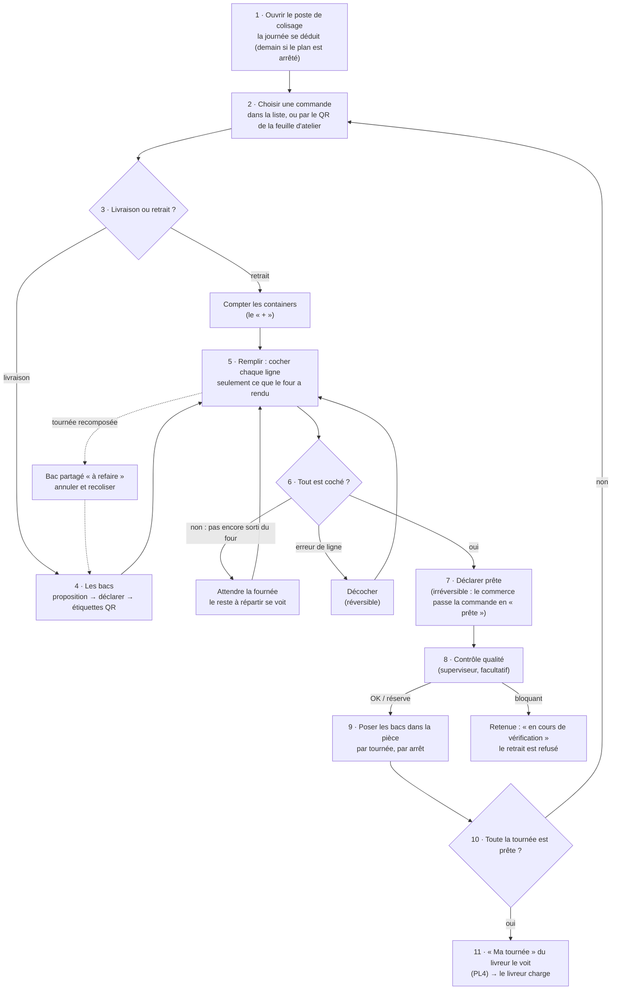

# Le parcours du coliseur — du four au bac posé dans la pièce

> ⚠️ **Périmé pour les étapes 3 à 7 depuis K3 (2026-10-05).** Le poste ne coche
> plus de lignes, n'a plus de compte « + / − » de containers, et ne déclare plus
> les bacs après « prête » : on ouvre des contenants (bacs en livraison, sacs en
> retrait), on y répartit les lignes, puis on ferme. L'état du poste est dans
> [`colisage.md`](colisage.md) ; ce document reste comme trace du parcours et de
> ses questions, tranchées depuis.

> 🗒️ **Document de travail** (2026-10-01), jumeau de
> [`../livraisons/livreur/parcours-du-livreur.md`](../livraisons/livreur/parcours-du-livreur.md), pour réfléchir ensemble
> aux étapes du coliseur. Il s'arrête là où le livreur commence : **les bacs
> d'une tournée posés dans la pièce du coliseur**.
>
> Comme pour le livreur, chaque étape dit **ce qui existe déjà** (✅), **ce
> qui est en cours ou écrit sans être bâti** (🟡) et **ce qui n'existe pas**
> (❌), puis les **questions** (❓). Relu dans le code et les plans le
> 2026-10-01 : le plan du poste de colisage et celui du « + » qui choisit un
> bac (tous deux retirés le 2026-10-05), `chargement-les-bacs.md`,
> `plan-controle-qualite.md`.

## Où on en est (relu le 2026-10-02)

> Le corps du document date du 2026-10-01 et reste tel quel ; ce tableau dit
> ce qui a bougé depuis. Les ❓ ont reçu une **décision par défaut**, à revoir
> avec Hugo : [`../livraisons/tournees/decisions-par-defaut-2026-10-02.md`](../livraisons/tournees/decisions-par-defaut-2026-10-02.md) §2.

| Étape | Avant (2026-10-01)                        | Maintenant                                                                                                                    |
| ----- | ----------------------------------------- | ----------------------------------------------------------------------------------------------------------------------------- |
| 1     | 🟡 droit `production_packing` non déployé | ✅ le poste s'ouvre avec `production_packing` (en production depuis le 2026-10-01)                                            |
| 2     | ❓ ordre de colisage                      | ✅ rangé par tournée, dernier arrêt d'abord (PC2, `507564e72`) — par défaut                                                   |
| 3-4   | 🟡 le « + » choisit un bac                | ✅ un « + » par format, format proposé en couleur, « − » sur le dernier, avertissements froid et aucun bac (PC1) — par défaut |
| 5     | ❓ quel produit dans quel bac             | non, pour l'instant — par défaut                                                                                              |
| 6     | ❓ une ligne qui ne viendra jamais        | le superviseur, hors application (un avenant) — par défaut                                                                    |
| 8     | ❓ voir la retenue qualité                | ✅ badge « Retenue au contrôle » au poste (PC2) ; ✅ le départ refuse une commande retenue (BQ)                               |
| 9     | ❌ / ❓ où poser les bacs                 | ✅ l'étiquette porte la tournée et « Arrêt n » en gros (PC3) ; une zone par tournée — par défaut                              |
| 10    | ❓ l'avancement par tournée               | ✅ « n commandes prêtes sur m » par tournée au poste (PC2) ; ✅ « Ma tournée » côté livreur (PL4)                             |
| 11    | 🟡 PL4 / PL1 en cours                     | ✅ bâtis et en production                                                                                                     |
| ↔     | ❓ prévenu d'un « à refaire »             | ✅ badge « À refaire » au poste (PC2), relu dès que la livraison bouge si le poste a un droit de tournées ou de chargement    |

## Le parcours

## Les étapes

### 1 · Ouvrir le poste de colisage

- ✅ `/production/colisage`, troisième vue du fournil. La journée **se
  déduit** comme celle de la fiche d'atelier : demain si son plan est arrêté,
  aujourd'hui sinon — pas de sélecteur à 4 h du matin.
- ✅ Une seule lecture rend **les deux plateaux de la balance** : la
  ressource sortie du four et les bons de commande, pris au même instant.
- 🟡 Le droit change : aujourd'hui le poste s'ouvre avec `b2b_orders:write` ;
  après la bascule des droits par geste, avec **`production_packing`** (pas
  encore déployé).

### 2 · Choisir une commande

- ✅ Dans la liste du poste, ou en scannant le **QR de la feuille d'atelier**
  qui ouvre `/colisage/:reference` directement sur la commande.
- ❓ **Dans quel ordre coliser ?** Aujourd'hui, l'ordre de la liste. Faut-il
  coliser **par tournée, dernier arrêt d'abord** (l'ordre du chargement), pour
  que les bacs se posent dans la pièce comme ils entreront dans le véhicule ?

### 3 · Livraison ou retrait ?

- ✅ L'écran le sait : « prête pour la livraison » ou « prête pour le
  retrait ».
- ✅ **Retrait** : un compte anonyme de containers (le « + »), figé à la
  fermeture.
- 🟡 **Livraison** : le « + » doit **choisir un bac d'un format** au lieu d'un
  compte anonyme, pour qu'un même objet ne se compte plus deux fois
  (plan du « + » qui choisit un bac, écrit, pas bâti).

### 4 · Les bacs (livraison)

- ✅ **Proposition** du serveur : froid et sec jamais dans le même bac, le
  moins de bacs possible, le demi-bac pour un reste. Les produits sans
  contenance sortent en « Non placés », jamais devinés.
- ✅ **Déclarer** comme proposé, ou « Autre colisage » ; la déclaration fait
  foi. Sacs par bac. Annuler un bac de trop (jamais supprimé).
- ✅ **Étiquettes** : une par bac, QR et code court, réimprimables.
- ✅ **Partage** d'un demi-bac avec un arrêt **consécutif** de la même
  tournée, en dernier recours.
- ❓ **Bacs avant ou après avoir rempli ?** Le parcours déclare les bacs
  d'abord (on sait où poser), mais un coliseur peut préférer remplir puis
  déclarer ce qu'il a vraiment utilisé. L'écran permet les deux ; lequel est
  le geste normal ?

### 5 · Remplir : cocher chaque ligne

- ✅ Cocher une ligne = elle est dans le bac (instant, auteur, initiales).
  **Réversible**.
- ✅ Une ligne **pas encore sortie du four** n'est pas cochable : le refus est
  dans l'agrégat, pas seulement dans l'écran.
- ✅ Le **reste à répartir** se calcule à la lecture (four − lignes cochées) :
  le manque se voit avant qu'il arrive.
- ❌ On ne sait pas **dans quel bac** va chaque ligne : la commande a des bacs,
  pas des lignes rangées par bac. La note sur la **contamination croisée**
  (allergènes) en dépend.
- ❓ Faut-il savoir quel produit est dans quel bac ? Utile pour les allergènes
  et pour le livreur (« le bac froid, c'est lequel ? »), mais c'est un geste de
  plus par ligne.

### 6 · Tout est coché ?

- ✅ « Déclarer prête » ne s'active que quand **toutes** les lignes sont
  cochées.
- ✅ Décocher reste permis (une coche de la fiche d'atelier reprise doit pouvoir
  sortir du bac).
- ❓ **Une ligne qui ne viendra jamais** (fournée ratée, rupture) : aujourd'hui
  la commande ne peut pas être déclarée prête. Qui décide de partir sans —
  le coliseur, le superviseur, le commercial ?

### 7 · Déclarer prête

- ✅ Le fait **irréversible** (`packed_at`). Le fournil publie
  `OrderPackedEvent` ; le commerce en tire `ready`.
- ⚠️ La **route de scan** du QR imprimé ferme sans condition (les papiers en
  circulation ne doivent pas échouer) : l'écran est plus exigeant que la route.

### 8 · Contrôle qualité

- ✅ Le superviseur peut rendre un verdict **OK / réserve / bloquant**, avec
  note et photos, sur une commande colisée (Supervision).
- ✅ Un **bloquant** retient le retrait : « Commande en cours de vérification ».
- 🟡 En **livraison**, la retenue doit passer au livreur par le canal du
  retrait (lot B d'« À la porte ») : aujourd'hui, le livreur ne la voit pas.
- ❓ Le coliseur doit-il **voir** la retenue sur son poste (pour sortir le bac
  de la pièce) ?

### 9 · Poser les bacs dans la pièce

- ❌ Rien n'existe : la pièce n'est pas modélisée.
- ❓ **Où les poser** : une zone par tournée ? par arrêt ? (Le livreur « suit
  le colisage » par tournée puis par arrêt — PL4 —, la pièce pourrait suivre le
  même rangement.)
- ❓ **Froid** : les bacs isothermes vont-ils en chambre froide en attendant
  le livreur ? Si oui, le livreur doit savoir **où** les chercher.

### 10 · Toute la tournée est prête ?

- 🟡 PL4 (en cours) : par tournée, « n arrêts prêts sur m », et pour chaque
  arrêt « en préparation », « n bacs déclarés », « prête ».
- ❓ Le coliseur a-t-il **la même vue** que le livreur (par tournée) sur son
  poste, ou seulement la liste des commandes ?

### 11 · Le livreur prend le relais

- 🟡 « Ma tournée » s'actualise avec l'avancement du coliseur (PL4) ; le
  livreur charge depuis « Ma tournée » (PL1). Tous deux en cours.
- ✅ Pas de geste de « prise en charge » (tranché : le scan au chargement
  suffit).

### En travers : la tournée recomposée

- ✅ Un bac partagé entre deux arrêts qui ne sont plus consécutifs est
  **« à refaire »** (calculé à chaque lecture). « Commencer ma tournée » le
  refuse. Sortie : annuler les deux moitiés et recoliser, ou remettre les
  arrêts côte à côte.
- ❓ Le coliseur est-il **prévenu** quand un de ses bacs passe « à refaire »,
  ou le découvre-t-il au chargement ?

## Ce qu'on mesure tout du long

| Instant                      | Étape | Existe                  |
| ---------------------------- | ----- | ----------------------- |
| sortie du four (par article) | 5     | ✅ fiche d'atelier      |
| ligne mise dans le bac       | 5     | ✅                      |
| bacs déclarés                | 4     | ✅ (jour dans PL4)      |
| commande déclarée prête      | 7     | ✅                      |
| verdict qualité              | 8     | ✅                      |
| bacs posés dans la pièce     | 9     | ❌                      |
| bac scanné au chargement     | 11    | ✅ (côté livreur : PL1) |

Avec ces instants : temps de colisage par commande (première coche → prête),
attente entre « prête » et chargement, et la commande qui retarde une tournée.

## Questions ouvertes

| #   | Étape | Question                                                         |
| --- | ----- | ---------------------------------------------------------------- |
| 1   | 2     | Coliser par tournée, dernier arrêt d'abord ?                     |
| 2   | 4     | Déclarer les bacs avant ou après avoir rempli ?                  |
| 3   | 5     | Savoir quel produit est dans quel bac ?                          |
| 4   | 6     | Une ligne qui ne viendra jamais : qui décide de partir sans ?    |
| 5   | 8     | Le coliseur voit-il la retenue qualité sur son poste ?           |
| 6   | 9     | Où poser les bacs dans la pièce ; le froid en chambre froide ?   |
| 7   | 10    | Le coliseur voit-il l'avancement par tournée, comme le livreur ? |
| 8   | —     | Le coliseur est-il prévenu d'un bac « à refaire » ?              |
