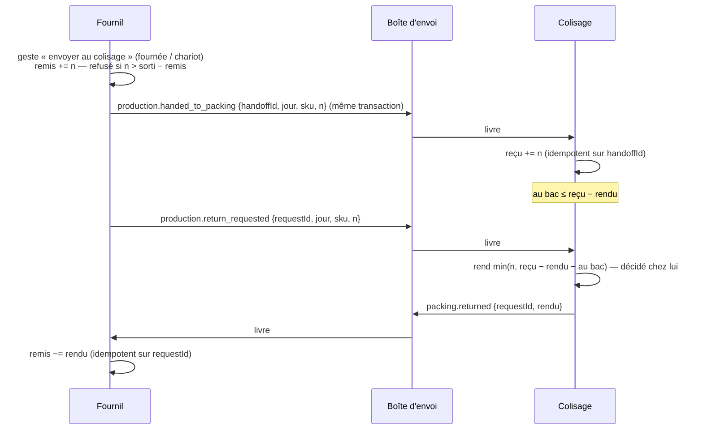

# Le colisage, son propre domaine — plan

> Hugo, 2026-10-04 : « sortir de production, j'ai l'impression que ça mérite son
> propre domaine ». État : **K1 bâti et déployé, K2 bâti** (§14, §15). Le
> texte d'origine (doc-first) suit tel quel.

## 1. Ce qui existe (relu le 2026-10-04)

Le colisage est aujourd'hui **coupé en deux et logé chez deux autres** :

| Morceau                                                             | Où                                                                                 | Écrivain                                              |
| ------------------------------------------------------------------- | ---------------------------------------------------------------------------------- | ----------------------------------------------------- |
| Ligne « au bac » (`packed_at/by/initials`)                          | `production.production_order_line`                                                 | `ProductionDay` (`production-day.packing.ts`, gardes) |
| Bac fermé, nombre de contenants (`packed_at/by`, `container_count`) | `production.production_order`                                                      | `ProductionDay.pack` / `declareContainers`            |
| Annonce « prête » au commerce                                       | `OrderPackedEvent` (`production/channels/commerce`) → `on-order-packed.handler.ts` | production                                            |
| Bacs déclarés, code court, demi-bacs                                | `delivery.delivery_bin`                                                            | livraison                                             |
| Colisage proposé                                                    | `delivery/domain/services/propose-packing.ts`                                      | livraison                                             |
| Écran                                                               | `/production/colisage` (rail Production), droit `production_packing`               | —                                                     |

Le commentaire de `production-day.packing.ts` dit **pourquoi ce n'est pas deux
agrégats** : une ligne ne se met au bac que si elle est **sortie du four**
(`LineNotProducedYetError`, via `availableOf` des fournées) et seulement
journée **arrêtée** (`ProductionDayNotClosedError`). C'est la vraie couture.

## 2. Pourquoi un domaine

- **Sa clé est la commande et le bac**, pas la journée — le motif exact qui a
  sorti `handover` du fournil le 2026-09-10.
- **Un poste, une personne, un rythme** : le coliseur, sa tablette, son QR.
- **Il est déjà à cheval** : le remplissage chez le fournil, les bacs chez la
  livraison. Le domaine réunit ce que la découpe actuelle sépare.

## 3. La forme proposée

- Bloc **`src/packing/`**, schéma Postgres **`packing`**, routes `/packing`,
  rail de premier niveau « Colisage » (l'adresse `/production/colisage`
  redirige ; les QR `/colisage/:reference` déjà imprimés continuent).
- Agrégat **`PackingOrder`** (clé : `orderId` opaque) : lignes au bac
  (réversibles), fermeture (irréversible), contenants.
- **Ce qu'il demande, par canaux qu'il déclare** :
  - `packing/channels/production/` — « ces commandes sont-elles au plan d'une
    journée arrêtée, et combien de chaque SKU est sorti ? » (implémenté par
    `production`) ;
  - `packing/channels/commerce/` — l'annonce « prête » (implémentée par `b2b`,
    qui écoute aujourd'hui `OrderPackedEvent`).
- **Les bacs restent en livraison** pour ce plan : `delivery_bin` est écrit par
  le chargement et porte les déclencheurs de journée de « Ma tournée ». Les
  déplacer est une seconde décision (Q2).

Matrice : `packing → production` port uniquement ; `packing → b2b` port
uniquement ; `delivery → packing` port uniquement si la livraison lit « fermé »
(Q3). Personne ne lit `packing` autrement.

## 4. Les données — trois déploiements (étendre, basculer, resserrer)

Les colonnes sont **sur** des tables du fournil : pas de `SET SCHEMA` possible
comme pour `delivery` (`plan-schema-delivery.md`). Donc copie :

1. **Étendre** — migration additive : `packing.packing_order`,
   `packing.packing_line`, remplies par `INSERT … SELECT` depuis
   `production_order(_line)` ; le fournil continue d'écrire, et
   **écrit aussi** dans les nouvelles (double écriture dans l'adaptateur).
2. **Basculer** — le bloc `packing` devient l'écrivain et le lecteur ; le
   fournil ne lit plus ses colonnes de colisage.
3. **Resserrer** — plus tard, après une requête de comptage donnée à Hugo :
   les colonnes `packed_*` / `container_count` du fournil cessent d'être lues
   (on ne les supprime pas avant un quatrième passage).

Aucune migration n'accorde de droit : `production_packing` reste la ressource
(renommage = migration de valeur, trois temps — pas dans ce plan).

## 5. Questions pour Hugo

- **Q1** : garder la règle « on ne colise que ce qui est sorti du four, journée
  arrêtée » ? (Proposé : oui, lue par le canal production.)
- **Q2** : les bacs (`delivery_bin`) rejoignent-ils le colisage maintenant, ou
  plus tard ? (Proposé : plus tard.)
- **Q3** : la livraison a-t-elle besoin de savoir qu'une commande est fermée
  avant « Partir » ? (À relever dans le code.)

## 6. Lots

| Lot | Contenu                                                           | Migration |
| --- | ----------------------------------------------------------------- | --------- |
| P0  | Rail : Colisage au premier niveau, redirection                    | non       |
| P1  | Bloc `packing`, canaux, agrégat, tables + copie + double écriture | additive  |
| P2  | Bascule de l'écrivain et des lectures                             | non       |
| P3  | Resserrement                                                      | plus tard |

## 7. Contradiction de `vitruve` (2026-10-04)

**BLOQUANTS** — à lever avant P1 :

1. **Double écriture sans mécanisme.** Les écritures actuelles sont des
   `updateMany` conditionnés isolés (`prisma-production-day.repository.ts`),
   et `PackOrderHandler` tranche la course entre deux postes sur leur `count`.
   Une seule base : une `$transaction` sur les deux schémas est possible, et
   l'écriture côté `packing` doit être conditionnée de la même façon.
2. **Fenêtre de déploiement.** L'`INSERT…SELECT` de la migration précède le
   code qui double-écrit : il faut un rattrapage idempotent et une comparaison
   avant P2, décoche comprise.
3. **`day_change`.** Les déclencheurs par instruction sur `production_order(_line)`
   (`20260928140000`) font monter la version du jour à chaque coche ; des tables
   `packing.*` sans `service_day` ne le feraient plus, et
   `day-change-triggers.e2e-spec.ts` ne regarde que `production` et `delivery`.

**SÉRIEUX** :

- **La motivation est fragile.** Contrairement à `handover`, le colisage
  garde deux règles en forme de JOUR (journée arrêtée, quantité sortie du
  four). Sorti, chaque geste devient « vérifier par le canal, puis écrire
  ailleurs », sans verrou — la couture que `production-day.packing.ts` donne
  comme raison d'un seul agrégat.
- **Q3 répondue** : la livraison lit « colisée » par le COMMERCE
  (`OrderStatus.ready`, via `OnOrderPacked`) ; « Partir » bloque sur
  l'étiquetage et le chargement des bacs, pas sur `ready`. Aucune arête
  `delivery → packing`. La chaîne `OrderPackedEvent → ready` doit survivre,
  et b2b l'importe depuis `production/channels/commerce`.
- Routes API déjà servies (`production-packing.controller.ts`,
  `production-supervision.controller.ts`) : à garder. Portes à armer :
  `context-boundaries`, datasource, `prisma-schema-layout`,
  `prisma-model-ownership`, §1 de CLAUDE.md. Irréversible après P2.

**Proposition après contradiction** : bâtir **P0 seul** (le Colisage au
premier niveau du rail ; le QR `/colisage/:reference` l'est déjà). Ne lancer
P1 que si le colisage gagne une règle qui n'est pas en forme de jour —
typiquement si les bacs le rejoignent (Q2) avec la capacité (CA4).

## 8. Pousser plutôt que tirer (Hugo, 2026-10-04)

> « quand tu dis ce qu'il demande, c'est du pull, on ne ferait pas mieux
> d'être push ? »

Oui, et ça répond à l'objection principale du §7. Au lieu que chaque geste
demande au fournil « journée arrêtée ? combien de sorti ? », le fournil
**publie** ses faits et le colisage en tient **sa propre copie** :

- `ProductionDayClosed { serviceDay, commandes et lignes au plan }` ;
- `BatchOutput { serviceDay, sku, quantité sortie }` (et sa correction) ;
- le colisage publie à son tour `OrderPacked`, que le commerce écoute déjà.

La garde lit alors **l'état local** de l'agrégat `PackingOrder`, dans la même
transaction que l'écriture : plus de « vérifier ailleurs, écrire ici ». C'est
la forme de `handover`, qui reçoit la commande au lieu d'aller la lire.

Ce que ça coûte, à trancher avant P1 :

- **Retard de projection** : une fournée tout juste sortie peut être refusée
  une seconde — le geste se rejoue. Acceptable au poste.
- **Fiabilité de la publication** : un événement perdu = une commande jamais
  colisable. Il faut une publication sûre (écrite dans la transaction du
  fournil, puis relayée — boîte d'envoi), pas un `EventBus` en mémoire seul.
  À relever : ce que le dépôt a déjà (le journal ?) avant d'inventer.
- **Rattrapage** : la projection doit pouvoir se reconstruire depuis le
  fournil (au déploiement de P1 et après incident) — ce qui règle aussi le
  BLOQUANT 2 du §7 (fenêtre de déploiement) mieux qu'une double écriture.
- **`day_change`** (BLOQUANT 3) reste à résoudre : la projection garde le
  `service_day`, donc les déclencheurs peuvent l'inscrire.

Avec le push, la **double écriture disparaît** (BLOQUANT 1) : le fournil
n'écrit plus le colisage du tout dès P1 ; il publie, et la bascule se fait
par reconstruction de la projection.

## 9. Contradiction du §8 par `vitruve` (2026-10-04) — et la conclusion

Le push ne tient pas, pour une raison qui n'était pas visible au §7 :

- **L'invariant va dans les deux sens.** Le fournil refuse d'annuler ou de
  décocher une fournée si « sorti − quantité < au bac »
  (`BatchStillPackedError`, `production-day.batches.ts`). « Sorti ≥ au bac »
  est UN invariant, gardé des deux côtés dans UN agrégat. Le couper oblige soit
  à tirer de l'autre côté, soit à croiser deux projections (cycle
  `production ↔ packing`, et une course qui rend le disponible négatif), soit
  à perdre la garde.
- **Aucune publication sûre n'existe** : pas de boîte d'envoi, l'`EventBus`
  est en mémoire (le handler de clôture le dit), le `Journal` n'est pas un
  relais. Une projection devrait se reconstruire en tirant — le pull resterait
  la vérité.
- **« Comme `handover` » était faux** : le retrait tire
  (`handover-queue.reader.ts`), et son JSDoc explique pourquoi il ne copie pas.
- Publier les fournées une à une ferait recopier `production-output.ts`
  (fournées implicites) : deux implémentations d'une règle du fournil.

**Conclusion.** Les DONNÉES du colisage restent dans l'agrégat
`ProductionDay` : c'est le même invariant que les fournées. Ce qui mérite son
propre domaine, c'est le **poste** — une entrée de premier niveau, un
vocabulaire, un écran — pas la table. On bâtit **P0** ; P1–P3 sont abandonnés
tant que « sorti ≥ au bac » existe. À rouvrir si les bacs (`delivery_bin`) et
la capacité (CA4) donnent au colisage une règle qui ne touche pas au four.

## 10. v3 — transférer plutôt que partager (Hugo, 2026-10-04)

> « si ça arrive au colisage on ne peut plus l'enlever du fournil, ça me paraît
> logique ; on pourrait garder au fournil un compte de ce qui est parti et
> qu'on ne peut plus annuler. » Puis : la remise se fait par un **geste**
> (option b).

### 10.1 L'idée : chaque unité appartient à un seul domaine à la fois

Le §9 a écarté la sortie parce que « sorti ≥ au bac » était **une** règle
gardée **des deux côtés**. La v3 la coupe en deux règles, chacune locale à son
propriétaire, reliées par un **transfert** décidé par celui qui donne :

| Domaine                | Ce qu'il possède                 | Sa règle, vérifiée chez lui seul                                |
| ---------------------- | -------------------------------- | --------------------------------------------------------------- |
| Fournil (`production`) | sorti du four, remis au colisage | `remis ≤ sorti` ; on n'annule ou ne corrige que `sorti − remis` |
| Colisage (`packing`)   | reçu, au bac                     | `au bac ≤ reçu − rendu`                                         |

C'est la forme de la garde au retrait : à chaque instant, une seule partie
tient la chose. Une copie en retard ne crée plus d'écart. Au pire, une ligne
reste indisponible le temps que la remise arrive.

### 10.2 Le protocole

- **La remise est un geste du fournil** (option b) : « envoyer au colisage »,
  par fournée ou par chariot. Tant qu'il n'a pas envoyé, il corrige
  librement.
- **Corriger après l'envoi devient une demande de retour.** Le colisage ne
  rend que ce qui n'est pas au bac, et il le décide chez lui. Si tout est au
  bac, il rend 0, et le fournil le voit : la correction demande alors de
  décocher au colisage.
- **Le colisage publie la commande colisée** (`packing.order_packed`), qui
  remplace `production.order_packed` (E1) : l'émetteur change, le commerce
  garde un seul abonné, et le type change de nom.
- **La journée arrêtée** reste une condition. Elle arrive au colisage par
  `production.day_closed` (déjà durable), qui y crée les commandes et leurs
  lignes à coliser.

### 10.3 Les données

- **Fournil** : une table `production.production_handoff` (`id`, `service_day`,
  `sku`, `quantity` signée — positive pour une remise, négative pour un retour
  accepté —, `source` : fournée ou chariot, `at`, `by`, `request_id`). La part
  annulable se calcule : `sorti − Σ quantity`. Les gardes de fournée
  (`BatchStillPackedError`) lisent **cette** somme, et plus ce qui est au bac.
- **Colisage** : schéma `packing`, avec `packing_order` (clé `order_id`
  opaque + `service_day`), `packing_line` (sku, quantité due, au bac, qui,
  quand), `packing_receipt` (une ligne par remise ou retour reçu, clé
  `handoff_id` / `request_id`).
- Les colonnes `packed_*` et `container_count` de `production_order(_line)`
  cessent d'être écrites à la bascule, puis d'être lues ; elles ne sont pas
  supprimées avant un quatrième passage.
- `day_change` : les tables `packing.*` portent `service_day` et reçoivent les
  mêmes déclencheurs ; `day-change-triggers.e2e-spec.ts` couvre le schéma
  `packing`.

### 10.4 La bascule — trois déploiements

1. **Étendre** : tables neuves, vides. Le geste « envoyer au colisage »
   existe ; le colisage lit encore les colonnes du fournil.
2. **Basculer, jour par jour, à une journée non arrêtée.** Une journée déjà
   arrêtée au moment du déploiement finit sur l'ancien chemin. Une journée
   arrêtée après naît au colisage, avec `production.day_closed`. Ainsi,
   aucune journée n'est coupée en deux, et il n'y a aucune copie de données en
   vol.
3. **Resserrer** : plus tard, après une requête de comptage donnée à Hugo.

### 10.5 Ce qui reste ouvert

- **Q4 — le grain du geste** : par fournée, par chariot, ou « tout ce qui est
  sorti pour ce SKU » ? Le chariot n'existe pas encore comme objet ; la
  fournée, oui (`production_batch`).
- **Q5 — un retour refusé faute de stock** (tout est au bac) : alerte au
  colisage, ou simple refus affiché au fournil ?
- **Q6 — la matrice** : `packing` déclare `packing/channels/production/` et
  `packing/channels/commerce/` ; la boîte d'envoi porte les faits ; aucune
  lecture synchrone entre les deux.

## 11. Contradiction de la v3 par `vitruve` (2026-10-04), et la v3.1

**BLOQUANTS, levés :**

1. **`production.day_closed` ne porte que `{serviceDay, closedAt, orderIds}`.**
   Il ne suffit pas à créer quoi que ce soit au colisage. → Un **fait à part**,
   `production.packing_list_drawn`, est publié dans la transaction de la
   clôture. Il porte l'instantané des commandes à coliser : `orderId`,
   référence, client, mode de retrait, et les lignes (SKU, nom, quantité due).
   `day_closed` ne change pas de forme, et le commerce continue de le lire.
2. **Le retirage n'envoie rien au commerce.** Les commandes qu'il absorbe
   n'arriveraient jamais au colisage. → Le retirage publie le même fait,
   `production.packing_list_drawn`, limité aux commandes absorbées, avec une
   clé idempotente par commande.
3. **Les faits arrivent dans le désordre** (le relais trie par
   `next_attempt_at`). Le §10.2 est corrigé : l'ordre n'est **pas** garanti,
   et chaque réception est commutative.
   - Le colisage reçoit les remises dans une **réserve par `(jour, SKU)`**,
     qui ne dépend pas des commandes : une remise qui arrive avant la liste
     à coliser est gardée, et sert quand la liste arrive.
   - La réponse à une demande de retour distingue deux cas :
     - « remise inconnue » : la demande est reprise plus tard ;
     - « refusé, tout est au bac » : la demande est close.

**SÉRIEUX, tranchés :**

- **Une remise devenue message mort fait disparaître des pièces.** Les deux
  postes l'affichent (« 2 remises en souffrance »), avec le rejeu en un
  geste. La carte de santé n'est pas le seul endroit où on la voit.
- **« Sorti » ne doit jamais passer sous « remis ».** Tous les chemins qui
  font baisser « sorti » lisent la somme des remises : l'annulation, la
  décoche, `batchToComplete` et `materialize`. Un test le prouve pour chacun.
- **Un verrou par `(jour, SKU)` côté colisage.** C'est une ligne
  `packing.packing_stock` (reçu, rendu, au bac), modifiée par une écriture
  conditionnée. La mise au bac et le retour passent tous les deux par elle.
  C'est la course du §9, et une seule ligne la ferme.
- **Le cycle de dépendances.** Le fournil déclare
  `production/channels/packing/`, qui définit les deux contrats : les faits
  qu'il publie, et la décision de retour qu'il attend. Le colisage importe ce
  canal et publie dans sa forme. La matrice gagne une seule arête,
  `packing → production`, sur le canal seulement. `production` n'importe
  rien.
- **Le type `production.order_packed` change de nom.** Pendant un
  déploiement, l'abonné du commerce écoute **les deux** types. L'ancien est
  retiré au déploiement suivant, quand plus aucune livraison ne le porte
  (requête de comptage).
- **Le critère de bascule** : une `packing_order` existe pour ce jour. Les
  routes déjà servies et la supervision
  (`get-production-day-status.handler.ts`, `get-production-packing.handler.ts`)
  le lisent, et suivent le bon chemin.
- **Q4 (le grain du geste)** se tranche **avant** l'étape 1 : sans elle,
  rien n'est colisable après la bascule.
- **Irréversible** une fois une journée colisée sur `packing`. Il n'y a pas
  de retour automatique. Une journée de répétition en dev, avec le semis,
  précède le déploiement.

**MINEURS, notés :** le test `day_change` sur `packing` est à écrire. Le
plafond de contenants et le bac scellé deviennent des règles du colisage.
Une ligne peut rester indisponible **indéfiniment** si une remise meurt :
c'est l'affichage aux deux postes qui l'empêche de passer inaperçue.

### 11.1 Tranché par Hugo (2026-10-04)

- **Q5** : une demande de retour impossible (tout est au bac) est un **refus
  affiché au fournil**, sans alerte au colisage.
- **Q4** (le grain du geste) dépend désormais du plan de production par
  échéance (« quelles quantités partielles d'un produit doivent être
  produites à quelle heure ») : si la production se découpe en **vagues**,
  la vague est le grain naturel de la remise. Conception à part, à venir.

### 11.2 La remise est la sortie du four (Hugo, 2026-10-04)

Hugo revient à sa décision du 2026-09-28 (`production/plan-fournees-progressives.md`,
décision 3) : **sortir une fournée, c'est la remettre au colisage**. Le geste
« envoyer au colisage » (option b, §10.2) disparaît. Le fait
`production.handed_to_packing` est publié par la déclaration d'une fournée,
dans sa transaction ; une annulation de fournée devient une demande de retour.
Le grain de la remise est **la vague** (`production/plan-production-par-vagues.md`).

## 12. v4 — la synthèse à bâtir (2026-10-04)

> Hugo, 2026-10-04 : « l'objectif du jour est de séparer le colisage ». Cette
> section rassemble les §10–§11.2 et le plan des vagues (§7.2 : l'échéance
> mène) en un seul texte à bâtir. Elle **remplace** le §6 (lots P0–P3).

### 12.1 Les faits

| Fait (boîte d'envoi)            | Émis par, dans la transaction de                                           | Porte                                                                                                                      |
| ------------------------------- | -------------------------------------------------------------------------- | -------------------------------------------------------------------------------------------------------------------------- |
| `production.packing_list_drawn` | la clôture ; le retirage (commandes absorbées seulement)                   | par commande : `orderId`, référence, client, mode, **échéance** (début du créneau ou fin), lignes (SKU, nom, quantité due) |
| `production.handed_to_packing`  | la déclaration d'une fournée (= la sortie du four, décision du 2026-09-28) | `handoffId`, jour, SKU, quantité                                                                                           |
| `production.return_requested`   | l'annulation ou la décoche d'une fournée **déjà remise**                   | `requestId`, jour, SKU, quantité                                                                                           |
| `packing.returned`              | le colisage, qui décide                                                    | `requestId`, rendu (0 = refus, affiché au fournil) ou « remise inconnue » (reprise plus tard)                              |
| `packing.order_packed`          | la fermeture d'un bac au colisage                                          | remplace `production.order_packed` ; le commerce écoute les deux types pendant un déploiement                              |

Contrats déclarés par le fournil dans `production/channels/packing/`. Seule
arête neuve : `packing → production`, sur ce canal. L'ordre n'est pas garanti :
chaque réception est commutative.

### 12.2 Le colisage

- Schéma `packing` : `packing_order` (clé `order_id` opaque, `service_day`,
  échéance, état, scellé, contenants), `packing_line` (SKU, due, au bac, qui,
  quand), `packing_stock` (`service_day`, SKU : reçu, rendu, au bac — **la**
  ligne verrouillée par la mise au bac et le retour), `packing_receipt`
  (idempotence par `handoffId` / `requestId`).
- **Colisable** : le stock du SKU, attribué aux commandes par échéance
  croissante (la plus proche d'abord), couvre la ligne. Calculé à la lecture.
- Les règles du poste d'aujourd'hui y déménagent : bac scellé, plafond de
  contenants, ligne réversible tant que le bac n'est pas fermé.

### 12.3 Les lots

| Lot                        | Contenu                                                                                                                                                                                                                                                                                               | Migration |
| -------------------------- | ----------------------------------------------------------------------------------------------------------------------------------------------------------------------------------------------------------------------------------------------------------------------------------------------------- | --------- |
| **K1 — étendre, en ombre** | Tables `packing.*` et `production.production_handoff`. Le fournil publie les quatre faits ; le colisage les reçoit et tient ses tables **en ombre**, sans que personne ne les lise. Un écran de contrôle (dev, et la carte de santé) compare l'ombre au colisage réel jour par jour.                  | additive  |
| **K2 — basculer**          | Le poste de colisage écrit dans `packing` pour une journée **non encore arrêtée** au déploiement ; `packing.order_packed` remplace l'ancien fait ; les gardes de fournées lisent `production_handoff` ; routes servies et supervision suivent le critère « une `packing_order` existe pour ce jour ». | non       |
| **K3 — resserrer**         | Les colonnes `packed_*` / `container_count` du fournil cessent d'être lues ; l'ancien type de fait est retiré. Après comptage donné à Hugo.                                                                                                                                                           | plus tard |

**L'ombre (K1) est la répétition** que le §11 demandait : quelques jours de
production réelle où le colisage calcule à côté, sans risque, avant qu'on le
rende réel.

## 13. Contradiction de la v4 par `vitruve` (2026-10-04), et la v4.1

**BLOQUANTS, levés :**

1. **Le critère de bascule « une `packing_order` existe » attrapait les
   journées de l'ombre**, et dépendait d'une livraison asynchrone. →
   **Une colonne `production_day.packing_owner`** (`legacy` | `packing`),
   écrite dans la transaction de la clôture. Le binaire de K1 écrit
   toujours `legacy`, et seul celui de K2 écrit `packing`. Les routes
   servies, la supervision et le poste lisent cette colonne, jamais une
   table de l'ombre. Une journée garde le propriétaire qu'elle a eu à sa
   clôture, ce qui règle aussi le cas d'une journée arrêtée pendant le
   déploiement.
2. **L'annulation devient asynchrone sur une journée `packing`.** →
   - L'annulation ou la décoche pose une remise « retour demandé » et publie
     `return_requested`. Elle **ne baisse pas** « sorti ».
   - Seule la réception de `packing.returned` baisse « sorti », de la
     quantité rendue.
   - La fiche affiche « retour en attente ».
   - Le contrat de `unmark` reste servi tel quel. Sa sémantique, sur une
     journée `packing`, est « retour demandé », et elle est écrite dans son
     JSDoc.
   - Sur une journée `legacy`, rien ne change : l'annulation reste
     synchrone, et elle publie seulement `return_requested` avec
     `legacy: true`. L'ombre l'applique alors sans répondre, puisque le
     fournil a déjà décidé.
3. **La déclaration n'a pas de transaction.** → `record-batch` et
   `mark-worksheet-line` enveloppent `materialize` + `record` + `publish` dans
   une seule unité de travail. **`handoffId` = l'`id` de la fournée** :
   une déclaration en double est absorbée, et le fait ne s'écrit qu'une fois.
   Les fournées implicites (coches héritées) n'existent que sur des journées
   d'avant les fournées, et ne sont **jamais** publiées.

**SÉRIEUX, tranchés :**

- **L'échéance entre dans le snapshot.** Le contrat `ProducibleOrder` du canal
  commerce gagne `dueAt`, calculé par la même règle que V0 : le début du
  créneau (Hugo, 2026-10-04), sinon la fin de l'échéance. Le snapshot de
  `ProductionDay` la garde, pour qu'une republication la retrouve. Pour le
  tri, une commande sans échéance passe **en dernier**.
- **La vague n'est pas portée** par les faits : l'attribution par échéance
  se calcule à la lecture.
- **Ce que l'ombre compare** : le « colisable » seulement, pas les bacs
  faits. La répétition de K2 se fait **aussi en dev, avec le semis**,
  geste par geste, avant le déploiement.
- **K2 reste irréversible** pour une journée colisée sur `packing`.
- **Les portes sont armées avant K1** : la matrice du CLAUDE.md §3,
  `lint:context-boundaries`, les `schemas` du `datasource`,
  `prisma-schema-layout`, `cross-schema-join` et `durable-cross-block`.

**MINEURS** :

- La réannonce de clôture republie aussi `packing_list_drawn`. C'est
  idempotent, puisque la clé est la commande.
- « Remise inconnue » : c'est le colisage qui garde la demande en attente,
  et il répond quand la remise arrive. Le fournil ne republie rien.
- La requête de comptage de K3 sera écrite dans le lot K3.

## 14. K1 bâti (2026-10-04) — ce qui a été tranché en bâtissant

- **Portes armées d'abord** : `packing` dans `BLOCK_OF`, `ALLOWED` et
  `PORT_SURFACE` (`packing → production` par `production/channels/packing/`
  seulement) de `lint:context-boundaries`, dans les blocs de
  `lint:prisma-model-ownership`, et dans les `schemas` du `datasource` (que
  `prisma-schema-layout` et `cross-schema-join` lisent). `durable-cross-block`
  lit le bloc dans le chemin : rien à y déclarer. CLAUDE.md §3 porte la ligne
  et la colonne. Le compteur d'opérations par schéma
  (`platform/database/schema-ops.counter.ts`) a gagné les cinq modèles.
- **Un fait `packing_list_drawn` PAR COMMANDE**, clé
  `production.packing_list_drawn:<jour>:<orderId>` : la réannonce republie les
  mêmes clés (absorbées), le retirage n'écrit que les commandes absorbées.
- **`dueAt` est un `HH:mm`** (`string | null`), calculé par `dueClockOf`,
  exporté de `deadline-thresholds.ts` — une seule règle pour le compte à
  rebours et le snapshot. Colonne `production_order.due_at`, nulle pour les
  commandes inscrites avant.
- **Le retour** : `requestId = return-<id de la fournée>`, une ligne
  `production_handoff` négative, et `return_requested` publié seulement si la
  fournée avait été remise (une fournée d'avant K1 ou implicite ne demande
  rien). Un `return_requested` `legacy: false` reçu par K1 **échoue** (message
  mort visible) plutôt que d'être tranché ou perdu.
- **La comparaison** passe les deux côtés par la même attribution : stock
  « sorti du four » (coches héritées comprises) côté fournil, « reçu − rendu »
  côté ombre. Une fournée d'avant le déploiement se voit en écart, c'est
  attendu. Route : `GET /admin/packing/shadow?date=`, sous `production_packing`.
  Le fournil la sert par un port publié, `LegacyPackingReader`, relié par
  `apps/lfd-api/src/appBootstrap/packing-feed.module.ts`.
- **Non fait, et dit** : pas de journal `packing.day_change` ni de
  déclencheurs sur les tables `packing.*` (§10.3, §11 MINEURS) — aucune
  lecture de version en K1, et un journal sans balayage grossirait. À poser
  avec K2. Le contrat `packing.returned` n'est pas encore déclaré : K1 ne
  répond à aucun retour.

## 15. K2 bâti (2026-10-04) — basculer, sans interrupteur

> Hugo, 2026-10-04 : « on bascule direct ». Pas d'interrupteur ni de réglage
> d'exécution : **toute clôture faite par ce binaire écrit `packing_owner =
'packing'`**. Une journée arrêtée avant le déploiement garde `legacy` et
> finit sur l'ancien poste, que le code sert encore (K3 le retirera).

### 15.1 Irréversible au déploiement, et ce qu'un retour arrière demanderait

Le premier soir qui suit le déploiement, la journée arrêtée naît au colisage :
ses bacs, ses lignes au bac, ses containers et ses retours ne sont écrits
**que** dans `packing.*` et `production.production_return_request`. Les
colonnes `packed_*` / `container_count` du fournil restent vides pour elle.

Redéployer le binaire de K1 sur une journée `packing` en cours ne la rend pas
à l'ancien poste : il lirait les colonnes du fournil (vides) et montrerait un
poste où rien n'est au bac, alors que des bacs sont fermés et des commandes
prêtes chez le commerce. Un retour arrière demanderait donc, **à la main et
journée par journée** :

1. de ne le faire que sur des journées dont aucun bac n'est fermé — sinon le
   commerce a déjà annoncé « prête » sur un bac dont l'ancien poste ne sait
   rien ;
2. de recopier `packing.packing_line.packed_*` et `packing.packing_order`
   (`packed_*`, `container_count`) vers `production.production_order(_line)`,
   puis de passer `packing_owner` à `legacy` — une migration de données, donc
   `vitruve` d'abord ;
3. de trancher les demandes de retour sans réponse
   (`production_return_request.answered_at IS NULL`) : l'ancien binaire ne lit
   pas cette table, et la fiche les compterait encore comme sorties.

Le schéma, lui, s'enlève (migration en avant, décrite en tête de
`20261004200000_la_bascule_du_colisage`) une fois aucune journée `packing`
en cours.

### 15.2 Ce qui a été tranché en bâtissant

- **Le poste reste servi par le fournil**, à ses adresses (celles des QR
  imprimés), contrats inchangés. Sur une journée `packing`, le fournil garde ses
  refus structurels (journée arrêtée, référence au plan) et remet le geste au
  colisage par un port qu'il **déclare** et que le colisage **implémente** :
  `PackingStation` (écriture) et `PackingStationReader` (lecture), dans
  `production/channels/packing/`, reliés par `PackingFeedModule`. Même figure
  que `production/channels/handover/`. Aucune arête neuve dans la matrice.
- **Les règles du bac ont déménagé** dans deux agrégats du colisage :
  `PackingSheet` (scellé, ligne réversible, plafond, total) et `PackingStock`
  (`au bac ≤ reçu − rendu`, verrou `FOR UPDATE` sur `packing_stock`). Mêmes
  **codes** et mêmes messages que l'ancien poste (`production.packing.*`) :
  l'écran ne voit pas la différence. Un refus neuf : la commande pas encore
  arrivée au colisage (`packing.order.not_drawn_yet`, 409, « réessayez »).
- **Ordre des verrous** : journée du fournil → bac → réserve. La décision d'un
  retour ne prend que la réserve, la réponse au fournil que la journée.
- **`packing.order_packed`** est déclaré dans `production/channels/packing/`,
  ré-exporté par `production/channels/commerce/` (la seule surface du commerce
  vers le fournil), même charge que `production.order_packed`. Le commerce a
  deux abonnés (`OnOrderPacked`, `OnPackingOrderPacked`).
- **Le retour sur une journée `packing`** : l'annulation ou la décoche d'une
  fournée remise écrit `production_return_request` et publie
  `return_requested` (`legacy: false`, avec `handoffId` — champ ajouté au
  contrat, requis seulement hors `legacy`). L'identifiant est neuf à chaque
  demande (`return-<ULID>`) : un refus se redemande après la décoche au
  colisage (§10.2). Une seconde demande pendant qu'une attend est refusée
  (`production.batch.return_pending`). Le colisage tranche
  (`min(demandé, reçu − rendu − au bac)`), garde en attente une demande dont la
  remise n'est pas arrivée (`packing.packing_return`), et répond par
  `packing.returned`. Le fournil, à la réception : une remise négative de ce
  qui est rendu ; la fournée s'annule si elle a tout rendu, sinon elle compte
  pour le reste (`returned` sur la fournée, déduit de « sorti »).
- **Une fournée jamais remise** sur une journée `packing` s'annule tout de
  suite : le colisage ne l'a pas.
- **« Retour en attente »** : `pendingReturn` ajouté à `WorkshopLine` et à
  `WorkshopBatch` (facultatif dans le TYPE, comme `qualityHeld` : le serveur
  l'envoie toujours).
- **La journée telle que le poste la voit** (`PackedDayReading`) : le poste,
  la supervision, l'état de la journée **et le contrôle qualité** (« la
  commande est-elle colisée ? ») lisent les bacs au colisage sur une journée
  `packing`. Le contrôle qualité n'était pas dans la liste du §11 ; sans lui,
  un verdict sur une commande colisée était refusé.
- **La version du jour** (`GET admin/production/version`) additionne le journal
  du fournil et celui du colisage (`packing.day_change`, ses déclencheurs sur
  les cinq tables `packing.*`) : sans quoi le poste ne voyait plus bouger ses
  propres gestes. Le contrat se compare par égalité.
- **Le semis de dev** joue la journée du jour au colisage : il attend la boîte
  d'envoi (`SeedContext.settle`) avant de mettre au bac, et reprend une fournée
  de trop (`seed-retour-<jour>`). Le rechargement vide aussi les remises, les
  demandes de retour et les tables `packing.*` — il échouait sinon dès la
  première fournée remise (clé `Restrict` posée en K1).
- **La répétition** : `apps/lfd-api/test/packing-switch.e2e-spec.ts` joue la même journée
  sur l'ancien poste (journée rendue `legacy` en base : depuis K2, aucune
  clôture ne la fait plus naître) et sur le colisage, et compare ce que
  l'écran et le commerce en voient ; les faits diffèrent, et c'est écrit.

### 15.3 Non fait, et dit

- **Le refus d'un retour** (rendu `0`, Q5) n'a pas de champ sur la fiche : la
  réponse est en base (`production_return_request.returned`), la fournée reste
  comptée, mais rien ne le DIT à l'écran. À concevoir avec le front.
- **Le balayage de `packing.day_change`** n'existe pas : le journal grossit
  comme `production.day_change` avant le sien.
- **Les noms de K1** (`PackingShadowLedger`, `packing.shadow.*`) restent : les
  noms d'abonnés sont les clés des reçus déjà posés.

## 16. « Sauvage » — plier le colisage d'une traite (Hugo, 2026-10-04)

> « pas besoin des trois temps, on peut faire sauvage, je suis pré-release,
> on gagne du temps. »

- **Plus de double service** : l'ancien chemin `legacy` (poste du fournil,
  `production.order_packed`, colonnes `packed_*` / `container_count` du
  fournil, compte « + / − » des contenants, déclaration des bacs après
  « prête ») est **retiré du code** en une fois, avec ses routes et ses champs
  de contrat. Une journée `legacy` restante n'est plus colisable : accepté,
  pré-release.
- **Le poste parle directement au colisage** (K3a) : plus de détour par le
  fournil ni de port `PackingStation`.
- **Ce qui reste, par règle et non par prudence** : aucune colonne n'est
  supprimée en base (« pas de suppression en production »). Les colonnes
  mortes cessent d'être lues et écrites ; leur suppression est un geste à part,
  sur ordre explicite de Hugo.
- Ordre de construction, **un constructeur, à la suite** : finir K2b → suite
  de K2b (« Proposer » bac par bac et atomique, moitié partagée, retrait
  partiel, rouvrir une commande) → K3 sauvage. Un seul déploiement à la fin.

## 17. K3 — le colisage sert son poste, l'ancien chemin disparaît (plan, 2026-10-04)

> Suite du §16 (« sauvage »). K2b et sa suite sont bâtis. Relu dans le code le
> 2026-10-04 : `get-production-packing.handler.ts` (le fournil compose le
> poste : son plan, `packedDayReading`, le contrôle qualité, les auteurs, puis
> `overlayStation` pose le colisage par-dessus) ; `PackingStation` /
> `PackingStationReader` (déclarés par le fournil, implémentés par le colisage) ;
> les handlers `mark` / `unmark` / `pack` / `declare` / `step` du fournil, qui
> refusent puis délèguent.

### 17.1 Qui sert quoi

| Ce que montre le poste                      | Propriétaire                             | Comment le colisage l'obtient                                                                                                             |
| ------------------------------------------- | ---------------------------------------- | ----------------------------------------------------------------------------------------------------------------------------------------- |
| Commandes, lignes, échéances, destination   | colisage (reçu par `packing_list_drawn`) | ses tables                                                                                                                                |
| Contenants, répartitions, fermeture, auteur | colisage                                 | ses tables ; l'auteur par `staff`                                                                                                         |
| Disponible par SKU, « À répartir »          | colisage (`packing_stock`)               | ses tables                                                                                                                                |
| Commandes retenues par le contrôle qualité  | **fournil**                              | un lecteur que le fournil publie dans `production/channels/packing/` (`QualityHeldOrdersReader`) — arête existante `packing → production` |
| Jour arrêté, heure de clôture               | fournil                                  | idem, ou déjà dans la liste à coliser                                                                                                     |

Aucune arête neuve. Le fournil ne lit plus le colisage pour composer le poste.

### 17.2 Ce qui change

- **Lecture** : `GET /admin/packing/:date/board`, servie par le colisage, même
  forme que `ProductionPackingView` (le front change d'URL, pas de forme).
- **Écritures** : toutes au colisage, sous `admin/packing/:date/orders/:orderId/…`
  (répartir, retirer, contenants, proposer, **fermer** = déclarer prête,
  **rouvrir**). Les routes du fournil `production/packing/*` disparaissent, avec
  leurs handlers et le port `PackingStation`.
- **Les lecteurs qui restent côté fournil** : la Supervision, l'état du jour et
  le contrôle qualité demandent « cette commande est-elle colisée ? » par un
  port étroit que le fournil déclare et que le colisage implémente
  (`PackedOrdersReader`, la forme de `PackingStationReader` réduite à ce
  besoin).
- **Rouvrir (Hugo, option b)** : un geste du colisage sur une commande
  fermée, refusé si un de ses bacs est chargé ou sa tournée partie (`BinDesk`).
  Il rouvre le **rangement** seulement : la commande reste « prête » au
  commerce, aucun fait n'est publié ; la refermer ne republie pas
  `packing.order_packed` (même clé).

### 17.3 Ce qui est retiré du code (« sauvage »)

Le poste du fournil et ses handlers ; `production.order_packed` et son abonné
`OnOrderPacked` ; `PackingStation` et `overlayStation` ; les lectures et
écritures de `packed_*` / `container_count` du fournil ; `PackingContainerStep`
et le compte « + / − » ; `container_mode` (tout est « listé » ; une commande
encore `counted` n'est plus colisable) ; l'ombre de K1 (`PackingShadowLedger`
reste le nom des reçus déjà posés — voir le code, pas renommé) et sa route de
comparaison ; `LegacyPackingReader` ; la déclaration des bacs après « prête »
pour une commande du colisage ; les fixtures `asLegacyPacking` /
`asCountedContainers` et les tests qui ne testent que l'ancien chemin.
**Aucune colonne supprimée en base.**

### 17.4 Lots

| Lot | Contenu                                                                                                                |
| --- | ---------------------------------------------------------------------------------------------------------------------- |
| K3a | Serveur : `board` servi par le colisage, fermer / rouvrir au colisage, `QualityHeldOrdersReader`, `PackedOrdersReader` |
| K3b | Écran : le poste lit `admin/packing/:date/board` et écrit au colisage ; « Rouvrir »                                    |
| K3c | Retrait du code mort (§17.3), portes, CLAUDE.md §3 si une ligne de matrice change                                      |

Un déploiement pour les trois. Pas de `vitruve` : aucune frontière neuve,
aucune migration de données ; les affirmations ci-dessus ont été rouvertes dans
le code.

### 17.5 K3a bâti (2026-10-05) — ce qui a été tranché en bâtissant

- **Routes ajoutées** (sous `production_packing`, aucun droit neuf) :
  `GET admin/packing/:date/board` (`ProductionPackingView`, même forme que
  `GET admin/production/packing?date=`), `POST admin/packing/:date/orders/:orderId/close`
  et `…/reopen` (`204`, l'écran relit le poste). L'ancien chemin reste servi
  jusqu'à K3c.
- **Ce que le colisage compose lui-même** : bacs, lignes, contenants, réserve
  (ses tables) ; le compte à produire = la somme des quantités dues de la liste
  à coliser (la règle `countOf` du fournil) ; l'heure de clôture = le premier
  `drawnAt` reçu (la clôture publie la liste avec son instant). Une journée dont
  la liste n'est pas encore arrivée se lit « plan non arrêté ».
- **⚠️ La destination n'est PAS dans la liste à coliser**, contrairement au
  tableau du §17.1 (vérifié le 2026-10-05 : ni `PackingListDrawnEvent`, ni
  `packing_order`). Elle est lue au fournil par un port qu'il publie,
  `PlannedDestinationsReader`, à côté de `QualityHeldOrdersReader`. L'autre voie
  — étendre le fait et la table (migration additive) — reste à trancher par Hugo.
- **`PackedOrdersReader`** (déclaré par le fournil, implémenté par le
  colisage) sert l'état du jour et le contrôle qualité, par `SealedDayReading`.
  `PackedDayReading` ne sert plus que l'ancien poste (retiré en K3c).
- **La Supervision n'a pas basculé** : sa colonne « colisage »
  (`GET admin/supervision/packing`) sert le poste ENTIER, que
  `PackedOrdersReader` ne peut pas rendre. Elle lit l'ancien handler jusqu'à
  K3c ; la route à lui donner (le `board` du colisage sous `b2b_supervision`)
  est à trancher.
- **Rouvrir** : `PackingSheet.reopen()` ; la livraison vérifie d'abord, dans la
  même unité de travail, qu'aucun bac vivant n'est chargé ni sa tournée partie
  (`BinDesk.assertAtHand`, qui réutilise la règle de l'annulation d'un bac).
  Refermer publie la même clé `packing.order_packed:<orderId>`, absorbée. Fermer
  un bac déjà fermé réannonce, comme l'ancien rescan. Rouvrir n'est pas
  journalisé : aucun type de fait n'existe pour lui.

### 17.6 Tranché par Hugo pour K3c (2026-10-05)

- **La colonne colisage de la Supervision** lit le board du colisage
  (`GET /admin/packing/:date/board`), ouvert aussi au droit
  `b2b_supervision:read` ; la route `GET admin/supervision/packing` et son
  handler du fournil disparaissent avec l'ancien chemin.
- **Une commande encore `counted`** s'affiche en lecture seule avec un court
  message : « Commande colisée avec l'ancien poste : elle ne se modifie plus
  ici. »

### 17.7 K3c bâti (2026-10-05) — l'ancien chemin retiré

**Retiré du code** (rien en base) :

- **Le poste du fournil** : `ProductionPackingController` entier
  (`GET admin/production/packing`, coche, décoche, total et « + / − » des
  containers), la route `POST admin/production/batch/:date/sheets/:reference/packed`,
  leurs commandes et handlers (`mark`/`unmark`-packing-line, `pack-order`,
  `declare`/`step`-packing-containers), `GetProductionPacking*`, le calcul du
  poste côté fournil (`production-packing.ts`, `packing-container-list.ts`),
  `PackedDayReading`, `overlayStation`, les gardes de colisage de la journée
  (`production-day.packing.ts`, `pack()`, `lineToPack`, `availableOf`…) et
  leurs erreurs mortes.
- **`PackingStation` / `PackingStationReader`** (canal), `PackingStationService`,
  `PrismaPackingStationReader`.
- **`production.order_packed`** (`OrderPackedEvent`) et son abonné
  `OnOrderPacked`. Le parseur de charge a suivi le fait restant :
  `PackingOrderPackedEvent.fromPayload`, lu par `OnPackingOrderPacked`.
- **L'ombre de K1** : la route `GET admin/packing/shadow`, sa requête, son
  lecteur, `shadow-comparison`, `packable`, et `LegacyPackingReader`.
  `PackingShadowLedger` reste : c'est l'écriture des trois abonnés, et le nom
  des reçus déjà posés.
- **La Supervision** lit `GET admin/packing/:date/board` (ouvert à
  `production_packing:read` **ou** `b2b_supervision:read`) ;
  `GET admin/supervision/packing` est retirée.
- **Contrats** : `PackingContainerStep`, `markPackingLineSchema`,
  `setPackingContainersSchema`, `ProductionPackingAck`.
- **Écran** : la coche (`toggled`), le « + / − » (`step`), `packingMarkKey`, la
  rangée « + format » et le panneau des bacs après « prête »
  (`PackingBinRow`, `PackingBins`), leurs fonctions pures et les appels du
  service de livraison qu'eux seuls faisaient (`declareBins`, `shareBin`,
  `freeHalves`, `packingProposal`).
- **Le compte de containers du fournil** : le port d'écriture perd
  `markPacked`, `markPackedLine`, `recordContainerCount`, `stepContainerCount`.

**Tranché en bâtissant** :

- **Une commande `counted` est en lecture seule jusque dans l'agrégat** :
  `PackingSheet.seal()` et `reopen()` la refusent (`packing.containers.counted`,
  message réécrit : « colisée avec l'ancien poste : elle ne se modifie plus
  ici »), et `canDeclareReady` y vaut `false`. L'écran l'affiche avec ce
  message, sans « Prête » ni « Rouvrir ».
- **Les colonnes `packed_*` / `container_count` du fournil** ne sont plus lues
  par le domaine ni écrites par un geste. **Mais `save` les recopie** : le
  retirage efface puis recrée les commandes de la journée, et les journées
  colisées avec l'ancien poste les portent — sans recopie, un retirage aurait
  effacé un historique réel (CLAUDE.md §0). Recopie aveugle, dans
  l'adaptateur seul (`carriedPacking`) ; l'e2e
  `production-batches-transition` la tient.
- **`SealedDayReading` demande au colisage pour TOUTE journée** : une journée
  `legacy` n'a plus de bac fermé aux yeux du fournil (état du jour, contrôle
  qualité). C'est le « une journée `legacy` restante n'est plus colisable »
  du §16.
- **La garde « déjà au bac » des fournées** (`BatchStillPackedError`) est
  retirée : elle lisait les lignes au bac du fournil. Sur une journée
  `packing`, annuler ou décocher une fournée remise demande un retour, et le
  colisage ne rend que ce qui n'est pas au bac. Sur une journée `legacy`,
  l'annulation reste immédiate et n'a plus de garde.
- **Le semis de dev** colise au colisage : un sac au comptoir, des bacs ouverts
  par la colonne Contenants pour les livraisons (la tournée est composée
  AVANT, pour que le partage d'une moitié trouve son voisin), puis la
  tournée chargée. Plus aucune commande `counted` n'en sort.

**Reste, volontairement** :

- **En base** : `production_order.packed_at` / `packed_by` /
  `container_count`, `production_order_line.packed_*`,
  `packing_order.container_mode` (valeur `counted` comprise), et
  `production_day.packing_owner`. Aucune colonne supprimée, aucun `DROP` ; leur
  suppression est un geste à part, sur ordre de Hugo.
- **La déclaration des bacs par la livraison** (`POST/partage/partenaires`
  sous `admin/livraison/colisage/bacs`) : l'écran du colisage ne l'appelle
  plus, mais la livraison s'en sert encore — ses e2e de chargement et de
  départ bâtissent leurs bacs par elle, sur des commandes que le colisage ne
  tient pas. La retirer est un lot de la livraison.
- **`packing_owner` et la branche `legacy` des fournées** (annulation
  immédiate, `return_requested` `legacy: true`) : hors de la liste du §17.3.
