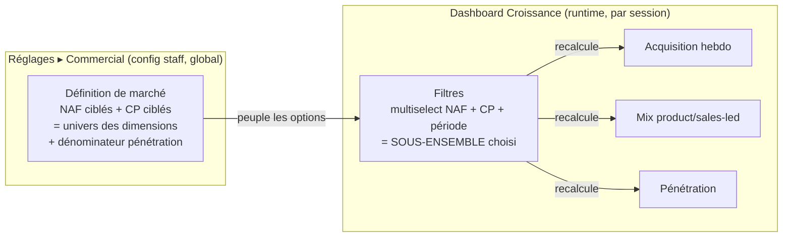

# Commercial Data — le système analytique (v1 : Acquisition)

> **Public** : produit + tech (cadrage) + commercial (lecture). Ce doc décrit le
> **système de mesure** du dashboard **Croissance** (admin B2B) : comment on
> transforme le journal d'événements en visualisations **filtrables**. Il est le
> pendant _mesure_ du doc _action_
> [`espace-commercial-prospects-leads.md`](espace-commercial-prospects-leads.md)
> (cockpit / reco). La pénétration de marché et sa config (CP + NAF) sont posées
> ici comme **une mesure parmi d'autres**, pas comme une fonctionnalité isolée.
>
> **Statut** : v1 cadre l'**Acquisition**. Activation / rétention / expansion
> viendront en sections suivantes, sur le même modèle.

## 0. Le principe : dimensions × mesures (un cube, pas N graphes)

Le piège d'un dashboard, c'est d'empiler des graphes _one-off_ : chacun répond à
une question figée, aucun ne se recoupe. La cible est l'inverse — **un seul cube**
que le commercial **tranche** :

- **Mesures** = _quoi_ on compte (acquisition hebdo, mix product/sales-led,
  pénétration…). Chacune est une **fonction pure** du journal (+ read-models).
- **Dimensions** = _selon quoi_ on découpe. Un **jeu de sélecteurs partagé** en
  tête de dashboard : **NAF** (multiselect), **code postal / zone** (multiselect),
  **période**. On choisit un segment → **toutes** les mesures se recalculent pour
  ce segment.

| Dimension          | Valeurs possibles                         | Source des options                    |
| ------------------ | ----------------------------------------- | ------------------------------------- |
| NAF                | codes NAF ciblés                          | **définition de marché** (Réglages)   |
| Code postal / zone | CP ciblés                                 | **définition de marché** (Réglages)   |
| Période            | 4 / 13 / 52 semaines, ou plage            | presets front                         |
| _(dérivé)_ Origine | product-led / sales-led                   | `payload.via` du journal              |

> **Règle d'or** : une mesure n'est jamais couplée à un graphe. Elle produit une
> **série filtrable** ; le composant `<app-chart>` (ECharts) n'est qu'un
> _renderer_. Ajouter un découpage = ajouter une dimension au filtre, pas
> réécrire la mesure.

## 1. Le nerf de la guerre : l'attribution (CP, NAF)

**Découper par NAF/CP suppose que chaque entité acquise porte un couple (CP, NAF).**
Audit honnête de ce qu'on a **aujourd'hui** :

| Entité acquise        | CP                          | NAF                | SIRET |
| --------------------- | --------------------------- | ------------------ | ----- |
| Société (`Company`)   | ✅ adresse _facturation_    | ❌ **non stocké**  | ✅    |
| Lead (cold)           | ❌                          | ❌                 | ⚠️ opt |
| Inscrit sans société  | ❌ (pas encore de société)  | ❌                 | ❌    |

Dans le journal, un `ActivityEvent` porte `subjectType` (`user` \| `company` \|
`lead`) et `establishmentId` (rattachement société, **nullable**, rempli par
l'identity resolution). Conséquences directes :

1. **Le CP est découpable** pour les faits **rattachés à une société**
   (`establishmentId → Company.address.codePostal`). Pas pour une inscription nue
   ni un lead sans adresse.
2. **Le NAF n'est stocké nulle part.** Il faut le **matérialiser**. Source :
   `Company.siret` → API `recherche-entreprises` (déjà branchée via
   `MarketDirectory`, qui expose `activite_principale`). ⇒ nouveau champ
   **`Company.nafCode`**, résolu **dès la saisie / modification du SIRET**
   (même sur une société `pending`), + backfill one-shot de l'existant (**D1**).
   On accepte de payer l'appel API pour des dossiers qui n'aboutiront pas — le
   NAF est ainsi disponible au plus tôt, jamais résolu au read-time.
3. **L'acquisition « personne » (inscription) précède la société** → elle **ne
   peut pas** être découpée par NAF/CP tant que la personne n'est pas rattachée.
   Toute mesure filtrée les range dans un bucket explicite **« non attribué »**
   (**D2** : ne jamais faire mentir le total — on montre la part qu'on ne sait
   pas encore segmenter).

### Définition de marché ≠ filtre du dashboard

Deux objets qu'il ne faut pas confondre — ils partagent les mêmes _valeurs_ (NAF, CP)
mais jouent deux rôles :

- **Définition de marché** (Réglages) : les NAF + CP **ciblés**. C'est la config
  globale, staff-owned, qui sert **à la fois** de dénominateur à la pénétration
  **et** d'**univers** des valeurs de filtre (on ne tranche que par des segments
  qu'on a définis et comptés).
- **Filtres** (dashboard) : une **sélection runtime** d'un sous-ensemble de cet
  univers. Options peuplées depuis la définition de marché. Pas de saisie libre.

## 2. Acquisition — les mesures v1

Trois mesures, toutes filtrables par (NAF, CP, période) selon les règles §1.

### 2.1 Acquisition hebdomadaire _(existe — à composer avec la pénétration)_

- **Quoi** : inscriptions, premières commandes, leads saisis par semaine.
- **Source** : journal (`user.registered`, `order.placed` 1ʳᵉ occurrence,
  `lead.captured`).
- **Filtre** : restreint aux faits rattachés société (CP/NAF). Les inscriptions
  pré-société tombent en « non attribué » (D2).
- **Viz** : **graphe composé, double lecture — flux devant, stock derrière** :
  - **Fond** = aire empilée sur les semaines : **part de marché conquise cumulée**
    vs **reste à prendre** (axe secondaire 0–100 %). C'est la forme _temporelle_ de
    la barre empilée §2.3 — même donnée que la vélocité §2.4, en toile de fond.
  - **Devant** = les courbes d'acquisition hebdo (axe primaire, en nombre).
  - **Lecture** : on voit d'un trait **l'action** (« +X comptes cette semaine »)
    **et son effet** (« la part passe de 8 % à 9 % »). Le fond monte lentement (le
    stock), les courbes sautent (le flux) — le meilleur récit de cause à effet.
- **Pourquoi pas la barre §2.3 telle quelle** : elle est indexée **par zone**,
  l'acquisition hebdo **par semaine** — deux axes X incompatibles. La pénétration
  ne passe « derrière » qu'exprimée **dans le temps** (§2.4). La barre empilée
  **par zone** reste dans sa carte §2.3 (le snapshot comparatif entre territoires).

### 2.2 Mode d'acquisition — product-led vs sales-led _(existe, à re-caler)_

- **Quoi** : part de l'acquisition **self-service** vs **poussée par le commercial**.
- **Source** : `payload.via` du journal (`registration` → product-led, `staff` →
  sales-led) **enrichi du lien lead** (**D4**) : une acquisition **rapprochée d'un
  lead** (`Lead.linkedUserId`) compte **sales-led**, même sans `via=staff` — le
  commercial l'a démarchée avant qu'elle ne s'inscrive. Sales-led ⇔ `via=staff`
  **OU** rattachée à un lead ; sinon product-led.
- **Viz cible** : **camembert / donut** (product-led vs sales-led) sur la période
  filtrée — en plus de la série temporelle déjà existante.
- **Lecture métier** : la part **product-led** est un **indicateur de la qualité du
  référencement** (SEO / agence web) — c'est l'**auto-découverte** : des clients
  qui arrivent et s'inscrivent seuls, sans démarchage. Une part product-led qui
  monte = le canal organique porte ; qui stagne malgré l'effort com' = le
  référencement sous-performe. À croiser avec l'acquisition hebdo (§2.1) pour
  distinguer « plus de trafic » de « meilleure conversion du trafic ».

### 2.3 Pénétration de marché _(existe)_

- **Quoi** : sociétés **activées** ÷ **acteurs pro visés**, par zone.
- **Source** : numérateur = nos `Company` (`status=active`, rattachées par CP de
  facturation) ; dénominateur = comptages API figés dans `market_zones`.
- **Spécificité** : c'est **la** mesure où la définition de marché est le
  dénominateur natif. Le filtre du dashboard ne fait que **restreindre les zones /
  NAF affichés**. Le « +X pts sur la période » = activations récentes (13 sem.),
  dénominateur quasi constant.
- **Viz** : **barres horizontales empilées**, une par zone — chaque barre = le
  marché total de la zone (100 % = `addressable`), scindée en **conquis**
  (sociétés activées, part pleine) vs **reste à prendre** (part atténuée). On lit
  d'un coup la part de marché **et** la marge de progression restante ; le
  « +X pts sur la période » se pose en étiquette sur le segment conquis (teinté
  vert s'il a progressé).

### 2.4 Vélocité d'acquisition par zone — la part de marché dans le temps

- **Quoi** : pour une **zone** (CP, ou sous-ensemble filtré), la **part de marché
  dans le temps** — pénétration cumulée semaine après semaine — et sa **pente**.
  Là où §2.3 donne un instantané (« 12 % aujourd'hui »), celle-ci montre la
  **trajectoire** : est-ce qu'on **accélère** ou qu'on plafonne dans ce territoire ?
- **Lecture** : c'est la **dérivée** de la pénétration. Le dénominateur (acteurs
  visés) étant quasi constant, la courbe = **activations cumulées ÷ addressable**
  par semaine ; sa **pente** = la **vélocité** de conquête de la zone. Une pente qui
  s'aplatit = saturation ou essoufflement commercial ; une pente qui monte =
  traction.
- **Source** : journal (`company.activated`, rattaché par CP) numérateur cumulé ;
  `market_zones.addressable` dénominateur. Une **ligne par zone** sélectionnée.
- **Filtre** : NAF/CP restreignent les zones tracées ; la période fixe la fenêtre.
  Sous multi-zones, une **ligne par zone** (comparaison de vitesses entre
  territoires) ; sous zone unique, on peut surimposer la **pente lissée**.
- **Viz** : courbes de part de marché (%) dans le temps, une série par zone —
  éventuellement une **jauge de vélocité** (Δpts / semaine) en complément.
- **Caveat** : sensible aux petits dénominateurs (une zone à 20 acteurs visés
  bouge par à-coups) → lisser ou masquer sous un seuil d'`addressable`.

> **⚠️ À REVOIR PLUS TARD — la dimension n'est pas le NAF brut, c'est une « activité
> cible » paramétrable.** Le NAF est trop bas niveau et rigide comme axe visible. La
> cible : un référentiel d'**activités** défini dans l'admin (data-driven, pas une
> const) — _hôtellerie, restauration, bar, restauration collective, éducation
> nationale, institutionnel, traiteur…_ — que le commercial (ou le client dans son
> profil) **choisit**. Une activité **associe un ou plusieurs codes NAF** chez nous et
> peut être **renommée** (plus clair que « 56.10A »). Le **NAF devient l'attribution
> de repli** (dérivée du SIRET quand l'activité n'est pas renseignée), pas la
> dimension. Donc les filtres/mesures se découpent par **activité**, le NAF reste le
> mapping sous-jacent. Décidé le 2026-08-08 ; **non implémenté** — l'état actuel
> (NAF direct) reste en place pour l'instant.

## 3. Les sélecteurs (filtres partagés) — cible technique

- **UI** : une **barre de filtres** en tête du dashboard Croissance :
  `multiselect NAF` + `multiselect CP/zone` + `période`. Options des deux
  multiselects = la définition de marché (Réglages). Le dernier segment choisi est
  **mémorisé par personne** dans `nav_prefs` (**D3**, comme la vue catalogue) —
  restauré à l'ouverture, PATCH optimiste silencieux.
- **Contrat** : chaque mesure accepte un `AcquisitionFilter`
  (`{ nafCodes?: string[]; codesPostaux?: string[]; from: string; to: string }`).
  Absent / vide = « tout le marché ».
- **Backend** : les mesures restent des **fonctions pures** du journal ; le filtre
  se résout par jointure `establishmentId → Company (nafCode, codePostal)`. Les
  index `activity_events(establishment_id, occurred_at)` couvrent déjà le chemin ;
  reste à joindre l'attribution société (§1).

## 4. Décisions actées (2026-08-08)

- **D1 — Attribution NAF → à la saisie du SIRET.** `Company.nafCode` est résolu
  **dès qu'un SIRET est renseigné ou modifié** (même sur société `pending`), via
  l'API `recherche-entreprises`, + **backfill one-shot** de l'existant. On accepte
  l'appel API sur des dossiers qui n'aboutiront pas : le NAF est disponible au plus
  tôt, jamais résolu au read-time. _(Alternatives écartées : à l'activation
  seulement — trop tard pour segmenter le pipeline ; batch nocturne — latence.)_
- **D2 — Faits non attribués → bucket « non attribué ».** Sous filtre NAF/CP, les
  inscriptions pré-société et leads sans adresse sont **comptés dans une catégorie
  explicite**, jamais silencieusement exclus. Le total filtré reste vrai.
- **D3 — Filtres → persistés dans `nav_prefs`.** Le dernier segment (NAF/CP/période)
  est mémorisé **par personne** (même mécanique que la vue catalogue), restauré à
  l'ouverture, PATCH optimiste silencieux.
- **D4 — Origine → `via=staff` OU lien lead.** Une acquisition compte **sales-led**
  si `via=staff` **ou** si elle est rapprochée d'un `Lead` (`linkedUserId`) —
  sinon product-led. Recale `acquisitionMix` (aujourd'hui `via` seul).

## Annexe — existant vs à faire

| Brique                                        | État                              |
| --------------------------------------------- | --------------------------------- |
| Journal `activity_events`                     | ✅                                |
| Acquisition hebdo (mesure)                    | ✅                                |
| Mix product/sales-led (série)                 | ✅ (donut + lien lead à ajouter)  |
| Pénétration + config marché                   | ✅                                |
| Vélocité d'acquisition par zone (part/temps)  | ❌                                |
| `Company.nafCode` résolu à la saisie du SIRET | ❌ **D1**                         |
| Backfill NAF de l'existant (commande one-shot)| ❌ **D1**                         |
| Bucket « non attribué » dans les mesures      | ❌ **D2**                         |
| Filtres persistés (`nav_prefs`)               | ❌ **D3**                         |
| `acquisitionMix` recalé (via OU lien lead)    | ❌ **D4**                         |
| Barre de filtres NAF/CP/période (UI)          | ❌                                |
| `AcquisitionFilter` sur les mesures           | ❌                                |
