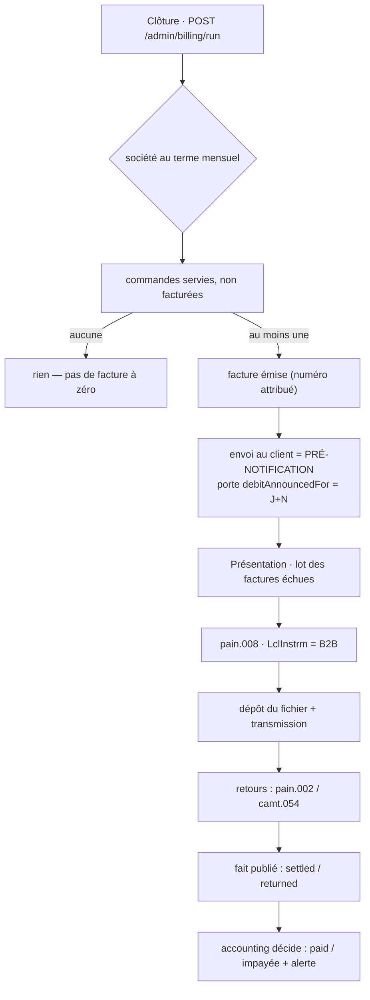

# Prélèvement SEPA émis en direct — découpage (V2)

> **Sortir de Stripe pour le prélèvement** et devenir nous-mêmes émetteur, sous
> notre propre ICS, en schéma **SDD B2B**.
>
> Trois décisions structurent tout : nous frappons la **RUM** (donc le mandat
> papier peut enfin être prérempli) ; nous **détenons l'IBAN** (retournement
> assumé de la décision B du doc précédent, avec sa facture) ; et un
> encaissement n'est plus un appel d'API mais un **lot déposé à la banque**.
>
> Décidé le **2026-09-01**. Prérequis lus :
> [`architecture-prelevement-sepa.md`](architecture-prelevement-sepa.md) (le
> socle Stripe, qui reste en place et gelé) et
> [`architecture-facturation.md`](../b2b/architecture-facturation.md) (dont ce document
> périme la tranche 7 et la §6).
>
> ## ▶️ CHANTIER REPRIS — décidé le 2026-09-10
>
> **Stripe ne sert plus qu'à la carte. Le prélèvement passe à la Caisse
> d'Épargne, sous notre propre ICS.** C'est la reprise explicite que la mise en
> pause du 2026-09-01 exigeait ; ce document redevient la conception de
> référence, et la §0 ter dit ce qui reste à corriger dedans avant de coder les
> tranches concernées.
>
> Une précision de la reprise, qui confirme la §6 : la transmission à la banque
> est **manuelle et mensuelle** — un export XML au dernier jour du mois, déposé
> par un humain dans le portail Caisse d'Épargne. Aucune connexion directe n'est
> prévue, et ce n'est pas un provisoire honteux : le lot est le geste le plus
> conséquent du système, et le premier passe sous les yeux de quelqu'un.
>
> Ce qui a été bâti pendant la conception vit toujours et n'a pas bougé : la
> §0 bis en garde l'inventaire.
>
> **V2** — la V1 a été contredite avant d'être soumise, et n'a pas survécu :
> sept objections bloquantes. Les corrections sont marquées ⟲ dans le texte.
> La V2 a été contredite à son tour et garde **quatre objections bloquantes
> ouvertes**, listées en §0 bis. Elles ne sont pas résolues.

---

## 0 quater. 🔴 Nous n'émettons PAS de facture — décidé le 2026-09-10

**Le comptable importe nos commandes dans son logiciel de facturation et sort la
facture mensuelle. Nous produisons la SOMME par société et le FICHIER de
prélèvement.**

La facture existe donc — elle n'est pas émise par ce système. La raison est la
**facturation électronique** : bâtir un émetteur aujourd'hui, c'est bâtir contre
un régime qui n'est pas stabilisé, et le refaire ensuite.

> **V2 de cette section.** La V1 a été contredite avant d'être soumise et n'a pas
> survécu : six objections bloquantes, dont **trois affirmations fausses sur
> l'existant**, chacune recopiée d'un commentaire au lieu d'être lue dans le
> chemin d'écriture. Le motif exact du 2026-08-31. Les corrections sont marquées
> ⟲.

### 🔴 Ce que ça inverse, et il faut le dire en face

Le §2 de ce document pose : « **Émettre avant d'encaisser, jamais l'inverse** —
un échec entre les deux laisserait de l'argent prélevé sans document en face. »

**Cette section fait exactement l'inverse, par construction.** Le débit part, la
facture vient après, produite ailleurs. Ce n'est pas un détail d'ordonnancement
qu'on relâche : c'est un invariant nommé qu'on retourne.

Ce qu'on accepte en échange du gain :

- le pire cas devient **« argent prélevé, aucun document en face »** ;
- le geste de réparation n'est **plus le nôtre** — il passe par le comptable ;
- le client qui conteste se voit opposer un relevé **sans numéro de facture**.

⚠️ **Un mécanisme manque, et il n'est pas technique** : rien n'atteste que le
comptable a émis. Et parce que c'est LFC qui vend, c'est LFC qui doit émettre —
qu'un tiers le fasse en son nom s'appelle un **mandat de facturation** et se
contractualise. À obtenir par écrit avant le premier cycle.

### ⟲ L'assiette — sur la COMMANDE, jamais sur la société

**V1 : « la société a le terme mensuel ». Faux et coûteux.** `Company.grantTerms`
(`account/domain/entities/company.ts:417`) fait `[...new Set(terms)]` : c'est un
**remplacement**, pas un ajout — l'écran montre des interrupteurs. Retirer le
mensuel est un clic. Évaluer le critère sur la société **au moment de la
clôture** faisait donc disparaître de l'assiette toutes les commandes livrées du
mois dès qu'on coupait le crédit d'un client : elles n'entraient dans aucun
cycle, jamais, et rien ne les signalait. Le client qu'on venait de couper
repartait avec un mois de marchandise.

**Décision (Hugo, 2026-09-10) : une commande passée au compte se prélève, même si
le crédit est retiré ensuite.** Retirer le mensuel n'agit que sur les commandes
à venir.

Ce qui la rend prélevable est donc **la décision prise à sa passation**, et la
commande la porte déjà :

| Critère                     | Colonne                                  | Vérifié le 2026-09-10 dans                         |
| --------------------------- | ---------------------------------------- | -------------------------------------------------- |
| passée au compte            | `payment_status = 'not_required'`        | `Order.deferPayment()`, appelé sur `!requiresCard` |
| **et d'un montant non nul** | `total_cents > 0`                        | `place-order.handler.ts:233` — voir ⟲ ci-dessous   |
| dans la fenêtre du cycle    | `created_at` (commentée « = passée le ») | `prisma/schema/public/orders.prisma`               |
| pas annulée                 | statut dans la liste blanche ci-dessous  | —                                                  |

⟲ **`total_cents > 0` n'était pas dans la V1, et son absence était une faute.**
`requiresCard = (…) && order.totalCents > 0` : **toute commande à 0 € devient
`not_required`**, terme ou pas. Sans cette borne, des commandes gratuites
entraient dans la jonction, dans le relevé du client et dans le CSV du comptable.

Avec elle, l'équivalence est exacte : `not_required ∧ total > 0` **si et
seulement si** la commande a été passée au compte. `company_id IS NOT NULL` en
découle (le compte se refuse à qui n'a pas de société) — ce n'est pas une
seconde règle, c'est une conséquence, et l'écrire dans la requête serait laisser
croire qu'on la vérifie.

Montant = **TTC** (`total_cents`), qui inclut les frais de livraison et la
surtaxe de retard. Le relevé devra les détailler, sinon la somme prélevée ne se
recompose pas depuis les commandes que le client connaît.

### ⟲ Le périmètre des statuts — liste BLANCHE, et une divergence à trancher

La V1 disait `status <> 'cancelled'`. Une liste noire laisse entrer ce qu'on
n'a pas prévu. Le dépôt a déjà `REVENUE_ORDER_STATUSES`
(`b2b/growth/domain/revenue-scope.ts`), liste blanche « partagée par tous les
lecteurs de CA **pour qu'ils comptent exactement la même chose** ».

🔴 **Elle omet `ready`**, qui est pourtant écrit. L'assiette prélevée et le CA
affiché divergeraient donc, sans que personne ne sache lequel croire. L'assiette
fait autorité — c'est elle qui déplace de l'argent — et `revenue-scope.ts` est à
corriger dans le même mouvement, ou à déclarer volontairement différente.

### ⟲ Le cycle — borné par la clôture PRÉCÉDENTE, pas par le calendrier

La V1 ne donnait qu'un plafond. Deux définitions étaient possibles, et elles ne
diffèrent que dans le cas qui nous intéresse.

**Un cycle va d'une clôture à la suivante.** Pas « le mois M ». C'est la seule
définition qui survit à une clôture anticipée : sinon la commande du 21 est dans
deux cycles ou dans aucun.

Conséquence à assumer : **le cycle n'est pas calendaire**, et « clôture
mensuelle » (T8) est un mauvais nom. En échange, la **clôture anticipée cesse
d'être un cas particulier** — c'est le cas général, et le 1er à 00h00 n'est plus
qu'une clôture par défaut.

⚠️ **Ni minuit UTC, ni `new Date()`.** « Le 1er à 00h00 » est un jour local, et
le geste du dépôt est `localToInstant(day, "00:00")` sur `BUSINESS_TIME_ZONE`.
Minuit UTC ferait basculer une à deux heures de commandes dans le mauvais cycle,
différemment selon la saison. `lint:business-day` **ne le verra pas** : sa portée
est limitée à quatre dossiers de tarification.

⚠️ Et `orders.created_at` est `@default(now())`, donc écrit par **Postgres**, pas
par le port `Clock` — et `now()` y est l'heure de **début de transaction**. Une
transaction longue peut committer après la clôture une ligne datée d'avant.
Borné par la clôture précédente, ça se rattrape au cycle suivant ; c'est une
raison de plus de ne pas borner par le calendrier.

### ⟲ L'unité du débit, et l'idempotence

**Décision (Hugo, 2026-09-10) : UN prélèvement par société et par cycle.** Un
client à trente commandes voit une ligne sur son relevé, et nous payons un frais
d'opération.

**Rien ne marque une commande comme prélevée.** `payment_status` reste
`not_required` pour toujours : c'est un état de MODE de règlement, pas
d'encaissement. Sans marque, un second passage prélève deux fois. C'est la seule
chose que ce modèle rend plus difficile que le modèle par facture, où la facture
portait la marque.

L'instruction étant collective, la marque ne peut pas vivre sur elle : il faut
une **table de jonction commande ↔ instruction, avec `UNIQUE (order_id)`** — celle
que la §3 prévoyait pour les factures, reportée sur les commandes. Sans elle,
tout le reste est indéfendable.

### ⟲ Les retours — DEUX morts, et rien d'automatique

La V1 disait « libérer ce qui n'a pas abouti ». Elle re-débitait une opération
contestée.

Les R-transactions ne se valent pas : une provision insuffisante se represente,
une **opposition** ou une contestation d'opération non autorisée ne se
representent **jamais**. Il ne manque pas un statut, il en manque **deux** :

| État                               | L'index partiel                        |
| ---------------------------------- | -------------------------------------- |
| `dead_retryable` — à reprendre     | l'**exclut** : la commande revient     |
| `dead_final` — ne jamais reprendre | l'**inclut** : la commande reste prise |

🔴 **Et un rejet ne porte pas sur une commande : il porte sur TOUT le cycle de
ce client.**

C'est la conséquence directe du débit collectif, et elle change la nature du
geste. Sous le modèle par facture, un retour rendait une facture impayée : un
objet, une décision. Ici, un seul `RJCT` remet en question **les trente
commandes du mois**, d'un coup.

Trois choses en découlent, et aucune n'est un détail :

- **La décision humaine n'est pas « represse-t-on cette commande ? »** mais
  « que fait-on du mois de ce client ? ». L'écran doit poser cette question-là,
  parce que c'est celle qu'on se pose : relancer tout, relancer une partie,
  passer au recouvrement.
- **La reprise doit pouvoir être PARTIELLE.** Une re-présentation SEPA est une
  nouvelle instruction, rien n'oblige à reprendre le même périmètre. Un client
  qui conteste trois commandes sur trente doit pouvoir être redébité des
  vingt-sept autres — sans quoi le litige sur 3 % du montant gèle 100 % de
  l'encaissement.
- **La jonction doit donc laisser une commande CHANGER d'instruction.**
  `UNIQUE (order_id)` sur une jonction figée l'interdirait. Ce qui doit être
  unique, c'est « une commande dans **au plus une instruction vivante** » — la
  même forme d'index partiel que l'objection 1 de la §0 ter réclame, et pour la
  même raison.

⚠️ Le montant du débit devient donc une **somme reconstituée à chaque
présentation**, jamais un total figé sur le cycle. Un cycle n'a pas « un
montant » : il a un montant _par tentative_.

**Décision (2026-09-10) : aucune reprise automatique, quel que soit le motif.**
Tout retour met les commandes en attente d'une décision humaine. Nous n'avons
jamais vu un seul code motif de la Caisse d'Épargne, et faire confiance à un
code qu'on n'a jamais reçu est un pari. Ajouter l'automatisme plus tard est
additif ; défaire une re-présentation abusive ne l'est pas.

### ⟲ Ce que la suppression emporte, et que la V1 ne nommait pas

| Tranche                           | Devient                                                                                               |
| --------------------------------- | ----------------------------------------------------------------------------------------------------- |
| **T4** agrégat facture            | **supprimée**                                                                                         |
| **T5** persistance + numérotation | **supprimée** — la numérotation appartient au comptable                                               |
| **T6** rendu Factur-X             | **supprimée**                                                                                         |
| **T7** régime « à la commande »   | ⟲ **supprimée par ricochet** — elle ÉMET une facture, donc elle avait besoin de T4, T5 et T6          |
| **T11** écrans                    | ⟲ **amputée** — « Mes factures » côté client n'a plus d'objet ; l'onglet devient « Mes prélèvements » |
| **T1 bis** `tva_intracom` exigé   | ⟲ **à rejustifier** — c'est une mention obligatoire de FACTURE ; sa preuve n'a plus de fondement ici  |
| **T8** clôture mensuelle          | conservée, renommée : elle clôt un **cycle**, et le mot « mensuelle » est faux                        |

⚠️ **Irréversibilité.** Sur le papier rien n'est codé, donc tout se défait. Ce
qui ne se défait pas : **la série de numéros part chez le comptable.** Le jour où
LFC voudra émettre — réforme, PDP, changement de comptable — il faudra reprendre
une série qui n'est pas la nôtre, ou en ouvrir une seconde : ce que cette section
appelle elle-même « une seconde vérité ». La décision se paie au moment où on la
défait.

### Les deux choses que ça nous oblige à produire

1. **L'avis de prélèvement** — le SDD B2B exige d'annoncer montant et date avant
   de débiter (`preNotificationDays`, déjà porté par l'entité). Sans facture, le
   client reçoit un **relevé des commandes du cycle**, frais et surtaxes
   détaillés. Ce n'est pas une facture et ça ne doit pas y ressembler.
2. **L'export pour le comptable** — les commandes du cycle, par société. Il doit
   porter `total_cents`, `vat_cents` et les parts de TVA **figées** : l'arrondi
   est fait une fois, dans `ventilateVat`, « et nulle part ailleurs ». Un CSV de
   lignes à resommer garantit la divergence dès le premier mois.

### ⚠️ Ce qui reste ouvert

- **La cohérence des trois dates.** La §6 dit « un export au dernier jour du
  mois », Hugo veut la clôture le 1er, et la §5 impose un débit au plus tôt à
  J + `preNotificationDays`. Ces trois phrases ne sont pas compatibles deux à
  deux. À arbitrer avec la banque, pas ici.
- **L'écart entre le montant prélevé et la facture du comptable.** Les deux
  sortent de la même assiette ; l'écart ne peut donc venir que d'un décalage de
  date. ⟲ La V1 invoquait aussi « un avoir » — il n'existe nulle part
  (`PaymentStatus.refunded` n'a **aucun écrivain**), et le seul endroit où il
  était conçu est T4, que cette section supprime.
- **Le format d'import du logiciel du comptable.** Inconnu. Il décide de la forme
  du CSV, donc il se demande avant de l'écrire.

---

## 0. Ce qui change, en une phrase

Avec Stripe, encaisser était **N appels indépendants**, chacun idempotent,
chacun réussissant ou échouant seul. En direct, c'est **un fichier pour
quarante débiteurs** : le mode de défaillance devient « le lot a été rejeté »,
ou « le lot est passé et trois lignes reviennent dans six jours ».

Ce n'est pas un changement d'adaptateur. `MandateGateway` n'a plus d'objet :
en SDD direct, **enregistrer un mandat n'appelle personne** — c'est un acte
purement local. Le port qui apparaît est ailleurs et plus tard : transmettre un
lot, avaler des retours.

---

## 0 bis. La mise en pause — 2026-09-01, levée le 2026-09-10

**La décision.** Le prélèvement continue de passer par Stripe. Le chantier
d'émission directe est arrêté le jour même où il a été conçu, avant toute
tranche de mise en service.

**Pourquoi le document reste.** Il ne coûte rien à garder et il économise deux
choses qui, elles, ont coûté : la conception, et **deux passes de contradiction**
qui ont trouvé onze objections bloquantes. Reprendre sans les relire reviendrait
à les redécouvrir une par une, en codant.

### Ce qui a été bâti, et qui vit toujours

Du **domaine pur**, sans module Nest, sans Prisma, sans route : rien n'est câblé,
rien ne tourne, rien ne peut casser. 51 tests verts, `tsc` propre, les 17 portes
passantes au moment du gel.

| Chemin                                                            | Ce que c'est                                                   | Sort si le chantier ne reprend pas                   |
| ----------------------------------------------------------------- | -------------------------------------------------------------- | ---------------------------------------------------- |
| `src/b2b/accounting/domain/entities/legal-entity.ts`              | l'entité juridique émettrice, ses invariants                   | **à garder** — voir ci-dessous                       |
| `src/b2b/accounting/domain/value-objects/`                        | `Siren`, `Iban` (mod-97), `CreditorIdentifier`, `LegalAddress` | **à garder** sauf l'ICS                              |
| `src/b2b/accounting/domain/creditor-snapshot.ts`, `ports/`        | l'émetteur figé, les deux ports                                | **à garder**                                         |
| `src/b2b/payments/domain/value-objects/rum.ts`                    | la RUM frappée par nous                                        | **orphelin** : sous Stripe, la référence vient d'eux |
| `InvalidRumError` dans `payments/domain/errors/mandate-errors.ts` | l'erreur associée                                              | **orpheline**, même raison                           |

**`LegalEntity` n'est pas du SEPA.** C'est la **tranche 0 de la facturation**,
qui la déclare bloquante depuis toujours : « Identité du vendeur (LFC) — _nulle
part_ — raison sociale, SIRET, TVA intracom, adresse, RCS, capital, IBAN »
([`architecture-facturation.md`](../b2b/architecture-facturation.md)). Aucune facture
régulière ne sort sans elle, que l'encaissement passe par Stripe ou pas. Ce
morceau-là est à finir un jour de toute façon — persistance, écran, et il est
livré.

Ce qui manque pour qu'il serve : le modèle Prisma et sa migration, l'adaptateur,
les commandes CQRS, le contrôleur, et l'écran Comptabilité › Entités juridiques.

## 0 ter. Ce qui reste FAUX — et ce que ça bloque vraiment

La V2 a été contredite et n'a pas été corrigée depuis. **Quatre objections
bloquantes sont ouvertes.** La reprise du 2026-09-10 ne les résout pas : elle
les **situe**, ce qui est la question qu'on se pose en reprenant.

| Objection                                        | Tranche qu'elle bloque         |
| ------------------------------------------------ | ------------------------------ |
| 1 — l'index de libération ne libère pas assez    | **T9** (le lot et ses retours) |
| 2 — `(company_id, creditor_id)` vide l'invariant | **T2** (le mandat direct)      |
| 3 — la porte du crédit est circulaire            | **T12**                        |
| 4 — le fait publié désigne le mauvais mécanisme  | **T9**                         |

🔴 **Aucune ne touche T1.** L'entité juridique, sa persistance et son écran ne
lisent ni index de mandat, ni instruction, ni octroi de crédit — c'est pour ça
que la reprise commence par là, et pas parce que c'est le plus facile.

Les quatre, dans leur formulation d'origine :

1. **L'index `UNIQUE (invoice_id) WHERE status <> 'returned'` (§3) ne libère pas
   assez.** Un rejet avant règlement (`pain.002` `RJCT`), un lot rejeté en bloc,
   un dépôt manqué laissent l'instruction en `pending` pour toujours, donc la
   facture verrouillée — alors que la §5 promet la reprise. Il manque un statut
   « morte sans règlement », et l'index doit l'exclure aussi.
2. **`(company_id, creditor_id)` (§2) vide l'invariant qu'il prétend étendre.**
   Le `creditor_id` est forcément nullable (les mandats Stripe n'en ont pas), et
   Postgres traite les `NULL` comme distincts : deux mandats Stripe actifs sur la
   même société passeraient. Il faut `NOT NULL` + backfill, ou `NULLS NOT
DISTINCT` — pas « une colonne ».
3. **La porte du crédit (§11 T12) est circulaire.** Exiger
   `firstCollectionSettledAt` pour accorder le mensuel, quand il faut le mensuel
   pour prélever : la condition n'est jamais satisfiable pour un client neuf.
4. **Le fait publié `payments → accounting` (§2) désigne le mauvais mécanisme.**
   Le contrôleur de webhook cité en exemple fait du `CommandBus` synchrone, pas
   de la publication ; le vrai mécanisme du dépôt est `DomainEventPublisher` /
   `publishTraced`. Et l'`EventBus` en mémoire n'est ni transactionnel ni
   rejouable : un abonné qui échoue sur `collection.settled` = argent encaissé,
   facture jamais `paid`, aucune trace. Il faut un import de retour **idempotent
   et rejouable à la demande**, pas un bus.

Et une correction que la §10 doit recevoir : elle justifie l'absence d'un
`CHECK (status <> 'active' OR proof_storage_key IS NOT NULL)` par des données
existantes — **la table est vide**. Ce qui l'empêche est le chemin de code, pas
la donnée, et ce chemin tombe dès la tranche 2.

### Ce qui aura pourri à la reprise

- **Les questions à la banque du §1** (délai de présentation, version `pain.008`,
  `FRST`/`RCUR`, caducité 36 mois en B2B) n'ont jamais été posées. Rien de ce
  document ne s'appuie sur une réponse — c'est voulu, et ça reste à faire.
- **Le quota de crons.** `wrangler.jsonc` en déclarait cinq au gel, dispatchés
  par un `switch` sur la chaîne exacte. Le chantier en demandait trois de plus.
  À revérifier : le nombre aura bougé.
- **Le calcul des frais**, qui est le motif d'origine, n'a jamais été chiffré
  ligne à ligne contre le coût d'un émetteur direct (convention bancaire,
  garantie éventuelle, temps humain du dépôt manuel des lots). Une reprise devrait
  commencer par là, pas par le code.

### Ce qui redevenait vrai pendant la pause, et redevient faux

Pendant la pause, le §12 « ce que ce document périme » était **suspendu** : le
prélèvement restant chez Stripe, la §6 de la facturation (le risque SEPA Core à
8 semaines) et la décision B du doc précédent (aucune coordonnée bancaire chez
nous) redécrivaient exactement le système.

**La reprise du 2026-09-10 rend le §12 de nouveau opposable**, et ces deux
phrases redeviennent fausses au fur et à mesure des tranches — pas d'un coup.
Le repère qui vaut, tant que T2 n'est pas livrée : **aucune coordonnée bancaire
n'est en base aujourd'hui**, et le doc Stripe reste la description du système en
service. Ce qui change ce jour-là est écrit en §4.

Seule la tranche 7 de la facturation reste fausse indépendamment de tout ça, et
elle l'était avant ce chantier : `MandateGateway.charge(...)` n'existe pas.

## 1. Le schéma retenu : SDD B2B

|                                                      | SDD Core   | **SDD B2B** (retenu) |
| ---------------------------------------------------- | ---------- | -------------------- |
| Remboursement **sans motif** après encaissement      | 8 semaines | **aucun**            |
| Contestation d'une opération non autorisée           | 13 mois    | 13 mois              |
| Le débiteur enregistre le mandat auprès de sa banque | non        | **oui**              |
| Toutes les banques participent                       | oui        | **non**              |

⟲ **Ce que le choix n'achète pas.** La V1 écrivait « une facture `paid` reste
payée » : c'est faux, et c'est le genre de phrase qui fait dimensionner une
trésorerie de travers. B2B supprime le **remboursement discrétionnaire**, pas
les **R-transactions**. Reviennent toujours : provision insuffisante, compte
clos, mandat non enregistré chez la banque du débiteur, opposition. Une facture
peut donc redevenir impayée — plus rarement qu'en Core, et pour des raisons
qu'on peut nommer au client. C'est tout, et c'est déjà beaucoup.

Le point dur du schéma : **un mandat signé n'est pas un mandat utilisable**. Le
débiteur doit faire la démarche auprès de sa propre banque, et nous ne
l'apprenons qu'au premier rejet. D'où :

- le mandat porte un fait distinct de son statut — `firstCollectionSettledAt`.
  Tant qu'il est nul, l'écran dit « jamais encaissé : la banque du client a-t-elle
  enregistré le mandat ? », il n'affiche pas un mandat vert ;
- **certains clients seront inéligibles** (banque non participante). Le
  portefeuille se scinde, et l'encaissement hors système reste un chemin normal.

> ⚠️ À confirmer auprès de la banque, pas de mémoire : le délai de présentation
> exact, la version de `pain.008` acceptée, si la distinction `FRST`/`RCUR` est
> exigée, la longueur maximale de l'`EndToEndId`, l'applicabilité de la caducité
> 36 mois au schéma B2B, et le délai de pré-notification inscriptible au mandat.
> Le DAF fournit l'ICS. **On code et on teste sans attendre** : ces valeurs sont
> des **entrées** du système (§2), pas des préalables à sa conception.

## 2. Où ça vit

Tout est enfant de `b2b` : `accounting` est la comptabilité **de LFC-B2B**, pas
une comptabilité d'entreprise transverse.

```
src/b2b/
├── accounting/     l'entité juridique émettrice (ICS, IBAN créancier, mentions,
│                   délai de pré-notification) et, à terme, la facture
├── payments/       le mandat, le lot, les instructions, les retours
└── orders/         inchangé — il ne sait rien du prélèvement
```

**Les paramètres bancaires sont de la donnée, pas de la configuration de
déploiement.** ICS, IBAN créancier, délai de pré-notification `N` : portés par
`LegalEntity`, saisis dans Comptabilité › Entités juridiques. Un délai
renégocié avec la banque est alors une saisie, pas un déploiement — et il peut
différer d'une entité à l'autre, ce qu'une variable d'environnement ne saurait
pas dire.

⚠️ La frontière `accounting` ↔ `payments` n'est **pas** tenue par le gate :
`lint:context-boundaries` mappe les dossiers de **premier niveau** de `src/`, et
`b2b/accounting` ↔ `b2b/payments` est hors de sa portée. Elle repose sur la
revue — le cas que la §1 du CLAUDE.md signale comme le plus fragile.

⟲ **Et le mur annoncé en V1 était faux.** « `payments` n'écrit jamais chez
`accounting` » était contredit deux sections plus loin par « retour ⇒ facture
`failed` ». Le mécanisme qui tient réellement :

```
payments  publie un FAIT   (collection.settled / collection.returned)
accounting s'y abonne et DÉCIDE ce que ça fait à la facture
```

Le bus `@nestjs/cqrs` est déjà en place ; c'est le même couplage que le
contrôleur de webhook existant, qui dispatche sans importer `OrdersModule`.

### L'ordre, et pourquoi il ne s'inverse pas

```
b2b/orders      « le mois est clos, voici les commandes servies non facturées »
   ↓
b2b/accounting  émet : numéro sans trou, snapshots, ventilation TVA
   ↓
b2b/payments    prélève sur la facture émise
```

**Émettre avant d'encaisser, jamais l'inverse** — l'invariant est déjà écrit
dans le doc facturation : un échec entre les deux laisserait de l'argent prélevé
sans document en face.

`accounting` ne connaît pas les `Principal`. C'est `b2b` qui résout le mur et
passe le `companyId` — et le port de lecture client doit être **incapable**
d'exprimer « toutes les factures » : `CompanyInvoiceReader.list(companyId)` où le
paramètre n'est pas optionnel, et un port staff séparé pour la vue globale.

### Deux entités juridiques, et toujours une seule base

Une deuxième entité est une **ligne**, pas un déploiement.

Sortir `accounting` sur sa propre base casserait ce qui tient le cycle mensuel :
l'idempotence ne repose pas sur du code mais sur des contraintes de la **même**
base. Base séparée, plus de transaction commune — « émettre avant d'encaisser »
et « une commande jamais facturée deux fois » redeviennent de la discipline
distribuée, c'est-à-dire des bugs qui n'arrivent qu'en production. Et ce serait
refaire à l'envers ce que B4 a défait pour le référentiel.

⟲ **La V1 habillait de la prudence bon marché en irréversibilité.** Corrigé :
`creditorId`, `legalEntityId` et la numérotation par entité sont **réversibles**
(étendre → backfill → resserrer, le triptyque que le dépôt pratique déjà), et
l'unicité composite est **plus faible** que la globale, donc adoptable à tout
moment. Le vrai argument est plus simple : **ça coûte une colonne aujourd'hui,
avec une seule entité en base.** C'est suffisant.

**En revanche, une ligne manquait, et celle-là mord.** L'index partiel
`payment_mandates_one_active_per_company` porte sur `(company_id)` seul
(migration `20260811200000_mandat_prelevement`). Avec deux entités émettrices, un
client qui achète aux deux a besoin de **deux mandats actifs**, sous deux ICS —
et l'index l'interdit. Il doit devenir `(company_id, creditor_id)`. Le faire
maintenant est une ligne ; le faire avec des mandats directs actifs en base est
un chantier.

## 3. Le modèle

```
LegalEntity  (accounting)      ← plusieurs : LFC peut émettre sous deux entités
  raisonSociale, formeJuridique, siren, adresse, rcs, capital, tvaIntracom
  ics                          ← identifiant créancier SEPA, le nôtre
  creditorIban                 ← où l'argent arrive
  preNotificationDays          ← N, négocié avec la banque, par entité

PaymentMandate  (payments)     ← l'existant, étendu
  origin: stripe | direct      ← discriminant ; les mandats Stripe sont GELÉS
  creditorId                   ← quelle entité juridique encaisse
  reference                    ← la RUM (colonne existante, cf. §9)
  ibanRef                      ← pointeur vers le coffre ; jamais l'IBAN en clair
  last4, bankCode, country     ← pour reconnaître, pas pour débiter
  scheme: b2b
  signedAt, proofStorageKey    ← le papier signé
  firstCollectionSettledAt     ← la preuve que la banque du débiteur a enregistré
  status                       ← additif : awaiting_signature, expired

DirectDebitBatch  (payments)   ← LE LOT, agrégat de premier rang
  messageId (unique), creditorId, requestedCollectionDate
  status: draft | emitted | acknowledged | rejected

DirectDebitInstruction         ← une ligne du lot
  batchId, mandateId, invoiceId, amountCents, sequenceType, attempt
  endToEndId (unique)          ← invoice + n° de tentative
  status: pending | settled | returned
  returnReasonCode, returnedAt
```

### Les invariants, et par quoi ils sont tenus

| Règle                                                              | Tenue par                                        |
| ------------------------------------------------------------------ | ------------------------------------------------ |
| Au plus **une instruction vivante** par facture                    | `UNIQUE (invoice_id) WHERE status <> 'returned'` |
| Une commande n'est jamais facturée deux fois                       | table de jonction, `UNIQUE (order_id)`           |
| Une RUM unique chez un créancier                                   | `UNIQUE (creditor_id, rum)`                      |
| Un seul mandat actif par société **et par créancier**              | index partiel, à étendre                         |
| Pas de prélèvement avant la date annoncée                          | l'agrégat refuse l'instruction                   |
| Pas de preuve signée ⇒ pas d'actif                                 | l'agrégat refuse la transition (§10)             |
| Mandat dormant > 36 mois ⇒ caduc                                   | statut `expired`, posé par balayage (§3.1)       |
| L'IBAN n'est jamais rendu par une API ni rehydraté dans un agrégat | le mapper (§4)                                   |

⟲ **Trois corrections sur la V1.**

- L'unicité anti-double-débit portait sur `endToEndId = invoice.id`. Elle
  interdisait la **re-présentation** après rejet — que le cycle exige. Un rejet
  pour provision insuffisante devient un impayé définitif, recouvré à la main.
  Déplacée sur l'index partiel ci-dessus : deux débits simultanés restent
  impossibles, une seconde tentative redevient possible, et l'`endToEndId` porte
  le numéro de tentative pour rester traçable dans le fichier de retour.
- L'unicité de la RUM était annoncée sur `(ics, rum)` : **inexprimable**, l'ICS
  vit sur `LegalEntity` et un index ne traverse pas une clé étrangère.
- L'unicité de la commande facturée reposait sur `order_ids[]` : un index unique
  sur un tableau contraint le **tableau entier**, donc `{o1,o2}` et `{o1,o3}`
  passent tous les deux et `o1` est facturé deux fois.

### 3.1 La caducité : un statut, pas un calcul

⟲ La V1 confiait « dormant > 36 mois » à `debitable()` **et** ajoutait un statut
`expired` — deux mécanismes pour un invariant. Pire : un mandat caduc _calculé_
reste `active` en base, donc occupe le slot de l'index partiel et **bloque
l'enregistrement de son remplaçant**.

Retenu : un **statut**, posé par un balayage. `debitable()` continue de ne lire
que le statut, sa signature ne change pas, et le slot se libère.

## 4. L'IBAN : le retournement, et son prix

Le doc précédent écrivait « ce qu'on achète à Stripe, c'est précisément de ne
pas détenir la donnée bancaire ». On la détient désormais : il n'y a pas de
prélèvement direct sans IBAN dans le `pain.008`.

⟲ **La V1 promettait qu'une fuite serait « structurellement impossible », et se
contredisait trois sections plus loin.** La promesse tenable, et c'est celle-ci :
**l'IBAN n'est jamais rendu par une API de lecture, ni rehydraté dans un
agrégat.** Un mapper la tient. Le reste demande des gestes, listés ici pour
qu'aucun ne soit découvert en route.

**Le chemin d'écriture.** Sans l'iframe Stripe, l'IBAN est saisi au back-office
et traverse HTTP → Zod → handler. Donc : validation **mod-97** dans un value
object, dérivation de `last4` et du code banque à cet endroit, chiffrement avant
toute écriture, et **exclusion explicite des journaux** (le payload de la
commande n'est jamais journalisé tel quel). Le contrat servi aujourd'hui,
`registerMandatePayloadSchema`, n'accepte que `paymentMethodId` : il change, et
son JSDoc qui affirme l'inverse aussi.

**Le coffre.** Chiffrement symétrique au champ, par un port `platform` à créer —
il n'existe **aucun** chiffrement de ce type dans le dépôt (`node:crypto` n'y
sert qu'à hacher, signer, tirer de l'aléa). `keyVersion` stocké à côté du
chiffré **dès la première ligne** : sans lui la rotation devient impossible, et
on ne la rétro-ajoute pas.

**Le fichier de lot est lui-même un secret.** Un `pain.008` contient quarante
IBAN en clair. Conséquences, et la V1 les ignorait toutes les trois :

- il ne se télécharge pas comme une pièce jointe ordinaire : URL à durée de vie
  courte, geste tracé, jamais servi par la route de lecture des documents ;
- `DocumentStore` n'expose que `save` et `read` — **pas de `delete`**. La purge
  n'a aujourd'hui aucun mécanisme, ni pour le coffre ni pour les lots. Le port
  doit gagner la méthode, sinon la promesse RGPD est une phrase ;
- rétention propre au lot, plus courte que celle du mandat : le lot est un moyen,
  le mandat est une preuve.

## 5. Le cycle mensuel



**La facture émise vaut pré-notification** : elle porte le montant et la date de
débit annoncée. Une notification séparée serait un second document à tenir
d'accord avec le premier.

⟲ **Le verrou de la V1 était tautologique et bloquait sa propre reprise.** Il
exigeait `debitAnnouncedFor = requestedCollectionDate`, alors que la requête
sélectionne déjà les factures par cette égalité : le contrôle ne pouvait jamais
échouer sur le chemin nominal. Et si personne ne déposait le fichier ce jour-là
— week-end, cutoff dépassé, absence — la date annoncée était morte et l'égalité
interdisait de reconstruire le lot sans réécrire un document déjà envoyé.

La règle juste est une **inégalité** :

```
requestedCollectionDate >= invoice.debitAnnouncedFor
et  invoice.preNotifiedAt is not null
```

Prélever **plus tard** qu'annoncé est licite : le client a été prévenu en
avance. Plus tôt ne l'est pas. La reprise après un dépôt manqué devient un lot de
plus, à une date de plus — sans toucher à la facture.

Les dates d'échéance se calculent en **jours ouvrés TARGET2**. Service pur et
déterministe, mais pas trivial : le calendrier dépend de Pâques.

⚠️ **Le déclenchement reste à trancher.** `wrangler.jsonc` déclare déjà **cinq**
expressions de cron et Cloudflare a un plafond par Worker (à vérifier, je le
crois à 5). Deux rythmes de plus ne rentrent peut-être pas : un réveil unique qui
répartit selon l'heure est alors la sortie. Indépendamment, `worker.ts` départage
par `switch` sur la chaîne exacte du cron — un `Map` ferait d'un rythme de plus
une ligne de données au lieu d'une branche (OCP).

## 6. La transmission : commencer à la main, exprès

Le canal bancaire (EBICS, SFTP) est une **démarche**, pas du code, et le mettre
sur le chemin critique retarderait tout le reste.

Port `DirectDebitTransmitter`, premier adaptateur **manuel** : le lot est déposé
dans le stockage objet et le back-office en propose la remise (§4 : pas un
téléchargement ordinaire) ; un humain le porte sur le portail de la banque. Idem
en retour : le fichier de retour s'importe par un écran.

Ce n'est pas un pis-aller — c'est ce qui permet d'encaisser avant que la banque
nous ait ouvert un canal automatisé, et l'automatisation devient un second
adaptateur derrière un port déjà éprouvé.

**La banque est la Caisse d'Épargne, et la cadence est mensuelle** (décidé le
2026-09-10) : un export XML au dernier jour du mois, déposé à la main dans leur
portail. Deux conséquences que le reste du document doit respecter.

- **Le lot n'est pas un fichier téléchargé, c'est un fait daté.** Ce qui part
  chez la banque est archivé tel quel : le jour où une ligne est contestée, la
  question est « qu'avons-nous déposé le 31 », pas « que recalculerions-nous
  aujourd'hui ». Même propriété que le bon de commande — les octets sont écrits
  une fois, pas régénérés.
- **Un dépôt manuel se manque.** Le geste dépend d'un humain un jour donné, et
  la §5 doit donc pouvoir dire « le lot de ce mois n'est jamais parti » sans
  que ça ressemble à un lot en cours. C'est l'objection 1 de la §0 ter, vue par
  l'autre bout : un statut « morte sans règlement » manque.

## 7. Les faits à journaliser

⟲ **La V1 n'en parlait pas une seule fois**, alors qu'elle crée la série d'actes
les plus opposables du système. Et aucune porte ne le rattrapera :
`lint:journal-tracked` ne surveille que `src/pim/**` et `src/b2b/account/**`.

`mandate.drafted` (RUM frappée) · `mandate.activated` (preuve déposée) ·
`mandate.revoked` · `mandate.expired` · `batch.emitted` · `collection.settled` ·
`collection.returned` (avec le code motif) · `invoice.issued` · `invoice.paid`.

Deux ans plus tard, « sur quelle autorisation avez-vous prélevé, et qu'a répondu
la banque » doit se lire, pas se reconstituer.

## 8. La porte du déclenchement

⟲ La V1 branchait `POST /admin/billing/run` sur `RecomputeGuard` sans un mot. Ce
guard compare à un **unique** `RECOMPUTE_TOKEN`, partagé avec les crons de
recalcul des read-models, et `adminDevBypass()` ouvre la route sans jeton en
développement. Un jeton dont la compromission recalculait un score émettrait des
factures et armerait des prélèvements.

La facturation et la présentation ont leur **propre secret**, et le bypass de
développement n'y frappe pas de numéro de facture.

## 9. Ce qu'on ne touche pas

- **Le code Stripe reste**, gelé : plus aucun mandat `origin = stripe` n'est
  créé, aucun n'entre dans un lot. Pas de `switch` — deux intentions nommées, et
  le moteur de lot ne lit que `origin = direct`.
- **La carte reste chez Stripe.** Construire de l'acquisition carte n'est pas au
  programme (PCI DSS).
- **`reference` ne devient pas `rum`, `bank_code` ne devient pas `bic`.** Les
  deux colonnes existent, sont servies par un contrat que deux fronts lisent, et
  un renommage se paie en trois déploiements pour un gain de vocabulaire. Le
  JSDoc dit que `reference` **est** la RUM ; ça suffit.

> **Note — la bascule du portefeuille Stripe.** Il n'y a **aucun mandat en
> production** à ce jour, donc rien à basculer, et cette note existe pour que ça
> ne se redécouvre pas seul. Le jour où des mandats Stripe actifs coexisteraient
> avec des mandats directs, deux pièges attendent : l'index partiel n'autorise
> qu'un actif par société, tous `origin` confondus ; et `findCurrent` rend
> « l'actif, sinon le dernier » — donc `AttachMandateProofHandler` collerait le
> scan d'un mandat direct sur le mandat Stripe. Le port n'a aucune méthode qui
> désigne un mandat par `origin`.

## 10. Ce qui est assumé, pas corrigé

**« Pas de preuve ⇒ pas d'actif » est tenu par l'agrégat, pas par la base.** Un
`CHECK (status <> 'active' OR proof_storage_key IS NOT NULL)` serait strictement
plus fort. Il est **impossible aujourd'hui** : des mandats `active` sans preuve
existent déjà — le statut vient de la réponse de Stripe via `draftMandate`, et
`attachProof` n'a aucune garde. On choisit donc le plus fort mécanisme
_compatible avec les données existantes_, ce qui est une décision et non une
évidence. Le `CHECK` devient possible le jour où les mandats Stripe sont tous
révoqués ; à noter dans `documentation/todos/`.

Note au passage : T2 doit **inventer** la transition vers `active`. Il n'y a rien
à « refuser » aujourd'hui — aucun agrégat ne sait activer un mandat.

**Le nom `accounting` frôle une collision.** `AccountingRules` / table
`accounting_rules` existent déjà, **dans le schéma `pim`**. Un `b2b/accounting`
rend le raccourci tentant depuis le B2B — exactement la frontière franchie en
SQL que le CLAUDE.md dit être « arrivée deux fois », et que ni
`context-boundaries` ni `cross-schema-join` ne verraient. Le besoin réel est
déjà couvert : `OrderLine` snapshote son taux de TVA.

## 11. Le découpage

T0 n'est plus une tranche mais un **flux d'entrées** : l'ICS vient du DAF, les
paramètres bancaires se saisissent dans `accounting`. On code et on teste sans
attendre. Une seule chose ne se rattrape pas — **ne pas faire signer un mandat
avant d'avoir l'ICS** : le formulaire EPC le porte, et un mandat signé sans lui
est un mandat à refaire signer.

| #         | Tranche                                        | Contenu                                                                                                                                                                                                                                                                                                                                    | Preuve attendue                                                                                                                    |
| --------- | ---------------------------------------------- | ------------------------------------------------------------------------------------------------------------------------------------------------------------------------------------------------------------------------------------------------------------------------------------------------------------------------------------------ | ---------------------------------------------------------------------------------------------------------------------------------- |
| **1** ✅  | **L'entité juridique** — LIVRÉE le 2026-09-10  | `b2b/accounting/` : agrégat `LegalEntity`, ICS, IBAN créancier, mentions, `preNotificationDays`. Écran Comptabilité › Entités juridiques. Port de lecture rendant un **snapshot**.                                                                                                                                                         | Un mandat et une facture peuvent citer un émetteur, et une seconde entité est une ligne.                                           |
| **1 bis** | **Les données manquantes de la facturation**   | Les trois items restants de la T0 du doc facturation : `tva_intracom` exigé à l'activation, date de livraison effective, code unité au SKU.                                                                                                                                                                                                | Une société sans TVA intracom ne peut pas passer au mensuel.                                                                       |
| **2**     | **Le mandat direct**                           | `origin`, `creditorId`, value object `Rum` + unicité `(creditor_id, rum)`, value object `Iban` (mod-97) + coffre + port de chiffrement, statuts additifs (⚠️ casse le `Record` exhaustif du contrat : les deux fronts se redéploient), transition vers `active`, index partiel étendu à `(company_id, creditor_id)`, balayage de caducité. | Un mandat sans preuve **ne peut pas** devenir actif. Une RUM ne se réécrit pas. L'IBAN n'apparaît dans aucune réponse d'API.       |
| **3** 🟡  | **Le document** — fragment livré le 2026-09-10 | Port `DocumentRenderer` (platform) + contenu EPC (payments). « Ouvrir un mandat » ⇒ PDF prérempli, RUM et ICS imprimés. Dépôt du signé ⇒ actif. **La fiche VIERGE existe déjà**, voir ci-dessous.                                                                                                                                          | Un mandat prérempli sort en PDF et revient signé. Livrable dès que l'ICS est là, sans autre démarche.                              |
| **4**     | **L'agrégat facture**                          | Doc facturation T2 : domaine pur — portée, lignes, ventilation TVA, snapshots, totaux, transitions, avoir. Zéro Prisma, zéro Nest.                                                                                                                                                                                                         | La ventilation TVA somme au total ; une facture émise ne change plus.                                                              |
| **5**     | **Persistance + numérotation**                 | Doc facturation T3, relocalisé dans `b2b/accounting/` : tables, séquence **par `(legalEntityId, année)`**, jonction `UNIQUE(order_id)`.                                                                                                                                                                                                    | Deux émissions concurrentes ⇒ deux numéros, sans trou. Une commande ne peut pas être portée par deux factures.                     |
| **6**     | **Le rendu Factur-X**                          | Doc facturation T4 : XML CII + PDF/A-3 + dépôt objet + port `EInvoiceTransport`.                                                                                                                                                                                                                                                           | Le XML valide contre le schéma du profil retenu.                                                                                   |
| **7**     | **Le régime « à la commande »**                | Doc facturation T5 : émission à l'encaissement carte confirmé, sur le webhook Stripe existant — toujours nécessaire puisque la carte reste.                                                                                                                                                                                                | Un rejeu du webhook n'émet pas deux factures.                                                                                      |
| **8**     | **La clôture mensuelle**                       | `POST /admin/billing/run`, porte dédiée (§8), déclenchement à trancher (§5). Envoi = pré-notification, `debitAnnouncedFor = J+N`.                                                                                                                                                                                                          | Le cron rejoué deux fois produit UNE facture.                                                                                      |
| **9**     | **Le lot et ses retours**                      | `DirectDebitBatch` / `Instruction`, calendrier TARGET2, `pain.008` `LclInstrm=B2B`, import `pain.002` / `camt.054`, faits publiés, `firstCollectionSettledAt`, alertes staff.                                                                                                                                                              | Un aller-retour complet sur un lot d'essai de la banque. Un retour tardif rend la facture impayée. Un rejeu n'ajoute pas de ligne. |
| **10**    | **Le rapprochement**                           | `camt.053`, encours par société.                                                                                                                                                                                                                                                                                                           | L'encours affiché égale le relevé.                                                                                                 |
| **11**    | **Les écrans**                                 | Doc facturation T8 : onglet Facturation sur la fiche, « Mes factures » côté client.                                                                                                                                                                                                                                                        | Parcours de bout en bout.                                                                                                          |
| **12**    | **La porte du crédit**                         | Accorder `monthly` exige KBIS certifié **et** un mandat dont `firstCollectionSettledAt` n'est pas nul ; retirer le mandat alerte sur l'encours.                                                                                                                                                                                            | L'octroi est refusé (409) sur un mandat qui n'a jamais encaissé.                                                                   |

### T1, livrée le 2026-09-10 — ce qu'elle contient vraiment

Le domaine `LegalEntity` existait depuis la conception ; ce qui a été ajouté est
tout ce qui le rend utilisable : modèle Prisma `legal_entities` + migration
additive, les trois adaptateurs, sept commandes, deux requêtes, un contrôleur
qui n'injecte que ses bus, et l'écran **Comptabilité › Entités juridiques**.

**Trois ports sur une table, un seul exporté.** `CreditorReader` rend une copie
figée et il est le seul que d'autres contextes consomment. Exporter le port
d'écriture laisserait `payments` charger l'agrégat et le muter depuis chez lui,
et l'immuabilité de l'ICS ne serait plus tenue par personne.

**Une ressource de permission neuve — `b2b_accounting`.** Distincte de
`b2b_payments`, et la distinction est le sujet : enregistrer le mandat d'un
client est un travail de tous les jours ; changer le compte qui reçoit l'argent
de l'entreprise est la cible numéro un de la fraude au virement.

**Livré en plus du périmètre annoncé**, parce que l'espace avait besoin d'une
porte : un **tableau de bord** de la comptabilité, avec les deux exports CSV qui
ne dépendent d'aucune tranche à venir — le portefeuille client et le catalogue
vendu. Ses cartes « Facturation » et « Export XML » **n'affichent aucun
chiffre** : un « 0 facture à collecter » dirait « rien à encaisser », quand la
phrase vraie est « on ne sait pas encore compter ». La carte du prélèvement, en
revanche, répond déjà à sa première condition bloquante — l'émetteur est-il
prêt.

**Ce qui manque encore à T1 telle qu'elle est décrite** : rien de bloquant. La
« seconde entité est une ligne » est vérifiée par construction (aucune
singularité en base), et « un mandat et une facture peuvent citer un émetteur »
attend ses deux consommateurs, qui sont T2 et T4.

### T3, fragment livré le 2026-09-10 — la fiche vierge, avant le mandat

Une **fiche de mandat au modèle EPC / CFONB**, préremplie du bloc créancier et
téléchargeable depuis la fiche d'entité, existe et est éprouvée. Elle est en
avance sur T2, et elle est rangée **ailleurs que là où T3 l'annonce**. Les deux
écarts sont voulus, et les taire ferait écrire un second générateur.

**Pourquoi en avance.** T3 telle qu'elle est décrite suppose un mandat : une RUM
imprimée, un statut qui bascule au dépôt du signé. Or l'objection 2 du §0 ter
bloque T2, donc T3 entière avec elle. Mais la moitié du document qu'un client ne
peut pas connaître — notre raison sociale, notre ICS, notre adresse — ne dépend
d'aucun mandat. La sortir tout de suite met la seule chose invérifiable
autrement sous les yeux : **est-ce que notre bloc créancier s'imprime juste ?**
Cette question se pose une fois, et mieux vaut se la poser sur un exemplaire
vierge que sur le premier mandat qu'on fait signer.

**Pourquoi dans `accounting` et non dans `payments`.** Le rendu ne lit que le
`CreditorSnapshot`, c'est-à-dire un objet d'`accounting`. Le poser dans
`payments` aurait créé une dépendance sans contrepartie : `payments` n'a rien à
apporter à un document qui ne connaît pas de débiteur. Le jour où T3 entière
arrive, c'est le **contenu qui migre**, pas la fonction qui se duplique — et
c'est à ce moment-là que le port `DocumentRenderer` a un sens, parce qu'il aura
deux contenus à servir.

**Ce que la fiche porte, et ce qu'elle ne porte pas.**

| Zones     | État                  | Pourquoi                                                                                                    |
| --------- | --------------------- | ----------------------------------------------------------------------------------------------------------- |
| 7 à 11    | **Préremplies**       | notre côté, recopié du snapshot                                                                             |
| 1 à 6, 13 | Vides                 | aucun débiteur n'est connu de ce rendu                                                                      |
| RUM       | Vide, **sans numéro** | la norme ne numérote pas cette zone ; lui inventer un « 0 » désignerait une case qui n'existe chez personne |
| 14 à 20   | **Absentes**          | la norme les dit indicatives, et nous n'encaissons ni pour un tiers ni via un tiers                         |

🔴 **L'IBAN du créancier n'y figure pas**, alors que le snapshot le porte et que
les zones 5 et 6 lui ressemblent : elles appellent l'IBAN du **débiteur**.
Imprimer le nôtre produirait un mandat nous autorisant à nous prélever
nous-mêmes, diffusé à chaque client. Deux tests le tiennent, dont un e2e sur ce
que le serveur envoie réellement sur le fil.

**L'incomplétude est inexprimable, pas vérifiée.** La lecture passe par
`CreditorReader`, dont `creditorSnapshot()` refuse de rendre une copie à une
entité sans ICS. Il n'y a donc aucune branche « si l'ICS manque » à écrire dans
le rendu, donc aucune à oublier : la route répond 409 en nommant ce qui manque,
et le bouton de l'écran est inactif tant que l'entité ne peut pas encaisser.

**La mention « EXEMPLE » est dans le dessin**, en travers de la page. Une fiche
vierge imprimée traîne sur un bureau ; sans marque, rien ne la distingue d'un
mandat prêt à signer, et une signature apposée dessus créerait un mandat sans
RUM — inutilisable, mais que le client croirait avoir donné.

**Ce que T3 doit encore livrer** : la RUM imprimée, le bloc débiteur prérempli
(décision du 2026-09-10 : c'est NOUS qui saisissons l'IBAN et le BIC avant
impression, ce qui suppose le coffre de T2), le dépôt du signé et la bascule vers
`active`, et le port `DocumentRenderer`.

⟲ **Quatre corrections d'ordonnancement sur la V1.** T4 avalait trois tranches
de la facturation en une ligne — elles sont rendues (4, 5, 6). Deux tranches
disparaissaient en silence — elles reviennent (7, 11). T1 prétendait débloquer
une T0 dont il ne livrait qu'un item sur quatre — d'où la 1 bis. Et **T6 et T7
fusionnent** : un lot qui part sans mécanisme de retour est déployable et non
exploitable, et « le fichier valide contre le XSD » ne prouve rien — un
`pain.008` XSD-valide se fait rejeter sur les règles métier de la banque. La
seule preuve qui vaut est un aller-retour réel.

⟲ **T12 gate sur le bon champ.** La V1 exigeait « un mandat actif », alors que la
§1 venait d'établir qu'un mandat `active` peut être inutilisable jusqu'au premier
encaissement réussi.

## 12. Ce que ce document périme

- [`architecture-facturation.md`](../b2b/architecture-facturation.md) **tranche 7** :
  `MandateGateway.charge(...)` — la méthode n'existe pas (le port ne fait que
  `registerMandate` / `revokeMandate`) et n'existera pas.
- [`architecture-facturation.md`](../b2b/architecture-facturation.md) **§6** : « Stripe
  fait du SEPA Core » — remplacé par la §1 ci-dessus.
- [`architecture-prelevement-sepa.md`](architecture-prelevement-sepa.md)
  **décision B** (aucune coordonnée bancaire chez nous) : retournée, cf. §4.
- `documentation/README.md:81` classe le doc précédent en « Rien n'est codé »,
  alors que sa tranche 2 est livrée — la ligne d'index est fausse.

Les quatre se corrigent par bandeau **dans le même mouvement** que la tranche 1.
