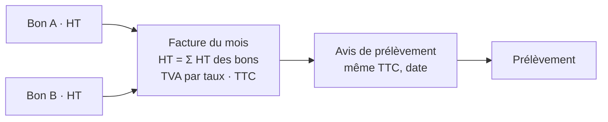

# Des bons et une facture qui concordent

> **Doc d'état**, écrite le 2026-10-09 à partir du code et du plan bâti les
> 8 et 9 octobre (F6-0, F6, F5-0, F5). Elle remplace le plan « bons et facture
> concordants » (supprimé ; il reste dans l'historique git, avec les
> objections de `vitruve`).

> « Pour un client qui compare ses bons avec une IA à ses factures, j'ai un
> problème si le montant diffère. » — Hugo, 2026-10-08.

**Un client ne voit jamais deux chiffres qui devraient être égaux et ne le
sont pas, et n'est jamais prélevé d'un montant qu'aucun document ne lui a
annoncé.**

## 1. Le HT de la facture est celui des bons (F6)

- Montant d'une ligne de facture = **Σ `lineTotalCents` des bons** de sa clé
  (produit, prix, taux) ; la TVA reste calculée une fois sur la facture
  (EN 16931). `invoice-lines.ts`.
- Admis par la norme (F6-0, lu sur les sources) : le Schematron CEN EN 16931
  (CII) ne vérifie pas BT-131 = quantité × prix ; Peppol R120 tolère 0,02.
  Les règles propres à la plateforme de réception française ne sont pas
  vérifiées.
- L'« arrondi des lignes » n'est plus un écart ; seule la **TVA** peut
  différer de quelques centimes de la somme des bons, et seulement dans les
  exports **internes** (dossier, relevé, CSV du lot).

## 2. Le régime d'une commande est une valeur (F5-0)

`settlementRegimeOf` → `paid | due | account | free`, figé à la passation
(`not_required` n'est écrit que par `Order.deferPayment()` et jamais
réécrit). La fiche, les e-mails et les écrans lisent cette seule valeur ; les
e-mails ne disent plus « payé » pour une commande au compte.

## 3. Le bon d'un pro au compte est en HT (F5)

- Au compte : **HT seul** et « TVA et TTC sur la facture du mois », sans
  aucun chiffre de TTC — bon PDF et texte, e-mail de confirmation, détail et
  historique client (« HT »), confirmation, panier.
- Le panier, qui précède la commande, lit `settlesOnAccount` (le même calcul
  qui ouvre « Ajouter au compte »).
- Livraison au compte : HT ; en mode prorata, sans taux.
- Les autres régimes (carte, public, gratuit) sont inchangés ; les bons PDF
  déjà archivés gardent leur TTC.
- Le catalogue pro était déjà en HT.

## 4. Ce qui reste ouvert

- Les CGV promettent-elles un TTC par bon ? (non vérifié ; arbitrage A28 de
  [`../arbitrages-en-absence.md`](../arbitrages-en-absence.md)).
- Les règles de la plateforme de réception française (CIUS FR).
