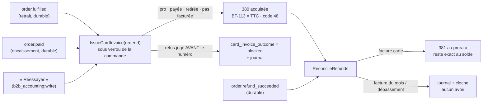

# La facture carte et les remboursements

> Doc d'état, écrite le 2026-10-09 à partir du code. Elle remplace le plan
> « La facture d'une commande payée par carte, et les remboursements »
> (supprimé ; il reste dans l'historique git, et des migration.sql le citent
> encore).

La facture, l'avoir, leur numérotation et leur rendu sont décrits dans
[`facture-emise.md`](facture-emise.md). Les choix faits en l'absence d'Hugo sont
dans [`../arbitrages-en-absence.md`](../arbitrages-en-absence.md).

## La règle

| Régime            | Facture                                         | Remboursement                       |
| ----------------- | ----------------------------------------------- | ----------------------------------- |
| Pro **au compte** | facture du mois                                 | pas de carte, donc pas d'avoir      |
| Pro **par carte** | **une facture acquittée par commande, retirée** | **un avoir** du montant remboursé   |
| Public            | jamais                                          | suivi (statut, journal), sans avoir |

- **La facture suit la livraison** : elle naît quand la commande est **retirée
  ET payée**, dans n'importe quel ordre. Datée du jour de l'émission (`Clock`) ;
  le jour du retrait est la date de livraison imprimée.
- Une commande remboursée **en totalité** avant son retrait n'est pas facturée.
- **Le remboursement reste un geste Stripe** : on le constate, on ne l'initie pas.
- **L'acheteur est le payeur légal** (`billedPayerOf`). Une commande sans
  `clientele` est pro si elle a une société.

## Les remboursements constatés

Table `public.order_refund` (`prisma/schema/public/order-refund.prisma`), une
ligne par remboursement Stripe, `stripe_refund_id` unique (idempotence),
énumération `OrderRefundStatus` (`pending`, `requires_action`, `succeeded`,
`failed`, `canceled`), `credit_note_id` posé une fois.

- **Webhook** : `refund.created`, `refund.updated`, `refund.failed`
  (`stripe-payment-gateway.ts`) ; `charge.refunded` est ignoré. Un remboursement
  sans intention ou sous un statut inconnu est ignoré. La commande se retrouve
  par son unique intention (`orders.stripe_payment_intent_id`).
- **L'agrégat** `OrderRefundLedger` (`b2b/orders/domain/entities/`) ;
  `RecordOrderRefundHandler` charge sous verrou de la commande, applique, sauve
  et journalise dans une unité de travail.
- **Statuts** : depuis une attente, tout s'applique ; depuis `succeeded`, seul
  `failed` (la commande `refunded` redevient `paid`) ; `succeeded` → `canceled`
  est refusé ; un statut plus ancien arrivé en retard est ignoré.
- **Plafond** : Σ `succeeded` ≤ `orders.total_cents`. `paymentStatus` passe à
  `refunded` au total ; un partiel laisse `paid`. Une commande annulée encaissée
  après coup reste `failed`.
- **Refus** (devise ≠ EUR, plafond, montant changé, réussi puis annulé) : rien
  sur la commande, `order.refund_rejected` au journal et à la cloche ; le webhook
  répond 200.
- **Hors commande** (lien libre) : `RefundWithoutOrderEvent` →
  `OnRefundWithoutOrder` (`b2b/payments`), `payment_refund.unmatched`, cloche vers
  « Liens libres ». Pas d'avoir automatique.
- **Journal** : `order.refund_recorded`, `order.fully_refunded`,
  `order.refund_rejected` — sans identifiant Stripe.
- **Lecture** : `OrderView.refunds` et `refundedCents` ; côté client,
  « Remboursée » / « Remboursée en partie (x €) », lu sur `paymentStatus` et le
  cumul. Carte « Remboursements » sur la fiche commande.
- Le webhook de production doit être abonné à ces événements : geste au
  [runbook](../../ops/runbook.md).

## La facture carte et l'avoir

- **Deux faits durables côté commandes**, écrits dans la transaction de leur
  écriture : `order.paid` (par `ConfirmOrderPaymentHandler`, au franchissement
  de `markPaid`) et `order.refund_succeeded` (par `RecordOrderRefundHandler`).
  Abonnés dans `b2b/accounting` : `issue-card-invoice-on-fulfilled`,
  `issue-card-invoice-on-paid`, `reconcile-refunds-on-refund`. Le retrait écouté
  est `order.fulfilled` (un par commande), jamais `handover.handed_over`.
- **`IssueCardInvoice`** est sans effet si une 380 couvre déjà le bon. **Tout
  refus se juge avant le numéro** (`prepareCardInvoice`, brouillon construit à
  blanc) : aucun rang consommé pour rien. Refus signalés dans
  `card_invoice_outcome` : manques de l'émetteur ou de l'acheteur
  (`invoiceIssuanceBlockers`), bon non facturable, entité qui ne peut pas
  encaisser, TTC recalculé ≠ encaissé. L'abonné ne boucle pas.
- **Acquittée** : moyen de paiement 48 (carte), déjà payé = TTC (BT-113,
  `paid_on`), `DuePayableAmount` = 0 ; échéance = le plus tard du jour du
  paiement et du jour d'émission (`cardInvoiceDueOn`). BT-72 (date de
  livraison) quand la pièce ne couvre qu'un bon livré. Aucune donnée de carte.
  PDF : « Facture acquittée le … par carte. Reste à payer : 0,00 € » ;
  l'e-mail dit « rien à régler ». Les mentions de pénalités restent exigées.
- **L'avoir** (`ReconcileRefunds`, `domain/services/refund-credit-note.ts`) :
  pour chaque remboursement `succeeded` sans avoir dont la commande a une facture
  carte, prorata du TTC restant par taux (plus forts restes), coupé en base et
  TVA ; le remboursement qui solde prend le **reste exact**. Une ligne
  « Remboursement » par taux, datée du jour. `order_refund.credit_note_id` est
  posé une fois (clé étrangère, unique, déclencheur
  `order_refund_credit_note_once`). Pas d'e-mail ; l'avoir est visible dans
  « Mes factures ».
- **Pas d'avoir automatique, signalé** (`order.refund_not_credited`, cloche
  « Remboursement sans avoir ») : commande sur une facture du mois, ou montant
  au-delà de ce que la facture porte encore.
- La facture du mois n'attrape jamais une commande carte (critère
  `payment_status = not_required`, éprouvé en e2e).

## Les écrans

- Fiche commande : carte « Facture et avoirs »
  (`GET admin/accounting/orders/:orderId/invoices`, `b2b_accounting:read`).
- « Prélèvement du mois » : carte « Factures carte signalées »
  (`GET admin/accounting/card-invoices/signals`) avec « Réessayer »
  (`POST admin/accounting/card-invoices/:orderId/retry`).
- La pièce et « Mes factures » : « Acquittée par carte le … »
  (`IssuedInvoiceView.paidOn`).

## Ce qui reste ouvert

- Un remboursement réussi qui **échoue** ensuite chez Stripe garde son avoir :
  aucune pièce inverse n'est émise.
- Une commande remboursée en totalité avant retrait, dont un remboursement
  échoue ensuite, redevient facturable sans déclencheur ; « Réessayer » ne la
  reprend que si elle a été signalée.
- **Au cabinet** : la ventilation de l'avoir au prorata des taux (Stripe ne dit
  pas quel produit est rendu).
- Le remboursement d'un lien libre qui soldait une facture du mois : l'avoir
  reste un geste humain.
- Initier un remboursement depuis le back-office : autre chantier.
