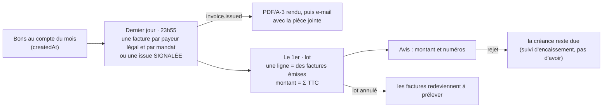
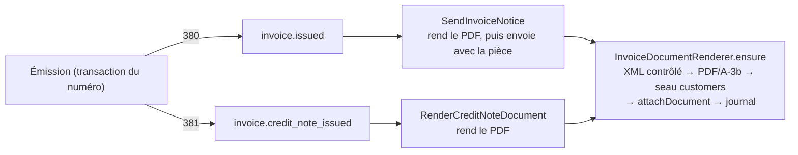

# La facture émise

> Doc d'état, écrite le 2026-10-09 à partir du code. Elle remplace le plan
> « L'émission de la facture » (supprimé ; il reste dans l'historique git, et
> des migration.sql le citent encore).

Les règles du CGI et du Code de commerce citées ici l'ont été **de mémoire** ;
le cabinet tranche. La facture carte et l'avoir de remboursement sont décrits
dans [`facture-carte-et-remboursements.md`](facture-carte-et-remboursements.md).

## Les règles (décisions d'Hugo)

- C'est la plateforme qui émet, tant qu'un logiciel comptable ne le fait pas ;
  elle fera toujours le fichier de prélèvement.
- Profil Factur-X **EN 16931**. Une facture pour **toute vente pro** ; le
  **public** n'en reçoit pas (bon chiffré).
- Numérotation continue et chronologique ; une facture émise ne se supprime
  pas, elle se compense par un **avoir** (381).
- **La facture précède le lot** : émise le dernier jour du mois, le lot du 1er
  ne fait qu'encaisser des factures émises (Q1).
- **Le mois est celui de la COMMANDE** (`createdAt`), pas de la livraison :
  « une commande faite le 30 ou le 31 et livrée le 1er est facturée sur le mois
  passé » (Q2). La facture du 31 au soir porte donc des bons pas encore livrés —
  **à confirmer par le cabinet**.
- **L'acheteur légal est la maison mère** ; l'émission prévient les rôles
  facturation de la maison mère **et** des sous-comptes dont les bons figurent
  sur la facture (Q3).
- **Pénalités** : l'écran propose le taux BCE + 10 points comme suggestion,
  rien n'est posé d'office (Q4).
- **Unité** : une pièce (`H87`) partout tant qu'aucun produit ne se vend au
  poids variable ; la ligne porte déjà son code d'unité et une quantité qui
  admet des décimales (Q5).
- **Une facture par (payeur légal, mandat effectif)**, émise à **23h55** (Paris).

## Le cycle

## Les mentions de paiement de l'entité

`InvoicePaymentTerms` sur l'entité émettrice (colonnes
`invoice_late_penalty_rate_bp`, `invoice_recovery_indemnity_cents`,
`invoice_early_payment_discount`), toutes nullables = « à renseigner ». Taux en
points de base (1 à 10 000), indemnité en centimes (4 000 à 100 000 — attrape un
« 40 » tapé en centimes), escompte en clair (1 à 200 caractères). Route
`PUT /admin/accounting/legal-entities/:id/invoice-payment-terms`, fait
`legal_entity.invoice_payment_terms_changed`. La carte « Mentions de la
facture » fait saisir le taux BCE (non enregistré) et propose BCE + 10 points ;
aucun taux BCE dans le code.

**Refus d'émettre**, nommés et sans valeur inventée :
`invoiceIssuanceBlockers(seller, buyer)` (`domain/services/invoice-issuance-blockers.ts`)
— entité absente ou archivée, vendeur incomplet (RCS ; TVA si la forme est
assujettie), mentions absentes, acheteur absent, sans SIREN, assujetti sans
TVA, plusieurs entités en service (`several_issuers`). Le dossier de
facturation les affiche en tête ; la fiche de l'entité, ceux du vendeur. Un
compte actif sans SIREN reste actif.

## L'agrégat `Invoice`

`b2b/accounting/domain/entities/invoice.ts` (+ `invoice.types.ts`,
`invoice-invariants.ts`, `invoice-parties.ts`), `value-objects/invoice-number.ts`,
`value-objects/invoice-quantity.ts`, `services/invoice-from-dossier.ts`.

- **Numéro** `FA-<année>-<6 chiffres>`, avoirs dans la même séquence ; l'année
  est celle de `issued_on`.
- **Parties figées** (vendeur, acheteur = payeur légal) ; mentions copiées de
  l'entité, catégorie `goods`, pas d'option sur les débits.
  `Invoice.issue` juge les manques **avant** tout le reste
  (`InvoiceIssuanceBlockedError`, 409).
- **Quantité** en millièmes entiers ; `H87` reste entière, `KGM` admet trois
  décimales.
- **Dates de livraison réelles** par bon (`orders[].deliveredOn`), `null` si
  inconnue.
- **Remises et frais** : pas de ligne à part, ils vivent dans la ventilation par
  taux.
- **Invariants** (`InvoiceTotalsMismatchError`, 500) : Σ lignes par taux, base =
  marchandise − remises + frais, Σ bases = HT, Σ TVA = TVA, TTC = HT + TVA ;
  échéance ≥ émission.
- **Avoir** (`Invoice.creditNote`) : reprend parties et mentions de la facture
  corrigée, sans échéance ; refuse de corriger un avoir, une date antérieure, un
  bon absent de la facture, un avoir à zéro ; plafond par taux = facture −
  avoirs déjà émis.
- **Immuable** : seule mutation, `attachDocument`, une fois. **Pas de statut de
  paiement** : « prélevée », « rejetée » vivent dans le suivi d'encaissement.

## La persistance et la numérotation

Schéma `apps/lfd-api/prisma/schema/public/invoice.prisma` ; tables `invoice`,
`invoice_order`, `invoice_number_counter`, `invoice_monthly_outcome`,
`invoice_autopilot_run`, `invoicing_floor`. Ports `InvoiceNumbering`,
`InvoiceRepository` (`insert`, `attachDocument`), `InvoiceReader` ; service
`InvoiceIssuer` (`application/services/invoice-issuer.ts`).

- **Compteur par (entité, année)**, avancé par `INSERT … ON CONFLICT DO UPDATE …
WHERE last_issued_on <= jour` dans la transaction de l'émission, refusé hors
  transaction. Un jour antérieur à la dernière émission est refusé
  (`InvoiceIssuedBeforePreviousError`, 409). La base refuse un compteur qui ne
  naît pas à 1, qui avance d'autre chose que +1, qui recule ou qu'on supprime.
  Un refus défait la transaction et rend le rang : aucun trou.
- **Le brouillon se construit après le numéro** : `InvoiceIssuer.issue` reçoit
  une fonction `draft(number)`.
- **Numéro unique dans toute la base**, en plus de (entité, année, rang).
- **Un bon n'est facturé qu'une fois** : index partiel unique sur
  `invoice_order.order_id` pour les seules 380. Un avoir, même total, ne libère
  pas ses bons.
- **Immuabilité en base** : `invoice_immutable` refuse `DELETE` et `UPDATE` sauf
  `document_key` + `document_sha256` de NULL à une valeur, une fois ;
  `invoice_order_immutable` refuse tout. Contrôles : format du numéro, année,
  381 ⇔ facture corrigée (`corrects_invoice_id`), avoir sans échéance, TTC = HT + TVA.
- Aucune donnée personnelle (l'acheteur est une société).

## La facture du mois

`IssueMonthlyInvoicesCommand` (`application/commands/issue-monthly-invoices.handler.ts`),
domaine `domain/services/monthly-invoicing.ts`. Routes
`GET|POST admin/accounting/monthly-invoices` (`b2b_accounting`, le bouton
« Émettre les factures de … ») et `POST admin/accounting/monthly-invoices/autopilot`
(machine, `http/invoice-autopilot.controller.ts`). Cron `55 21,22 * * *`
(`MONTHLY_INVOICE_CRON`, `apps/lfd-api/container/worker.ts` et
`apps/lfd-api/wrangler.jsonc`).

- **Périmètre** : les bons passés au compte (`billableOrderWhere`) créés depuis
  le plancher jusqu'à la fin du mois, qu'aucune 380 ne porte encore ; payeur par
  `billedPayerOf`, mandat par `effectiveMandateOf` (la règle du lot). Les bons
  sans mandat effectif font leur facture, sans moyen de paiement.
- **Le moment** : `MONTHLY_INVOICE_TIME` = 23:55 ouvre l'émission ET le bouton
  (`MonthNotYetInvoiceableError` avant). Le cron UTC tombe deux fois ; le
  handler décide sur l'heure de Paris. Le passage horaire du lot (`15 * * * *`)
  garde la facture en tête, en rattrapage seulement. Une tentative par (entité,
  mois) dans `invoice_autopilot_run`. Ne dépend pas de « préparer le lot tout
  seul ». L'émission refuse sous une entité qui n'est pas la seule
  (`NotTheInvoicingEntityError`).
- **Jamais d'antidate** : `issued_on` = dernier jour du mois si l'émission a lieu
  ce jour-là ; sinon le jour réel (Paris), et l'écran dit « émise en retard ».
  `due_on` = l'échéance du calendrier de prélèvement, jamais avant `issued_on`.
- **Une transaction courte par facture** : la pièce et son issue
  (`invoice_monthly_outcome`, clé payeur + mandat, `''` = sans mandat) partent
  ensemble. Un refus défait facture et numéro ; l'issue `blocked` porte le
  message, l'écran la montre (colonne « Mandat (RUM) »), le reste continue. Une
  issue `issued` est définitive.
- **Rejouable** : une facture déjà émise pour (payeur, mandat) est sautée et
  comptée (`alreadyInvoiced`). Un bon non facturable (incohérent, surtaxe sans
  taux) est laissé hors de la facture et cité sur l'issue ; seul, il la signale.
- **Ordre** : payeurs dans l'ordre de leur premier bon, puis leurs factures dans
  l'ordre du premier bon de chacune.
- **Moyen de paiement BG-16** (`invoice.payment_means`, `{code: "59",
mandateReference}`) : le mandat du groupe.

### Le lot encaisse des factures

`domain/services/collection-assembly.ts` : un bon facturé se juge **avec sa
facture**, entière ou rien. Une ligne regroupe les factures du payeur sous un
mandat, montant = Σ TTC (`collection_batch_line_invoice`) ; un bon écarté écarte
toute la facture ; une facture dont un bon n'est plus ouvert attend.
`invoice_split` ne sert plus que de filet quand les mandats ont changé entre
l'émission et le lot. L'avis cite les numéros (`collection_notice.invoice_numbers`),
le `RmtInf` aussi. Un lot annulé relâche ses factures.

**La bascule** : `invoicing_floor`, posé par migration au 1er du mois qui suit le
déploiement. Avant, un bon garde l'arrêté figé ; depuis, un bon sans facture
**attend** la sienne. Un bon facturé suit toujours sa facture.

## Le rendu Factur-X

- **XML CII EN 16931** : `renderFacturXml(invoice)` (`domain/services/facturx-xml.ts`
  et `facturx-format.ts`, `facturx-parties.ts`, `facturx-settlement.ts`,
  `facturx-mentions.ts`), fonction pure, sans bibliothèque. Montants en
  arithmétique entière. Remises et frais (BG-20/21) un élément par taux non nul.
  Mentions en BT-20 et notes BG-1. La liste des bons et leurs livraisons réelles
  vivent en note (BT-13 n'admet qu'une référence). BG-16 : `CreditorReferenceID`
  (ICS), type 59, `DirectDebitMandateID`. `facturXArithmeticViolations(xml)`
  rejoue BR-CO-10 à 16, BR-S-08, BR-S-09.
- **PDF/A-3b** : `renderInvoicePdf` (`domain/services/invoice-pdf.ts`,
  `facturx-pdf-document.ts`, `facturx-xmp.ts`, `invoice-pdf-*.ts`), `pdfkit`
  0.20.2, PDF 1.7. Le XML est joint octet pour octet (`factur-x.xml`,
  `AFRelationship /Alternative`) ; une pièce dont le XML viole l'arithmétique est
  refusée (`InvoiceXmlInconsistentError`). XMP Factur-X `ConformanceLevel=EN 16931`.
  Polices Source Sans 3 (OFL) dans `apps/lfd-api/fonts/`, par le port
  `InvoiceFontSource`. **Déterministe** : deux rendus = mêmes octets.
- **Le seau** : `CustomerDocumentStore` (seau `customers`, sans `delete`), clé
  `invoices/<entité>/<numéro>.pdf` jamais réécrite ; une autre empreinte sur la
  même clé est un refus visible (`InvoiceDocumentConflictError`). Le verrou de
  dix ans est un geste au [runbook](../../ops/runbook.md) (« Verrouiller les PDF
  des factures pour dix ans »).
- **Lecture** : l'empreinte est vérifiée avant de servir
  (`InvoiceDocumentTamperedError`) ; pas encore rendu → 404
  `accounting.invoice.document_not_rendered`.
- **Journal** : `invoice.document_rendered`, `invoice.document_render_failed`.

## Prévenir, consulter, renvoyer

- **E-mail** : fait durable `invoice.issued` (380 seulement), abonné
  `SendInvoiceNotice` → `InvoiceNoticeSender`, gabarit `customer.invoice-issued`
  (`platform/mailer/invoice-issued-mail.ts`, dictionnaire `invoiceIssued`). Le
  PDF est rendu d'abord puis joint ; un rendu en échec laisse partir l'e-mail
  sans pièce. Destinataires (`invoiceNoticeRecipients`) : le contact `billing`
  le plus ancien du payeur (sinon son détenteur), et les contacts et membres
  `billing` de chaque société qui a un bon sur la facture. Clé d'idempotence par
  facture et par adresse. Journal : `invoice.notice_sent` (nombre, jamais les
  adresses) ou `invoice.notice_failed`. Pas d'e-mail pour un avoir.
- **Langue** : le gabarit prend une `locale` ; l'expéditeur passe le français,
  faute de langue de destinataire. Les valeurs (dates, montants) sont mises en
  forme en français par `invoice-notice-wording.ts`.
- **Mes factures** (boutique, `/mon-compte#compte-invoices` ; `/mes-factures` y
  redirige) : routes `GET companies/:companyId/invoices[/:invoiceId[/pdf]]`,
  détenteur et rôle facturation ; non-membre 404, autre rôle 403. Le mur est dans
  la requête (`CompanyInvoicesReader`) : la société est l'acheteur, **ou** un bon
  de la pièce a été passé par elle — un site voit donc la facture entière de sa
  maison mère. Aucune donnée de paiement hormis la RUM figée.
- **Back-office** : carte « Factures émises » de l'onglet « Facturation » de la
  fiche (`GET admin/companies/:companyId/invoices`), pièce sur
  `/comptabilite/factures/:id` (`GET admin/accounting/invoices/:invoiceId[/pdf]`,
  `b2b_accounting:read`).
- **Renvoyer l'e-mail** : `POST admin/accounting/invoices/:invoiceId/resend-notice`
  (`b2b_accounting:write`), `ResendInvoiceNoticeCommand`. Rend le PDF s'il
  manque, envoie aux destinataires d'aujourd'hui sous une clé neuve, journalise
  `invoice.notice_resent`. Refus (409) : un avoir, personne à prévenir, un refus
  du fournisseur.

## Ce qui reste ouvert

- **Validation externe** : ni Schematron CEN EN 16931, ni XSD CII, ni veraPDF
  ne tournent (téléchargements à soumettre à Hugo). Le profil, les codes de notes
  et l'ordre des éléments sont écrits de mémoire.
- **Le verrou d'objet du seau** (runbook) n'est pas posé.
- **Re-rendu** : aucun geste dédié pour une pièce dont le rendu a échoué ; le
  renvoi de l'e-mail le fait au passage.
- **Une seconde entité émettrice** : le numéro ne nomme pas l'entité — préfixe
  ou séquence commune à trancher avant qu'elle émette.
- **Refacturer après avoir** : l'index unique ne relâche pas les bons d'un avoir.
- **XML** : BT-13 pour plusieurs bons, BT-26 (date de la facture corrigée) non
  figée sur l'avoir, adresses structurées plutôt que relues dans des lignes.
- **Adresse de livraison** non figée (`deliveryAddressLines: null`).
- **Mandat changé entre 23h55 et le lot** : la facture est écartée
  (`invoice_split` ou `no_mandate`) alors que BG-16 nomme déjà un mandat.
- **Rattrapage après minuit** : la facture porte le 1er (« émise en retard ») —
  acceptable, ou dater du dernier jour tant que le lot n'est pas fait ?
- **Journal** : aucun fait pour la tentative automatique ni pour une facture
  signalée.
- **Au cabinet** : facture établie avant la livraison (Q2), nouvelles mentions
  de la réforme.
- **F5** (bons en HT pour les pros au compte) reste à faire.
