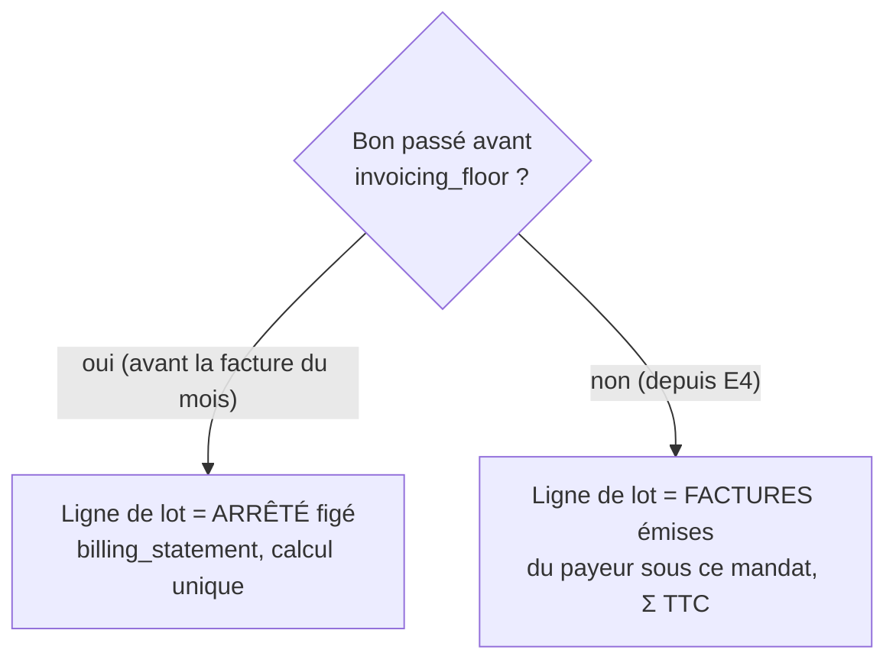

# Le prélèvement suit la facture

> **Doc d'état**, écrite le 2026-10-08 à partir du code et du plan bâti le même
> jour (F1 à F4), puis d'E4. Elle remplace le plan « le prélèvement suit la
> facture » (supprimé ; il reste dans l'historique git, et des `migration.sql`
> le citent encore). Le plan avait été contredit par `vitruve`.

> « C'est nous qui ferons toujours le fichier de prélèvement pour la
> banque » — Hugo, 2026-10-08.

**Le montant prélevé est le total d'une pièce que nous figeons, jamais la
somme des bons.** La facture calculée en une fois (EN 16931) diffère de
quelques centimes de la somme des bons ; le client doit être prélevé de ce
que sa facture dit.

## 1. Deux régimes, selon la date du bon

- **Depuis la facture du mois** (E4, [`../prelevement/prelevement-automatique.md`](../prelevement/prelevement-automatique.md)) :
  une ligne de lot encaisse les factures émises non encore prélevées, par
  mandat (`collection_batch_line_invoice`) ; aucun arrêté.
- **Avant** (`invoicing_floor` = 1er du mois qui suit le déploiement) :
  la ligne porte un **arrêté de facturation** (ci-dessous). Les arrêtés
  existants restent lisibles.

## 2. L'arrêté de facturation (bons d'avant la facture du mois)

- **Une ligne de débit = un arrêté** : la facture de exactement ses bons,
  calculée par `simulateInvoiceDossier`
  ([`simulateur-dossier-de-facturation.md`](simulateur-dossier-de-facturation.md)) ;
  le montant de la ligne est son total TTC, `orders_total_cents` garde Σ bons.
- **Table** `billing_statement` (+ `billing_statement_order`) : vendeur et
  acheteur figés (jamais l'IBAN), période, totaux, `body` (lignes, remises,
  frais, ventilation), `body_version`, `computed_with`
  (`invoice-dossier/2026-10-08-f6` depuis F6). Pas de numéro : ce n'est pas
  une facture.
- **Immuable en base** (`billing_statement_immutable`) : ni `DELETE`, ni
  modification hors `active → cancelled` ; annuler le lot annule ses arrêtés
  dans la même transaction.
- Faits `billing_statement.issued` / `.cancelled`.

## 3. Le bon qu'on ne sait pas facturer

Jugé **seul** (`invoice-billability.ts`) : surtaxe sans taux, taux illisible
ou total incohérent → **exclu du lot** (`unbillable`), nommé en tête, sans
bloquer les autres payeurs. Il revient au lot suivant une fois corrigé.

## 4. Les écrans et routes

- Le lot (`prelevement-du-mois/batch-lines/`) : par ligne, Σ bons, total
  facturé, écart signé, et ses factures ou son arrêté.
- `GET admin/accounting/billing-statements/:id` relit l'arrêté sans recalcul
  (le `body` est revalidé par zod) ; page `comptabilite/arretes-de-facturation/:id`.
- Le CSV de contrôle porte Σ bons et écart ; son total reste Σ lignes =
  `CtrlSum`. Une ligne d'avant F2 se lit « lot d'avant l'arrêté ».

## 5. Ce qui reste ouvert

- **Un logiciel comptable** recevra un jour nos pièces : reprend-il un total
  figé ou recalcule-t-il ? À vérifier au choix du logiciel.
- **Au cabinet** : une facture par mandat (E4b) pour un payeur dont les sites
  ont chacun leur mandat.
