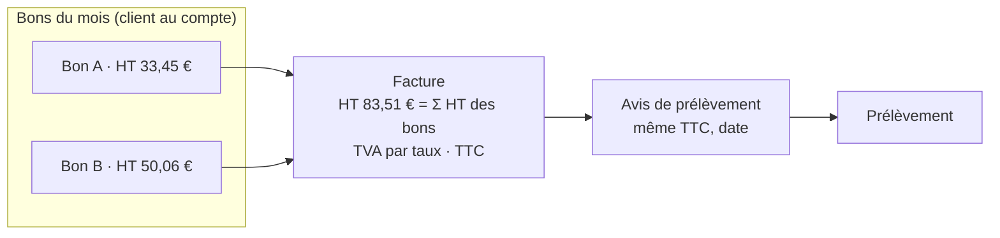

# Des bons et une facture qui concordent

> 📐 **Plan v2 — F5-0 et F6 bâtis** (2026-10-08), **F5 bâti** (2026-10-09). Suite de
> [`le-prelevement-suit-la-facture.md`](le-prelevement-suit-la-facture.md).
> Touche **l'argent** : la v1 a été contredite par `vitruve` le même jour
> (deux BLOQUANTS, six SÉRIEUX), repris au § 8.

## 1. Le problème (Hugo, 2026-10-08)

> « Pour un client qui compare ses bons avec une IA à ses factures, j'ai un
> problème si le montant diffère. »

La facture calcule la TVA une fois sur le mois (EN 16931) ; chaque bon
l'avait arrondie pour lui seul. Les deux TTC peuvent différer de quelques
centimes sans erreur nulle part, et une différence ressemble à une erreur.

## 2. La règle

**Un client ne doit jamais voir deux chiffres qui devraient être égaux et
ne le sont pas — ni être prélevé d'un montant qu'aucun document ne lui a
annoncé.**

## 3. L'ordre, et pourquoi F5 vient en dernier

Retirer le TTC des bons n'est permis que si le client reçoit **avant** le
débit un document qui le lui donne. Aujourd'hui, aucun : la facture n'est
pas émise et l'avis de prélèvement n'existe pas
(`le-prelevement-suit-la-facture.md`). L'ordre est donc :

1. **F6** — la facture reprend les montants des bons ;
2. **la facture émise** et **l'avis de prélèvement** — chantiers à part ;
3. **F5** — le bon au compte passe en HT.

## 4. F6 — La facture reprend les montants des bons

Aujourd'hui (`invoice-lines.ts`), une ligne « produit × prix » recalcule
son montant : `arrondi(Σ quantité × prix ÷ 1000)` ; il peut différer d'un
centime de Σ des `lineTotalCents` des bons (`packages/money/src/millicents.ts:73-78`).

> ✅ **F6-0 fait le 2026-10-08** (lu sur les sources, pas exécuté) :
>
> - **Schematron CEN EN 16931, syntaxe CII** (celle de Factur-X,
>   `ConnectingEurope/eInvoicing-EN16931`, `cii/schematron/abstract/EN16931-CII-model.sch`) :
>   **aucune règle ne vérifie BT-131 = BT-129 × BT-146 ÷ BT-149.** Sur la
>   ligne, seulement la présence (BR-22, BR-24, BR-26), le signe du prix
>   (BR-27) et deux décimales au plus (BR-DEC-23). Les sommes, elles, sont
>   vérifiées : BR-CO-10 (Σ BT-131 = BT-106), BR-S-08 (base par catégorie),
>   BR-S-09 (TVA = base × taux).
> - **Peppol BIS 3.0, PEPPOL-EN16931-R120** : la vérifie, avec une
>   tolérance de **0,02** (`u:slack(…, 0.02)`) ; un écart d'un centime passe.
> - **Non vérifié** : les règles propres à la plateforme de réception
>   française (CIUS FR, règles BR-FR) ; les écarts de BR-S-09 sur notre
>   arrondi.
> - **Conséquence** : le montant repris des bons est admis ; on garde D2 (une
>   ligne par produit et par prix). La branche « une ligne par ligne de bon »
>   n'est plus nécessaire, Q1 tombe.

**D'abord vérifier, sur le Schematron EN 16931 et le validateur de la
plateforme de réception retenue** : BT-131 = BT-146 × BT-129 ÷ BT-149 est-il
contrôlé, et avec quelle tolérance ; combien de décimales BT-146 admet
(nos prix ont cinq décimales en euros) ; la tolérance de BR-CO-17. Rien
n'est tranché avant ce test, parce que le choix est **irréversible au
premier Factur-X émis**.

- **Si le montant repris est admis** : montant de ligne = Σ `lineTotalCents`,
  le regroupement par produit et prix (D2) est gardé. L'écart « arrondi des
  lignes » du simulateur devient nul **par construction** : il cesse d'être
  un contrôle et sort de l'écran, au lieu d'y rester comme une tautologie.
- **Sinon** : une ligne de facture par ligne de bon. C'est **revenir sur
  D2** (une ligne par produit et par prix), avec ce que ça défait —
  plage de dates et « vendu aussi sous… » inutiles, contrat `InvoiceLine`,
  CSV et écran du dossier, une facture aussi longue que le mois. Décision
  d'Hugo, pas un repli.
- La ventilation par taux (`invoiceVatBreakdown`) ne change pas.

## 5. F5 — Le bon d'un client au compte n'affiche que le HT

> **Périmètre (Hugo, 2026-10-08)** : « au compte » ne concerne que les
> **pros** au compte. Le public voit du TTC et n'est jamais au compte ; le
> pro voit **déjà** la boutique et le catalogue en HT. F5 ne touche donc
> que ce qui montre encore un TTC à un pro au compte : le bon, son PDF, ses
> e-mails, le récapitulatif et le total du panier. Le catalogue n'est pas
> concerné.

Après la facture émise et l'avis de prélèvement (§ 3).

- **La donnée** : « au compte » est aujourd'hui une déduction,
  `paymentStatus = 'not_required' ∧ totalCents > 0`
  (`billable-order-criterion.ts`). F5 commence par établir qu'un
  `not_required` ne change jamais après la passation, puis en fait **une
  valeur nommée, calculée une fois** et lue par la fiche, les e-mails et
  l'assiette du prélèvement — pas trois copies du critère.
- **La fiche de commande** (`packages/contracts/src/order-sheet.ts`) gagne ce
  régime. Ça corrige au passage un défaut d'aujourd'hui : les e-mails le
  devinent (`mail-templates.ts:422`, `settlementOf`), et une commande au
  compte non nulle part avec le libellé « payé ».
- **La livraison HT** : son taux suit le mode figé
  (`deliveryVatMode`) ; en prorata, elle n'a pas un taux unique, et le bon
  la montre en HT sans taux.
- **Toutes les surfaces** qui montrent un TTC à un client au compte, relevées
  le 2026-10-08 :
  - fiche et PDF : `order-sheet.ts`, `order-sheet-pdf.ts`,
    `order-sheet-text.ts`, `order-documents.ts`, `order-pricing.ts` ;
  - espace client : `mes-commandes/order-detail/order-detail.html`,
    `apps/lfc-ecommerce-frontend/src/app/client/commande/confirmation-page/confirmation-page.html` ;
  - panier et devis : `cart-total.ts`, `cart-summary.html`,
    `cart-product-line.ts`, `shop-quote.service.ts`,
    `client-cart.service.ts`, `quote-my-shop-cart.handler.ts`,
    `quote-order.handler.ts` ;
  - e-mails : confirmation, `payment-failed`, `payment-expired`,
    `order-payment-link` (`mail-templates.ts`) ;
  - le **catalogue** : prix des tuiles et fiches produit
    (`shop-price-basis.service.ts`, `product-tile.ts`, `product-sheet.ts`).
- Les montants figés ne bougent pas : c'est un affichage.

## 6. Ce qui reste visible

L'écart de TVA (Σ TVA des bons contre TVA de la facture) reste dans les
exports **internes** : relevé de cycle, CSV du lot, dossier de
facturation (routes `admin/`). À ne pas transmettre au client tel quel ;
s'ils doivent l'être un jour, ils liront l'arrêté.

## 7. Questions à Hugo

- **Q1** — Si la norme refuse le montant repris : revenir sur D2 avec une
  ligne de facture par ligne de bon ?
- **Q2** — Le **total du panier** d'un pro au compte en HT seul ? _Proposé :
  oui_ ; le catalogue pro est déjà en HT (Hugo, 2026-10-08).
- **Q3** — Vos CGV promettent-elles un TTC par bon ?

## 8. Ce que `vitruve` a relevé (v1, 2026-10-08)

- **BLOQUANTS, corrigés** : F5 retirait le seul TTC du client sans facture
  ni avis de prélèvement → F5 en dernier (§ 3) ; la fiche ne sait pas qu'une
  commande est au compte, et les e-mails disent « payé » → régime ajouté à
  la fiche (§ 5).
- **SÉRIEUX, corrigés** : critère « au compte » déduit et non figé (§ 5) ;
  surfaces incomplètes, catalogue compris (§ 5, Q2) ; livraison au prorata
  sans taux unique (§ 5) ; F6 option 2 revient sur D2 (§ 4, Q1) ; l'écart
  des lignes devient une tautologie (§ 4) ; l'écart de TVA reste dans les
  exports internes (§ 6).
- **Non vérifié** : les règles exactes du Schematron et de la plateforme
  (le premier geste de F6) ; un texte qui imposerait un prix sur un bon de
  livraison B2B (aucun connu ; la facture récapitulative est admise, CGI
  art. 289-I-3) ; le `RmtInf` du fichier bancaire.

## 9. Les lots

| Lot      | Contenu                                                                                                                                                               |
| -------- | --------------------------------------------------------------------------------------------------------------------------------------------------------------------- |
| **F6-0** | ✅ 2026-10-08 — le Schematron CEN ne vérifie pas BT-131, Peppol tolère 0,02 : montant repris admis                                                                    |
| **F6**   | ✅ 2026-10-08 — montant de ligne = Σ `lineTotalCents` des bons (D2 gardé) ; écart « arrondi des lignes » retiré ; `computed_with` → `invoice-dossier/2026-10-08-f6`   |
| **F5-0** | ✅ 2026-10-08 : `settlementRegimeOf` (paid/due/account/free) porté par `money.settlement` de la fiche ; e-mails corrigés                                              |
| **F5**   | ✅ 2026-10-09 — un pro au compte ne lit que le HT : fiche, PDF, texte, e-mail, espace client, confirmation, panier ; régime porté par la vue (`OrderView.settlement`) |

F5-0 se bâtit tout de suite : il corrige un libellé faux aujourd'hui.

**Tranché en bâtissant F6 (2026-10-08)** :

- `invoice-lines.ts` reprend Σ `lineTotalCents` ; quantité, prix unitaire,
  période et libellé inchangés. La ventilation par taux ne change pas : elle
  taxe désormais la somme des HT des bons.
- L'écart « arrondi des lignes » sort du simulateur, du contrat
  `InvoiceDossierGapsView`, du CSV des écarts et de l'écran ; l'invariant
  devient total facture − Σ bons = arrondi de la TVA + TVA non ventilée + bons
  incohérents. Le champ `ordersLineTotalCents` de la ligne reste (égal à
  `amountCents`) : le corps JSON des arrêtés le porte.
- Le montant d'une ligne de prélèvement (F2) suit le total de la facture : il
  bouge avec elle (exemple des tests : deux bons à 10,5 c HT, 22 → 23 c, contre
  24 c de bons). Un lot déjà constitué garde son montant.
- Arrêtés (F3) : **`computed_with`** passe à `invoice-dossier/2026-10-08-f6`
  (le calcul change) ; **`body_version` reste 1** (la forme du JSON ne bouge
  pas), et le lecteur lit les arrêtés figés avant F6 tels quels.

**Constat F5-0 (2026-10-08)** : `not_required` n'est écrit qu'à la passation
(`Order.deferPayment()`) ; aucune écriture postérieure n'en part (paiement,
refus, abandon, échec à la clôture ne partent que de `pending`/`failed`) et le
total n'est jamais réécrit. Le régime est donc figé à la passation. Seule
exception : le semis de dev force `paid`. Un particulier n'est jamais au
compte : la boutique ne diffère que sur un total nul.

**F5 bâti (2026-10-09)** — en l'absence d'Hugo ; arbitrages pris par
l'orchestrateur : **Q2 = oui** (le total du panier d'un pro au compte est en
HT) ; **Q3 inconnue** — le bon au compte ne porte **aucun** chiffre de TVA ni
de TTC, seulement le HT et la mention « TVA et TTC sur la facture du mois ».
Le public et les pros par carte ne changent pas.

- **Une seule valeur** : `settlementRegimeOf` est calculé une fois par le
  lecteur (`prisma-order.reader.ts`) et porté par `OrderView.settlement` et
  `CustomerOrderView.settlement` ; la fiche (`money.settlement`) le recopie au
  lieu de le recalculer. `Order.settlementRegime` rend la même dérivation à la
  passation, et `PlacedOrderResponse.settlement` (facultatif : absent sur la
  route publique, qui ne place jamais au compte) le transmet à la
  confirmation. Aucun écran ne recopie `not_required ∧ total > 0`.
- **Le HT montré = total − TVA figés** : aucun montant n'est recalculé ni
  écrit. Aucune migration.
- **Surfaces au compte** : pavé de totaux du PDF (« Total HT » + mention, plus
  de « Total avant TVA », « dont TVA », « Total TTC ») ; bon texte ; e-mail de
  confirmation (« Porté à votre compte, HT » + « TVA et TTC — sur la facture
  du mois », fr/en/it) ; détail de commande partagé (`@lfd/b2b-ui`, en-tête et
  récapitulatif — donc aussi le back-office, qui montre au téléphone le même
  papier que le client) ; document « Facture » (« Portée sur la facture du
  mois ») ; espace client (historique, suivi : montant suivi de « HT » ;
  tiroir : « portée à la facture du mois, avec la TVA et le TTC », qui
  remplace un « facture de mars » écrit en dur) ; confirmation ; panier.
- **Livraison** : HT ; en mode prorata, au compte, sans taux (ni dans le
  récapitulatif, ni au panier) ; en mode standard, « TVA 20 % » reste.
- **Le panier précède le régime** : avant la passation, c'est la condition de
  la société (`settlesOnAccount`, le seul calcul du front) qui décide du HT.
  Payer par carte reste ouvert au mensuel ; l'écran de règlement montre alors
  le montant TTC débité.
- **Inchangé, et vérifié** : les e-mails `payment-failed`, `payment-expired`
  et le lien de paiement ne partent que pour un règlement carte dû — jamais au
  compte. Les devis serveur (`quote-my-shop-cart`, `quote-order`) rendent
  toujours HT et TTC : c'est l'affichage qui choisit. Le catalogue pro était
  déjà en HT.
- **Les PDF déjà archivés** (R2, clé par révision) gardent leur TTC : un papier
  parti est un fait (`OrderSheetArchive`). Seuls les premiers tirages après F5
  sont en HT.
