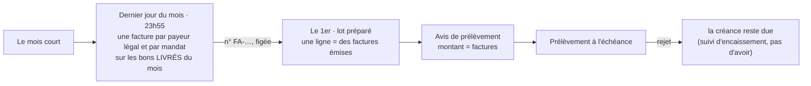
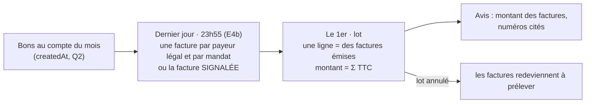
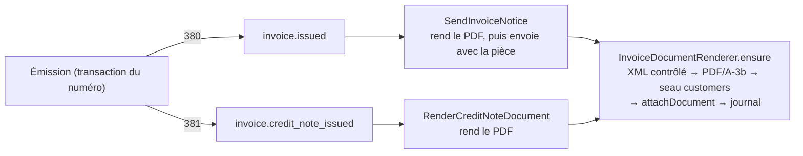

# L'émission de la facture

> 📐 **Plan v2 ; E0, E1, E2, E3a, E3b, E4, E4b et E6 bâtis le 2026-10-08** (§ 8.1 à § 8.7). Touche **l'argent** et un
> document légal : la v1 a été contredite par `vitruve` le même jour (trois
> BLOQUANTS, huit SÉRIEUX), repris au § 9. Les règles du CGI et du Code de
> commerce sont citées **de mémoire**, ni par l'agent ni par moi rouvertes en
> ligne : le cabinet tranche. Reprend
> [`../../b2b/architecture-facturation.md`](../../b2b/architecture-facturation.md)
> (2026-08-15) là où le code l'a dépassé.

## 1. Le besoin et les décisions d'Hugo

- **2026-10-08** : c'est nous qui émettons, tant qu'un logiciel comptable ne
  le fait pas, et c'est nous qui ferons toujours le fichier de prélèvement.
- **2026-10-08** : profil Factur-X **EN 16931** (version complète).
- **2026-10-08** : F5 (bons en HT pour les pros au compte) attend la facture
  réellement émise.
- **2026-08-15** : une facture pour **toute vente pro** ; la donnée
  structurée fait foi ; numérotation continue et chronologique ; une facture
  émise ne se supprime pas, elle se compense par un **avoir** (381).
- **2026-09-21** : le **public** ne reçoit pas de facture (bon chiffré).

## 2. Ce qui existe (vérifié le 2026-10-08)

- **L'arrêté figé** (`billing_statement`, F3) : par **ligne de débit** (par
  mandat, donc parfois par site), préparé **après** la clôture, sur les bons
  **passés** dans le mois (`billable-order-criterion.ts:49`, `createdAt`). Ses
  dates sont les dates **demandées**, parfois nulles. Il peut être annulé tant
  que le lot n'est pas déposé.
- **L'entité émettrice** porte le bloc vendeur (raison sociale, forme, SIREN,
  TVA, RCS, capital, adresse), pas les mentions de retard.
- **L'acheteur** : `companies.siren` et `tva_intracom` valent `""` par défaut.
- **Les dates de livraison réelles** existent par les faits de retrait et de
  tournée (DF3).
- **Aucune bibliothèque PDF** dans le dépôt.
- **Les remboursements par carte** ne sont pas suivis.

## 3. La décision structurante : la facture avant le lot

La facture récapitulative d'un mois porte sur les **livraisons** du mois et
s'établit **au plus tard à la fin de ce mois** ; sa numérotation est
**chronologique** (CGI art. 289-I-3 et 242 nonies A, de mémoire). Notre
lot, lui, se prépare le 1er, sur les bons **passés**. Les deux ne tiennent pas
ensemble : une facture datée du mois écoulé et numérotée le 1er passerait
après une facture carte du 1er à 00h30 ; une facture qui recopie l'arrêté
facturerait un bon livré le mois suivant.

**Proposé** — la facture devient la pièce, le lot ne fait que l'encaisser :



- La facture remplace l'arrêté comme source du montant : une ligne de lot
  encaisse une ou plusieurs factures émises ; l'arrêté ne naît plus.
- Annuler un lot n'annule aucune facture : elle reste due, le lot suivant la
  reprend.
- Une correction après émission (bon faux, geste commercial) se fait par
  **avoir**, jamais en défaisant la facture.
- Le périmètre passe à la **date de livraison réelle** (Q2) ; un bon non
  livré dans le mois attend le mois suivant.

## 4. Les deux régimes

| Régime            | Émise quand ?                                         | Sur quoi                |
| ----------------- | ----------------------------------------------------- | ----------------------- |
| **Pro au compte** | dernier jour du mois, 23h55 (heure de Paris, E4b)     | les bons livrés du mois |
| **Pro par carte** | **à la livraison** (fait de retrait), pas au paiement | la commande seule       |
| **Public**        | jamais                                                | —                       |

Un paiement par carte avant livraison est un acompte, pas une vente : la
facture suit la livraison. **E5 attend le suivi des remboursements** (plan à
part) : une commande payée, livrée puis remboursée doit produire son avoir.

## 5. Le modèle

`Invoice`, agrégat de `b2b/accounting/domain/` :

```
id, number                 ← FA-<année>-<n°>, attribué à l'émission
legal_entity_id            ← une séquence PAR ENTITÉ ET PAR ANNÉE (§9)
type                       ← 380 facture | 381 avoir (+ invoice_id corrigée)
issued_on, due_on          ← due_on = date du prélèvement / à réception
seller, buyer              ← figés ; buyer = le PAYEUR LÉGAL (Q3)
lines                      ← par produit et par prix (D2), HT repris des bons (F6),
                             + références des bons (BT-13) et dates de livraison RÉELLES
delivery_address           ← si elle diffère de l'adresse de facturation
vat_breakdown, totals
mentions                   ← pénalités (Q4), indemnité 40 €, escompte « néant »,
                             catégorie « livraison de biens », pas d'option débits
document_key, sha256       ← posés UNE fois, après le rendu
```

- **Le statut de paiement n'est pas sur la facture.** Elle est une pièce
  immuable ; « prélevée », « rejetée », « réglée par carte » vivent dans le
  suivi d'encaissement (`collection_*`, `order_collection`).
- **Refus d'émettre**, nommés, sans valeur inventée : acheteur sans SIREN ;
  acheteur assujetti sans TVA ; mentions de retard absentes ; vendeur
  incomplet.
- **Immuabilité** : port `insert` + `attachDocument` (une seule fois) ;
  déclencheur en base qui refuse tout le reste, et `document_key` de NULL à
  une valeur, une seule fois.
- **Numérotation** : un compteur par (entité, année), `FOR UPDATE`, dans la
  transaction de l'émission ; un rollback rend le numéro avec la
  transaction, aucun trou. La facture du mois se fait **payeur par payeur**,
  une transaction courte chacune, pour ne pas bloquer les factures carte.

## 6. Le rendu Factur-X

- **Après** la transaction d'émission, par un fait durable : XML CII EN 16931,
  PDF/A-3 avec le XML embarqué, dépôt en stockage objet, puis
  `attachDocument`. Une facture émise sans rendu est un état visible et
  rejouable.
- **Validation** dans les tests : Schematron CEN EN 16931 (CII) pour le XML,
  **veraPDF** pour le PDF/A-3. Télécharger ces outils et les figer dans le
  dépôt demande l'accord d'Hugo.
- **Le point dur est le PDF/A-3.** E3 commence par un essai borné : si en
  deux jours aucune bibliothèque Node ne passe veraPDF, on prend un service
  de conversion derrière un port, ou un rendu hors Node.
- **Conservation 10 ans** : seau dédié en écriture unique (verrou d'objet ou
  règle de rétention), clé qui n'est jamais réécrite ; l'empreinte prouve,
  le verrou empêche.

## 7 bis. Réponses d'Hugo (2026-10-08)

- **Q1 — oui** : la facture au dernier jour du mois, le lot ne fait
  qu'encaisser des factures émises.
- **Q2 — non, le mois de la COMMANDE** : « une commande faite le 30 ou le 31
  et livrée le 1er est facturée sur le mois passé ». Le périmètre reste
  `createdAt` (celui du relevé et du lot). Conséquence assumée : la facture
  du 31 au soir porte des bons pas encore livrés ; **à confirmer par le
  cabinet** (fait générateur à la livraison, facture établie avant). Un bon
  jamais retiré reste facturé, et signalé (§ 3.3 du simulateur).
- **Q3 — le principal, et prévenir** : l'acheteur légal est la maison mère ;
  l'émission prévient les rôles facturation de la maison mère **et** des
  sous-comptes dont les bons figurent sur la facture.
- **Q4 — une suggestion à l'écran** : le réglage des pénalités propose le
  taux légal par défaut (BCE + 10 points) comme suggestion, modifiable par
  l'admin ; rien n'est posé d'office.
- **Q5 — pièce et kilo** : « une boîte de 6 est une pièce ». Le catalogue
  vend à l'unité (déclinaisons et conditionnements, `weightGrams` est le
  poids NET d'une unité) et `order_lines.quantity` est un entier : une
  pièce (`H87`) partout tant qu'aucun produit ne se vend **au poids
  variable**. Un produit pesé à la vente demanderait une unité portée par
  la déclinaison et une quantité décimale — un chantier du catalogue, pas
  de la facture. **Hugo : il y en aura, « mais pas tout de suite ».** La
  facture porte donc dès E1 un code d'unité PAR LIGNE (`H87` aujourd'hui) et
  une quantité qui admettra des décimales, pour qu'une ligne `KGM` n'impose
  pas de changer la forme d'une pièce déjà émise ; la vente au poids reste
  un chantier à part.

## 7. Questions à Hugo (et au cabinet)

- **Q1** — La bascule du § 3 : la facture au dernier jour du mois, le lot
  ne fait qu'encaisser. _Proposé : oui._ C'est ce qui change le plus de
  choses déjà bâties (l'arrêté, F2/F3, l'aperçu, PA2).
- **Q2** — Le mois d'une commande devient celui de sa **livraison réelle**
  (retrait ou dépôt). Un bon jamais retiré ne se facture pas. _Proposé : oui._
- **Q3** — L'acheteur légal d'un site qui suit la facturation de son
  principal : le principal (proposé), même si le site a son propre mandat.
- **Q4** — Les pénalités de retard : le taux légal par défaut est le taux
  BCE + 10 points (L441-10, de mémoire), sauf taux convenu (plancher :
  3 × le taux d'intérêt légal).
- **Q5** — L'unité des lignes : toutes à la pièce (`H87`) ?
- **Au cabinet** : la date d'établissement d'une facture récapitulative, et
  les nouvelles mentions de la réforme (SIREN acheteur, adresse de
  livraison, catégorie d'opération, option débits).

## 8. Les lots

| Lot    | Contenu                                                                                                                                                                       |
| ------ | ----------------------------------------------------------------------------------------------------------------------------------------------------------------------------- |
| **E0** | ✅ **bâti le 2026-10-08** (non commité à l'écriture) — cf. § 8.1                                                                                                              |
| **E1** | ✅ **bâti le 2026-10-08** (non commité à l'écriture) — cf. § 8.2                                                                                                              |
| **E2** | ✅ **bâti le 2026-10-08** (non commité à l'écriture) — cf. § 8.3                                                                                                              |
| **E3** | **E3a ✅ bâti le 2026-10-08** (XML CII, § 8.4) ; **E3b ✅ bâti le 2026-10-08** (PDF/A-3b, non commité à l'écriture, § 8.7) ; restent Schematron, veraPDF et le verrou du seau |
| **E4** | ✅ **bâti le 2026-10-08** (non commité à l'écriture) — la facture du mois, le lot qui encaisse des factures ; cf. § 8.5                                                       |
| **E5** | la facture carte à la livraison — après le suivi des remboursements                                                                                                           |
| **E6** | ✅ **bâti le 2026-10-08** (non commité à l'écriture) — l'e-mail, « Mes factures », l'onglet de la fiche ; cf. § 8.6. F5 reste à faire                                         |

### 8.1 E0 — ce qui a été bâti et tranché (2026-10-08)

- **Mentions de paiement sur l'entité** (`InvoicePaymentTerms`, colonnes
  `invoice_late_penalty_rate_bp`, `invoice_recovery_indemnity_cents`,
  `invoice_early_payment_discount`, migration
  `20261008180000_les_mentions_de_paiement_de_la_facture`) : toutes
  **nullables** = « à renseigner ». Taux en **points de base** (1 % = 100,
  1 à 10 000) : le taux BCE se publie au centième, un entier le porte sans
  flottant. Indemnité en centimes, **4 000 à 100 000** : le plancher de 40 €
  est le montant du texte (de mémoire) et attrape un « 40 » tapé en
  centimes. Escompte en clair, 1 à 200 caractères ; un texte blanc redevient
  `null`. Route `PUT /admin/accounting/legal-entities/:id/invoice-payment-terms`
  (`b2b_accounting`), fait `legal_entity.invoice_payment_terms_changed` (l'après).
- **Q4 à l'écran** : la carte « Mentions de la facture » fait saisir le taux
  BCE (non enregistré) et propose BCE + 10 points sous un badge
  « suggestion », repris sur un bouton. Aucun taux BCE dans le code.
- **Refus d'émettre nommés** : `invoiceIssuanceBlockers(seller, buyer)`
  (`apps/lfd-api/src/b2b/accounting/domain/services/invoice-issuance-blockers.ts`) rend les manques —
  entité absente ou archivée, vendeur incomplet (RCS ; TVA si la forme est
  assujettie), mentions absentes, acheteur absent, sans SIREN, assujetti sans
  TVA (règle de `vatNumberRequired`, redite sans importer `account`). La
  porte d'activation n'a **pas** changé : un compte actif sans SIREN reste
  actif, et le dossier le signale.
- **L'entité du dossier** : le plan ne la nommait pas. Tranché comme le
  mandat (`soleIssuer`) : la seule entité en service ; plusieurs →
  manque `several_issuers` plutôt qu'un choix. À revoir en E4 si une seconde
  entité encaisse.
- **Unité** : `InvoiceUnit` (`H87` pièce, `KGM` kilogramme) ; chaque ligne
  agrégée porte `unitCode: "H87"`. Les arrêtés figés (corps v1) ne
  l'écrivent pas et se relisent en `H87`. La quantité décimale reste à E1.
- **Visible** : le dossier de facturation affiche les manques en tête des
  signalements ; la fiche de l'entité, ceux du vendeur (`missingToInvoice`).

### 8.2 E1 — ce qui a été bâti et tranché (2026-10-08)

Domaine pur, sans table ni route : `apps/lfd-api/src/b2b/accounting/domain/`
`entities/invoice.ts` (+ `invoice.types.ts`, `invoice-invariants.ts`,
`invoice-parties.ts`), `value-objects/invoice-number.ts`,
`value-objects/invoice-quantity.ts`, `errors/invoice-errors.ts`,
`services/invoice-from-dossier.ts`.

- **Numéro** : `InvoiceNumber`, `FA-<année>-<6 chiffres>`, rang 1 à 999 999,
  avoirs dans la **même** séquence (architecture § 4.2). L'année du numéro
  doit être celle de `issued_on`. L'attribuer reste à E2.
- **Parties** : vendeur et acheteur figés reprennent `StatementSeller` /
  `StatementBuyer` de l'arrêté. `Invoice.issue` juge par
  `invoiceIssuanceBlockers` **avant** tout le reste et refuse
  (`InvoiceIssuanceBlockedError`, 409) en citant tous les manques ; les
  mentions sont copiées de l'entité, catégorie `goods`, `vatOnDebits: false`.
- **Quantité** : `InvoiceQuantity` en **millièmes entiers** (1,250 kg = 1250),
  pas de flottant ; une pièce `H87` reste entière, `KGM` admet trois
  décimales.
- **Dates de livraison** : par **bon** (`orders[].deliveredOn`, BT-13), `null`
  quand inconnue. Les dates demandées du dossier ne passent pas.
- **Remises et frais** : pas de ligne à part ; ils vivent dans la ventilation
  (`invoiceVatBreakdown`, parts par taux), reprise telle quelle.
- **Invariants** (`InvoiceTotalsMismatchError`, 500) : marchandise par taux =
  Σ lignes, base = marchandise − remises + frais, Σ bases = HT, Σ TVA = TVA,
  TTC = HT + TVA ; échéance ≥ émission.
- **Avoir** : `Invoice.creditNote` reprend parties et mentions de la facture
  corrigée, sans échéance ; refuse de corriger un avoir, une date antérieure,
  un bon absent de la facture ; plafond **par taux** (base et TVA) =
  facture − avoirs déjà émis, que l'appelant passe (`priorCreditNotes`) ; un
  avoir à zéro est refusé.
- **Immuabilité** : aucune méthode de mutation sauf `attachDocument`, une
  fois (une seconde pose, même identique, est refusée). `Invoice.restore`
  revalide forme et totaux sans rejuger les parties.
- **Pas de statut de paiement**.

### 8.3 E2 — ce qui a été bâti et tranché (2026-10-08)

Migration `20261008190000_la_facture_emise` (additive, `lock_timeout`),
schéma `apps/lfd-api/prisma/schema/public/invoice.prisma` ; ports
`InvoiceNumbering`, `InvoiceRepository` (`insert`, `attachDocument`),
`InvoiceReader` (par id, par payeur, par entité et année, relu par
`Invoice.restore`) ; service `InvoiceIssuer`
(`apps/lfd-api/src/b2b/accounting/application/services/invoice-issuer.ts`) ;
faits `invoice.issued` et `invoice.credit_note_issued` ; e2e
`apps/lfd-api/test/invoices.e2e-spec.ts`.

- **Numérotation chronologique et continue** : `invoice_number_counter`
  (entité, année, dernier rang, `last_issued_on`), avancé par `INSERT … ON
CONFLICT DO UPDATE … WHERE last_issued_on <= jour RETURNING` dans la
  transaction de l'émission ; refusé hors transaction. Un jour antérieur à la
  dernière émission ne prend aucun rang (`InvoiceIssuedBeforePreviousError`,
  409). La base refuse un compteur qui ne naît pas à 1, qui avance d'autre
  chose que +1, qui recule son `last_issued_on`, ou qu'on supprime. Un refus
  de l'agrégat ou un bon déjà facturé défait la transaction et rend le rang
  (éprouvé en e2e, concurrence comprise).
- **Le brouillon se construit APRÈS le numéro** : `Invoice.issue` exige un
  numéro, donc `InvoiceIssuer.issue` reçoit une fonction `draft(number)`
  (`invoiceFromDossier`, `Invoice.creditNote`) appelée dans la transaction,
  et refuse une pièce d'une autre entité ou d'un autre jour que la séquence
  prise.
- **Numéro unique dans toute la base** (`invoice.number`), en plus de
  (entité, année, rang) : le format `FA-AAAA-NNNNNN` ne nomme pas l'entité,
  et une seconde entité qui émettrait heurterait la première. **À trancher
  avant qu'une seconde entité émette** (préfixe par entité, ou séquence
  commune) ; aujourd'hui une seule encaisse.
- **Un bon n'est facturé qu'une fois** : `invoice_order` recopie le type de
  sa pièce (clé étrangère composite vers `invoice(id, type)`) et un index
  partiel unique porte `order_id` sur les seules 380. **Un avoir, même
  total, ne libère pas ses bons** : refacturer après avoir sera un geste
  explicite d'un lot ultérieur, qui relâchera l'index en connaissance de
  cause.
- **Immuabilité** : déclencheur `invoice_immutable` — ni `DELETE`, ni
  `UPDATE`, sauf `document_key` et `document_sha256` ensemble, de NULL à une
  valeur, une fois ; `invoice_order_immutable` refuse tout. L'adaptateur
  conditionne `attachDocument` sur `document_key IS NULL`.
- **Contrôles en base** : numéro = `FA-<year>-<rank sur 6>`, année = celle de
  `issued_on`, 381 ⇔ facture corrigée, avoir sans échéance, échéance ≥
  émission, TTC = HT + TVA.
- **Le numéro de la facture corrigée** n'est pas une colonne : il se relit
  par la relation `corrects_invoice_id`.
- **Les bons se relisent dans leur ordre d'écriture** : `invoice_order.position`
  (unique par pièce).
- **Aucune donnée personnelle** : l'acheteur est une société, le vendeur
  notre entité ; `lint:rgpd-staff` vert sans entrée nouvelle.

### 8.4 E3a — le XML Factur-X (2026-10-08)

Pur, sans bibliothèque : `renderFacturXml(invoice)`
(`apps/lfd-api/src/b2b/accounting/domain/services/facturx-xml.ts`, + `facturx-format.ts`,
`facturx-parties.ts`, `facturx-settlement.ts`, `facturx-mentions.ts`). Dans
`domain/services/` comme le `pain.008` : fonction pure de la pièce, la
donnée structurée fait foi ; le PDF, le dépôt et le seau seront des
adaptateurs.

- **Profil** `urn:cen.eu:en16931:2017` (BT-24), écrit de mémoire, à
  vérifier contre la spec Factur-X 1.07.
- **Montants** en arithmétique entière : centimes → `0.00`, prix en
  millicentimes → 2 à 5 décimales, quantité en millièmes, taux en points de
  base (`Math.round(rate × 100)`, comme `@lfd/money`).
- **Remises et frais** (BG-20/21) : un élément par taux où la part est non
  nulle, repris de la ventilation figée, libellé par la clé
  (`invoice-dossier.ts` exporte désormais ses clés).
- **Mentions** : BT-20 (échéance, pénalités, indemnité, escompte) et notes
  BG-1 aux codes `PMD`/`PMT`/`AAB`/`AAI` (de mémoire, à vérifier).
- **Les bons** : la liste entière et leurs dates de livraison réelles vivent
  en **note** — BT-13 n'admet qu'une référence (0..1) ; cf. question ouverte
  ci-dessous.
- **Adresses** : les parties figées sont des lignes ; code postal, ville et
  pays en sont relus quand la ligne les porte sans ambiguïté (code ISO, ou
  « France »), sinon omis.
- **Contrôle** : `facturXArithmeticViolations(xml)` rejoue sur la chaîne
  BR-CO-10 à BR-CO-16, BR-S-08 et BR-S-09. **Non vérifié** : le schéma XSD,
  le reste du Schematron CEN (cardinalités, listes de codes, BR-09/BR-11 pays
  obligatoire, BR-S-02 TVA vendeur…).

**Ouvert** : (a) BT-13 pour plusieurs bons — note seule, ou BT-13 quand il
n'y en a qu'un, ou BT-14 (commande vendeur) ? (b) moyen de paiement BG-16
(prélèvement `59`, ICS BT-90, RUM BT-89) : ni le mandat ni l'IBAN débiteur
ne sont figés sur la facture ; (c) BT-26, date de la facture corrigée, non
figée sur l'avoir ; (d) adresses structurées dans les snapshots, plutôt que
relues dans des lignes.

**E3b, reste** : PDF/A-3 (essai borné, § 6), validation Schematron et
veraPDF en test, rendu après émission par un fait durable,
`attachDocument`, seau en écriture unique. **Téléchargements à soumettre à
Hugo** : le Schematron CEN EN 16931 CII (dépôt `ConnectingEurope/eInvoicing-EN16931`,
version figée) et un processeur XSLT 2 pour l'exécuter (Saxon-HE, Java, ou
`saxon-js`) ; les XSD CII D16B (fournis dans le paquet Factur-X 1.07 de
FNFE-MPE) ; veraPDF (Java) ; une bibliothèque PDF Node candidate à l'essai
PDF/A-3 (ex. `pdf-lib`, ou un rendu hors Node).

### 8.5 E4 — la facture du mois, et le lot qui encaisse des factures (2026-10-08)

Migration `20261008200000_la_facture_du_mois` (additive) ; commande
`IssueMonthlyInvoicesCommand`
(`apps/lfd-api/src/b2b/accounting/application/commands/issue-monthly-invoices.handler.ts`),
domaine pur `apps/lfd-api/src/b2b/accounting/domain/services/monthly-invoicing.ts`
et `apps/lfd-api/src/b2b/accounting/domain/services/collection-verdict.ts` ;
route `admin/accounting/monthly-invoices` (`b2b_accounting`) ; e2e
`apps/lfd-api/test/monthly-invoices.e2e-spec.ts`.



- **Périmètre** : les bons passés au compte (`billableOrderWhere`, le critère
  du relevé et du lot) créés entre la mise en service et la fin du mois, et
  qu'aucune facture 380 ne porte encore. Un payeur par `billedPayerOf` (Q3).
- **Le moment** _(E4 ; 23h55 et cron propre depuis E4b, voir plus bas)_ : le dernier jour du mois à 22h (Paris), par le **même**
  passage horaire que le lot (`15 * * * *`, `collection-autopilot.controller.ts`) —
  la facture d'abord, le lot ensuite. Un second cron aurait doublé la
  déclaration (`wrangler.jsonc`, `worker.ts`, leur test de concordance) pour
  le même rythme. **Une tentative par (entité, mois)** dans une table neuve,
  `invoice_autopilot_run` : la clé de `collection_autopilot_run` est la
  clôture, que le mois facturé partage avec le lot du même mois. Le passage
  ne dépend **pas** de « préparer le lot tout seul » : la facture est une
  obligation, le prélèvement un choix. Il tourne pour chaque entité en
  service ; l'émission refuse sous une entité qui n'est pas la seule
  (`NotTheInvoicingEntityError`), comme le mandat (`soleIssuer`).
- **Le bouton** « Émettre les factures de septembre » : la même commande,
  rejouable, ouverte à partir du dernier jour 22h (`MonthNotYetInvoiceableError`
  avant). Il reprend les payeurs signalés une fois leur fiche corrigée.
- **Dates — jamais d'antidate** (correctif du 2026-10-08) : `issued_on` =
  le dernier jour du mois quand l'émission a lieu ce jour-là (après 22h) ;
  émise **après** (bouton le 2, automatisme qui rattrape), elle porte le
  jour réel de l'émission (Paris). La période facturée reste le mois (bons
  `createdAt` dans le mois) ; l'écran et le rapport du bouton disent
  « émise en retard, le … ». `due_on` = l'échéance du calendrier
  (`collectionDayOf`, clôture + N), jamais avant `issued_on`. Une
  préparation tardive du lot (D4) peut prélever après cette échéance : la
  facture ne se réécrit pas.
- **Une transaction courte par payeur** : la facture (`InvoiceIssuer`) et
  son issue (`invoice_monthly_outcome`, `issued`) partent ensemble. Un refus
  — manques d'E0, numérotation, base — défait la facture et son numéro ;
  l'issue `blocked` porte le message en clair, l'écran la montre, le reste
  continue. Une issue `issued` est définitive (déclencheur
  `invoice_monthly_outcome_final`).
- **Pas deux fois** : un payeur déjà facturé pour le mois est sauté, et le
  rapport le compte (`alreadyInvoiced`) ; l'unicité du bon (E2) tient le
  reste. Ses bons passés entre 22h et minuit, ou signalés non facturables,
  restent sans facture et entrent dans celle du mois suivant (le périmètre
  n'a pas de borne basse au-delà du plancher).
- **Bon non facturable** (incohérent, surtaxe sans taux) : laissé hors de la
  facture, cité sur l'issue du payeur ; un payeur qui n'a que ceux-là est
  signalé.
- **Moyen de paiement BG-16** (question E3a b) : `invoice.payment_means`
  (`{code: "59", mandateReference}`) figé quand TOUS les bons tombent sur le
  même mandat effectif de l'entité (`effectiveMandateOf`, la règle du lot) ;
  sinon `null`, rien n'est écrit. Le XML porte `CreditorReferenceID` (BT-90,
  l'ICS du vendeur figé), `SpecifiedTradeSettlementPaymentMeans/TypeCode` 59
  et `DirectDebitMandateID` (BT-89). Ordre des éléments de mémoire du XSD.
- **Le lot encaisse des factures** (`collection-assembly.ts`) : un bon
  facturé se juge AVEC sa facture — entière ou rien. Tous ses bons au même
  mandat → une ligne qui regroupe les factures du payeur sous ce mandat,
  montant = Σ TTC (`collection_batch_line_invoice`) ; un bon écarté écarte
  toute la facture, pour la même raison ; deux mandats → `invoice_split`
  (valeur d'énumération neuve) ; un bon de la facture qui n'est plus ouvert
  (réglé autrement) → la facture attend. **Aucun arrêté** pour ces lignes ;
  l'avis annonce Σ TTC et cite les numéros (`collection_notice.invoice_numbers`),
  le `RmtInf` aussi (« Facture FA-… »). Un lot annulé relâche les bons, donc
  ses factures : le suivant les reprend.
- **La bascule** : `invoicing_floor`, posé par la migration au **1er du mois
  qui suit le déploiement** (00h00 Paris). Avant lui, un bon garde l'ancien
  chemin — arrêté figé, à vie ; depuis, un bon sans facture **attend** la
  sienne, il n'est ni arrêté ni écarté. Un bon facturé suit TOUJOURS sa
  facture, plancher absent compris : aucun bon ne peut être à la fois arrêté
  et facturé. L'aperçu du mois (PA4) simule encore la facture des bons qui
  n'en ont pas (le mois court).
- **Prévenir (Q3)** : **pas fait**. `invoice.issued` est journalisé (acteur
  `invoice-autopilot` ou la fiche staff) ; l'e-mail « votre facture FA-… »
  aux contacts de facturation du payeur et des sous-comptes demande un
  gabarit, un fait durable et un abonné : laissé à E6, avec le PDF.

**Ouvert après E4** : (a) les bons passés entre 22h et minuit le dernier jour
appartiennent par `createdAt` au mois facturé mais à la facture du mois
suivant (Q2 ne le tranche pas) ; (b) l'adresse de livraison n'est pas
figée (`deliveryAddressLines: null`) : les bons d'un payeur peuvent avoir
plusieurs adresses ; (c) une facture à cheval sur deux mandats (formes 2-3
de sous-comptes) n'est ni prélevée ni découpée — à trancher ; (d) aucun fait
de journal pour la tentative automatique ni pour un payeur signalé (la table
et l'écran les portent).

**Tranché par Hugo (2026-10-08), pas encore bâti (lot E4b)** :

- (a) l'émission automatique passe à **23h55** (Paris) le dernier jour : les
  bons du soir restent sur leur mois ;
- (c) option **(b)** : une facture **par mandat** — chaque groupe de bons
  prélevé sur un même mandat a sa facture, et `invoice_split` disparaît.

**E4b bâti (2026-10-08)** — migration `20261008210000_une_facture_par_mandat`
(additive) ; endpoint machine `POST admin/accounting/monthly-invoices/autopilot`
(`apps/lfd-api/src/b2b/accounting/http/invoice-autopilot.controller.ts`) ;
cron `55 21,22 * * *` (`MONTHLY_INVOICE_CRON`, `apps/lfd-api/container/worker.ts`
et `apps/lfd-api/wrangler.jsonc`). Ce qui a été tranché en bâtissant :

- **23h55** (`MONTHLY_INVOICE_TIME`) ouvre l'émission ET le bouton
  (`MonthNotYetInvoiceableError`). Le cron UTC tombe deux fois par jour :
  21h55 UTC est 23h55 l'été, 22h55 UTC l'hiver ; l'autre passage tombe à
  22h55 ou 00h55 (Paris) et regarde un mois déjà tenté. Le handler décide sur
  l'heure de Paris (`monthToInvoice`).
- **Un endpoint à lui**, pas le passage horaire : il ne passe QUE la facture,
  donc un 23h55 ne prépare jamais de lot. Le passage `15 *` garde la facture
  en tête, mais seulement en **rattrapage** : le dernier jour à 23h15 il
  n'émet plus rien du mois (au plus tôt 00h15 le 1er si 23h55 a manqué —
  la facture porte alors le jour réel, le 1er, comme tout retard).
- **Une facture par (payeur légal, mandat effectif)** : `ordersByPayer` puis
  `planMonthlyInvoices`, sur `effectiveMandateOf` (la règle du lot). Les bons
  sans mandat effectif (aucun, plusieurs, ou d'une autre entité) font la leur,
  sans BG-16 — comme avant. Un bon non facturable est rangé dans la facture
  de SON mandat (cité sur son issue ; seul, il la signale). BG-16 est le
  mandat du groupe (`invoicePaymentMeansOf(mandate)`).
- **Ordre, donc numérotation** : payeurs dans l'ordre de leur premier bon
  (lecture `createdAt`, puis numéro), puis, chez un payeur, ses factures dans
  l'ordre du premier bon de chacune.
- **Idempotence** : `invoice_monthly_outcome` prend `mandate_id`
  (`''` = aucun mandat, et toute issue d'avant E4b) dans sa clé primaire, et
  `mandate_reference` (la RUM, pour l'écran). « Déjà facturé » se lit par
  (payeur, mandat) : une facture émise est sautée, l'autre mandat du même
  payeur est repris au rejeu. Le rapport compte `alreadyInvoiced` en
  **factures** déjà émises pour le mois, plus en payeurs.
- **Écran** : les factures signalées ont une colonne « Mandat (RUM) » ; la
  clé d'une ligne est payeur + RUM ; « payeur(s) signalé(s) » devient
  « facture(s) signalée(s) ». Contrat : `MonthlyInvoiceSignalView.mandateReference`
  (ajout).
- **`invoice_split`** : la facture du mois ne produit plus de facture à
  cheval. La branche du lot **reste** (commentaire daté dans
  `collection-assembly.ts`) : elle est le seul filet quand les mandats ont
  CHANGÉ entre l'émission et le lot — voir « Ouvert après E4b ».

**Ouvert après E4b** : (e) une facture dont les mandats ont changé entre
l'émission (23h55) et le lot (mandat révoqué, re-signé, forme de
prélèvement du site changée) est encore écartée `invoice_split` ou
`no_mandate`, alors que BG-16 nomme déjà un mandat — faut-il prélever sur le
mandat figé ? (f) le passage `15 *` qui rattrape après minuit date la
facture du 1er (« émise en retard ») — acceptable, ou rattraper en datant du
dernier jour tant que le lot n'est pas fait ?

### 8.6 E6 — prévenir, « Mes factures », l'onglet de la fiche (2026-10-08)

Aucune migration. Fait durable `invoice.issued` (`apps/lfd-api/src/b2b/accounting/domain/events/invoice-issued.fact.ts`),
abonné `SendInvoiceNotice` → `InvoiceNoticeSender`
(`apps/lfd-api/src/b2b/accounting/application/services/invoice-notice-sender.ts`),
gabarit `customer.invoice-issued` (`apps/lfd-api/src/platform/mailer/invoice-issued-mail.ts`),
routes `GET companies/:companyId/invoices[/:invoiceId]`,
`GET admin/companies/:companyId/invoices`, `GET admin/accounting/invoices/:invoiceId`
(`b2b_accounting:read`), contrats `packages/contracts/src/issued-invoices.ts`
(types seulement) ; e2e `apps/lfd-api/test/issued-invoices.e2e-spec.ts`.

- **Le fait durable** est écrit par `InvoiceIssuer`, dans la transaction du
  numéro, pour une **facture (380) seulement** : Q3 ne prévient qu'à
  l'émission. Un avoir n'écrit rien. Le rendu E3b écoutera le même fait.
- **Destinataires** (`invoiceNoticeRecipients`) : le payeur comme l'avis PA2
  (son contact `billing` le plus ancien, sinon son détenteur) **et**, pour
  chaque société qui a passé un bon de la facture sauf le payeur, ses
  contacts `billing` (`company_contacts.role`) et ses membres `billing`
  (`memberships.role`). Dédoublonnés sans la casse ; une adresse vide ou sans
  arobase est écartée.
- **Idempotence** : une clé par facture ET par adresse
  (`invoice.notice:<id>:<adresse en minuscules>`). Comme PA2, l'envoi part
  après la validation du reçu, hors transaction, sans relance.
- **Issue au journal**, pas en table : `invoice.notice_sent` (nombre de
  destinataires, jamais les adresses) ou `invoice.notice_failed` (personne à
  prévenir, ou refus du fournisseur, avec la raison). Rien ne bloque : la
  facture ne dépend pas de l'e-mail, le lot non plus.
- **Contenu** : numéro, date, période (le mois de l'issue de la facture du
  mois, `invoice_monthly_outcome.month` — la pièce ne le porte pas), payeur,
  TTC, échéance, règlement (« Prélèvement SEPA — mandat … » si BG-16 est
  figé, sinon rien), lien `/mon-compte#compte-invoices` (absent si l'origine
  de la boutique n'est pas configurée). **Pas de PDF joint** : le point
  d'extension est l'envoi de `InvoiceNoticeSender`, le gabarit n'a rien à
  changer. _(E3b, § 8.7 : le PDF part en pièce jointe ; le gabarit a pris un
  champ `document`.)_
- **Mur client** : détenteur et rôle facturation (le rôle se lit par
  `UnpaidAccessReader`) ; non-membre 404, autre rôle 403 ; une pièce adressée
  à une autre société, le même 404 qu'une pièce absente. La liste ne montre
  que les pièces **dont la société est l'acheteur** (`payer_company_id`).
- **Vues** : le vendeur sans IBAN ni BIC ; aucune donnée de paiement hormis
  la RUM figée ; `documentAvailable` dit si le rendu existe (faux tant
  qu'E3b manque).
- **Boutique** : section « Mes factures » de `/mon-compte`, montrée aux mêmes
  rôles que le RIB, après le mandat ; carte bureau (liste, un clic ouvre le
  dialogue de la pièce), carte mobile (le nombre et la dernière ; le pied
  ouvre le panneau de la liste), dialogue en lecture seule. Copie fr/en/it
  (`apps/lfc-ecommerce-frontend/src/app/client/copy/screens/account-invoices.copy.ts`). Aucune valeur de
  `@lfd/contracts` n'entre dans la boutique.
- **Back-office** : carte « Factures émises » dans l'onglet « Facturation »
  de la fiche (le bandeau « aucune facture n'est émise par la plateforme »
  est réécrit), et la pièce dans Comptabilité, `/comptabilite/factures/:id`.
  Elle ne reprend pas `app-dossier-invoice` : la pièce émise ne fige que les
  parts de remises et de frais **par taux**, pas leur détail par nature ;
  les mises en forme, elles, sont celles du dossier.

**Ouvert après E6** : (a) **un sous-compte voit-il les factures de son
principal qui portent ses bons ?** Q3 dit « prévenir », pas « montrer » :
aujourd'hui seule la société acheteuse les voit, et l'e-mail envoie le
gérant d'un site vers une liste vide ; (b) aucun geste de **renvoi** de
l'e-mail (un échec reste au journal) ; (c) un e-mail n'est envoyé qu'en
français (`DEFAULT_MAIL_LOCALE` des autres e-mails, mais ce gabarit n'a pas
de copie traduite) ; (d) la page `/mes-factures` de la boutique (maquette,
`mock-statement.ts`) dit encore qu'« aucune facture n'est émise ici ».

### 8.7 E3b — le PDF/A-3 Factur-X (2026-10-08)

Aucune migration (`document_key` et `document_sha256` existent depuis E2).
Rendu pur `renderInvoicePdf` (`apps/lfd-api/src/b2b/accounting/domain/services/invoice-pdf.ts`,
contenant `facturx-pdf-document.ts`, XMP `facturx-xmp.ts`, mise en page
`invoice-pdf-header.ts`, `invoice-pdf-lines.ts`, `invoice-pdf-summary.ts`,
`invoice-pdf-sheet.ts`,
formats `invoice-pdf-wording.ts`) ; service `InvoiceDocumentRenderer`
(`apps/lfd-api/src/b2b/accounting/application/services/invoice-document-renderer.ts`) ;
polices `apps/lfd-api/fonts/` par le port `InvoiceFontSource` ; routes
`GET companies/:companyId/invoices/:invoiceId/pdf` et
`GET admin/accounting/invoices/:invoiceId/pdf` ; geste de verrou au
[runbook](../../ops/runbook.md) (« Verrouiller les PDF des factures pour
dix ans »).



Ce qui a été tranché en bâtissant :

- **PDF/A-3b**, pas 3a : `pdfkit` 0.20.2 tient le niveau B (profil sRGB en
  `OutputIntent`, `pdfaid` au XMP, polices embarquées) ; le niveau A exige un
  document balisé en entier, qu'un balisage partiel aurait déclaré à tort.
  Factur-X demande « au moins B ». PDF 1.7.
- **Le XML joint est celui de `renderFacturXml`, octet pour octet**
  (`factur-x.xml`, `text/xml`, `AFRelationship /Alternative`, dans `/AF` et
  les fichiers incorporés), et le rendu refuse une pièce dont le XML viole
  `facturXArithmeticViolations` (`InvoiceXmlInconsistentError`).
- **XMP Factur-X** : schéma d'extension PDF/A déclaré, puis
  `fx:DocumentType=INVOICE` (facture comme avoir), `DocumentFileName`,
  `Version=1.0`, `ConformanceLevel=EN 16931` — de mémoire de la
  spécification, non validés par veraPDF.
- **Polices** : Source Sans 3 Regular et Bold (OFL), dans
  `apps/lfd-api/fonts/` — **pas** dans `assets/`, qui n'est jamais lu à
  l'exécution. Le dossier est lu à côté de `dist/`, dans l'app que `pnpm
deploy` emporte entière. Aucune police standard dans le fichier (vérifié par
  la spec).
- **Déterministe** : toutes les dates du fichier sont le jour d'émission ;
  deux rendus de la même pièce sont les mêmes octets (spec). C'est ce qui
  permet de reprendre un rendu interrompu entre le dépôt et l'attache.
- **Le seau** : `CustomerDocumentStore` (seau `customers`), et pas
  `DocumentStore` (celui des KBIS et des logos) : c'est le port sans
  `delete`, celui des pièces qu'un client peut nous opposer. Clé
  `invoices/<entité>/<numéro>.pdf`, jamais réécrite : un objet déjà là avec
  la même empreinte est repris, avec une autre, c'est un refus visible
  (`InvoiceDocumentConflictError`, journalisé). Le verrou de dix ans est un
  geste Cloudflare, écrit au runbook, **pas fait**.
- **L'avoir** n'écrivait aucun fait durable : il écrit désormais
  `invoice.credit_note_issued` (clé `invoice.credit_note_issued:<id>`) dans
  la transaction du numéro, avec un seul abonné, `RenderCreditNoteDocument`.
  Toujours aucun e-mail pour un avoir.
- **L'ordre e-mail / rendu** : l'abonné `SendInvoiceNotice` de
  `invoice.issued` rend d'abord (`ensure`, idempotent), puis envoie avec la
  pièce jointe. Un seul abonné pour les deux, pour qu'ils ne se courent pas
  après sur la même pièce. Un rendu en échec est journalisé et **l'e-mail
  part sans pièce** : la facture ne dépend pas de son PDF pour être due.
  Un PDF rendu plus tard (au rejeu) ne renvoie pas l'e-mail.
- **Lecture** : les routes relisent l'objet rangé et **vérifient
  l'empreinte** avant de servir (`InvoiceDocumentTamperedError`). Pas encore
  rendu : 404 nommé (`accounting.invoice.document_not_rendered`). Toujours en
  `attachment`. `documentAvailable` passe du détail au **résumé** (contrat
  `IssuedInvoiceSummaryView`, ajout) : la carte de la fiche en a besoin par
  ligne.
- **Journal** : `invoice.document_rendered` (`kind`, `byteCount`, `sha256`,
  jamais la clé) et `invoice.document_render_failed` (`kind`, `failure`).
- **Mise en page** : vendeur sous son logo s'il existe (comme le mandat),
  pièce à droite (« FACTURE » / « AVOIR », numéro, émission, échéance, « Avoir
  sur la facture … »), acheteur (payeur légal) et adresse de livraison si
  figée, lignes (désignation, référence, quantité en millièmes et unité,
  prix unitaire HT à cinq décimales au plus, taux, montant HT) sur autant de
  pages qu'il faut avec l'en-tête des colonnes rappelé, ventilation par taux,
  totaux, règlement (RUM et ICS quand BG-16 est figé), mentions E0 — les
  MÊMES phrases que le XML —, bons couverts et livraisons réelles, pied
  « numéro — vendeur — SIREN — page n / N ». Primitives propres : le module
  de dessin du mandat est en Helvetica et en géométrie de formulaire, le
  réutiliser l'aurait couplé à PDF/A.
- **Fronts** : bouton « Télécharger le PDF » dans le dialogue de la pièce
  (boutique), dans l'en-tête de la pièce et sur chaque ligne de la carte
  « Factures émises » (back-office), présent seulement quand le PDF est
  rendu ; sinon la pièce dit qu'il est en préparation.

**Pas fait dans E3b** : Schematron CEN et veraPDF (téléchargements à
soumettre à Hugo, § 8.4) ; le verrou d'objet du seau (runbook) ; aucun geste
de **re-rendu** d'une pièce dont le rendu a échoué (non vérifié : ce que fait
un rejeu du message durable `invoice.issued` depuis la carte de santé — il
repasserait aussi par l'e-mail) ; la page
`/mes-factures` de la boutique (maquette) reste en l'état.

## 9. Ce que `vitruve` a relevé (v1, 2026-10-08)

- **BLOQUANTS, corrigés** : Q1 (b) antidatait et cassait l'ordre
  chronologique → la facture au dernier jour du mois (§ 3) ; le périmètre
  « passés » facturait avant la livraison → livraison réelle (Q2) ; un rejet
  bancaire n'appelle pas d'avoir et un dépôt n'est pas un encaissement → le
  paiement quitte la facture (§ 5).
- **SÉRIEUX, corrigés** : ligne de débit contre payeur (Q3) ; mentions
  manquantes — échéance, livraison réelle, SIREN acheteur, adresse de
  livraison, catégorie, débits, BT-13 (§ 5) ; transaction de l'émission et
  rendu après coup (§ 5, § 6) ; arrêté annulé sous une facture émise → la
  facture précède le lot (§ 3) ; facture carte au paiement → à la livraison,
  après les remboursements (§ 4) ; « une seule séquence » révisée en « par
  entité » : une seule entité encaisse aujourd'hui, la décision de 2026-08-15
  n'est pas contredite tant qu'il n'y en a qu'une, mais elle est dite (§ 5) ;
  PDF/A-3 sans bibliothèque ni critère d'abandon → essai borné, veraPDF
  (§ 6) ; conservation sans mécanisme → seau en écriture unique (§ 6).
- **MINEURS, repris** : taux légal des pénalités (Q4) ; dates nulles de
  l'arrêté (§ 2) ; les questions avant E0 (§ 8).
