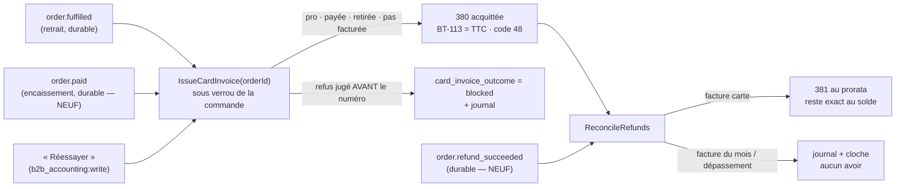

# Plan — la facture d'une commande payée par carte, et les remboursements

> 📐 **Plan v2, 2026-10-08** (v1 contredite par `vitruve` le même jour : quatre BLOQUANTS, neuf SÉRIEUX, repris au § 8 et dans le § 2 bis qui prime sur les §§ 2 à 4), écrit en l'absence d'Hugo (« fais tout, tiens
> une liste des questions arbitrées »). Lot **E5** de
> [`facture-emise.md`](facture-emise.md), qui
> l'attendait derrière « le suivi des remboursements ». Touche **l'argent** :
> contredit par `vitruve` avant d'être bâti (§ 8). Arbitrages reportés dans
> [`../arbitrages-en-absence.md`](../arbitrages-en-absence.md).

## 1. Ce qui existe (vérifié le 2026-10-08)

- **Aucun remboursement n'est suivi.** `PaymentStatus` a une valeur
  `refunded` que **rien n'écrit** (grep des écritures : aucune). Le webhook
  (`stripe-payment-gateway.ts`) ne réduit que `payment_intent.succeeded`,
  `…payment_failed` et `checkout.session.*` ; tout le reste est `ignored`.
  Un remboursement fait dans le tableau de bord Stripe est invisible ici.
- Une commande payée après son annulation sonne la cloche
  (`RingRefundDue`) : un humain rembourse **dans Stripe**.
- **Le retrait est un fait durable** : `OrderHandedOverEvent`
  (`b2b/orders/domain/events/order-handed-over.event.ts`), écouté par
  `on-order-handed-over.handler.ts`. Même bloc que la comptabilité (`b2b`).
- **La facture et l'avoir existent** : `Invoice.issue`, `Invoice.creditNote`
  (avoir sur une facture, plafonné par les avoirs antérieurs :
  `assertWithinCorrected`), numérotation sans trou, PDF (E3b), e-mail (E6).
- **Le régime** d'une commande est figé à la passation
  (`settlement-regime.ts` : `paid | due | account | free`).

## 2. La règle

| Régime            | Facture                                     | Remboursement                     |
| ----------------- | ------------------------------------------- | --------------------------------- |
| Pro **au compte** | facture du mois (E4)                        | hors champ : pas de carte         |
| Pro **par carte** | **une facture par commande, à son retrait** | **un avoir** du montant remboursé |
| Public            | jamais (ticket)                             | suivi, sans avoir                 |

- **La facture suit la livraison, pas le paiement** (plan § 4) : un paiement
  avant retrait est un acompte. Émise par un abonné durable de
  `OrderHandedOverEvent`, pour une commande `clientele = pro` dont le régime
  est `paid` (carte encaissée). Date = jour local du retrait, jamais antidatée
  (règle d'E4).
- **Tout remboursement après la facture produit un avoir** de son montant,
  ventilé par taux de TVA au prorata de la facture (reste le plus fort,
  `invoiceVatBreakdown`), une ligne par taux, libellé « Remboursement ». Un
  avoir reste plafonné à ce que la facture n'a pas déjà corrigé.
- **Un remboursement avant le retrait** est noté et ne produit rien tout de
  suite ; au retrait, la facture est émise sur le **total**, puis l'avoir
  suit aussitôt. Une commande remboursée **en totalité** avant son retrait
  n'est pas facturée (pas de vente).
- **Le remboursement lui-même reste un geste Stripe** (tableau de bord) :
  on le **constate**, on ne l'initie pas. Initier un remboursement depuis le
  back-office est un autre chantier.

## 2 bis. Ce que la v2 change (prime sur les §§ 2 à 4)

1. **Deux déclencheurs, un seul émetteur.** Une facture carte naît quand la
   commande est **retirée ET payée**, dans l'ordre qu'on voudra : l'abonné de
   `order.fulfilled` (l'événement `OrderHandedOverEvent` des **commandes**,
   un par commande — pas `handover.handed_over`, émis à chaque geste)
   émet si la commande est déjà payée ; l'abonné du paiement réussi émet si
   elle est déjà retirée. Les deux appellent la même commande
   `IssueCardInvoice(orderId)`, **sans effet** si une facture 380 couvre déjà
   le bon (lecture avant émission, sous verrou de la ligne de commande ;
   l'unicité `invoice_order` reste le filet, jamais le chemin normal).
2. **Date d'émission = jour de l'émission** (`Clock`), jamais le jour du
   retrait : un rejeu après minuit ne heurte plus la chronologie
   (`last_issued_on`). Le jour du retrait est la **date de livraison**
   (BT-72) imprimée sur la facture.
3. **Webhook** : `refund.created`, `refund.updated`, `refund.failed`.
   `charge.refunded` ne porte plus la liste des remboursements depuis l'API
   2022-11-15. **Seul `status = succeeded` compte** ; `currency ≠ eur` est
   refusé et signalé. Un remboursement `pending` est noté, sans avoir.
4. **Une facture carte est acquittée.** `InvoiceState` gagne le montant
   déjà payé (**BT-113**, `PrepaidAmount`) et un moyen « carte » (code UNTDID
   4461 **48**) ; le XML écrit `DuePayableAmount = 0`, le PDF « Facture
   acquittée le … par carte ». Échéance = jour du paiement. Les mentions de
   pénalités restent exigées (art. L441-9 : toute facture entre
   professionnels), donc le blocage `payment_terms_missing` reste.
5. **L'avoir d'un remboursement** est ventilé au **prorata** des bases de la
   facture par taux (Stripe ne dit pas quel produit est rendu) — **question
   au cabinet** ; et **le remboursement qui solde la commande prend le
   reste exact** par taux (base et TVA), pour que la somme des avoirs égale
   la facture au centime et que `assertWithinCorrected` ne refuse jamais le
   dernier.
6. **Rien ne boucle.** Une facture carte impossible (acheteur sans SIREN ou
   TVA, pas d'émetteur : `invoiceIssuanceBlockers`) est **signalée** dans
   une table d'issues (`card_invoice_outcome`, comme
   `invoice_monthly_outcome`), visible à l'écran, et rejouable par un bouton ;
   l'abonné termine sans lever.
7. **Le rapprochement est un balayage**, pas un effet de bord : après chaque
   facture carte et chaque remboursement `succeeded`, `ReconcileRefunds(orderId)`
   émet un avoir pour chaque remboursement sans `credit_note_id` dont la
   commande a une facture. Sous verrou de la commande ; il rattrape donc
   aussi un remboursement noté avant le retrait.
8. **L'acheteur est le payeur légal** (`billedPayerOf`, comme la facture du
   mois), pas la société du site.
9. **`clientele` nul** (commandes anciennes) : une commande **avec société**
   est pro, sans société est publique.
10. **Remboursement d'un lien libre** : pas d'avoir automatique, il est
    noté et la cloche sonne (un lien peut solder un impayé facturé au mois :
    l'avoir est alors un geste humain).

## 3. Le modèle

Table `order_refund` (schéma `public`, contexte `b2b/orders`), une ligne par
remboursement Stripe :

| Colonne            | Règle                                             |
| ------------------ | ------------------------------------------------- |
| `id`               | ULID                                              |
| `order_id`         | la commande                                       |
| `stripe_refund_id` | `re_…`, **unique** : clé d'idempotence du webhook |
| `amount_cents`     | entier > 0                                        |
| `refunded_at`      | instant Stripe (`created`)                        |
| `recorded_at`      | `Clock`                                           |
| `credit_note_id`   | nullable : l'avoir qui l'a constaté               |

- `Σ amount_cents ≤ total encaissé` : refusé par l'agrégat (un excès est une
  panne qui se voit, pas un avoir faux).
- `paymentStatus` passe à **`refunded`** quand la somme atteint le total ;
  un remboursement partiel ne change pas le statut (la commande reste
  `paid`), et l'écran affiche « remboursée en partie (x €) ».
- Rien ne se supprime : un remboursement annulé ou en échec chez Stripe est
  noté par son statut (voir § 2 bis, Q3).

## 4. Le webhook

- Événements : **`charge.refunded`** (porte la liste des `refunds`) et
  **`refund.updated`** (échec ou annulation d'un remboursement). Le port
  réduit chaque remboursement à `{ kind: "refunded", paymentIntentId,
refundId, amountCents, at, status }`.
- Idempotence par `stripe_refund_id` ; un remboursement inconnu de nos
  commandes (paiement d'un lien libre) est ignoré et journalisé.
- **Runbook** : abonner le webhook de production à ces deux événements.

## 5. Les faits et le journal

- `order.refund_recorded` (montant, cumul) et `order.fully_refunded` au
  journal de la commande.
- `invoice.issued` pour la facture carte (E6 prévient le payeur, E3b rend le
  PDF) ; `invoice.credit_note_issued` pour l'avoir.

## 6. Les écrans

- Fiche commande (back-office) : les remboursements et l'avoir de chacun.
- Espace client : les factures **et avoirs** dans « Mes factures » (E6).

## 7. Questions — arbitrées en l'absence d'Hugo

- **Q1** — Facturer à la livraison, même payé avant ? **Oui** (déjà dans le
  plan d'émission, § 4).
- **Q2** — Une commande pro par carte remboursée en totalité avant retrait :
  facture + avoir, ou rien ? **Rien** : pas de livraison, pas de vente.
- **Q3** — Un remboursement qui **échoue** après son avoir ? Impossible en v2 :
  l'avoir n'est émis que sur `succeeded`. Un remboursement réussi puis
  contesté reste hors champ (litige bancaire, PA5).
- **Q4** — Le public : suivre ses remboursements sans facture ? **Oui** (statut
  et journal), pas d'avoir.

## 8. Contradiction (`vitruve`)

v1 contredite le 2026-10-08. **BLOQUANTS, corrigés** : retrait avant
paiement jamais facturé (§ 2 bis-1) ; date d'émission confondue avec la
livraison (2) ; `charge.refunded` sans la liste des remboursements (3) ;
facture carte rendue comme due (4). **SÉRIEUX, corrigés** : dernier avoir
refusé par l'arrondi (5) ; abonné qui boucle sur une facture impossible
(6) ; course retrait/remboursement (7) ; acheteur non nommé (8) ; événement
ambigu (1) ; `clientele` nul (9) ; Q3 (§ 7). **Assumé, au cabinet** : le
prorata de l'avoir (5). **MINEUR** : un remboursement total laisse le régime
`paid`, l'écran lit `paymentStatus` ; lien libre (10).

## 9. Lots

| Lot     | Contenu                                                                                             |
| ------- | --------------------------------------------------------------------------------------------------- |
| **R1**  | ✅ bâti le 2026-10-08, non commité (§ 10) — `order_refund`, webhook `refund.*`, `refunded`, journal |
| **E5a** | ✅ bâti le 2026-10-08, non commité (§ 11) — facture carte acquittée, issues signalées, rejouables   |
| **E5b** | ✅ bâti le 2026-10-08, non commité (§ 11) — avoir de remboursement au prorata, reste exact au solde |
| **E5c** | ✅ bâti le 2026-10-08, non commité (§ 11) — fiche commande, factures carte signalées, « acquittée » |

## 10. R1 bâti (2026-10-08, non commité)

Ce qui existe, et ce qui a été tranché en le bâtissant — en l'absence d'Hugo,
à relire avec la liste d'arbitrages.

- **Table** `public.order_refund` (migration
  `20261008220000_les_remboursements_constates`, additive) et énumération
  `OrderRefundStatus` (`pending`, `requires_action`, `succeeded`, `failed`,
  `canceled`). `credit_note_id` est un texte nullable **sans clé étrangère** :
  E5b choisira sa forme. Modèle dans `prisma/schema/public/order-refund.prisma`.
- **Webhook** : `refund.created`, `refund.updated`, `refund.failed` → `{ kind:
"refund", … }` (`stripe-payment-gateway.ts`). `charge.refunded` reste
  `ignored`. Un remboursement **sans intention** (`payment_intent: null`) ou
  sous un statut inconnu est `ignored` lui aussi.
- **Commande retrouvée par son intention** : une commande n'a qu'une intention
  (`orders.stripe_payment_intent_id`, `@unique`), écrite à la passation ; un
  second essai de carte passe sur **la même** intention (`markPaid`, vérifié le
  2026-10-08). Il n'y a donc pas de « tentatives » à départager : l'intention
  du remboursement est celle de la commande, ou d'aucune.
- **L'agrégat** `OrderRefundLedger` (`b2b/orders/domain/entities/`) tient les
  règles ; `RecordOrderRefundHandler` charge **sous verrou de la ligne de
  commande** (`SELECT … FOR UPDATE`), applique, sauve et journalise dans une
  seule unité de travail.
- **Statuts** : depuis une attente, tout s'applique ; depuis `succeeded`, seul
  `failed` s'applique (Stripe le permet : `refund.failed` sur un remboursement
  réussi) et rend la commande `paid` si elle était `refunded` ; `succeeded` →
  `canceled` est **refusé** (Stripe n'annule qu'en attente) ; un statut plus
  ancien arrivé en retard est **ignoré**, pas refusé (les webhooks n'arrivent
  pas dans l'ordre). `failed` et `canceled` sont terminaux.
- **Plafond** : Σ `succeeded` ≤ `orders.total_cents` (l'intention est
  dimensionnée sur lui). Le règlement ne bascule qu'entre `paid` et
  `refunded` : une commande annulée encaissée après coup reste `failed`
  (`markPaid` ne la rouvre jamais) et son remboursement est noté sans la
  toucher.
- **Refus** (devise, plafond, montant changé, réussi puis annulé) : rien n'est
  écrit sur la commande, `order.refund_rejected` va au journal, la cloche
  sonne (`order.refund_rejected`, une clé par remboursement et motif). Le
  webhook répond **200** : un 4xx ferait réessayer Stripe trois jours pour la
  même réponse.
- **Hors commande** (A11) : `RefundWithoutOrderEvent` → `OnRefundWithoutOrder`
  (`b2b/payments`) : `payment_refund.unmatched` au journal, cloche vers
  « Liens libres ». Le lien n'est pas retrouvé : la table des liens ne garde
  que la session `cs_…`, et le remboursement ne porte que l'intention.
- **Journal** : `order.refund_recorded`, `order.fully_refunded`,
  `order.refund_rejected` (sujet `order`, libellé = numéro, **aucun**
  identifiant Stripe — le journal n'en portait aucun, pas même le `pi_…`) ;
  `payment_refund.unmatched` (sujet `payment_refund`, id = `re_…`, seul nom de
  ce paiement chez nous — exemption écrite au test de clôture).
- **Lecture** : `OrderView.refunds` (montant, statut, instant Stripe) et
  `refundedCents` (cumul réussi) ; `CustomerOrderView.refundedCents` seulement.
  `refundedCents` est aussi dans la vue staff parce que les composants
  partagés reçoivent l'une ou l'autre (sous-ensemble structurel). Back-office :
  carte « Remboursements » sur la fiche commande. Client : ligne
  « Remboursée » / « Remboursée en partie (x €) » (fr/en/it), lue sur
  `paymentStatus` et le cumul, jamais sur le régime.
- **Runbook** : section « Abonner le webhook Stripe aux remboursements ».

Reste hors de R1 : la facture carte (E5a), l'avoir (E5b), l'avoir à l'écran
(E5c).

## 11. E5 bâti (2026-10-08, non commité)

Migration `20261009000000_la_facture_carte` (additive) ; ce qui a été tranché
en bâtissant, en l'absence d'Hugo — à relire avec la liste d'arbitrages
(A20 à A26).

- **Deux faits durables neufs côté commandes**, tous deux dans la transaction
  de leur écriture : `order.paid` (clé `order.paid:<orderId>`, écrit par
  `ConfirmOrderPaymentHandler` au seul franchissement de `markPaid`, qui passe
  pour cela sous `UnitOfWork`) et `order.refund_succeeded` (clé par ligne
  `order_refund`, écrit par `RecordOrderRefundHandler` quand un remboursement
  PASSE à `succeeded`). Le paiement réussi n'avait jusque-là qu'un fait en
  mémoire (`OrderPaymentSettledEvent`, gardé pour l'accusé de réception) :
  le perdre aurait laissé une vente sans facture. Abonnés dans `b2b/accounting`,
  même bloc : `lint:durable-cross-block` vert sans dette.
- **Le retrait écouté est `order.fulfilled`** (un par commande), jamais
  `handover.handed_over`.
- **Tout refus se juge AVANT le numéro** (`prepareCardInvoice`) : l'abonné
  tourne dans la transaction de son reçu, et un refus levé après
  `InvoiceNumbering.next` laisserait un rang consommé dans une transaction
  validée. D'où un brouillon construit **à blanc** sous un numéro factice ; ce
  qui lève encore ensuite est une panne (base, assemblage), réessayée et
  montrée par la boîte d'envoi.
- **Refus signalés** : manques d'E0 (`invoiceIssuanceBlockers`, aucun ou
  plusieurs émetteurs), bon non facturable, entité qui ne peut pas encaisser
  (le vendeur figé est celui de l'arrêté : il exige ICS et IBAN), et **TTC
  recalculé ≠ encaissé** — une facture acquittée qui ne tomberait pas juste.
- **Échéance** : le jour du paiement demandé (§ 2 bis-4) contredit
  « échéance ≥ émission » (agrégat ET contrainte en base) dès que la commande
  est payée avant d'être retirée. Tranché : **le plus tard** du jour du
  paiement et du jour d'émission (`cardInvoiceDueOn`), comme la facture du
  mois (`later`). Le jour du paiement est porté par `paid_on` (« acquittée
  le … »).
- **Moyen de paiement** : `InvoicePaymentMeans` devient une union (59 + RUM,
  ou 48 seul) ; `mandateReferenceOf` lit la RUM. La carte et le déjà payé
  vont ensemble (agrégat) ; le déjà payé ne dépasse pas le TTC, n'est jamais
  sur un avoir, est payé au plus tard le jour d'émission (agrégat ET base).
  Aucune donnée de carte (BG-18) : Stripe les garde.
- **XML** : `TotalPrepaidAmount` (BT-113) quand la pièce est acquittée,
  `DuePayableAmount` = TTC − déjà payé ; `facturXArithmeticViolations` lit
  BR-CO-16 avec BT-113. **BT-72** (`ActualDeliverySupplyChainEvent`) quand la
  pièce ne couvre qu'UN bon livré — la facture du mois d'un seul bon livré le
  porte donc aussi. Ni ICS ni RUM sans prélèvement. Ordre des éléments écrit
  de mémoire du XSD, non vérifié (comme E3a).
- **PDF et e-mail** : « Facture acquittée le … par carte. Reste à payer :
  0,00 €. » ; l'e-mail « Votre facture » dit « Payée par carte le … — rien à
  régler ». Les mentions de pénalités restent.
- **Avoir** : prorata du TTC **restant** par taux (plus forts restes), coupé
  en base et TVA au taux (BR-S-09 tenu), ramené dans ce que le taux porte
  encore ; le remboursement égal au reste prend le reste exact. Une ligne
  « Remboursement » (référence `REMBOURSEMENT`, une pièce) par taux. Daté du
  jour (`Clock`). Le lien `order_refund.credit_note_id` est posé une fois
  (clé étrangère, unique, déclencheur `order_refund_credit_note_once`) — la
  seule écriture de la comptabilité dans cette table.
- **Pas d'avoir automatique, signalé** (`order.refund_not_credited`, cloche
  « Remboursement sans avoir ») : commande sur une facture du mois
  (`account_invoice`), ou montant au-delà de ce que la facture porte encore
  — un avoir manuel passé avant (`exceeds_invoice`). Le cas « au compte » est
  **inatteignable aujourd'hui** : une commande au compte n'a pas d'intention
  Stripe, un remboursement ne la trouve pas (il va à « Liens libres », A11).
- **Avoir et e-mail** : aucun, comme tout avoir (E3b : le seul abonné de
  `invoice.credit_note_issued` rend le PDF). Le client le voit dans « Mes
  factures » (il est adressé au payeur de la facture).
- **Facture du mois** : son critère (`payment_status = not_required`) n'attrape
  jamais une commande carte — éprouvé en e2e contre le vrai SQL.
- **Écrans** : carte « Facture et avoirs » sur la fiche commande
  (`GET admin/accounting/orders/:id/invoices`, sous `b2b_accounting:read`,
  rien sans pièce ni sans droit) ; carte « Factures carte signalées » sur
  « Prélèvement du mois », sous les factures du mois, avec « Réessayer »
  (`POST admin/accounting/card-invoices/:orderId/retry`) ; la pièce et « Mes
  factures » disent « Acquittée par carte le … » (`IssuedInvoiceView.paidOn`,
  ajout au contrat). Phrases du journal pour les deux faits neufs.

**Pas fait, ou ouvert** : (a) un remboursement réussi qui ÉCHOUE ensuite chez
Stripe (`refund.failed` après `succeeded`, R1 le note) garde son avoir — aucun
avoir inverse (une facture rectificative) n'est émis ; (b) une commande
remboursée en totalité avant retrait puis dont un remboursement échoue
redevient facturable, mais aucun déclencheur ne la rejoue (le retrait est
passé) : « Réessayer » le peut seulement si elle a été signalée ; (c) la
question au cabinet sur le prorata (A9) reste ouverte ; (d) le moyen de
paiement du lien libre qui solde une facture du mois (A11) reste un geste
humain.
