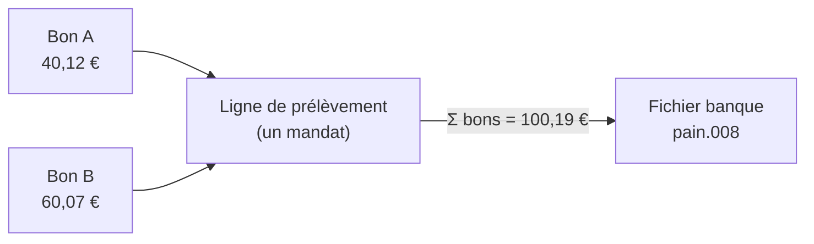
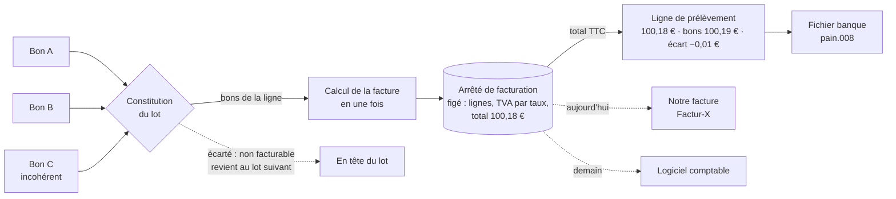

# Le prélèvement suit la facture

> 📐 **Plan v2 — F1 à F4 bâtis** (2026-10-08). Touche **l'argent** : la v1 a
> été contredite par `vitruve` le même jour (trois BLOQUANTS, six SÉRIEUX),
> repris au § 7. Affirmations sur l'existant vérifiées dans le dépôt le
> 2026-10-08.
>
> ⚠️ **2026-10-08, lot E4** ([`plan-emission-de-la-facture.md`](plan-emission-de-la-facture.md), § 8.5) :
> **l'arrêté est remplacé par la facture émise.** Un lot ne fige plus
> d'arrêté pour les bons passés depuis la mise en service de la facture du
> mois (`invoicing_floor`, le 1er du mois qui suit le déploiement) : sa ligne
> encaisse les factures émises du payeur. L'arrêté ne vit plus que pour les
> bons d'avant ce plancher ; les arrêtés existants restent lisibles. Ce qui
> suit décrit F1 à F4 tels qu'ils ont été bâtis.

## 1. Le besoin et la décision d'Hugo (2026-10-08)

> « Même plus tard, un logiciel comptable fera les factures ; pour l'instant
> c'est nous, et surtout c'est nous qui ferons toujours le fichier de
> prélèvement pour la banque. »

Le simulateur ([`plan-simulateur-dossier-de-facturation.md`](plan-simulateur-dossier-de-facturation.md))
montre que la facture calculée en une fois (D4) diffère de quelques
centimes de la somme des bons. Le prélèvement doit encaisser **le total
facturé**.

La phrase d'Hugo fixe la forme : **l'émetteur de la facture peut changer,
le fichier bancaire reste à nous.** Le montant prélevé dépend donc d'un
objet que **nous** figeons : **l'arrêté de facturation** — les bons qu'un
débit couvre, les lignes calculées en une fois, la ventilation par taux.
Une facture, la nôtre ou celle d'un logiciel, le reprend sans recalcul.

## 1 bis. En un schéma

**Aujourd'hui** — on prélève la somme des bons :



**Après ce plan** — on prélève le total de la facture, calculée une fois sur
ces mêmes bons, et figée dans un arrêté :



Ce que le schéma dit :

- **L'arrêté est la seule source du montant.** La banque, notre facture et,
  demain, le logiciel comptable lisent le même chiffre ; personne ne le
  recalcule.
- **Les bons ne bougent pas** : ils gardent leur total. L'écart de quelques
  centimes est écrit sur la ligne, à côté de la somme des bons.
- **Un bon qu'on ne sait pas facturer** sort du lot, nommé, et les autres
  partent quand même.
- **Annuler le lot** annule ses arrêtés ; une fois le lot déposé à la
  banque, l'arrêté ne change plus.

## 2. Ce qui existe (vérifié le 2026-10-08)

- **Le lot figé est bâti** (`../prelevement/plan-lot-de-prelevement-fige.md`) :
  tables de `prisma/schema/public/collection.prisma`, commandes
  `constitute-` / `cancel-` / `deposit-collection-batch`. Le bandeau de ce
  plan dit encore « rien n'est bâti » : il est périmé.
- **Une ligne de débit = un mandat.** `assembleCollection`
  (`domain/services/collection-assembly.ts`) groupe les commandes par mandat
  effectif, une ligne par site dans les formes « mandat du site », et pose
  `amountCents = Σ order.totalCents` (l. 200).
- **Le lot se constitue par entité, toutes lignes ensemble**
  (`constitute-collection-batches.handler.ts`).
- **L'assiette n'est pas un mois** : commandes créées du plancher à la
  clôture, sans borne basse. Un bon `due` ou `excluded` d'un cycle passé
  revient. `CollectableOrder` ne porte que `totalCents`, pas les lignes.
- **Les exclusions** sont un enum Postgres : `no_mandate`, `payer_detached`,
  `one_off_consumed`, `ambiguous_creditor`.
- **« Réglée autrement »** n'accepte que `due` ou `excluded`
  (`order-collection.ts:89`) : un bon d'un lot n'y entre jamais.
- **Aucun rejet bancaire** n'est traité : `batched → collected` seulement.
- **Le CSV de contrôle** (`collection-batch-csv.ts`) somme `line.amountCents`
  et liste les bons ; `CtrlSum` somme les lignes (`pain008-document.ts`).
- **Le dossier simulé** (`simulateInvoiceDossier`) ne refuse que la surtaxe
  sans taux. Un bon incohérent est rangé dans `inconsistentOrders` ; un bon
  non ventilé est calculé (sa TVA est recalculée par taux sur la facture,
  il ne fait qu'un écart).
- **La pré-notification** n'est qu'un délai réglé sur l'entité : aucun avis
  n'est envoyé, ni aujourd'hui avec la somme des bons, ni demain.

## 3. Ce qu'on construit

### F1 — La constitution lit les bons figés ✅ (2026-10-08, non commité)

> Bâti : `CollectableOrder.frozen` ; sélection et conversion partagées avec
> le dossier dans `apps/lfd-api/src/b2b/accounting/infrastructure/frozen-invoice-order.mapper.ts`. Lu, pas
> encore consommé : le montant de ligne reste Σ `totalCents` jusqu'à F2.

`CollectionCandidatesReader` rend, pour chaque bon prélevable, les entrées
du simulateur (`FrozenInvoiceOrder` : lignes figées, remises, port et son
mode, surtaxe et son taux, `vatShares`, totaux), sans borne basse. Une seule
lecture par constitution.

### F2 — Une facture par ligne de débit ; un bon qu'on ne sait pas facturer est exclu ✅ (2026-10-08, non commité)

> Bâti : `assembleCollection` prélève `simulateInvoiceDossier(bons de la
ligne).invoice.totalCents` et garde `ordersTotalCents` ; migration
> `20261008130000_le_prelevement_suit_la_facture` (valeur `unbillable`,
> colonne `orders_total_cents` nullable) ; CSV « Σ bons » / « Écart » ;
> libellé « Non facturable » dans `@lfd/contracts`. Tranché en bâtissant :
>
> - **Un bon est jugé SEUL** (`apps/lfd-api/src/b2b/accounting/domain/services/invoice-billability.ts`) :
>   le simulateur calcule la facture de ce seul bon ; il refuse (surtaxe
>   sans taux, taux illisible) ou le range incohérent → non facturable. Le
>   critère reste celui du simulateur, sans recopie ; les trois refus portent
>   chacun sur un bon, donc des bons facturables un à un le sont ensemble.
> - **Jugé en dernier**, après le mandat et l'entité : un bon qui appartient
>   au lot d'une autre entité n'est pas écarté par celle-ci.
> - Une ligne d'avant F2 a `orders_total_cents` nul : le CSV laisse ses deux
>   cellules vides, et leur total aussi (un total partiel se lirait exact).

À la constitution, `simulateInvoiceDossier` calcule, pour chaque ligne, la
facture de **exactement ses bons**. Le montant de la ligne devient le
**total TTC** de cette facture.

- **Un bon incohérent ou sans taux de surtaxe est exclu**, pas bloquant :
  nouvelle raison `unbillable` (valeur ajoutée à l'enum, migration
  additive), nommée en tête du lot. Il revient au lot suivant quand il est
  corrigé, ou se règle autrement. Bloquer la constitution bloquerait **tous**
  les payeurs de l'entité pour un seul bon.
- **Un bon non ventilé est facturé** : la facture recalcule sa TVA par taux,
  comme pour tout bon.
- `collection_batch_line` gagne **`orders_total_cents`** (Σ des bons) : la
  ligne porte les deux montants, l'écart se lit sans jointure.
- **L'écart appartient à la ligne, jamais à un bon.** Un rejet bancaire
  porte sur une ligne (`EndToEndId`) : le jour où on les traitera, c'est la
  ligne entière, donc son arrêté, qui sera reperçue. Un bon d'un lot ne peut
  pas être « réglé autrement » (vérifié ci-dessus), donc aucune part de bon
  n'est à calculer.
- Le CSV de contrôle gagne deux colonnes, **Σ bons** et **écart**, et son
  total reste Σ lignes = `CtrlSum`.

### F3 — L'arrêté figé ✅ (2026-10-08, non commité)

> Bâti : tables `billing_statement` / `billing_statement_order`
> (`apps/lfd-api/prisma/schema/public/billing-statement.prisma`, migration
> `20261008140000_l_arrete_de_facturation`) ; agrégat
> `apps/lfd-api/src/b2b/accounting/domain/entities/billing-statement.ts` ;
> écrit par la constitution, annulé par l'annulation du lot ; faits
> `billing_statement.issued` / `.cancelled` ; la vue du lot rend ses lignes,
> chacune avec `billingStatementId` (`null` avant F3). Tranché en bâtissant :
>
> - **Une seule source de calcul** : `DebitDraft` garde la facture que
>   `assembleCollection` calcule pour le montant ; l'arrêté la fige telle
>   quelle (`body` = cette facture, `body_version` 1, `computed_with`
>   `invoice-dossier/2026-10-08`). L'agrégat refuse un arrêté dont le total
>   n'est pas le montant de la ligne.
> - **L'acheteur n'est pas le `DebtorSnapshot`** : celui-ci porte l'IBAN en
>   clair et « ne se range nulle part ». L'acheteur figé est la fiche de la
>   société payeuse (raison sociale, forme, SIRET, SIREN, TVA) et son adresse
>   de facturation par défaut non archivée — vide s'il n'y en a pas. Le
>   vendeur est le `CreditorSnapshot` sans les réglages du mandat.
> - **La période** est celle des dates de livraison demandées des bons ;
>   colonnes NULL quand aucun bon n'en porte, jamais inventées.
> - **Pas d'unité ni de code de catégorie TVA** dans `body` : aucun bon ne
>   les fige aujourd'hui (le taux, lui, y est). À décider avant Factur-X.
> - **Immuable en base** : déclencheur `billing_statement_immutable` (ni
>   `DELETE`, ni modification hors `active → cancelled`, ni annulation d'un
>   arrêté dont le lot n'est plus `constituted`) ; les bons d'un arrêté ne se
>   retouchent pas. L'annulation passe avant l'écriture du lot annulé.

Table `billing_statement`, une ligne par ligne de débit, écrite dans la
transaction de la constitution :

```
billing_statement (
  id, batch_id, line_rank,
  status ('active'|'cancelled'),       -- jamais de DELETE
  payer_company_id, legal_entity_id,
  seller jsonb, buyer jsonb,           -- identités figées (SIREN, TVA, adresse)
  issued_on date,                      -- la date de constitution
  period_starts_on, period_ends_on,    -- première → dernière date des bons
  total_ht_cents, total_vat_cents, total_ttc_cents, orders_total_cents,
  body jsonb, body_version int,        -- lignes, remises, frais, ventilation
  computed_with text                   -- version du calcul
)
billing_statement_order ( statement_id, order_id )
```

- **Immuable par construction** : le dépôt n'a qu'`insert` et `cancel` ;
  `cancel` n'est accepté que si le lot est `constituted`. Annuler le lot
  annule ses arrêtés (statut), dans la même transaction
  (`cancel-collection-batch.handler.ts` reçoit le port).
- `body_version` versionne la forme du JSON, `computed_with` le calcul.
- **Une ligne de `body`** porte ce qu'EN 16931 demande : quantité, unité,
  prix net unitaire, montant, catégorie et taux de TVA, période.
- Faits journalisés : `billing_statement.issued`,
  `billing_statement.cancelled`.
- Pas de numéro de facture : la numérotation sans trou appartient à la
  facture, qui viendra ensuite.

### F4 — L'écran ✅ (2026-10-08, non commité)

> Bâti : `GET admin/accounting/billing-statements/:id` (`b2b_accounting:read`,
> `GetBillingStatementHandler`, port `BillingStatementReader`) relit l'arrêté
> sans recalcul — le `body` est revalidé par zod, une forme inconnue est un
> refus technique plutôt qu'un montant deviné ; contrat
> `packages/contracts/src/billing-statement.ts` (interfaces seules). Écran du
> lot : `prelevement-du-mois/batch-lines/` (Σ bons, total facturé, écart
> signé, lien « Dossier de la ligne ») et les bons non facturables en tête ;
> page `comptabilite/arretes-de-facturation/:id`, qui réutilise
> `dossier-invoice` (son entrée est devenue la seule facture). Tranché en
> bâtissant : une ligne sans `orders_total_cents` OU sans arrêté se lit « lot
> d'avant l'arrêté de facturation », sans écart ni dossier.

- Le lot affiche, par ligne : Σ bons, total facturé, écart ; et les bons
  `unbillable` en tête.
- Le dossier de facturation s'ouvre **par ligne de lot**, depuis son
  arrêté ; la vue par mois reste pour ce qui n'est pas encore constitué.
- Un lot déposé avant F2 n'a pas d'arrêté : l'écran dit « lot d'avant
  l'arrêté de facturation », pas zéro.

## 4. Ce que la facture fera de l'arrêté (hors de ce plan)

- **Notre Factur-X** se rendra depuis l'arrêté, sans recalcul.
- **Un logiciel comptable** recevra l'arrêté en export. Ce plan ne peut
  rien exiger d'un tiers : choisir ce logiciel comprendra la question
  « reprend-il un total figé, ou recalcule-t-il ? ». S'il recalcule, il
  faudra lui envoyer des lignes qui donnent le même total, et le vérifier à
  l'import.
- **La pré-notification** au client (montant et date avant le débit, règle
  SEPA) n'existe pas aujourd'hui. L'arrêté en sera la source : un chantier à
  part, nécessaire avant le premier dépôt réel.

## 5. Ce qui ne change pas

Le calcul des bons, l'assiette et les autres exclusions du lot, les
identifiants SEPA, le relevé de cycle. Facturer au **mois de livraison**
reste un chantier à part.

## 6. Questions à Hugo

> Hugo a validé les trois propositions le 2026-10-08 (« ok ») ; Q1 reste
> à confirmer avec le cabinet.

- **Q1 — Une facture par ligne de débit, ou par payeur ?** Pour un payeur
  dont les sites ont chacun leur mandat, « par ligne » fait plusieurs
  factures, une par site, chacune prélevée sur son mandat. « Par payeur »
  fait une facture pour plusieurs prélèvements, et il faudrait répartir le
  total entre les lignes. _Proposé : par ligne_ ; à confirmer avec le
  cabinet, qui factureront-ils par client et par mois ?
- **Q2 — Le relevé** somme les bons : affiche-t-il aussi le total facturé
  une fois le lot constitué ? _Proposé : oui._
- **Q3 — Un lot constitué au déploiement** : on l'annule et on le
  reconstitue. Un lot déjà déposé garde son montant et n'a pas d'arrêté.

## 7. Les lots

| Lot    | Contenu                                                                                                                                                                                              |
| ------ | ---------------------------------------------------------------------------------------------------------------------------------------------------------------------------------------------------- |
| **F1** | ✅ 2026-10-08 — le lecteur de constitution rend les bons figés                                                                                                                                       |
| **F2** | ✅ 2026-10-08 — la facture par ligne ; montant = total facturé ; `unbillable` ; `orders_total_cents` ; CSV ; e2e : Σ lignes = Σ arrêtés = `CtrlSum`, un bon incohérent exclu sans bloquer les autres |
| **F3** | ✅ 2026-10-08 — la table des arrêtés, écrite et annulée avec le lot ; journal                                                                                                                        |
| **F4** | ✅ 2026-10-08 — l'écran du lot et le dossier par ligne de lot                                                                                                                                        |

## 8. Ce que `vitruve` a relevé (v1, 2026-10-08)

- **BLOQUANTS, corrigés** : le refus sur bon incohérent n'avait pas de
  mécanisme et bloquait toute l'entité → exclusion `unbillable` (F2) ; les
  entrées du simulateur ne se chargeaient pas à la constitution → F1 ;
  l'écart d'un bon réglé autrement ou rejeté → l'écart appartient à la
  ligne, et un bon d'un lot ne peut pas être réglé autrement (F2).
- **SÉRIEUX, corrigés** : le CSV de contrôle (F2) ; ce que l'arrêté fige —
  identités, dates, forme versionnée (F3) ; l'immuabilité et l'annulation
  sans DELETE (F3) ; un lot déposé sans arrêté (F4) ; « la ligne porte
  l'écart » sans colonne → `orders_total_cents` (F2).
- **SÉRIEUX, assumés et écrits** : la facture par ligne engage la
  conformité (Q1, au cabinet) ; un logiciel tiers ne se contraint pas par ce
  plan (§ 4) ; la pré-notification n'existe pas, avant comme après (§ 4).
- **Non traité ici** : une commande annulée après `batched` (le lot figé
  prévoit un refus au dépôt) ; F2 la fige aussi dans l'arrêté, et
  reconstituer refait les deux.
