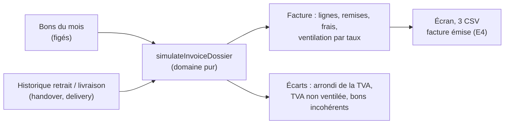

# Le dossier de facturation (simulateur)

> **Doc d'état**, écrite le 2026-10-08 à partir du code et du plan bâti le même
> jour (DF1 à DF4, puis F6). Elle remplace le plan « simulateur de dossier de
> facturation » (supprimé ; il reste dans l'historique git, avec ses trois
> versions et les objections de `vitruve`).

**Pour un payeur et un mois, le dossier montre la facture qu'on émet, les
bons qu'elle couvre, l'historique de retrait et de livraison de chacun, et
les écarts au centime entre la facture et la somme des bons** — pour que le
comptable vérifie nos calculs dans son espace Comptabilité.

Depuis E4, la facture **réellement émise** est construite par le même calcul
(`invoice-from-dossier.ts`) : le dossier n'est plus seulement une
simulation, c'est l'explication de la facture.

## 1. La facture

- **Une ligne par produit, par prix et par taux** (D2) : clé `(sku,
unitPriceMillicents, taux normalisé)` ; quantité = Σ, prix unitaire à cinq
  décimales, **montant HT = Σ `lineTotalCents` des bons** (F6 : le client
  retrouve le HT de ses bons au centime ; la norme l'admet), période =
  première → dernière date demandée, libellé le plus récent (« vendu aussi
  sous… » si un autre).
- **Remises** par nature (remise société, bon de fidélité) et **frais**
  (surtaxe, livraison) : sommes exactes des montants figés. La livraison suit
  le mode figé sur chaque bon : taux normal, ou prorata des bases de ses bons.
- **La TVA se calcule une fois, sur la facture** (EN 16931, BR-S-09) :
  `invoiceVatBreakdown` (`packages/money/src/invoice-vat.ts`) répartit chaque
  remise au prorata des bases aux **plus forts restes**, puis TVA d'un taux =
  `arrondi(base imposable arrondie × taux)`. `ventilateVat`, celle des bons,
  n'a pas changé.

## 2. Les écarts

Total facture − Σ `totalCents` des bons = la somme, exacte, de :

| Écart                 | Ce que c'est                                                         |
| --------------------- | -------------------------------------------------------------------- |
| **Arrondi de la TVA** | TVA de la facture par taux − Σ des parts figées des bons ventilés    |
| **TVA non ventilée**  | TVA des bons d'avant le 2026-09-07, sans répartition par taux        |
| **Bons incohérents**  | `totalCents ≠ lignes − remises + port + surtaxe + TVA` : écart nommé |

L'« arrondi des lignes » n'existe plus depuis F6 (nul par construction).

## 3. Les bons et leur historique

- Chaque bon tel que figé : référence, dates, lieu (retrait ou adresse),
  lignes, totaux, TVA ; « TVA non ventilée » s'il date d'avant le 2026-09-07.
- **La frise** : retiré au comptoir (scan / saisie), remis à la porte,
  déposé, parti en tournée, rapporté, replacé. Lue par deux ports que
  `handover` et `delivery` déclarent **et** implémentent dans leur canal vers
  le commerce (`OrderHandoverHistoryReader`, `OrderDeliveryHistoryReader`).
- **Signalés en tête** : les bons jamais retirés, ceux livrés un autre mois,
  ceux sans date demandée.

## 4. Où c'est

| Quoi    | Où                                                                                                                                        |
| ------- | ----------------------------------------------------------------------------------------------------------------------------------------- |
| Calcul  | `b2b/accounting/domain/services/invoice-dossier.ts`, `invoice-order-consistency.ts`                                                       |
| Lecture | port `InvoiceDossierReader` (même critère de facturation que le lot)                                                                      |
| Route   | `GET admin/accounting/invoice-dossiers/companies/:companyId?month=` + `invoice.csv`, `orders.csv`, `gaps.csv`, sous `b2b_accounting:read` |
| Écran   | Comptabilité › Dossier de facturation (`comptabilite/invoice-dossier/`)                                                                   |
| Contrat | `packages/contracts/src/invoice-dossier.ts` (interfaces seulement)                                                                        |

Le périmètre est celui du relevé et du prélèvement : la société et les sites
qu'elle réglait à la date du bon (`billedPayerOf`), bons **passés** dans le
mois.

## 5. Ce qui reste ouvert

- **Au cabinet** : la liste des bons jointe suffit-elle à identifier chaque
  livraison d'une facture récapitulative ?
- Une remise agrégée supérieure aux bases n'est pas bornée ; une remise sans
  marchandise est refusée.
- Les sociétés proposées à l'écran sont celles au crédit mensuel ; une
  société qui en est sortie n'y figure plus, même avec d'anciens bons.
