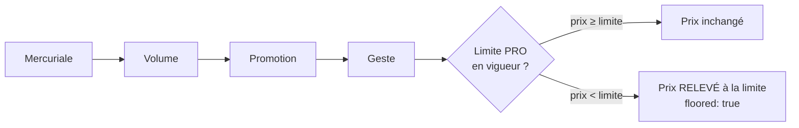

# Les limites de prix

> **Doc d'état**, écrite le 2026-10-08 à partir du code (relu ce jour-là). Elle
> remplace le plan du 2026-09-25 (« plan limites de prix », supprimé ; il
> reste dans l'historique git, et trois `migration.sql` du 2026-09-26 le citent
> encore sous son ancien nom). Le plan avait été contredit par `vitruve`.

Une **limite de prix** dit sous quel prix un article ne descend pas. Elle est
posée par la **comptabilité**, pas par le commercial, et elle vise une
**clientèle** : `pro` ou `public`.

**À quoi elle sert : protéger la marge contre les actions cumulées.**
Chaque étage du prix est raisonnable seul. Mais une mercuriale négociée, plus
une remise de volume, plus une promotion, plus un geste commercial se
cumulent, et personne ne voit le total au moment où il pose son étage. La
limite est le garde-fou de bout de chaîne : quel que soit l'empilement, le
prix ne passe pas sous le seuil que la comptabilité a fixé. C'est pour ça
qu'elle appartient à la comptabilité et non au commercial : celui qui
accorde les remises ne fixe pas le plancher qui les borne.

## 1. Ce qu'elle fait

- **Une post-condition**, après les quatre étages de la résolution
  (`resolve-floor.ts`) : le prix est **relevé**, jamais refusé.
- **Seule la limite pro borne un prix aujourd'hui.** La limite publique se
  pose, se date et se journalise, mais rien ne la lit : elle attend le moteur
  de promotions de la boutique (le particulier paie le canonique).

## 2. Le modèle

`PriceFloor`, table `price_floors` (`prisma/schema/public/pricing.prisma`,
contexte `b2b/pricing`) :

| Champ                                        | Sens                                                                                           |
| -------------------------------------------- | ---------------------------------------------------------------------------------------------- |
| `clientele` (`OrderClientele`, défaut `pro`) | à qui la limite s'applique                                                                     |
| `scope_type` / `scope_id`                    | `global`, `category`, `product`, `variant`                                                     |
| `mode` / `value`                             | % du canonique (points de base) ou montant en **millicentimes**                                |
| `dynamic_mode` / `dynamic_value`             | porte dynamique facultative, ouverte par `unlock_min_quantity` et `unlock_min_volume_ratio_bp` |
| `reference_canonical_millicents`             | dérive du canonique → « à confirmer »                                                          |
| `valid_from` / `valid_to`, `archived_at`     | fenêtre datée ; archivage, jamais de DELETE                                                    |

- **Une limite par (clientèle, portée) à tout instant** : contrainte
  `price_floors_no_overlap_by_clientele` (`EXCLUDE USING gist`, hors
  archivées ; migration `20260926130000`).
- **L'application aussi** cible portée **+ clientèle** : `pose()` clôt la
  précédente et `inForceFor()` la retrouve par les deux
  (`prisma-pricing-floor.repository.ts`). Sans ça, poser une limite publique
  fermerait la pro de la même portée.
- **L'héritage** : variante → produit → famille → catalogue
  (`limit-coverage.ts` côté écran).

## 3. Qui la lit

| Lecteur                                           | Clientèle | Pour                                                                |
| ------------------------------------------------- | --------- | ------------------------------------------------------------------- |
| `PrismaPriceFloorReader`                          | `pro`     | la résolution (commande, devis), cache + `listAll(at)` pour le daté |
| `prisma-pricing-decisions.reader.ts`              | `pro`     | Tarification B2B, tarif d'un client, prix affichés                  |
| `ListPriceLimitsQuery` (`price-limits.reader.ts`) | au choix  | l'écran Comptabilité                                                |

## 4. Le droit et les routes

- Ressource **`lfc_price_limits`** (« Limites de prix »), accordée en
  `write` à `admin` et `comptabilite` (migrations `20260926130100`,
  `20260926130200`, exception antérieure à `lint:no-role-grants-in-migrations`).
  `b2b_pricing` **ne suffit plus** pour poser : le commercial ne pose plus ses
  limites, mais il les voit dans la Tarification.
- `admin-price-floors.controller.ts`, `@AdminSurface("lfc_price_limits")`,
  sous `admin/pricing` :

| Route                                                              | Geste                  |
| ------------------------------------------------------------------ | ---------------------- |
| `GET floors?clientele=`                                            | liste en vigueur       |
| `PUT floors`                                                       | poser / modifier       |
| `POST floors/global/confirm`, `floors/:scopeType/:scopeId/confirm` | confirmer après dérive |
| `POST floors/global/archive`, `floors/:scopeType/:scopeId/archive` | retirer                |
| `DELETE floors/global`, `floors/:scopeType/:scopeId`               | retirer (ancien verbe) |

- **La clientèle vaut `pro` par défaut** (charge de `PUT`, `?clientele=`
  ailleurs) : un appel qui ne la dit pas vise la pro.
- **Le journal tarifaire** : `subjectId = floorScopeKey(scope)` pour une
  limite pro (historique continu), `public:` + la clé pour une publique
  (`pricing-floor.ts`). Irréversible dès le premier fait publié.

## 5. Les écrans (back-office)

**Comptabilité › Limites de prix** (`comptabilite/limites-de-prix/`, garde
`lfc_price_limits:read`) :

- segmenté **Pro · Public** ; sous Public, une bannière dit que la limite ne
  borne encore aucun prix ;
- une table de **tous** les articles, rangée par famille, avec deux
  pastilles de couverture : « Sans limite » et « Limite du catalogue
  seulement » (`limit-coverage.ts`) ;
- une ligne ouvre le panneau de sa portée (`floor-panel/`), en lecture sans
  `write` ; la pose groupée (`bulk-floor-panel/`, `bulk-pose.ts`) envoie un
  appel par article, quelques-uns à la fois, et rend le bilan.

**Tarification B2B** : plus aucun geste de limite. Sous chaque article, une
ligne « Limite » en lecture seule (valeur, héritée ou propre, porte
dynamique, « a relevé », « à confirmer ») ; un lien « Gérer les limites → »
avec `lfc_price_limits:read`.

## 6. Les tests qui le tiennent

- `test/price-limits.e2e-spec.ts` : une limite publique ne ferme pas la pro,
  ne relève aucun prix pro ; 403 avec le seul `b2b_pricing:write`.
- `test/price-limits-migration.e2e-spec.ts` : l'existant devenu `pro`, la
  contrainte par clientèle.
- `price-floor-clientele.handlers.spec.ts`, `price-floor-clientele.spec.ts`
  (contrat), `staff-roles.e2e-spec.ts` (parité des rôles).
- Front : `tarification-page.spec.ts`, `shelf-table.spec.ts`,
  `limites-de-prix-page.spec.ts`, `bulk-pose.spec.ts`, `limit-coverage.spec.ts`.

## 7. Ce qui reste ouvert

- **Le moteur de promotions public**, qui lira `clientele = 'public'` par la
  même post-condition.
- **Une limite qui refuse** au lieu de relever : non prévue.
