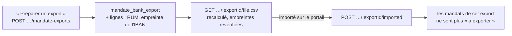

# L'export des mandats pour le portail de la banque

> Doc d'état, écrite le 2026-10-09 à partir du code. Elle remplace le plan
> « L'export des mandats pour le portail de la banque » (supprimé ; il reste dans
> l'historique git, et des migration.sql le citent encore).

La Caisse d'Épargne importe les mandats par un fichier CSV avant le premier
dépôt d'un lot (modèle `ModeleImportMandats`, reçu le 2026-10-08). Le fichier
sort des **IBAN en clair** : c'est une frontière de sécurité. Les choix faits en
l'absence d'Hugo sont dans [`../arbitrages-en-absence.md`](../arbitrages-en-absence.md).

## Le fichier

ASCII, `;` séparateur **et** terminateur de ligne, CRLF, sans en-tête, 17
colonnes (`domain/services/mandate-bank-export-csv.ts`) :

| Col | Ce qu'on écrit                                                                      |
| --- | ----------------------------------------------------------------------------------- |
| A   | RUM du mandat                                                                       |
| B   | ICS de l'entité émettrice                                                           |
| C   | nom du débiteur, celui du `pain.008` (`Dbtr/Nm`), coupé à 70                        |
| D   | IBAN en clair, descellé, sans espaces                                               |
| E   | BIC                                                                                 |
| F   | jour Europe/Paris de `accepted_at`, `JJ/MM/AAAA` (`localDay`, celle de `DtOfSgntr`) |
| G   | `RCUR` / `OOFF`                                                                     |
| H   | `CORE` / `B2B` (schéma figé du mandat)                                              |
| I–Q | vides                                                                               |

Les valeurs de F, G et H sont **supposées** (questions posées à la banque :
[`../prelevement/question-banque.md`](../prelevement/question-banque.md)) et
s'écrivent en un seul endroit, `mandate-bank-export-values.ts`. Chaque cellule
passe par `sepa()` (translittération ASCII de `pain008-document.ts`) puis perd
tout `+ - = @` de tête (injection de formule).

## Le cycle

- **Un export est une écriture.** `ExportMandatesForBank` fige un export :
  `mandate_bank_export` (entité, auteur, instant, nombre, « importé » par qui et
  quand) et `mandate_bank_export_line` (mandat, RUM, **empreinte SHA-256 de
  l'IBAN**, `account-fingerprint.ts`). Aucun IBAN ni BIC en base. Une entité
  sans ICS ne peut pas préparer d'export (409).
- **Le fichier est recalculé** depuis les mandats de l'export et refusé (409)
  si l'empreinte d'un compte ne correspond plus, ou si un mandat est devenu
  inexportable (révoqué, RIB retiré, BIC vidé). Servi en
  `text/csv; charset=us-ascii`, `Cache-Control: no-store`, `attachment`, nommé
  `mandats-banque-<SIREN>-<id>.csv`.
- **« Déjà importé » se lit par l'empreinte** : un mandat est « à exporter »
  s'il n'a aucune ligne d'un export **importé** portant l'empreinte de son
  compte actuel. Un changement de compte le fait ressortir.
- **« Marquer importé » marque un export** : `MandateBankExport.markImported`
  refuse un double marquage ; l'export appartient à l'entité de la route.
- **Écartés et nommés** en tête de la carte : mandats repris d'un autre
  créancier (`creditor_id` nul, nommés sur la carte de chaque entité), mandat
  actif sans compte recopié, BIC vide. Un mandat révoqué après import n'est pas
  signalé à la banque (il n'entre plus dans un lot) ; l'écran le dit.

## Où ça vit

- **Lecture par créancier** : port `MandatesForBankExportReader.activeOf(creditorId)`,
  déclaré par la comptabilité (`b2b/accounting/domain/ports/`), implémenté par
  `b2b/payments` (`PrismaMandatesForBankExportReader`, même `FieldCipher` et
  même `debitedAccounts` que le lot), relié dans
  `appBootstrap/debtor-mandate.module.ts`. L'ICS vient de l'entité, le nom du
  débiteur de `CollectionCandidatesReader.companyNames`.
- **Routes** (`http/admin-mandate-bank-exports.controller.ts`, sous
  `admin/accounting/legal-entities/:id/mandate-exports`) : `GET` (la carte,
  lecture), `POST` (préparer, `b2b_accounting:write`), `GET
…/:exportId/file.csv` (**`b2b_accounting:write`**), `POST …/:exportId/imported`.
- **Faits** `mandate_bank_export.created` et `mandate_bank_export.imported`
  (sujet : l'entité ; `mandateCount` ; jamais un IBAN ni l'id de l'export).
- **Écran** : carte « Mandats à la banque » sur la fiche de l'entité juridique.
- Les deux colonnes d'auteur sont au registre RGPD
  (`documentation/legal/rgpd-registre.json`).

## Ce qui reste ouvert

- **Les RIB destinataires** : la banque demande de les importer avant les
  mandats ; son modèle n'est pas reçu, rien n'est bâti.
- **Les colonnes L/M** (mandats repris d'un autre créancier) : à voir avec la
  banque (A17).
- **F, G, H** à confirmer par la banque (A15).
- **`GET …/batches/:id/file.xml`** du lot ne demande que la lecture alors qu'il
  porte des IBAN en clair (A16, à trancher par Hugo).
