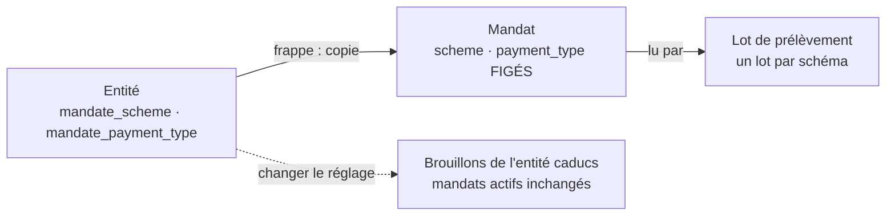

# Le mandat SEPA : CORE ou interentreprises

> **Doc d'état**, écrite le 2026-10-08 à partir du code (relu ce jour-là). Elle
> remplace le plan du 2026-09-15 (« plan mandat deux schémas », supprimé ; il
> reste dans l'historique git). Construit et en production le 2026-09-15
> (merge `174dae4c`). Le plan avait été contredit par `vitruve`.

**Le schéma est un réglage de l'entité émettrice, et chaque mandat fige le
schéma sous lequel il a été frappé.** Deux documents : le mandat **CORE**
(mise en page EPC) et le mandat **interentreprises** (d'après le gabarit de
la DGFiP).

## 1. Pourquoi le mandat fige son schéma

Les deux schémas n'engagent pas le débiteur de la même façon :

|                         | CORE                           | Interentreprises (B2B)                 |
| ----------------------- | ------------------------------ | -------------------------------------- |
| Remboursement           | 8 semaines sans motif, 13 mois | aucun                                  |
| Déclaration à sa banque | non                            | **obligatoire** avant le premier débit |
| Débiteur                | tout titulaire                 | professionnel seulement                |

Si le lot lisait le réglage **courant** de l'entité, une bascule ferait
prélever des mandats CORE en B2B (la banque du débiteur refuse : rien n'est
déclaré chez elle) ou des mandats B2B en CORE (le débiteur gagne 8 semaines
de remboursement que son papier lui refusait). D'où :

## 2. Le modèle

- `SepaScheme = "CORE" | "B2B"` (`domain/value-objects/sepa-scheme.ts`),
  enum Postgres du même nom. Il n'y a plus de schéma global : la question se
  pose toujours à un mandat ou à une entité.
- **Entité** (`legal_entities`) : `mandate_scheme` (défaut `B2B`, le contrat
  signé avec la Caisse d'Épargne) et `mandate_payment_type` (défaut
  `recurrent`).
- **Mandat** (`payment_mandates`) : `scheme` et `payment_type`, **sans
  défaut**, copiés de l'entité à la frappe.
- **Lot** (`collection_batch.scheme`) : un lot vivant par entité, schéma et cycle (`collection_batch_one_live_per_cycle`) ;
  `LclInstrm` = le schéma, `SeqTp` = le type **du mandat**
  (`pain008-document.ts`, `collection-batch-file.ts`). L'audit
  (`pain008-audit.ts`) dit le schéma de chaque ligne.

## 3. Le réglage

- **Commande à part** : `SetMandateScheme`, `PUT
/admin/accounting/legal-entities/:id/mandate-scheme`
  (`admin-legal-entity-banking.controller.ts`). Pas un champ de plus dans
  `SetMandateDefaults`, dont le payload a des `.default()` : un écran resté
  sur l'ancien bundle aurait remis le schéma à `B2B` sans que personne le
  décide.
- **`GET` sur la même route** (`GetMandateSchemeUsage`) : combien de mandats
  actifs restent sous l'autre schéma — l'écran affiche le compte, pas la liste.
- **Fait** `legal_entity.mandate_scheme_changed` (avant → après), dans la
  transaction.
- **Changer le schéma ou le type de paiement rend caducs les brouillons** de
  l'entité (`issuer-draft-voiding.ts`, fait `payment_mandate.draft_voided`,
  cloche staff), sauf si leur papier ne change pas
  (`mandate-printed-zones.ts`). Sans ça, le staff activerait un brouillon
  imprimé sous l'ancien schéma.
- **Les mandats actifs ne bougent pas** jusqu'à leur remplacement.
- Écran : carte des réglages de mandat de l'entité, sélecteur « Schéma du
  mandat » derrière un dialogue qui nomme la conséquence.

## 4. Les deux documents

`sepa-mandate-pdf.ts` aiguille sur le schéma ; primitives partagées dans
`mandate-pdf-drawing.ts` ; textes dans `sepa-mandate-wording.ts`, indexé par
`SepaScheme` (ajouter un schéma sans son texte ne compile pas).

- **CORE** (`core-mandate-pdf.ts`) : zones EPC 1 à 20, droit au
  remboursement, 8 semaines, 13 mois ; zones facultatives 14, 19, 20.
- **Interentreprises** (`b2b-mandate-pdf.ts`), d'après le gabarit DGFiP :
  - notre logo à la place de l'en-tête de l'État ; le créancier imprimé
    (titulaire du compte) à la place de la DGFiP ;
  - RUM sur un peigne de 35 cases, sans préfixe ;
  - SIREN = les 9 premiers chiffres du SIRET (peigne vide sans SIRET),
    raison sociale de la société, titulaire et adresse du RIB ;
  - type de paiement en texte (« Paiement récurrent » / « ponctuel ») ;
  - mention RGPD au nom du créancier à la place de l'ancienne loi 78-17 ;
  - **pas** de zones 14, 19, 20.
- Les deux : filigrane EXEMPLE tant qu'il n'y a pas de RUM.

## 5. Les textes autour du papier

- Courriel `customer.mandate-to-sign` : titres et pied selon le schéma du
  mandat (`MANDATE_TO_SIGN_WORDING[data.scheme]`, `mail-templates.ts`) ; le
  mailer reçoit un `scheme`, il n'importe rien de la comptabilité.
- Espace client : les textes du mandat existent en deux variantes, fr/en/it ;
  `issuerScheme` (lu par `mint-readiness.ts`) dit à l'écran le schéma de
  l'émetteur, et la carte « Options du mandat » (zones 14/19) est masquée en
  interentreprises (`bank-panel.ts`, `client-mandate.service.ts`).

## 6. Les tests qui le tiennent

`sepa-mandate-scheme.spec.ts`, `pain008.spec.ts` (un mandat CORE ne part pas
en B2B), `set-mandate-scheme.handler.spec.ts`,
`get-mandate-scheme-usage.handler.spec.ts`, et les specs des deux rendus.

## 7. Ce qui reste ouvert

- **À relire par Hugo** : le texte B2B aligné sur le gabarit DGFiP et la
  mention RGPD ; le texte CORE du courriel (droit au remboursement).
- **`DbtrAgt` sans BIC** s'écrit `Othr/Id = NOTPROVIDED` : emplacement non
  confirmé par la Caisse d'Épargne ([`../prelevement/question-banque.md`](../prelevement/question-banque.md)).
- **Émetteur incomplet ou en double** : `issuerScheme` vaut `null`, et l'écran
  client retombe sur le texte CORE en laissant le bouton des options.
- **Course étroite** : une frappe qui lit l'ancien réglage pendant la bascule
  du schéma échappe à la caducité. Non traitée.
- **Mon compte** relit les options du mandat à chaque ouverture (une requête
  de plus) pour connaître `issuerScheme`.
