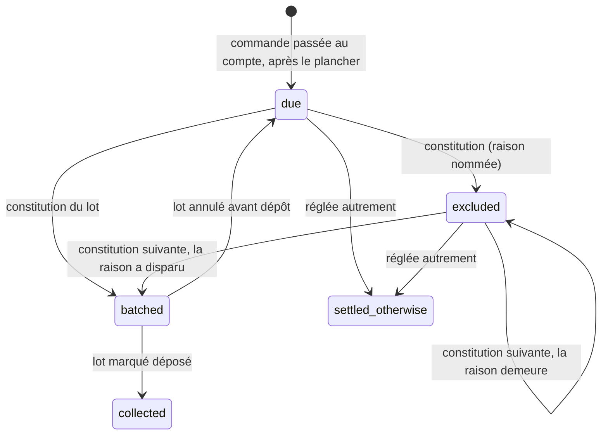

# Le lot de prélèvement figé

> 📐 **Plan v2, rien n'est bâti** (2026-10-05). Prérequis **S4-0** du chantier
> sous-comptes ([`../b2b/plan-sous-comptes.md`](../b2b/plan-sous-comptes.md),
> §2.1 quater), mais il sert à **tous** les clients prélevés. Trouvaille T10 du
> [ledger](../b2b/ledger-sous-comptes.md).
>
> La v1 a été contredite par `vitruve` le même jour : quatre objections
> BLOQUANTES et huit SÉRIEUSES. Le §8 dit où chacune est reprise.

## 0. Ce qui existe (relu le 2026-10-05)

- **Le cycle** va d'une clôture à la suivante (`domain/services/billing-cycle.ts`).
  `cycleAt(now, previousClosure)` prévoit la clôture enregistrée, mais
  **aucune n'est enregistrée** : `cycle-draft-support.ts` appelle
  `cycleAt(now, null)`.
- **Le brouillon** est **recalculé à chaque téléchargement** :
  - l'assiette (`prisma-billable-orders.reader.ts:57-66`) groupe par société,
    selon quatre critères ;
  - **aucun de ces critères ne porte sur l'entité émettrice**, et `orders`
    n'a pas de colonne d'entité ;
  - les mandats actifs (`prisma-debtor-mandate.reader.ts:35`) sont lus par
    société, sans regarder le créancier ;
  - le rendu se fait par `pain.008`.
- **Les identifiants SEPA ne dépendent que du cycle** : `MsgId` =
  `<cycleTag>-<scheme>` (`pain008.ts:~141`), `PmtInfId` = `MsgId-SEQ`
  (`:206`), `EndToEndId` = `<cycle>-<schéma>-<rang>` (`:237`). `CreDtTm`
  vient de l'heure du rendu (`:~152`).
- **Une ligne de prélèvement est un débiteur**, pas une commande
  (`pain008.ts:233`). Le port ne rend que des sommes par société, sans
  `order_id`.
- **Rien n'est écrit** : ni lot, ni état par commande, ni dépôt.

## 1. Les trois rattachements qui manquaient

**Une commande appartient à l'entité du mandat qui la prélève.**
`payment_mandates.creditor_id` désigne déjà l'entité créancière, avec « un
seul actif par (société, créancier) ». À la constitution, le lot d'une
entité prend les commandes dont le **mandat effectif** (celui de la société,
ou du payeur avec les sous-comptes) a **cette entité** pour créancier. Une
commande sans mandat effectif n'appartient à aucun lot : elle est
**signalée** (§3), pas écartée en silence.

> ⚠️ Si une société a deux mandats actifs, chez deux entités, sa commande
> est ambiguë. Elle est alors refusée à la constitution, avec le nom de la
> société. C'est une interdiction, pas un choix au hasard. Une seule entité
> encaisse aujourd'hui (Hugo, 2026-10-05).

**Une ligne de prélèvement porte ses commandes.** Le nouveau port
`collectableOrders(entity, closesAt)` liste les **commandes**, et non des
sommes. Le lot les groupe par débiteur pour le XML. Chaque ligne du lot
garde ses `order_id` : un futur rejet bancaire sur un `EndToEndId` sait
ainsi quelles commandes il touche.

**Le lot entre dans les identifiants SEPA.** `MsgId`, `PmtInfId` et
`EndToEndId` sont construits à partir de l'**identifiant du lot**, et non plus
du cycle. Un lot annulé puis reconstitué n'émet jamais deux fois le même
`MsgId`. Le rang d'une ligne ne peut donc plus désigner un autre débiteur
d'un fichier à l'autre. 🔴 **C'est irréversible dès le premier dépôt** : le
format est arrêté en P1 et ne bouge plus.

## 2. Le modèle



```
collection_batch (
  id, legal_entity_id, scheme ('core'|'b2b'),
  cycle_starts_at, cycle_closes_at,
  status ('constituted'|'deposited'|'cancelled'),
  constituted_at, constituted_by_staff_id,
  deposited_at, deposited_by_staff_id,
  xml text, file_sha256                  -- le fichier, STOCKÉ, rendu une fois
)

collection_batch_line (                  -- un débiteur du fichier
  batch_id, rank, end_to_end_id,
  mandate_id, mandate_reference, debtor_iban_sealed, sequence,
  amount_cents
)

order_collection (
  order_id PK,                           -- opaque
  state, batch_id NULL, line_rank NULL,
  exclusion_reason NULL,                 -- 'no_mandate', 'payer_detached',
                                         -- 'one_off_consumed', 'ambiguous_creditor'
  amount_cents, updated_at
)

collection_floor (singleton) ( floor_at ) -- le plancher, posé au déploiement
```

- **Le fichier est stocké, pas re-rendu.** `CreDtTm` = `constituted_at`. Le
  sha256 se vérifie à chaque téléchargement. Le CSV de contrôle se rend
  depuis `collection_batch_line`.
- **Le mandat est figé sur la ligne**, IBAN compris (scellé, comme
  aujourd'hui). « Marquer déposé » **relit** chaque mandat : un mandat
  révoqué ou un IBAN changé depuis la constitution **refuse** le dépôt, et
  nomme la société. Le lot s'annule alors et se reconstitue.
- **Un mandat ponctuel consommé** (`OOFF` déjà `collected`) donne
  l'exclusion `one_off_consumed`. Le trou de
  `todo-mandat-core-contre-b2b.md:127-134` est fermé ici, puisque
  `collected` fournit enfin l'historique des débits.
- **Les identités staff** sont des identifiants staff locaux, jamais un
  `sub` (`lint:subject-readers`, `lint:auth0-id-readers`).
- **Chaque geste écrit un fait journalisé** (`lint:events-tracked`) :
  `collection.batch_constituted`, `_cancelled`, `_deposited`,
  `collection.order_settled_otherwise`.

## 3. L'assiette, ses bornes, et ce qui n'y entre pas

- **Plancher.** Une commande n'entre que si elle a été créée **après** le
  `floor_at`, posé au déploiement de P1. Avant, rien n'a été prélevé par ce
  mécanisme, et on est en pré-exploitation. Les commandes antérieures ne
  sont jamais reprises en silence. Les reprendre serait un geste à part.
- **Pas de borne basse au-delà du plancher** : une commande `due` ou
  `excluded` d'un cycle passé revient. Le libellé `RmtInf` dit alors « dont
  N commandes de cycles antérieurs ».
- **La course avec la passation** est **voulue** : une commande validée
  après la constitution, même datée avant la clôture, n'a pas de ligne. Elle
  se lit donc `due`, et entre au lot suivant. Aucun verrou n'est demandé à
  la passation.
- **Une commande annulée** après `batched` : le lot **refuse son dépôt** et
  nomme la commande, comme pour un mandat révoqué. On annule et on
  reconstitue. Après `collected`, l'annulation ne touche plus au
  prélèvement : un avoir et un remboursement sont **hors plan**, et la
  fiche de la commande le **signale**.
- **Une commande sans mandat — Q2.** Aujourd'hui, une seule commande sans
  mandat rend **tout le fichier** non déposable (`isSchemeFileDepositable`).
  C'est une **interdiction**. La v2 propose de l'**affaiblir** : la commande
  est écartée (`no_mandate`), nommée **en tête du lot et de l'écran**, et le
  reste part. Ce choix revient à Hugo.

## 4. Les gestes (staff, `b2b_accounting`)

| Geste                    | Condition                                           | Effet                                                        |
| ------------------------ | --------------------------------------------------- | ------------------------------------------------------------ |
| Constituer le lot        | `cycle_closes_at ≤ now`, verrou par entité          | assiette §3 ; lignes, exclusions, XML stocké, empreinte      |
| Annuler le lot           | `constituted`                                       | ses commandes repassent `due`                                |
| Marquer déposé           | `constituted`, relecture des mandats et des statuts | `deposited` ; ses commandes passent `collected`              |
| Réglée autrement         | `due` ou `excluded`                                 | `settled_otherwise`, avec une note                           |
| Aperçu du cycle en cours | —                                                   | recalculé comme aujourd'hui, nommé « aperçu, non déposable » |

**La clôture enregistrée** est la `cycle_closes_at` du dernier lot de
l'entité. Chaque entité a sa fenêtre, et ce n'est plus un problème : les
commandes sont rattachées à une entité par leur mandat (§1).

## 5. Ce que ça donne aux sous-comptes

`payer_detached` est une raison d'exclusion de plus. « 3 commandes du chalet X
restent à régler » se lit dans `order_collection` en `excluded`. Rattacher
le chalet fait disparaître la raison, et la constitution suivante prend la
commande.

## 6. Les lots

| Lot    | Contenu                                                                                                                                                                                                                                                                                                             |
| ------ | ------------------------------------------------------------------------------------------------------------------------------------------------------------------------------------------------------------------------------------------------------------------------------------------------------------------- |
| **P1** | tables ; plancher ; port `collectableOrders` ; constitution sous verrou ; identifiants SEPA par lot ; XML stocké et empreinte ; téléchargement du lot ; **annuler** ; faits journalisés ; e2e : deux téléchargements identiques, annuler puis reconstituer change les `MsgId`, une exclusion reprise au lot suivant |
| **P2** | marquer déposé (avec relecture), réglée autrement, `one_off_consumed`, refus sur commande annulée ; écran du cycle (lots, états, exclusions) dans le back-office                                                                                                                                                    |

P1 contient l'annulation : sans elle, un lot constitué serait définitif dès
le premier essai.

## 7. Questions pour Hugo

- **Q1 — Constitution manuelle ou automatique à la clôture ?** _Défaut :
  manuelle, par la compta._
- **Q2 — Une commande sans mandat.** Hugo n'a pas tranché (2026-10-05).
  **On garde donc l'interdiction d'aujourd'hui** : une commande sans mandat
  rend le lot **non déposable**, et la constitution le dit en nommant la
  société. Un garde-fou ne s'affaiblit pas par défaut. `no_mandate` reste une
  raison d'exclusion pour l'écran, et le lot ne part pas tant qu'elle
  existe.
- **Q3 — Garder l'aperçu du cycle en cours ?** _Défaut : oui._
- **Q4 — Combien d'entités encaissent ?** **Une seule** (Hugo, 2026-10-05).
  Le cas « deux mandats actifs chez deux entités » reste théorique, et il
  est refusé quand même.

## 8. Ce que `vitruve` a changé (2026-10-05)

| Objection                                                   | Réponse                                               |
| ----------------------------------------------------------- | ----------------------------------------------------- |
| BLOQUANT — l'assiette ignore l'entité                       | rattachement par le créancier du mandat (§1)          |
| BLOQUANT — aucun plancher au premier lot                    | `collection_floor` (§3)                               |
| BLOQUANT — `MsgId` réutilisés après annulation              | identifiants SEPA par lot (§1)                        |
| BLOQUANT — des montants par commande, un XML par débiteur   | `collection_batch_line` + port des commandes (§1, §2) |
| SÉRIEUX — mandat ponctuel consommé                          | `one_off_consumed` (§2)                               |
| SÉRIEUX — mandat révoqué ou IBAN changé avant dépôt         | relecture au dépôt, refus nommé (§2)                  |
| SÉRIEUX — commande annulée après `batched`                  | refus du dépôt ; après `collected`, signalé (§3)      |
| SÉRIEUX — course avec la passation                          | voulue et écrite (§3)                                 |
| SÉRIEUX — déterminisme, stockage                            | XML stocké, `CreDtTm` figé (§2)                       |
| SÉRIEUX — clôture par entité                                | levée par le rattachement (§4)                        |
| SÉRIEUX — P1 sans annulation                                | l'annulation entre dans P1 (§6)                       |
| SÉRIEUX — Q2 présentée comme neutre                         | dite comme un affaiblissement (§3, Q2)                |
| MINEUR — `excluded → due` sans acteur ; identités ; journal | §2                                                    |
