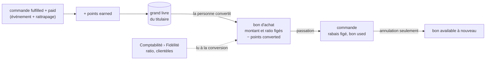

# Plan — les points de fidélité

**Statut** : 📐 plan, 2026-09-26. **Rien n'est bâti.** Touche **l'argent**
(une remise qui réduit un total et sa TVA). **Contredit par `vitruve` le même
jour : 3 BLOQUANT, 8 SÉRIEUX** — ce document est la version d'après, le §6 dit
ce qui a changé. **Réécrit le même jour après les réponses de Hugo (§7)** :
les points se convertissent en **bon d'achat**. Il doit repasser par `vitruve`
avant le lot C.
**Portée** : gagner des points sur une commande, les convertir en **bon
d'achat**, utiliser ce bon sur une commande suivante, et régler le taux de
conversion dans Comptabilité. Ouvert à la clientèle **publique** d'abord,
conçu pour s'étendre aux pros sans refonte.

## 0. La demande

> « les points fidélité, plutôt ouverts au public de base mais extensible
> j'imagine. Facile, une commande donne son nombre de points en centimes, et
> en admin/comptabilité remise fidélité, on définit un ratio nombre de points,
> valeur euro » — Hugo, 2026-09-26.

Donc :

- **gagner** : une commande de 23,40 € rapporte **2 340 points** ;
- **convertir** : un ratio réglé à l'écran, par exemple **1 000 points = 5 €** ;
- **dépenser** : la personne convertit ses points en **bon d'achat**, puis
  utilise ce bon sur une commande.

> « 1 non. 2 je ne sais pas, documente. 3 la société. En fait la personne
> convertit ses points en bon d'achat » — Hugo, même jour, réponses au §5.

## 1. L'existant (ouvert et vérifié le 2026-09-26)

- **Rien n'existe.** Aucune occurrence de « fidélité » ou de `loyalty` dans le
  code, à part deux homonymes sans rapport (la « fidélité du miroir », le
  gabarit de mercuriale « Fidélité »).
- **Toute commande a une personne** : `Order.placedByUserId` → `User`, y
  compris sans compte. Un invité est un `User` dont `auth0_sub` est `NULL`
  (`account.prisma`, plan `order/plan-commande-sans-compte.md`). `companyId`,
  lui, est nul pour le public.
- **La commande porte `clientele`** (`pro` | `public`), nullable
  (`orders.prisma:109`).
- **Les montants figés** à la passation sont en centimes : `subtotalCents` (HT),
  `discountCents` (remise du point de retrait, **HT**), `deliveryFeeCents`,
  `lateFeeCents`, `vatCents`, `vatShares`, `totalCents` (TTC).
- **La seule remise existante entre HT** dans `ventilateVat` (`@lfd/money`) :
  `discountCents` se répartit sur les lignes avant la TVA, et il est plafonné
  au sous-total (`vat.spec.ts`).
- **Statuts** : `placed → confirmed → in_production → ready → fulfilled`, plus
  `cancelled`. **L'annulation n'est pas bâtie** : `cancelled` n'est écrit par
  aucun chemin, et le plan est bloqué par `vitruve`
  (`order/plan-annulation-de-commande.md`). `refunded` n'est jamais écrit.
- **Comptabilité** a déjà un réglage global à clé fixe : `AccountingSettings`
  (`id = 'default'`, `paymentLinkMaxCents`), gardé par `b2b_accounting`, avec
  son fait de journal `accounting_settings.payment_link_cap_set`.

## 2. Ce qu'on bâtit, en une phrase

Chaque **titulaire** a un **grand livre de points** où l'on écrit sans jamais
effacer. Le titulaire est la **société** pour un pro, la **personne** pour un
particulier. Le passage à `fulfilled` d'une commande réglée **crédite** ce
livre. Quand une personne le décide, elle **convertit** des points en un **bon
d'achat** d'un montant fixe. Le ratio est lu à ce moment-là, puis figé sur le
bon. Le bon s'utilise ensuite sur une commande, avec un traitement de TVA qui
reste à trancher (§3, D6). Il y reste attaché tant que la commande vit. Il ne
redevient disponible que si la commande est **annulée**. Un paiement refusé
ne suffit pas : une commande refusée se reprend par un lien de paiement.

**Pourquoi le bon simplifie** : la dépense de points est un geste à part
entière, hors de la passation. La passation ne touche plus au livre : elle
réserve un bon. Une annulation rend donc un bon, pas des points, et le
ratio ne peut plus changer entre le panier et le paiement, puisqu'il est figé
sur le bon.

## 3. Les décisions

### D1 — Le titulaire : la société, ou la personne

- **Titulaire** = `company_id` pour un pro, `user_id` pour un particulier.
  Une table de titulaires n'est pas nécessaire. Chaque ligne du livre et
  chaque bon portent **l'un des deux, exactement** :
  `CHECK ((company_id IS NULL) <> (user_id IS NULL))`.
- Qui gagne : c'est la `clientele` de la commande qui tranche.
  - `pro` crédite `Order.companyId`. Si ce champ est nul, parce que la société
    a été supprimée (`orders.prisma:101-103`), il n'y a pas de crédit, et la
    sonde l'écarte explicitement ;
  - `public` crédite `placedByUserId` ;
  - une `clientele` nulle (commandes d'avant le champ) ne crédite rien.
- **Les clés étrangères vers `companies` et `users` sont `ON DELETE RESTRICT`**
  sur le livre et sur les bons. Un livre ne s'efface pas. Avant la migration
  du lot A, il faut vérifier quels chemins suppriment une société ou une
  personne, et ce que ce refus leur fait.
- **Seul un compte connecté gagne** (`auth0_sub` non nul) :
  - `User.email` n'est pas unique, et une commande sans compte reste
    rattachée à l'invité neuf (`plan-commande-sans-compte.md`) ;
  - les points d'un invité seraient donc inaccessibles, et s'attribuer ceux
    d'une adresse serait une faille.
- **Qui convertit, chez un pro** : toute personne active rattachée à la
  société, avec le droit d'y commander. La société est celle de **l'espace
  courant**, pas celle de la personne : une personne peut appartenir à
  plusieurs sociétés. Le rattachement est revérifié sous verrou. Une personne
  qui quitte la société ne part pas avec ses bons : ils sont à la société. ⚠️ **Question** (§5) : faut-il le
  réserver au titulaire du compte ?

### D2 — Le grand livre

Nouvelle table `loyalty_ledger_entries` (schéma `public`, contexte
`b2b/loyalty/`) :

- le titulaire (D1) ;
- `kind`, `points` (entier **signé**), `order_id` et `voucher_id`
  (nullables) ;
- `occurred_at`, `actor_user_id` ou `staff_user_id`, et `reason` pour un
  ajustement.

Valeurs de `kind` :

- `earned` (+) : une commande remise et réglée ;
- `converted` (−) : un bon émis ;
- `adjusted` (±) : un geste du staff, avec un motif obligatoire.

Règles :

- **Le solde est la somme.** Aucune colonne de solde.
- **Unicités en base** : `(order_id)` pour `earned`, `(voucher_id)` pour
  `converted`. Un rejeu n'écrit rien de plus.
- **Le solde ne descend jamais sous zéro.** La conversion prend un
  `pg_advisory_xact_lock` sur le titulaire, selon la convention du dépôt
  (`prisma-person-attachment.lock.ts`). Son espace de noms est propre, et la
  clé est préfixée `company:` ou `user:`, pour qu'un identifiant de société et
  un identifiant de personne ne tombent jamais sur le même verrou. Elle relit ensuite la somme, puis
  écrit le bon et le débit **dans la même transaction**. Pour un pro, deux
  personnes de la même société qui convertissent en même temps attendent
  l'une l'autre.
- Faits de journal : `loyalty.points_earned`, `loyalty.points_adjusted`,
  `loyalty.voucher_issued`, `loyalty.voucher_reserved`,
  `loyalty.voucher_released`, `loyalty.voucher_expired`,
  `loyalty.voucher_cancelled`.
- `actor_user_id` : quand une personne est effacée, il passe à `NULL` sans que
  la ligne disparaisse. C'est la seule exception au `RESTRICT`, parce que
  l'auteur d'un geste n'est pas le titulaire.

### D3 — Créditer après remise et encaissement, par rattrapage idempotent

- **Condition** : la commande est `fulfilled` **et** `paymentStatus = paid`.
  `not_required` ne compte **pas** : chez un pro, cela veut dire « payé à
  terme », pas encaissé (`orders.prisma:206-210`). Le jour où l'on ouvre
  les pros, il faudra un signal « facture réglée ». Il n'existe pas
  aujourd'hui, et ouvrir `openToPro` sans lui n'est pas permis (lot F).
- **Pas de transaction partagée avec `orders`.** `markFulfilled` et
  `settle` écrivent en autocommit (`prisma-order.repository.ts:154-260`).
  Les faire écrire dans les tables de `b2b/loyalty/` ferait lire à une classe
  les tables d'un autre contexte en Prisma direct (`CLAUDE.md` §3).
- **Le mécanisme** : `b2b/loyalty/` crédite de deux façons, toutes deux
  idempotentes par l'unicité `(order_id)` sur `earned` :
  1. **au fil de l'eau**, un abonné à l'événement de remise et à celui de
     règlement. Au bout, il se déclenche sur le **second** des deux. Il écoute
     la classe publiée **par le commerce**
     (`b2b/orders/domain/events/order-handed-over.event.ts`), et non celle du
     canal `handover` ;
  2. **par rattrapage**, une tâche périodique qui **écrit** le crédit des
     commandes `fulfilled` et `paid`, d'une clientèle ouverte, qui n'ont pas
     encore de ligne `earned`. Elle lit les commandes par un port de lecture
     que `orders` expose, pas par Prisma direct.
     L'abonné peut échouer, puisque `BackgroundWork` avale son erreur. Le
     rattrapage garantit que le crédit arrive au plus tard au passage suivant.
- **Les chemins vers `paid` sont à inventorier au lot D.** `settle` en est un.
  Le lien de paiement en passe par un autre (`settle-payment-link.handler.ts`).
  Le comptoir est à vérifier. Le rattrapage les couvre tous, puisqu'il lit
  l'état et non les événements.

### D4 — L'assiette : les marchandises seulement

Décidé par Hugo : le port et la surtaxe **ne rapportent pas** de points.
L'assiette vaut `totalCents − deliveryFeeCents − lateFeeCents`, c'est-à-dire
le TTC des marchandises après toutes les remises.

⚠️ **Avec un bon, l'assiette dépend de D6.** En traitement A, `totalCents` est
déjà réduit du bon. En traitement B, il reste plein, et il faudra lui
soustraire le règlement par bon. Le lot D n'en dépend pas : tant que le lot C
n'est pas bâti, aucune commande ne porte de bon. Le lot C fixera cette
soustraction.

### D5 — Le ratio : lu à la conversion, figé sur le bon

Nouvelle table `loyalty_settings`, clé fixe `id = 'default'` :

- `pointsPerStep` (ex. 1 000) et `stepValueCents` (ex. 500, TTC) ;
- `openToPublic` (vrai) et `openToPro` (faux) ;
- `voucherValidityDays` (nullable : un bon sans date limite si nul, question
  §5).

**Tant que la ligne n'existe pas, le programme est fermé.** L'écran est
**Comptabilité › Fidélité**, sous le droit `b2b_accounting`. Fait de journal :
`loyalty_settings.set`.

Règles de conversion :

- **On convertit par paliers entiers** : un bon vaut
  `n × stepValueCents` et coûte `n × pointsPerStep` points.
- **Le bon fige** son montant, les points qu'il a coûtés et le ratio appliqué.
  Changer le ratio n'altère ni un bon émis, ni un nombre de points. Cela change
  seulement ce que vaudront les **prochaines** conversions, et l'écran le dit
  au moment d'enregistrer.

### D6 — Le bon et la TVA : ce qu'on ne sait pas encore

**Non tranché**, à demander au cabinet comptable. Voici ce qu'on sait, pour
qu'il réponde vite.

Deux traitements sont possibles :

| Traitement                                 | Effet sur la commande                                                      | Effet sur la TVA                  | Coût de bâtisse                                                                              |
| ------------------------------------------ | -------------------------------------------------------------------------- | --------------------------------- | -------------------------------------------------------------------------------------------- |
| **A. Rabais** (réduction du prix de vente) | une remise de plus, figée à la passation                                   | réduit la base, ventilée par taux | une remise HT de plus dans `ventilateVat`, et un calcul du HT pour une cible TTC             |
| **B. Moyen de paiement** (comme un avoir)  | le total TTC reste plein ; le bon en paie une partie, Stripe paie le reste | TVA calculée sur le prix plein    | un second encaissement à côté de Stripe, un « reste à payer », une facture à deux règlements |

Ce qu'on lit habituellement, **non vérifié ici et à faire confirmer** : un bon
**remis gratuitement** par le vendeur, et utilisé chez lui, est traité comme
une **réduction de prix**, qui diminue la base de TVA (traitement A). Un bon
**vendu**, comme une carte cadeau, relève plutôt du traitement B. Nos bons ne
sont jamais vendus : ils naissent de points donnés. Le cas penche donc vers A.

Ce qui ne dépend pas de la réponse, et qu'on peut bâtir avant :

- le livre, la conversion et l'émission du bon (lots A, B, D) ;
- le bon en tant qu'objet, avec ses états et son verrou.

Ce qui en dépend :

- le lot C tout entier : l'effet sur le total, la facture, l'export comptable ;
- 🔴 **le choix est irréversible pour les factures émises.**

**Si la réponse est A**, voici la mécanique retenue après la contradiction :

1. La remise du point de retrait s'applique d'abord.
2. Le bon s'impute ensuite sur le TTC des marchandises restant. Il ne paie
   jamais le port.
3. Une fonction `@lfd/money`, `htDiscountForTtcTarget`, cherche par recherche
   entière la plus grande remise HT dont l'effet TTC, calculé par
   `ventilateVat` lui-même, ne dépasse pas la cible. La facture imprime la
   **baisse de TTC réellement obtenue** : 4,99 € possible, 5,01 € jamais.
4. `ventilateVat` reçoit la remise du bon à part de `discountCents`.

**Question liée** (§5) : un bon plus gros que le panier. Soit on le
refuse, soit on le consomme entièrement et la différence est perdue, soit on
émet un bon de reliquat. Le reliquat se bâtit simplement dans les deux
traitements, mais c'est une décision.

### D7 — Le cycle d'un bon

| État        | Entre par                                           | Sort par                                                             |
| ----------- | --------------------------------------------------- | -------------------------------------------------------------------- |
| `available` | conversion, ou libération                           | passation (`reserved`), date limite (`expired`), staff (`cancelled`) |
| `reserved`  | la passation, sous le verrou du **titulaire**       | l'annulation de la commande (`available`)                            |
| `expired`   | date limite dépassée, **seulement** si `available`  | —                                                                    |
| `cancelled` | geste du staff motivé, **seulement** si `available` | —                                                                    |

- **Pas d'état `used`.** Un bon `reserved` sur une commande qui vit est
  consommé. Il ne pourrait revenir que par l'annulation. `markPaymentFailed`
  ne libère **rien** : une commande refusée n'est pas terminée, elle se
  reprend par un lien de paiement (`payment-link.ts:28-32`). Libérer le bon à
  ce moment-là permettrait de le dépenser deux fois.
- **Un bon réservé n'expire pas.** Libéré après sa date limite, il passe
  directement à `expired`.
- **Annuler un bon** (staff) : il passe à `cancelled`, et une ligne `adjusted`
  liée au bon recrédite ses points.
- **Un bon par commande** (`voucher_id` sur `Order`, colonne additive
  nullable). La réservation vit dans la transaction de passation, par un port
  que `orders` déclare et que `loyalty` implémente, relié dans
  `appBootstrap`.
- **L'idempotence de passation passe avant la réservation** : un rejeu rend
  la commande existante et ne touche pas au bon.
- 🔴 **L'annulation, quand elle sera bâtie, libère le bon.** Le plan
  d'annulation, et le plan d'abandon s'il écrit `cancelled`, doivent le citer.
- Chez un pro, toute personne qui peut commander pour la société peut
  utiliser un bon de la société.

### D8 — Ce qu'on ne fait pas

- Les points au comptoir sans compte, la carte physique, le parrainage.
- La vente de bons ou de cartes cadeaux : ce serait l'autre traitement de TVA.
- Défaire une conversion depuis la boutique. Seul le staff annule un bon
  (D7).

## 4. Les lots

| Lot | Contenu                                                                                                                                                                                                                                                                                               |
| --- | ----------------------------------------------------------------------------------------------------------------------------------------------------------------------------------------------------------------------------------------------------------------------------------------------------- |
| A   | migration additive : `loyalty_settings`, `loyalty_ledger_entries`, `loyalty_vouchers`, avec le CHECK de titulaire et les `RESTRICT`. Contexte `b2b/loyalty/` : le livre, le verrou, la conversion, le bon en états `available`, `expired` et `cancelled` seulement. Journal. Tests aux trois niveaux. |
| B   | Comptabilité › Fidélité : le réglage, une vue des soldes et des bons, l'ajustement motivé, l'annulation d'un bon.                                                                                                                                                                                     |
| D   | le crédit : l'abonné et la tâche de rattrapage, par un port de lecture d'`orders` ; l'inventaire des chemins vers `paid`.                                                                                                                                                                             |
| E1  | boutique : le solde, « vous gagnerez N points », et la conversion en bon.                                                                                                                                                                                                                             |
| C   | **attend la réponse à D6.** L'état `reserved`, la réservation à la passation, la libération à l'annulation, l'effet sur le total et sur l'assiette. Avant de bâtir : l'inventaire de tous les lecteurs du total. Ensuite, un passage de `vitruve`.                                                    |
| E2  | boutique : utiliser un bon au paiement.                                                                                                                                                                                                                                                               |
| F   | ouvrir aux pros : un signal « facture réglée » avant tout `openToPro`.                                                                                                                                                                                                                                |

Le cycle du bon s'arrête volontairement à `available` dans le lot A.
L'imputation dépend de D6 : avec le traitement B, le bon devient un
règlement, et peut laisser un reliquat. Figer `reserved` avant de connaître la
réponse coûterait une migration de plus.

⚠️ **À décider** : ouvrir E1 seulement quand C est prêt, pour ne pas
distribuer des bons qu'on ne peut pas encore utiliser.

## 5. Questions ouvertes

1. **D6 — au cabinet comptable** : un bon d'achat gratuit, issu de points
   de fidélité, est-il un rabais (A) ou un moyen de paiement (B) ?
2. D6 — que faire d'un bon plus gros que le panier : le refuser, perdre la
   différence, ou émettre un bon de reliquat ?
3. D1 — chez un pro, qui a le droit de convertir : toute personne qui commande,
   ou seulement le titulaire du compte ?
4. D5 — les bons ont-ils une date limite ?
5. §4 — ouvrir la conversion avant que les bons soient utilisables ?

## 6. Ce que la première contradiction a changé (2026-09-26)

> ⚠️ **En partie remplacé par le §7 et le §8.** Le bon d'achat a supprimé
> `restored`, le débit à la passation et le 409 « barème changé ». Ce qui
> suit est gardé comme historique.

- **B1** — Des points débités restaient perdus si le règlement échouait ou
  était abandonné. Désormais, `restored` est écrit par chaque chemin de
  renoncement, et c'est une condition de bâtisse imposée aux plans voisins
  (D2).
- **B2** — Le crédit reposait sur un événement dont les échecs sont avalés.
  Il est maintenant écrit dans la transaction de `fulfilled`, avec une sonde
  de rattrapage (D3).
- **B3** — « L'invité retrouve ses points en ouvrant un compte » était faux,
  puisque l'adresse n'est pas unique. Désormais, l'invité ne gagne rien
  (aujourd'hui D1).
- **Sérieux** :
  - la conversion TTC vers HT est nommée et construite par recherche ;
  - on imprime la baisse de TTC réelle ;
  - l'ordre et le plafond des deux remises sont fixés ;
  - on ne dépense que des paliers pleins ;
  - le verrou suit la convention du dépôt, et le débit vit dans la
    transaction de passation ;
  - l'idempotence est vérifiée avant le calcul de fidélité ;
  - seules les commandes réglées rapportent des points ;
  - l'irréversibilité du rabais est dite ;
  - le ratio est figé sur la commande, et un barème changé donne un 409 ;
  - l'inventaire des lecteurs du total est une étape du lot C.

## 7. Les réponses de Hugo (2026-09-26)

- **Assiette** : le port et la surtaxe ne rapportent pas de points (D4).
- **TVA** : « je ne sais pas, documente ». D6 expose les deux traitements, ce
  qui ne dépend pas de la réponse, et ce qui en dépend. Le lot C attend.
- **Titulaire** : les points appartiennent à la **société** chez un pro (D1).
- **Bon d'achat** : la personne convertit ses points en bon, puis utilise le
  bon. Ce choix a remplacé la remise en points à la passation. Il a supprimé
  l'ancien `restored` : un échec de commande libère le bon, pas les points. Il
  a aussi supprimé le 409 « barème changé » : le ratio est figé sur le bon au
  moment de la conversion.

## 8. Ce que la seconde contradiction a changé (2026-09-26)

- **B1** — Libérer le bon au refus de paiement permettait de le dépenser deux
  fois : une commande refusée se reprend. Désormais, seule l'annulation libère
  un bon, et l'état `used` disparaît (D7).
- **B2** — « Dans la même transaction que `fulfilled` » supposait une
  transaction qui n'existe pas, et une écriture d'`orders` dans les tables de
  `loyalty`. Le crédit passe maintenant par un abonné et par un rattrapage
  idempotent qui écrit, en lisant les commandes par un port (D3).
- **B3** — `not_required` n'est pas un encaissement. Seul `paid` crédite, et
  l'ouverture aux pros attend un signal « facture réglée » (lot F).
- **Sérieux** :
  - société supprimée : la sonde l'écarte ;
  - clés étrangères en `RESTRICT` ;
  - `clientele` nulle exclue ;
  - titulaire pris dans l'espace courant ;
  - espace de noms de verrou préfixé ;
  - assiette avec bon renvoyée au lot C ;
  - cycle du bon arrêté à `available` avant D6 ;
  - un bon réservé n'expire pas ;
  - les chemins vers `paid` sont couverts par le rattrapage.
