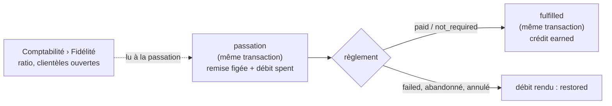

# Plan — les points de fidélité

**Statut** : 📐 plan, 2026-09-26. **Rien n'est bâti.** Touche **l'argent**
(une remise qui réduit un total et sa TVA). **Contredit par `vitruve` le même
jour : 3 BLOQUANT, 8 SÉRIEUX** — ce document est la version d'après, le §6 dit
ce qui a changé. Il doit repasser par lui avant le lot C.
**Portée** : gagner des points sur une commande, les convertir en **remise
fidélité** sur une commande suivante, et régler le taux de conversion dans
Comptabilité. Ouvert à la clientèle **publique** d'abord, conçu pour
s'étendre aux pros sans refonte.

## 0. La demande

> « les points fidélité, plutôt ouverts au public de base mais extensible
> j'imagine. Facile, une commande donne son nombre de points en centimes, et
> en admin/comptabilité remise fidélité, on définit un ratio nombre de points,
> valeur euro » — Hugo, 2026-09-26.

Donc :

- **gagner** : une commande de 23,40 € rapporte **2 340 points** ;
- **convertir** : un ratio réglé à l'écran, par exemple **1 000 points = 5 €** ;
- **dépenser** : les points deviennent une remise sur une commande.

## 1. L'existant (ouvert et vérifié le 2026-09-26)

- **Rien n'existe.** Aucune occurrence de « fidélité » ou de `loyalty` dans le
  code, à part deux homonymes sans rapport (la « fidélité du miroir », le
  gabarit de mercuriale « Fidélité »).
- **Toute commande a une personne** : `Order.placedByUserId` → `User`, y
  compris sans compte. Un invité est un `User` dont `auth0_sub` est `NULL`
  (`account.prisma`, plan `order/plan-commande-sans-compte.md`). `companyId`,
  lui, est nul pour le public.
- **La commande porte `clientele`** (`pro` | `public`), nullable
  (`orders.prisma:109`).
- **Les montants figés** à la passation sont en centimes : `subtotalCents` (HT),
  `discountCents` (remise du point de retrait, **HT**), `deliveryFeeCents`,
  `lateFeeCents`, `vatCents`, `vatShares`, `totalCents` (TTC).
- **La seule remise existante entre HT** dans `ventilateVat` (`@lfd/money`) :
  `discountCents` se répartit sur les lignes avant la TVA, et il est plafonné
  au sous-total (`vat.spec.ts`).
- **Statuts** : `placed → confirmed → in_production → ready → fulfilled`, plus
  `cancelled`. **L'annulation n'est pas bâtie** : `cancelled` n'est écrit par
  aucun chemin, et le plan est bloqué par `vitruve`
  (`order/plan-annulation-de-commande.md`). `refunded` n'est jamais écrit.
- **Comptabilité** a déjà un réglage global à clé fixe : `AccountingSettings`
  (`id = 'default'`, `paymentLinkMaxCents`), gardé par `b2b_accounting`, avec
  son fait de journal `accounting_settings.payment_link_cap_set`.

## 2. Ce qu'on bâtit, en une phrase

Un **grand livre de points** par personne connectée, où l'on écrit sans jamais
effacer. La passation d'une commande qui dépense des points **débite** le livre
dans sa propre transaction et fige une **remise fidélité**. Tout ce qui fait
échouer la commande **rend** ce débit. Le passage à `fulfilled` d'une commande
réglée **crédite** le livre dans la même transaction. Le ratio vit dans
Comptabilité, est lu à la passation, et reste ensuite figé sur la commande.

## 3. Les décisions

### D1 — Le solde est un grand livre, pas une colonne

Nouvelle table `loyalty_ledger_entries` (schéma `public`, contexte
`b2b/loyalty/`) : `id`, `user_id`, `kind`, `points` (entier **signé**),
`order_id` (nullable), `occurred_at`, `staff_user_id` et `reason` (nullables,
pour un ajustement manuel).

- `kind` : `earned` (+), `spent` (−), `restored` (+, rend un `spent`),
  `adjusted` (±, geste du staff, avec un motif).
- **Le solde est la somme.** Aucune colonne « solde » qui pourrait diverger
  de l'historique.
- **Une commande ne crédite, ne débite et ne rend qu'une fois** : unicité
  `(order_id, kind)` en base pour `earned`, `spent` et `restored`. Et
  `restored` n'existe que s'il y a un `spent` sur la même commande : on le
  vérifie dans la transaction qui l'écrit.
- **Le solde ne descend jamais sous zéro.** Le débit prend un
  `pg_advisory_xact_lock` sur la personne, selon la convention du dépôt
  (`prisma-person-attachment.lock.ts`), puis relit la somme. On ne pose pas de
  `FOR UPDATE` sur `users`, qui bloquerait toute écriture de profil pendant la
  passation.
- Chaque écriture a son fait de journal : `loyalty.points_earned`,
  `loyalty.points_spent`, `loyalty.points_restored`,
  `loyalty.points_adjusted`.

### D2 — Débiter à la passation, et rendre sur chaque échec

- **Le débit vit dans la transaction qui crée la commande.** Si la commande
  échoue, le débit échoue avec elle. Aucun débit n'existe sans sa commande.
- **L'idempotence de passation passe avant tout calcul de fidélité.** Un rejeu
  rend la commande existante sans relire ni le solde ni le ratio. Sinon, le
  second essai échouerait sur « solde insuffisant », puisque le premier débit
  est déjà écrit.
- **Tout chemin qui renonce à une commande écrit `restored`, dans sa propre
  transaction.** Cela couvre :
  - `markPaymentFailed` (le refus Stripe) ;
  - l'abandon du règlement (`order/plan-abandon-du-reglement.md`, qui écrit
    `cancelled`) ;
  - l'annulation, le jour où elle sera bâtie.

  🔴 **C'est une condition de bâtisse pour les deux autres plans** : chacun
  doit citer ce paragraphe. Le lot C ne part pas en production avant que
  `markPaymentFailed` rende les points. Et si l'abandon est bâti avant le
  lot C, il n'a encore aucun débit à rendre, donc il n'y a rien à perdre.

### D3 — Créditer au passage à `fulfilled`, pas par un événement

- **Le crédit s'écrit dans la transaction qui pose `fulfilled`**
  (`markFulfilled`, `prisma-order.repository.ts:245`). On n'utilise pas un
  abonné à `OrderHandedOverEvent`, parce que `BackgroundWork` avale ses échecs
  (`platform/events/background-work.ts`) : un crédit raté y serait perdu en
  silence.
- **Condition** : `paymentStatus` vaut `paid` ou `not_required`. Une commande
  remise mais non réglée ne rapporte rien tant qu'elle n'est pas réglée. Le
  crédit s'écrit alors à `markPaid`, si la commande est déjà `fulfilled`, et
  c'est la même fonction qui le fait.
- **Une vérification de rattrapage** liste les commandes `fulfilled` et
  réglées d'une clientèle ouverte qui n'ont pas de ligne `earned`. Elle sert
  de sonde, pas d'écriture automatique.
- **Pourquoi pas à la passation** : la marchandise n'est pas encore partie, et
  rien ne garantit que la commande sera payée.

### D4 — L'assiette

**Proposé** : on crédite `totalCents` **moins** `deliveryFeeCents` et
`lateFeeCents`. Autrement dit, les points récompensent l'achat de
marchandises, TTC, après toutes les remises. On ne gagne pas de points sur des
points.
**Question pour Hugo** : inclure le port ? Ta phrase dit « la commande ».

### D5 — Le ratio : un réglage, figé sur la commande

Nouvelle table `loyalty_settings`, clé fixe `id = 'default'`, calquée sur
`AccountingSettings` :

- `pointsPerStep` (ex. 1 000) et `stepValueCents` (ex. 500, **TTC**) : deux
  entiers, jamais un flottant ;
- `openToPublic` (vrai), `openToPro` (faux) : pour étendre aux pros, on
  modifie un réglage, on ne relance pas un chantier ;
- **tant que la ligne n'existe pas, le programme est fermé.** Aucune valeur
  par défaut inventée.

Écran : **Comptabilité › Fidélité**, gardé par `b2b_accounting` read et
write. Aucune nouvelle ressource. Fait de journal : `loyalty_settings.set`,
avec l'avant et l'après.

- **Le ratio appliqué est figé sur la commande** (`loyaltyPointsSpent`,
  `loyaltyStepValueCents`, `loyaltyPointsPerStep`), comme `discountCents`
  fige son ajustement d'origine.
- **Le panier envoie le nombre de paliers et le ratio qu'il a affichés.** Si
  le ratio a changé entre-temps, le serveur refuse avec un 409 nommé
  (« Le barème de fidélité vient de changer, votre panier a été mis à
  jour ») plutôt que d'appliquer une valeur que le client n'a pas vue.
- ⚠️ **Changer le ratio change la valeur des points déjà gagnés**, pas leur
  nombre. L'écran le dit au moment d'enregistrer.

### D6 — La remise fidélité est un rabais

| Traitement           | TVA                                  | Ce que ça demande                                          |
| -------------------- | ------------------------------------ | ---------------------------------------------------------- |
| **rabais (proposé)** | réduit l'assiette, ventilée par taux | une remise HT de plus dans `ventilateVat`                  |
| moyen de paiement    | TVA sur le prix plein                | un second encaissement à côté de Stripe, que rien ne porte |

**Proposé : rabais.** On donne les points, le client ne les achète pas. La
remise réduit donc le prix de vente.
🔴 **Irréversible pour les factures émises** : une fois des commandes figées
avec une TVA réduite, passer à « moyen de paiement » ne les réécrit pas.
**À faire valider par le cabinet comptable avant le lot C.**

La mécanique :

1. **Ordre** : la remise du point de retrait s'applique d'abord. Le plafond de
   la fidélité est le **sous-total HT restant**, c'est-à-dire
   `subtotalCents − discountCents`.
2. **Capacité** : le nombre de paliers autorisés vaut
   `floor(TTC restant des marchandises / stepValueCents)`. Le client choisit
   entre 0 et `min(capacité, paliers de son solde)`. On ne dépense donc
   jamais un palier pour une remise tronquée. Un panier plus petit qu'un
   palier ne peut pas dépenser de points, et l'écran le dit.
3. **Conversion** : une nouvelle fonction de `@lfd/money`,
   `htDiscountForTtcTarget(lines, discountCents, targetTtcCents)`, cherche la
   remise HT **la plus grande** dont l'effet TTC, calculé par `ventilateVat`
   lui-même, ne dépasse pas la cible. Elle procède par recherche sur des
   entiers, pas par inversion d'une formule, pour que l'arrondi soit par
   construction celui de `ventilateVat`.
4. **Ce que voit le client, et ce qui est imprimé** : « Remise fidélité », pour
   la **baisse de TTC réellement obtenue**, c'est-à-dire le total sans la
   remise moins le total avec. Le montant peut valoir 4,99 € pour une cible de
   5 €, jamais 5,01 €. Les lignes imprimées retombent donc toujours sur le
   total.
5. `ventilateVat` reçoit `loyaltyDiscountCents` à part. Il n'est pas
   additionné à `discountCents`, pour que chaque remise reste lisible sur la
   facture. Les deux s'appliquent avant la TVA.

### D7 — Qui gagne, qui dépense

- **Seule une personne connectée gagne et dépense** (`auth0_sub` non nul),
  quand la clientèle de sa commande est ouverte (D5).
- **Un invité ne gagne rien.** `User.email` n'est pas unique, et une commande
  sans compte reste rattachée à l'invité neuf, jamais au compte existant
  (`plan-commande-sans-compte.md`). Les points d'un invité seraient donc
  inaccessibles. S'attribuer les points d'une adresse serait en plus une
  faille. L'écran de commande sans compte peut dire « créez un compte pour
  gagner N points ».
- **Chez un pro, le jour venu** : les points vont à la **personne**, pas à la
  société. ⚠️ **Question pour Hugo** : c'est irréversible sans migration de
  données.

### D8 — Ce qu'on ne fait pas

- **L'expiration** : rien n'expire. On pourra l'ajouter plus tard par un
  `kind` de plus.
- **Les points au comptoir sans compte, la carte physique, le parrainage.**
- **Un plafond en pourcentage du panier** : il n'y en a pas au-delà du
  sous-total (question 4).

## 4. Les lots

| Lot | Contenu                                                                                                                                                                                                                                                                                                                                                                                            |
| --- | -------------------------------------------------------------------------------------------------------------------------------------------------------------------------------------------------------------------------------------------------------------------------------------------------------------------------------------------------------------------------------------------------- |
| A   | migration additive : `loyalty_settings`, `loyalty_ledger_entries` ; contexte `b2b/loyalty/` (`LoyaltyRatio`, le livre, le verrou) ; les quatre faits de journal ; tests aux trois niveaux                                                                                                                                                                                                          |
| B   | Comptabilité › Fidélité : l'écran, la commande, le journal. Le programme reste fermé tant que rien n'est enregistré.                                                                                                                                                                                                                                                                               |
| C   | `@lfd/money` `htDiscountForTtcTarget`. Sur `Order`, les colonnes additives `loyaltyDiscountCents` (défaut 0) et le ratio figé. Débit dans la passation, `restored` dans `markPaymentFailed`. Avant de bâtir : **inventaire de tous les lecteurs du total** (récapitulatif, facture, mail, `@lfd/b2b-ui`, export comptable), parce qu'un lecteur qui recalcule sans le champ affiche un total faux. |
| D   | Crédit dans `markFulfilled` et dans `markPaid`. Sonde de rattrapage.                                                                                                                                                                                                                                                                                                                               |
| E   | Boutique : le solde dans le compte, « vous gagnerez N points » au panier, le choix des paliers au paiement, le 409 de barème changé.                                                                                                                                                                                                                                                               |

A, B et D ne touchent pas un total. **C est le seul lot qui touche l'argent.**
Il attend la validation de D6 par le cabinet comptable, puis un second passage
de `vitruve`.

## 5. Questions ouvertes

1. D4 : les frais de livraison et la surtaxe rapportent-ils des points ?
2. D6 : rabais ou moyen de paiement ? La réponse vient du cabinet comptable.
3. D7 : chez les pros, les points vont-ils à la personne ou à la société ?
4. Faut-il un plafond en pourcentage du panier, par exemple 50 % ?

## 6. Ce que la contradiction a changé (2026-09-26)

- **B1** — Des points débités restaient perdus si le règlement échouait ou
  était abandonné. Désormais, `restored` est écrit par chaque chemin de
  renoncement, et c'est une condition de bâtisse imposée aux plans voisins
  (D2).
- **B2** — Le crédit reposait sur un événement dont les échecs sont avalés.
  Il est maintenant écrit dans la transaction de `fulfilled`, avec une sonde
  de rattrapage (D3).
- **B3** — « L'invité retrouve ses points en ouvrant un compte » était faux,
  puisque l'adresse n'est pas unique. Désormais, l'invité ne gagne rien
  (D7).
- **Sérieux** :
  - la conversion TTC vers HT est nommée et construite par recherche ;
  - on imprime la baisse de TTC réelle ;
  - l'ordre et le plafond des deux remises sont fixés ;
  - on ne dépense que des paliers pleins ;
  - le verrou suit la convention du dépôt, et le débit vit dans la
    transaction de passation ;
  - l'idempotence est vérifiée avant le calcul de fidélité ;
  - seules les commandes réglées rapportent des points ;
  - l'irréversibilité du rabais est dite ;
  - le ratio est figé sur la commande, et un barème changé donne un 409 ;
  - l'inventaire des lecteurs du total est une étape du lot C.
