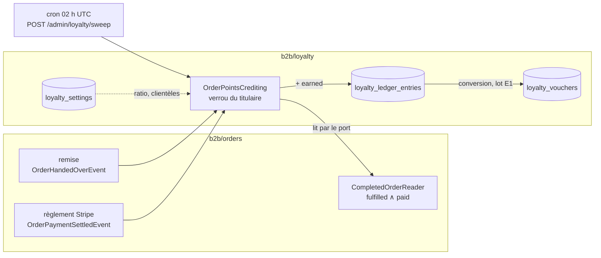
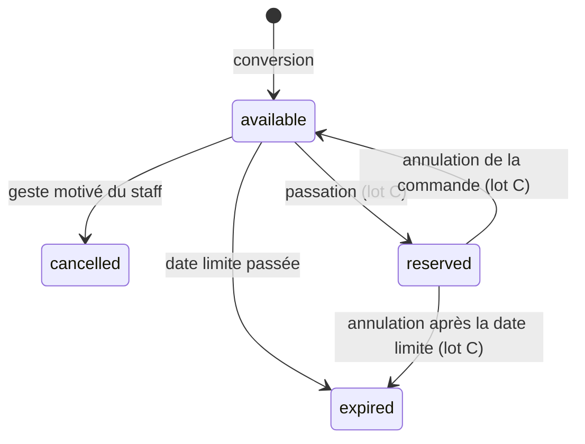

# Les points de fidélité

> État : **partiellement implémenté** au 2026-09-26. Le programme se **gagne**
> et se **règle**, mais ne se **convertit** ni ne s'**utilise** encore (§8).
> Écrit à l'affirmative le 2026-09-26, chaque phrase confrontée au code ce
> jour-là. Commits : `1057ecfa3` (grand livre, bons, réglage),
> `b862ee9fb` (écran), `9f1ebf2c8` (crédit), `2fe402b2e` (passage de nuit).
>
> L'histoire — la demande, les deux contradictions de `vitruve`, les réponses de
> Hugo — est dans [`plan-points-de-fidelite.md`](plan-points-de-fidelite.md).
> Ce document dit ce que le code **fait**.

## 1. En une phrase

Une commande **remise et payée** crédite ses points à son **titulaire**, à
raison d'un point par centime de marchandises **hors taxe**. Les points se convertissent
en **bons de fidélité** par paliers entiers, à un ratio réglé dans
**Comptabilité › Fidélité**. Tant que ce réglage n'est pas enregistré, le
programme est **fermé** : rien ne se gagne, et rien ne se convertit.

## 2. Le vocabulaire

| Terme                   | Ce que c'est                                                                                          | Dans le code                         |
| ----------------------- | ----------------------------------------------------------------------------------------------------- | ------------------------------------ |
| **titulaire**           | à qui appartiennent les points : la **société** pour une commande pro, la **personne** pour le public | `LoyaltyHolder` (`company` / `user`) |
| **grand livre**         | la suite des mouvements de points d'un titulaire ; on n'y efface rien                                 | `loyalty_ledger_entries`             |
| **solde**               | la **somme** du grand livre — aucune colonne ne la stocke                                             | `LoyaltyAccount`                     |
| **palier**              | l'unité de conversion : `pointsPerStep` points valent `stepValueCents` centimes **HT**                | `LoyaltyRatio`                       |
| **bon de fidélité**     | un montant fixe en euros, issu d'une conversion, qui fige son ratio                                   | `LoyaltyVoucher`                     |
| **commande définitive** | une commande à la fois `fulfilled` et `paid`                                                          | `CompletedOrderReader`               |

## 3. Le stockage

Trois tables du schéma `public` (`prisma/schema/public/loyalty.prisma`,
migration `20260926160000_la_fidelite`, purement additive).

### `loyalty_settings` — le réglage, une ligne

| Colonne                             | Sens                                                                           |
| ----------------------------------- | ------------------------------------------------------------------------------ |
| `id`                                | toujours `'default'` (`CHECK`)                                                 |
| `points_per_step`                   | points d'un palier, entier > 0                                                 |
| `step_value_cents`                  | valeur **HT** d'un palier, entier > 0                                          |
| `open_to_public`                    | la clientèle publique gagne et convertit                                       |
| `open_to_pro`                       | la clientèle pro — **refusée à l'écriture** (§7)                               |
| `voucher_validity_days`             | durée de validité d'un bon (365 au premier enregistrement proposé par l'écran) |
| `updated_at`, `updated_by_staff_id` | qui a posé le réglage, et quand                                                |

**Aucune ligne n'est semée.** L'absence de ligne _est_ l'état « programme
fermé » : aucune valeur par défaut n'est inventée.

### `loyalty_ledger_entries` — le grand livre

| Colonne                   | Sens                                                           |
| ------------------------- | -------------------------------------------------------------- |
| `company_id` / `user_id`  | le titulaire — **exactement un des deux** (`CHECK`)            |
| `kind`                    | `earned`, `converted` ou `adjusted`                            |
| `points`                  | entier **signé**                                               |
| `order_id`                | la commande d'un gain — identifiant opaque, sans clé étrangère |
| `voucher_id`              | le bon d'une conversion ou d'une annulation                    |
| `actor_user_id`           | la personne qui a converti (`ON DELETE SET NULL`)              |
| `staff_user_id`, `reason` | l'auteur et le motif d'un ajustement                           |

| `kind`      | Signe | Porte obligatoirement                | Unique par                   |
| ----------- | ----- | ------------------------------------ | ---------------------------- |
| `earned`    | > 0   | `order_id`                           | `order_id`                   |
| `converted` | < 0   | `voucher_id`                         | `voucher_id`                 |
| `adjusted`  | ≠ 0   | `staff_user_id` et un motif non vide | `voucher_id` si lié à un bon |

Les formes et les unicités sont des `CHECK` et des index partiels : une ligne
mal formée, ou un second crédit pour une même commande, est refusée par la
base, pas seulement par le code.

### `loyalty_vouchers` — les bons

Le titulaire (même `CHECK`), `value_cents`, `points_cost`, le **ratio figé**
(`ratio_points_per_step`, `ratio_step_value_cents`), `issued_at`,
`expires_at`, `status`, `remainder_settled_at` (lot C : reliquat soldé), et les traces de fin de vie (`expired_at`,
`cancelled_at`, `cancelled_by_staff_id`, `cancellation_reason`).

- **Paliers entiers** (`CHECK`) : `value_cents` vaut exactement
  `points_cost / ratio_points_per_step × ratio_step_value_cents`. Seul un
  reliquat (`parent_voucher_id`, lot C) en est exempté.
- `expires_at > issued_at` ; une annulation porte son instant, son auteur et
  son motif ; une expiration porte son instant.

### Les clés étrangères

`company_id` et `user_id` sont en **`ON DELETE RESTRICT`** : un grand livre ne
s'efface pas. Aucun chemin applicatif ne supprime une société ou une personne
(vérifié le 2026-09-26). Les scripts de dev qui le font (`prisma/clone-dev.ts`)
vident d'abord les deux tables de fidélité, par un seul `TRUNCATE`.

## 4. Gagner des points

### La règle

`earningFor` (`domain/services/order-earning.ts`), une fonction pure :

| Situation                                            | Résultat                             |
| ---------------------------------------------------- | ------------------------------------ |
| aucun réglage                                        | rien — `program_closed`              |
| commande `pro`, `company_id` nul (société supprimée) | rien — `company_missing`             |
| commande `public` passée **sans compte** (invité)    | rien — `guest_buyer`                 |
| clientèle fermée au réglage                          | rien — `clientele_closed`            |
| assiette ≤ 0                                         | rien — `empty_basis`                 |
| sinon                                                | **assiette × 1** points au titulaire |

- **L'assiette** vaut `subtotalCents − discountCents − voucherDiscountCents` :
  le **hors taxe** des marchandises, remise du point de retrait et bon de
  fidélité déduits (lot C, C6 tranché par Hugo le 2026-09-27). Ni la TVA — on ne rend pas
  en points ce qu'on reverse à l'État (Hugo, 2026-09-26) —, ni le port, ni la
  surtaxe. Une commande de 23,40 € HT rapporte 2 340 points.
- **Le titulaire** est `Order.companyId` pour `pro`, `Order.placedByUserId`
  pour `public`. Une `clientele` nulle (commandes d'avant ce champ) n'est
  jamais lue.
- **Un invité ne gagne rien** : `User.email` n'est pas unique, et ses points
  resteraient sur une fiche à laquelle personne ne peut se connecter.

### Quand : une commande définitive

Est définitive une commande `fulfilled` **et** `paymentStatus = paid`.
`not_required` **ne compte pas** : chez un pro, il veut dire « payé à terme »,
pas encaissé. Le port `CompletedOrderReader` (déclaré par `orders`) fait ce
filtre dans son `where`, et ne rend de l'identité de l'acheteur qu'un booléen
`buyerHasAccount`.

**Un seul chemin écrit `paid` sur une commande** (inventaire du 2026-09-26) :
le webhook Stripe `payment_intent.succeeded` → `ConfirmOrderPaymentHandler`
→ `markPaid`. Le comptoir n'écrit aucun règlement ; un lien de paiement libre
ne touche aucune commande.

### Comment : trois déclencheurs, une écriture

| Déclencheur                                    | Fichier                                       | Rôle                                |
| ---------------------------------------------- | --------------------------------------------- | ----------------------------------- |
| la remise (`OrderHandedOverEvent` du commerce) | `credit-points-on-handover.handler.ts`        | au fil de l'eau                     |
| le règlement (`OrderPaymentSettledEvent`)      | `credit-points-on-payment-settled.handler.ts` | au fil de l'eau                     |
| le rattrapage de nuit                          | `credit-pending-order-points.handler.ts`      | écrit ce que les abonnés ont manqué |

Les deux abonnés relisent l'état de la commande : le crédit n'a donc lieu
qu'au **second** des deux faits, quel que soit leur ordre. Ils passent par
`BackgroundWork`, qui **avale leurs échecs** : c'est pourquoi le rattrapage
existe. Il parcourt les commandes définitives par lots de 200, une
transaction par commande, et ne fait rien si le programme est fermé.

**L'écriture** (`OrderPointsCrediting.creditEarnedPoints`) :

1. prend le verrou du titulaire ;
2. relit, **sous ce verrou**, si la commande a déjà sa ligne `earned` ;
3. écrit la ligne et publie `loyalty.points_earned`, dans la même unité de
   travail.

Deux passages concurrents sur la même commande s'attendent, et le second ne
trouve rien à faire. L'index unique `(order_id) WHERE kind = 'earned'` est le
filet en base.

## 5. Convertir en bon de fidélité

`ConvertLoyaltyPointsCommand` est exposée au particulier depuis le lot E1
(2026-09-27) par `POST me/loyalty/conversions`, corps
`{ steps, expectedBalancePoints }` ; le staff ne convertit pas.

**Côté client (lot E1)** — seulement un particulier **connecté**, dans son
espace personnel (`@ActingCompany()` nul) :

| Surface                       | Ce qu'elle fait                                                                                                                                                                                                                   |
| ----------------------------- | --------------------------------------------------------------------------------------------------------------------------------------------------------------------------------------------------------------------------------- |
| `GET me/loyalty`              | `{ open: false }` sans réglage, programme fermé au public, ou espace société ; sinon solde, palier, paliers convertibles, bons, 20 dernières lignes                                                                               |
| `POST me/loyalty/conversions` | 403 depuis un espace société ; **409 `loyalty.balance_changed`** si le solde relu sous le verrou n'est pas celui que l'écran affichait — deux clics ne font qu'un bon                                                             |
| `POST shop/quote/mine`        | `loyaltyPointsToEarn`, calculé par `earningFor` (la fonction du crédit) ; `null` fermé ou en société ; absent du devis anonyme                                                                                                    |
| boutique, `/ma-fidelite`      | entrée à part (Hugo) ; lien de navigation seulement en espace personnel, programme ouvert ; un espace société est renvoyé à son accueil (`personalWorkspaceGuard`) — **aucune fidélité en pro avant le lot F** (Hugo, 2026-09-27) |
| boutique, décompte du panier  | « Vous gagnerez N points » si `loyaltyPointsToEarn > 0`                                                                                                                                                                           |

L'historique rend une **nature** de ligne et un numéro de commande, jamais le
motif d'un ajustement staff, écrit pour le staff.

1. **Qui peut** (`PrismaLoyaltyConversionGate`) :
   - pour une personne : elle-même, au statut `active` ;
   - pour une société : toute personne `active` qui y est rattachée, quel que
     soit son rôle, puisque le droit de commander n'a pas de rôle.
2. **Le verrou** : `pg_advisory_xact_lock` sur
   `loyalty.ledger:company:<id>` ou `loyalty.ledger:user:<id>`. L'espace de
   noms est propre, et le préfixe empêche un identifiant de société et un
   identifiant de personne de partager un verrou. Deux personnes d'une même
   société qui convertissent en même temps s'attendent.
3. **Sous le verrou**, le solde est relu, puis le bon et la ligne `converted`
   sont écrits dans la même transaction. **Le solde ne descend jamais sous
   zéro.**
4. **Le bon fige** son montant, son coût en points, son ratio, et sa date
   limite (`issued_at + voucher_validity_days`).

Changer le ratio ne modifie ni un bon émis, ni un nombre de points. Cela change
seulement ce que vaudront les **prochaines** conversions.

## 6. La vie d'un bon

| État        | Aujourd'hui                                                                                                                                                                                             |
| ----------- | ------------------------------------------------------------------------------------------------------------------------------------------------------------------------------------------------------- |
| `available` | le seul état d'entrée                                                                                                                                                                                   |
| `expired`   | **lu à l'horloge** : un bon échu se lit expiré même si la base dit encore `available`. La nuit l'écrit (`ExpireLoyaltyVouchersCommand`, fait `loyalty.voucher_expired`).                                |
| `cancelled` | par le staff, avec un motif, **seulement** si le bon est disponible et non échu. Ses points reviennent par une ligne `adjusted` liée au bon, une seule fois (index unique).                             |
| `reserved`  | engagé sur une commande vivante (lot C). **N'expire pas**, ne s'annule pas par le staff (`LoyaltyVoucherReservedError`, 409). Faute d'état `used`, l'écran dit « utilisé sur … » en lisant la commande. |

### Le bon sur la commande (lot C, bâti le 2026-09-27 — non commité à l'écriture)

- **Qui** : un client connecté qui commande pour lui-même (`POST /orders`,
  champ `voucherId` facultatif). Refusé sur une commande de société
  (`orders.voucher_not_for_company_order`, 400) ; absent des contrats de
  l'invité et de la saisie staff.
- **Le calcul** : la remise du point d'abord, le bon ensuite, plafonné au HT
  de marchandises restant (`voucherImputationCents`). `computeOrderTotals`
  passe `discountCents + voucherDiscountCents` à `ventilateVat`, dont la
  signature ne change pas. La commande garde `voucher_discount_cents` et
  `loyalty_voucher_id` à part de la remise.
- **La réservation** : lue d'abord (`LoyaltyVoucherQuoteReader`, sans verrou),
  puis réservée DANS la transaction de passation, sous le verrou du
  titulaire, avant l'écriture de la commande. Une course perdue rend 409, ni
  commande ni clé ; l'intention Stripe déjà créée est annulée. Un index
  unique partiel (`WHERE status <> 'cancelled'`) interdit deux commandes
  vivantes sur un même bon.
- **La libération** : `markAbandoned` (branche publique) et `failAtClosing`,
  quand elles écrivent `cancelled`, libèrent le bon dans la même transaction
  — `available`, ou `expired` passé sa date limite.
- **Le reliquat** : un nouveau bon, même titulaire, même date limite, zéro
  point, `parent_voucher_id`. Émis à la passation si la commande n'a rien à
  encaisser (`not_required`), sinon par le passage de nuit une fois la
  commande `paid`. Idempotent par l'unicité de `parent_voucher_id`.
- **Les ports** : `orders` déclare `LoyaltyVoucherQuoteReader`,
  `LoyaltyVoucherRedemption` et `VoucherOrderReader` ; `loyalty` implémente les
  deux premiers, `apps/lfd-api/src/appBootstrap/loyalty-voucher.module.ts` les relie.
- **L'assiette des points** : `sous-total − remise − bon` (C6, Hugo).

**Le solde du reliquat est une marque** (`remainder_settled_at`, décision du
2026-09-27) : posée sur le bon d'origine, sous le verrou du titulaire, quand
sa commande devient définitive — reliquat émis, reliquat **éteint** si le bon
est échu entre le paiement et la nuit (fait `loyalty.voucher_remainder_lapsed`,
une seule fois), ou rien à émettre. Le passage de nuit ne relit que les bons
`reserved` non soldés (index partiel) : un bon soldé n'est jamais relu.

## 7. Le back-office

**Comptabilité › Fidélité**
(`apps/lfd-backoffice-frontend/src/app/comptabilite/fidelite/`), sous le droit
`b2b_accounting` : la lecture pour voir, l'écriture pour agir.

| Onglet               | Ce qu'on y fait                                                                                                                                                                                                        |
| -------------------- | ---------------------------------------------------------------------------------------------------------------------------------------------------------------------------------------------------------------------- |
| **Réglage**          | poser le ratio (valeur saisie en euros, envoyée en centimes entiers), les clientèles, la validité. « Programme fermé » tant que rien n'est enregistré. Changer le ratio d'un programme réglé demande une confirmation. |
| **Soldes**           | le solde de chaque titulaire, et un ajustement ± motivé                                                                                                                                                                |
| **Bons de fidélité** | chaque bon avec son état et son ratio figé, et l'annulation motivée d'un bon disponible                                                                                                                                |

Les routes (`admin/accounting/loyalty`, `@AdminSurface("b2b_accounting")`) :

| Verbe  | Chemin                | Commande ou requête           |
| ------ | --------------------- | ----------------------------- |
| `GET`  | `settings`            | `GetLoyaltySettingsQuery`     |
| `PUT`  | `settings`            | `SetLoyaltySettingsCommand`   |
| `GET`  | `balances`            | `ListLoyaltyBalancesQuery`    |
| `GET`  | `vouchers`            | `ListLoyaltyVouchersQuery`    |
| `POST` | `adjustments`         | `AdjustLoyaltyPointsCommand`  |
| `POST` | `vouchers/:id/cancel` | `CancelLoyaltyVoucherCommand` |

🔴 **La clientèle pro ne s'ouvre pas.** L'écran n'offre pas la case, et
`SetLoyaltySettingsHandler` refuse `openToPro` (`LoyaltyProNotYetOpenableError`,
409). Aucun signal ne dit aujourd'hui qu'une facture à terme est réglée. Le
crédit d'une société, lui, est déjà écrit et éprouvé : il n'attend que ce
signal.

⚠️ Un ajustement ne vise qu'un titulaire déjà présent dans les soldes. L'API ne
sert aucune recherche de société ou de personne.

## 8. Ce qui n'est pas bâti

| Lot    | Ce qu'il fera                                                       | Ce qu'il attend              |
| ------ | ------------------------------------------------------------------- | ---------------------------- |
| **C**  | ✅ bâti le 2026-09-27 (§6) — reste la décision sur le reliquat échu | —                            |
| **E1** | ✅ bâti le 2026-09-27 (§5)                                          | —                            |
| **E2** | dans la boutique : utiliser un bon au paiement                      | le lot C                     |
| **F**  | ouvrir aux pros                                                     | un signal « facture réglée » |

Les décisions déjà prises pour ces lots sont écrites dans le plan : bon plus
gros que le panier → **reliquat**, émis quand la commande devient définitive et
gardant la date limite du bon d'origine ; un bon n'est libéré **que** par
l'annulation, jamais par un refus de paiement, puisqu'une commande refusée se
reprend.

### La TVA du bon : l'état de la question

| Traitement            | Effet sur la TVA                  | Ce que le code devra faire                                                     |
| --------------------- | --------------------------------- | ------------------------------------------------------------------------------ |
| **rabais**            | réduit la base, ventilée par taux | la valeur du bon, déjà HT, entre telle quelle comme remise dans `ventilateVat` |
| **moyen de paiement** | TVA sur le prix plein             | un second règlement à côté de Stripe, et un reste à payer                      |

Un bon **offert** est d'ordinaire traité comme un rabais ; un bon **vendu**
comme un moyen de paiement. Les nôtres ne sont jamais vendus.

🔴 **Tranché par Hugo le 2026-09-27 : le bon de fidélité est un rabais.** « je
dis le bon est une remise ». La question au cabinet reste posée ; si sa
réponse contredisait ce choix, c'est avant la première facture émise avec un
bon qu'il faudrait le savoir, puisque le choix est irréversible pour elles.

**Le bon vaut un montant hors taxe** (Hugo, 2026-09-26), dans la même unité
que l'assiette du gain : un point coûte ce qu'il a rapporté. En rabais, il
entre donc tel quel dans `ventilateVat`, qui le retire au prorata du poids HT
de chaque taux avec un arrondi par taux. Aucune conversion depuis le TTC n'est
nécessaire. Le client y gagne la TVA en plus : un bon de 5 € HT baisse son
total de 5,28 € sur de la pâtisserie à 5,5 %, et de 6 € sur un article à 20 %.
L'écran de paiement devra donc afficher la **baisse réelle** de son total, pas
les 5 € HT.

### Bon de fidélité ≠ carte cadeau

La boutique vendra aussi des **cartes cadeaux** (Hugo, 2026-09-26). Ce sont
deux objets distincts, avec deux régimes, et ils ne partagent **ni table, ni
code, ni mot** :

|                 | **Bon de fidélité** (ce contexte)      | **Carte cadeau** (chantier à ouvrir)                                                           |
| --------------- | -------------------------------------- | ---------------------------------------------------------------------------------------------- |
| Origine         | **offert**, né de points               | **vendu** au client                                                                            |
| Valeur          | un montant **HT**                      | un montant **TTC** : un moyen de paiement n'a pas de HT                                        |
| Sur la commande | une **remise** : réduit la base de TVA | un **règlement** : paie une partie du TTC, ne touche pas la TVA                                |
| TVA             | à l'utilisation, sur le prix remisé    | bon à usages multiples (5,5 % et 20 %) : due à l'utilisation, pas à la vente — **à confirmer** |
| Code            | `b2b/loyalty/`, `LoyaltyVoucher`       | son propre contexte ; jamais `LoyaltyVoucher`                                                  |

🔴 **« Bon d'achat » n'est plus employé** : le mot aurait désigné les deux. On
dit « bon de fidélité » et « carte cadeau ».

⚠️ Les cartes cadeaux demanderont de toute façon un **second moyen de
paiement** à côté de Stripe, avec un reste à payer. Le coût de construction ne
départage donc plus les traitements A et B du bon de fidélité : seule la réponse
fiscale le fait.

La question complète, posée au cabinet, est rangée dans
[`question-cabinet-fidelite-et-cartes-cadeaux.md`](question-cabinet-fidelite-et-cartes-cadeaux.md).

## 9. Le journal

| Fait                               | Quand                                                                        |
| ---------------------------------- | ---------------------------------------------------------------------------- |
| `loyalty_settings.set`             | le réglage change (un réglage identique n'écrit rien)                        |
| `loyalty.points_earned`            | une commande définitive crédite                                              |
| `loyalty.points_adjusted`          | un ajustement du staff                                                       |
| `loyalty.voucher_issued`           | une conversion                                                               |
| `loyalty.voucher_expired`          | la nuit écrit une expiration                                                 |
| `loyalty.voucher_cancelled`        | le staff annule un bon                                                       |
| `loyalty.voucher_remainder_issued` | le reliquat d'un bon consommé est émis (lot C)                               |
| `loyalty.voucher_remainder_lapsed` | un reliquat s'éteint, bon échu avant que sa commande soit définitive (lot C) |

Ils se rangent sous la comptabilité dans le journal. `loyalty` est une zone
d'argent pour `lint:journal-tracked` : tout gestionnaire doit tracer sous
unité de travail.

## 10. Le passage de nuit

Chaque nuit à **02 h UTC** (`0 2 * * *` dans `apps/lfd-api/wrangler.jsonc`,
recopié à l'identique dans `LOYALTY_SWEEP_CRON`, `container/worker.ts`), le
Worker appelle `POST /admin/loyalty/sweep` avec le jeton du recompute
(`RecomputeGuard`). La route lance le rattrapage des crédits, puis
l'expiration des bons, puis le rattrapage des bons engagés (lot C : reliquat
des commandes payées, cloche `loyalty.voucher_stalled` pour un bon engagé sur
une commande ni payée ni annulée passé son jour de service — sans le libérer),
et rend `{scanned, credited, expired, vouchers}`.

⚠️ **Le rattrapage reparcourt toutes les commandes définitives** à chaque nuit,
en ne lisant que leurs identifiants. Son coût grandit avec l'historique.
⚠️ **Le branchement n'est éprouvé par aucun test** : `worker.ts` importe le
runtime Cloudflare. Son premier passage en production en sera la preuve.

## 11. Où c'est éprouvé

| Fichier                                                         | Ce qu'il prouve                                                                                                                                                         |
| --------------------------------------------------------------- | ----------------------------------------------------------------------------------------------------------------------------------------------------------------------- |
| `src/b2b/loyalty/domain/**/__tests__/`                          | ratio, titulaire, motif, grand livre, bon, règle de gain                                                                                                                |
| `src/b2b/loyalty/application/commands/__tests__/`               | chaque commande avec ses ports doublés, dont le refus d'ouvrir les pros                                                                                                 |
| `test/loyalty.e2e-spec.ts`                                      | deux conversions concurrentes (une seule passe), `CHECK` du titulaire, paliers entiers, programme fermé, annulation qui recrédite une seule fois, journal               |
| `test/loyalty-earning.e2e-spec.ts`                              | crédit dans les deux ordres, jamais deux fois, `not_required`, `pending`, invité, société disparue, programme fermé, port et surtaxe exclus, rattrapage, 401 sans jeton |
| `apps/lfd-backoffice-frontend/src/app/comptabilite/fidelite/**` | l'écran : réglage, soldes, bons, lecture seule sans le droit d'écriture                                                                                                 |
