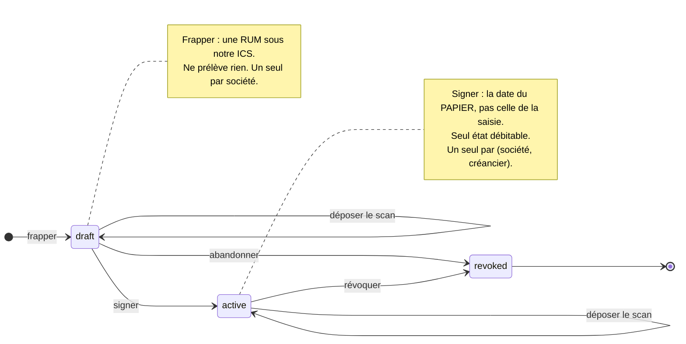
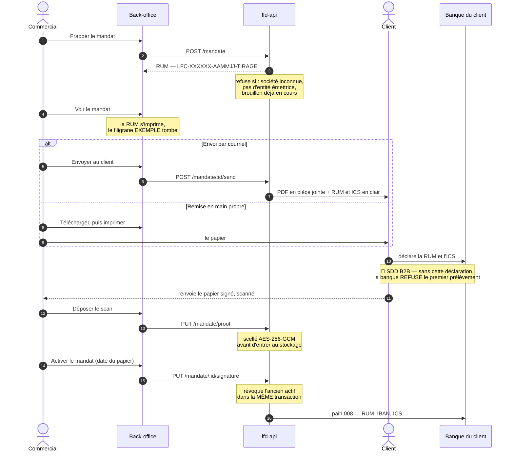

# Prélèvement SEPA — l'état des lieux, l'objectif, et ce qui manque

> **Document unique, écrit le 2026-09-12, et remis à jour le soir même.** La
> tranche du RIB client a livré dans la journée ce que plusieurs de ses lignes
> donnaient pour absent : le chiffrement au champ, le coffre du RIB, le BIC
> créancier et l'aperçu nominatif du mandat. Ces lignes sont passées à
> l'affirmative, chacune vérifiée dans le code plutôt que d'après le plan de la
> tranche — une tranche livrée n'est pas une tranche entière, et deux de ses
> promesses ne sont toujours pas branchées.
> Il remplace et supprime les trois
> qui se partageaient le sujet : le socle Stripe, la conception du prélèvement
> direct, et le format du fichier bancaire. Les lire dans l'ordre demandait de
> savoir lequel était périmé, et ce savoir-là ne se transmet pas.
>
> **Ce qui a été vérifié dans le code pour l'écrire** est marqué _(vérifié le
> 2026-09-12)_. Le reste est repris des trois documents d'origine, y compris
> leurs propres mises en garde. La dernière section dit ce qui n'a **pas** été
> vérifié — et c'est la section la plus importante du document.

---

## 1. L'objectif, en une page

**Encaisser par prélèvement une clientèle qui ne saisira jamais rien
elle-même**, sous notre propre identité de créancier, sans intermédiaire qui
prenne une commission sur chaque euro.

Le portefeuille repris paie par prélèvement, sur des mandats déjà signés, et
n'ouvrira jamais un navigateur pour le redire. Ce sont les commerciaux qui
reprennent les coordonnées.

### Ce qu'on doit pouvoir faire

Dans l'ordre du geste réel, et c'est cette liste qui fait foi :

| #   | Ce qu'on doit pouvoir faire                                                                                | État                                                                                                                                   |
| --- | ---------------------------------------------------------------------------------------------------------- | -------------------------------------------------------------------------------------------------------------------------------------- |
| 1   | Déclarer l'**entité qui encaisse** — raison sociale, ICS, compte créancier, délai de pré-notification      | ✅ **fait**                                                                                                                            |
| 2   | **Produire le mandat prérempli** d'un client donné : notre bloc créancier ET le sien, avec sa RUM imprimée | 🟡 **les deux blocs sortent remplis** en aperçu ; il manque la RUM, donc la mention EXEMPLE reste                                      |
| 3   | **L'envoyer au client** pour qu'il le signe                                                                | ❌ aucun envoi ; le mailer sait joindre un PDF _(vérifié le 2026-09-12)_                                                               |
| 4   | **Recevoir le scan signé** et le ranger comme preuve                                                       | 🟡 la route existe, mais elle exige un mandat, donc Stripe                                                                             |
| 5   | Le mandat ne devient **actif que preuve déposée**                                                          | ❌ aucun agrégat ne sait activer un mandat                                                                                             |
| 6   | **Détenir l'IBAN** du client, chiffré, sans qu'il ressorte jamais                                          | ✅ **fait** le 2026-09-12 — `company_bank_accounts`, scellé en AES-256-GCM, et la lecture n'en rend que les quatre derniers caractères |
| 7   | Clore le mois, **sommer par société**, et sortir le **`pain.008`**                                         | 🟡 un brouillon inexécutable sort, avec le vrai bloc créancier et les vrais montants                                                   |
| 8   | **Déposer le lot** à la Caisse d'Épargne, à la main, et le garder tel quel                                 | ❌                                                                                                                                     |
| 9   | **Importer les retours** (`pain.002` / `camt.054`) et rendre une facture impayée                           | ❌                                                                                                                                     |

🔴 **Le point 2 commande les points 3 à 9.** Aujourd'hui la seule feuille
imprimable porte la mention **EXEMPLE en travers de la page**, et c'est
délibéré : _« une fiche vierge imprimée traîne sur un bureau ; sans marque, rien
ne la distingue d'un mandat prêt à signer, et une signature apposée dessus
créerait un mandat sans RUM — inutilisable, mais que le client croirait avoir
donné. »_ Il n'existe donc **aucun document qu'un client puisse valablement
signer**, et ce n'est pas un oubli : c'est un refus, qui tombera avec la RUM.

---

## 2. Où on en est vraiment — au 2026-09-12

### Ce qui tourne

| Quoi                                                                                          | Où                                                                  | Note                                                                                           |
| --------------------------------------------------------------------------------------------- | ------------------------------------------------------------------- | ---------------------------------------------------------------------------------------------- |
| **L'entité juridique émettrice** — ICS, compte créancier, mentions, délai de pré-notification | `src/b2b/accounting/`, écran Comptabilité › Entités juridiques      | Ouvert à l'écran le 2026-09-12 : une entité, ICS posé, « Peut encaisser »                      |
| **La fiche de mandat vierge** au modèle EPC/CFONB                                             | `accounting/domain/services/sepa-mandate-pdf.ts`                    | Déterministe, préremplie du bloc créancier, marquée EXEMPLE                                    |
| **Le brouillon `pain.008` + son audit CSV**                                                   | `accounting/domain/services/pain008.ts`, `pain008-audit.ts`         | Sortis le 2026-09-12 : XML 2 ko, CSV dont la somme des lignes égale le `CtrlSum`               |
| **Le RIB du client**, scellé au champ                                                         | `payments/infrastructure/`, écran Fiche client › Moyens de paiement | Posé le 2026-09-12 : AES-256-GCM, l'IBAN monte et ne redescend jamais                          |
| **L'aperçu nominatif du mandat** — les deux blocs remplis                                     | `GET /admin/companies/:id/mandate/preview.pdf`                      | Posé le 2026-09-12 ; toujours marqué EXEMPLE — voir le TODO                                    |
| **La frappe d'un mandat** — RUM sous notre ICS, état brouillon                                | `POST /admin/companies/:id/mandate`, bouton en fiche client         | Posée le 2026-09-12 au soir. `MintMandateHandler` appelle `Rum.mint`                           |
| **La signature d'un brouillon** — `draft` → `active`                                          | `PaymentMandate.sign()`                                             | Porte la date du PAPIER, refuse une date à venir et une seconde signature                      |
| **Le scan du mandat signé** — dépôt, scellement, relecture                                    | `PUT` et `GET /admin/companies/:id/mandate/proof`                   | Scellé AES-256-GCM en binaire ; le bouton « Récupérer » le ressort descellé                    |
| **Le `pain.008` alimenté** — RUM, IBAN du débiteur, BIC créancier                             | `pain008.ts` + port `DebtorMandateReader`                           | Le bandeau BROUILLON tombe quand chaque ligne porte son mandat, et pas avant                   |
| **Notre IBAN créancier, scellé**                                                              | `legal_entities.creditor_iban_sealed`                               | Palier 1 sur 3 ; la colonne claire subsiste comme retour arrière                               |
| **Les réglages de mandat de l'entité** — description du contrat, type de paiement             | `LegalEntity`, écran Entités juridiques                             | Zones 20 et 12 du modèle EPC, posées une fois pour tous les mandats qu'elle émet               |
| **Le logo imprimé sur les mandats**                                                           | `POST /admin/accounting/legal-entities/:id/logo`                    | Import à l'écran posé le 2026-09-12 ; sans lui la cellule reste vide et le mandat reste valide |
| **Le mandat Stripe** — enregistrer, prouver, révoquer                                         | `src/b2b/payments/`                                                 | **Gelé** : c'est le mécanisme qu'on quitte                                                     |

### Ce qui a été branché le 2026-09-12 au soir

✅ **La RUM est frappée et persistée.** `rum.ts` avait été écrit, testé, et
importé par personne pendant une journée. Il est importé par
`mint-mandate.handler.ts` _(vérifié : `grep -rl` ne rend plus que ce fichier et
le spec)_.

✅ **Le `pain.008` lit les vraies valeurs.** `MndtId` porte la RUM du mandat
actif, `DbtrAcct/Id/IBAN` l'IBAN descellé du client, `CdtrAgt` notre BIC.

⚠️ Ce paragraphe disait que les sentinelles `IBAN-INCONNU` et `MANDAT-INCONNU`
sortaient encore pour une ligne sans mandat. Elles ont disparu avec le lot par
schéma (2026-09-15) : une société sans mandat prélevable sort des deux fichiers
et le bandeau la nomme (`pain008.ts`, vérifié le 2026-09-15).

✅ **Les quatre blocages du cycle de vie sont levés** : `accepted_at`,
`stripe_customer_id` et `payment_method_id` sont nullable ; `save()` écrit
toutes les colonnes mutables ; trois index partiels tiennent l'unicité de
l'actif par (société, créancier), du brouillon par société, et de la RUM par
créancier _(vérifié en base)_.

La forme de la RUM, ses deux bornes et la raison de chacune vivent dans
[`rum.md`](rum.md), et **nulle part ailleurs**.

### Ce qui n'existe pas du tout

- **`DocumentStore` n'a pas de `delete`** — `save`, `read`, `readIfPresent`, et
  c'est tout _(vérifié le 2026-09-12)_. Tant qu'il ne l'a pas, toute promesse de
  purge est une phrase.
- **Aucun mandat en base** : zéro ligne en dev _(vérifié le 2026-09-12)_, et les
  documents d'origine affirment la même chose en production — **non revérifié
  ici**, voir §13.
- ✅ **Un formulaire B2B.** Le document imprimé était un mandat **CORE**
  pendant que le lot déclarait `B2B` _(constaté le 2026-09-13)_. Basculé le
  2026-09-14 : le formulaire est « interentreprises », sans remboursement, et
  lit la même constante que le lot. Voir le §4 et le TODO :
  [`todo-mandat-core-contre-b2b.md`](todo-mandat-core-contre-b2b.md).

✅ **Le mandat imprimable est livré le 2026-09-13** : `renderSepaMandatePdf`
prend une émission, la RUM s'imprime dans le peigne de 26, et le filigrane tombe
avec elle — commandés par le même paramètre, donc indissociables.

✅ **Quatre lignes ont quitté cette liste le 2026-09-12** : le chiffrement au
champ (`platform/crypto/`), le BIC de l'entité (`creditor_bic`), la frappe de la
RUM, et la relecture du scan déposé. Elles sont notées ici plutôt qu'effacées —
une absence qui disparaît sans trace se réaffirme de mémoire six semaines plus
tard.

---

## 3. Pourquoi il y a deux mécanismes

|                         | **Stripe** (2026-08-11)           | **Direct** (décidé le 2026-09-01, repris le 2026-09-10) |
| ----------------------- | --------------------------------- | ------------------------------------------------------- |
| Qui frappe la référence | Stripe                            | **nous**                                                |
| Qui détient l'IBAN      | Stripe                            | **nous**                                                |
| Qui est créancier       | Stripe                            | **nous**, sous notre ICS                                |
| L'encaissement est      | un appel d'API                    | **un lot déposé à la banque**                           |
| État                    | **gelé** — plus aucun mandat créé | la cible                                                |

🔴 **Le retournement de la décision B.** Le socle Stripe posait « aucune
coordonnée bancaire dans notre base », et c'était son meilleur argument : _« ce
qu'on achète à Stripe, c'est précisément de ne pas la détenir. »_ Émettre
nous-mêmes suppose l'inverse — **il n'y a pas de prélèvement direct sans IBAN
dans le `pain.008`**. Le prix de ce retournement est la §6.

**La carte reste chez Stripe**, et ce n'est pas à rouvrir : construire de
l'acquisition carte demanderait PCI DSS.

**Les mandats Stripe ne sont pas repris de force** : ils sont gelés, et le
discriminant `origin` prévu au modèle existe pour ça.

⚠️ **Le portefeuille Stripe est inexploitable pour un `pain.008`**, quel qu'en
soit le format : un mandat Stripe ne porte que `last4`, `bankCode` et `country`
— de quoi **reconnaître** un compte, jamais de quoi le débiter.

---

## 4. Le schéma retenu : SDD B2B — le papier et le fichier le déclarent tous deux

> ✅ **Basculé le 2026-09-14.** Jusque-là, le lot déclarait `B2B` pendant que le
> formulaire imprimé portait le texte CORE (« remboursé… dans les 8 semaines ») —
> constaté le 2026-09-13. Un débiteur signait donc un droit au remboursement que
> le schéma émis ne lui laissait pas.
>
> Désormais une seule constante du domaine comptable (`SEPA_SCHEME`) est lue par
> `pain008.ts` (`LclInstrm`) **et** par `sepa-mandate-pdf.ts`, et un test échoue
> si les deux divergent. Le formulaire porte « interentreprises », énonce
> l'absence de remboursement après débit, et demande de **déclarer le mandat à
> sa banque** avant le premier prélèvement.
>
> ⚠️ Deux points restent à confirmer avec la banque, écrits dans
> [`todo-mandat-core-contre-b2b.md`](todo-mandat-core-contre-b2b.md) :
> le libellé exact du modèle B2B qu'elle attend, et le retrait de la mention
> « 13 mois » (qui vise les opérations non autorisées, pas le remboursement).

|                                                      | SDD Core   | **SDD B2B** (retenu) |
| ---------------------------------------------------- | ---------- | -------------------- |
| Remboursement **sans motif** après encaissement      | 8 semaines | **aucun**            |
| Contestation d'une opération non autorisée           | 13 mois    | 13 mois              |
| Le débiteur enregistre le mandat auprès de sa banque | non        | **oui**              |
| Toutes les banques participent                       | oui        | **non**              |

⚠️ **Ce que le choix n'achète PAS.** B2B supprime le remboursement
discrétionnaire, pas les **R-transactions**. Reviennent toujours : provision
insuffisante, compte clos, mandat non enregistré chez la banque du débiteur,
opposition. Une facture peut donc redevenir impayée — plus rarement qu'en Core,
et pour des raisons qu'on peut nommer au client.

🔴 **Le point dur : un mandat signé n'est pas un mandat utilisable.** En B2B, le
débiteur doit faire la démarche auprès de sa propre banque, et **nous ne
l'apprenons qu'au premier rejet**. Deux conséquences :

- le mandat porte un fait distinct de son statut, `firstCollectionSettledAt` :
  tant qu'il est nul, l'écran dit « jamais encaissé : la banque du client a-t-elle
  enregistré le mandat ? » — il n'affiche pas un mandat vert ;
- **certains clients seront inéligibles** (banque non participante). Le
  portefeuille se scinde, et l'encaissement hors système reste un chemin normal.

---

## 5. Le mandat — le cycle, et qui fait quoi

⚠️ **Cette section décrivait un cycle VISÉ jusqu'au 2026-09-13**, dont chaque
flèche manquait. Elle décrit désormais ce qui tourne, et signale ce qui reste.

### Les états, et ce qui les fait changer



🔴 **`failed` existe dans l'enum et n'est produit par personne** : il venait de
Stripe. Aucun code ne le pose aujourd'hui _(vérifié le 2026-09-13)_.

⚠️ **`expired` n'existe pas.** Un mandat dort 36 mois sans prélèvement et devient
caduc par la norme — rien ne le détecte ici. C'est un balayage à écrire, pas un
calcul : un mandat caduc _calculé_ resterait `active` en base et bloquerait son
remplaçant sur l'index partiel.

### Le parcours, de la frappe au prélèvement



### Ce que le parcours ne dit pas, et qu'il faut savoir

**L'ordre des deux derniers gestes est libre.** Déposer le scan avant d'activer,
ou l'inverse : le dépôt vise `findAwaitingProof` — le brouillon s'il existe,
l'actif sinon — donc la pièce tombe sur le bon mandat dans les deux sens.

**Le mandat s'envoie tant qu'il est brouillon, et pas après.** Un mandat déjà
signé qu'on renverrait ferait circuler un second exemplaire de la même
référence, et c'est celui qui revient en dernier qui gagnerait.

**Le premier prélèvement ne part pas parce que nous sommes prêts.** Il part
quand la banque du client a enregistré le mandat — un geste que nous ne voyons
pas, et dont l'échec revient sous forme de rejet.

**La preuve, c'est le mandat signé — pas le RIB.** Le RIB donne des coordonnées,
pas un consentement. En contestation, la charge de la preuve est sur nous : 8
semaines sans justification, 13 mois si le débiteur conteste l'autorisation
elle-même.

> **Conséquence assumée.** Une société reprise sans mandat papier retrouvable est
> une société qu'on prélève **sans filet**. La fiche doit le dire — un mandat
> actif sans preuve s'affiche comme tel, pas comme un mandat normal.

---

## 6. L'IBAN : le prix du retournement

La promesse tenable, et c'est **celle-ci** et pas une autre : **l'IBAN n'est
jamais rendu par une API de lecture, ni rehydraté dans un agrégat.** Un mapper la
tient. (La première version du document d'origine promettait une fuite
« structurellement impossible » et se contredisait trois sections plus loin.)

**Le chemin d'écriture.** Sans l'iframe Stripe, l'IBAN est saisi au back-office et
traverse HTTP → Zod → handler. Donc : validation **mod-97** dans un value object,
dérivation de `last4` et du code banque à cet endroit, chiffrement **avant** toute
écriture, et exclusion explicite des journaux.

**Le coffre.** Chiffrement symétrique au champ, par un port `platform` à créer.
`keyVersion` stocké à côté du chiffré **dès la première ligne** : sans lui la
rotation devient impossible, et on ne la rétro-ajoute pas.

🔴 **Le fichier de lot est lui-même un secret.** Un `pain.008` contient quarante
IBAN en clair :

- il ne se télécharge pas comme une pièce jointe ordinaire — URL à durée de vie
  courte, geste tracé, jamais servi par la route de lecture des documents ;
- `DocumentStore` doit gagner un `delete`, sinon la purge n'a aucun mécanisme ;
- rétention propre au lot, **plus courte** que celle du mandat : le lot est un
  moyen, le mandat est une preuve.

---

## 7. Le fichier `pain.008`

Le message ISO 20022 qui **demande les prélèvements** — « PAIN » pour _PAyment
INitiation_, rien à voir avec le fournil. C'est la seule pièce du système dont
une erreur se paie en argent réel plutôt qu'en écran faux.

### 🔴 « Universel » n'existe pas

Le socle commun est `pain.008.001.02`, dans la déclinaison des _Implementation
Guidelines_ de l'EPC. Mais **chaque banque publie son guide par-dessus** : champs
exigés là où la norme les dit optionnels, taille de lot, nommage, canal de dépôt.
**Le guide de la Caisse d'Épargne fait foi, pas ce document.** Tant qu'on ne l'a
pas, tout ce qui suit est une hypothèse instruite.

### La structure

```
CstmrDrctDbtInitn
├── GrpHdr          le message  — un par fichier
└── PmtInf          LE LOT      — un par (SeqTp, ReqdColltnDt)
    └── DrctDbtTxInf  une ligne — un par DÉBITEUR, pas par commande
```

⚠️ **Un `DrctDbtTxInf` par débiteur.** Un client à trente commandes voit **une**
ligne sur son relevé et nous payons **un** frais d'opération. Les trente se
résument dans `RmtInf/Ustrd`, borné à 140 caractères — donc « Commandes du … au
… », pas une liste.

### Ce qu'on sait remplir — au 2026-09-12 au soir

| Champ XML                                          | Source                                                                                                             | État |
| -------------------------------------------------- | ------------------------------------------------------------------------------------------------------------------ | ---- |
| `Cdtr/Nm`, `CdtrAcct/Id/IBAN`, `CdtrSchmeId` (ICS) | `LegalEntity`                                                                                                      | ✅   |
| `CdtrAgt/FinInstnId/BIC`                           | `LegalEntity.creditorBic`                                                                                          | ✅   |
| `Dbtr/Nm`                                          | `Company`                                                                                                          | ✅   |
| `DbtrAcct/Id/IBAN`                                 | `CompanyBankAccount`, descellé à la lecture                                                                        | ✅   |
| `MndtRltdInf/MndtId`                               | `PaymentMandate.reference` (la RUM)                                                                                | ✅   |
| `MndtRltdInf/DtOfSgntr`                            | `PaymentMandate.acceptedAt` (date du papier), jour local de Paris — depuis le 2026-09-15                           | ✅   |
| `MndtRltdInf/AmdmntInd`                            | `false` en dur — amendement non écrit, **différé jusqu'à la réponse de la banque** (`plan-restes-du-mandat.md` §8) | ⚠️   |
| `ReqdColltnDt`, `InstdAmt`, `CtrlSum`, `NbOfTxs`   | le cycle, la somme du mois                                                                                         | ✅   |
| `EndToEndId`                                       | cycle + rang dans le lot                                                                                           | ✅   |

Les deux tables du débiteur appartiennent à `payments` : le lot les lit par le
port `DebtorMandateReader`, déclaré par la comptabilité et implémenté côté
`payments`. Une jointure SQL aurait franchi la frontière là où le graphe
d'imports ne la voit pas.

**Une entité sans BIC fait refuser le lot entier**, en la nommant
(`CreditorBicMissingError`). Elle peut toujours émettre des mandats : le papier
ne porte pas de BIC.

### Ce qui sort aujourd'hui

Le bandeau `BROUILLON — CE FICHIER NE PEUT PAS ETRE DEPOSE.` et le préfixe
`BROUILLON-` du `MsgId` sont **conditionnels** depuis le 2026-09-12 : ils
tombent quand **chaque** ligne porte son mandat, et une seule ligne incomplète
les garde pour tout le fichier.

🔴 **La règle derrière ce choix** : un lot partiellement vrai est plus dangereux
qu'un lot entièrement faux. Le second est refusé par le portail ; le premier
passe la relecture humaine.

Une société sans mandat prélevable — brouillon non signé, mandat révoqué, ou RIB
jamais recopié — **n'entre dans aucun des deux fichiers** : elle n'a pas de
schéma. Elle rend les deux indéposables, et le bandeau de chacun la nomme. Les
marqueurs `IBAN-INCONNU` et `MANDAT-INCONNU` qu'elle recevait avant le lot par
schéma (2026-09-15) n'existent plus.

La date de signature écrite est celle du **papier** (`accepted_at`), jamais celle
de la frappe. Un mandat actif la porte toujours : la contrainte
`payment_mandates_active_is_signed` le tient en base
(`20260915140000_mandat_actif_signe`), et le lecteur lève plutôt que d'en
inventer une.

Le CSV d'audit **relit le XML** au lieu de recalculer, et **masque l'IBAN du
débiteur** (`••••1234`) depuis le 2026-09-12 : un fichier qui recompose en clair
ce que la base scelle défait le coffre par la porte de service. Le masque ne
s'applique qu'à ce qui a la forme d'un IBAN — une sentinelle masquée se
déguiserait en compte.

⚠️ **La séquence suit le type de paiement DU MANDAT** : `RCUR` pour un mandat
`recurrent`, `OOFF` pour un `one_off` — la case cochée sur son papier, figée à
la frappe, avec un `PmtInf` par séquence présente. `FRST` n'est jamais écrit.
Le CFONB impose `FRST` et `OrgnlDbtrAgt = SMNDA` après un changement de banque
du débiteur : ni l'un ni l'autre n'est écrit, l'amendement est **différé jusqu'à
la réponse de la banque** (`plan-restes-du-mandat.md` §8), et l'historique des
changements de compte que la norme exige n'est pas conservé.

### Les pièges qui font rejeter un fichier

🔴 **Un `PmtInf` par couple (`SeqTp`, `ReqdColltnDt`).** Le piège classique : si
trois clients sont en `FRST` et quarante en `RCUR`, il faut plusieurs blocs. Un
seul bloc mélangé se fait rejeter **en masse** — et « en masse » veut dire :
aucun des quarante-trois n'est prélevé.

- **`CreDtTm` sans décalage horaire** — ni `Z`, ni `+02:00`. ⚠️ Notre cycle est
  en instants UTC bornés à minuit **local** : la conversion se fait à l'écriture,
  et c'est un endroit de plus où une lecture UTC ferait un fichier d'un autre jour.
- **`NbOfTxs` et `CtrlSum` justes aux DEUX niveaux**, deux décimales. Un centime
  d'écart rejette le message entier.
- **Jeu de caractères SEPA restreint**, aucun accent : « Val d'Isère » devient
  « Val d Isere ».
- **35 caractères** pour `MndtId` et `EndToEndId`. Notre RUM en fait 29 : il
  reste six caractères pour porter le cycle, la société et le numéro de
  tentative. **À vérifier avant de figer le format**, sinon la re-présentation
  devient intraçable dans le fichier de retour.
- **Le BIC du débiteur est facultatif** depuis 2016 — certaines banques
  l'exigent quand même.

---

## 8. Le cycle mensuel et la transmission

**Nous n'émettons PAS de facture** (décidé le 2026-09-10). Le comptable importe
nos commandes dans son logiciel et sort la facture mensuelle ; nous produisons la
**somme par société** et le **fichier de prélèvement**. La raison est la
facturation électronique : bâtir un émetteur aujourd'hui, c'est bâtir contre un
régime qui n'est pas stabilisé.

🔴 **Ce que ça inverse, et il faut le dire en face.** La règle posée était
« émettre avant d'encaisser, jamais l'inverse — un échec entre les deux laisserait
de l'argent prélevé sans document en face ». Cette décision fait exactement
l'inverse, par construction. Ce qu'on accepte : le pire cas devient **« argent
prélevé, aucun document en face »**, le geste de réparation n'est plus le nôtre,
et le client qui conteste se voit opposer un relevé **sans numéro de facture**.

**La transmission est manuelle et mensuelle**, et ce n'est pas un pis-aller : un
export XML au dernier jour du mois, déposé par un humain dans le portail de la
Caisse d'Épargne. Le canal automatisé (EBICS, SFTP) est une démarche, pas du
code, et le mettre sur le chemin critique retarderait tout le reste.

Deux conséquences que le reste doit respecter :

- **le lot n'est pas un fichier téléchargé, c'est un fait daté.** Ce qui part
  est archivé tel quel : le jour où une ligne est contestée, la question est
  « qu'avons-nous déposé le 31 », pas « que recalculerions-nous aujourd'hui » ;
- **un dépôt manuel se manque.** Le système doit pouvoir dire « le lot de ce mois
  n'est jamais parti » sans que ça ressemble à un lot en cours.

**Chaque échéance doit être pré-notifiée** au débiteur, montant et date, avant le
débit. C'est une **obligation**, pas un confort : sans elle, le prélèvement est
contestable.

---

## 9. Les invariants, et par quoi ils sont tenus

| Règle                                                 | Tenue par                                                     |
| ----------------------------------------------------- | ------------------------------------------------------------- |
| Au plus une instruction vivante par facture           | `UNIQUE (invoice_id) WHERE status <> 'returned'`              |
| Une commande jamais facturée deux fois                | table de jonction, `UNIQUE (order_id)`                        |
| Une RUM unique chez un créancier                      | `UNIQUE (creditor_id, rum)`                                   |
| Un seul mandat actif par société **et par créancier** | index partiel, à étendre                                      |
| Pas de prélèvement avant la date annoncée             | l'agrégat refuse l'instruction                                |
| Pas de preuve signée ⇒ pas d'actif                    | l'agrégat (§10 du doc d'origine : la base ne peut pas encore) |
| Mandat dormant > 36 mois ⇒ caduc                      | statut `expired`, posé par balayage — **pas un calcul**       |
| L'IBAN n'est jamais rendu par une API                 | le mapper                                                     |

**Pourquoi la caducité est un statut et pas un calcul** : un mandat caduc
_calculé_ reste `active` en base, donc occupe le slot de l'index partiel et
**bloque l'enregistrement de son remplaçant**.

**Les faits à journaliser**, parce que ce sont les actes les plus opposables du
système et qu'aucune porte ne le rattrapera : `mandate.drafted` ·
`mandate.activated` · `mandate.revoked` · `mandate.expired` · `batch.emitted` ·
`collection.settled` · `collection.returned` (avec son code motif) ·
`invoice.issued` · `invoice.paid`. Deux ans plus tard, « sur quelle autorisation
avez-vous prélevé, et qu'a répondu la banque » doit se **lire**, pas se
reconstituer.

---

## 10. Les objections bloquantes — trois ouvertes, une close

La conception a été contredite trois fois. **L'objection 2 est close depuis le
2026-09-12** ; les trois autres restent ouvertes et **situent** le blocage
plutôt que de l'effacer.

| Objection                                        | Bloque                | État |
| ------------------------------------------------ | --------------------- | ---- |
| 1 — l'index de libération ne libère pas assez    | le lot et ses retours | ❌   |
| 2 — `(company_id, creditor_id)` vide l'invariant | —                     | ✅   |
| 3 — la porte du crédit est circulaire            | l'octroi du mensuel   | ❌   |
| 4 — le fait publié désigne le mauvais mécanisme  | le lot et ses retours | ❌   |

✅ **L'objection 2 est close par l'expression de l'index, pas par un `NOT NULL`.**
`UNIQUE (company_id, COALESCE(creditor_id, 'LEGACY')) WHERE status = 'active'` :
les mandats sans émetteur connu tombent tous sur la même valeur de repli et se
heurtent donc entre eux. La colonne reste nullable, ce qui garde la place d'une
reprise de portefeuille — des RUM émises sous l'ICS d'un autre créancier
_(vérifié en base le 2026-09-12)_.

1. **L'index `UNIQUE (invoice_id) WHERE status <> 'returned'` ne libère pas
   assez.** Un rejet avant règlement, un lot rejeté en bloc, un dépôt manqué
   laissent l'instruction en attente pour toujours, donc la facture verrouillée.
   Il manque un statut « morte sans règlement », et l'index doit l'exclure aussi.
2. **`(company_id, creditor_id)` vide l'invariant qu'il prétend étendre.** Le
   `creditor_id` serait nullable (les mandats Stripe n'en ont pas), et Postgres
   traite les `NULL` comme distincts : deux mandats Stripe actifs sur la même
   société passeraient.
3. **La porte du crédit est circulaire** : exiger un premier encaissement réglé
   pour accorder le mensuel, quand il faut le mensuel pour prélever — jamais
   satisfiable pour un client neuf.
4. **Le fait publié désigne le mauvais mécanisme.** L'`EventBus` en mémoire n'est
   ni transactionnel ni rejouable : un abonné qui échoue sur `collection.settled`
   = argent encaissé, facture jamais payée, aucune trace. Il faut un import de
   retour **idempotent et rejouable à la demande**, pas un bus.

---

## 11. Le découpage

| #         | Tranche                                                                                                                                                  | État                                                                                                           |
| --------- | -------------------------------------------------------------------------------------------------------------------------------------------------------- | -------------------------------------------------------------------------------------------------------------- |
| **1**     | **L'entité juridique** — agrégat, ICS, IBAN créancier, écran                                                                                             | ✅ **livrée** le 2026-09-10, vue à l'écran le 2026-09-12                                                       |
| **1 bis** | Les données manquantes de la facturation — TVA intracom exigée à l'activation, date de livraison effective, code unité au SKU                            | ⬜                                                                                                             |
| **2**     | **Le mandat direct** — `creditorId`, value objects `Rum` et `Iban`, coffre + port de chiffrement, frappe, transition vers `active`, balayage de caducité | 🟡 tout est livré le 2026-09-12 **sauf le balayage de caducité** (36 mois) : aucun statut `expired` n'est posé |
| **3**     | **Le document** — mandat prérempli, RUM et ICS imprimés ; dépôt du signé ⇒ actif                                                                         | 🟡 le dépôt, le scellement et la relecture du signé sont livrés ; **la RUM ne s'imprime pas** — c'est le TODO  |
| **4–6**   | L'agrégat facture, la persistance, le rendu — **périmés** par « nous n'émettons pas de facture » (§8)                                                    | ⛔                                                                                                             |
| **8**     | La clôture mensuelle et la pré-notification                                                                                                              | ⬜                                                                                                             |
| **9**     | **Le lot et ses retours** — `pain.008` valide, import `pain.002`/`camt.054`                                                                              | ❌ bloquée (objections 1 et 4)                                                                                 |
| **10**    | Le rapprochement (`camt.053`), encours par société                                                                                                       | ⬜                                                                                                             |
| **12**    | La porte du crédit                                                                                                                                       | ❌ bloquée (objection 3)                                                                                       |

⚠️ **Ne pas faire signer un mandat avant d'avoir l'ICS.** Le formulaire EPC le
porte imprimé ; un mandat signé sans lui est un mandat à refaire signer. _(L'ICS
est posé sur notre entité — vérifié à l'écran le 2026-09-12.)_

**T2 commence par détacher le modèle de Stripe**, pas par ajouter la RUM :
`PaymentMandate.stripeCustomerId` et `paymentMethodId` sont **NOT NULL**
_(vérifié le 2026-09-12)_. Un mandat que nous émettons n'a ni l'un ni l'autre —
la table ne peut pas le stocker.

**Ce qu'on ne touche pas** : le code Stripe reste, gelé — pas de `switch`, deux
intentions nommées, et le moteur de lot ne lira que les mandats directs. Et
`reference` ne devient pas `rum`, `bank_code` ne devient pas `bic` : deux
colonnes servies par un contrat que deux fronts lisent, un renommage se paierait
en trois déploiements pour un gain de vocabulaire.

---

## 12. Les questions qui bloquent du code

### À la Caisse d'Épargne — aucune ne se répond depuis le dépôt

🔴 **Une neuvième, ajoutée le 2026-09-12, et elle conditionne du code : la
mécanique exacte de l'AMENDEMENT de mandat.** Nous nous alignons sur la norme
plutôt que de faire resigner le client à chaque changement de banque. Donc :
quels champs exigez-vous, et distinguez-vous le changement de compte **dans la
même banque** du changement de banque ? Tout ce que nous en écrivons vient de la
norme telle que nous la connaissons, pas d'un guide en main.

1. **Quelle version** le portail accepte-t-il — `pain.008.001.02`, ou le
   `pain.008.001.08` du rulebook 2023 ? Et jusqu'à quand la première ?
2. **Votre guide d'implémentation** : quels champs exigez-vous que la norme dit
   optionnels ? Le BIC débiteur en particulier.
3. **Le délai de présentation** en SDD B2B : combien de jours ouvrés avant la
   date de règlement le fichier doit-il être déposé ?
4. **`FRST` ou `RCUR`** pour un premier prélèvement sous un mandat neuf ?
5. **Le dépôt** : quel canal, quel nommage, quelle taille maximale de lot, et
   **comment sait-on qu'il est arrivé** ?
6. **Les retours** : `pain.002` et/ou `camt.054` ? Sous quel délai, par quel canal ?
7. **Notre BIC créancier**, tout simplement.
8. **Le délai de pré-notification** : 14 jours est-il contractualisable au
   mandat, ou imposé ?

### 🔴 La dixième, ajoutée le 2026-09-12 : la SIGNATURE ÉLECTRONIQUE

**Elle ne bloque pas du code, elle décide s'il faut l'écrire.** Si un mandat peut
être signé électroniquement, tout le parcours « imprimer → signer → scanner →
déposer » disparaît — c'est-à-dire l'essentiel de ce qui reste à construire, et
le dépôt de scan que nous allions bâtir.

> Acceptez-vous un mandat SDD **B2B** signé électroniquement, et à quel niveau
> eIDAS — simple, avancée, qualifiée ? Le débiteur doit-il quand même déclarer la
> RUM et notre ICS à sa propre banque, et sous quelle forme ?

Ce que nous croyons savoir, **et qui n'a été vérifié dans aucun texte en main** :

- **eIDAS** (règlement UE 910/2014) distingue trois niveaux. Son article 25.1
  interdit de refuser une signature _au seul motif_ qu'elle est électronique ;
  son article 25.2 ne donne l'effet d'une signature manuscrite **qu'à la
  qualifiée**. Entre les deux, une signature est recevable mais sa valeur
  probante se discute : c'est à celui qui s'en prévaut de démontrer l'identité du
  signataire et l'intégrité de l'acte.
- **La banque ne voit jamais le mandat** — c'est le créancier qui le détient, et
  le formulaire EPC le dit lui-même. La vraie question n'est donc pas
  « l'acceptez-vous » mais « qu'est-ce qui tient le jour d'une contestation ».
- 🔴 **En B2B, le débiteur déclare le mandat à SA banque** avant le premier
  prélèvement. Sans cette déclaration, la banque du débiteur rejette, quelle que
  soit la qualité de la signature. Une signature électronique ne remplacerait
  donc que le geste du client sur le papier — pas cette démarche-là.
- Ce que la **convention de prélèvement** avec la Caisse d'Épargne autorise ne
  se déduit d'aucun texte. Certaines banques exigent contractuellement un mandat
  papier, ou imposent un niveau minimal.

#### Les trois branches, écrites ensemble

La question ci-dessus n'a pas deux issues mais **trois**, et elles sont posées
ici d'un coup pour qu'aucune ne se découvre après qu'on a bâti une autre.

| Branche                 | Ce qu'on bâtit                                     | Ce qu'on achète                 | Ordre de grandeur          |
| ----------------------- | -------------------------------------------------- | ------------------------------- | -------------------------- |
| **Papier**              | envoi du PDF, dépôt du scan, activation sur preuve | rien                            | 0 €                        |
| **Prestataire**         | un appel d'API, un webhook de retour               | le dossier de preuve d'un tiers | ~1 250 €/an pour l'API     |
| **Maison + horodatage** | l'acte de consentement et son scellement           | **l'horodatage seul**           | quelques centimes le jeton |

Les montants sont des **relevés publics du 2026-09-12**, pas des devis : l'offre
API de Yousign — en cours de bascule vers la marque Youtrust — affiche 104 €/mois
pour 500 signatures par an, et DocuSign ne propose plus aucun plan gratuit, ses
niveaux avancé et qualifié étant réservés aux offres sur devis. À notre volume —
**un mandat par ouverture de compte, qui vit ensuite des années** — c'est le
quota qui est absurde, pas le tarif : on paierait l'automatisation d'un geste
fait quelques fois par mois.

#### La branche maison, et la seule chose qu'elle ne peut pas se donner

Le faisceau de preuve d'une signature **simple** tient en quatre éléments, et le
dépôt porte déjà de quoi produire les quatre : l'empreinte SHA-256 du PDF
exact présenté, l'instant rendu par le port `Clock`, l'acte de consentement
(case, nom saisi, IP) et le scellement de l'ensemble par `AesGcmFieldCipher`.

Ce qu'elle ne peut **structurellement** pas se délivrer, c'est l'**indépendance** :
cette preuve vit dans notre base, que nous administrons — donc nous pouvions la
réécrire, et c'est cela qu'un juge pèse, pas la qualité de la cryptographie.

🔴 **Mais l'indépendance s'achète séparément de la plateforme.** Un horodatage
qualifié (RFC 3161) auprès d'une autorité de la liste de confiance européenne
rend un jeton signé attestant que _ce document exact existait à cet instant et
n'a pas bougé depuis_. Seule l'empreinte sort de chez nous — aucune donnée du
client. Ce que l'horodatage ne prouve pas, c'est **qui** a signé : c'est
exactement, et uniquement, ce que le niveau avancé achète.

⚠️ **Rien de ce paragraphe n'a été vérifié dans un texte en main** : ni les
niveaux eIDAS, ni la valeur probante d'un horodatage qualifié, ni l'existence
d'une autorité qui vende des jetons à l'unité. C'est une piste à instruire, pas
un acquis.

#### Ce qui rend le niveau de signature moins décisif qu'il n'y paraît

Une observation qui découle du troisième point ci-dessus, et qu'il faut lire à
l'envers : **en B2B, la déclaration du mandat par le débiteur à SA banque est
une preuve de consentement détenue par un tiers sans intérêt au litige.** Un
client qui prétendrait n'avoir jamais signé devrait expliquer pourquoi il a
lui-même demandé à son banquier d'accepter nos prélèvements sous notre ICS et
cette RUM.

La démarche que la signature électronique ne remplace pas est donc aussi celle
qui nous protège le mieux. S'y ajoute le faisceau ordinaire — livraisons reçues,
factures, historique de commandes : nous ne sommes jamais dans la situation de
celui qui n'a que sa signature à produire.

Ça ne tranche pas la question — une exigence **contractuelle** de la convention
de prélèvement l'emporterait sur tout raisonnement de valeur probante. Ça dit
seulement où placer l'effort si la banque nous laisse le choix.

⚠️ **Poser cette question AVANT de bâtir l'une des trois branches**, et le
dépôt de scan n'est pas plus à l'abri que les deux autres : l'ordre inverse
construit un parcours qu'une réponse rendrait inutile. La garde valait pour le
papier quand elle a été écrite ; elle vaut désormais pour le maison, qui est
le moins cher à bâtir et donc le plus tentant à bâtir trop tôt.

⚠️ Les questions **3 et 8 décident ensemble** de trois phrases aujourd'hui
incompatibles : « export au dernier jour du mois », « clôture le 1er », et
« débit au plus tôt à J + délai de pré-notification ».

### Restées ouvertes côté Stripe

Sans objet pour le prélèvement direct, mais notées parce qu'elles concernent le
portefeuille gelé : la procédure de migration des mandats existants, et les
délais réels de traitement et fenêtres de contestation.

### Et une question qui n'est pas technique

🔴 **Le calcul des frais — le motif d'origine de tout ce chantier — n'a jamais
été chiffré** ligne à ligne contre le coût d'un émetteur direct : convention
bancaire, garantie éventuelle, temps humain du dépôt manuel des lots. Une reprise
devrait commencer par là, pas par le code.

---

## 13. Ce que ce document n'a PAS vérifié

- **Tout le droit SEPA cité ici** vient de la norme telle que les documents
  d'origine la connaissaient, pas d'un guide en main : délais, caducité à 36
  mois, obligation de pré-notification, facultativité du BIC. Chaque point est à
  confirmer.
- **Le guide de la Caisse d'Épargne**, qui n'a pas été lu.
- 🔴 **L'état du portefeuille en PRODUCTION.** Zéro mandat a été constaté **en
  dev** le 2026-09-12 ; la production n'a pas été interrogée, et ce document
  n'affirme rien sur elle. C'est pourtant de ça que dépend l'objection 2 (§10),
  donc le déblocage de T2, donc tout le reste.
