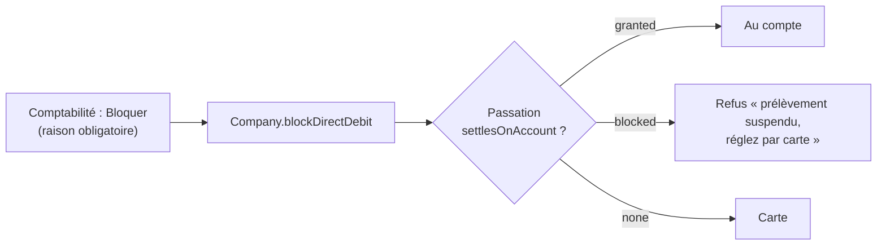

# Bloquer le prélèvement d'un client, et les liens de paiement

> **Doc d'état**, écrite le 2026-10-08 à partir du code (relu ce jour-là). Elle
> remplace le plan du 2026-09-25 (« plan blocage prélèvement et liens de
> paiement », supprimé ; il reste dans l'historique git, et des `migration.sql`
> le citent encore sous son ancien nom).

Deux outils de la comptabilité pour faire payer par carte ce qui ne doit pas,
ou plus, passer par le prélèvement.

## 1. Le blocage du prélèvement

**Bloquer, c'est forcer un client au crédit mensuel à payer ses prochaines
commandes par carte, sans lui retirer le crédit accordé.** Débloquer le rend
tel quel.

- **Modèle** (`b2b/account/`, table `companies`) :
  `direct_debit_blocked_at`, `_blocked_by` (fiche staff), `_block_reason` ;
  toutes nulles ou toutes renseignées (CHECK
  `companies_direct_debit_block_complete`).
- **Agrégat** `Company` : `blockDirectDebit(reason, at, by)` refuse un double
  blocage et une société sans crédit ; `unblockDirectDebit()` refuse une
  société non bloquée ; retirer tout crédit lève le blocage.
  `settlesOnAccount()` = crédit accordé **et** non bloqué.
- **Serveur** : la garde de passation (`OrderGuardReader.settlesOnAccount`,
  `granted | blocked | none`) refuse « au compte » sur les deux chemins,
  client et back-office, avec un message qui dit « suspendu ».
- **Front client** : le contrat `account` porte `directDebitBlocked` ; le
  panier ne propose plus « au compte », « Mon compte » le dit.
  `grantedTerms` n'est pas vidé : le client voit qu'il a un crédit, suspendu.
- **Le cycle ne change pas** : les commandes déjà passées au compte restent
  au prélèvement de leur mois. Pour ne pas prélever, le geste reste de
  retirer la ligne du lot.
- **Journal** : `company.direct_debit_blocked` (raison, auteur),
  `company.direct_debit_unblocked`.
- **Droit** : la liste sous `b2b_accounting:read` ; bloquer et débloquer
  exigent `b2b_deferred_payment_block:write`, accordé à `admin` et
  `comptabilite` seulement (`b2b_accounting:write` ne le donne pas).

| Route (`admin/accounting/direct-debit-blocks`) | Geste                          |
| ---------------------------------------------- | ------------------------------ |
| `GET`                                          | sociétés à crédit et leur état |
| `POST :companyId` `{ reason }`                 | bloquer                        |
| `DELETE :companyId`                            | débloquer                      |

Écran : Comptabilité › Blocages (`comptabilite/blocages-prelevement/`).

## 2. Les liens de paiement

Écran : Comptabilité › Liens de paiement (`comptabilite/liens-de-paiement/`),
deux onglets.

### 2a. Les commandes à régler par carte

Les commandes `pending` ou `failed`, non annulées, avec le lien de règlement
de l'espace client (`/commandes/:id/regler`). Copier le lien, ou le renvoyer
par e-mail à l'acheteur. Sans `CLIENT_BASE_URL`, pas de lien et le renvoi est
refusé en le disant.

`GET admin/accounting/payment-links/orders`,
`POST admin/accounting/payment-links/orders/:orderId/resend`
(`b2b/orders/http/admin-order-payment-links.controller.ts`).

### 2b. Les liens libres

Un montant demandé hors commande (« Régularisation août »), payé sur une page
**Stripe Checkout hébergée** : le comptable du client n'a pas besoin de
compte chez nous.

- **Agrégat** `PaymentLink` (`b2b/payments/domain/entities/payment-link.ts`) :
  société, montant en centimes (> 0), libellé, session Stripe, URL ; états
  `open → paid | cancelled | expired`.
- **Payé** seulement sur `checkout.session.completed` avec `payment_status =
paid` (ou `async_payment_succeeded`) ; **expiré** sur
  `checkout.session.expired`. Un paiement qui arrive sur un lien annulé le
  passe quand même à `paid` : l'argent est encaissé.
- **N'est pas une commande** : ni chiffre d'affaires, ni prélèvement, ni
  lettrage automatique avec ce qu'il régularise.
- **Plafond** : `accounting_settings.payment_link_max_cents` (`null` = aucun),
  lu à la création ; au-delà, refus qui nomme le plafond. Réglage :
  `admin/accounting/settings`.

`GET`/`POST admin/accounting/payment-links`,
`POST admin/accounting/payment-links/:id/cancel`
(`b2b/payments/http/admin-payment-links.controller.ts`).

## 3. Ce qui reste ouvert

- Pas de blocage automatique sur un rejet de prélèvement : aucun retour
  bancaire n'est encore lu (PA5,
  [`todo-rejets-bancaires.md`](todo-rejets-bancaires.md)).
- Pas de lettrage automatique entre un lien libre et des commandes.
- Le webhook Stripe de production doit être abonné aux événements
  `checkout.session.completed`, `.async_payment_succeeded` et `.expired` — à vérifier dans le tableau de bord Stripe.
