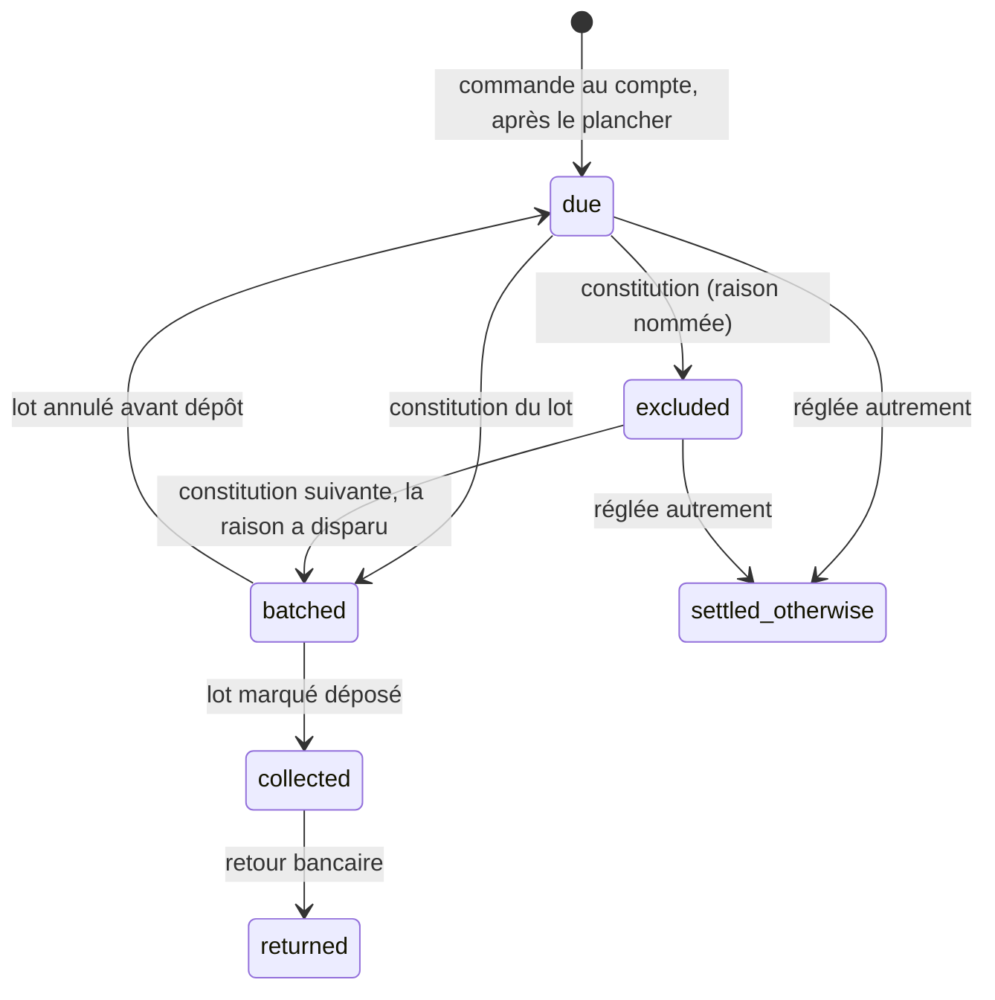

# Le lot de prélèvement figé

> Doc d'état, écrite le 2026-10-09 à partir du code. Elle remplace le plan
> « Le lot de prélèvement figé » (supprimé ; il reste dans l'historique git, et
> des migration.sql le citent encore).

Un lot est **un fichier `pain.008` d'une entité, d'un schéma (CORE ou B2B) et
d'un cycle**, constitué une fois, stocké, puis déposé à la banque à la main. Il
sert à tous les clients prélevés. Ce qu'il prélève — les factures émises, ou
l'arrêté avant le plancher de facturation — est décrit dans
[`../facturation/le-prelevement-suit-la-facture.md`](../facturation/le-prelevement-suit-la-facture.md)
et [`../facturation/facture-emise.md`](../facturation/facture-emise.md) ; le
calendrier, l'avis et la préparation automatique dans
[`prelevement-automatique.md`](prelevement-automatique.md) ; les rejets dans
[`retours-bancaires.md`](retours-bancaires.md).

## Les rattachements

- **Une commande appartient à l'entité du mandat qui la prélève** : son mandat
  effectif (celui de la société, ou du payeur avec les sous-comptes) a cette
  entité pour créancier (`collection-assembly.ts`). Deux mandats actifs chez deux
  entités → `ambiguous_creditor`, refusée en nommant la société.
- **Une ligne de lot est un débiteur et porte ses commandes**
  (`order_collection.batch_id` + `line_rank`), et depuis E4 ses factures
  (`collection_batch_line_invoice`). Un rejet sur un `EndToEndId` sait donc ce
  qu'il touche.
- **Les identifiants SEPA viennent du lot** (`collection-identifiers.ts`) :
  `MsgId` = `<lot>`, `PmtInfId` = `<lot>-<RCUR|OOFF>`, `EndToEndId` =
  `<lot>-<rang sur 4>`, `<lot>` étant l'ULID du lot. Un lot reconstitué prend un
  autre ULID : jamais deux fois le même `MsgId`. 🔴 Format **arrêté**,
  irréversible dès le premier dépôt.

## Le cycle d'une commande

## Le modèle

Schéma `apps/lfd-api/prisma/schema/public/collection.prisma` :

- `collection_batch` : entité, schéma, `cycle_starts_at` / `cycle_closes_at`,
  `status` (`constituted`, `deposited`, `cancelled`), qui et quand pour chaque
  geste (`constituted_by` distingue le staff de l'automatisme),
  `unmandated_companies`, **`xml` et `file_sha256`**.
- `collection_batch_line` : rang, `end_to_end_id`, mandat figé (RUM, IBAN
  scellé, séquence), montant.
- `order_collection` : état par commande (`due` = absence de ligne), lot et
  rang, `exclusion_reason` (`no_mandate`, `payer_detached`, `one_off_consumed`,
  `ambiguous_creditor`, `unbillable`, `invoice_split`).
- `collection_floor` : le plancher, singleton.

Règles :

- **Le fichier est stocké, pas re-rendu** ; `CreDtTm` = `constituted_at` ;
  l'empreinte se vérifie à chaque téléchargement.
- **Plancher** : une commande n'entre que créée après `floor_at`. Au-delà, pas
  de borne basse : une commande d'un cycle passé revient, et le `RmtInf` dit
  « dont N de cycles anterieurs ».
- **La course avec la passation est voulue** : une commande validée après la
  constitution se lit `due` et entre au lot suivant.
- **Un mandat ponctuel déjà débité** donne `one_off_consumed`.
- **Une commande sans mandat bloque le lot** (Q2, l'interdiction est gardée) :
  elle est écartée `no_mandate`, la société est inscrite dans
  `unmandated_companies`, et le dépôt est refusé
  (`BatchHasUnmandatedCompaniesError`) tant qu'elle y est.
- Identités staff locales, jamais un `sub`.

## Les gestes

Routes `admin/accounting/collection` (`http/admin-collection-batches.controller.ts`,
`b2b_accounting`) :

| Geste              | Route                                   | Effet                                                                                                                                                         |
| ------------------ | --------------------------------------- | ------------------------------------------------------------------------------------------------------------------------------------------------------------- |
| Le cycle, l'aperçu | `GET cycle`, `GET preview`              | le cycle en cours ; l'aperçu recalculé, non déposable                                                                                                         |
| Constituer         | `POST batches`                          | sous verrou par entité, `cycle_closes_at ≤ now` : lignes, exclusions, XML stocké                                                                              |
| Annuler            | `POST batches/:id/cancel`               | `constituted` seulement ; ses commandes repassent `due`                                                                                                       |
| Marquer déposé     | `POST batches/:id/deposit`              | relit mandats, comptes et commandes : mandat révoqué, IBAN changé, commande annulée, société sans mandat ou avis non envoyé → refus nommé ; sinon `collected` |
| Télécharger        | `GET batches/:id/file.xml`, `audit.csv` | le fichier stocké (**écriture** exigée : IBAN en clair, A16) ; le CSV de contrôle (IBAN masqué)                                                               |
| Réglée autrement   | `POST orders/:orderId/settle-otherwise` | `due` ou `excluded` → `settled_otherwise`, avec une note                                                                                                      |

La constitution se fait aussi **toute seule** une fois par mois
(`POST admin/accounting/collection/autopilot`, réglage de l'entité) : voir
[`prelevement-automatique.md`](prelevement-automatique.md).

Chaque geste écrit un fait : `collection.batch_constituted`,
`collection.batch_cancelled`, `collection.batch_deposited`,
`collection.order_settled_otherwise`.

Écran : `comptabilite/prelevement-du-mois/` du back-office.

## Ce qui reste ouvert

- Une commande **annulée après `collected`** : le prélèvement n'est pas touché,
  l'avoir et le remboursement sont hors de ce mécanisme. Le plan voulait que la
  fiche de la commande le signale ; **non vérifié** dans le code.
- Reprendre les commandes antérieures au plancher serait un geste à part,
  qui n'existe pas.
- Le cas de deux entités qui encaissent reste théorique : une seule le fait.
