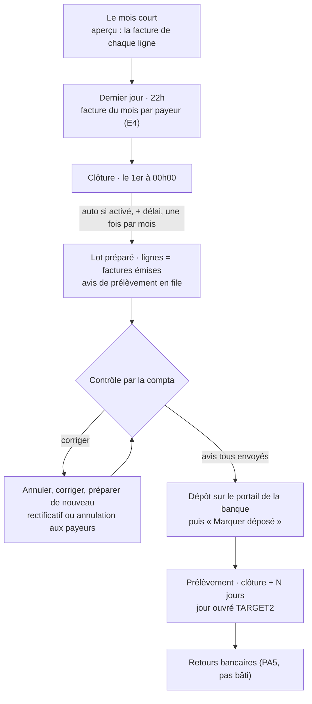

# Le prélèvement automatique

> **Doc d'état**, écrite le 2026-10-08 à partir du code des lots PA1 à PA4,
> bâtis ce jour-là. Elle remplace le plan « prélèvement automatique »
> (supprimé ; il reste dans l'historique git, et trois `migration.sql`
> le citent encore sous son ancien nom). Touche **l'argent** :
> le plan avait été contredit par `vitruve`.

> ⚠️ **2026-10-08, lot E4** ([`../facturation/plan-emission-de-la-facture.md`](../facturation/plan-emission-de-la-facture.md), § 8.5) :
> **le lot encaisse des factures émises.** Le dernier jour du mois à 22h, le
> même passage horaire émet une facture par payeur légal ; le lot du 1er
> regroupe, par mandat, les factures émises non encore prélevées (montant =
> Σ TTC, aucun arrêté). L'arrêté ne vit plus que pour les bons passés avant
> la mise en service (`invoicing_floor`, le 1er du mois qui suit le
> déploiement). Les sections ci-dessous sont mises à jour en conséquence.

Le mois de prélèvement d'une entité émettrice se déroule seul, selon un
**calendrier** réglé sur l'entité. Il ne reste à la comptabilité que le
contrôle du lot et le dépôt du fichier sur le portail de la banque.

## 1. Le mois

| Étape                | Qui                  | Où dans le code                                                           |
| -------------------- | -------------------- | ------------------------------------------------------------------------- |
| Aperçu               | lecture, sans écrit  | `GET admin/accounting/collection/preview` · `GetCollectionPreviewHandler` |
| Facture du mois      | cron, puis compta    | `POST admin/accounting/monthly-invoices` · `IssueMonthlyInvoicesCommand`  |
| Préparation (bouton) | compta               | `ConstituteCollectionBatchesCommand`, auteur `staff`                      |
| Préparation (auto)   | cron `15 * * * *`    | `POST admin/accounting/collection/autopilot` · `RunCollectionAutopilot`   |
| Avis                 | à chaque préparation | `collection_notice`, fait durable `collection.notice_to_send`             |
| Dépôt                | compta               | `CollectionBatch.markDeposited`, exige tous les avis `sent`               |

## 2. Les réglages (sur l'entité émettrice)

Colonnes de `legal_entities` (migration `20261008150000`), saisies dans la
carte « Prélèvement automatique » de la fiche de l'entité, sous
`b2b_accounting` :

| Réglage                                  | Colonne                                                | Défaut                           | Règle                                                                                                  |
| ---------------------------------------- | ------------------------------------------------------ | -------------------------------- | ------------------------------------------------------------------------------------------------------ |
| Préparer le lot tout seul                | `auto_collection_enabled`                              | faux                             | fait `legal_entity.auto_collection_enabled/_disabled`                                                  |
| Délai avant de préparer                  | `auto_collection_delay_hours`                          | 1                                | 1 à 23 h                                                                                               |
| Jours entre la clôture et le prélèvement | `collection_days_after_closure` (N)                    | NULL = délai de pré-notification | 1 à 60 ; **N ≥ délai**, tenu par `LegalEntity` dans les deux sens (`CollectionBeforeNoticeError`, 409) |
| Délai de pré-notification                | `pre_notification_days`                                | 14                               | contractuel ; le réduire demande la clause CGV et mandat                                               |
| Limite de dépôt                          | `deposit_cutoff_business_days` + `deposit_cutoff_time` | NULL = « à renseigner »          | 1 à 10 jours ouvrés + `HH:MM` Paris ; les deux ou aucun (CHECK)                                        |

## 3. Le calendrier

- `collectionCalendar` (`domain/services/collection-calendar.ts`), pur :
  préparation prévue, échéance, date limite de dépôt.
- **Échéance figée à la préparation** (`frozenCollectionDay`, décision D4) :
  le plus tard de « clôture + N » et « jour de préparation + délai de
  pré-notification », puis jour ouvré **TARGET2** (`target2-calendar.ts` :
  week-ends, 1er janvier, Vendredi saint, lundi de Pâques — Meeus/Jones/
  Butcher —, 1er mai, 25 et 26 décembre). Une préparation tardive repousse
  le prélèvement, elle ne raccourcit jamais le préavis.
- Le lot porte `requested_collection_day` et, s'il a été repoussé,
  `postponed_from_day` ; le XML (`ReqdColltnDt`) et l'avis disent la même
  date. Le XML est scellé : changer la date = annuler et préparer de nouveau.
- La date limite de dépôt d'un lot se calcule au réglage **actuel** de
  l'entité ; seule l'échéance est figée.

## 4. L'avis de prélèvement

- **Un avis par ligne de débit**, écrit dans la transaction du lot
  (`collection_notice`, migration `20261008160000`) : montant de la ligne,
  échéance, RUM, ICS, raison sociale du créancier, et la pièce réglée — les
  numéros des factures (`invoice_numbers`, E4), ou l'arrêté pour une ligne
  de bons d'avant la facture du mois.
- **Destinataire** (Hugo, 2026-10-08) : le contact de facturation
  (`company_contacts.role = billing`, le plus ancien) de la société payeuse,
  sinon son détenteur (`memberships.role = owner`). Ni l'un ni l'autre :
  `unsendable`.
- **Envoi** : le fait durable part par la boîte d'envoi transactionnelle ;
  l'abonné `SendCollectionNotice` envoie après validation, clé
  d'idempotence `collection.notice:<id>`, et écrit `sent` ou `failed` sur
  l'avis. Gabarit : `platform/mailer/collection-notice-mail.ts`.
- **Préparer de nouveau** un lot annulé, pour chaque payeur dont le
  dernier avis était `sent` : termes identiques → rien ne part ; montant,
  date ou RUM différents → **rectificatif** ; payeur plus prélevé →
  **annulation**.
- **Le dépôt exige tous les avis `sent`** (`CollectionNoticesNotSentError`,
  409, nomme le payeur). Pas de bouton « renvoyer » : un avis en échec se
  règle en annulant le lot et en le préparant de nouveau.
- Faits : `collection.notice_queued`, `_unsendable`, `_sent`, `_failed`
  (jamais l'adresse).

## 5. L'automatisme

- `collection_autopilot_run` (migration `20261008170000`), clé
  (`legal_entity_id`, `cycle_closes_at`) : **une tentative par mois**. La
  tentative est prise en base (`pending`) avant d'agir, puis tranchée :
  `constituted`, `nothing_to_collect`, `not_yet_open`, `failed` (+ message).
  Un `pending` resté seul (processus mort) s'affiche « interrompue » et ne
  se retente pas.
- Annuler un lot ne relance pas l'automatisme : préparer de nouveau est un
  geste humain, après correction.
- Le passage lance la **même** commande que le bouton, sous l'auteur
  `system` : `collection_batch.constituted_by` (`staff` | `system`), un
  CHECK impose une fiche staff pour `staff` et aucune pour `system`.
- Le cron est déclaré deux fois, `wrangler.jsonc` et `container/worker.ts` ;
  `container/__tests__/cron-expressions.spec.ts` vérifie qu'elles
  concordent.
- Fait `collection.autopilot_ran`. L'écran montre la dernière tentative
  (`lastAutopilotRun`) et « Préparé automatiquement le … ».
- **Depuis E4, le même passage émet d'abord la facture du mois** (le dernier
  jour à 22h15, `RunInvoiceAutopilotCommand`), une tentative par (entité,
  mois) dans `invoice_autopilot_run`. Elle ne dépend pas de « préparer le lot
  tout seul ». La réponse du passage porte `invoiceRuns` à côté de `runs`.

## 6. L'écran « Prélèvement du mois »

`apps/lfd-backoffice-frontend/src/app/comptabilite/prelevement-du-mois/`
(l'ancienne route `lots-de-prelevement` y redirige), de haut en bas : le
calendrier (`collection-calendar/`, partagé avec la fiche de l'entité) et
la dernière tentative ; l'aperçu (facture par ligne, signalements, pourquoi
il est vide) ; **les factures du mois** (émises, payeurs signalés, le bouton
« Émettre les factures de … », la tentative automatique — E4) ; le lot à
traiter (lignes et leurs factures ou leur arrêté, état des avis, gestes
datés) ; l'historique replié. Le tableau de bord n'en garde qu'un résumé.

## 7. Ce qui reste ouvert

- **Une préparation qui ne produit aucun lot** (tout écarté) n'envoie pas
  les annulations ; elles partent avec la prochaine qui prélève. Proposé à
  Hugo le 2026-10-08 : les envoyer quand même.
- **Activer l'automatisme en cours de mois** prépare le mois clos au passage
  suivant s'il n'a jamais été tenté.
- **Préalables hors code** : la clause CGV et mandat pour prélever avant le
  15 (délai de pré-notification réduit) ; le cut-off du portail de la Caisse
  d'Épargne ; FRST/RCUR et les mandats ponctuels
  ([`prelevement-sepa.md`](prelevement-sepa.md),
  questions 3 et 4).
- **PA5, les retours bancaires** (`pain.002`, `camt.054`) : pas bâti.
