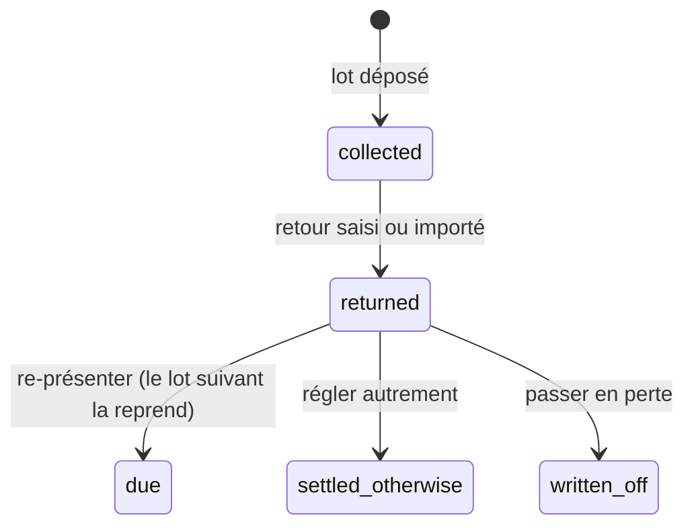

# Les retours bancaires d'un prélèvement

> Doc d'état, écrite le 2026-10-09 à partir du code. Elle remplace le plan
> « Les retours bancaires d'un prélèvement (PA5) » (supprimé ; il reste dans
> l'historique git, et des migration.sql le citent encore).

« Marquer déposé » passe les commandes d'un lot à `collected` : c'est une
promesse, pas un encaissement. Un retour de la banque la défait. Les choix faits
en l'absence d'Hugo sont dans [`../arbitrages-en-absence.md`](../arbitrages-en-absence.md).

## La règle

**Un retour porte sur une ligne de lot entière**, désignée par son
`EndToEndId`. Il défait l'encaissement de toute la ligne : ses commandes quittent
`collected` pour `returned`, ses factures (ou son arrêté) redeviennent dues. La
facture ne change pas (immuable). **Rien ne repart tout seul** : `returned` est
hors des états ouverts, ni la constitution ni l'automatisme ne le reprennent ;
un humain décide.

| Type (`kind`)    | Quand                                   | Source ISO                     |
| ---------------- | --------------------------------------- | ------------------------------ |
| `reject`         | avant règlement                         | `pain.002` (`TxSts = RJCT`)    |
| `return`         | après règlement                         | `camt.054` (`RtrInf`)          |
| `refund_request` | contestation du débiteur (CORE, `MD06`) | `camt.054` ; refusé en **B2B** |

## Le cycle

- **Re-présenter** (`OrderCollection.represent`) : seulement pour une ligne qui
  encaissait des **factures émises** — refusé sous un arrêté, pour une ligne
  d'avant F3, pour une ligne `OOFF` (mandat ponctuel consommé : il faut un lien
  de paiement), et sous un mandat qui n'est plus actif (relu par
  `MandateRecheckReader`). Le lot suivant normal reprend les commandes avec leurs
  factures, préavis compris ; l'avis dit « nouvelle présentation du prélèvement
  rejeté du … » (`collection_notice.represented_rejection_day`, lu par
  `RepresentedRejectionsReader`).
- **Régler autrement** : un lien de paiement ou un virement noté, pour toute la
  ligne, uniquement par le retour — jamais par le geste « réglée autrement »
  d'une commande.
- **Passer en perte** : un état et un fait, avec une note (`resolution_note`) ;
  aucune écriture comptable ni avoir, en attendant le cabinet.
- Un motif qui appelle une révocation (MD01, AC04…) **propose** au staff de
  révoquer par le geste existant ; rien n'est révoqué tout seul.
- Pas de blocage automatique du client, pas de refacturation des frais.

## Le modèle

Table `collection_return` (`prisma/schema/public/collection-return.prisma`) :
`end_to_end_id` **unique**, clé étrangère vers la ligne (un retour par ligne),
`kind`, `reason_code` (+ `reason_label`), `returned_on`, `amount_cents`,
`fee_cents` (frais de la banque, facultatifs), `source` (`manual`, `pain002`,
`camt054`), `recorded_at` / `recorded_by_staff_id`, `resolution` (`pending`,
`represented`, `settled_otherwise`, `written_off`), `resolution_note`,
`resolved_at` / `resolved_by_staff_id`. Les colonnes staff sont au registre RGPD.

`OrderCollectionState` gagne `returned` et `written_off` ; le CHECK
`order_collection_in_a_line_or_returned` admet `returned` avec sa ligne.

L'agrégat `CollectionReturn` (`domain/entities/collection-return.ts`) refuse :
un lot non déposé, un second retour sur la ligne, un montant ≠ celui de la ligne,
`refund_request` en B2B, une seconde résolution. `BankReturnReason` est une liste
fermée de codes SEPA ; `NARR` = autre, avec libellé ; `MD06` est refusé pour un
rejet.

## Les entrées

- **Saisie manuelle** depuis l'écran du lot : ligne, type, motif, date, frais.
- **Import de fichier** (`domain/services/bank-return-file.ts`, sur
  `xml-tree.ts`, lecteur XML minimal sans dépendance qui refuse `DOCTYPE` et les
  entités inconnues) : `pain.002.001.03` et `camt.054.001.02`, appariés par
  `EndToEndId`. L'aperçu fait juger chaque transaction par l'agrégat, à blanc ;
  la confirmation relit le fichier et enregistre **toutes** les transactions
  appariées, ou refuse tout si l'une ne s'enregistre plus.

## Routes, faits, écrans

- `admin/accounting/collection-returns` (`b2b_accounting`) : `GET
batches/:batchId`, `GET payers/:companyId` (lecture) ; `POST
batches/:batchId/lines/:rank`, `POST :id/represent`, `POST
:id/settle-otherwise`, `POST :id/write-off`, `POST import/preview`, `POST
import/confirm` (écriture, multipart pour l'import).
- Faits `collection.returned` et `collection.return_resolved` (sujet : le payeur,
  jamais d'IBAN) ; cloche `collection.returned` vers la fiche.
- « Prélèvement du mois » : section « Les retours de la banque » (lignes du lot
  déposé, « Signaler un retour », gestes, « Importer un fichier de la banque ») ;
  fiche client › Facturation : carte « Prélèvements rejetés ».

## Ce qui reste ouvert

- **Le format réel de la Caisse d'Épargne** n'est pas connu
  ([`question-banque.md`](question-banque.md)) : la lecture est écrite d'après la
  norme, à éprouver sur un vrai fichier. Un rejet du lot entier (`PmtInfSts`,
  sans `TxInfAndSts`) n'est pas lu.
- **Le traitement comptable** d'une perte et d'une contestation tardive (13 mois) :
  au cabinet.
- **Les frais de rejet** : non refacturés, à confirmer avec les CGV.
- L'import ne permet pas de choisir les transactions une à une.
