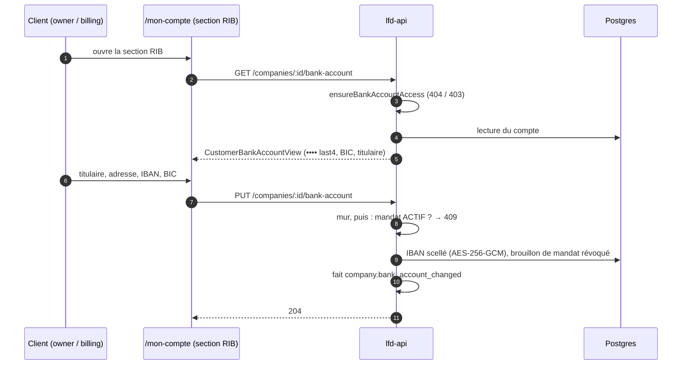

# Le RIB, côté client

> **Doc d'état**, écrite le 2026-10-08 à partir du code (relu ce jour-là). Elle
> remplace le plan du 2026-09-14 (« plan RIB client », supprimé ; il reste
> dans l'historique git). Construit sans `vitruve`, à la demande de Hugo ; la
> sécurité de la transmission est dans
> [`todo-rib-client-transmission.md`](todo-rib-client-transmission.md).

Dans `/mon-compte`, le client **voit et saisit** le RIB de sa société — le
symétrique de la section RIB de la fiche client du back-office, par la **même
commande**.

## 1. Qui peut quoi

| Rôle dans la société     | Lire le RIB | Le saisir / remplacer |
| ------------------------ | ----------- | --------------------- |
| `owner` (détenteur)      | ✅          | ✅                    |
| `billing` (comptable)    | ✅          | ✅                    |
| `admin`, `orders`        | 403         | 403                   |
| non-membre de la société | 404         | 404                   |

Le mur est une fonction pure, `ensureBankAccountAccess`
(`apps/lfd-api/src/b2b/payments/domain/services/bank-account-access.ts`) :
même partage que `ensureCompanyAdmin`, 404 non divulguant puis 403. Le front
ne montre la section qu'à `owner` et `billing` (`BANK_ROLES`,
`client/mon-compte/compte-page/compte-page.ts`) ; l'API refuse de toute façon.

## 2. Le flux

## 3. L'API

`apps/lfd-api/src/b2b/payments/http/company-bank-account.controller.ts`,
`@Controller("companies")`, bus seulement :

| Route                         | Cas d'usage                                                                                                      |
| ----------------------------- | ---------------------------------------------------------------------------------------------------------------- |
| `GET :companyId/bank-account` | `GetMyCompanyBankAccountQuery` → `CustomerBankAccountView`                                                       |
| `PUT :companyId/bank-account` | `SetMyCompanyBankAccountCommand`, payload `setCompanyBankAccountPayloadSchema` (celui du staff)                  |
| `GET :companyId/billed-to`    | `GetMyCompanyBilledToQuery` : à qui un **site** est facturé (sous-comptes), jamais l'IBAN ni le mandat du payeur |

- **Même logique que le staff** : les deux commandes passent par
  `record-company-bank-account.ts` ; aucune règle n'est dupliquée.
- **L'IBAN monte en clair et ne redescend jamais** : scellé en base
  (`company_bank_accounts.iban_sealed`), rendu `•••• last4`.
- **La vue client** est la vue staff sans les zones 14 et 19 du mandat.
- **Aucune garde de boutique** : un RIB se dépose à tous les niveaux.

## 4. Le mandat SEPA

- **Mandat ACTIF** : le remplacement est **refusé en 409** — un changement de
  banque passe par le staff (`set-my-company-bank-account.handler.ts`,
  depuis le 2026-09-14, plan mandat client §8).
- **Mandat BROUILLON** : il est révoqué au remplacement du RIB, puisqu'il
  portait l'ancien compte.
- Côté fiche client du back-office, l'encart des pièces manquantes réclame le
  RIB puis le mandat quand un règlement différé est accordé (2026-10-08).

## 5. La trace

Chaque dépôt écrit **`company.bank_account_changed`** au journal
(`record-company-bank-account.ts`, catalogue `journal-facts/accounts.ts`),
côté client comme côté staff.

## 6. Le front client

`apps/lfc-ecommerce-frontend/src/app/client/mon-compte/bank/` : `bank-section.ts`,
`bank-desk-card/`, `bank-mobile-card/`, `bank-panel/` (le formulaire, IBAN
toujours vide). Service : `client/client-bank-account.service.ts`. Copie
fr / en / it dans `client/copy/screens/account.*.ts`.

## 7. Écart connu (2026-10-08)

⚠️ La notice de la section (`bankNotice`, `account.fr.ts:353`) dit :
« Si un prélèvement est en place sur ce compte, le remplacer l'interrompt :
nous revenons vers vous pour la suite. » C'est **faux** depuis la garde du
§ 4 : avec un mandat actif, le remplacement est refusé. La phrase est à
réécrire dans les trois langues (« un prélèvement est en place : pour changer
de banque, contactez-nous »).

## 8. Ce qui reste ouvert

La revue de la transmission (journaux, prise de compte par jeton volé,
confirmation par e-mail, lecture de l'IBAN par le PDF du mandat) :
[`todo-rib-client-transmission.md`](todo-rib-client-transmission.md).
