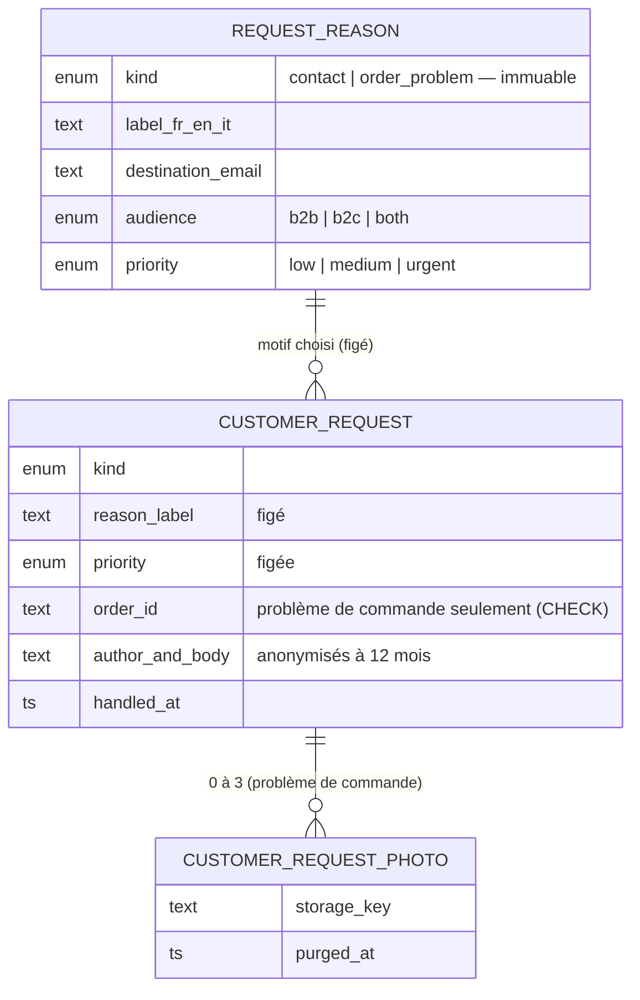

# Demandes clients — contact, problèmes de commande, et ce qui viendra

> ✅ **Bâti le 2026-10-09**, à la demande d'Hugo : une page de contact réglable,
> un formulaire « Nous écrire », un « Signaler un problème » branché pour de
> bon (avec photos), et une seule boîte qui rassemble ce que les clients
> demandent. Ce document décrit l'état du code ; il remplace la doc
> « Nous contacter » et les plans « Nous écrire » et « Demandes clients »,
> relus par `vitruve`, revus après construction, puis supprimés.

## 1. Ce que voit chacun

| Qui                   | Où                                              | Ce qu'il fait                                                                                                |
| --------------------- | ----------------------------------------------- | ------------------------------------------------------------------------------------------------------------ |
| Visiteur, client      | Boutique — la carte de contact                  | surtitre (s'il est réglé), titre, phrase ; « Appeler » ; « Écrire »                                          |
| Visiteur, client      | Boutique — « Nous appeler »                     | la liste des numéros de son public (s'il y en a plus d'un) ; chaque ligne lance l'appel                      |
| Visiteur, client      | Boutique — « Nous écrire »                      | motif `contact`, nom, e-mail, téléphone facultatif, message                                                  |
| Client connecté       | Mes commandes — « Signaler un problème »        | sur une commande **retirée ou livrée** seulement : motif `order_problem`, un mot, jusqu'à 3 photos           |
| Staff (`b2b_contact`) | Back-office › E-commerce LFC › Demandes clients | toutes les demandes, filtres type / priorité / état, photos, commande liée, « Marquer traité »               |
| Staff (`b2b_contact`) | Réglages › Motifs des demandes                  | un onglet par formulaire : « Nous écrire », « Signaler un problème »                                         |
| Staff (`b2b_contact`) | Réglages › Contact                              | la carte (surtitre, titre, phrase par public et par langue) et les numéros                                   |
| Équipe destinataire   | Sa boîte mail                                   | un courriel par demande (référence de commande, nombre de photos, lien vers la boîte), `Reply-To` = l'auteur |

Le compteur du menu « Demandes clients » et la cloche disent les demandes à
traiter, tous types.

## 2. Le modèle

Une **demande** a une **enveloppe** commune (auteur, motif et priorité figés,
état, traitement, anonymisation) et des **détails** propres à son **type**
(`kind`). Un **motif** appartient à un seul type, pour toujours.

Code : `apps/lfd-api/src/b2b/contact/` — agrégats `RequestReason`
(`apps/lfd-api/src/b2b/contact/domain/request-reason.ts`) et `CustomerRequest` (`apps/lfd-api/src/b2b/contact/domain/customer-request.ts`,
factories `contact()` et `orderProblem()`, `attachPhoto`, `markHandled`,
`anonymize`), détails par type dans `apps/lfd-api/src/b2b/contact/domain/customer-request-details.ts`. Ports
de lecture et d'écriture séparés, un handler par cas. Schéma
`prisma/schema/public/contact.prisma`, migration `20261009180000_les_demandes_clients`
(elle remplace quatre migrations du même jour, jamais poussées). Contrats
`packages/contracts/src/contact.ts` et `contact.values.ts`.

**Ajouter un type** (devis, rendez-vous…) : une valeur de `RequestKind`
(contrat et enum), une variante de détails et son entrée dans les tables du
domaine et du mapper (le `Record` les exige), ses colonnes ou sa table, une
factory et un handler ; côté back-office, un composant de détails et une
ligne dans `apps/lfd-backoffice-frontend/src/app/b2b/demandes/request-details.ts` ; un onglet de motifs. L'enveloppe, la boîte,
la priorité, la cloche, le compteur et l'anonymisation ne bougent pas.

## 3. Les règles, et où elles vivent

- **Le public est déduit au serveur**, jamais pris au corps : visiteur → `b2c` ;
  connecté → `b2b` pour une société active, `b2c` sinon. Un motif hors de ce
  public, ou d'un autre type que le formulaire, est refusé.
- **« Nous écrire »** (`POST /contact-messages`, `POST /me/contact-messages`) :
  3 messages / 10 min **par IP** ; champ piège `lfd_trap` (rempli : 204, rien
  rangé, avertissement au journal sans donnée personnelle). Pas de délai
  minimal : déclaré par le client, il n'arrêtait aucun robot.
- **« Signaler un problème »** (`POST /me/orders/:orderId/problems`, multipart) :
  3 / 10 min **par compte** ; la commande doit être visible par le client (la
  règle de `get-order.handler.ts`, par le port `ReportableOrderReader`) — sinon
  404 — et `fulfilled` — sinon 409 `contact.order_problem.not_fulfilled` ;
  photos ≤ 3, 5 Mo, JPEG/PNG/WebP relus aux octets (`REQUEST_PHOTO_BOUNDS`).
- **Photos** : rangées par le `DocumentStore` (le même espace que les photos
  des notes et des étapes de livraison, le seul qui sait supprimer), servies
  par `GET /admin/customer-requests/:id/photos/:photoId` — jamais publiques.
- **Courriel** (`platform/mailer/`) : texte échappé, objet assaini, « [Urgent] »
  pour un motif urgent, `Reply-To` par demande (une adresse refusée → courriel
  sans `Reply-To`), aucune pièce jointe.
- **Traitement** : `markHandled` refuse un second traitement ; fait journalisé
  `customer_request.handled` (le type et le motif, jamais l'auteur).
- **Conservation** : `CUSTOMER_REQUEST_RETENTION_MONTHS` = 12 (Hugo) — après
  traitement, ou après réception pour une demande jamais traitée. Le balayage
  nocturne supprime les photos du stockage, puis vide l'auteur, le texte et
  `order_id`. Pas de `DELETE` de la demande. Registre RGPD : personne
  `contact`, tables `customer_request` et `customer_request_photo`, tenu par
  `lint:rgpd-staff`.
- **Carte de contact** : surtitre sans repli (vide = rien) ; titre, phrase et
  numéro de repli à un seul endroit, `CONTACT_CARD_DEFAULTS`.

## 4. Les routes

| Méthode et route                                                                                | Garde                                                                 |
| ----------------------------------------------------------------------------------------------- | --------------------------------------------------------------------- |
| `GET /contact-settings`, `GET /request-reasons?kind=&audience=`                                 | publiques                                                             |
| `POST /contact-messages`                                                                        | publique, débit par IP                                                |
| `POST /me/contact-messages`                                                                     | client, débit par IP                                                  |
| `POST /me/orders/:orderId/problems`                                                             | client, débit par compte                                              |
| `GET                                                                                            | POST /admin/request-reasons?kind=`, `PUT …/:id`, `POST …/:id/archive` | `b2b_contact`                  |
| `GET /admin/customer-requests?status=&kind=`, `POST …/:id/handled`, `GET …/:id/photos/:photoId` | `b2b_contact`                                                         |
| `GET                                                                                            | PUT /admin/contact/settings`, `GET                                    | POST /admin/contact/phones`, … | `b2b_contact` |

Back-office : `/b2b/demandes` (l'ancienne `/b2b/contact/messages` y redirige ;
`?demande=<id>` ouvre la demande), `/b2b/reglages/motifs-des-demandes`,
`/b2b/contact`. Ces pages sont sous `/b2b`, gardé par `b2b_settings:read` : il
faut les deux droits. `b2b_contact` est ajoutée **sans droit accordé** :
l'accorder à l'écran après déploiement (runbook).

## 5. Ce qui reste

- Les types à venir : demande de rendez-vous, demande de devis, et le
  rapatriement des demandes de rappel à l'activation (`support_requests`).
- Le back-office garde les libellés des boutons « Appeler / Écrire » pour
  l'aperçu (`shop-contact-fallback.ts`), absents de `CONTACT_CARD_DEFAULTS`.
