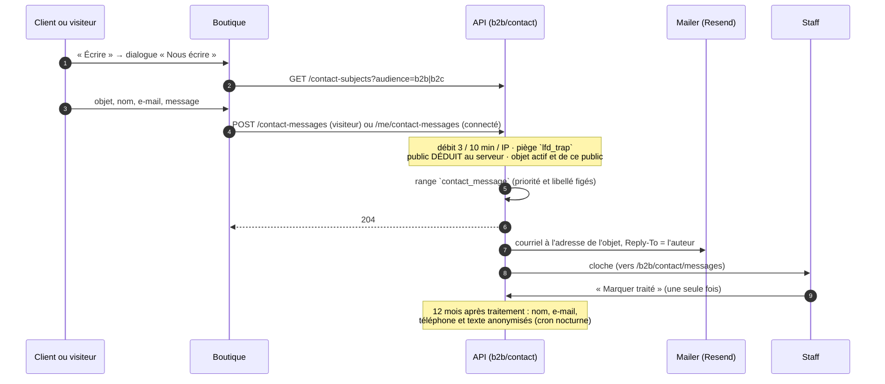

# Nous contacter — la carte, les numéros, le formulaire et la messagerie

> ✅ **Bâti le 2026-10-09**, à la demande d'Hugo (« une page dans Admin /
> E-commerce LFC pour la contact ; écrire devra être un dialog avec un
> formulaire dont on peut fabriquer l'objet qui ira dans un select »). Ce
> document décrit l'état du code ; il remplace le plan « Nous écrire » (supprimé),
> relu par `vitruve` puis revu après construction.

## 1. Ce que voit chacun

| Qui                   | Où                                     | Ce qu'il fait                                                                                         |
| --------------------- | -------------------------------------- | ----------------------------------------------------------------------------------------------------- |
| Visiteur, client      | Boutique — la carte de contact         | lit un surtitre, un titre, une phrase ; « Appeler » ; « Écrire »                                      |
| Visiteur, client      | Boutique — « Nous appeler »            | la liste des numéros de son public (si plus d'un) ; chaque ligne lance l'appel                        |
| Visiteur, client      | Boutique — « Nous écrire »             | objet (liste réglée à l'admin), nom, e-mail, téléphone facultatif, message                            |
| Staff (`b2b_contact`) | Back-office › E-commerce LFC › Contact | trois onglets : Contenu de la carte, Formulaire de contact, Messagerie (badge des messages à traiter) |
| Équipe destinataire   | Sa boîte mail                          | un courriel par message, `Reply-To` = l'auteur ; « [Urgent] » en tête pour un objet urgent            |
| Staff (`b2b_contact`) | La cloche du back-office               | une notification par message reçu, vers la Messagerie                                                 |

## 2. Le parcours d'un message

## 3. Les règles, et où elles vivent

Code : `apps/lfd-api/src/b2b/contact/` (contexte du bloc `b2b`), schéma
`prisma/schema/public/contact.prisma`, contrats
`packages/contracts/src/contact.ts` (zod) et `contact.values.ts` (valeurs sans
zod, servies à la boutique par `@lfd/contracts/shop-values`).

- **Objets** (`contact_subject`) : libellé fr obligatoire + en + it, adresse de
  destination, public (`b2b` | `b2c` | `both`), **priorité interne**
  (`low` | `medium` | `urgent`, défaut `medium`), ordre, actif, archivage.
  L'adresse et la priorité ne sortent JAMAIS par une route publique.
- **Numéros** (`contact_phone`) : libellé fr/en/it, numéro (valeur-objet
  `PhoneNumber`), public, ordre, actif, archivage. La boutique garde `both` et
  le public de l'espace courant ; un seul numéro → « Appeler » est le lien
  `tel:` ; plusieurs → le dialogue « Nous appeler ».
- **Carte** (`contact_settings`, ligne unique) : surtitre, titre et phrase par
  public et par langue, tous facultatifs — vide = le texte de la boutique
  (`accueil-public.copy.ts` §contact : « On répond », « Nous contacter », « Nos
  équipes commerciales sont à votre écoute » / « On répond au plus vite »).
  L'ancienne colonne `phone` est morte, gardée en base.
- **Message** (`contact_message`) : objet, libellé et priorité **figés** à
  l'envoi ; nom, e-mail, téléphone, texte ; personne et société si connecté.
- **Le public est déduit au serveur**, jamais pris au corps : visiteur → `b2c` ;
  connecté → `b2b` pour une société active, `b2c` sinon (port
  `ContactSenderAudience`). Un objet hors de ce public est refusé (409).
- **Anti-abus** : `@Throttle` 3 messages / 10 min / IP sur les deux routes
  d'écriture (`contact-message.throttle.ts`), sous le `ThrottlerGuard` global ;
  champ piège `lfd_trap` — rempli, la réponse est un 204 et rien n'est rangé
  ni envoyé, avec un avertissement au journal (objet, longueur, IP tronquée ;
  jamais l'e-mail ni le texte). Pas de délai minimal : déclaré par le client,
  il n'arrêtait aucun robot et perdait le message d'un humain rapide (revue du
  2026-10-09).
- **Courriel** (`platform/mailer/contact-message-mail.ts`) : texte échappé,
  objet assaini ; `Reply-To` par message (`packages/mailer`, `validReplyTo`) —
  une adresse refusée fait partir le courriel sans `Reply-To`.
- **Traitement** : `ContactMessage.markHandled` refuse un second traitement
  (409 `contact.message.already_handled`) ; fait journalisé
  `contact_message.handled` (l'objet, jamais l'auteur).
- **Conservation** : `CONTACT_MESSAGE_RETENTION_MONTHS` = 12 (Hugo,
  2026-10-09), à compter du traitement ; anonymisation idempotente par le
  balayage nocturne (`container/worker.ts`). Pas de `DELETE`.

## 4. Les routes

| Méthode et route                            | Garde                                                            |
| ------------------------------------------- | ---------------------------------------------------------------- |
| `GET /contact-settings`                     | publique                                                         |
| `GET /contact-subjects?audience=`           | publique                                                         |
| `POST /contact-messages`                    | publique, débit                                                  |
| `POST /me/contact-messages`                 | client connecté, débit                                           |
| `GET                                        | POST /admin/contact/subjects`, `PUT …/:id`, `POST …/:id/archive` | `b2b_contact` |
| `GET                                        | POST /admin/contact/phones`, `PUT …/:id`, `POST …/:id/archive`   | `b2b_contact` |
| `GET                                        | PUT /admin/contact/settings`                                     | `b2b_contact` |
| `GET /admin/contact/messages?status=pending | handled`, `POST …/:id/handled`                                   | `b2b_contact` |

Les messages à traiter sortent **urgents d'abord**, puis du plus ancien.

## 5. Le back-office

`apps/lfd-backoffice-frontend/src/app/b2b/contact/` : une page à trois onglets
(sous-routes `carte`, `formulaire`, `messages`). Bascule de langue FR / EN / IT
avec un point sur ce qui manque, dialogues fold pour les objets et les
numéros, aperçu de la carte par public et par langue, badge des messages à
traiter sur l'onglet Messagerie.

⚠️ Les pages sont sous le parent `/b2b`, gardé par `b2b_settings:read` : il faut
les deux droits. La ressource `b2b_contact` est ajoutée par migration **sans
aucun droit accordé** : après le déploiement, l'accorder à l'écran
(`/admin/staff-roles`) — c'est dans le runbook.

## 6. Ce qui reste

- Le registre RGPD ne sait pas porter les données d'un visiteur ou d'un client
  qui écrit, et un message jamais traité n'est jamais anonymisé :
  [`todo-nous-contacter-registre-des-visiteurs.md`](todo-nous-contacter-registre-des-visiteurs.md).
- Le compteur des messages à traiter n'est pas sur l'entrée « Contact » du
  menu : `WorkspaceRailItem` ne porte pas de compteur.
- Le back-office garde sa copie des replis de la boutique pour l'aperçu
  (`shop-contact-fallback.ts`) : à recopier si la boutique change ses mots.
