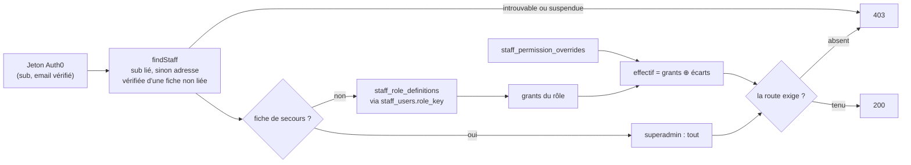

# Stockage et résolution des droits du back-office

> État : **implémenté**, en production depuis le 2026-09-26 (commit de la
> bascule, migration `20260926120000_les_roles_se_lisent_en_base`). Écrit à
> l'affirmative le 2026-09-26, chaque phrase confrontée au code ce jour-là.
> L'histoire — pourquoi les rôles n'étaient pas lus en base, l'état des lieux
> de production, les objections de vitruve — est dans
> [`plan-roles-lus-en-base.md`](plan-roles-lus-en-base.md). Le modèle d'accès
> vu de l'écran (ressources, rôles, dérogations, invitation) est dans
> [`architecture-acces-staff.md`](architecture-acces-staff.md).
>
> ⏸ **En suspens : le « resserrer »** (§7). Tant qu'il n'est pas fait, deux
> mécanismes de transition vivent encore : la colonne `role` et le repli sur
> `ROLE_GRANTS`.

## 1. Ce qui décide, en une phrase

À chaque requête `/admin/*`, le guard trouve **la fiche** de la personne,
lit **la définition de son rôle en base**, lui applique **ses écarts
individuels**, et compare le résultat au droit que la route exige. Le jeton
n'atteste que l'identité ; aucun droit n'y est lu.

## 2. Le stockage

Trois tables du schéma `public` (`prisma/schema/public/staff.prisma`).

| Table                        | Porte                                                      | Contraintes qui comptent                                                                               |
| ---------------------------- | ---------------------------------------------------------- | ------------------------------------------------------------------------------------------------------ |
| `staff_role_definitions`     | un rôle : `key`, `label`, `grants` (jsonb), `archived_at`  | `key` unique ; `CHECK (key <> 'superadmin')` — le super administrateur ne se définit pas, il se résout |
| `staff_users`                | la fiche, et **`role_key`** : le rôle qu'elle porte        | clé étrangère `role_key → staff_role_definitions(key)`, `ON DELETE RESTRICT` : un rôle s'archive       |
| `staff_permission_overrides` | un écart individuel : `resource`, `action`, `allow`/`deny` | unique par `(fiche, ressource, action)` ; supprimé avec la fiche                                       |

- **`grants`** est une liste `[{resource, action}]`, relue avec le schéma Zod
  du contrat (`roleGrantsSchema`, `packages/contracts`). Une ressource est une
  valeur de l'enum Postgres `StaffResource` ; une action est `read` ou `write`.
- **Un rôle se crée, se modifie, s'archive et se restaure** depuis Admin ›
  Rôles. Il n'est jamais supprimé.
- **`staff_users.role`** (enum `StaffRole`) est l'ancienne colonne, nullable.
  Un déclencheur (`staff_users_role_key_sync`) recopie `role` dans `role_key`
  quand `role` est écrit et non nul ; le code écrit toujours les deux ensemble
  (`roleColumns`, `role-assignment.ts`), `role` à `NULL` pour un rôle créé à
  l'écran. Les deux disparaissent au « resserrer ».

## 3. La résolution

Un seul endroit passe d'une fiche à des droits : `resolveHeldRole`
(`apps/lfd-api/src/staff/permissions/infrastructure/held-role.ts`). Le guard
(par `PrismaStaffAccessResolver`), `/admin/me` et la liste de l'annuaire le
lisent tous trois — l'écran ne peut donc pas montrer des droits que le guard
n'applique pas.

| Cas                             | Droits par le rôle                                             |
| ------------------------------- | -------------------------------------------------------------- |
| fiche de secours (§4)           | **tout** (`superadmin`), écarts ignorés                        |
| définition active et lisible    | ses `grants`                                                   |
| définition archivée             | **aucun**                                                      |
| `grants` illisibles             | **aucun**, erreur au log avec la clé ; les autres rôles vivent |
| `role_key` nul (transition, §7) | `ROLE_GRANTS[role]`                                            |

Puis les écarts (`resolvePermissionsFromGrants`, `packages/contracts/src/staff-access.ts`) :

- **`write` entraîne `read`** : accorder l'écriture accorde la lecture ;
- les `allow` s'ajoutent d'abord, les `deny` retirent ensuite — **un refus
  gagne** ;
- **refuser `read` retire aussi `write`** : on n'écrit pas ce qu'on ne voit pas.

**Ce que la route exige** (`platform/auth/staff-access.guard.ts`) :
`@RequirePermission(…)` si la route en déclare une ; sinon la ressource de
`@AdminSurface(resource)` et l'action du verbe — `GET`/`HEAD` → `read`, le
reste → `write`. Une surface sans ressource déclarée est refusée, quels que
soient les droits. `/admin/me` n'exige rien. Tous les refus disent
« Accès refusé. », sans distinguer l'inconnu du non-autorisé.

**Qui est la personne.** `findStaff` cherche la fiche par le `sub` lié ; à
défaut, par l'adresse — seulement si le jeton l'atteste **vérifiée** et que la
fiche n'est **liée à aucun `sub`**. Une fiche liée appartient à son `sub`. Un
`sub` de connexion sociale n'entre pas. Une fiche suspendue n'obtient rien.

## 4. La porte de secours

La **fiche racine** — celle que `ensureBootstrapAdmin` crée au démarrage pour
`BOOTSTRAP_ADMIN_EMAIL` (défaut `dev@lafoliedouce.com`) — résout toujours
`superadmin`, quels que soient son `role_key`, la table et ses écarts. Même si
`admin` est vidé en base ou archivé, quelqu'un peut encore rouvrir l'annuaire.

- 🔴 **L'ancrage est la fiche trouvée par `findStaff`, jamais l'adresse du
  jeton** (`isRescueFiche(fiche.email, …)`). Un compte Auth0 qui annoncerait
  l'adresse de secours sans être lié à cette fiche, ou sans l'avoir vérifiée,
  n'obtient rien.
- `superadmin` n'est attribuable à personne : la table le refuse (`CHECK`).
- L'annuaire montre la fiche comme « Super administrateur · porte de
  secours » ; son rôle et ses écarts ne s'éditent pas (409, cas nommé).
- ⚠️ `AUTH_ADMIN_DEV_BYPASS` (jamais ouvert) déposerait l'adresse de secours
  sur le poste local, qui deviendrait `superadmin`.

## 5. Une modification prend effet

- **Le cache.** Le résolveur garde l'effectif 30 s par `sub`, dans une `Map`
  en mémoire. Toute écriture de rôle (créer, modifier, archiver, restaurer) et
  toute modification d'une fiche (rôle, écarts) ou de son statut le vident (`StaffAccessCache.forgetAll`) : sur
  l'instance qui a reçu le geste, l'effet est immédiat.
- ⚠️ **Sur les autres instances, jusqu'à 30 s.** Assumé. Un retrait qui doit
  être immédiat partout passe par la **suspension** de la personne. Le nombre
  d'instances en production reste à confirmer.
- **Archiver un rôle porté est refusé** (`StaffRoleStillHeldError`), les
  porteurs comptés sur `role_key`.
- **Pas de course entre archiver et attribuer.** Archiver verrouille la
  définition (`FOR UPDATE`) le temps de compter et d'écrire ; attribuer relit
  la définition active sous `FOR SHARE` dans la transaction qui écrit la fiche.
  L'un attend l'autre ; un rôle archivé n'est jamais porté.

## 6. Les invariants de l'annuaire

Tenus par `staff-access.policy.ts` sur le **droit** `staff_access:write`, pas
sur le nom d'un rôle — `admin` s'édite comme les autres :

- **il reste au moins une personne non suspendue qui tient
  `staff_access:write` par son rôle**, la fiche de secours exclue du compte
  (sinon l'invariant serait toujours vrai) — `LastStaffAdminError` ;
- **on ne se retire pas `staff_access:write` à soi-même**, ni par sa fiche, ni
  par un écart, ni en éditant le rôle qu'on porte, ni en se suspendant —
  `SelfDemotionError`.

Ils valent qu'on modifie une fiche, un écart ou une définition.

## 7. ⏸ En suspens : le « resserrer »

La bascule a suivi le rythme « étendre, basculer, resserrer » (`CLAUDE.md` §0).
Les deux premiers temps sont en production ; le troisième attend une décision :

- `staff_users.role_key` passe `NOT NULL` ;
- la colonne `role`, son enum dans le code de la fiche, et le déclencheur
  disparaissent ;
- le repli `ROLE_GRANTS[role]` disparaît de `heldRoleGrants`.

⚠️ **Le retour arrière vers le code d'avant la bascule se ferme** à la
première fiche qui porte un rôle créé à l'écran (`role = NULL`) : l'ancien
code ferait `ROLE_GRANTS[null]`.

## 8. Ajouter un droit

Tant que le repli existe, `ROLE_GRANTS` (`packages/contracts/src/staff-access.ts`)
reste la **graine** : il sème une base neuve (`ensureStaffRoleDefinitions`,
harnais e2e) et sert au repli. Ajouter une ressource demande donc :

1. une migration qui ajoute la valeur à l'enum `StaffResource` — **seule**
   dans sa migration ;
2. une migration qui l'ajoute aux `grants` des rôles concernés, **par clé et
   en ajout seul** : elle n'écrase jamais une définition éditée à l'écran ;
3. la même entrée dans `ROLE_GRANTS`.

`apps/lfd-api/test/staff-role-grants-parity.e2e-spec.ts` rejoue toutes les
écritures de la table depuis la graine du 2026-09-01 et exige l'égalité exacte
avec `ROLE_GRANTS` : oublier l'étape 2 ou 3 le fait échouer. C'est ce trou qui
a fait écrire `20260926120100_les_droits_jamais_ecrits`, pour trois ressources
qui n'existaient que dans le code.

## 9. Où c'est éprouvé

| Fichier                                      | Ce qu'il prouve                                                                                    |
| -------------------------------------------- | -------------------------------------------------------------------------------------------------- |
| `test/staff-roles-in-database.e2e-spec.ts`   | effet immédiat, rôle créé à l'écran, archivé, illisible, secours, déclencheur, verrous, invariants |
| `test/staff-role-keys-migration.e2e-spec.ts` | chaque fiche a sa `role_key` ; une définition manquante est créée depuis le contrat                |
| `test/staff-role-grants-parity.e2e-spec.ts`  | la table rejouée égale `ROLE_GRANTS`                                                               |
| `src/staff/permissions/__tests__/`           | politique, résolveur, définition de rôle                                                           |
