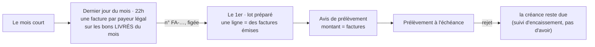

# L'émission de la facture

> 📐 **Plan v2, rien de bâti** (2026-10-08). Touche **l'argent** et un
> document légal : la v1 a été contredite par `vitruve` le même jour (trois
> BLOQUANTS, huit SÉRIEUX), repris au § 9. Les règles du CGI et du Code de
> commerce sont citées **de mémoire**, ni par l'agent ni par moi rouvertes en
> ligne : le cabinet tranche. Reprend
> [`../b2b/architecture-facturation.md`](../b2b/architecture-facturation.md)
> (2026-08-15) là où le code l'a dépassé.

## 1. Le besoin et les décisions d'Hugo

- **2026-10-08** : c'est nous qui émettons, tant qu'un logiciel comptable ne
  le fait pas, et c'est nous qui ferons toujours le fichier de prélèvement.
- **2026-10-08** : profil Factur-X **EN 16931** (version complète).
- **2026-10-08** : F5 (bons en HT pour les pros au compte) attend la facture
  réellement émise.
- **2026-08-15** : une facture pour **toute vente pro** ; la donnée
  structurée fait foi ; numérotation continue et chronologique ; une facture
  émise ne se supprime pas, elle se compense par un **avoir** (381).
- **2026-09-21** : le **public** ne reçoit pas de facture (bon chiffré).

## 2. Ce qui existe (vérifié le 2026-10-08)

- **L'arrêté figé** (`billing_statement`, F3) : par **ligne de débit** (par
  mandat, donc parfois par site), préparé **après** la clôture, sur les bons
  **passés** dans le mois (`billable-order-criterion.ts:49`, `createdAt`). Ses
  dates sont les dates **demandées**, parfois nulles. Il peut être annulé tant
  que le lot n'est pas déposé.
- **L'entité émettrice** porte le bloc vendeur (raison sociale, forme, SIREN,
  TVA, RCS, capital, adresse), pas les mentions de retard.
- **L'acheteur** : `companies.siren` et `tva_intracom` valent `""` par défaut.
- **Les dates de livraison réelles** existent par les faits de retrait et de
  tournée (DF3).
- **Aucune bibliothèque PDF** dans le dépôt.
- **Les remboursements par carte** ne sont pas suivis.

## 3. La décision structurante : la facture avant le lot

La facture récapitulative d'un mois porte sur les **livraisons** du mois et
s'établit **au plus tard à la fin de ce mois** ; sa numérotation est
**chronologique** (CGI art. 289-I-3 et 242 nonies A, de mémoire). Notre
lot, lui, se prépare le 1er, sur les bons **passés**. Les deux ne tiennent pas
ensemble : une facture datée du mois écoulé et numérotée le 1er passerait
après une facture carte du 1er à 00h30 ; une facture qui recopie l'arrêté
facturerait un bon livré le mois suivant.

**Proposé** — la facture devient la pièce, le lot ne fait que l'encaisser :



- La facture remplace l'arrêté comme source du montant : une ligne de lot
  encaisse une ou plusieurs factures émises ; l'arrêté ne naît plus.
- Annuler un lot n'annule aucune facture : elle reste due, le lot suivant la
  reprend.
- Une correction après émission (bon faux, geste commercial) se fait par
  **avoir**, jamais en défaisant la facture.
- Le périmètre passe à la **date de livraison réelle** (Q2) ; un bon non
  livré dans le mois attend le mois suivant.

## 4. Les deux régimes

| Régime            | Émise quand ?                                         | Sur quoi                |
| ----------------- | ----------------------------------------------------- | ----------------------- |
| **Pro au compte** | dernier jour du mois, 22h (heure de Paris)            | les bons livrés du mois |
| **Pro par carte** | **à la livraison** (fait de retrait), pas au paiement | la commande seule       |
| **Public**        | jamais                                                | —                       |

Un paiement par carte avant livraison est un acompte, pas une vente : la
facture suit la livraison. **E5 attend le suivi des remboursements** (plan à
part) : une commande payée, livrée puis remboursée doit produire son avoir.

## 5. Le modèle

`Invoice`, agrégat de `b2b/accounting/domain/` :

```
id, number                 ← FA-<année>-<n°>, attribué à l'émission
legal_entity_id            ← une séquence PAR ENTITÉ ET PAR ANNÉE (§9)
type                       ← 380 facture | 381 avoir (+ invoice_id corrigée)
issued_on, due_on          ← due_on = date du prélèvement / à réception
seller, buyer              ← figés ; buyer = le PAYEUR LÉGAL (Q3)
lines                      ← par produit et par prix (D2), HT repris des bons (F6),
                             + références des bons (BT-13) et dates de livraison RÉELLES
delivery_address           ← si elle diffère de l'adresse de facturation
vat_breakdown, totals
mentions                   ← pénalités (Q4), indemnité 40 €, escompte « néant »,
                             catégorie « livraison de biens », pas d'option débits
document_key, sha256       ← posés UNE fois, après le rendu
```

- **Le statut de paiement n'est pas sur la facture.** Elle est une pièce
  immuable ; « prélevée », « rejetée », « réglée par carte » vivent dans le
  suivi d'encaissement (`collection_*`, `order_collection`).
- **Refus d'émettre**, nommés, sans valeur inventée : acheteur sans SIREN ;
  acheteur assujetti sans TVA ; mentions de retard absentes ; vendeur
  incomplet.
- **Immuabilité** : port `insert` + `attachDocument` (une seule fois) ;
  déclencheur en base qui refuse tout le reste, et `document_key` de NULL à
  une valeur, une seule fois.
- **Numérotation** : un compteur par (entité, année), `FOR UPDATE`, dans la
  transaction de l'émission ; un rollback rend le numéro avec la
  transaction, aucun trou. La facture du mois se fait **payeur par payeur**,
  une transaction courte chacune, pour ne pas bloquer les factures carte.

## 6. Le rendu Factur-X

- **Après** la transaction d'émission, par un fait durable : XML CII EN 16931,
  PDF/A-3 avec le XML embarqué, dépôt en stockage objet, puis
  `attachDocument`. Une facture émise sans rendu est un état visible et
  rejouable.
- **Validation** dans les tests : Schematron CEN EN 16931 (CII) pour le XML,
  **veraPDF** pour le PDF/A-3. Télécharger ces outils et les figer dans le
  dépôt demande l'accord d'Hugo.
- **Le point dur est le PDF/A-3.** E3 commence par un essai borné : si en
  deux jours aucune bibliothèque Node ne passe veraPDF, on prend un service
  de conversion derrière un port, ou un rendu hors Node.
- **Conservation 10 ans** : seau dédié en écriture unique (verrou d'objet ou
  règle de rétention), clé qui n'est jamais réécrite ; l'empreinte prouve,
  le verrou empêche.

## 7 bis. Réponses d'Hugo (2026-10-08)

- **Q1 — oui** : la facture au dernier jour du mois, le lot ne fait
  qu'encaisser des factures émises.
- **Q2 — en suspens** : « la livraison a souvent lieu le lendemain de la
  commande ». La règle ne change le mois que d'une commande passée le
  dernier jour et livrée le 1er (ou plus tard) ; à reconfirmer avec cet
  exemple.
- **Q3 — le principal, et prévenir** : l'acheteur légal est la maison mère ;
  l'émission prévient les rôles facturation de la maison mère **et** des
  sous-comptes dont les bons figurent sur la facture.
- **Q4 — une suggestion à l'écran** : le réglage des pénalités propose le
  taux légal par défaut (BCE + 10 points) comme suggestion, modifiable par
  l'admin ; rien n'est posé d'office.
- **Q5 — à expliquer** : l'unité de mesure de chaque ligne (pièce, kilo,
  litre), exigée par la norme.

## 7. Questions à Hugo (et au cabinet)

- **Q1** — La bascule du § 3 : la facture au dernier jour du mois, le lot
  ne fait qu'encaisser. _Proposé : oui._ C'est ce qui change le plus de
  choses déjà bâties (l'arrêté, F2/F3, l'aperçu, PA2).
- **Q2** — Le mois d'une commande devient celui de sa **livraison réelle**
  (retrait ou dépôt). Un bon jamais retiré ne se facture pas. _Proposé : oui._
- **Q3** — L'acheteur légal d'un site qui suit la facturation de son
  principal : le principal (proposé), même si le site a son propre mandat.
- **Q4** — Les pénalités de retard : le taux légal par défaut est le taux
  BCE + 10 points (L441-10, de mémoire), sauf taux convenu (plancher :
  3 × le taux d'intérêt légal).
- **Q5** — L'unité des lignes : toutes à la pièce (`H87`) ?
- **Au cabinet** : la date d'établissement d'une facture récapitulative, et
  les nouvelles mentions de la réforme (SIREN acheteur, adresse de
  livraison, catégorie d'opération, option débits).

## 8. Les lots

| Lot    | Contenu                                                                                           |
| ------ | ------------------------------------------------------------------------------------------------- |
| **E0** | Q1 à Q5 tranchées ; mentions sur l'entité ; SIREN acheteur exigé ; unité ; refus d'émettre nommés |
| **E1** | l'agrégat `Invoice` (domaine pur), facture et avoir                                               |
| **E2** | tables, numérotation, immuabilité en base                                                         |
| **E3** | essai PDF/A-3 borné, puis le rendu Factur-X validé (Schematron, veraPDF), seau en écriture unique |
| **E4** | la facture du mois (dernier jour, 22h) sur les livraisons ; le lot encaisse des factures          |
| **E5** | la facture carte à la livraison — après le suivi des remboursements                               |
| **E6** | e-mail, « Mes factures », l'onglet facturation de la fiche ; puis F5                              |

## 9. Ce que `vitruve` a relevé (v1, 2026-10-08)

- **BLOQUANTS, corrigés** : Q1 (b) antidatait et cassait l'ordre
  chronologique → la facture au dernier jour du mois (§ 3) ; le périmètre
  « passés » facturait avant la livraison → livraison réelle (Q2) ; un rejet
  bancaire n'appelle pas d'avoir et un dépôt n'est pas un encaissement → le
  paiement quitte la facture (§ 5).
- **SÉRIEUX, corrigés** : ligne de débit contre payeur (Q3) ; mentions
  manquantes — échéance, livraison réelle, SIREN acheteur, adresse de
  livraison, catégorie, débits, BT-13 (§ 5) ; transaction de l'émission et
  rendu après coup (§ 5, § 6) ; arrêté annulé sous une facture émise → la
  facture précède le lot (§ 3) ; facture carte au paiement → à la livraison,
  après les remboursements (§ 4) ; « une seule séquence » révisée en « par
  entité » : une seule entité encaisse aujourd'hui, la décision de 2026-08-15
  n'est pas contredite tant qu'il n'y en a qu'une, mais elle est dite (§ 5) ;
  PDF/A-3 sans bibliothèque ni critère d'abandon → essai borné, veraPDF
  (§ 6) ; conservation sans mécanisme → seau en écriture unique (§ 6).
- **MINEURS, repris** : taux légal des pénalités (Q4) ; dates nulles de
  l'arrêté (§ 2) ; les questions avant E0 (§ 8).
