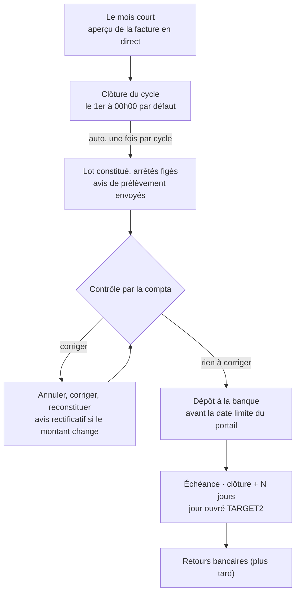

# Le prélèvement automatique

> 🟢 **Plan v2, PA1, PA4, PA2 et PA3 bâtis le 2026-10-08** (PA3 non commité
> à l'écriture de cette ligne ; PA5 plus tard). Touche **l'argent** et finira
> dans un **runbook** : la v1 a été contredite par `vitruve` le même jour
> (trois BLOQUANTS, neuf SÉRIEUX), repris au § 8. Affirmations sur
> l'existant vérifiées dans le dépôt le 2026-10-08.

## 1. Le besoin et les décisions d'Hugo (2026-10-08)

> « Un réglage de prélèvement auto en comptabilité qui donne la clôture
> automatique, l'envoi du message pré-prélèvement, la date où on lance le
> prélèvement. »

- **D1.** L'avis de prélèvement part **à la clôture**, avec la constitution
  du lot — pas après un contrôle.
- **D2.** L'échéance est **la clôture + N jours** (réglage), visée le 5 ou
  le 10 du mois.
- **D3.** Si un lot reconstitué change le montant d'un payeur, un **avis
  rectificatif** part (proposé, accepté).

- **D4 (Hugo, 2026-10-08)** — une constitution tardive ne raccourcit jamais
  le préavis : l'échéance est le plus tard de « clôture + N » et « jour de
  constitution + délai de pré-notification », puis TARGET2. À bâtir avec
  PA2 ; l'écran dit la date repoussée.

## 2. Le mois, tel qu'il se déroulera

Le cycle va d'une clôture à la suivante (`billing-cycle.ts:8-17`) ; la
première tombe le 1er du mois (`plan-lot-de-prelevement-fige.md`, § 6 bis),
et c'est ce qu'on vise ici.

## 3. Le réglage « Prélèvement automatique »

Sur l'**entité émettrice** (Comptabilité › Entités juridiques, à côté de
`preNotificationDays` qui y vit déjà, `accounting.prisma:165`), sous
`b2b_accounting` :

| Réglage                      | Défaut                                    | Règle                                                                                |
| ---------------------------- | ----------------------------------------- | ------------------------------------------------------------------------------------ |
| Constitution automatique     | **désactivée**                            | à la clôture + délai, une seule fois par cycle                                       |
| Délai après clôture          | 1 h                                       | laisse passer le cron de minuit                                                      |
| Échéance : clôture + N jours | = délai de pré-notification (aujourd'hui) | **N ≥ délai de pré-notification**, refusé sinon, avec la raison                      |
| Délai de pré-notification    | 14 j (existe)                             | contractuel ; le réduire (2 j, 5 j…) demande la clause dans les CGV pro et le mandat |
| Date limite de dépôt         | **à renseigner**                          | le cut-off du portail Caisse d'Épargne, inconnu (`prelevement-sepa.md`, question 3)  |

- Activer l'automatisme est un **fait de journal** ; aucune migration ne
  l'active.
- **Prélever le 5 ou le 10** : N = 4 ou 9, ce qui exige un délai de
  pré-notification ≤ 4 ou ≤ 9 jours, donc la clause contractuelle. Tant
  qu'elle n'est pas écrite, le délai reste 14 j et l'échéance au plus tôt
  le 15. **Préalable légal, pas technique.**
- **TARGET2** : l'échéance tombant un samedi, un dimanche, le 1er janvier,
  le Vendredi saint, le lundi de Pâques, le 1er mai, le 25 ou le 26
  décembre glisse au jour ouvré suivant. Le calendrier est une fonction
  pure (Pâques se calcule), sans port ; l'écran affiche la date réelle.

## 4. Ce qui change dans le code

### PA1 — Le calendrier, et l'échéance figée sur le lot

> ✅ **Bâti le 2026-10-08.** Ce qui a été tranché en le bâtissant :
>
> - **Les réglages** vivent sur `legal_entities` (migration
>   `20261008150000_le_calendrier_de_prelevement`, additive) :
>   `auto_collection_enabled` (faux), `auto_collection_delay_hours` (1, borné
>   **1 à 23** : la constitution reste le jour de la clôture, donc le préavis
>   entier en jours de calendrier), `collection_days_after_closure` (N, NULL =
>   le délai de pré-notification, borné 1 à 60), et le cut-off
>   `deposit_cutoff_business_days` (1 à 10 jours ouvrés TARGET2 avant
>   l'échéance) + `deposit_cutoff_time` (`HH:MM`, Paris) — les deux NULL =
>   « à renseigner », un CHECK refuse l'un sans l'autre.
> - **N ≥ délai** est tenu par `LegalEntity` (`CollectionBeforeNoticeError`, 409) dans les deux sens : régler N sous le délai, et porter le délai
>   au-dessus d'un N réglé. Le message nomme les deux valeurs et la clause
>   CGV / mandat.
> - **Deux routes, deux faits** : `PUT …/collection-schedule`
>   (`legal_entity.collection_schedule_changed`, l'après au payload) et
>   `PUT …/auto-collection` (`legal_entity.auto_collection_enabled` /
>   `…_disabled`). Une saisie qui ne change rien n'écrit rien.
> - **Le calendrier** : `collectionCalendar` (`domain/services/
collection-calendar.ts`) sur `target2-calendar.ts` (Pâques par
>   Meeus/Jones/Butcher). La fiche de l'entité porte celui du cycle EN COURS
>   (`nextCollection`) ; le lot porte son échéance figée
>   (`requested_collection_day`, NULL avant) et la date limite de dépôt au
>   cut-off ACTUEL de l'entité. L'aperçu (`pain008.ts`) passe par le même
>   `collectionDayOf`.

- `collectionCalendar(closure, settings)` (pur) : constitution prévue,
  échéance (clôture + N, TARGET2), date limite de dépôt si renseignée.
- Aujourd'hui `ReqdColltnDt` = clôture + `preNotificationDays`, en jours
  calendaires (`pain008-document.ts:225-226`). Il devient l'échéance du
  calendrier. **Valeur par défaut N = délai actuel** : le fichier d'un lot
  constitué après le déploiement ne change que par le report TARGET2.
- Le lot porte `requested_collection_day` (colonne), lu par l'écran et
  l'avis ; le XML, lui, est déjà scellé (`xml`, `fileSha256`). **Changer
  l'échéance d'un lot constitué = annuler et reconstituer** — jamais un
  report en place.

### PA2 — L'avis de prélèvement, à la constitution

> ✅ **Bâti le 2026-10-08.** Ce qui a été tranché en le bâtissant :
>
> - **La boîte d'envoi est transactionnelle** (vérifié le 2026-10-08 :
>   `PrismaOutbox.append` refuse hors `UnitOfWork`). L'avis est une table à
>   lui, `collection_notice` (migration `20261008160000_l_avis_de_prelevement`,
>   additive), écrite avec le lot ; le fait `collection.notice_to_send`
>   (`{ noticeId }`) part dans la boîte d'envoi par `DurablePublisher`, dans la
>   même transaction. L'abonné durable `SendCollectionNotice` envoie APRÈS la
>   validation (comme `MailDeliveryEnRoute`), clé d'idempotence Resend
>   `collection.notice:<id>`, puis écrit l'issue sur l'avis par l'agrégat
>   (`queued` → `sent` | `failed`). L'état se lit donc sur l'avis, pas dans
>   `platform.outbox_delivery` (une jointure `public × platform` serait
>   refusée par `lint:cross-schema-join`).
> - **Destinataire** : le contact `company_contacts.role = billing` de la
>   société payeuse (le plus ancien s'il y en a plusieurs), sinon le
>   détenteur (`memberships.role = owner` → `users.email`). Ni l'un ni
>   l'autre : l'avis naît `unsendable`. Un `membership.role = billing` n'est
>   PAS lu (décision citée : « contact de facturation »).
> - **Le dépôt** (`CollectionBatch.markDeposited`) exige l'avis de chaque
>   ligne `sent` ; une ligne sans avis (lot d'avant PA2) est refusée aussi
>   (`CollectionNoticesNotSentError`, 409, nomme payeur et raison). `depositable`
>   de la vue reste la règle des mandats : le bouton reste actif, l'écran
>   nomme les avis pas partis, le refus du serveur s'affiche tel quel.
> - **Reconstitution** : la promesse d'un payeur est son DERNIER avis du
>   cycle, s'il est `sent` et que son lot est annulé. Termes identiques
>   (montant, jour, RUM) → `unchanged` (rien ne part, la ligne reprend
>   `sent`) ; différents → `correction` (porte l'avant) ; payeur absent →
>   `cancellation` (sans lot ni ligne). Un avis jamais parti ne promet rien :
>   avis neuf. Un rectificatif ou une annulation va à l'adresse d'aujourd'hui,
>   à défaut à celle qui a reçu l'avis corrigé.
> - **D4** : `frozenCollectionDay` (`collection-calendar.ts`) — le plus tard
>   de « clôture + N » et « jour (Paris) de constitution + délai », puis
>   TARGET2. Le lot porte `postponed_from_day` (l'échéance du calendrier
>   quand elle a été repoussée), l'écran dit « repoussée du … ».
> - **Faits** : `collection.notice_queued`, `…_unsendable`, `…_sent`,
>   `…_failed` (jamais l'adresse, seulement `recipientSource`). La
>   reconduction n'est pas journalisée : elle n'annonce rien.
> - **Pas de bouton « renvoyer »** : un avis en échec ou non envoyable se
>   règle en annulant le lot et en le préparant de nouveau. Un redémarrage
>   entre la validation et l'envoi laisse l'avis `queued` (le lot ne se
>   dépose pas) ; même sortie.
> - **Non réglé** : une reconstitution qui ne produit AUCUN lot (tout écarté)
>   n'envoie pas les annulations — elles partent avec la prochaine qui
>   prélève.

- À **chaque** constitution (bouton ou automatisme), un avis par ligne de
  débit, dans la boîte d'envoi, dans la transaction du lot : montant **de
  l'arrêté**, échéance, RUM, ICS, raison sociale du créancier, référence de
  l'arrêté. Minimum du rulebook (montant, date) plus la pratique française
  (RUM, ICS).
- **Destinataire** : le payeur de la ligne (`debtor_company_id`), à son
  adresse de facturation (à relire : le champ exact). Un payeur sans
  adresse joignable est un **signalement** du lot, et sa ligne n'est pas
  déposable tant que l'avis n'est pas parti.
- **Envoyé ≠ mis en file** : chaque ligne porte l'état de son avis, lu de
  la boîte d'envoi (`queued`, `sent`, `failed`). « Marquer déposé » exige
  tous les avis `sent`.
- **Annuler un lot notifié** puis le reconstituer : pour chaque payeur, un
  **rectificatif** si son montant ou son échéance change, une
  **annulation** s'il n'est plus prélevé. Un e-mail parti est parti : on
  le corrige, on ne le reprend pas.

### PA3 — La constitution automatique, une fois par cycle

> ✅ **Bâti le 2026-10-08.** Ce qui a été tranché en le bâtissant :
>
> - **Migration** `20261008170000_la_constitution_automatique`, additive :
>   `collection_batch.constituted_by` (`TEXT`, défaut `staff`, donc les lots
>   existants sont `staff`), `constituted_by_staff_id` rendu nullable, CHECK
>   `collection_batch_constituted_by_author` (`staff` ⇒ fiche, `system` ⇒
>   aucune). Table `collection_autopilot_run`, clé primaire (`legal_entity_id`,
>   `cycle_closes_at`), `ran_at`, `outcome`, `message` ; un `failed` porte
>   son message (CHECK).
> - **Un cinquième état, `pending`** : la tentative est PRISE par
>   l'insertion (`INSERT … ON CONFLICT DO NOTHING`) avant d'agir, puis
>   tranchée — comme l'arrêt automatique du plan
>   (`production_auto_close_attempt`). Deux passages simultanés se
>   départagent en base ; un processus mort entre les deux laisse `pending`,
>   que l'écran dit « interrompue », et qui ne se retente pas.
> - **L'auteur** est un type du domaine (`ConstitutionAuthor` :
>   `{ kind: "staff", staffId }` | `{ kind: "system" }`), porté par
>   `ConstituteCollectionBatchesCommand` : le bouton passe la fiche, le
>   passage `system`. La vue du lot porte `constitutedBy` (`staff` |
>   `system`), jamais une fiche ; aucune lecture ne joignait
>   `constituted_by_staff_id` à l'annuaire (vérifié le 2026-10-08 : il n'était
>   lu que par l'adaptateur d'écriture du lot).
> - **Le passage** `RunCollectionAutopilot` (`POST
admin/accounting/collection/autopilot`, `RecomputeGuard`) : entités
>   activées et non archivées ; cycle = `cycleToConstitute(now).closesAt`,
>   dû si clôture + délai ≤ maintenant ; lit la table, se tait si tenté ;
>   sinon constitue par le bus sous l'acteur `system`/`collection-autopilot`
>   (`BusAutomaticCollectionConstituter`). `NothingToCollectError` →
>   `nothing_to_collect`, une constitution qui n'a fait qu'écarter aussi
>   (message dédié) ; `CollectionNotYetOpenError` → `not_yet_open` ; tout
>   autre refus → `failed` + message, et un log. Fait
>   `collection.autopilot_ran` (sujet : l'entité) écrit avec l'issue.
> - **Le cron** `15 * * * *`, propre, dans `wrangler.jsonc` et
>   `COLLECTION_AUTOPILOT_CRON` (`container/worker.ts`) ; une suite
>   (`apps/lfd-api/container/__tests__/cron-expressions.spec.ts`) vérifie désormais que
>   chaque constante `*_CRON` du Worker est déclarée et routée.
> - **L'écran** : la fiche et l'écran du mois lisent `lastAutopilotRun` sur
>   la vue de l'entité (encadré partagé `autopilot-last-run/`) ; « pas encore
>   branchée » est retiré. Le lot dit « Préparé automatiquement le … »,
>   l'historique « · préparé automatiquement ».
> - **Non réglé, assumé** : une entité qui ACTIVE l'automatisme en cours de
>   mois voit le lot du mois clos préparé au passage suivant s'il n'a jamais
>   été tenté (l'heure prévue est passée) — c'est la règle « heure prévue
>   passée » telle qu'écrite. Si le lot existe déjà (préparé à la main), la
>   tentative est rangée `nothing_to_collect`.

- Table `collection_autopilot_run` (`legal_entity_id`, `cycle_closes_at`,
  `ran_at`, `outcome`) : l'automatisme ne tente **qu'une fois** par cycle.
  Annuler un lot ne le relance pas : reconstituer est un geste humain,
  après correction.
- Un cron horaire **propre** (`15 * * * *`), ajouté aux **deux** listes
  recopiées (`wrangler.jsonc`, `container/worker.ts`) ; son passage lit
  d'abord la table et ne fait rien si le cycle est déjà tenté — pas
  d'assemblage, pas de verrou, pas d'erreur.
- **L'auteur** : colonne `constituted_by` (`staff` | `system`) sur
  `collection_batch`, et `constituted_by_staff_id` devient nullable avec un
  CHECK (`staff` ⇒ id présent). Migration additive ; aucune lecture ne joint
  « système » à l'annuaire.
- Résultats rangés dans `outcome` et visibles à l'écran : `constituted`,
  `nothing_to_collect`, `not_yet_open` (plancher), `failed` (avec le
  message). Aucun n'est avalé.

### PA4 — L'écran « Prélèvement du mois »

> ✅ **Bâti le 2026-10-08.** Ce qui a été tranché en le bâtissant :
>
> - **L'aperçu** : `GET admin/accounting/collection/preview?legalEntityId=`
>   (`GetCollectionPreviewHandler`, lecture `b2b_accounting`). Il passe par
>   `readAssembly` avec un cycle choisi — `cycleAt` (celui qui court) au lieu
>   de `cycleToConstitute` — donc le même `assembleCollection` que le lot :
>   montant de ligne = facture de la ligne. Ni verrou, ni transaction, ni
>   écriture. Il lit TOUT ce qui reste à prélever depuis le plancher : un bon
>   écarté d'un mois passé, ou un mois clos jamais préparé, y figure aussi.
>   `CollectionNotYetOpenError` y devient l'état `not_yet_open` (plancher,
>   première clôture) ; le plancher absent reste un 409.
> - **Contrat en interfaces seules** (`CollectionPreviewView`), aucune valeur
>   zod : rien à rebâtir dans `dist`.
> - **L'écran** remplace `lots-de-prelevement/` (`/comptabilite/lots-de-prelevement`
>   redirige ; rail et tuiles lisent la même table `workspaces.ts`). La frise
>   est un composant partagé avec la fiche de l'entité (`collection-calendar/`).
>   Le bouton « Préparer le lot de septembre » disparaît quand le lot du mois
>   clos existe (préparé ou déposé) ; ses refus s'affichent tels quels.
> - **Pas de « dernière tentative »** de l'automatisme : PA3 n'existait pas,
>   l'écran disait « activée, mais pas encore branchée ». Posée avec PA3.
> - **Pas d'état des avis** : PA2 n'existait pas — posé avec PA2 (colonne
>   « Avis de prélèvement » des lignes, encadré des avis pas partis).
> - **Les aperçus XML/CSV par schéma** ont quitté le tableau de bord pour la
>   carte de l'aperçu. Le tableau de bord garde : émetteur prêt, prochaine
>   date de prélèvement, montant de l'aperçu, lien. Sa carte « Facturation »
>   dit désormais que l'arrêté figé par ligne fait foi, Factur-X à faire.
> - **Le dossier de facturation** reste une page à part, ouverte par un lien
>   depuis l'aperçu ; il n'accepte pas de paramètre de payeur, donc pas de
>   lien par ligne.
> - Le refus serveur « premier cycle prélevable » dit désormais « mois ».

Remplace la page des lots et la carte prélèvement du tableau de bord :

- le **calendrier** du cycle (clôture, constitution, échéance, date limite
  de dépôt ou « à renseigner »), l'état de l'automatisme et sa dernière
  tentative ;
- l'aperçu **calcule la facture** et dit pourquoi il est vide (plancher) ;
- le lot : signalements, lignes, arrêtés, état des avis, « Fichier »,
  « Marquer déposé », « Annuler » ;
- l'historique des lots ;
- la carte « Facturation » du tableau de bord, dont le callout dit « Nous
  n'émettons pas de factures » (`tableau-de-bord-page.html`), est réécrite.

### PA5 — Les retours bancaires (plus tard)

Import `pain.002` / `camt.054` ; un rejet remet les bons « à prélever ».

## 5. Ce que ce plan ne tranche pas

- **FRST / RCUR** : le fichier n'émet que RCUR et OOFF ; la question est
  posée à la Caisse d'Épargne (`prelevement-sepa.md`, question 4).
- **Les mandats ponctuels (OOFF)** suivent le même avis et la même échéance ;
  à confirmer avec la même question.

## 6. Questions à Hugo

- **Q1** — Réduire le délai de pré-notification (clause CGV pro + mandat)
  pour prélever le 5 ou le 10 ? À quelle valeur ? Sans elle : le 15.
- **Q2** — Le cut-off de dépôt du portail Caisse d'Épargne, à demander à la
  banque.
- **Q3** — Activer l'automatisme dès qu'il est bâti, ou après un premier
  mois fait à la main ? _Proposé : un mois à la main._

## 7. Les lots

| Lot     | Contenu                                                                                                            |
| ------- | ------------------------------------------------------------------------------------------------------------------ |
| **PA1** | ✅ 2026-10-08 — réglages, `collectionCalendar` (TARGET2), échéance figée sur le lot                                |
| **PA4** | ✅ 2026-10-08 — l'écran du mois, aperçu en facture, tableau de bord corrigé                                        |
| **PA2** | ✅ 2026-10-08 — l'avis à la constitution, son état, rectificatif et annulation ; dépôt exige les avis envoyés ; D4 |
| **PA3** | ✅ 2026-10-08 — l'automatisme une fois par cycle, cron propre, auteur `system`                                     |

PA1 se bâtit avec N = délai actuel, donc sans attendre Q1 : seul le report
TARGET2 change le fichier.

## 8. Ce que `vitruve` a relevé (v1, 2026-10-08)

- **BLOQUANTS, corrigés** : le calendrier par défaut était intenable (limite
  avant la constitution) → échéance clôture + N ≥ délai, avis à la
  constitution (§ 3, D1-D2) ; l'automatisme reconstituait un lot que la
  compta venait d'annuler → une tentative par cycle, mémorisée (PA3) ;
  l'acteur `system` dans une colonne staff → `constituted_by` (PA3).
- **SÉRIEUX, corrigés** : 720 erreurs par mois → le passage lit la table
  et se tait (PA3) ; le report d'échéance sur un XML scellé → annuler et
  reconstituer (PA1) ; TARGET2 sans source → fonction pure (§ 3) ; date
  limite de dépôt inventée → réglage « à renseigner » (§ 3) ; contenu et
  destinataire de l'avis (PA2) ; avis irréversible → rectificatif et
  annulation (PA2) ; notifié ≠ envoyé (PA2) ; cron partagé avec les
  relances → cron propre, deux listes (PA3) ; ordre des lots (§ 7).
- **MINEURS, repris** : cycle non calendaire (§ 2) ; OOFF et FRST (§ 5).
- **Non vérifié** : le cut-off réel du portail ; un écran qui recalculerait
  l'échéance hors du XML ; la mécanique exacte de la boîte d'envoi
  (transactionnelle ?) et le champ d'adresse de facturation du payeur — à
  ouvrir au début de PA2.
