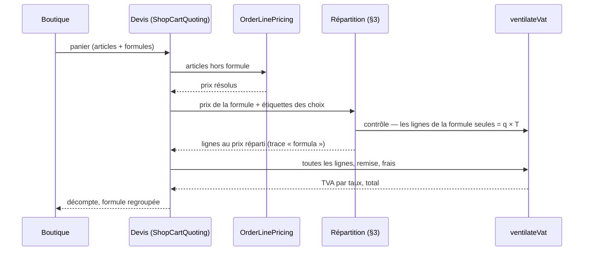

# Plan — les formules

> **État : 📐 plan, rien n'est bâti.** Ouvert le 2026-09-28 sur la demande de
> Hugo : « une sélection de produits de différentes catégories qui ont un tarif
> particulier ensemble ». Premier cas : **le petit déjeuner** — une viennoiserie,
> une baguette, une boisson.
>
> Il touche à l'**argent** : contredit par `vitruve` le 2026-09-28 (**4
> BLOQUANT, 8 SÉRIEUX**), objections reprises au §9. La contradiction a fait
> apparaître un défaut **qui précède les formules et touche déjà la boutique en
> service** : le §2 bis, et le lot F0.
>
> Place réservée depuis le plan de la boutique :
> [`order/boutique-rayon-layout.md`](../order/boutique-rayon-layout.md), ligne
> « Formule » — « un choix par groupe, le prix de la formule appliqué ».

---

## 0. Ce qu'est une formule

Une formule est une **offre commerciale** : des **groupes** (viennoiserie, pain,
boisson), chacun avec ses **choix admis**, et un **prix fixe taxe comprise**. Le
client prend **un article par groupe** ; il paie le prix de la formule, pas la
somme des articles.

```
Petit déjeuner — 3,90 €
├── Viennoiserie : croissant · pain au chocolat
├── Pain         : baguette tradition
└── Boisson      : café · chocolat chaud · jus d'orange
```

Ce n'est **pas** un produit : ni fiche réglementaire, ni allergènes à elle, ni
fabrication. Ses allergènes sont ceux des articles choisis ; ce que le fournil
fabrique, ce sont des croissants et des baguettes.

---

## 1. Ce qui existe, et sur quoi le plan s'appuie

Chaque affirmation a été **ouverte le 2026-09-28**.

| Fait                                                                                                                                                                                                                            | Où                                                                                                |
| ------------------------------------------------------------------------------------------------------------------------------------------------------------------------------------------------------------------------------- | ------------------------------------------------------------------------------------------------- |
| Devis et commande ventilent la TVA par **une seule fonction**, `ventilateVat` : regroupement par taux, un arrondi par taux. Elle ne prend que des **centimes**.                                                                 | `packages/money/src/vat.ts`                                                                       |
| Sa remise (`discountCents`) est **une seule somme**, retranchée **au prorata de TOUTES les marchandises**. Le bon de fidélité s'y ajoute.                                                                                       | `vat.ts`, `computeOrderTotals` (`b2b/orders/domain/services/vat.ts`)                              |
| Une ligne fige `unitPriceMillicents` (HT), `vatRate`, `quantity`, `lineTotalCents` — **arrondi au centime par ligne**, avant toute ventilation —, `unitPriceTtcCents`, `lineTotalTtcCents`, la trace de prix et les allergènes. | `b2b/orders/domain/value-objects/order-line.ts`                                                   |
| La trace de prix doit **aboutir** au prix facturé, sinon `InvalidOrderLineError` (sauf `floored` / `clampedToZero`).                                                                                                            | `order-line.ts`, `assertConsistent`                                                               |
| 🔴 **Un SKU n'apparaît qu'une fois par commande** : `@@unique([orderId, sku])`, et le plan de production agrège par SKU.                                                                                                        | `prisma/schema/public/orders.prisma`                                                              |
| Le prix public est **saisi TTC** (`decidedPublicTtcCents`) ; le HT servi en est déduit en millicentimes par `htMillicentsOf`. « Le TTC fait foi. »                                                                              | `prisma-catalog.reader.ts`, `packages/money/src/tax.ts`, `pricing/architecture-prix-ancre-ttc.md` |
| Devis et commande demandent le prix par `OrderLinePricing.resolve`, qui **additionne les quantités par SKU** avant de résoudre (paliers).                                                                                       | `b2b/orders/application/services/order-line-pricing.service.ts`                                   |
| L'empreinte d'idempotence hache `sku:quantity` trié ; le bon n'y entre **que s'il est présent**, pour que les empreintes d'avant ne bougent pas.                                                                                | `order-fingerprint.ts`                                                                            |
| `lint:dated-decisions` ne lit **que** `b2b/pricing/domain/pricing-materials.ts`.                                                                                                                                                | `dev-toolbox/gates/dated-decisions.mjs`                                                           |
| La boutique publique ne vend qu'**à emporter** (`PUBLIC_SALES_CONTEXT = "takeaway"`, Hugo, 2026-09-21) : le taux est celui de l'article dans ce contexte.                                                                       | `b2b/catalog/domain/public-context.ts`                                                            |

---

## 2 bis. 🔴 Un défaut qui précède les formules : l'étiquette n'est pas toujours ce qu'on encaisse

`vitruve` a montré qu'un prix de formule TTC peut être **impossible à
facturer**. Le même raisonnement vaut pour **n'importe quelle étiquette
publique**, et il a été mesuré sur la chaîne réelle (`htMillicentsOf` →
`lineTotalCents` → `ttcCentsOf`, celle du devis et de la commande), pour une
étiquette de 0,50 € à 10,00 €, quantité 1 :

| Taux  | Étiquettes encaissées à un autre montant | Exemples                          |
| ----- | ---------------------------------------- | --------------------------------- |
| 5,5 % | **49 sur 951** (≈ 5 %)                   | 0,67 € → 0,68 € ; 1,25 € → 1,24 € |
| 10 %  | **86 sur 951** (≈ 9 %)                   | 0,60 € → 0,61 €                   |
| 20 %  | **159 sur 951** (≈ 17 %)                 | 0,51 € → 0,52 €                   |

**La cause est structurelle, pas un arrondi mal placé.** Le HT est arrondi au
centime par ligne, puis la TVA l'est par taux. Le TTC vaut donc
`H + arrondi(H × taux)`, qui saute certains centimes : aucun HT entier ne
donne 0,67 € à 5,5 %. `architecture-prix-ancre-ttc.md` écrit « l'étiquette est
ce que la caisse encaisse » ; la chaîne ne le tient pas pour ces montants.

Ce n'est pas propre aux formules, et ce plan ne le corrige pas en douce. Mais
**les formules ne peuvent pas être plus justes que les articles** : tant que ce
défaut vit, un prix de formule tombe dans les mêmes trous. D'où le lot **F0**
(§6) — mesurer sur le catalogue réel, puis décider — et une question à Hugo
(Q0).

La correction probable est de **faire foi du TTC jusqu'au bout** pour le
public : totaux de ligne en TTC, TVA **extraite** par taux du TTC cumulé, HT
en différence. C'est ce que fait une caisse de boulangerie. Cela change
`ventilateVat` et le scellement des lignes : plan à part, `vitruve` à part.

---

## 2. Les décisions

### D1 — La commande porte les ARTICLES, au prix réparti de la formule

🔴 **Révision de l'orientation donnée à Hugo le 2026-09-28** (« les articles au
prix normal, plus une remise de formule »). `ventilateVat` n'a qu'**une**
remise, répartie sur **tout** le panier : une remise de formule retrancherait
de l'assiette des AUTRES articles et d'autres taux. Dans « petit déjeuner + un
gâteau », le gâteau porterait une partie de la réduction du café.

**Retenu** : chaque article de la formule est une **ligne de commande**, au
prix unitaire égal à **sa part du prix de la formule** (§3). Il n'y a pas de
remise ; la réduction est dans les lignes.

Ce qui en découle sans rien changer : `ventilateVat` et `computeOrderTotals`,
la TVA de chaque article sur son prix réellement payé (la règle d'un menu à
plusieurs taux), les **points de fidélité** sur le HT déjà réduit.

Ce qui **change**, et que la première version taisait (`vitruve`, B1 et B2) :

- **L'unicité `(orderId, sku)` tombe.** Deux petits déjeuners avec le même
  croissant et deux boissons différentes, ou un petit déjeuner plus un
  croissant acheté à part, donnent **deux lignes du même SKU à deux prix**. La
  contrainte devient `(orderId, sku, formula_occurrence_id)`, avec
  `NULLS NOT DISTINCT` : hors formule, la règle d'aujourd'hui tient
  exactement. En deux déploiements : poser le nouvel index, puis retirer
  l'ancien. `lecteur-de-migrations` obligatoire.
- **Les lecteurs par SKU sont à relire, un par un** (lot F3) : le plan de
  production (qui **somme** — ce qu'il doit continuer de faire), les moyennes
  par SKU que le commentaire de la contrainte invoque, le mail, le bon de
  commande, la fidélité, le retrait, la comptabilité. Aucun n'est déclaré
  neutre avant d'avoir été ouvert.
- **La trace de prix gagne un étage `formula`** : prix de référence, prix de la
  formule, part retenue. `assertConsistent` l'accepte quand la trace aboutit à
  la part. C'est un **champ additif** du contrat `@lfd/contracts` : les traces
  d'avant restent lisibles telles quelles.

La ligne gagne `formula: { occurrenceId, key, name, priceTtcCents } | null`.
`null` ne veut dire qu'une chose : **hors formule**. Les commandes antérieures
le sont réellement — aucune formule n'existait —, ce n'est donc pas une
ignorance déguisée.

### D2 — Les choix sont une LISTE d'articles, pas une famille

Une famille entière ferait entrer **en silence** dans une formule à 3,90 € la
viennoiserie à 3,50 € ajoutée demain. Un article n'entre dans une formule que
si on l'y met.

### D3 — Pas de supplément pour commencer

Un choix plus cher n'est **pas admis**. Le supplément se greffera plus tard sur
le choix (un montant, `0` par défaut) sans changer la répartition.

### D4 — Le public seulement

Un compte de société ne voit pas les formules ; une commande de société qui en
porte une est **refusée** — pas ignorée, ce qui afficherait un total que la
commande contredirait (même règle que le bon).

### D5 — Ce qui se cumule

| Terme                      | Sur une formule ?   | Pourquoi                                                                                                                                                                                                                              |
| -------------------------- | ------------------- | ------------------------------------------------------------------------------------------------------------------------------------------------------------------------------------------------------------------------------------- |
| Paliers de quantité        | **non**             | Les articles d'une formule **n'entrent pas** dans la somme par SKU de `OrderLinePricing` : sinon trois petits déjeuners déclencheraient un palier sur le croissant acheté à part, et la part de chacun dépendrait du reste du panier. |
| Remise du point de retrait | **à trancher (Q2)** |                                                                                                                                                                                                                                       |
| Bon de fidélité            | **oui**             | Il porte sur le total.                                                                                                                                                                                                                |
| Gain de points             | **oui**             | Sur le HT réellement payé, déjà réduit.                                                                                                                                                                                               |

### D6 — Le prix de la formule est une décision DATÉE, taxe comprise

- **Taxe comprise** : c'est ce que le public lit. Un prix HT fixe donnerait un
  TTC qui varie avec la boisson choisie.
- **Daté** (`validFrom`, `validTo` nullable) ; changer le prix ferme la version
  en cours et en ouvre une.
- ⚠️ **Aucune porte ne le tient.** `lint:dated-decisions` ne lit que les
  matériaux du prix, et la formule n'en est pas un. Le seul garde est
  l'invariant de l'agrégat (versions sans chevauchement, une seule ouverte),
  éprouvé par ses tests. Étendre la porte à `b2b/formulas/` est possible ; ce
  plan ne le fait pas.

### D7 — La formule vit dans le COMMERCE, pas au PIM

🔴 **Seconde révision** de l'orientation du 2026-09-28 (« la composition au PIM,
le prix au commerce »). Une opération datée est un fait du référentiel que la
réception surcharge ; une formule n'a rien que le référentiel sache mieux dire :
pas de fiche, pas d'allergène propre, pas de canal. Son essence est son prix.
La couper en deux ferait traverser un canal pour que chaque moitié soit
inutilisable sans l'autre.

**Retenu** : `b2b/formulas/`, qui ne connaît les articles que par leur SKU et le
catalogue reçu. La répartition (§3), fonction pure, vit dans le domaine
`orders` qui l'applique ; `formulas` ne l'importe pas — il demande seulement si
un prix est **facturable** (§3.3), par un port. **À confirmer (Q1).**

---

## 3. La répartition

### 3.1 L'entrée et la sortie

- **Prix de référence** de chaque article choisi : son **étiquette publique
  TTC**, telle que la boutique l'affiche (`publicTtcCents`). Pas un HT
  reconverti : c'est l'étiquette qu'on compare, et le client aussi.
- **Sortie** : pour chaque article, un prix unitaire HT **en millicentimes**, à
  poser sur une ligne de quantité `q`.

### 3.2 Le calcul

1. **Parts TTC au prorata, au plus fort reste.** `tᵢ = T × pᵢ / Σp`, tronqué au
   centime ; les centimes restants vont aux plus forts restes (égalité : ordre
   des groupes). `Σtᵢ = T` exactement.
2. **Du TTC au HT** par `htMillicentsOf(tᵢ, tauxᵢ)` — la fonction qui déduit
   déjà le HT des étiquettes. Pas de seconde formule.
3. **Contrôle par la chaîne de la caisse**, pour la quantité réellement
   commandée : `lineTotalCents(htᵢ, q)` pour chaque ligne, puis `ventilateVat`
   sur les seules lignes de la formule. Le résultat doit valoir `q × T`.

⚠️ La marge du millicentime **ne sert pas** au contrôle, contrairement à ce que
disait la première version : `lineTotalCents` arrondit au centime **avant**
`ventilateVat`. Ce qui compte, c'est le centime de ligne.

### 3.3 Quand le contrôle échoue

Il échoue pour les mêmes raisons qu'une étiquette d'article (§2 bis). Il n'y a
**pas** de « correction bornée » : sur un seul taux, certains totaux sont
inatteignables, et déplacer un centime n'y change rien. Sur plusieurs taux, un
centime peut changer de ligne, dans les deux sens, sans jamais faire passer une
part sous zéro. Ce déplacement reste à écrire et à éprouver (F1).

Le refus a lieu **au moment où le prix est posé ou la formule mise en vente**,
pas au paiement : on vérifie **toutes les combinaisons** de choix (le produit
des tailles de groupes — 2 × 1 × 3 = 6 pour l'exemple) pour `q = 1`. Un prix
infacturable est refusé en `BusinessError`, avec la combinaison fautive et les
deux prix voisins facturables.

Une étiquette d'article peut changer **après** la mise en vente. Le devis
refait donc le contrôle ; s'il échoue, la formule est refusée **avec son nom**
(« le prix du petit déjeuner ne se facture plus juste avec le chocolat chaud »,
409), et le back-office la signale. Jamais un 500.

### 3.4 L'exemple

Taux d'exemple ; le vrai vient de l'article.

| Article   | Étiquette  | Taux  | Part de 3,90 € |
| --------- | ---------- | ----- | -------------- |
| Croissant | 1,30 €     | 5,5 % | 1,13 €         |
| Baguette  | 1,20 €     | 5,5 % | 1,04 €         |
| Café      | 2,00 €     | 10 %  | 1,73 €         |
| **Total** | **4,50 €** |       | **3,90 €**     |

Parts brutes 1,1267 · 1,0400 · 1,7333 → 3,89 ; le centime restant va au plus
fort reste, le croissant.

### 3.5 Ce qui n'est pas garanti

Dans un **panier mixte**, le total peut s'écarter d'un centime par taux de
« prix de la formule + étiquettes des autres articles ». C'est déjà vrai sans
formule (`ttcCentsOf` le dit), et c'est le serveur qui dit le total.

**Testé** : chaque combinaison acceptée tombe à `q × T` pour `q` de 1 à 10 ;
un panier mixte s'écarte d'au plus un centime par taux présent.

---

## 4. Le modèle

### 4.1 L'agrégat `Formula`

```
Formula
├── id, key (slug stable), name
├── status : draft | on_sale | withdrawn        — jamais de DELETE
├── groups[] (ordonnés)
│     ├── key, label
│     └── choices[] : sku                       — au moins un
└── prices[] : { priceTtcCents, validFrom, validTo | null }
```

Invariants : au moins **deux** groupes ; au moins **un** choix par groupe ; un
SKU **une seule fois** dans la formule ; versions de prix **sans
chevauchement** ; `on_sale` exige un prix en vigueur. La facturabilité (§3.3)
demande les étiquettes du catalogue : le handler la vérifie par un port avant
`save`.

### 4.2 Ce qu'un choix doit être pour se vendre

Un article **vendu au public** en ce moment. Un article « seulement pendant une
opération » est **refusé** à l'enregistrement. Un groupe vide à la lecture ⇒ la
formule ne paraît pas ; au devis ⇒ refus nommé, pas « SKU inconnu ».

### 4.3 Le panier, le devis, la commande

- **Panier** : une entrée à part, `{ formulaKey, choices: { groupKey: sku },
quantity }`.
- **Devis** : `ShopCartQuoting` résout les articles hors formule par
  `OrderLinePricing.resolve` **comme aujourd'hui**, lit les étiquettes des
  articles de formule, répartit, puis ventile toutes les lignes ensemble.
- **Occurrences** : mêmes choix = une occurrence de quantité `q` ; choix
  différents = deux occurrences.
- **Idempotence** : les formules entrent dans l'empreinte **seulement si le
  panier en porte**, sous une clé à part, triée. Un panier sans formule a
  exactement l'empreinte d'aujourd'hui : une clé en vol au déploiement reste
  valable.

### 4.4 Ce qu'on affiche

Les lignes scellent chacune leur TTC par `ttcCentsOf`. Leur somme peut faire
3,89 € ou 3,91 € là où la ventilation d'ensemble fait 3,90 € : le bon de
commande, le mail et l'historique affichent donc **le prix de la formule, une
fois**, et les articles en dessous **sans prix**. La TVA par taux reste celle
de la commande.



---

## 5. Les écrans

- **Back-office** — une entrée **Formules** : la liste, puis l'éditeur (groupes,
  choix par recherche d'article, prix et son historique, mise en vente,
  retrait). Il affiche le refus de facturabilité avec les prix voisins, et
  signale une formule devenue infacturable.
- **Boutique** — la formule paraît dans un rayon, avec son prix et « au lieu de
  4,50 € ». Le clic ouvre le **dialogue de composition** : un choix par groupe,
  le prix ne bouge pas. Au panier et au récapitulatif, les articles sont groupés
  sous la formule.
- **Mail, bon de commande, historique** — le regroupement du §4.4.

---

## 6. Les lots

| Lot    | Contenu                                                                                                                                                          | Qui                                   |
| ------ | ---------------------------------------------------------------------------------------------------------------------------------------------------------------- | ------------------------------------- |
| **F0** | Mesurer le §2 bis sur le **catalogue réel** (combien d'étiquettes en service sont encaissées à un autre montant) ; Hugo décide (Q0). Pas de code produit.        | moi + Hugo (lecture prod)             |
| **F1** | La répartition et son contrôle (§3), fonction pure du domaine `orders`, tests de propriété sur `q` de 1 à 10.                                                    | `batisseur`                           |
| **F2** | L'agrégat `Formula`, sa migration **additive**, la facturabilité à la pose, l'admin par le bus.                                                                  | `batisseur`                           |
| **F3** | La commande : unicité `(orderId, sku, occurrence)` en deux temps, étage de trace `formula`, relecture de chaque lecteur par SKU, devis, empreinte, refus nommés. | `batisseur` + `lecteur-de-migrations` |
| **F4** | Le back-office.                                                                                                                                                  | `pablo`                               |
| **F5** | La boutique, le mail, le bon de commande.                                                                                                                        | `pablo`                               |

⚠️ **Irréversible au premier merge de F3** : la forme de `formula` sur les
lignes et les parts figées dans des commandes réelles. Un mauvais choix ne se
rattrape que par une migration en trois temps, sur un back-office en service.

---

## 7. Questions à Hugo

- **Q0** — Le §2 bis : on corrige d'abord la chaîne de l'étiquette (plan à
  part), ou on bâtit les formules sous la même garantie que les articles, en
  refusant les prix infacturables ? Recommandation : **F0 d'abord**, puis
  décider sur des chiffres réels.
- **Q1** — La formule vit **entièrement dans le commerce** (D7). D'accord ?
- **Q2** — La **remise du point de retrait** s'applique-t-elle à une formule ?
  Recommandation : **oui** — elle récompense le mode de retrait, pas la
  composition, et l'exclure demanderait une assiette de remise partielle dans
  `ventilateVat`. ⚠️ La formule baisse le sous-total : une remise **à seuil**
  peut ne plus se déclencher sur un panier qui la déclenchait au prix des
  articles.
- **Q3** — Une **plage horaire** (petit déjeuner retiré avant 11 h) ?
  Recommandation : **non** pour commencer.

---

## 8. Hors du plan

Les formules pro (D4), les suppléments (D3), un groupe qui se choisit
plusieurs fois (« 2 viennoiseries au choix »), la vente sur place.

---

## 9. Contradiction par `vitruve` (2026-09-28)

| #   | Objection                                                                               | Sort                                                                                         |
| --- | --------------------------------------------------------------------------------------- | -------------------------------------------------------------------------------------------- |
| B1  | `@@unique([orderId, sku])` refuse deux lignes du même SKU                               | **Corrigé** — D1 : unicité par occurrence, en deux temps ; lecteurs relus en F3              |
| B2  | La trace qui aboutit au prix habituel fait échouer `assertConsistent`                   | **Corrigé** — D1 : étage `formula`, additif                                                  |
| B3  | Certains prix sont infacturables ; l'échec arrivait en 500 au paiement                  | **Corrigé** — §3.3 : refus à la pose, 409 nommé au devis. **Et généralisé** : §2 bis, F0, Q0 |
| B4  | La preuve ignorait la quantité                                                          | **Corrigé** — §3.2 contrôle à `q`, §3.5 tests de 1 à 10                                      |
| S   | Somme des TTC scellés ≠ prix affiché                                                    | **Corrigé** — §4.4                                                                           |
| S   | Les paliers additionnent par SKU                                                        | **Corrigé** — D5 : exclus                                                                    |
| S   | `lint:dated-decisions` ne lit pas la formule                                            | **Assumé et dit** — D6                                                                       |
| S   | « La porte » n'était pas le chemin réel ; référence TTC non définie                     | **Corrigé** — §3.1, §4.3                                                                     |
| S   | Format de l'empreinte                                                                   | **Corrigé** — §4.3                                                                           |
| S   | Effet de seuil de la remise de retrait                                                  | **Remonté** — Q2                                                                             |
| S   | `formula` nullable : trois états ?                                                      | **Répondu** — D1 : `null` = hors formule, vrai aussi du passé                                |
| S   | Irréversible au premier merge                                                           | **Dit** — §6                                                                                 |
| m   | Sens de la correction, part sous zéro                                                   | **Corrigé** — §3.3 ; reste à éprouver en F1                                                  |
| m   | D5 contredisait §4.3 sur la trace                                                       | **Corrigé**                                                                                  |
| —   | Non vérifié par `vitruve` : la porte `context-boundaries` entre sous-contextes de `b2b` | **Contourné** — D7 : `formulas` n'importe pas `orders`, il passe par un port                 |
