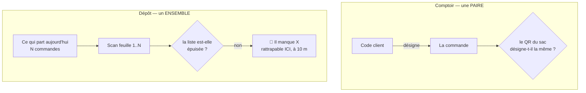

# Remise en livraison — conception v1

**Ouvert le 2026-09-11. Aucune ligne n'est écrite.**

> ⚠️ **Ce document est une v1, pas un premier jet.** Le premier jet a été soumis
> au contradicteur `vitruve`, qui a rendu **quatre objections BLOQUANTES** —
> toutes vérifiées depuis, fichier ouvert. Trois d'entre elles ont changé la
> conception, pas sa rédaction :
>
> 1. le code de remise **n'atteint pas la personne qui réceptionne** ;
> 2. le lecteur de QR **refuse** le code de la feuille d'atelier ;
> 3. la remise en livraison **appartient déjà** au bloc `handover`, dont la
>    déclaration dit « au comptoir **comme sur le pas d'une porte** ».
>
> Ce qui suit intègre ces trois-là. Les objections non résolues sont au §12,
> nommées, et non enterrées.

---

## 1. Ce qui existe, vérifié le 2026-09-11

- **Un jeton par commande**, `orders.handover_token`, `@unique`
  ([`orders.prisma`](../../apps/lfd-api/prisma/schema/public/orders.prisma)). Il
  est émis **sans condition d'acheminement** depuis le 2026-09-07.
- **Les colonnes de remise du commerce sont un SNAPSHOT**, pas la source :
  l'attestation vit dans `production.order_handover`, et `orderId`/`reference` y
  sont `@unique` — une seconde remise est refusée **en base**.
- **La règle de remise ne bloque plus la livraison**
  ([`handover.ts`](../../apps/lfd-api/src/handover/domain/services/handover.ts)).
- **Le fournil prépare déjà le chargement** : `ProductionOrder` recopie
  `fulfillmentMethod` et `destination` — « de quoi poser la feuille sur la bonne
  pile, **et charger le bon véhicule** » — et imprime une feuille par commande,
  sans montant, avec son QR `/colisage/{référence}`
  ([`atelier-sheet-pdf.ts`](../../apps/lfd-api/src/production/domain/services/atelier-sheet-pdf.ts)).
- **Le serveur ne filtre PAS les livraisons.**
  [`handover-queue.reader.ts`](../../apps/lfd-api/src/handover/channels/commerce/handover-queue.reader.ts)
  rend toute la journée, et son champ `fulfillmentMethod` porte déjà le
  commentaire « le coursier charge ici, le client vient ici ». C'est le **front**
  qui écarte (`atTheCounter`). 🔴 Le premier jet affirmait le contraire et en
  tirait que la tournée était sur le chemin critique — voir §3.
- **La route `livraison` est réservée et vide exprès**
  ([`livraison-page.ts`](../../apps/lfc-B2B-admin-frontend/src/app/livraison/livraison-page/livraison-page.ts)).
- **Cinq rôles staff**, et aucun n'est un livreur
  ([`staff-access.ts`](../../packages/contracts/src/staff-access.ts)) : `admin`,
  `commercial`, `comptabilite`, `support`, `dev`.

---

## 2. 🔴 Le trou qui commande tout : le code n'atteint pas la porte

C'est l'objection qui a retourné le document, et elle est structurelle.

Le courriel de passation part à **`recipient.email`, résolu depuis
`event.placedByUserId`**
([`send-order-placed-mail.handler.ts`](../../apps/lfd-api/src/b2b/orders/application/handlers/send-order-placed-mail.handler.ts)) :
c'est le **compte qui a commandé**. Et
[`deliveryContactSchema`](../../packages/contracts/src/address.ts) porte
`{prenom, nom, telephone}` — **aucune adresse e-mail**. Il n'existe donc _aucun
chemin_ pour faire parvenir le QR à la personne qui réceptionne.

Or c'est le cas normal en B2B : un acheteur commande depuis son bureau, un
employé du site réceptionne à 7 h. **La personne derrière la porte n'a jamais
reçu le code.**

⚠️ **Et l'historique est pire** : la migration du 2026-09-07 l'écrit noir sur
blanc — « Rien n'est écrit ici sur les commandes en coursier existantes : elles
n'ont pas de jeton, et leur en fabriquer un rétroactivement inventerait un secret
que personne n'a jamais reçu. »

### Ce que ça invalide

L'idée que « le geste heureux est déjà servi » est **fausse**. Elle n'est vraie
que si l'acheteur est physiquement le réceptionnaire.

### 🔴 Et la sortie facile est piégée

Le schéma l'avait anticipé, à propos de `handedOverVia` :

> sans cette distinction, quelqu'un finirait par **imprimer le code sur le
> colis** « pour les livraisons difficiles », et un coursier scannerait son
> propre carton.

Imprimer le jeton sur la feuille agrafée résoudrait tout — et détruirait la
seule preuve du système. Le scan vaut parce qu'il faut être **deux** ; un code
que le coursier transporte lui-même n'atteste plus rien.

**Trois sorties possibles, et c'est la première décision à prendre :**

|                                                     | ce que ça coûte                              | ce que ça vaut                                                           |
| --------------------------------------------------- | -------------------------------------------- | ------------------------------------------------------------------------ |
| **a.** collecter l'e-mail du contact de livraison   | un champ au carnet, un second envoi, du RGPD | le geste du comptoir, à l'identique                                      |
| **b.** attester `manual` en livraison, assumé       | rien à bâtir                                 | une preuve faible, mais **honnête** — et l'auteur staff reste enregistré |
| **c.** un code **par site**, affiché chez le client | un objet nouveau                             | tient sans e-mail, mais ce n'est plus un secret par commande             |

⚠️ Ne pas choisir **b** par défaut en croyant que **a** viendra plus tard : une
attestation faible qui marche n'est jamais remplacée.

---

## 3. La tournée — ✅ un humain compose, le matin

**Tranché le 2026-09-11.** Pas de dérivation depuis les zones. Un tri
géographique peut **aider** — proposer un ordre, rapprocher ce qui est voisin —
mais il n'attribue rien.

🔴 **Écrire la différence maintenant, parce qu'elle s'efface toute seule.** Un
tri qui range une liste et un système qui compose les tournées se ressemblent à
l'écran. La seule chose qui les distingue est **qui a le dernier mot**, et le
jour où l'aide devient le défaut, plus personne ne sait pourquoi telle commande
est dans tel véhicule — et le répartiteur ne peut plus s'en écarter sans avoir
l'air de se tromper.

**La tournée est donc un agrégat**, au critère du `CLAUDE.md` §3.1 : elle a un
état (en composition → chargée → partie → rentrée) et des transitions qu'on peut
refuser (on ne recompose pas une tournée partie).

### ⚠️ Mais elle n'est pas sur le chemin critique

Le premier jet affirmait que « ai-je tout ? » n'a pas de second terme sans elle.
**C'est faux** : `expectedOn(jour)` filtré sur `delivery` exprime déjà « ce qui
part aujourd'hui ». Tant qu'il n'y a **qu'un véhicule**, la journée EST la
tournée, et la réconciliation marche sans rien inventer.

La tournée devient nécessaire au **deuxième véhicule**. C'est une question de
volume, pas d'architecture — et la réponse appartient à Hugo. La bâtir avant
serait payer un agrégat, un schéma et trois lignes de gate pour un ensemble qui
a un seul élément.

---

## 4. Le chargement : une réconciliation d'ENSEMBLE

Au comptoir, le geste éprouve une **paire** : le code du client _désigne_ la
commande, le QR du sac vérifie que c'est bien celui-là.

Au dépôt, **il n'y a personne en face** : le premier terme n'existe pas. Le
coursier scanne vingt feuilles d'affilée, et ce qu'il vérifie est d'une autre
nature — **« ai-je tout ? »**. Le comptoir compare deux objets ; le dépôt compare
une liste à un véhicule. Deux algorithmes, deux écrans, et deux façons
d'échouer : au comptoir on tend le mauvais sac, au dépôt on en **oublie** un.

**Ce que ça achète vraiment** : la commande manquante se découvre au dépôt, au
seul moment où elle ne coûte rien. Une heure plus tard elle est à quarante
kilomètres, et la journée du client est perdue. C'est un argument plus fort que
la traçabilité.

### 🔴 Deux obstacles techniques, tous deux vérifiés

1. **Le lecteur refuse le code de la feuille.**
   [`tokenOf`](../../apps/lfc-B2B-admin-frontend/src/app/handover-shop/scan-dialog/qr-reader.ts)
   n'accepte que `/retrait/<jeton>` ou un jeton nu. Le QR d'atelier encode
   `/colisage/{référence}` : il rend `null`, et le dialogue **refuse**. Ce refus
   est délibéré et il est bon (« ce qui n'a pas la forme d'un jeton n'atteint
   jamais le réseau ») — il faut donc un **second lecteur**, `referenceOf`, pas
   un assouplissement du premier.
2. **`BarcodeDetector` n'existe pas partout** — le même fichier le dit. Au
   comptoir on choisit le navigateur du poste ; un coursier avec un iPhone n'a
   pas de scanner, et réconcilier vingt sacs à la saisie manuelle n'est pas le
   geste décrit.

### ⚠️ Et un trou à l'endroit exact de l'argument de vente

**Une commande passée après la clôture n'a pas de `ProductionOrder`, donc pas de
feuille, donc pas de QR.** Le sac qu'on oublie le plus est précisément celui qui
est arrivé en retard — et c'est celui que le scan ne peut pas voir. La
réconciliation doit donc partir de **la liste attendue**, et traiter le sac sans
code comme un cas nommé, pas comme un imprévu.

---

## 5. Trois faits, chacun chez celui qui l'observe

| fait                                     | qui le constate         | où il vit                       |
| ---------------------------------------- | ----------------------- | ------------------------------- |
| **colisé** — le bac est fait             | le fournil              | `production_order.packed_at` ✅ |
| **chargé** — le sac est dans le véhicule | le coursier, au dépôt   | **nulle part** 🔴               |
| **remis** — le destinataire l'a          | le coursier, à la porte | `production.order_handover` ✅  |

⚠️ **« Chargé » n'est pas un statut de la commande.** Le statut commercial dit où
en est la vente ; le chargement dit où est un sac. Les confondre oblige chaque
lecteur de statut à connaître la logistique.

⚠️ **Ne pas l'accrocher à `ProductionOrder`** — mais pas pour la raison du
premier jet. L'argument « ça fausserait le compte à produire » ne porte pas :
`packed_at` y vit déjà, et le retardataire n'y est pas non plus. La **vraie**
raison est celle que le gate écrit : la clé d'identité de la production est la
**journée**, celle de la remise est la **commande**. Un sac chargé est indexé par
commande et par véhicule, jamais par plan de fabrication.

---

## 6. À la porte : ce qui manque vraiment

Au comptoir, si personne ne vient, il ne se passe rien. En livraison, le coursier
est **devant une porte** et doit repartir avec une réponse : absent, tiers qui
réceptionne, laissé en lieu convenu, adresse fausse.

🔴 **Un échec n'est pas une remise et ne doit pas s'écrire dans
`OrderHandover`.** Cette table dit « le sac est parti, voici qui l'atteste » ; y
loger une tentative ratée ferait mentir la seule preuve du système.

⚠️ **Et un échec n'a aujourd'hui aucun chemin de retour.**
[`prisma-handover-queue.reader.ts`](../../apps/lfd-api/src/b2b/orders/infrastructure/prisma-handover-queue.reader.ts)
filtre sur `requestedDeliveryDate = jour`. Une commande non remise ne reparaît
donc dans aucune file du lendemain : il faudrait réécrire une date figée à la
passation, qui a déjà alimenté un plan de production. **Le §12 en fait une
question, parce que c'est une décision métier, pas un correctif.**

⚠️ **`signatureRequired` n'est imprimé nulle part** — ni sur le bon client, ni
sur la feuille d'atelier (vérifié le 2026-09-11). Il est convenu, figé, affiché
dans un réglage, et c'est tout. Ce n'est pas « personne ne le lit à la remise »,
c'est **personne, nulle part**. Soit on l'honore, soit on cesse de le promettre.

⚠️ **Le hors-ligne.** Toute l'attestation est un `POST` synchrone. C'est la
différence d'exploitation la plus nette entre un comptoir et une camionnette, et
le premier jet n'en disait rien.

---

## 7. La tranche de livraison — ✅ obligatoire, par heure

**Tranché le 2026-09-11**, dans la foulée du retrait : une commande livrée porte
une tranche **d'une heure**, demandée à la passation.
[`pickupSlots`](../../packages/contracts/src/pickup.ts) montre la découpe à
copier — une heure pleine, la dernière tronquée, et une fenêtre sans borne basse
qui ne se découpe pas.

Ce que ça débloque : la tranche est **demandée**, donc `override`, donc `isLate`
parle. 🔴 Sans cette décision, elle serait venue du carnet, donc `default`, et la
règle se serait tue sur **toutes** les lignes — une colonne « en retard »
définitivement vide.

⚠️ Elle doit tenir dans les créneaux de **réception** du carnet
([`address.ts`](../../packages/contracts/src/address.ts)), comme une tranche de
retrait tient dans une fenêtre d'ouverture. Le mode `perDay` n'est aujourd'hui
branché nulle part — le lecteur de réglages ne reprend que `everyday` et le dit
([`prisma-delivery-defaults.reader.ts`](../../apps/lfd-api/src/b2b/orders/infrastructure/prisma-delivery-defaults.reader.ts)).

### 🔴 La promesse précède le plan

Le client choisit son heure **la veille** ; la tournée est composée **le matin**.
L'engagement est pris avant que quiconque sache quel véhicule passe où.

Ce n'est pas un défaut à corriger, c'est le métier — mais **les tranches
demandées sont une contrainte d'ENTRÉE de la composition, pas une donnée qu'on
découvre à 11 h.** L'écran du répartiteur doit les montrer pendant qu'il compose,
et dire quand un véhicule ne peut pas les tenir : deux 8 h – 9 h à vingt
kilomètres l'un de l'autre sont une promesse que personne ne tiendra.

⚠️ **Deux retards, pas un** : celui du **sac** (la tranche du client) et celui du
**véhicule** (la tournée dérive, vingt commandes basculent d'un coup sans
qu'aucune n'ait bougé). Une seule alarme ferait chercher vingt causes là où il y
en a une.

---

## 8. Ce qui se mutualise — et ce qui en a l'air

**Vraiment mutualisable :**

- le **jeton** et `POST admin/handover/:token` — un seul chemin d'attestation,
  déjà vrai pour les deux acheminements ;
- `OrderHandoverView`, la vue **sans aucun montant**, obtenue au prix d'un
  chantier entier. Un coursier ne doit pas plus voir un prix négocié qu'un
  opérateur de comptoir ;
- `stillRemittable` et `isLate` — deux fonctions pures de
  [`handover-queue.ts`](../../apps/lfc-B2B-admin-frontend/src/app/handover-shop/handover-queue.ts).

⚠️ **Correction du premier jet** : il rangeait `handover-queue.ts` en bloc du
côté non-mutualisable **tout en citant `stillRemittable` comme réutilisable** —
or il y vit. C'est le **fichier** qui n'est pas mutualisable en bloc, pas ses
règles une par une.

**Faussement mutualisable :**

- `pickupTabs` — un onglet par point de retrait. Une tournée n'est pas un point :
  un point est fixe et partagé, une tournée est composée le matin ;
- `atTheCounter` — écarte précisément ce dont parle ce document ;
- `queueCounters` — « combien attendent au comptoir » n'a pas d'équivalent :
  personne n'attend devant une camionnette ;
- `HandoverSubjectReader` — il porte `pickupLabel` et **ni adresse livrée, ni
  contact, ni fenêtre**
  ([`handover-subject.reader.ts`](../../apps/lfd-api/src/handover/channels/commerce/handover-subject.reader.ts)).
  Un coursier qui l'utiliserait tel quel **ne saurait pas où aller**.

🔴 **Ne PAS dupliquer le lecteur de file serveur.** `get-handover-queue` est le
seul endroit où le commerce et la remise se rencontrent ; en écrire un second
rouvrirait les deux vérités que le chantier vient de fermer. La livraison
**étend** ce port, elle n'en crée pas un jumeau.

---

## 9. Où ça vit — 🔴 corrigé

Le premier jet créait un contexte `delivery/` pour la remise en livraison.
**C'était faux**, et le gate le dit depuis le 2026-09-10
([`context-boundaries.mjs`](../../dev-toolbox/gates/context-boundaries.mjs)) : le
bloc `handover` est « **LE TRANSFERT DE GARDE, au comptoir comme sur le pas d'une
porte** ». Créer un second contexte sur ce périmètre, c'est réfuter une
déclaration datée sans le dire.

**Le partage juste :**

- **la REMISE reste dans `handover/`**, quel que soit l'acheminement. C'est déjà
  sa définition ;
- **ce qui est neuf est la LOGISTIQUE** — composer une tournée, charger un
  véhicule, consigner une tentative ratée. Ça, `handover/` ne le couvre pas.

**Trois choses à faire, que le premier jet ignorait :**

1. `BLOCK_OF` du gate — « un dossier absent de cette table fait **échouer** le
   gate ». Un `src/delivery/` non déclaré rend `lint:context-boundaries` rouge au
   premier commit.
2. **La flèche n'est pas celle qu'on croit.** Si `delivery` publie un port que le
   commerce implémente, l'import réel est **`b2b → delivery`** — c'est cette
   arête qu'il faut autoriser, avec sa surface
   `delivery/channels/commerce/`. `delivery → b2b` reste interdit, comme
   `production → b2b`.
3. **`delivery → handover`** doit être autorisé ou remplacé par un port. Le
   premier jet laissait la question ouverte _tout en_ réutilisant
   `HandoverSubjectReader` : les deux ensemble laissaient `delivery` sans aucune
   source de données.

⚠️ Le schéma Postgres doit être choisi explicitement : deux portes le surveillent
(`lint:prisma-model-ownership`, `lint:prisma-schema-layout`), et `order_handover`
vit déjà dans le schéma `production` alors que son code est dans `src/handover/`.

---

## 10. 🔴 Les droits : il n'existe pas de coursier

La remise est gardée par `@AdminSurface("b2b_orders")`, et les cinq rôles staff
ne comprennent aucun livreur. **Donner le scan à un coursier aujourd'hui revient
à lui donner `commercial`** — prise de commande, tarification négociée, carnet
clients.

C'est un déplacement de **frontière de sécurité**, donc le chantier reste sous
`vitruve` d'office (`CLAUDE.md` §9 bis). Et c'est une décision à prendre avant
l'écran, pas après : un rôle ajouté plus tard laisse derrière lui tous les
comptes créés entre-temps.

---

## 11. Ce qu'il ne faut PAS faire

- **Imprimer le jeton sur le colis.** Le schéma l'a écrit avant nous : un
  coursier scannerait son propre carton, et la preuve ne prouverait plus rien.
- **Assouplir `tokenOf`** pour qu'il avale `/colisage/`. Son refus est le point
  de la fonction ; il faut un second lecteur.
- **Écrire le chargement dans les tables du commerce.** Le fournil a mis deux
  déménagements à en sortir.
- **Faire du chargement un `OrderStatus` de plus.**
- **Copier l'écran de la file** en remplaçant les onglets de point par des
  onglets de tournée. Deux écrans qui se ressemblent valent mieux qu'un écran qui
  sait qu'il est deux choses.
- **Bâtir la tournée avant d'avoir deux véhicules** (§3).

---

## 12. Ce qui reste à trancher

Par ordre de ce que ça bloque.

1. 🔴 **Comment le code atteint-il la porte ?** — §2, trois sorties. Rien ne se
   dessine tant que ce n'est pas tranché.
2. 🔴 **Un rôle coursier existe-t-il ?** — §10. Frontière de sécurité.
3. 🔴 **Combien de véhicules ?** — décide si la tournée est à bâtir maintenant
   (§3) ou si la journée suffit.
4. **Que devient une livraison ratée ?** Elle ne peut revenir dans aucune file
   sans réécrire une date figée qui a déjà alimenté un plan (§6).
5. **Qu'est-ce qu'une signature, ici ?** Juridique avant d'être technique (§6).
6. **Qui voit les tranches demandées au moment de composer ?** Sans elles, la
   promesse de la veille est perdue à l'instant du plan (§7).
7. **Que fait-on hors-ligne, au pas de la porte ?** (§6)
8. **Le double scan vaut-il ici ?** La paire existe — le sac porte sa feuille, le
   destinataire son code — mais scanner deux fois sous la pluie, une main prise,
   est une décision d'exploitation.

---

## 13. Ce que ce document n'a PAS vérifié

Écrit pour que le lecteur suivant sache jusqu'où on a regardé.

- **Le volume réel** — combien de livraisons par jour, combien de véhicules.
  Toute la question 3 en dépend, et rien dans le code ne le dit.
- **L'état de `BarcodeDetector` sur iOS aujourd'hui.** L'affirmation vient d'un
  JSDoc non daté ; si Safari le supporte désormais, la seconde moitié de
  l'obstacle du §4 tombe — pas la première.
- **Ce qu'un schéma Postgres `delivery` ferait à `lint:cross-schema-join`.**
- **Le journal d'activité** : rien n'a été regardé sur ce qu'il faudrait y
  inscrire pour « chargé » et « échec », deux faits dont l'unique usage est de
  répondre à une contestation.
- **Le coût de sortie.** Un bloc de premier niveau, ses lignes de gate, son
  schéma et ses migrations ne se défont pas après un merge — et `merger dans
main déploie`. Le nombre de fichiers n'est pas estimé ici.
