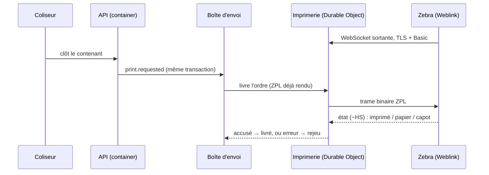

# Les imprimantes thermiques — plan

> Hugo, 2026-10-04 : « un système de websocket pour mes imprimantes thermiques,
> deux besoins, prod et colisage : à la clôture d'un container avec son
> contenu, faire imprimer l'étiquette » ; « sans ordi, qu'elle soit connectée
> à la socket ». Imprimantes **pas encore achetées**. État : **doc-first**.
> `vitruve` d'office : une nouvelle entrée publique (frontière de sécurité).

## 1. Ce qui existe (relu le 2026-10-04)

- L'étiquette d'un bac est une page A4 imprimée par le navigateur
  (`livraison/bin-label/bin-label.ts`, `window.print()`). Son JSDoc garde la
  question ouverte : « Q22 — imprimante d'étiquettes ou planche A4 adhésive ».
  Elle porte la tournée et le rang en très gros, la référence, le type de bac
  et la moitié, « partagé avec … », le code court et le QR.
- Un bac naît quand le coliseur le **déclare** (`delivery.delivery_bin`), pas
  quand on l'imprime : imprimer est une lecture.
- La passerelle (`gateway/`) est le **seul** chemin public vers l'API ; l'API
  a un Durable Object (`Backend`) et dort après une heure d'inactivité.
- La boîte d'envoi (`journalisation/plan-boite-d-envoi.md`, BE1 en cours)
  donne la publication durable, l'état par abonné et le rejeu.

## 2. Le matériel : une Zebra Link-OS en Weblink

Une Brother réseau n'ouvre aucune connexion vers un serveur à nous : elle
attend qu'on lui envoie un travail. Une **Zebra Link-OS** (ZD421, ZD621 ; pas
ZD220/ZD230/ZT111) le fait par sa fonction **Weblink** : elle ouvre elle-même
une WebSocket TLS sortante vers l'URL qu'on lui configure, et y reçoit du ZPL.
Pas d'ordinateur, pas de port ouvert au fournil.

Relevé le 2026-10-04, sources dans la conversation et ici :

- pas de certificat « signé par Zebra » : on charge sur l'imprimante la racine
  de l'autorité qui signe le certificat servi (`WEBLINK1_CA.NRD`) ; figer
  l'autorité chez Cloudflare (Advanced Certificate Manager) ; NTP réglé ;
- authentification de l'imprimante par HTTP Basic à l'ouverture ;
- ping/pong toutes les ~60 s, trames binaires, plusieurs canaux (principal,
  configuration, données brutes), chacun une WebSocket.

**Risque non levé** : la poignée de main TLS (suites de chiffrement, SNI)
entre le firmware et le bord Cloudflare. Aucun retour derrière Cloudflare.
→ **Lot IM0 avant tout achat en nombre.**

## 3. L'architecture

- **L'Imprimerie** : un Durable Object **par imprimante**, qui tient sa
  connexion (API d'hibernation : il dort sans la couper). L'API ne tient
  aucune socket : elle dort, elle.
- **Entrée publique** : une route dédiée de la **passerelle**
  (`/printers/connect`), qui authentifie l'imprimante et transmet la
  WebSocket à son Durable Object. Aucune autre route n'y mène ; l'imprimante
  ne peut rien appeler d'autre.
- **L'ordre d'impression est un fait durable** (`print.requested`), écrit dans
  la transaction du geste qui le déclenche. Son abonné livre à l'Imprimerie.
  Imprimante hors ligne : l'ordre attend et part à la reconnexion ; au-delà de
  dix essais, il est mort, visible et rejouable.
- **Le gabarit est rendu en ZPL côté serveur.** L'imprimante ne fait que
  recevoir. Changer une étiquette ne touche ni l'imprimante, ni l'Imprimerie.
- **Accusé** : après l'envoi, l'Imprimerie demande l'état (`~HS`) ; papier
  vide ou capot ouvert = erreur nommée, que la carte de santé et le poste
  affichent (« plus d'étiquettes au poste colisage »).
- **Réimprimer** crée un nouvel ordre (une lecture, comme aujourd'hui).

## 4. Les données

- `printers` (configuration, pas d'agrégat) : nom, rôle (`packing`,
  `production`), identifiant Basic (secret haché, jamais en clair), largeur
  d'étiquette, actif. Réglé à l'écran par un droit neuf ; une migration
  ajoute la ressource, **jamais** le droit d'un rôle.
- Aucune table d'ordres : c'est la boîte d'envoi.
- Le secret d'une imprimante se saisit à l'écran et se tape sur l'imprimante
  (utilitaire Zebra) ; il ne passe jamais par une ligne de commande.

## 5. Questions pour Hugo

- **Q1 — Production : quoi, et quand ?** Une étiquette par fournée, par
  chariot, par feuille d'atelier ? Au geste « sorti du four », à la clôture ?
- **Q2 — Colisage : une étiquette par bac** (contenu, tournée, rang, code,
  QR), comme l'A4 actuelle, à la **déclaration** du bac ? Ou par commande ?
- **Q3 — Format** : largeur et hauteur d'étiquette (ex. 100 × 150 mm).
- **Q4** : une imprimante par poste, ou une partagée ?

## 6. Lots

| Lot | Contenu                                                                                              | Migration |
| --- | ---------------------------------------------------------------------------------------------------- | --------- |
| IM0 | **Essai** : une Zebra, un Worker de test, la racine chargée ; on lit son journal. Décide de l'achat. | non       |
| IM1 | Route de la passerelle, Imprimerie (Durable Object), table `printers`, écran de réglage              | additive  |
| IM2 | `print.requested` sur la boîte d'envoi, rendu ZPL, accusé `~HS`                                      | non       |
| IM3 | Étiquette de bac à la déclaration (Q2) ; « réimprimer »                                              | non       |
| IM4 | Étiquettes de production (Q1)                                                                        | non       |

IM1 attend BE1 (la boîte d'envoi) et le verdict d'IM0.
