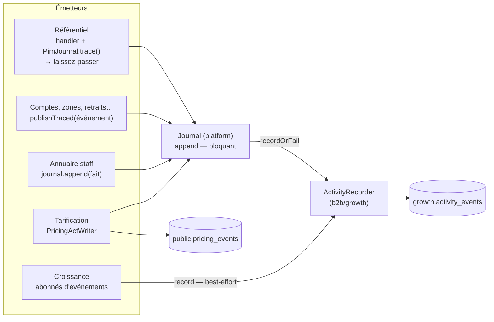

# La journalisation — comment un geste devient une trace

> **La porte d'entrée.** Ce document dit comment la journalisation marche dans
> tout le backend, telle qu'elle tourne en production au **2026-09-18**, vérifiée
> contre le code ce jour-là. Chaque projet garde le détail de ses faits :
>
> - le journal d'activité, son modèle et sa lecture —
>   [`../b2b/architecture-journal-activite.md`](../b2b/architecture-journal-activite.md) ;
> - la mécanique bloquante, née au référentiel —
>   [`../pim/journalisation-et-tracabilite.md`](../pim/journalisation-et-tracabilite.md) ;
> - l'annuaire staff —
>   [`../staff/journalisation-staff/architecture-journal-de-l-annuaire.md`](../staff/journalisation-staff/architecture-journal-de-l-annuaire.md) ;
> - l'auteur d'un acte —
>   [`../staff/plan-l-auteur-est-la-fiche.md`](../staff/plan-l-auteur-est-la-fiche.md).
>
> Ce qui reste à faire est dans [`todo-journal-activite.md`](todo-journal-activite.md)
> et [`todo-doublon-du-journal-dans-une-transaction.md`](todo-doublon-du-journal-dans-une-transaction.md),
> et nulle part ailleurs.

## Table des matières

1. [En une phrase](#s1)
2. [Une table, deux garanties](#s2)
3. [Les trois chemins d'écriture](#s3)
4. [Ce qu'une ligne contient](#s4)
5. [L'auteur](#s5)
6. [L'idempotence](#s6)
7. [Le journal tarifaire, et pourquoi il a sa table](#s7)
8. [La lecture : l'écran Journal](#s8)
9. [Ce qui empêche d'oublier](#s9)
10. [Ce qui s'appelle « journal » sans en être un](#s10)
11. [Où est le code](#s11)

---

## 1. En une phrase

Un geste qui change ce qui est vendu, facturé, ou ce que quelqu'un a le droit
de voir écrit **un fait** dans `growth.activity_events` — dans la **même
transaction** que le geste quand on doit pouvoir en répondre —, avec son auteur
**figé** au moment où il agit, et l'écran Journal du back-office le rend en
phrase.

---

## 2. Une table, deux garanties

Il n'y a qu'**un** journal d'activité : « que s'est-il passé avant que ça
casse ? » traverse les modules, et deux journaux seraient deux vérités. Un
module n'est pas un emplacement, c'est un **filtre** dérivé du préfixe du type
de fait (§8).

Mais tous les faits ne coûtent pas la même chose s'ils se perdent. Le port
`ActivityRecorder` (`b2b/growth/domain/ports/activity-recorder.ts`) offre donc
**deux garanties**, et c'est l'émetteur qui choisit :

|               | `record` — **analytique**                                                        | `recordOrFail` — **opposable**                                 |
| ------------- | -------------------------------------------------------------------------------- | -------------------------------------------------------------- |
| Une panne     | journalisée puis **avalée** : le geste réussit quand même                        | **remonte** : la transaction du geste est annulée              |
| Pour          | une étape franchie, une commande prête, un lead capté                            | une fiche modifiée, un droit accordé, un prix posé             |
| Pourquoi      | perdre la trace dégrade une statistique ; casser le geste dégraderait le service | une trace manquée en silence laisse croire que rien n'a changé |
| Qui l'emploie | les abonnés de `b2b/growth/application/handlers/` et commandes de croissance     | tout ce qui passe par le port `Journal` (§3)                   |

Les deux passent par le **même** append (`prisma-activity-recorder.ts`) : seul
le `catch` diffère. Deux chemins d'écriture auraient divergé, et c'est le
rare — celui qui doit être fiable — qui aurait pourri en silence.

---

## 3. Les trois chemins d'écriture

Les blocs métier ne voient pas `growth` (matrice des frontières, CLAUDE.md §3).
Ils écrivent au port **`Journal`** de la plateforme
(`platform/journal/journal.ts`, promu là le 2026-08-25), et c'est la racine de
composition (`appBootstrap/journal.module.ts`) qui le branche sur
`ActivityRecorder.recordOrFail`. `Journal.append` est donc **toujours
bloquant**.

**1. Le référentiel (`pim/`)** — le handler appelle `PimJournal.trace()` dans
une `UnitOfWork`, et reçoit un **laissez-passer** (`WriteTicket`) sans lequel
son dépôt refuse d'écrire : oublier la trace ne compile pas. Ses faits portent
des diffs et une **portée** (`blast`) que seul le handler sait calculer.
Détail : [`../pim/journalisation-et-tracabilite.md`](../pim/journalisation-et-tracabilite.md).

**2. Les actes nommés (`b2b/account`, zones, points de retrait, heures limites,
mandats…)** — l'événement de domaine **est** le fait : il implémente
`JournaledEvent.journalFact()` (`platform/journal/journal-fact.ts`), et
`publishTraced(event)` écrit au journal **puis** publie sur le bus
(`platform/events/cqrs-domain-event-publisher.ts`). Une seule description pour
le bus et pour le journal : l'écrire deux fois était la vraie source de dérive.

**3. L'annuaire staff (`staff/`)** — chaque handler appelle `journal.append`
dans sa `UnitOfWork`, avec l'avant et l'après de ce qui a changé.
Détail : [`../staff/journalisation-staff/architecture-journal-de-l-annuaire.md`](../staff/journalisation-staff/architecture-journal-de-l-annuaire.md).

**Et la croissance** écrit en direct à l'`ActivityRecorder`, en **best-effort**
(`record`) : ses abonnés tournent hors de la requête, et leurs faits
(`order.placed`, `order.ready`, `lead.*`…) servent le cockpit commercial, pas la
preuve.

La tarification est au §7.

---

## 4. Ce qu'une ligne contient

L'émetteur ne fournit que **ce qui s'est passé** (`JournalFact`) : un `type` en
vocabulaire métier (`company.payment_terms_granted`), un sujet
(`subjectType` + `subjectId`), une charge utile petite, et un instant métier
s'il en connaît un autre que maintenant. **Tout le reste est dérivé** par
l'adaptateur, parce qu'un émetteur qui devrait le fournir finirait par se
tromper :

| Colonne                    | D'où                                                               |
| -------------------------- | ------------------------------------------------------------------ |
| `id`                       | ULID (`IdGenerator`) — trie par le temps, pagine l'écran           |
| `occurred_at`              | l'émetteur, sinon le `Clock` (l'instant gelé de la requête)        |
| `recorded_at`              | `now()` en base — l'écart avec `occurred_at` trahit un fait rejoué |
| `trace_id`                 | le `traceparent` de la requête, sinon une trace neuve (cron)       |
| `actor_type`, `actor_id`   | l'acteur du contexte de requête (§5)                               |
| `actor_name`, `actor_role` | **figés** à l'écriture (§5)                                        |
| `idempotency_key`          | dérivée (§6)                                                       |

La charge utile reste **petite et lisible sans rouvrir la base** : des libellés
figés, pas des clés. Une fiche renommée, un rôle supprimé : la ligne se relit
toujours.

---

## 5. L'auteur

L'**acteur** d'une requête est posé une fois, dans le contexte de requête
(`platform/context/`), par le garde qui sait qui agit :

| Qui agit        | Posé par                                         | `actor_id`                                  |
| --------------- | ------------------------------------------------ | ------------------------------------------- |
| un client       | `AuthGuard` (garde global)                       | l'id de `users` — jamais le `sub`           |
| un membre staff | `StaffAccessGuard`, après résolution de la fiche | l'id de la **fiche** — jamais le `sub`      |
| une tâche       | `RecomputeGuard`, ou rien (hors requête)         | `null` / un marqueur, `actor_type = system` |

Le **nom et la fonction** sont résolus par `ActorNamer`
(`b2b/growth/infrastructure/prisma-actor-namer.ts`) **au moment de l'acte**, et
figés dans `actor_name` / `actor_role` : le journal dit qui a agi ce jour-là et
à quel titre, pas qui porte ce nom aujourd'hui. Une panne de résolution n'empêche
pas d'écrire — un fait anonyme vaut mieux qu'un fait perdu.

**Le `sub` Auth0 n'est plus un auteur nulle part** depuis le 2026-09-18 : il est
sorti du type après l'authentification, l'historique a été converti, et deux
portes (`lint:subject-readers`, `lint:auth0-id-readers`) tiennent la liste de
ceux qui le lisent encore — pour l'identité seulement. Les faits écrits sous un
`sub` que la base n'a jamais relié à une fiche restent tels quels, et se
nomment quand même par leur `actor_name` figé.

---

## 6. L'idempotence

La clé est `type:subjectId:traceId`, dérivée par
`b2b/growth/domain/activity-event.ts`, unique en base. Un fait rejoué **par la
même requête** (même `traceparent`) retombe sur la même clé, et le recorder
traite la violation d'unicité (`P2002`) comme « déjà journalisé ».

La clé est la **trace**, pas l'horloge : deux gestes identiques à la même
seconde, venus de deux requêtes, sont deux faits.

> 🟠 **Limite connue** : ce `P2002` avalé est juste hors transaction ; **dans**
> une `UnitOfWork`, l'`INSERT` refusé met la transaction Postgres en échec et le
> geste est annulé au commit —
> [`todo-doublon-du-journal-dans-une-transaction.md`](todo-doublon-du-journal-dans-une-transaction.md).

---

## 7. Le journal tarifaire, et pourquoi il a sa table

Un acte tarifaire (poser, suspendre, reprendre, archiver une règle, un plancher,
un barème, un engagement, une mercuriale) s'écrit **deux fois, dans la même
transaction que l'état**, par `PricingActWriter`
(`b2b/pricing/infrastructure/pricing-act.writer.ts`) :

- dans **`public.pricing_events`**, le journal **du domaine** : append-only,
  aucune colonne mutable, aucun port qui mette à jour ou efface — sur un prix
  négocié, la question de six mois plus tard est « qui a décidé ça, et qui l'a
  arrêté », et un journal réinscriptible ne le prouverait pas ;
- dans **`growth.activity_events`**, son **miroir général**, par `Journal.append`
  — pour que la tarification apparaisse au journal commun (module
  « commercial »).

Ce n'est donc pas un second journal qui concurrence le premier : c'est la
tarification qui garde sa propre preuve, lue par son écran (`GET
/admin/pricing/journal`), **et** alimente la chronique commune.

**Une exception, une seule, datée** : la migration
`20260918190000_conversion_des_auteurs_staff` a traduit l'auteur de
`pricing_events` du `sub` vers l'id de fiche (accordé par Hugo le 2026-09-18).
Elle est écrite dans le JSDoc du modèle, et ne vaut pas précédent.

---

## 8. La lecture : l'écran Journal

`GET /admin/activity` (`b2b/growth/http/admin-activity.controller.ts`), sous la
permission `activity:read` — réservée à `admin` : le journal traverse tous les
modules, et le ranger sous l'un d'eux donnerait à son audience l'activité des
autres par la bande.

- **Module** — dérivé du préfixe du `type` (`b2b/growth/domain/activity-module.ts`),
  pas stocké : `pim`, `commercial` (dont les prix négociés), `commandes`,
  `comptes`, `equipe`. Un type qui ne se range plus sous un préfixe se renomme.
- **Filtres** — `module`, `type`, `subjectType`, `subjectId`, `actorId`,
  période ; un seul constructeur SQL (`activity-journal.where.ts`). Le filtre par
  acteur suit une personne sous **tous** ses identifiants (id de fiche et `sub`
  successifs, table `staff_subject_aliases`).
- **Recherche** `q` — 2 à 100 caractères, sur le nom de l'auteur, la charge
  utile, ou l'identifiant exact du sujet.
- **Pagination** par l'`id` ULID, donc par le temps.
- **Le rendu** en phrases françaises vit au front
  (`lfc-B2B-admin-frontend/src/app/admin/journal/`) : `journal-line.ts` pour
  tous les faits, `staff-line.ts` pour ceux de l'équipe.

Ailleurs, des lecteurs ciblés : l'attribution d'un diff de révision PIM
(`PimJournalReader`, qui lit le journal d'un produit sur un intervalle), le
journal tarifaire, le cockpit commercial.

---

## 9. Ce qui empêche d'oublier

La journalisation repose sur une discipline, et une discipline se perd sans
bruit — la faute ne se voit que le jour où l'on demande « qui a changé ça ».
Ce qui la tient, du plus fort au plus faible :

| Garde-fou                                       | Ce qu'il tient                                                                                                                                                                                    |
| ----------------------------------------------- | ------------------------------------------------------------------------------------------------------------------------------------------------------------------------------------------------- |
| Le laissez-passer `WriteTicket`                 | un dépôt du référentiel n'écrit pas sans trace — **le compilateur** refuse                                                                                                                        |
| `lint:journal-tracked`                          | tout handler de commande du PIM, des actes staff sur un compte, et de `staff/` journalise sous `UnitOfWork` — ou déclare `@sans-journal <raison>` / `@hors-transaction <raison>`, qui se greppent |
| `lint:events-tracked`                           | un abonné d'événement s'inscrit au travail de fond : sans ça, son écriture au journal échappe à `drain()` et à la gestion d'erreur                                                                |
| `lint:subject-readers`, `lint:auth0-id-readers` | le `sub` Auth0 ne redevient pas un auteur, ni ne s'écrit dans un message                                                                                                                          |
| La transaction du geste                         | un fait opposable et son geste tombent ensemble ou tiennent ensemble                                                                                                                              |

**La règle pour ajouter un émetteur** : un fait mérite le journal quand il
change ce qui est vendu, facturé, ou ce que quelqu'un a le droit de voir. Le
reste est du bruit qu'il faudra filtrer plus tard.

---

## 10. Ce qui s'appelle « journal » sans en être un

Pour ne pas les confondre :

- **`MailJournal`** (`platform/mailer/`) — ce qui est parti par e-mail, pour le
  délivrable ; pas un acte métier.
- **`StatusJournal`** (`ops/`) — l'état de santé de la plateforme.
- **Les « journaux de chantier »** de `documentation/production/` et
  `documentation/pricing/journal-de-remediation.md` — des carnets de travail,
  pas du code.

---

## 11. Où est le code

| Quoi                             | Où                                                                                                                                       |
| -------------------------------- | ---------------------------------------------------------------------------------------------------------------------------------------- |
| Le port des blocs métier         | `apps/lfd-api/src/platform/journal/journal.ts`, `journal-fact.ts`                                                                        |
| Le branchement                   | `apps/lfd-api/src/appBootstrap/journal.module.ts`                                                                                        |
| Le recorder, ses deux garanties  | `apps/lfd-api/src/b2b/growth/domain/ports/activity-recorder.ts`, `infrastructure/prisma-activity-recorder.ts`                            |
| La ligne et sa clé d'idempotence | `apps/lfd-api/src/b2b/growth/domain/activity-event.ts`                                                                                   |
| L'auteur figé                    | `apps/lfd-api/src/b2b/growth/infrastructure/prisma-actor-namer.ts`                                                                       |
| `publishTraced`                  | `apps/lfd-api/src/platform/events/cqrs-domain-event-publisher.ts`                                                                        |
| Le référentiel                   | `apps/lfd-api/src/pim/journal/`                                                                                                          |
| La tarification                  | `apps/lfd-api/src/b2b/pricing/infrastructure/pricing-act.writer.ts`                                                                      |
| La lecture                       | `apps/lfd-api/src/b2b/growth/http/admin-activity.controller.ts`, `infrastructure/activity-journal.where.ts`, `domain/activity-module.ts` |
| Le contrat                       | `packages/contracts/src/activity-journal.ts`                                                                                             |
| La table                         | `apps/lfd-api/prisma/schema/growth.prisma` (`ActivityEvent`)                                                                             |
