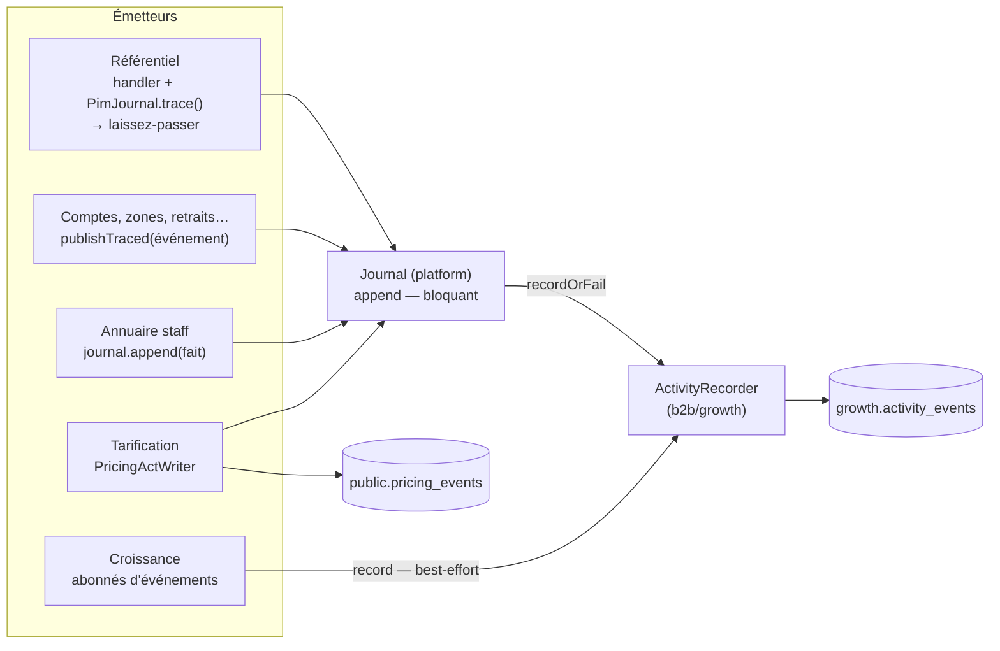

# La journalisation — comment un geste devient une trace

> **La porte d'entrée.** Ce document dit comment la journalisation marche dans
> tout le backend, telle qu'elle tourne en production au **2026-09-18**, vérifiée
> contre le code ce jour-là. Chaque projet garde le détail de ses faits :
>
> - le journal d'activité, son modèle et sa lecture —
>   [`../b2b/architecture-journal-activite.md`](../b2b/architecture-journal-activite.md) ;
> - la mécanique bloquante, née au référentiel —
>   [`../pim/journalisation-et-tracabilite.md`](../pim/journalisation-et-tracabilite.md) ;
> - l'annuaire staff —
>   [`../staff/journalisation-staff/architecture-journal-de-l-annuaire.md`](../staff/journalisation-staff/architecture-journal-de-l-annuaire.md) ;
> - l'auteur d'un acte — au [§12](#s12) de ce document.
>
> Ce qui reste à faire est dans [`todo-journal-activite.md`](todo-journal-activite.md),
> et nulle part ailleurs.

## Table des matières

1. [En une phrase](#s1)
2. [Une table, deux garanties](#s2)
3. [Les trois chemins d'écriture](#s3)
4. [Ce qu'une ligne contient](#s4)
5. [L'auteur](#s5)
6. [L'idempotence](#s6)
7. [Le journal tarifaire, et pourquoi il a sa table](#s7)
8. [La lecture : l'écran Journal](#s8)
9. [Ce qui empêche d'oublier](#s9)
10. [Ce qui s'appelle « journal » sans en être un](#s10)
11. [Où est le code](#s11)
12. [L'auteur est la fiche, jamais le `sub`](#s12)

---

## 1. En une phrase

Un geste qui change ce qui est vendu, facturé, ou ce que quelqu'un a le droit
de voir écrit **un fait** dans `growth.activity_events` — dans la **même
transaction** que le geste quand on doit pouvoir en répondre —, avec son auteur
**figé** au moment où il agit, et l'écran Journal du back-office le rend en
phrase.

---

## 2. Une table, deux garanties

Il n'y a qu'**un** journal d'activité : « que s'est-il passé avant que ça
casse ? » traverse les modules, et deux journaux seraient deux vérités. Un
module n'est pas un emplacement, c'est un **filtre** dérivé du préfixe du type
de fait (§8).

Mais tous les faits ne coûtent pas la même chose s'ils se perdent. Le port
`ActivityRecorder` (`b2b/growth/domain/ports/activity-recorder.ts`) offre donc
**deux garanties**, et c'est l'émetteur qui choisit :

|               | `record` — **analytique**                                                        | `recordOrFail` — **opposable**                                 |
| ------------- | -------------------------------------------------------------------------------- | -------------------------------------------------------------- |
| Une panne     | journalisée puis **avalée** : le geste réussit quand même                        | **remonte** : la transaction du geste est annulée              |
| Pour          | une étape franchie, une commande prête, un lead capté                            | une fiche modifiée, un droit accordé, un prix posé             |
| Pourquoi      | perdre la trace dégrade une statistique ; casser le geste dégraderait le service | une trace manquée en silence laisse croire que rien n'a changé |
| Qui l'emploie | les abonnés de `b2b/growth/application/handlers/` et commandes de croissance     | tout ce qui passe par le port `Journal` (§3)                   |

**Pourquoi la table vit dans le schéma `growth`.** Le journal est né comme un
journal d'événements **analytiques** de la croissance (lead capté, commande
passée, étape franchie) : le cockpit commercial, le score des leads et les
indicateurs d'acquisition le lisent encore. Il est devenu ensuite la trace de
« qui a fait quoi ». Les deux usages lisent **les mêmes faits** — `order.placed`
est une statistique et une trace — et c'est pourquoi ils partagent une table.
Le nom du schéma est historique. **Décidé par Hugo le 2026-09-19** : on ne
déplace ni la table ni le code qui l'écrit. Le port `Journal`, lui, est en
`platform/` depuis le 2026-08-25 : les blocs métier ne dépendent pas de la
croissance pour écrire. Déplacer l'implémentation ferait de `platform` le
propriétaire de la table (`lint:prisma-model-ownership`) — six lecteurs de la
croissance en deviendraient des intrus — et y ferait entrer le vocabulaire
métier des modules.

Les deux passent par le **même** append (`prisma-activity-recorder.ts`) : seul
le `catch` diffère. Deux chemins d'écriture auraient divergé, et c'est le
rare — celui qui doit être fiable — qui aurait pourri en silence.

---

## 3. Les trois chemins d'écriture

Les blocs métier ne voient pas `growth` (matrice des frontières, CLAUDE.md §3).
Ils écrivent au port **`Journal`** de la plateforme
(`platform/journal/journal.ts`, promu là le 2026-08-25), et c'est la racine de
composition (`appBootstrap/journal.module.ts`) qui le branche sur
`ActivityRecorder.recordOrFail`. `Journal.append` est donc **toujours
bloquant**.

**1. Le référentiel (`pim/`)** — le handler appelle `PimJournal.trace()` dans
une `UnitOfWork`, et reçoit un **laissez-passer** (`WriteTicket`) sans lequel
son dépôt refuse d'écrire : oublier la trace ne compile pas. Ses faits portent
des diffs et une **portée** (`blast`) que seul le handler sait calculer.
Détail : [`../pim/journalisation-et-tracabilite.md`](../pim/journalisation-et-tracabilite.md).

**2. Les actes nommés (`b2b/account`, zones, points de retrait, heures limites,
mandats…)** — l'événement de domaine **est** le fait : il implémente
`JournaledEvent.journalFact()` (`platform/journal/journal-fact.ts`), et
`publishTraced(event)` écrit au journal **puis** publie sur le bus
(`platform/events/cqrs-domain-event-publisher.ts`). Une seule description pour
le bus et pour le journal : l'écrire deux fois était la vraie source de dérive.

**3. L'annuaire staff (`staff/`)** — chaque handler appelle `journal.append`
dans sa `UnitOfWork`, avec l'avant et l'après de ce qui a changé.
Détail : [`../staff/journalisation-staff/architecture-journal-de-l-annuaire.md`](../staff/journalisation-staff/architecture-journal-de-l-annuaire.md).

**Et la croissance** écrit en direct à l'`ActivityRecorder`, en **best-effort**
(`record`) : ses abonnés tournent hors de la requête, et leurs faits
(`order.placed`, `order.ready`, `lead.*`…) servent le cockpit commercial, pas la
preuve.

La tarification est au §7.

---

## 4. Ce qu'une ligne contient

L'émetteur ne fournit que **ce qui s'est passé** (`JournalFact`) : un `type` en
vocabulaire métier (`company.payment_terms_granted`), un sujet
(`subjectType` + `subjectId`), une charge utile petite, et un instant métier
s'il en connaît un autre que maintenant. **Tout le reste est dérivé** par
l'adaptateur, parce qu'un émetteur qui devrait le fournir finirait par se
tromper :

| Colonne                    | D'où                                                               |
| -------------------------- | ------------------------------------------------------------------ |
| `id`                       | ULID (`IdGenerator`) — trie par le temps, pagine l'écran           |
| `occurred_at`              | l'émetteur, sinon le `Clock` (l'instant gelé de la requête)        |
| `recorded_at`              | `now()` en base — l'écart avec `occurred_at` trahit un fait rejoué |
| `trace_id`                 | le `traceparent` de la requête, sinon une trace neuve (cron)       |
| `actor_type`, `actor_id`   | l'acteur du contexte de requête (§5)                               |
| `actor_name`, `actor_role` | **figés** à l'écriture (§5)                                        |
| `idempotency_key`          | dérivée (§6)                                                       |

La charge utile reste **petite et lisible sans rouvrir la base** : des libellés
figés, pas des clés. Une fiche renommée, un rôle supprimé : la ligne se relit
toujours.

---

## 5. L'auteur

L'**acteur** d'une requête est posé une fois, dans le contexte de requête
(`platform/context/`), par le garde qui sait qui agit :

| Qui agit        | Posé par                                         | `actor_id`                                  |
| --------------- | ------------------------------------------------ | ------------------------------------------- |
| un client       | `AuthGuard` (garde global)                       | l'id de `users` — jamais le `sub`           |
| un membre staff | `StaffAccessGuard`, après résolution de la fiche | l'id de la **fiche** — jamais le `sub`      |
| une tâche       | `RecomputeGuard`, ou rien (hors requête)         | `null` / un marqueur, `actor_type = system` |

Le **nom et la fonction** sont résolus par `ActorNamer`
(`b2b/growth/infrastructure/prisma-actor-namer.ts`) **au moment de l'acte**, et
figés dans `actor_name` / `actor_role` : le journal dit qui a agi ce jour-là et
à quel titre, pas qui porte ce nom aujourd'hui. Une panne de résolution n'empêche
pas d'écrire — un fait anonyme vaut mieux qu'un fait perdu.

**Le `sub` Auth0 n'est plus un auteur nulle part** depuis le 2026-09-18 : il est
sorti du type après l'authentification, l'historique a été converti, et deux
portes (`lint:subject-readers`, `lint:auth0-id-readers`) tiennent la liste de
ceux qui le lisent encore — pour l'identité seulement. Les faits écrits sous un
`sub` que la base n'a jamais relié à une fiche restent tels quels, et se
nomment quand même par leur `actor_name` figé. Tout le mécanisme, règle par
règle : [§12](#s12).

---

## 6. L'idempotence

La clé est `type:subjectId:traceId`, dérivée par
`b2b/growth/domain/activity-event.ts`, unique en base. Un fait rejoué **par la
même requête** (même `traceparent`) retombe sur la même clé, et l'`INSERT`
**n'écrit rien, sans erreur** : `createMany({ skipDuplicates: true })`, soit
`INSERT … ON CONFLICT DO NOTHING`.

La clé est la **trace**, pas l'horloge : deux gestes identiques à la même
seconde, venus de deux requêtes, sont deux faits.

> **Pourquoi pas d'erreur, et pas un `catch`** : jusqu'au 2026-09-18, le
> recorder attrapait la violation d'unicité (`P2002`) après coup. C'était juste
> hors transaction ; **dans** une `UnitOfWork`, l'`INSERT` refusé mettait la
> transaction Postgres en échec, et le geste que le `catch` devait épargner
> était annulé au commit. Le test qui le prouve :
> `test/activity-events.e2e-spec.ts` (« un fait rejoué DANS une transaction
> n'annule pas le geste qui suit »).

---

## 7. Le journal tarifaire, et pourquoi il a sa table

Un acte tarifaire (poser, suspendre, reprendre, archiver une règle, un plancher,
un barème, un engagement, une mercuriale) s'écrit **deux fois, dans la même
transaction que l'état**, par `PricingActWriter`
(`b2b/pricing/infrastructure/pricing-act.writer.ts`) :

- dans **`public.pricing_events`**, le journal **du domaine** : append-only,
  aucune colonne mutable, aucun port qui mette à jour ou efface — sur un prix
  négocié, la question de six mois plus tard est « qui a décidé ça, et qui l'a
  arrêté », et un journal réinscriptible ne le prouverait pas ;
- dans **`growth.activity_events`**, son **miroir général**, par `Journal.append`
  — pour que la tarification apparaisse au journal commun (module
  « commercial »).

Ce n'est donc pas un second journal qui concurrence le premier : c'est la
tarification qui garde sa propre preuve, lue par son écran (`GET
/admin/pricing/journal`), **et** alimente la chronique commune.

**Une exception, une seule, datée** : la migration
`20260918190000_conversion_des_auteurs_staff` a traduit l'auteur de
`pricing_events` du `sub` vers l'id de fiche (accordé par Hugo le 2026-09-18).
Elle est écrite dans le JSDoc du modèle, et ne vaut pas précédent.

---

## 8. La lecture : l'écran Journal

`GET /admin/activity` (`b2b/growth/http/admin-activity.controller.ts`), sous la
permission `activity:read` — réservée à `admin` : le journal traverse tous les
modules, et le ranger sous l'un d'eux donnerait à son audience l'activité des
autres par la bande.

- **Module** — dérivé du préfixe du `type` (`b2b/growth/domain/activity-module.ts`),
  pas stocké : `pim`, `commercial` (dont les prix négociés), `commandes`,
  `comptes`, `equipe`. Un type qui ne se range plus sous un préfixe se renomme.
- **Filtres** — `module`, `type`, `subjectType`, `subjectId`, `actorId`,
  période ; un seul constructeur SQL (`activity-journal.where.ts`). Le filtre par
  acteur suit une personne sous **tous** ses identifiants (id de fiche et `sub`
  successifs, table `staff_subject_aliases`).
- **Recherche** `q` — 2 à 100 caractères, sur le nom de l'auteur, les
  **valeurs** de la charge utile (jamais ses clés), ou l'identifiant exact du
  sujet ; **sans casse ni accents**, par une même expression
  `lower(translate(…))` des deux côtés — sans extension, et sans dépendre de la
  locale de la base. Rien n'est stocké pour la servir. Les montants, en
  centimes, ne se trouvent pas en tapant « 12,50 » ; les ligatures (œ, æ) ne
  se déplient pas.
- **Pagination** par pages numérotées (`fold-paginator`), sur une **vue
  figée** : la page 1 fixe une ancre (`asOf`, le fait le plus récent qui répond
  aux filtres) et pages comme total se comptent jusqu'à elle — sans quoi, les
  faits arrivant en tête, une page 2 changerait entre deux clics. Un fait
  arrivé depuis apparaît en revenant en page 1. Le curseur `before` reste
  servi pour les lecteurs d'avant. Le journal tarifaire se lit de la même
  façon (`…/pages`).
- **Le rendu** en phrases françaises vit au front
  (`lfc-B2B-admin-frontend/src/app/admin/journal/`) : `journal-line.ts` pour
  tous les faits, `staff-line.ts` pour ceux de l'équipe.

Ailleurs, des lecteurs ciblés : l'attribution d'un diff de révision PIM
(`PimJournalReader`, qui lit le journal d'un produit sur un intervalle), le
journal tarifaire, le cockpit commercial, et l'**historique d'une fiche
produit** (`GET /pim/catalogue/products/:id/history`, port
`ProductHistoryJournal`) qui tresse ses trois cercles — la fiche et ses
déclinaisons, ce dont elle hérite (familles, taux appliqués, ingrédients,
appellations), les révisions qui l'ont emportée — rattachés par ce que la fiche
porte **aujourd'hui**.

---

## 9. Ce qui empêche d'oublier

La journalisation repose sur une discipline, et une discipline se perd sans
bruit — la faute ne se voit que le jour où l'on demande « qui a changé ça ».
Ce qui la tient, du plus fort au plus faible :

| Garde-fou                                       | Ce qu'il tient                                                                                                                                                                                                                                                                                                                                             |
| ----------------------------------------------- | ---------------------------------------------------------------------------------------------------------------------------------------------------------------------------------------------------------------------------------------------------------------------------------------------------------------------------------------------------------- |
| Le laissez-passer `WriteTicket`                 | un dépôt du référentiel n'écrit pas sans trace — **le compilateur** refuse                                                                                                                                                                                                                                                                                 |
| `lint:journal-tracked`                          | tout handler de commande du PIM, de `staff/` et — depuis le 2026-09-19 — de `b2b/account/` (gestes du client compris, sans coordonnées), `b2b/subscriptions/`, `b2b/order-waivers/`, `b2b/payments/` (client compris) et `b2b/catalog/` journalise sous `UnitOfWork` — ou déclare `@sans-journal <raison>` / `@hors-transaction <raison>`, qui se greppent |
| `lint:events-tracked`                           | un abonné d'événement s'inscrit au travail de fond : sans ça, son écriture au journal échappe à `drain()` et à la gestion d'erreur                                                                                                                                                                                                                         |
| `lint:subject-readers`, `lint:auth0-id-readers` | le `sub` Auth0 ne redevient pas un auteur, ni ne s'écrit dans un message                                                                                                                                                                                                                                                                                   |
| La transaction du geste                         | un fait opposable et son geste tombent ensemble ou tiennent ensemble                                                                                                                                                                                                                                                                                       |

**La règle pour ajouter un émetteur** : un fait mérite le journal quand il
change ce qui est vendu, facturé, ou ce que quelqu'un a le droit de voir. Le
reste est du bruit qu'il faudra filtrer plus tard.

---

## 10. Ce qui s'appelle « journal » sans en être un

Pour ne pas les confondre :

- **`MailJournal`** (`platform/mailer/`) — ce qui est parti par e-mail, pour le
  délivrable ; pas un acte métier.
- **`StatusJournal`** (`ops/`) — l'état de santé de la plateforme.
- **Les « journaux de chantier »** de `documentation/production/` et
  `documentation/pricing/journal-de-remediation.md` — des carnets de travail,
  pas du code.

---

## 11. Où est le code

| Quoi                             | Où                                                                                                                                       |
| -------------------------------- | ---------------------------------------------------------------------------------------------------------------------------------------- |
| Le port des blocs métier         | `apps/lfd-api/src/platform/journal/journal.ts`, `journal-fact.ts`                                                                        |
| Le branchement                   | `apps/lfd-api/src/appBootstrap/journal.module.ts`                                                                                        |
| Le recorder, ses deux garanties  | `apps/lfd-api/src/b2b/growth/domain/ports/activity-recorder.ts`, `infrastructure/prisma-activity-recorder.ts`                            |
| La ligne et sa clé d'idempotence | `apps/lfd-api/src/b2b/growth/domain/activity-event.ts`                                                                                   |
| L'auteur figé                    | `apps/lfd-api/src/b2b/growth/infrastructure/prisma-actor-namer.ts`                                                                       |
| `publishTraced`                  | `apps/lfd-api/src/platform/events/cqrs-domain-event-publisher.ts`                                                                        |
| Le référentiel                   | `apps/lfd-api/src/pim/journal/`                                                                                                          |
| La tarification                  | `apps/lfd-api/src/b2b/pricing/infrastructure/pricing-act.writer.ts`                                                                      |
| La lecture                       | `apps/lfd-api/src/b2b/growth/http/admin-activity.controller.ts`, `infrastructure/activity-journal.where.ts`, `domain/activity-module.ts` |
| Le contrat                       | `packages/contracts/src/activity-journal.ts`                                                                                             |
| La table                         | `apps/lfd-api/prisma/schema/growth.prisma` (`ActivityEvent`)                                                                             |

---

## 12. L'auteur est la fiche, jamais le `sub`

L'auteur de tout acte staff — colonne d'auteur, journal, charge utile — est
l'**id de la fiche** (`staff_users.id`). Le `sub` Auth0 est un identifiant
**chez un tiers** : il ne vit plus qu'à côté de chaque compte, pour la
connexion. Livré le 2026-09-18 en six déploiements ; le plan qui l'a conduit,
supprimé une fois livré, reste lisible dans l'historique git. Le code cite ces règles par leur étiquette — **D1** à **D9**,
**§8** — gardée ici telle quelle.

**D1 — Une seule porte pose l'auteur : `StaffAccessGuard`.** Il résout la fiche
et attache `{ type: "staff", id: access.staffUserId }` au contexte de requête ;
une requête refusée n'attache rien. `AdminAuthGuard` n'attache aucun acteur.
`@AdminSurface` monte toujours les deux gardes : aucune route staff n'y échappe.
Le contournement de développement se lie à la fiche racine et reçoit son id.

**D2 — Le `sub` est sorti du type.** `AdminAuthGuard` vérifie le jeton et remet
l'identité à `StaffAccessGuard` par un canal interne à `platform/auth/`
(`verified-staff-identity.ts`) ; après la résolution, la requête ne porte plus
que `access`. `@StaffSub()` n'existe plus : `@StaffUserId()` est le seul moyen
de nommer l'auteur. Côté client, `lint:subject-readers` tient la liste des deux
seuls lecteurs du `sub` du jeton.

**D3 — Le front et les exports reçoivent un nom.** Chaque vue qui sert un auteur
sert aussi `…ByName`, résolu au serveur. Le champ d'identifiant reste servi : il
porte l'id de la fiche ou un **marqueur** qui ne désigne personne (`system`,
`seed-pim`, `sonde`…), et l'écran l'affiche quand le nom manque
(`lfc-B2B-admin-frontend/src/app/shared/staff-author.ts`). L'export CSV des
mercuriales écrit le nom. `actorId` du journal reste servi : le filtre par
personne en a besoin.

**D4 — Les lecteurs acceptent toutes les formes.** Le port `StaffAuthorDirectory`
(`staff/directory/domain/staff-author-directory.ts`) nomme un auteur écrit par
id de fiche, par `sub` actuel, ou par un `sub` ancien de la table des `sub` ; le
port `StaffAuthorReferences` rend tous les identifiants d'une personne, et le
filtre par acteur du journal devient `actor_id IN (…)` — l'histoire d'une
personne ne se coupe pas. `b2b` n'y lit pas `staff_users` : il passe par ces
ports (`b2b/account/infrastructure/staff-block-directory.ts`, `ActorNamer`).

**D5 — La table des `sub`.** `staff_subject_aliases (sub, staff_user_id, source,
recorded_at)` garde **chaque** `sub` qu'une fiche a porté : semée des
`auth0_id` actuels (`source = 'current'`), puis écrite par toute liaison
(`markInvited`, le rapprochement du résolveur, `source = 'linked'`) dans la même
écriture. L'historique a été converti en joignant sur elle, et seulement sur
elle (`20260918190000_conversion_des_auteurs_staff`) ; ce qu'elle ne connaissait
pas est resté tel quel. Elle ne contient que des liens que la base a établis
elle-même.

**D6 — La signature d'une fiche produit reste dans la photo du catalogue.**
`readyBy` fait partie du contenu figé d'une révision : il dit qui avait validé
l'article **au moment de la publication**. Il porte l'id de fiche depuis la
conversion ; les contenus figés **avant** gardent leur `sub` — on ne réécrit pas
une ancre adressée par son empreinte —, et le diff de révision les nomme par D4
(`nameSignatories`, `revision-diff-support.ts`). La révision qui a suivi la
conversion a vu chaque article signé changer d'empreinte une fois.

**D7 — Les journaux ont été traduits, une fois.** `activity_events.actor_id`
(faits staff), les clés `readyBy` / `handedOverBy` des charges utiles, et
`pricing_events.actor` : un identifiant de la même personne en a remplacé un
autre — ni le fait, ni son sujet, ni son instant n'ont bougé. Exception accordée
par Hugo pour le journal tarifaire, écrite dans le JSDoc du modèle, et qui ne
vaut pas précédent (§7).

**D8 — Les noms ne mentent plus.** Les colonnes `*_by_sub` et `staff_sub` sont
devenues `*_by_staff_id` et `staff_user_id`, en trois déploiements (étendre,
basculer, resserrer : 5A, 5B, 5C) ; `StaffTrace.sub` et les champs `sub` des
contrats ont disparu.

**D9 — Un abonnement push appartient à une fiche** (`staff_user_id`). Il reste
une trace, pas un ciblage : toute notification part à tous les abonnements —
point repris par le plan de départ d'un membre.

**Une fiche ne se supprime plus** (étape 0) : `DELETE /admin/staff-users/:id`
répond `409` ; la fiche porte l'auteur de tout ce que la personne a fait.

**§8 — Les clients.** L'acteur d'une requête client est l'id de `users`, jamais
le `sub` (`AuthGuard`, depuis le 2026-08-07) ; le seul `sub` client en base est
`users.auth0_sub`. `ProfileView.subject` a été retiré ; ni les logs ni les
messages d'erreur (`IdentitySubjectUnknownError`) ne portent de `sub`.

**Ce qui le tient** : le type (D2), et deux portes — `lint:subject-readers` (le
`sub` du jeton) et `lint:auth0-id-readers` (le même identifiant rangé en base :
seize lecteurs admis, chacun avec sa raison, et jamais interpolé dans un
message). La requête de contrôle, en lecture seule, compte ce qui reste écrit
sous un `sub` : [`../staff/requetes/inventaire-des-auteurs-staff.sql`](../staff/requetes/inventaire-des-auteurs-staff.sql).
