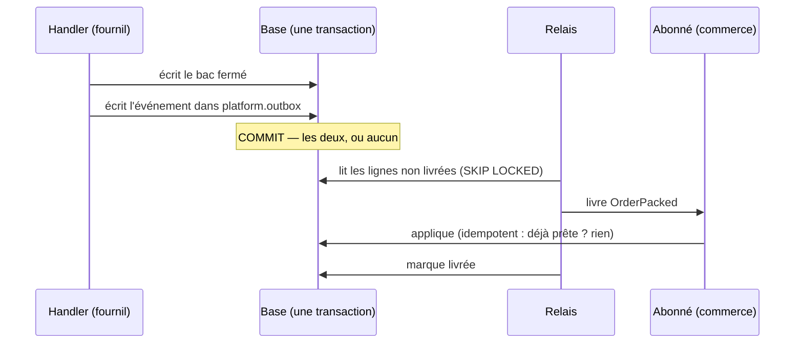

# La boîte d'envoi — publier un fait entre blocs sans le perdre

> Hugo, 2026-10-04 : « le code n'a aucun moyen sûr de publier un événement,
> c'est un smell ; certaines décisions ont été prises en supposant que tout le
> monde vit dans le même bâtiment. » État : **doc-first**, rien de bâti.
> `vitruve` d'office (table neuve, runbook).

## 1. Ce qui existe (relu le 2026-10-04)

- `DomainEventPublisher.publish` → `EventBus` de `@nestjs/cqrs`, **en
  mémoire** : un processus qui meurt entre l'écriture et l'abonné perd le fait.
- `publishTraced` inscrit au `Journal` **dans la transaction**, puis publie
  en mémoire : le fait est **gardé**, mais rien ne le **relit** pour le livrer.
- `AfterCommit` (`platform/database/after-commit.ts`) diffère un rappel après
  la validation — il évite d'annoncer ce qui n'a pas eu lieu, pas de perdre ce
  qui a eu lieu.
- `BackgroundWork` exécute l'abonné hors requête ; un échec est journalisé,
  jamais rejoué.
- Les faits qui traversent un bloc et qu'une perte casse :
  `OrderPackedEvent` (fournil → commerce : `ready`),
  `ProductionDayClosedEvent` (rattrapage aujourd'hui humain : re-clôturer),
  les annonces de la livraison au retrait (`DepartedOrdersAnnouncer`,
  `BroughtBackOrdersAnnouncer`), `OrderHandedOverEvent`.

## 2. Comment ça marche (le patron « transactional outbox »)

Trois garanties, chacune tenue par un morceau :

1. **Pas d'annonce fantôme ni de fait perdu** — l'événement est une LIGNE
   écrite dans la même transaction que le changement. Si la transaction
   tombe, l'événement n'existe pas ; si elle passe, il existe pour toujours.
2. **Livré au moins une fois** — un relais relit les lignes non livrées et
   les remet aux abonnés. Un crash entre la livraison et le marquage
   provoque une **seconde** livraison, jamais zéro.
3. **Effet une seule fois** — parce que (2) peut livrer deux fois, chaque
   abonné est **idempotent** : il note l'identifiant d'événement traité
   (table `platform.outbox_receipt`, clé `(event_id, subscriber)`), dans SA
   transaction.

## 3. La forme proposée

- **Table `platform.outbox`** (schéma technique, aucune connaissance métier) :
  `id` (ULID, `IdGenerator`), `type` (nom stable du fait), `payload` jsonb,
  `occurred_at` (`Clock`), `trace_id`, `attempts`, `next_attempt_at`,
  `delivered_at`, `last_error`. Index partiel sur les non livrées.
- **Table `platform.outbox_receipt`** : `(event_id, subscriber)` unique.
- **Port** `DomainEventPublisher.publishDurable(event)` — un troisième verbe,
  à côté de `publish` (analytique) et `publishTraced` (opposable) : écrit dans
  la transaction ambiante, **refuse hors d'une `UnitOfWork`** (un fait
  durable sans transaction n'a pas de sens).
- **Relais** dans le processus (un worker interne déclenché après commit +
  balayage périodique), `SELECT … FOR UPDATE SKIP LOCKED` : deux instances ne
  livrent pas la même ligne. Reprise avec délai croissant ; au-delà de N
  essais, la ligne reste visible dans la carte de santé (`ops`), jamais
  supprimée.
- **Abonné** : un `@DurableHandler("order.packed")` qui reçoit
  `(eventId, payload)`, et une garde commune qui écrit le reçu et saute un
  doublon.
- **Le jour où un bloc devient un worker** : seul le relais change de
  transport (HTTP, file) ; émetteurs et abonnés ne bougent pas. C'est ce qui
  lève l'hypothèse du bâtiment.

## 4. Ce que ça ne règle PAS

- Un **invariant** coupé en deux reste coupé (cf.
  `colisage/plan-domaine-colisage.md` §9) : la boîte d'envoi rend la
  publication sûre, pas la cohérence immédiate.
- L'**ordre** n'est garanti que par émetteur et par sujet si on le demande
  (`ORDER BY occurred_at` par clé) — à préciser par fait.

## 5. Lots

| Lot | Contenu                                                                        | Migration |
| --- | ------------------------------------------------------------------------------ | --------- |
| BE1 | Tables, port `publishDurable`, relais, garde d'idempotence, carte de santé     | additive  |
| BE2 | Premier client : `OrderPacked` → `ready` (perte possible aujourd'hui)          | non       |
| BE3 | `ProductionDayClosed` ; la re-clôture humaine devient un filet, plus le chemin | non       |
| BE4 | Annonces livraison → retrait, `OrderHandedOver`                                | non       |

## 6. Questions ouvertes

- Le relais : dans le processus de l'API (simple) ou un worker à part dès BE1 ?
  Proposé : dans le processus, déclenché après commit.
- Rétention des lignes livrées : purge (DELETE technique, pas un agrégat
  métier) après N jours, ou archivage ?
- Les e2e : `ctx.drain()` doit aussi vider la boîte d'envoi — et c'est
  probablement le remède du rouge intermittent `production-batch`
  (`todos/todo-flake-des-e2e.md`).

## 7. Contradiction de `vitruve` (2026-10-04), et la v2

**BLOQUANTS, levés :**

1. **`PackOrderHandler` n'a pas d'unité de travail, et il réannonce.** →
   BE2 enveloppe `markPacked` + `publishDurable` dans `UnitOfWork.run`, et
   n'émet le fait durable **que quand il gagne**. Les réannonces restent en
   `publish`. En plus, chaque fait durable porte une **clé déterministe**
   (`order.packed:<orderId>`), unique en base, insérée en
   `ON CONFLICT DO NOTHING` : un même fait ne s'écrit qu'une fois, quel que
   soit le chemin.
2. **Les annonces de la livraison sont des ports, pas des événements.** → on
   garde les ports et la matrice (le retrait implémente toujours
   `delivery/channels/handover/`). On rend durable l'**appel** : la livraison
   écrit `delivery.orders_departed`, dont l'abonné durable appelle le port.
3. **Pas de minuteur en mémoire** : l'API tourne sur une instance
   (`max_instances: 1`) qui s'endort, réveillée par le cron `*/5`. → chemin
   rapide après validation (`deferUntilCommit`), et **rattrapage par un
   endpoint de balayage appelé par un cron Cloudflare**, comme
   `loyalty-sweep`, `media-sweep` et les autres balayages.

**SÉRIEUX, tranchés :**

- **Schéma `platform`** créé en BE1 : `datasource`, `apps/lfd-api/prisma/schema/platform.prisma`,
  `CREATE SCHEMA`, et la lecture `ops → platform` déclarée.
- **Réserver, puis livrer.** Une courte transaction réserve des lignes
  (`UPDATE … SET claimed_until = now + bail … FOR UPDATE SKIP LOCKED
RETURNING`) ; chaque livraison tourne ensuite dans **sa propre** unité de
  travail, qui écrit le reçu et l'effet ensemble, puis marque la ligne livrée.
  Un relais mort laisse expirer son bail, et la ligne revient. Aucun verrou
  n'est tenu pendant qu'un abonné travaille. La garde commune ouvre l'unité
  de travail : l'abonné ne s'en charge pas.
- **L'idempotence se relève abonné par abonné avant de brancher un fait.**
  Le crédit de points de fidélité sur `OrderHandedOver`, c'est de l'argent :
  BE4 ne part pas sans ce relevé. Un seul `type` stable par fait
  (`order.handed_over`), quelle que soit la classe qui le porte.
- **`drain()` des e2e** : le relais s'inscrit à `BackgroundWork`, et
  `lint:events-tracked` couvre aussi `@DurableHandler`.
- **Pas de DELETE** : les lignes livrées restent (quelques centaines par
  jour), avec un index partiel sur les non livrées. Si le volume l'exige un
  jour, on archivera.
- **N = 10 essais**, délai croissant, puis la ligne s'affiche dans la carte
  de santé.

**Ordre revu :** BE3 (la clôture, déjà en unité de travail) devient le
**premier client**, parce que c'est le plus simple. BE2 (`OrderPacked`)
vient ensuite.

## 8. Une file de messages, et sa file des messages morts (Hugo, 2026-10-04)

> « ça ressemble à de la vraie archi push, avec une dead letter queue et une
> message queue en fait »

C'est le cas : une file posée sur Postgres. Sa différence avec un broker est
l'atomicité avec l'écriture métier. Un broker seul referait le trou d'aujourd'hui
(écrire, puis publier) ; il se brancherait **derrière** la boîte d'envoi, et ce
serait le facteur qui le remplirait (Cloudflare Queues, la cible naturelle).

Deux ajouts à BE1, que la comparaison a fait voir :

1. **L'état de livraison est tenu par abonné.** Une ligne
   `(event_id, subscriber)` porte les essais, le bail, `delivered_at` et
   `last_error`. Un message est livré quand toutes ses lignes le sont. La
   file des messages morts vise donc un couple message × abonné, et elle
   nomme l'abonné qui bloque.
2. **Le rejeu manuel.** Une commande, sur une route admin gardée, remet à
   zéro les essais d'un couple message × abonné et le relance. L'écran ira
   avec la carte de santé.

## 9. BE1 bâti (2026-10-04) — ce qui a été tranché en bâtissant

- La table de l'état par abonné s'appelle `platform.outbox_delivery`
  (`event_id`, `subscriber`) ; son `delivered_at` sert de reçu.
- **Les livraisons naissent à l'écriture**, une par abonné inscrit à cet
  instant. Un abonné ajouté plus tard ne reçoit pas les faits passés, et un
  fait sans abonné n'a aucune ligne de livraison. Brancher un abonné sur un
  fait déjà émis demandera un rattrapage explicite.
- `@DurableHandler({ type, subscriber })` : le nom d'abonné est la clé du reçu.
  Il est stable au renommage d'une classe, et deux abonnés du même nom
  refusent le démarrage.
- **Un port à part, `DurablePublisher`**, plutôt qu'un troisième verbe sur
  `DomainEventPublisher` (ISP, CLAUDE.md §2) : sept doubles implémentaient un
  verbe qu'ils n'appelaient pas.
- Le rejeu est gardé par le droit d'écriture sur `ops_health` (l'admin, par
  défaut). À régler à l'écran.
- Le rattrapage passe par le cron `*/5` existant (`container/worker.ts`) :
  aucun cron n'a été ajouté.
- **Reste** : l'affichage des messages morts dans la carte de santé (un nœud
  du manifeste, `@lfd/ops-contract`, l'écran). Les données sont prêtes.

## 10. BE3 bâti en premier (2026-10-04) — la clôture de journée

Ordre du §7 : la clôture est le premier client. Le tableau du §5 garde ses
numéros ; c'est le lot BE3 qui est bâti ici.

- `CloseProductionDayHandler` écrit `production.day_closed` dans la boîte
  d'envoi, **dans la même unité de travail** que la journée et le journal. Plus
  rien ne part sur le bus en mémoire pour ce fait : son seul abonné
  (`OnProductionDayClosed`, b2b) est devenu un `@DurableHandler`
  (`b2b.orders.absorb-into-plan`).
- **Le contrat** : `{ serviceDay, closedAt, orderIds }`, relu par
  `ProductionDayClosedEvent.fromPayload` (un payload hors forme échoue, est
  repris, puis reste visible en message mort).
- **L'idempotence n'était pas vraie, elle l'est.** `absorbIntoPlan` prenait
  toute la journée `placed` : une livraison tardive (reprise, rejeu) ou une
  réannonce confirmait aussi les commandes passées APRÈS l'arrêt, que le fournil
  n'avait pas comptées, en les datant de la clôture. Elle est bornée depuis aux
  `orderIds` de l'instantané. Test e2e : `production-day-closed`, « une
  re-clôture est un fait NEUF, qui n'absorbe que l'instantané ».
- **La clé.** Clôture : `production.day_closed:<jour>:<closedAt>` — une journée
  ne se clôt qu'une fois (l'agrégat refuse), donc un fait par plan arrêté.
  Réannonce : `…:<closedAt>:reannounced:<instant du geste>`, un fait NEUF à
  chaque pression. Raison : la réannonce ne recalcule pas l'instantané, mais un
  retirage y a pu ajouter des commandes, et c'est elle qui les fait apprendre
  au commerce (le retirage ne publie rien) ; et c'est un geste humain de
  réparation, qu'une déduplication rendrait muet (l'e2e `production-batch`
  « MONTRE la divergence… et la referme » le tient). L'effet reste borné par
  `orderIds` et `status: placed`.
- **Écart à la consigne** « une re-clôture est un nouveau fait si elle change le
  plan » : appliquée à la lettre, une réannonce sans retirage serait dédupliquée
  et le bouton de réparation ne réparerait plus rien. Choisi : un fait par
  geste. À trancher si l'on préfère que le filet passe par le rejeu admin.
