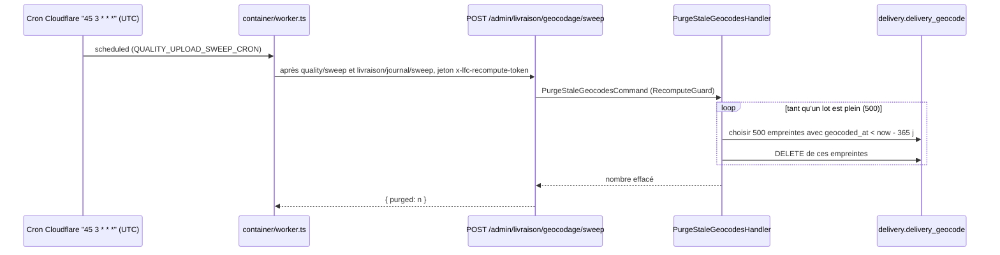

# RGPD — la purge du cache de géocodage

> État : **bâti** le 2026-10-06, non commité à l'écriture. Chaque affirmation
> sur le code ci-dessous a été ouverte et vérifiée le 2026-10-06.
> Pas un avis juridique.

## Pourquoi

La politique de confidentialité
([`texte-politique-de-confidentialite.md`](texte-politique-de-confidentialite.md))
dit au client que la position géographique tirée de son adresse de livraison
est conservée **365 jours**, rattachée à une empreinte de l'adresse et jamais à
l'adresse en clair. Jusqu'au 2026-10-06, la durée n'était tenue qu'à la
lecture : une position plus vieille n'était plus crue, mais sa ligne restait en
base indéfiniment. La purge rend la promesse vraie.

**L'empreinte n'est pas une anonymisation.** C'est le SHA-256 de l'adresse
normalisée (`apps/lfd-api/src/delivery/infrastructure/geocode-fingerprint.ts`) :
quiconque essaie des adresses retrouve celle qui produit une empreinte donnée.
C'est une pseudonymisation — la ligne reste une donnée personnelle, et c'est
pourquoi elle doit disparaître au terme annoncé.

## Ce qui est stocké

Table `delivery.delivery_geocode` (`apps/lfd-api/prisma/schema/delivery.prisma`) :

| Colonne       | Contenu                                           |
| ------------- | ------------------------------------------------- |
| `fingerprint` | SHA-256 hexadécimal de l'adresse normalisée (clé) |
| `lat`, `lng`  | le point rendu par la Base Adresse Nationale      |
| `score`       | la confiance de la BAN, entre 0 et 1              |
| `geocoded_at` | l'instant du géocodage                            |

Aucune autre table ne la référence, et aucune colonne n'y porte l'adresse en
clair (`PrismaGeocodeCacheRepository` n'écrit que l'empreinte).

## La durée, une seule définition

`GEOCODE_TTL_DAYS = 365` et `geocodeFreshSince(now)` vivent dans
`apps/lfd-api/src/delivery/application/delivery-routing-support.ts`. La
**lecture** (« situer » un arrêt, qui ne croit que `geocoded_at >= now − 365 j`)
et la **purge** (qui efface `geocoded_at < now − 365 j`) appellent la même
fonction : ce qui n'est plus lu est exactement ce qui s'efface. Une entrée
géocodée pile à la frontière est encore lue, donc gardée.

`now` est l'horloge du backend (port `Clock`), jamais celle du Worker.

## Qui déclenche, et quand



- **Déclencheur** : le cron nocturne existant `45 3 * * *` (UTC), dans
  `triggerQualityUploadSweep` (`apps/lfd-api/container/worker.ts`), qui appelait
  déjà le balayage du fournil puis celui du journal de la livraison. Aucun
  déclencheur Cloudflare de plus.
- **Porte** : `RecomputeGuard` et le secret `RECOMPUTE_TOKEN`, comme les autres
  balayages machine. Sans jeton : 401.
- **Code** : `GeocodePurgeSweepController` →
  `PurgeStaleGeocodesHandler` → port `GeocodeCachePruner` →
  `PrismaGeocodeCachePruner` (tous sous `apps/lfd-api/src/delivery/`, câblés
  par `geocode-purge.providers.ts`).
- **Par lots** de 500 (`GEOCODE_PURGE_BATCH_SIZE`) : la boucle s'arrête au
  premier lot incomplet. **Idempotente** : un passage rejoué ne trouve plus
  rien, un passage manqué est rattrapé la nuit suivante.

**Pourquoi un DELETE physique.** La règle « pas de DELETE physique » vise les
agrégats métier. Cette table est un cache, sans invariant ni transition, dont
la durée de vie est promise au client : l'archiver garderait précisément ce
qu'on a promis de ne pas garder.

Pas d'index sur `geocoded_at` : la table compte une ligne par adresse
distincte, et le passage est nocturne. À reconsidérer si elle se compte un
jour en centaines de milliers.

## Une adresse purgée

Rien ne casse. À la prochaine commande livrée à cette adresse, la
localisation en fond (CA0, `composition-automatique.md`) ne trouve pas de
position fraîche, rappelle la BAN et réécrit une ligne avec un `geocoded_at`
neuf. Une adresse qui ne commande plus disparaît du cache au bout de 365 jours.

## Ce qui est journalisé

Rien d'autre que le compte rendu HTTP `{ "purged": n }`, rendu au Worker —
comme le balayage du journal de la livraison, qui ne journalise pas non plus
(`@sans-journal` : nettoyage machine, aucun fait métier). Aucun log, aucun fait
ne porte d'empreinte ni d'adresse. Vérifié le 2026-10-06 dans
`apps/lfd-api/src/delivery/` : le seul log du chemin de géocodage
(`delivery-stops-locating.ts`) nomme une **journée**, et l'erreur
`GeocoderUnavailableError` ne cite aucune adresse.

## Vérifier en production

Requête de lecture seule, à lancer soi-même ; elle doit rendre **0** au
lendemain d'un passage nocturne :

```sql
SELECT count(*) AS stale
FROM delivery.delivery_geocode
WHERE geocoded_at < now() - interval '365 days';
```

## Limite connue

La purge ne tourne que si le Worker de `apps/lfd-api/container/` est déployé
avec son cron et que `RECOMPUTE_TOKEN` est posé : sans jeton,
`triggerQualityUploadSweep` sort sans rien appeler, en silence. La requête
ci-dessus est le seul contrôle.
