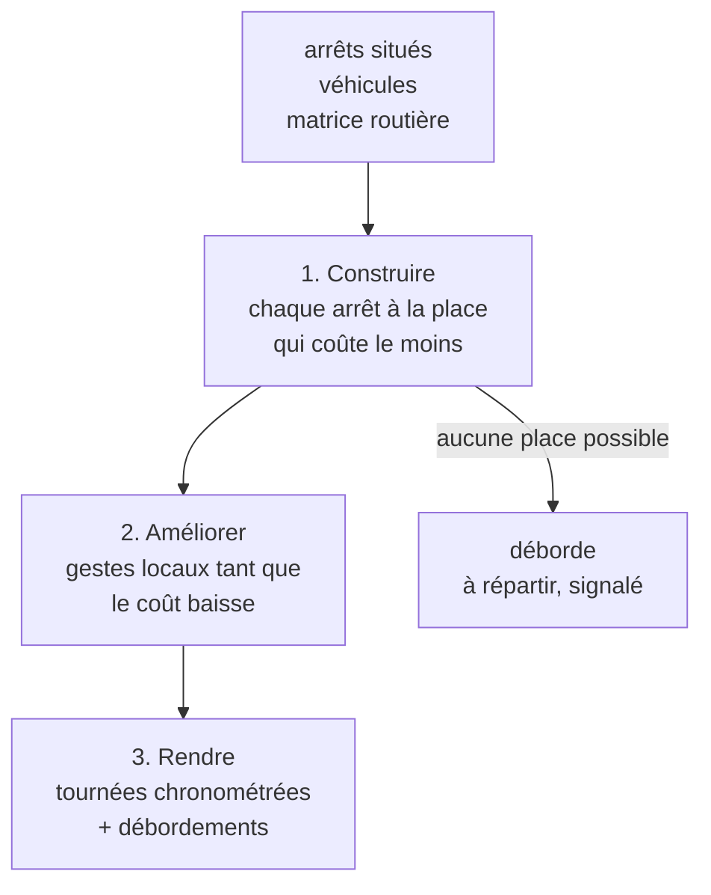

# L'algorithme de « Proposer » — préparer les tournées

> ✅ **Implémenté** — état du code relu le 2026-10-03. Ce document explique ce
> que fait « Proposer » aujourd'hui, comment il décide, et ce qu'il ne regarde
> pas. Les décisions qui l'ont façonné vivent dans
> [`plan-preparation-de-tournee.md`](plan-preparation-de-tournee.md) (lots 7,
> 7 bis, 7 ter, 8, 10 bis) et
> [`architecture-road-livraison-tournees.md`](architecture-road-livraison-tournees.md).
> Le chargement d'une tournée, une fois composée, a son propre document :
> [`algorithme-de-chargement.md`](algorithme-de-chargement.md).

## 1. La question

Pour un jour donné, on a des **commandes à livrer** (avec une adresse et
souvent un créneau), des **véhicules** et un **point de départ** (Le Labo).
« Proposer » répond : quelle commande dans quelle tournée, sur quel véhicule,
dans quel ordre, et à quelle heure on arrive chez chacun.

Il **propose**, il n'écrit rien. L'écran montre la proposition (carte, heures
d'arrivée, retards signalés) ; c'est « Appliquer » qui l'écrit, et seulement
si personne n'a touché aux tournées entre-temps (versions vérifiées).

## 2. Ce qu'il cherche, dans cet ordre

Il ne mélange pas tout dans un seul prix. Il compare deux propositions
**par priorités** (`isBetterScore`, décision L7t-C1, Hugo : « on maximise pour
le client ») :

| Rang | Critère                                      | Comment il compte                                                                                                                                 |
| ---- | -------------------------------------------- | ------------------------------------------------------------------------------------------------------------------------------------------------- |
| 1    | **Ne pas arriver après la fin d'un créneau** | les secondes de retard, comparées **avant** tout le reste : une proposition sans retard bat toujours une proposition avec, quel que soit son coût |
| 2    | **Ne pas arriver juste avant la fin**        | chaque seconde passée dans la marge de sécurité (20 min par défaut) coûte 10 fois une seconde de livreur                                          |
| 3    | **Le moins d'heures de livreur**             | route + attente + temps sur place, du départ au retour                                                                                            |
| 3    | **Le moins de tournées**                     | ouvrir une tournée coûte 1 h ; un second passage du même véhicule coûte en plus la durée maximale d'une tournée (4 h par défaut)                  |

**La règle 1 prime** (CA-D1, lot CA2 du
[composition automatique](composition-automatique.md), 2026-10-03) :
tout le monde est servi avant son échéance. Le départ se calcule **à rebours**
(§5.3), aussi tôt qu'il le faut — dès **minuit du jour de livraison** (Q1).

La **durée maximale** (240 min par défaut) n'est **plus une borne** (Q2) : elle
cède devant la règle 1 et ne refuse ni un geste, ni une place. Elle reste un
**signal** — « tournée longue » (`overDuration`) — et le prix d'un second
passage. Conséquence à connaître : rien ne pousse plus à couper une journée
qui tient en une seule tournée longue sans retard.

Le créneau reste une contrainte **douce** : un arrêt qu'on ne peut livrer qu'en
retard — même en partant à minuit — est livré quand même, et le retard est
**signalé** (`missed`, `lateSeconds`). Il n'est accepté que faute de toute
autre place.

## 3. Les données d'entrée

- **Les arrêts** : les commandes du jour à répartir, et les commandes
  **rapportées** d'un autre jour, en tête. Avec « tout recomposer », aussi les
  arrêts des tournées qu'on a le droit de défaire (§6).
- **Le créneau de chaque arrêt** : celui demandé sur la commande, sinon celui
  du carnet d'adresses ; un arrêt sans créneau peut être livré n'importe quand.
- **Le temps sur place** : celui de l'adresse s'il est renseigné, sinon le
  réglage global (5 min par défaut).
- **Les véhicules** choisis, actifs ce jour-là. Un véhicule qui porte déjà une
  tournée chargée ou partie n'est libre qu'à son **retour estimé**.
- **Les temps de trajet** : une matrice **par la route** (OSRM, sur le graphe de
  la Savoie), entre le départ et chaque arrêt situé. Pas de vol d'oiseau : il se
  trompait de trente minutes en montagne. Si le calcul routier ne répond pas,
  « Proposer » **refuse** au lieu d'estimer autrement.
- **Les réglages** : heure de départ « au plus tôt » (06:00 — depuis CA2, le
  départ d'une tournée qu'aucune échéance ne presse, plus un plancher), durée
  maximale (240 min, un signal), temps d'arrêt (5 min), marge de sécurité
  (20 min), plusieurs passages permis ou non, mode par défaut.

Un arrêt **non situé** (adresse sans point GPS) n'entre pas dans le calcul :
il est listé à part, à situer.

## 4. Les deux modes

| Mode                               | Ce qu'il fait                                                                                                              | Ce qu'il ne touche pas                                                                    |
| ---------------------------------- | -------------------------------------------------------------------------------------------------------------------------- | ----------------------------------------------------------------------------------------- |
| **Insérer** (`insert`)             | glisse les commandes à répartir dans les tournées existantes, ou dans des tournées neuves **après** elles                  | l'ordre des arrêts placés à la main : on insère **entre** eux, on ne les réordonne jamais |
| **Tournées neuves** (`new_rounds`) | recompose les commandes à répartir en tournées, en reprenant les tournées existantes recomposables comme premiers passages | les tournées gardées (§6)                                                                 |

« Tout recomposer » force le mode tournées neuves et y verse aussi les arrêts
des tournées recomposables.

## 5. Les trois temps du calcul

### 5.1 Construire : l'insertion au moindre surcoût

`insertCheapest` (famille Solomon I1).

1. **L'ordre des arrêts** : les créneaux les plus **serrés** d'abord (le plus
   étroit, puis celui qui ferme le plus tôt) ; les arrêts sans créneau en
   dernier. À égalité, l'identifiant : le calcul est déterministe.
2. **Pour chaque arrêt**, on essaie **toutes** les places possibles, sur
   **tous** les véhicules à la fois :
   - à chaque position de chaque tournée existante ;
   - dans une tournée neuve, si le véhicule a encore droit à un passage.
3. On garde la place dont le **surcoût** est le plus petit, selon l'ordre du
   §2 : le moins de retard ajouté d'abord, puis le reste. La durée maximale
   n'écarte plus aucune place (CA2, Q2).
4. Si **aucune** place n'est possible (plus de passage permis), l'arrêt
   **déborde**.

Pourquoi ouvrir une tournée est rare : elle coûte une heure, et un second
passage coûte en plus une durée maximale entière. Une tournée existante qui
peut prendre l'arrêt avec une heure de détour gagne donc presque toujours.

### 5.2 Améliorer : les gestes locaux

`improvePlans`. Tant qu'un geste **baisse** le coût (même ordre du §2), on le
prend :

| Geste                                                                                                        | Où                              |
| ------------------------------------------------------------------------------------------------------------ | ------------------------------- |
| déplacer un arrêt, ou une suite d'arrêts, dans la tournée (Or-opt) ; retourner un morceau de tournée (2-opt) | dans une tournée                |
| déplacer un arrêt d'une tournée à une autre                                                                  | entre tournées, entre véhicules |
| échanger deux arrêts                                                                                         | entre tournées, entre véhicules |
| échanger les fins de deux tournées (2-opt*)                                                                  | entre tournées, entre véhicules |

- On prend le **premier** geste qui améliore, dans un ordre fixe.
- On travaille par **paires de véhicules** ; une paire où rien n'améliore n'est
  rouverte que si l'un des deux a changé. C'est ce qui tient soixante arrêts
  sous deux secondes.
- **400 gestes au plus**, compté sans horloge, pour rester déterministe.
- En mode Insérer, les arrêts placés à la main sont **épinglés** : aucun geste
  ne les déplace.

### 5.3 Rendre

- Chaque tournée est **chronométrée** : départ, arrivée à chaque arrêt, retour,
  kilomètres, retards.
- Le départ se calcule **à rebours** (CA2, `latestDepartures` dans
  `route-timing.ts`) : c'est le **plus tard possible** qui sert encore chaque
  arrêt avant la fin de sa fenêtre, marge de sécurité visée quand c'est
  tenable. La passe arrière porte sur **tout le véhicule** : le passage n+1
  part au retour du passage n, donc une échéance du second fait partir le
  premier plus tôt.
- Le **plancher** est minuit du jour de livraison (Q1), ou le retour de ce que
  le véhicule porte déjà. Si le plancher l'emporte, l'échéance ne tient pas :
  l'arrêt est **en retard, signalé** — jamais en silence.
- Une tournée qu'**aucune** échéance ne presse (aucune fin de fenêtre, ni
  chez elle ni dans un passage suivant) part à l'heure réglée « au plus tôt »,
  ou plus tard si son premier créneau ouvre plus tard.
- Une fenêtre qui a un **début** (« pas avant 7 h ») le garde : arrivé avant,
  on attend à la porte. Une échéance (fenêtre sans début) n'a pas d'attente.
- Le même chronométrage sert partout : `timeRoute` / `timeChain`, le score
  (`scoreVehicle`, vérifié identique), `timeComposition` (l'écran) et le
  retour estimé d'un véhicule occupé (`busyStarts`).
- Une tournée trop longue est **signalée** (`overDuration`), jamais refusée.
- Les **débordements** sont rendus à part : à répartir, signalés, jamais
  tronqués en silence. Un arrêt qui débordait mais venait d'une tournée
  existante y **reste**, en dernier, et la tournée est signalée trop longue :
  la proposition ne défait jamais un placement qu'elle ne sait pas refaire.

## 6. Ce qu'il a le droit de toucher

Une tournée est **gardée telle quelle** si elle est :

- partie ;
- chargée, même d'un seul bac ;
- porteuse d'un arrêt **signalé** (à retirer à la main) ou **non situé**.

Sans « tout recomposer », aucune tournée existante n'est réordonnée non plus.
Un véhicule qui porte une tournée gardée chargée ou partie ne repart qu'à son
retour estimé, et ses passages se numérotent après elle.

## 7. Appliquer

« Appliquer » écrit la proposition par les méthodes de la tournée, donc avec
ses règles :

- un arrêt déplacé reste **la même ligne** (son historique le suit) ;
- une tournée partie refuse tout ;
- l'ordre final est une **permutation exacte** des arrêts ;
- une tournée dont un arrêt vivant n'est placé **nulle part** est refusée :
  appliquer ne retire jamais un arrêt en silence.

Les versions des tournées lues par « Proposer » sont exigées : si quelqu'un a
changé une tournée entre-temps, l'application est refusée, et il faut
reproposer.

## 8. Ce qu'il ne regarde pas

- 🔴 **La capacité du véhicule** : ni les litres, ni le plancher, ni les bacs.
  « Proposer » peut composer une tournée qui ne tiendra pas dans la
  camionnette ; seul le **plan de chargement** le dit, au dépôt, une fois les
  tournées figées (`dry_over`, `floor_over`). L'architecture prévoyait une
  contrainte de capacité (I5, en poids) : elle n'est pas bâtie. C'est le
  prochain chantier proposé (un plan « capacité à la composition », à écrire).
- **Le poids** des bacs : aucun bac n'en porte aujourd'hui.
- **Le livreur** : la proposition affecte des véhicules, pas des personnes.
- **Les contraintes du travail** (CA-D1) : ni heure d'embauche, ni repos, ni
  durée de tournée tenable. On part à 2 h du matin s'il le faut ; la durée
  maximale n'est qu'un signal.
- **Le trafic réel ou l'heure** : la matrice routière est la même à 6 h et à
  10 h ; la marge de sécurité est là pour ça.
- **L'optimum** : c'est une heuristique (construire, puis améliorer
  localement), pas une résolution exacte. Elle est rapide, déterministe et
  bonne en pratique ; elle peut rater une meilleure composition qu'aucun geste
  local n'atteint.

## 9. Où vit le code

Dans `apps/lfd-api/src/delivery/` :

| Fichier                                                               | Rôle                                                                   |
| --------------------------------------------------------------------- | ---------------------------------------------------------------------- |
| `application/queries/get-delivery-round-proposal.handler.ts`          | lit le jour, situe, construit la matrice, choisit le mode              |
| `application/delivery-proposal-support.ts`                            | ce qu'on a le droit de toucher (`classifyRounds`), les passages permis |
| `domain/services/propose-rounds.ts`                                   | mode tournées neuves                                                   |
| `domain/services/insert-into-rounds.ts`                               | mode Insérer, arrêts épinglés                                          |
| `domain/services/insert-cheapest.ts`                                  | construire : l'insertion au moindre surcoût                            |
| `domain/services/improve-plans.ts`, `route-moves.ts`, `move-scope.ts` | améliorer : les gestes locaux                                          |
| `domain/services/vehicle-plan.ts`                                     | le score d'un véhicule et l'ordre des priorités                        |
| `domain/services/route-timing.ts`                                     | le chronométrage d'une tournée                                         |
| `domain/services/apply-proposal.ts`                                   | appliquer                                                              |
| `domain/value-objects/routing-settings.ts`                            | les réglages et leurs bornes                                           |
| `infrastructure/osrm-distance-matrix.ts`                              | la matrice par la route                                                |

Tout le domaine est **pur et déterministe** : même entrée, même proposition.
