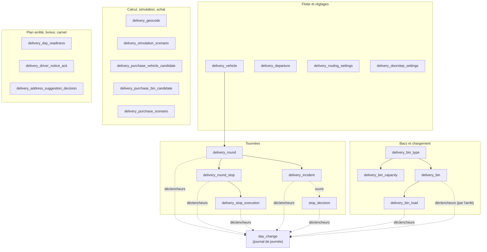
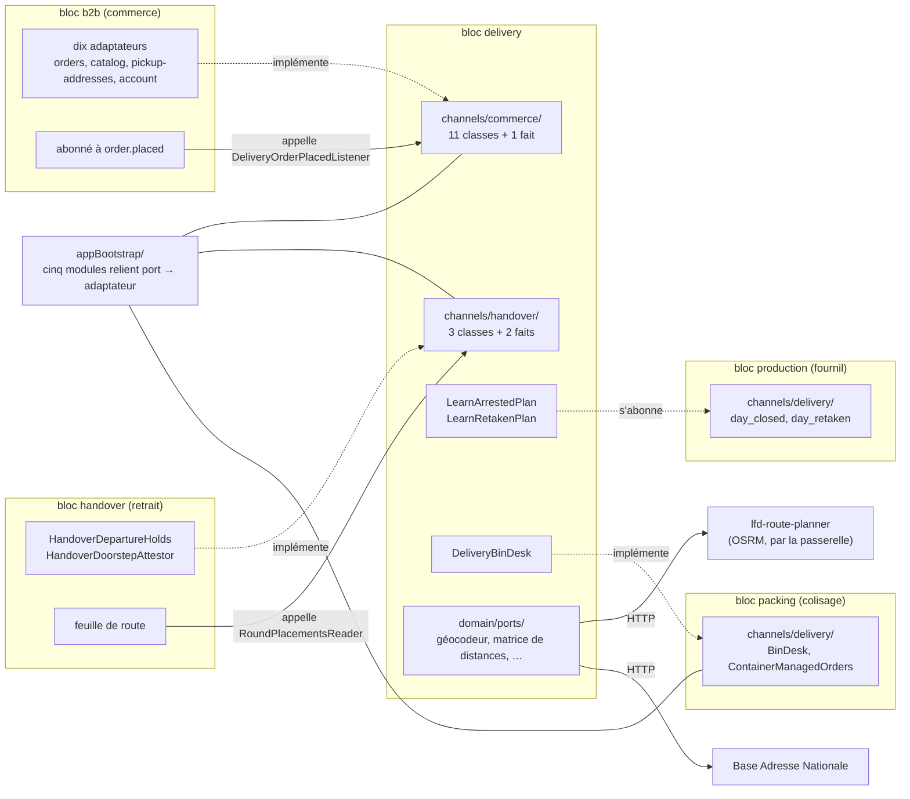

# L'isolation de la livraison — ses tables, ses ports, ses journaux

> ✅ **Référence**, écrite le 2026-09-30 avec le déménagement des tables dans le
> schéma `delivery` ([`plan-schema-delivery.md`](plan-schema-delivery.md)).
> Hugo : « on respecte vraiment le principe d'isolation, dialogue par port ».
>
> Ce document dit **ce qui est** : quelles tables appartiennent à la livraison,
> par où elle parle aux autres blocs, et quelles portes empêchent de tricher.
> Chaque affirmation a été relue dans le code le jour de l'écriture ; les
> comptes, les canaux, les journaux et les portes l'ont été de nouveau le
> 2026-10-07 (audit du dossier contre le code).

## 1. En deux phrases

La livraison est un **bloc** du monolithe (`apps/lfd-api/src/delivery/`), avec
**son schéma Postgres** (`delivery`) : personne d'autre ne lit ni n'écrit ses
tables, et elle ne lit ni n'écrit celles des autres. Elle ne parle aux autres
blocs que par **quatre canaux** — deux qu'elle déclare
(`delivery/channels/commerce/`, `delivery/channels/handover/`), deux que le
fournil et le colisage déclarent pour elle (`production/channels/delivery/`,
`packing/channels/delivery/`) — et au monde par ses routes HTTP, ses faits de
journal et ses faits durables (§ 4).

## 2. Les trois séparations d'un monolithe modulaire

| Séparation      | Ce qui la porte                                                                                                          | Ce qui la vérifie                                                                                                                                                                                                                                                                                                            |
| --------------- | ------------------------------------------------------------------------------------------------------------------------ | ---------------------------------------------------------------------------------------------------------------------------------------------------------------------------------------------------------------------------------------------------------------------------------------------------------------------------- |
| **Le code**     | un dossier par bloc ; la matrice des frontières du `CLAUDE.md` (§ 3)                                                     | `lint:context-boundaries` (les imports)                                                                                                                                                                                                                                                                                      |
| **Les données** | **un schéma Postgres par bloc** (principe ; `handover` écrit encore dans `production`) — `delivery` depuis le 2026-09-30 | `lint:prisma-model-ownership` (qui écrit un modèle, et qui d'autre le lit), `lint:prisma-schema-layout` (un modèle déclare le schéma de son fichier), `lint:cross-schema-join` (pas de jointure SQL entre schémas), la garde D3 de `day-change-triggers.e2e-spec.ts` (un déclencheur n'écrit que dans le schéma de sa table) |
| **Le dialogue** | des **ports** : une classe abstraite déclarée par qui a besoin, implémentée par qui sait, reliée par `appBootstrap/`     | `lint:context-boundaries` (seuls les dossiers `channels/` se franchissent)                                                                                                                                                                                                                                                   |

Ce qui reste commun, et c'est assumé :

- **une base, un client Prisma** : n'importe quel code _pourrait_ interroger
  n'importe quelle table — ce sont les portes ci-dessus qui l'interdisent,
  pas la base ;
- **un utilisateur Postgres** pour toute l'API (`prisma_migration`, propriétaire
  de tous les schémas, relevé le 2026-09-30) ;
- **le journal d'activité** (`growth.activity_events`), transverse par nature,
  que la livraison n'atteint que par le publieur d'événements du socle.

Le niveau d'après — un rôle Postgres par bloc, qui rendrait le franchissement
**impossible** plutôt qu'interdit — n'est pas fait (§ 7).

## 3. Les tables — schéma `delivery`

**Vingt-deux tables** (`@@schema("delivery")` dans
`prisma/schema/delivery.prisma`, recomptées le 2026-10-07) :

| Table                                        | Ce qu'elle tient                                                                                                                                             | Écrite par                                                                                                         |
| -------------------------------------------- | ------------------------------------------------------------------------------------------------------------------------------------------------------------ | ------------------------------------------------------------------------------------------------------------------ |
| `delivery_vehicle`                           | la flotte : plaque, espace utile, froid, énergie, passages de roue                                                                                           | agrégat `Vehicle`                                                                                                  |
| `delivery_departure`                         | le point de départ des tournées                                                                                                                              | réglage                                                                                                            |
| `delivery_routing_settings`                  | les réglages du calculateur (marge, durée d'arrêt…)                                                                                                          | réglage                                                                                                            |
| `delivery_doorstep_settings`                 | la décision réglée d'avance à la porte — demander, déposer, rapporter —, une ligne (2026-10-01, B3 bis)                                                      | réglage                                                                                                            |
| `delivery_round`                             | une tournée : jour, véhicule, passage, départ                                                                                                                | agrégat `DeliveryRound`                                                                                            |
| `delivery_round_stop`                        | un arrêt : commande (identifiant opaque), position, `closed_at`                                                                                              | agrégat `DeliveryRound`                                                                                            |
| `delivery_stop_execution`                    | l'instantané d'un arrêt au départ (adresse, contact, fenêtre), puis son arrivée (`arrived_at`, la position au geste)                                         | le départ ; l'arrivée du livreur (`DoorstepStop`)                                                                  |
| `delivery_incident`                          | les problèmes déclarés à la porte (famille, motif, note, photo), par tournée et arrêt (2026-10-01, lot A de la porte)                                        | le livreur (`DeliveryIncident`)                                                                                    |
| `stop_decision`                              | la décision vivante d'un arrêt signalé — autoriser le dépôt ou rapporter —, une ligne par arrêt (2026-10-01, B3)                                             | agrégat `StopDecision` : ouverte par le signalement, répondue par le commercial ou par la décision réglée d'avance |
| `delivery_geocode`                           | le cache de géocodage                                                                                                                                        | le calculateur                                                                                                     |
| `delivery_bin_type`, `delivery_bin_capacity` | les formats de bacs et leurs contenances                                                                                                                     | réglage                                                                                                            |
| `delivery_bin`, `delivery_bin_load`          | les bacs déclarés et leur chargement                                                                                                                         | colisage, chargement                                                                                               |
| `delivery_simulation_scenario`               | les scénarios du simulateur                                                                                                                                  | simulateur                                                                                                         |
| `delivery_purchase_*_candidate`              | la bibliothèque d'achat                                                                                                                                      | assistant d'achat                                                                                                  |
| `delivery_purchase_scenario`                 | les scénarios d'achat (une sélection du tableau, citée par identifiants)                                                                                     | assistant d'achat (2026-10-01)                                                                                     |
| `delivery_day_readiness`                     | le plan arrêté vu par la livraison : par journée, l'ensemble des livraisons que les clôtures et les retirages du fournil lui ont apprises (2026-10-06, CA6a) | les abonnés durables `LearnArrestedPlan` et `LearnRetakenPlan` (agrégat `DeliveryDayReadiness`)                    |
| `delivery_driver_notice_ack`                 | l'accusé de lecture du texte d'information du livreur, par fiche et par version (2026-10-06)                                                                 | « J'ai compris » du livreur (`AcknowledgeDriverNoticeHandler`)                                                     |
| `delivery_address_suggestion_decision`       | ce que le bureau a décidé d'une suggestion de correction du carnet — ignorée ou appliquée (2026-10-06)                                                       | le bureau (`IgnoreAddressPointSuggestionHandler`, `ApplyAddressPointSuggestionHandler`)                            |
| `day_change`                                 | le journal de journée de la livraison                                                                                                                        | **ses déclencheurs**, rien d'autre                                                                                 |

La purge des positions au geste (60 jours, `PurgeStalePositionsHandler`) met
à `NULL` les colonnes de position de `delivery_round_stop`,
`delivery_stop_execution` et `delivery_address_suggestion_decision` ; elle ne
supprime aucune ligne.

**Aucune clé étrangère ne sort de ce schéma, et aucune n'y entre.** Une
commande est désignée par son identifiant (`order_id`, une chaîne), jamais par
une clé vers `public.orders` : une commande annulée ne fait pas disparaître
une tournée déjà partie. C'est le même principe que la production (§ 3 du
`CLAUDE.md` : « identifiant opaque + snapshot »).

## 4. Les ports — par où la livraison parle

### 4.1 Ce que la livraison demande au commerce — `delivery/channels/commerce/`

Le canal publie **onze classes abstraites et un fait durable** (relevés dans
`delivery/channels/commerce/index.ts` le 2026-10-07). **Dix** classes sont
déclarées **par la livraison**, implémentées **par le commerce**, et reliées
dans `appBootstrap/delivery-feed.module.ts` :

| Port                            | Méthodes                                                                       | Implémenté par                                                 | Pour quoi                                                                                           |
| ------------------------------- | ------------------------------------------------------------------------------ | -------------------------------------------------------------- | --------------------------------------------------------------------------------------------------- |
| `DeliveryOrdersReader`          | `expectedOn(day)`, `byIds(ids)`, `departureSheetsOf(ids)`, `stopPointsOf(ids)` | `b2b/orders/…/prisma-delivery-orders.reader.ts`                | les commandes à livrer un jour, leurs faits, leur fiche de départ, leur point GPS                   |
| `DeliveryOrderLinesReader`      | `linesOf(orderId)`                                                             | `b2b/orders/…/prisma-delivery-order-lines.reader.ts`           | les lignes d'une commande, pour proposer le colisage et estimer sa demande en bacs (CA4)            |
| `DeliveryProductsReader`        | `sold()`                                                                       | `b2b/catalog/…/catalog-delivery-products.reader.ts`            | les produits vendus et leur **froid**, pour les contenances                                         |
| `DepartureCandidatesReader`     | `list()`                                                                       | `b2b/pickup-addresses/…/pickup-departure-candidates.reader.ts` | les points de retrait qui peuvent servir de départ                                                  |
| `DeliveryProceduresReader`      | `proceduresOf(orderIds)`                                                       | `b2b/orders/…/prisma-delivery-procedures.reader.ts`            | la procédure de l'adresse d'une commande, lue vivante pour le livreur                               |
| `DeliveryStepPhotosReader`      | `photoOf(orderId, stepId)`                                                     | `b2b/orders/…/prisma-delivery-step-photos.reader.ts`           | la photo d'une étape de cette procédure                                                             |
| `DeliveryOrderStatesReader`     | `statesOf(orderIds)`                                                           | `b2b/orders/…/prisma-delivery-order-states.reader.ts`          | où en est la commande d'un arrêt, vue de la porte                                                   |
| `CommerceDayVersionReader`      | `versionOf(day)`                                                               | `b2b/orders/…/prisma-commerce-day-version.reader.ts`           | la version de journée du commerce, pour « Ma tournée » (§ 5)                                        |
| `DeliveryAddressPointsReader`   | `addressesOfOrders(orderIds)`                                                  | `b2b/orders/…/prisma-delivery-address-points.reader.ts`        | l'adresse du carnet derrière une commande livrée, et ses deux points (suggestions de correction)    |
| `DeliveryAddressPointCorrector` | `correct(correction)`                                                          | `b2b/account/…/commerce-delivery-address-point-corrector.ts`   | « corrige ce point du carnet » : le carnet décide et écrit, dans l'unité de travail de la livraison |

La onzième va **dans l'autre sens** : `DeliveryOrderPlacedListener`
(`orderPlaced(orderId)`) est déclarée **et implémentée** par la livraison
(`delivery/application/delivery-stops-locating.ts`), et **appelée** par le
commerce depuis son abonné à `order.placed`
(`b2b/orders/application/handlers/tell-delivery-order-placed.handler.ts`) ;
elle est reliée dans `appBootstrap/delivery-stops-locating.module.ts`. La
livraison y situe l'adresse dès la commande (CA0,
[composition automatique](composition-automatique.md)). C'est le seul port du
canal dans ce sens : la livraison ne peut pas écouter un fait du commerce, et
`order.placed` n'est pas un fait durable.

Le fait durable est `DeliveryRoundDepartedFact` (`delivery.round_departed`,
DD1, 2026-10-06) : déclaré dans le canal du retrait (§ 4.1 bis) et
**réexporté** ici, parce que le commerce n'a que ce dossier comme surface vers
la livraison. Son abonné `b2b.mail-delivery-en-route` envoie le courriel « en
route » ([`en-route.md`](en-route.md)). Il remplace l'ancienne annonce du
départ en mémoire (`DeliveryDepartureAnnouncer`, retirée).

**Le sens compte** : c'est la livraison qui déclare, le commerce qui
implémente. La livraison n'importe rien du commerce ; le commerce n'importe de
la livraison que ce dossier, et n'en connaît que ces contrats.
`appBootstrap/` est le seul à voir ensemble les ports et leurs adaptateurs.

Le froid d'un produit fait deux sauts : le référentiel le publie par son canal
vers la plateforme (`pim/channels/b2b-platform/`), le commerce le relaie par
`DeliveryProductsReader`. La livraison ne lit jamais le PIM.

### 4.1 bis Ce que la livraison demande au retrait — `delivery/channels/handover/`

Ouvert le 2026-10-01 ([`a-la-porte.md`](a-la-porte.md), § 5, BQ — **la garde
passe au livreur au départ**). Le canal publie **trois classes abstraites et
deux faits durables** (relevés le 2026-10-07) :

| Pièce                           | Forme                                                     | Implémenté ou lu par                                                                                                    | Pour quoi                                                                                                                                                                                    |
| ------------------------------- | --------------------------------------------------------- | ----------------------------------------------------------------------------------------------------------------------- | -------------------------------------------------------------------------------------------------------------------------------------------------------------------------------------------- |
| `DepartureHoldsReader`          | `heldOrders(orderIds)`                                    | le retrait (`HandoverDepartureHolds`), dans la transaction du départ (deux portes)                                      | une commande retenue au contrôle qualité ne part pas ; le refus nomme l'arrêt                                                                                                                |
| `DoorstepHandoverAttestor`      | `stageProofs`, `attest`, `republication`, `discardProofs` | le retrait (`HandoverDoorstepAttestor`) : les images hors transaction, l'attestation dans l'unité de travail du livreur | « Remis au client », « Déposé avec preuve » : la règle du comptoir ; l'attestation, ses pièces et le fait `handover.handed_over` s'écrivent dans la même transaction (boîte d'envoi, lot E2) |
| `RoundPlacementsReader`         | `placementsOf(day, orderIds)`                             | **la livraison** (`PrismaRoundPlacementsReader`), appelée par le retrait pour la feuille de route                       | la tournée et le rang de chaque arrêt (2026-10-06)                                                                                                                                           |
| `DeliveryRoundDepartedFact`     | fait durable `delivery.round_departed`                    | le retrait (`handover.record-round-departed`), le commerce (`b2b.mail-delivery-en-route`)                               | le départ : le retrait garde « partie » (`production.order_departure`), le commerce envoie « en route »                                                                                      |
| `DeliveryOrdersBroughtBackFact` | fait durable `delivery.orders_brought_back`               | le retrait (`handover.record-orders-brought-back`)                                                                      | « Rapporter » — le commercial, ou la décision réglée d'avance : le retrait garde le retour                                                                                                   |

Les deux ports du retrait sont reliés dans
`appBootstrap/delivery-handover-feed.module.ts` ; `RoundPlacementsReader`, que
la livraison implémente elle-même, dans
`appBootstrap/delivery-round-placements.module.ts`.

Le retrait répond à `DepartureHoldsReader` par le port que la production
publie (`QualityHoldsReader`), au jour demandé de chaque commande — comme au
comptoir. Il offre « partie » au fournil par `OrderCustodyReader`
(`production/channels/handover/`, que le retrait implémente) : le contrôle
qualité refuse alors un verdict sur une commande partie (« La commande est
partie : le produit n'est plus là. ») ou déjà retirée.

`lint:context-boundaries` n'autorise `handover → delivery` que par ce dossier ;
`delivery → handover` reste interdit. La matrice du `CLAUDE.md` le dit.

**Le départ et le retour passent par la boîte d'envoi** depuis DD1
(2026-10-06 ; la boîte : migration `20261004120000_la_boite_d_envoi`). Le
départ écrit son fait dans sa transaction : un départ annulé n'en a pas, un
départ validé est livré au moins une fois — tout de suite après la validation,
sinon par le balayage de rattrapage —, et un abonné en échec est rejoué (dix
essais) avant de finir en message mort, visible. Entre la validation et le
passage de l'abonné, le fournil peut encore juger la commande. Les annonces en
mémoire d'avant (`DepartedOrdersAnnouncer`, `BroughtBackOrdersAnnouncer`,
appelées après la validation), qu'aucun rejeu ne réparait, sont retirées
([`a-la-porte.md`](a-la-porte.md), § 5).

### 4.1 ter Ce que le fournil et le colisage publient pour elle

Deux canaux de plus, déclarés **par les autres** et franchis par la livraison
seule : `delivery → production` et `delivery → packing` sont permis par ces
dossiers, l'autre sens reste interdit — le fournil et le colisage publient
sans savoir qui écoute, ni qui les branche.

| Canal                                                  | Ce qu'il porte                                                                                                                                                                                                                                                             | Ce qu'en fait la livraison                                                                                                                                                                                                                                                                       |
| ------------------------------------------------------ | -------------------------------------------------------------------------------------------------------------------------------------------------------------------------------------------------------------------------------------------------------------------------- | ------------------------------------------------------------------------------------------------------------------------------------------------------------------------------------------------------------------------------------------------------------------------------------------------ |
| `production/channels/delivery/` (2026-10-04, option B) | deux faits durables : `production.day_closed` (l'arrêt du plan) et `production.day_retaken` (le retirage)                                                                                                                                                                  | deux abonnés `@DurableHandler`, `delivery.learn-arrested-plan` et `delivery.learn-retaken-plan`, rangent l'ensemble du jour dans `delivery_day_readiness` et sonnent le bureau ([composition automatique](composition-automatique.md), § 2.2) ; le détail des commandes, elle le lit au commerce |
| `packing/channels/delivery/` (2026-10-04, K2b)         | `BinDesk` — déclarer, annuler, partager un bac, proposer, « ces bacs sont-ils vivants ? » —, que la livraison **implémente** (`delivery/application/delivery-bin-desk.ts`) dans la transaction du colisage ; `ContainerManagedOrders`, que le colisage implémente lui-même | `BinDesk` est injecté dans huit handlers du colisage (et dans le lecteur de son tableau) ; trois handlers de la livraison — déclarer, annuler, partager un bac — lisent `ContainerManagedOrders` et refusent une commande gérée au colisage                                                      |

Le colisage est relié dans `appBootstrap/packing-delivery-feed.module.ts`. Les
faits du fournil n'ont pas de port à relier : un abonné `@DurableHandler` est
découvert au démarrage.

### 4.2 Ce que la livraison demande au monde — `delivery/domain/ports/`

Les services extérieurs passent par des ports du domaine, implémentés dans
`delivery/infrastructure/` :

- **le calcul routier** — la matrice de distances et la géométrie des
  trajets, servies par `lfd-route-planner` (OSRM) **à travers la passerelle**,
  avec un jeton ;
- **le géocodage** — la Base Adresse Nationale, avec son cache
  `delivery_geocode`.

Sans calcul routier, le calculateur refuse de proposer : il n'y a pas de
repli « à vol d'oiseau » (retiré, faux en montagne).

### 4.3 Ce que la livraison dit aux autres

- **ses routes HTTP** (`admin/livraison/*`), que lisent les écrans — et, pour
  ses balayages, le cron du Worker (`container/worker.ts`) ;
- **ses faits de journal** (`delivery_round.*`, `delivery_bin.*`,
  `delivery_purchase_*`, …), publiés par le publieur du socle ;
- **ses faits durables** — `delivery.round_departed` et
  `delivery.orders_brought_back`, écrits dans la boîte d'envoi (§ 4.1 bis) ;
- **sa version de journée** (§ 5).

Trois blocs l'appellent en code, chacun par un port que la livraison
implémente : le commerce (`DeliveryOrderPlacedListener`, à chaque commande
passée), le retrait (`RoundPlacementsReader`, pour la feuille de route) et le
colisage (`BinDesk`, pour chaque bac). Dans l'autre sens, le commerce et le
retrait implémentent ce que la livraison leur demande (§ 4.1, § 4.1 bis).

## 5. Les journaux de journée — chacun chez soi

Un écran qui suit une journée (colisage, fiche d'atelier, comptoir,
supervision, « Ma tournée ») ne relit tout que si **un numéro de version** a
bougé. Ce numéro vient d'un **journal** alimenté par des déclencheurs
Postgres — **quatre** journaux, un par schéma qui en tient un. L'écran des
tournées du bureau n'en suit aucun (relevé le 2026-10-07).

| Journal                 | Alimenté par                                                                                                                                                                                                                | Lu par                                                                                                                                                                    |
| ----------------------- | --------------------------------------------------------------------------------------------------------------------------------------------------------------------------------------------------------------------------- | ------------------------------------------------------------------------------------------------------------------------------------------------------------------------- |
| `public.day_change`     | les commandes (`orders`)                                                                                                                                                                                                    | `GET` version du commerce                                                                                                                                                 |
| `production.day_change` | les tables du fournil                                                                                                                                                                                                       | `GET admin/production/version`, `admin/supervision/production-version`                                                                                                    |
| `packing.day_change`    | les tables du colisage (2026-10-04, K2)                                                                                                                                                                                     | les mêmes routes que le fournil : sa version **additionne** celle du colisage, par `PackingDayVersionReader` (`production/channels/packing/`, que le colisage implémente) |
| `delivery.day_change`   | **sept** tables : `delivery_round`, `delivery_round_stop`, `delivery_stop_execution`, `delivery_bin_load`, `delivery_incident`, `stop_decision` ; `delivery_bin` par la journée des arrêts de sa commande (2026-10-01, PL4) | `GET admin/livraison/version` (suivie par le poste de colisage) ; `GET admin/livraison/ma-tournee/version` (avec le commerce, par son port)                               |

**Jusqu'au 2026-09-30, les tables de livraison écrivaient dans le journal du
fournil**, par douze déclencheurs branchés sur une fonction du fournil. C'était
un dialogue direct en base, sans port, et la garde qui devait le voir ne
regardait qu'une moitié du problème (elle comparait une fonction à son propre
schéma, jamais au schéma de la table qui la déclenche). Effet de bord : les
quatre écrans du fournil se relisaient **à chaque geste de tournée**, sans
jamais lire une table de livraison.

Depuis le déménagement : la livraison a son journal, ses fonctions
(`record_day_change_by_service_day`, et `record_day_change_by_bin_order` pour
le bac), sa route de version, et son **élagage** (7 jours), dans son bloc,
déclenché par le même cron nocturne que celui du fournil
(`container/worker.ts`) mais par **sa propre route**. Le fournil n'efface
jamais `delivery.day_change`.

**« Ma tournée » a besoin des deux** (2026-10-01, PL4) : sa route de version
additionne le numéro de la livraison et celui du commerce, lu par le port
`CommerceDayVersionReader` (déclaré dans `delivery/channels/commerce/`,
implémenté par `b2b/orders/` depuis `public.day_change`).

**Un écran qui a besoin des deux les suit toutes les deux.** Le poste de
colisage suit `production` et `delivery` depuis le 2026-10-02, quand le poste
peut lire la livraison (`delivery_rounds:read` ou `delivery_loading:read`) :
une tournée recomposée range la pile autrement (`watchedJournals`,
`production/colisage/colisage.ts`). C'est **l'écran** qui suit les deux
versions. Jamais un déclencheur qui écrit chez l'autre.

## 6. Les portes, et ce qu'elles ne voient pas

| Porte                                        | Ce qu'elle refuse                                                                                                                                                                                                                                                                                                                                                                                               |
| -------------------------------------------- | --------------------------------------------------------------------------------------------------------------------------------------------------------------------------------------------------------------------------------------------------------------------------------------------------------------------------------------------------------------------------------------------------------------- |
| `lint:context-boundaries`                    | un import de `delivery/` vers un autre bloc hors `staff/`, `platform/` et deux canaux — `production/channels/delivery/`, `packing/channels/delivery/` ; un import d'un autre bloc vers `delivery/` hors de ses canaux — le commerce par `delivery/channels/commerce/`, le retrait par `delivery/channels/handover/`, personne d'autre (`ALLOWED` et `PORT_SURFACE`, `dev-toolbox/gates/context-boundaries.mjs`) |
| `lint:prisma-model-ownership`                | un bloc qui **lit ou écrit** (Prisma) un modèle dont un autre bloc est l'auteur — le propriétaire d'un modèle est le bloc qui l'écrit                                                                                                                                                                                                                                                                           |
| `lint:prisma-schema-layout`                  | un modèle rangé dans `delivery.prisma` qui déclarerait un autre schéma                                                                                                                                                                                                                                                                                                                                          |
| `lint:cross-schema-join`                     | une jointure SQL écrite à la main entre deux schémas                                                                                                                                                                                                                                                                                                                                                            |
| garde D3 (`day-change-triggers.e2e-spec.ts`) | un déclencheur dont la table, la fonction et le corps ne sont pas dans **le même** schéma — un test prouve qu'elle dénonce l'ancien branchement                                                                                                                                                                                                                                                                 |
| garde D7 (même fichier)                      | **toute** table des schémas `production`, `delivery` et `packing` — qu'elle porte une journée ou non — et toute table de `public` qui porte un jour, sans ses trois déclencheurs de journal, hors liste d'exceptions nommées (`UNWATCHED`)                                                                                                                                                                      |

**Ce qu'aucune ne voit**, et qu'il faut garder en tête à la relecture :

- une table d'un autre bloc lue ou écrite **en Prisma direct** sous une autre
  forme que `prisma.<modèle>.…` — `prisma-model-ownership` voit les lectures
  comme les écritures, mais seulement sous cette forme : le client d'une
  transaction (`tx.<modèle>.…`) lui échappe, comme un modèle qu'aucun bloc
  n'écrit (il n'a pas de propriétaire) et les tests (« c'est arrivé deux
  fois », `CLAUDE.md` § 1) ;
- du SQL écrit en dur qui cite un schéma dans une chaîne : le déménagement a
  trouvé **huit** requêtes `$queryRaw` qui citaient `"production"."delivery_*"`
  — un `grep` les a trouvées, aucune porte.

## 7. Ce que ce n'est pas encore

- **Un rôle Postgres par bloc.** L'API se connecte avec un seul utilisateur,
  propriétaire de tous les schémas. Avec un rôle `delivery` limité au schéma
  `delivery`, une requête vers le fournil serait refusée **par la base**. Coût :
  une connexion et un client Prisma par bloc.
- **Des transactions qui ne traversent pas les blocs.** La boîte d'envoi
  existe (migration `20261004120000_la_boite_d_envoi`) et porte déjà ce qui
  peut attendre : le départ et le retour de la livraison (DD1), l'arrêt du
  plan et le retirage du fournil. Ce qui traverse encore **dans** une
  transaction, ce sont les ports synchrones : `DepartureHoldsReader` dans
  celle du départ, `DoorstepHandoverAttestor` dans celle du livreur, `BinDesk`
  dans celle du colisage, `DeliveryAddressPointCorrector` dans celle de la
  livraison. C'est confortable tant qu'il n'y a qu'une base ; une extraction
  les remplacerait par des échanges qui ne partagent plus la transaction.
- _(Les vues de compatibilité `production.delivery_*` qui ont servi l'ancien
  binaire pendant le remplacement sont parties au déploiement suivant,
  migration `20260930200000_les_vues_de_compatibilite_partent`.)_

## 8. Pour le développeur — ajouter quelque chose à la livraison

- **Une table** : dans `prisma/schema/delivery.prisma`, `@@schema("delivery")`,
  jamais de clé étrangère vers un autre schéma. La garde D7 surveille **toute**
  table du schéma, qu'elle porte une journée ou non : si elle en porte une,
  ses trois déclencheurs sur `delivery.record_day_change_by_service_day()` ;
  sinon, une exception nommée, avec sa raison, dans `UNWATCHED`
  (`test/day-change-triggers.e2e-spec.ts`). Deux tables du 2026-10-06
  (`delivery_driver_notice_ack`, `delivery_address_suggestion_decision`)
  n'avaient ni l'un ni l'autre, sur la foi de l'ancienne phrase « si elle
  porte une journée » : elles entrent dans `UNWATCHED` avec la correction B7
  de l'audit du 2026-10-07.
- **Un besoin d'une donnée du commerce** : un port de plus dans
  `delivery/channels/commerce/`, implémenté côté `b2b/`, relié dans
  `appBootstrap/delivery-feed.module.ts`. Jamais un `prisma.order…` dans
  `delivery/`.
- **Un besoin du retrait** : même forme — un port de plus dans
  `delivery/channels/handover/` (§ 4.1 bis), implémenté par le retrait.
- **Un fait du fournil ou du colisage** : il se lit dans **leur** canal
  (`production/channels/delivery/`, `packing/channels/delivery/`, § 4.1 ter),
  et c'est à eux de l'y publier. Jamais une table de `production` ni de
  `packing` lue depuis `delivery/`.
- **Du SQL écrit à la main** : toujours qualifié `"delivery"."…"`, et jamais
  un autre schéma.
