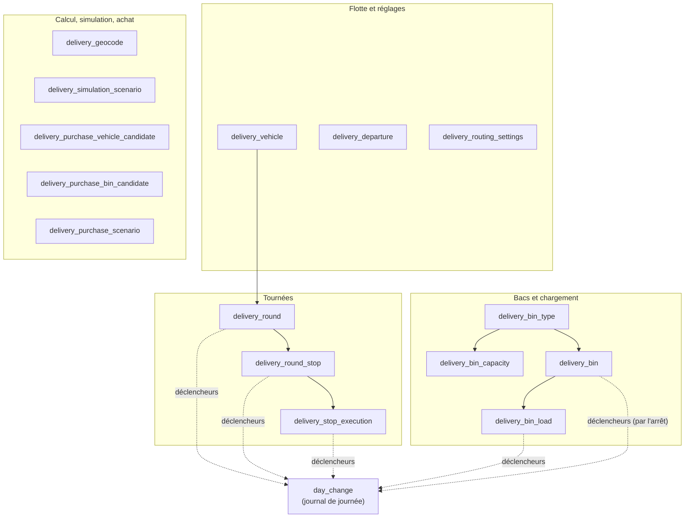
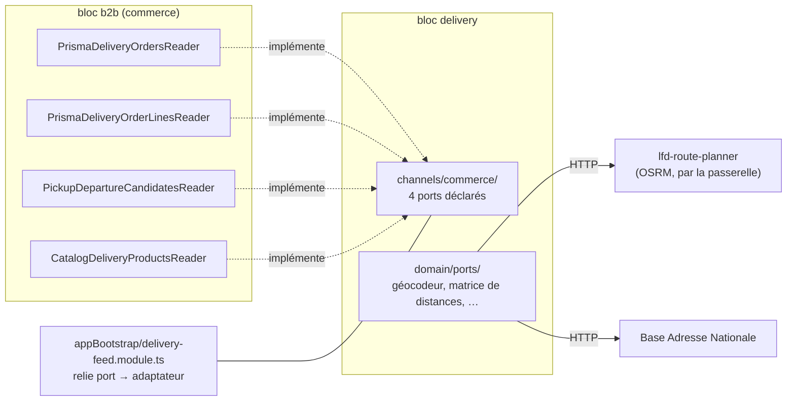

# L'isolation de la livraison — ses tables, ses ports, ses journaux

> ✅ **Référence**, écrite le 2026-09-30 avec le déménagement des tables dans le
> schéma `delivery` ([`plan-schema-delivery.md`](plan-schema-delivery.md)).
> Hugo : « on respecte vraiment le principe d'isolation, dialogue par port ».
>
> Ce document dit **ce qui est** : quelles tables appartiennent à la livraison,
> par où elle parle aux autres blocs, et quelles portes empêchent de tricher.
> Chaque affirmation a été relue dans le code le jour de l'écriture.

## 1. En deux phrases

La livraison est un **bloc** du monolithe (`apps/lfd-api/src/delivery/`), avec
**son schéma Postgres** (`delivery`) : personne d'autre ne lit ni n'écrit ses
tables, et elle ne lit ni n'écrit celles des autres. Tout ce qu'elle sait du
commerce, du catalogue ou des points de retrait lui arrive par des **ports**
qu'elle déclare et que d'autres implémentent ; tout ce qu'elle dit au monde
passe par ses routes HTTP et par des événements de journal.

## 2. Les trois séparations d'un monolithe modulaire

| Séparation      | Ce qui la porte                                                                                                      | Ce qui la vérifie                                                                                                                                                                                                                                                                                       |
| --------------- | -------------------------------------------------------------------------------------------------------------------- | ------------------------------------------------------------------------------------------------------------------------------------------------------------------------------------------------------------------------------------------------------------------------------------------------------- |
| **Le code**     | un dossier par bloc ; la matrice des frontières du `CLAUDE.md` (§ 3)                                                 | `lint:context-boundaries` (les imports)                                                                                                                                                                                                                                                                 |
| **Les données** | **un schéma Postgres par bloc** — `delivery` depuis le 2026-09-30                                                    | `lint:prisma-model-ownership` (qui écrit quel modèle), `lint:prisma-schema-layout` (un modèle déclare le schéma de son fichier), `lint:cross-schema-join` (pas de jointure SQL entre schémas), la garde D3 de `day-change-triggers.e2e-spec.ts` (un déclencheur n'écrit que dans le schéma de sa table) |
| **Le dialogue** | des **ports** : une classe abstraite déclarée par qui a besoin, implémentée par qui sait, reliée par `appBootstrap/` | `lint:context-boundaries` (seuls les dossiers `channels/` se franchissent)                                                                                                                                                                                                                              |

Ce qui reste commun, et c'est assumé :

- **une base, un client Prisma** : n'importe quel code _pourrait_ interroger
  n'importe quelle table — ce sont les portes ci-dessus qui l'interdisent,
  pas la base ;
- **un utilisateur Postgres** pour toute l'API (`prisma_migration`, propriétaire
  de tous les schémas, relevé le 2026-09-30) ;
- **le journal d'activité** (`growth.activity_events`), transverse par nature,
  que la livraison n'atteint que par le publieur d'événements du socle.

Le niveau d'après — un rôle Postgres par bloc, qui rendrait le franchissement
**impossible** plutôt qu'interdit — n'est pas fait (§ 7).

## 3. Les tables — schéma `delivery`

| Table                                        | Ce qu'elle tient                                                         | Écrite par                         |
| -------------------------------------------- | ------------------------------------------------------------------------ | ---------------------------------- |
| `delivery_vehicle`                           | la flotte : plaque, espace utile, froid, énergie, passages de roue       | agrégat `Vehicle`                  |
| `delivery_departure`                         | le point de départ des tournées                                          | réglage                            |
| `delivery_routing_settings`                  | les réglages du calculateur (marge, durée d'arrêt…)                      | réglage                            |
| `delivery_round`                             | une tournée : jour, véhicule, passage, départ                            | agrégat `DeliveryRound`            |
| `delivery_round_stop`                        | un arrêt : commande (identifiant opaque), position, `closed_at`          | agrégat `DeliveryRound`            |
| `delivery_stop_execution`                    | l'instantané d'un arrêt au départ (adresse, contact, fenêtre)            | le départ                          |
| `delivery_geocode`                           | le cache de géocodage                                                    | le calculateur                     |
| `delivery_bin_type`, `delivery_bin_capacity` | les formats de bacs et leurs contenances                                 | réglage                            |
| `delivery_bin`, `delivery_bin_load`          | les bacs déclarés et leur chargement                                     | colisage, chargement               |
| `delivery_simulation_scenario`               | les scénarios du simulateur                                              | simulateur                         |
| `delivery_purchase_*_candidate`              | la bibliothèque d'achat                                                  | assistant d'achat                  |
| `delivery_purchase_scenario`                 | les scénarios d'achat (une sélection du tableau, citée par identifiants) | assistant d'achat (2026-10-01)     |
| `day_change`                                 | le journal de journée de la livraison                                    | **ses déclencheurs**, rien d'autre |

**Aucune clé étrangère ne sort de ce schéma, et aucune n'y entre.** Une
commande est désignée par son identifiant (`order_id`, une chaîne), jamais par
une clé vers `public.orders` : une commande annulée ne fait pas disparaître
une tournée déjà partie. C'est le même principe que la production (§ 3 du
`CLAUDE.md` : « identifiant opaque + snapshot »).

## 4. Les ports — par où la livraison parle

### 4.1 Ce que la livraison demande au commerce — `delivery/channels/commerce/`

Quatre classes abstraites, déclarées **par la livraison**, implémentées **par
le commerce**, reliées dans `appBootstrap/delivery-feed.module.ts` :

| Port                        | Méthodes                                                                       | Implémenté par                                                 | Pour quoi                                                                         |
| --------------------------- | ------------------------------------------------------------------------------ | -------------------------------------------------------------- | --------------------------------------------------------------------------------- |
| `DeliveryOrdersReader`      | `expectedOn(day)`, `byIds(ids)`, `departureSheetsOf(ids)`, `stopPointsOf(ids)` | `b2b/orders/…/prisma-delivery-orders.reader.ts`                | les commandes à livrer un jour, leurs faits, leur fiche de départ, leur point GPS |
| `DeliveryOrderLinesReader`  | `linesOf(orderId)`                                                             | `b2b/orders/…/prisma-delivery-order-lines.reader.ts`           | les lignes d'une commande, pour proposer le colisage                              |
| `DeliveryProductsReader`    | `sold()`                                                                       | `b2b/catalog/…/catalog-delivery-products.reader.ts`            | les produits vendus et leur **froid**, pour les contenances                       |
| `DepartureCandidatesReader` | `list()`                                                                       | `b2b/pickup-addresses/…/pickup-departure-candidates.reader.ts` | les points de retrait qui peuvent servir de départ                                |

**Le sens compte** : c'est la livraison qui déclare, le commerce qui
implémente. La livraison ne connaît aucune classe du commerce ; le commerce ne
connaît de la livraison que ces quatre contrats. Aucun des deux n'importe
l'autre — `appBootstrap/` est le seul à les voir ensemble.

Le froid d'un produit fait deux sauts : le référentiel le publie par son canal
vers la plateforme (`pim/channels/b2b-platform/`), le commerce le relaie par
`DeliveryProductsReader`. La livraison ne lit jamais le PIM.

### 4.1 bis Ce que la livraison demande au retrait — `delivery/channels/handover/`

Ouvert le 2026-10-01 (`plan-a-la-porte.md`, § 10 ter, BQ — **la garde passe
au livreur au départ**). Deux classes abstraites, déclarées **par la
livraison**, implémentées **par le retrait** (`handover/application/services/`),
reliées dans `appBootstrap/delivery-handover-feed.module.ts` :

| Port                      | Méthode                   | Quand                                       | Pour quoi                                                                                     |
| ------------------------- | ------------------------- | ------------------------------------------- | --------------------------------------------------------------------------------------------- |
| `DepartureHoldsReader`    | `heldOrders(orderIds)`    | dans la transaction du départ (deux portes) | une commande retenue au contrôle qualité ne part pas ; le refus nomme l'arrêt                 |
| `DepartedOrdersAnnouncer` | `ordersDeparted(ids, at)` | **après** la validation (`AfterCommit`, B0) | le retrait garde « partie » par commande (`production.order_departure`) et l'offre au fournil |

Le retrait répond à la première par le port que la production publie
(`QualityHoldsReader`), au jour demandé de chaque commande — comme au
comptoir. Il offre la seconde au fournil par `OrderCustodyReader`
(`production/channels/handover/`, que le retrait implémente) : le contrôle
qualité refuse alors un verdict sur une commande partie (« La commande est
partie : le produit n'est plus là. ») ou déjà retirée.

`lint:context-boundaries` n'autorise `handover → delivery` que par ce dossier ;
`delivery → handover` reste interdit. La matrice du `CLAUDE.md` le dit.

⚠️ L'annonce est suivie en tâche de fond : si elle échoue après un départ
validé, le fournil peut encore juger la commande partie — l'état d'avant ce
lot, journalisé, et réparé par aucun rejeu aujourd'hui.

### 4.2 Ce que la livraison demande au monde — `delivery/domain/ports/`

Les services extérieurs passent par des ports du domaine, implémentés dans
`delivery/infrastructure/` :

- **le calcul routier** — la matrice de distances et la géométrie des
  trajets, servies par `lfd-route-planner` (OSRM) **à travers la passerelle**,
  avec un jeton ;
- **le géocodage** — la Base Adresse Nationale, avec son cache
  `delivery_geocode`.

Sans calcul routier, le calculateur refuse de proposer : il n'y a pas de
repli « à vol d'oiseau » (retiré, faux en montagne).

### 4.3 Ce que la livraison dit aux autres

- **ses routes HTTP** (`admin/livraison/*`), que seuls les écrans lisent ;
- **ses faits de journal** (`delivery_round.*`, `delivery_bin.*`,
  `delivery_purchase_*`, …), publiés par le publieur du socle ;
- **sa version de journée** (§ 5).

Aucun autre bloc n'appelle la livraison en code aujourd'hui. Le retrait
l'**implémente** (§ 4.1 bis) — il ne l'appelle pas.

## 5. Les journaux de journée — chacun chez soi

Un écran qui suit une journée (colisage, fiche d'atelier, comptoir,
supervision, tournées) ne relit tout que si **un numéro de version** a bougé.
Ce numéro vient d'un **journal** alimenté par des déclencheurs Postgres.

| Journal                 | Alimenté par                                                                                                                                                        | Lu par                                                                                                    |
| ----------------------- | ------------------------------------------------------------------------------------------------------------------------------------------------------------------- | --------------------------------------------------------------------------------------------------------- |
| `public.day_change`     | les commandes (`orders`)                                                                                                                                            | `GET` version du commerce                                                                                 |
| `production.day_change` | les tables du fournil                                                                                                                                               | `GET admin/production/version`, `admin/supervision/production-version`                                    |
| `delivery.day_change`   | `delivery_round`, `delivery_round_stop`, `delivery_stop_execution`, `delivery_bin_load` ; `delivery_bin` par la journée des arrêts de sa commande (2026-10-01, PL4) | `GET admin/livraison/version` ; `GET admin/livraison/ma-tournee/version` (avec le commerce, par son port) |

**Jusqu'au 2026-09-30, les tables de livraison écrivaient dans le journal du
fournil**, par douze déclencheurs branchés sur une fonction du fournil. C'était
un dialogue direct en base, sans port, et la garde qui devait le voir ne
regardait qu'une moitié du problème (elle comparait une fonction à son propre
schéma, jamais au schéma de la table qui la déclenche). Effet de bord : les
quatre écrans du fournil se relisaient **à chaque geste de tournée**, sans
jamais lire une table de livraison.

Depuis le déménagement : la livraison a son journal, sa fonction, sa route de
version, et son **élagage** (7 jours), dans son bloc, déclenché par le même
cron nocturne que celui du fournil (`container/worker.ts`) mais par **sa
propre route**. Le fournil n'efface jamais `delivery.day_change`.

**« Ma tournée » a besoin des deux** (2026-10-01, PL4) : sa route de version
additionne le numéro de la livraison et celui du commerce, lu par le port
`CommerceDayVersionReader` (déclaré dans `delivery/channels/commerce/`,
implémenté par `b2b/orders/` depuis `public.day_change`).

**Si un écran a un jour besoin des deux** — par exemple le panneau des bacs du
colisage, s'il devait se rafraîchir sur un chargement — c'est **l'écran** qui
suit les deux versions. Jamais un déclencheur qui écrit chez l'autre.

## 6. Les portes, et ce qu'elles ne voient pas

| Porte                                        | Ce qu'elle refuse                                                                                                                               |
| -------------------------------------------- | ----------------------------------------------------------------------------------------------------------------------------------------------- |
| `lint:context-boundaries`                    | un import de `delivery/` vers un autre bloc hors `platform/` et le socle staff ; un import d'un autre bloc vers `delivery/` hors `channels/`    |
| `lint:prisma-model-ownership`                | un bloc qui écrit (Prisma) un modèle qu'un autre possède                                                                                        |
| `lint:prisma-schema-layout`                  | un modèle rangé dans `delivery.prisma` qui déclarerait un autre schéma                                                                          |
| `lint:cross-schema-join`                     | une jointure SQL écrite à la main entre deux schémas                                                                                            |
| garde D3 (`day-change-triggers.e2e-spec.ts`) | un déclencheur dont la table, la fonction et le corps ne sont pas dans **le même** schéma — un test prouve qu'elle dénonce l'ancien branchement |
| garde D7 (même fichier)                      | une table qui porte une journée sans déclencheur de journal, hors liste d'exceptions nommées                                                    |

**Ce qu'aucune ne voit**, et qu'il faut garder en tête à la relecture :

- une classe d'infrastructure qui interroge une table d'un autre schéma **en
  Prisma direct** sans l'écrire — `prisma-model-ownership` ne regarde que les
  écritures (« c'est arrivé deux fois », `CLAUDE.md` § 1) ;
- du SQL écrit en dur qui cite un schéma dans une chaîne : le déménagement a
  trouvé **huit** requêtes `$queryRaw` qui citaient `"production"."delivery_*"`
  — un `grep` les a trouvées, aucune porte.

## 7. Ce que ce n'est pas encore

- **Un rôle Postgres par bloc.** L'API se connecte avec un seul utilisateur,
  propriétaire de tous les schémas. Avec un rôle `delivery` limité au schéma
  `delivery`, une requête vers le fournil serait refusée **par la base**. Coût :
  une connexion et un client Prisma par bloc.
- **Des transactions qui ne traversent pas les blocs.** La porte (lot 6) prévoit
  « un geste, une transaction » entre la livraison et le retrait (un port que
  `handover` implémente, dans la même transaction). C'est confortable tant
  qu'il n'y a qu'une base ; une extraction demanderait une boîte d'envoi
  (_outbox_) et des événements.
- _(Les vues de compatibilité `production.delivery_*` qui ont servi l'ancien
  binaire pendant le remplacement sont parties au déploiement suivant,
  migration `20260930200000_les_vues_de_compatibilite_partent`.)_

## 8. Pour le développeur — ajouter quelque chose à la livraison

- **Une table** : dans `prisma/schema/delivery.prisma`, `@@schema("delivery")`,
  jamais de clé étrangère vers un autre schéma ; si elle porte une journée,
  ses trois déclencheurs sur `delivery.record_day_change_by_service_day()`, ou
  une exception nommée dans la garde D7.
- **Un besoin d'une donnée du commerce** : un port de plus dans
  `delivery/channels/commerce/`, implémenté côté `b2b/`, relié dans
  `appBootstrap/delivery-feed.module.ts`. Jamais un `prisma.order…` dans
  `delivery/`.
- **Un besoin du fournil ou du retrait** : même forme — un canal déclaré par
  qui a besoin (`delivery/channels/<bloc>/`), implémenté par qui sait. Le
  premier est `delivery/channels/handover/` (§ 4.1 bis).
- **Du SQL écrit à la main** : toujours qualifié `"delivery"."…"`, et jamais
  un autre schéma.
