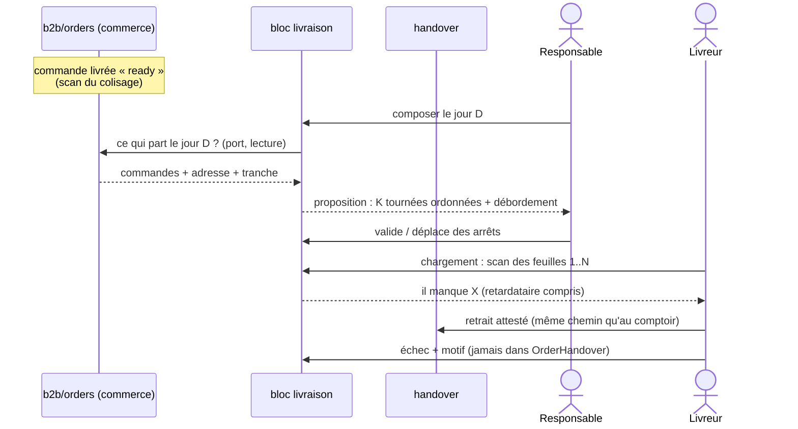
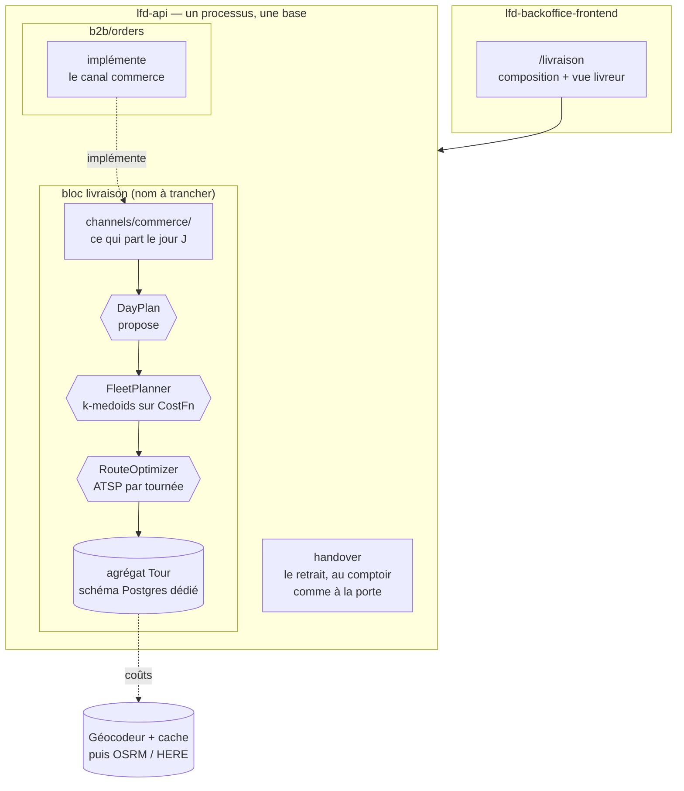

# Tournées de livraison — un contexte du back-office, plus une application

> 🔴 **Réécrit le 2026-09-29 : ROAD n'est plus une application séparée.**
>
> La note du 2026-08-06 décrivait une app de plus dans une « suite » : un
> backend NestJS à lui, sa base, son audience Auth0, son front en iframe dans un
> shell, et un flux HTTP signé depuis le backend B2B. **Rien de ce décor
> n'existe plus** (vérifié le 2026-09-29) :
>
> - la fédération est abandonnée et le shell retiré le 2026-08-20
>   ([`../suite/architecture-topologie-apps.md`](../suite/architecture-topologie-apps.md)) ;
> - il n'y a qu'**un** backend, `apps/lfd-api`, découpé en **blocs**
>   (`CLAUDE.md` §3), et **une** base à plusieurs schémas Postgres ;
> - il n'y a que trois apps : `lfd-api`, `lfd-backoffice-frontend`,
>   `lfc-ecommerce-frontend` ;
> - le back-office réserve déjà la route `/livraison`, vide exprès
>   ([`livraison-page.ts`](../../apps/lfd-backoffice-frontend/src/app/livraison/livraison-page/livraison-page.ts)) ;
> - le statut `ready` (« fabrication finie, en attente de retrait ») existe et
>   s'écrit au scan du QR de colisage.
>
> Et la [conception du retrait en livraison](conception-retrait-en-livraison.md)
> (2026-09-11) a tranché deux points que cette note contredisait : **un humain
> compose la tournée** (l'algorithme propose, il n'attribue pas), et **le geste
> chez le client appartient au bloc `handover`**. Ce document ne couvre donc
> plus que la **logistique** : composer, charger, rouler, consigner un échec.
>
> **Réécrit** : §1, §2 (deux lignes), §3, §4, §5, §8, §9, §10, §11 (point 4),
> §12, §13 (une hypothèse), §14, et `DeliveryJob` au §6. **Gardé tel quel** : les autres agrégats (§6), les ports et l'algorithme
> (§7), la résolution du point (§8.1) — ils ne dépendaient pas de la
> topologie. Toujours **rien de codé**.

## 1. Intention

La tournée sert **les livreurs et le responsable des tournées**, pas les
clients. Elle vit **dans `lfd-api`**, comme un bloc de plus, et **dans le
back-office**, sous `/livraison`.

Le fil conducteur :

1. Une commande livrée passe `ready` au scan du colisage ; elle porte son jour
   et, depuis la conception v1, une **tranche d'une heure** demandée.
2. Le contexte de livraison **lit** « ce qui part le jour J » par un port que le
   commerce implémente — pas de flux poussé, pas de copie à amender (§8).
3. Le matin, le responsable **compose** les tournées. `DayPlan` lui **propose**
   une répartition sur les véhicules disponibles et un ordre des arrêts ; il
   garde le dernier mot (conception v1, §3).
4. Au dépôt, le chargement est une **réconciliation d'ensemble** (« ai-je
   tout ? », conception v1, §4).
5. Le livreur suit **sa** tournée. Le retrait réussi s'atteste dans `handover`
   (le même chemin qu'au comptoir) ; l'échec se consigne ici, jamais dans
   `OrderHandover` (§9).

⚠️ **Tant qu'il n'y a qu'un véhicule, la journée EST la tournée** (conception
v1, §3). Tout ce qui suit sur la répartition ne se bâtit qu'au deuxième.

## 2. Ce qui est facile vs ce qui est dur

| Brique                                                                     | Difficulté      | Pourquoi                                                                                      |
| -------------------------------------------------------------------------- | --------------- | --------------------------------------------------------------------------------------------- |
| Bloc dans `lfd-api` + écran `/livraison` du back-office                    | **Facile**      | Même forme que `production` et `handover`. Pas de nouvelle app, pas d'audience.               |
| Domaine `DeliveryJob` / `Vehicle` / `Driver` / agrégats `Tour` & `DayPlan` | **Moyen**       | **Pas** du CRUD : invariants forts (§6).                                                      |
| Lecture du jour par un canal que le commerce implémente                    | **Petit**       | §8. Plus d'ingestion : même processus, même base, lecture à la demande.                       |
| Répartir K véhicules + ordonner chaque tournée                             | **Moyen**       | Clustering sur les **coûts** (k-medoids) + ATSP par véhicule. Pas d'OR-Tools à cette échelle. |
| Distances réelles                                                          | **Petit→Moyen** | Vol d'oiseau au MVP, OSRM self-host **sur hôte dédié** ensuite (§7, §11).                     |
| Carte livreur                                                              | **Petit**       | Leaflet + tuiles OSM (gratuit).                                                               |

**Verdict** : MVP utile en **quelques jours**. À l'échelle boulangerie (quelques
véhicules, dizaines d'arrêts) une **heuristique** suffit **durablement** ; OR-Tools
ne devient utile que pour des **fenêtres horaires** ou une **capacité** dures (§7).

## 3. Périmètre

**MVP (un véhicule)**

- Lecture de « ce qui part le jour J » par le canal du commerce (§8).
- Réconciliation au chargement, retardataire compris (conception v1, §4).
- Vue livreur : **sa** liste du jour (+ carte Leaflet) ; retrait attesté par
  `handover`, échec consigné ici (§9).
- Résolution du point (§8.1), pour la carte.

**Au deuxième véhicule**

- `Vehicle` + `Driver` + **disponibilité par jour**.
- `DayPlan(date)` : coûts vol d'oiseau + **proposition** de répartition
  (k-medoids) + ordre ATSP par tournée + débordement. Le responsable valide ou
  déplace.
- Les **tranches demandées** affichées pendant la composition, et un véhicule
  qui ne peut pas les tenir signalé (conception v1, §7).

**Plus tard**

- **OSRM Savoie** ou service managé (distances routières réelles).
- **OR-Tools** _si_ fenêtres horaires / capacités deviennent contraignantes —
  les tranches d'une heure en sont déjà une.
- Live tracking, ETA client, re-planification **en cours** de tournée.

## 4. Flux de bout en bout



## 5. Architecture (dans le monorepo)



**Où ça vit** — repris de la conception v1, §9, **non tranché** :

- le **retrait** (le geste) reste dans `handover/`, quel que soit
  l'acheminement ;
- la **logistique** est neuve et prend son bloc (la conception v1 l'appelle
  `delivery/`). Il faut le déclarer dans `BLOCK_OF` de
  `lint:context-boundaries`, sinon la porte échoue au premier commit ;
- la flèche est **`b2b → livraison`** (le commerce implémente le canal), jamais
  l'inverse — même forme que `production/channels/commerce/`, qui existe ;
- `livraison → handover` : à autoriser, ou à remplacer par un port ;
- son **schéma Postgres** est à choisir explicitement
  (`lint:prisma-model-ownership`, `lint:prisma-schema-layout`), et aucune clé
  étrangère ne le traverse.

## 6. Agrégats & invariants (ce n'est pas du CRUD)

- **`DeliveryJob`** — l'arrêt **lu** par le canal commerce (§8), une commande à
  une tentative donnée (clé : commande + numéro de tentative). Adresse + point
  résolu, tranche demandée, résumé colis, **figés au départ**. Statut
  **grossier** : `open` → `scheduled` → `departed` → `closed` | `cancelled`.
  **Il ne stocke jamais l'état fin de livraison** (I1). Tant que non `departed`,
  il suit la commande par relecture — plus d'amendement à recevoir.
- **`Vehicle`** — plaque, dépôt, capacité _(mode capacité, §7/§8)_. **`Driver`** —
  identité + **disponibilité par jour** (véhicule affecté ce jour, ou absent).
- **`DayPlan(date)`** _(orchestrateur)_ — rassemble les jobs `open` de la date,
  appelle `FleetPlanner` sur les **véhicules disponibles ce jour**, matérialise les
  `Tour` et le **spill**. C'est le **seam** qui fait `open → scheduled` (sinon
  personne ne déclenche la planification). Ré-exécutable (re-plan avant départ).
- **`Tour`** _(racine d'agrégat)_ — véhicule + date + **séquence ordonnée** de
  `TourStop`. Invariants portés par la racine :
  - **I1** — le `TourStop` **possède** l'état (`pending`/`delivered`/`failed`) ; le
    `DeliveryJob` l'apprend **par événement**. _(Une seule source de vérité.)_
  - **I2** — positions **contiguës et uniques** (1..n).
  - **I3** — un job sur **au plus un** `Tour` actif.
  - **I4** — un arrêt **livré/raté est immuable** (pas de ré-ordonnancement après coup).
  - **I5** — mode capacité activé ⇒ Σ poids ≤ capacité véhicule.
  - **I6** — un `Tour` **parti** (`departed`) est **gelé** sur ses arrêts déjà exécutés ;
    un re-plan ne peut recomposer que les arrêts **non encore exécutés**.
  - **I7** — recomposer (déplacer un job entre deux `Tour`) est **transactionnel** :
    retrait de A + renumérotation (I2) + ajout à B, tout ou rien.

**Règle** : toute mutation d'ordre/état passe par la racine `Tour` (méthodes de
domaine) ; la recomposition inter-tournées est le seul fait du service `FleetPlanner`,
piloté par `DayPlan`.

## 7. Ports : distances, ordonnancement, répartition, tracé

L'optimiseur **ne connaît pas les routes** : c'est du **pur combinatoire**, la
connaissance des vraies routes vit **dans les coûts**. Quatre ports séparés (SRP/DIP) :

```ts
// 1) domain/ports/distance-matrix.ts — « combien coûte i→j »
export interface GeoPoint {
  readonly lat: number;
  readonly lng: number;
}

/** Coûts clés par ID d'arrêt. DÉFINIE UNIQUEMENT sur l'ensemble d'ids passé à build ;
 *  lève sur un id inconnu (jamais mélanger deux CostFn). */
export interface CostFn {
  meters(fromId: string, toId: string): number;
  seconds(fromId: string, toId: string): number;
}

export abstract class DistanceMatrix {
  /** Matérialise la matrice (OSRM /table est async) et retourne la CostFn (lookup sync). */
  abstract build(points: ReadonlyMap<string, GeoPoint>): Promise<CostFn>;
}

// 2) domain/ports/route-optimizer.ts — ordonne UNE tournée (ATSP, asymétrique)
export interface RouteStop {
  readonly jobId: string;
}
export interface OptimizedRoute {
  readonly sequence: readonly RouteStop[];
  readonly totalMeters: number;
  readonly totalMinutes: number;
}
export abstract class RouteOptimizer {
  abstract order(depotId: string, stops: readonly RouteStop[], cost: CostFn): OptimizedRoute;
}

// 3) domain/ports/fleet-planner.ts — répartit M jobs sur K véhicules DISPONIBLES
export interface PlannedTour {
  readonly vehicleId: string;
  readonly route: OptimizedRoute;
}
export interface FleetPlan {
  readonly tours: readonly PlannedTour[];
  readonly spill: readonly RouteStop[]; // jobs non casés ce jour (débordement)
}
export abstract class FleetPlanner {
  abstract plan(
    depotId: string,
    stops: readonly RouteStop[],
    vehicles: readonly { id: string; capacity?: number }[], // K = dispo du jour
    cost: CostFn,
  ): Promise<FleetPlan>;
}

// 4) domain/ports/directions.ts — polyline pour la CARTE (usage distinct des coûts)
export abstract class Directions {
  abstract polyline(ordered: readonly GeoPoint[]): Promise<string>;
}
```

**Décisions d'algo (durcies par la revue) :**

- **Clustering sur les COÛTS, pas sur l'angle.** Un sweep angulaire autour du dépôt
  est un heuristique de plan euclidien — **inadapté à la Savoie** (une vallée/un massif
  fait diverger proximité angulaire et proximité routière) et il **fige l'affectation
  sur un signal pauvre**. `FleetPlanner` clusterise par **k-medoids sur `CostFn`** :
  au MVP sur les coûts haversine, et **l'affectation profite d'OSRM** dès le swap
  (pas seulement l'ordre).
- **ATSP dès le départ.** Coûts **asymétriques** (sens interdits OSRM). L'ordonnanceur
  = NN **+ Or-opt** (déplacement d'1–3 arrêts) **+ 2-opt ATSP exact** (coût du segment
  inversé recalculé en O(n) — abordable à n ≤ ~40). Ainsi le swap Haversine→OSRM ne
  casse **rien** et la qualité reste bonne.
- **Tournée = aller-retour dépôt** par défaut _(knob open-tour)_.
- **Fenêtres horaires ignorées au MVP** : l'heuristique ne les respecte pas → **non
  affichées comme garanties** tant qu'OR-Tools absent.
- **Débordement (`spill`)** explicite : si les véhicules dispo ne couvrent pas tous les
  jobs, l'excédent reste `open` (jour suivant) + alerte responsable. Jamais de troncature
  silencieuse.

**Implémentations, dans l'ordre :**

- **Départ (MVP)** : `KMedoidsFleetPlanner` + `AtspRouteOptimizer` (NN + Or-opt +
  2-opt ATSP) + `HaversineDistanceMatrix`. Aucune dépendance externe.
- **Ensuite** : swap `HaversineDistanceMatrix` → `OsrmDistanceMatrix` (Savoie) +
  `OsrmDirections`. Planner/optimizer **inchangés** (grâce à `CostFn`) — et
  l'affectation gagne en justesse, pas que l'ordre.
- **Si besoin** : `OrToolsFleetPlanner` (fenêtres, capacités dures, équilibrage).

### Pipeline résolution → coûts → répartition → ordre


### OSRM Savoie — mise en place (slice « ensuite »)

1. Extrait OSM **Auvergne-Rhône-Alpes** (Geofabrik), **clippé** à la Savoie
   (`osmium extract` sur polygone) pour alléger le graphe.
2. Profil `car` : `osrm-extract` → `osrm-partition` → `osrm-customize`, puis
   `osrm-routed`. Services `/table` **et** `/route`.
3. **Limite `/table`** (~100 coords par défaut, `--max-table-size`) : bornée
   naturellement par le clustering (une matrice par cluster) → N² tenable.
4. **Hôte dédié** : OSRM tient le graphe en **RAM** (stateful) → **hors** du modèle
   « origines stateless » de la suite. C'est une **exception d'infra assumée** (comme
   Redis/BullMQ ailleurs) : un conteneur/box toujours-allumé, graphe sur disque,
   re-build mensuel.

### Option managée : backer les ports par un service (HERE / ORS)

Les 4 ports peuvent aussi être backés par un **service managé** au lieu du couple
« OSRM self-host + solveur maison » — zéro infra. Deux candidats sérieux, tous deux
avec free tier ; **le design ne change pas**, seul l'adaptateur change (`Here*` /
`Ors*` / `Osrm*`).

> ⚠️ Chiffres de free tier **à revérifier** (ils évoluent, post-cutoff).

**HERE** (propriétaire, données **UE** — atout RGPD ; usage commercial assumé sur le
free tier) :

- **Base Plan** (CB requise, **non débitée** sous quota) : **30 000 requêtes/mois** de
  Location Services (géocodage, matrice, directions).
- **Tour Planning** (VRP managé : flotte, capacités, fenêtres) : **500 transactions/mois**.
- **Limited** (sans CB) : 1 000 req/jour **mais exclut matrice + Tour Planning** →
  inutilisable pour le VRP.

**OpenRouteService** (OSM, moteur **VROOM** ; open, **self-hostable en repli** ;
free tier plutôt « faible volume / fair-use » → clause commerciale à vérifier).

**Deux configurations possibles :**

- **Config A — service pour la DONNÉE seulement + solveur maison** (`KMedoids` +
  `Atsp`, déjà prévus) : on ne consomme que géocodage + matrice + directions → on vit
  dans le **gros bucket** (30 000/mois HERE), **jamais** dans les 500 du Tour Planning.
- **Config B — VRP full-managé** (`HereTourPlanner` / `OrsFleetPlanner` remplacent
  `FleetPlanner` **et** `RouteOptimizer`) : **zéro solveur à écrire**, borné aux
  500 tx/mois côté HERE.

**Est-ce que ça tient pour ~200 clients ?** Oui — le **nombre de clients n'est pas le
driver de coût** : les géocodages sont **cachés** (≈200 one-shot), et le seul vrai
compteur est le **run d'optimisation** lancé **~1×/jour** (`DayPlan`) :

- Géocodage (one-shot caché) + directions (~qq/jour) → **une goutte** dans 30 000/mois.
- Optimisation ~30/mois (1/jour) : **très** sous les 500 **si** le Tour Planning compte
  **par run** ; à risque **si** compté **par job** (~800 livraisons/mois > 500). →
  **seul point à vérifier** : l'unité de comptage du Tour Planning (par requête vs par job).
- Même en débordant, l'addition pour une optimisation **1×/jour** ≈ **quelques €/mois**.

**Reco** : **Config A** (HERE data-only + solveur maison) = quota **bulletproof** (on
reste dans les 30 000, jamais dans les 500) et on garde ports + heuristique. Basculer
en **Config B** seulement pour zéro code d'optimisation, **après** avoir vérifié
l'unité de compte du Tour Planning. Réserve commune : en managé, les **adresses/GPS
clients partent chez un tiers** (HERE = **UE**, plus doux pour le RGPD que l'US) — le
self-host OSRM/VROOM reste l'option « PII 100 % maison ».

## 8. Lire le jour, au lieu de l'ingérer

La note de 2026-08 poussait des messages `requested` / `amended` / `cancelled`,
idempotents sur un `deliveryRequestId`, par un POST signé entre deux bases.
**Tout ce mécanisme servait à franchir une frontière réseau qui n'existe
plus.** Dans un seul processus, il reviendrait à maintenir une copie de la
commande qu'il faudrait ensuite tenir à jour.

À la place, un **canal** que le bloc livraison déclare et que le commerce
implémente, comme `production/channels/commerce/` le fait déjà
(`day-orders.reader.ts`, `pending-orders.reader.ts`) :

- **lecture à la demande** de ce qui part le jour J : référence, adresse livrée,
  contact, tranche demandée, résumé colis. **Pas les SKU**, et **pas de
  montant** — un livreur n'en voit pas plus qu'un opérateur de comptoir
  (conception v1, §8) ;
- **pas d'amendement ni d'annulation à propager** : tant que la tournée n'est
  pas partie, on relit. Une commande annulée disparaît de la lecture suivante ;
- **snapshot au départ** : quand la tournée part, elle fige ce qu'elle
  transporte (adresse, point, tranche). Après départ, une correction côté
  commerce ne la modifie plus — même règle que la note d'origine, sans le flux ;
- ⚠️ **ne pas dupliquer le lecteur de file** : `handover-queue.reader.ts` rend
  déjà toute la journée, livraisons comprises. La conception v1 (§8) demande
  d'**étendre** ce port plutôt que d'en créer un jumeau ; le choix est à faire
  à la conception du lot.

L'identité d'un arrêt est la **commande** (+ un numéro de tentative, §9), plus
un `deliveryRequestId` fabriqué par le commerce. Le §6 garde ce nom
historique : `DeliveryJob` y désigne désormais l'arrêt lu, pas une demande
ingérée.

### 8.1 Résolution du point : livreur > client > géocodage

Le géocodage n'est **pas** la source de vérité — juste le **filet de sécurité** :

```
point = point_livreur (capté sur le terrain)   // le meilleur : l'entrée réelle
      ?? épingle_client (si posée sur la carte)  // bonus quand le client joue le jeu
      ?? géocodage(adresse)                       // repli au démarrage
```

- **Livreur (ossature)** : « enregistrer ce point » à la 1re livraison réussie →
  point d'or réutilisé. Zéro effort client, plus précis qu'un géocodeur.
- **Client (bonus)** : peut **glisser une épingle** (jamais saisir des chiffres).
- **Géocodage (repli)** : seulement si ni l'un ni l'autre n'existe.

Garde-fous : point **plausible** (bbox Savoie) ; OSRM **snappe** à la route ; point
**caché** par adresse ; un point livreur **écrase** le géocodage. **Snapshot assumé**
(N12) : l'adresse fige au push ; une correction B2B tardive passe par `amended` avant
départ, sinon elle ne s'applique qu'à la **prochaine** demande.

## 9. Retrait et échec

- **Le retrait réussi** s'atteste par le chemin de `handover`, déjà commun au
  comptoir et à la livraison. La tournée l'apprend, elle ne l'écrit pas. **Le
  problème non résolu est en amont** : le code de retrait n'atteint pas la
  personne qui réceptionne (conception v1, §2, trois sorties à trancher).
- **L'échec** se consigne dans le bloc livraison, sur l'arrêt (`TourStop`
  `failed` + motif). 🔴 Jamais dans `OrderHandover`, qui dit « le sac est parti,
  voici qui l'atteste ».
- **Ce que devient une livraison ratée reste ouvert** (conception v1, §6 et
  question 4) : la file filtre sur la date demandée, figée à la passation et qui
  a déjà alimenté un plan de production. La note de 2026-08 proposait un agrégat
  `DeliveryAttempt` côté commerce et un statut `delivery_failed` ; `OrderStatus`
  n'en a toujours pas (vérifié le 2026-09-29), et la conception v1 refuse d'y
  mettre la logistique (« chargé » n'est pas un statut de commande). La
  tentative vivrait donc plutôt dans le bloc livraison — à trancher avec la
  question 4.

## 10. Identité & mur du livreur

- **Pas d'audience Auth0 dédiée** : le back-office n'a qu'une audience staff,
  et les droits passent par les permissions staff (`staff/permissions/`).
- 🔴 **Il n'existe pas de rôle livreur** : les cinq rôles sont `admin`,
  `commercial`, `comptabilite`, `support`, `dev`. Donner le scan à un coursier
  aujourd'hui revient à lui donner `commercial` (conception v1, §10).
  Frontière de sécurité, donc `vitruve` d'office.
- **Mur** : un livreur ne lit et n'écrit que **sa** tournée du jour ; le
  responsable voit toute la flotte.
- **Appareil** : la vue livreur tourne sur un téléphone, dehors. La règle de
  topologie découpe le front « par audience × appareil » : rester une route du
  back-office ou devenir un front à part est une question ouverte.

## 11. Dépendances externes à trancher

1. **Géocodeur** _(repli — §8.1)_ : source de vérité = point livreur puis épingle
   client. Privilégié : **BAN** (api-adresse.data.gouv.fr — gratuit, sans clé, FR, bulk).
   Repli self-host : Nominatim/Photon (OSM).
2. **Matrice / distances** _(à confirmer)_ : vol d'oiseau au MVP, puis **soit**
   OSRM Savoie self-host (PII 100 % maison), **soit** un **service managé** (HERE /
   ORS) — cf. **« Option managée » (§7)**. Même `CostFn` dans les deux cas.
3. **Répartition/ordre** _(décidé, si solveur maison)_ : **k-medoids (coûts) + ATSP
   (NN+Or-opt+2-opt)** ; sinon VRP managé (HERE Tour Planning / ORS-VROOM) remplace les
   deux ports. OR-Tools seulement si fenêtres/capacités dures et solveur maison.
4. **Rétention / PII** _(à trancher)_ : la tournée fige adresses + points au
   départ → durée de conservation, et effacement à brancher sur la suppression
   de compte du commerce. Même base, mais pas de clé étrangère entre schémas :
   l'effacement ne cascade pas tout seul.

## 12. Découpage en slices

| Slice  | Contenu                                                                                                                                                                        | Résultat                                              |
| ------ | ------------------------------------------------------------------------------------------------------------------------------------------------------------------------------ | ----------------------------------------------------- |
| **0**  | Trancher : comment le code atteint la porte, le rôle livreur, le nombre de véhicules, le sort d'une livraison ratée (conception v1, §12, questions 1 à 4)                      | Rien ne se dessine avant                              |
| **1**  | Bloc déclaré (porte, schéma), canal commerce (§8), écran `/livraison` : ce qui part aujourd'hui, réconciliation au chargement, retardataire compris                            | La journée est la tournée, rien n'est oublié au dépôt |
| **2**  | Vue livreur mobile : liste + carte, retrait par `handover`, échec consigné ici, hors-ligne                                                                                     | La boucle se ferme à la porte                         |
| **3**  | Au deuxième véhicule : `Vehicle`/`Driver` + dispo, `DayPlan` qui **propose**, `KMedoidsFleetPlanner` (+ débordement), `AtspRouteOptimizer`, tranches visibles à la composition | K tournées composées par un humain                    |
| **4+** | OSRM ou service managé, OR-Tools si les tranches deviennent dures, live tracking                                                                                               | Optimisation « pro »                                  |

## 13. Hypothèses & non-buts

- **Hypothèses** : ATSP (coûts asymétriques) ; tournée = aller-retour dépôt ; fenêtres
  horaires **ignorées** hors OR-Tools — ⚠️ à revoir : la conception v1 rend la tranche
  d'une heure **obligatoire et demandée**, donc c'est une promesse, pas un souhait ;
  capacité = **mode** explicite (poids requis si activé) ; **snapshot** d'adresse figé au
  **départ** de la tournée (relecture avant) ;
  **K véhicules variable** = disponibles du jour, débordement = `spill`.
- **Cohérence des sync offline** : la remontée `livré/échec` respecte **I4** (arrêt
  exécuté immuable) et **I6** (tour parti gelé) — pas de last-write-wins qui ressuscite
  un arrêt déplacé.
- **Non-buts (MVP)** : temps réel, signature/preuve, ETA client, re-planification **en
  cours** de tournée, multi-dépôts.

## 14. Liens

- [Conception du retrait en livraison](conception-retrait-en-livraison.md) — le geste, le chargement, les huit questions ouvertes.
- [Cycle de vie d'une commande](../order/architecture-cycle-de-vie-commande.md) — le statut `ready`.
- [Topologie des apps](../suite/architecture-topologie-apps.md) — pourquoi il n'y a plus de suite.
- [Créneaux de retrait](../order/plan-creneaux-de-retrait.md) — la découpe horaire que la tranche de livraison copie.
- Paniers récurrents (produisent des livraisons J+1) : contexte `b2b/subscriptions`.
