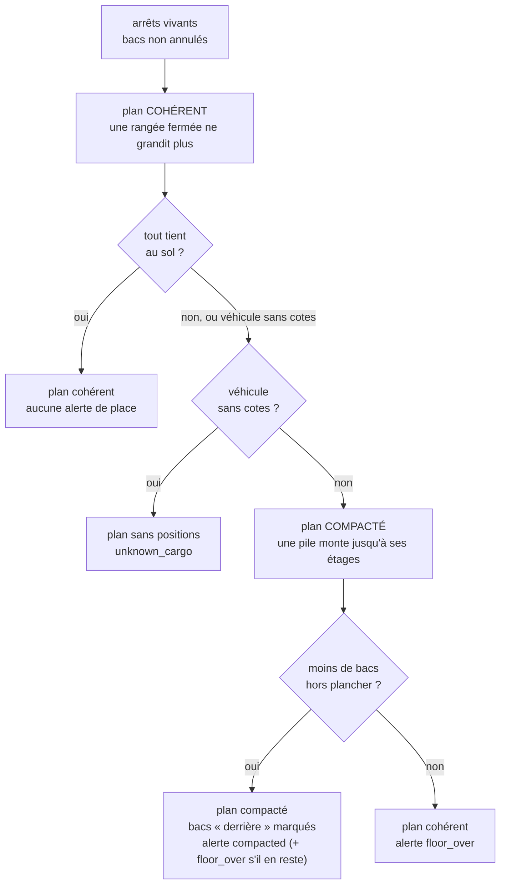

# L'algorithme du plan de chargement

> ✅ **Implémenté** — état du code relu le 2026-10-07 (le plafond de la caisse
> borne les piles depuis le 2026-10-06). Ce document décrit ce que
> fait `planLoading` aujourd'hui, ses arbitrages et ses limites. Les
> décisions qui l'ont façonné vivent dans leurs plans :
> [`plan-preparation-de-tournee.md`](../tournees/plan-preparation-de-tournee.md) (ordre,
> volume, v2-4 et v2-5) et
> [`plan-geometrie-du-plancher.md`](plan-geometrie-du-plancher.md) (G5, G-D4,
> G-D4 ter).

## 1. Ce qu'il répond

Le livreur charge un véhicule pour une tournée. Le plan lui dit, pour chaque
bac :

- **quand** le charger (l'étape) ;
- **sur quelle pile** le poser (et donc à quelle hauteur) ;
- **où est la pile** sur le plancher : rangée depuis le fond, position en
  travers, sens.

Le plan **suggère** : charger un bac hors de son étape reste accepté, et
l'écran explique où il va au lieu de refuser. Il est recalculé à chaque
lecture, à partir des arrêts vivants et des bacs non annulés. Rien n'est
stocké.

## 2. L'objectif, et l'arbitrage

Deux buts tirent en sens contraires :

| But                           | Ce qu'il demande                                                          |
| ----------------------------- | ------------------------------------------------------------------------- |
| **Cohérence avec la tournée** | À chaque arrêt, ses bacs sont devant, à portée de main, sans rien sortir. |
| **Place**                     | Pas de rangée à moitié vide, pas de pile basse : tout tient au sol.       |

L'algorithme **ne pèse pas** ces deux buts l'un contre l'autre avec un score.
Il applique une règle simple, dans cet ordre :

1. **La cohérence d'abord.** On calcule le plan cohérent. S'il tient au sol,
   c'est lui.
2. **La place seulement quand elle manque.** S'il ne tient pas, on
   recalcule en compactant. On garde le plan compacté **seulement s'il laisse
   moins de bacs hors du plancher**.
3. **On le dit.** Un bac que le compactage pose derrière d'autres est marqué
   (`behind`), et l'alerte `compacted` le nomme avec ses arrêts.
4. **Sinon, on alerte.** Si compacter ne laisse pas moins de bacs hors du
   plancher, le plan cohérent reste, avec `floor_over`. Un plan compacté qui
   en laisse moins **sans tout faire tenir** est rendu quand même : `compacted`
   et `floor_over` y coexistent.

Pourquoi ce choix plutôt qu'un score : il s'explique en une phrase au
livreur (« on ne te cache des bacs que s'il le faut pour tout emporter, et on
te dit lesquels »). Un poids entre « place gagnée » et « bacs à manipuler »
serait un réglage de plus, sans donnée de terrain pour le fixer. On ne
l'ajoutera que si la règle se révèle insuffisante sur de vraies tournées.

## 3. Les étapes d'un calcul

### 3.1 L'ordre de chargement

On charge **à l'envers de la tournée** : le dernier arrêt d'abord, au fond, et
le premier arrêt en dernier, près des portes. Une étape porte les bacs d'un
arrêt.

- **Bac partagé** (deux demi-bacs de deux commandes dans un même bac
  physique) : il se charge à l'étape du **premier** des deux arrêts, en
  **dernier** de l'étape, donc en haut de sa pile. Ses deux moitiés sont
  listées côte à côte, mais c'est un seul bac.
- Un arrêt sans bac garde son étape, vide.

### 3.2 Les piles

Chaque bac physique, dans l'ordre de chargement, va sur une pile de **son
type** :

- sur la **dernière pile ouverte** de ce type, si elle n'a pas atteint **ses
  étages** **et** (en mode cohérent) si **sa rangée est encore la rangée
  ouverte** ;
- sinon, il ouvre une pile neuve.

**Les étages d'une pile** (depuis le 2026-10-06, `553422d02`) :
`min(maxStack, ⌊hauteur utile de la caisse ÷ hauteur extérieure du bac⌋)` —
`stackLevels` (`floor/floor-geometry.ts`), la règle de l'assistant d'achat,
appliquée par `FloorPlacer.levelsOf`. Deux mannes de 715 mm ne s'empilent
donc pas dans une caisse de 140 cm (1 430 mm), mais le font dans une de
145 cm. Zéro étage : le bac est plus haut que la caisse, il ne tient pas
debout (§ 3.3). Un isotherme qui part en caisse réfrigérée n'est borné que
par `maxStack` : la hauteur de la caisse froide n'est pas mesurée. Sans cotes
de véhicule, aucun plafond : `maxStack` seul.

Une pile porte donc plusieurs arrêts : le bac chargé après, donc livré avant,
est au-dessus.

**Une rangée fermée ne grandit plus** (G-D4 ter, 2026-10-03). Une rangée est
fermée dès qu'une pile chargée après elle a dû ouvrir une rangée plus près des
portes. Sans cette règle, le premier arrêt montait sur une pile de son type
ouverte au fond par le dernier arrêt : livré en premier, mais au fond du
véhicule.

### 3.3 La pose au sol (stratégie B)

Une pile se pose **dès qu'elle s'ouvre** (`FloorPlacer`), ce qui permet à la
règle ci-dessus de savoir si sa rangée est fermée.

- Elle se pose à droite de la précédente, dans la rangée ouverte, sinon elle
  ouvre une rangée plus près des portes, sinon elle sort du plancher
  (`off_floor`).
- L'ordre n'est **jamais** changé pour gagner de la place.
- Une rangée a la profondeur de sa pile la plus profonde. Chaque pile prend le
  sens qui laisse le plus de largeur (à égalité, dans la longueur), sinon
  l'autre s'il est le seul à tenir.
- Au sol, aucune pile sur un passage de roue : une rangée qui touche les
  passages commence au bord du passage gauche.
- **Au-dessus d'un passage** (G5b, 2026-10-08) : une pile qui ne tient plus
  au sol de la rangée ouverte peut monter sur un passage dont la hauteur est
  mesurée, contre la paroi, à partir de l'étage `k₀ = ⌈hauteur du passage ÷
hauteur du bac⌉`, et `étages − k₀` bacs au plus — la règle de l'assistant
  d'achat (`overArchLevels`). Son placement le dit (`overArch` : flanc, étage
  de départ, étages). Sans hauteur mesurée, rien n'y monte.
- **Une pile qui ne tient pas sort seule** (G5c, 2026-10-08) : les suivantes
  essaient encore la rangée ouverte, puis une rangée neuve ; l'alerte
  `floor_over` ne nomme que les piles sorties. Jusque-là, toutes les
  suivantes sortaient avec elle.
- Le jeu entre bacs s'ajoute à l'empreinte : c'est un réglage depuis le
  2026-10-08 (`bin_gap_cm`, 0 à 10 cm, 1 par défaut), lu par l'écran de
  chargement et par la garde de « Proposer ».
- **Isothermes** : dans la caisse réfrigérée si le véhicule en a une (le froid
  reste compté en litres, sans position) ; sinon au sol, avec l'alerte
  `cold_bins_without_refrigeration`.

Sans cotes de véhicule, aucune pile n'a de position, aucune rangée ne ferme,
et l'alerte `unknown_cargo` le dit.

### 3.4 Le compactage

Même calcul, une seule différence : une pile monte jusqu'à ses étages
(§ 3.2) **même si sa rangée est fermée**. Chaque bac posé ainsi est marqué
`behind` : des bacs chargés après lui sont entre lui et les portes. Il faudra
en sortir pour l'atteindre à son arrêt.

On compare les deux plans au **nombre de bacs hors plancher**, pas au nombre
de piles, puisque les deux plans n'ont pas les mêmes piles.

## 4. Ce que le plan rend

| Champ (contrat `DeliveryLoadingPlanView`) | Sens                                                         |
| ----------------------------------------- | ------------------------------------------------------------ |
| `order[].bins[].stackIndex`               | la pile du bac                                               |
| `order[].bins[].behind`                   | posé derrière d'autres (plan compacté seulement)             |
| `stacks[].placement`                      | `floor` (rangée, x, y, sens), `refrigerated`, ou `off_floor` |
| `stacks[].binTypeHeightCm`                | hauteur extérieure du bac : l'écran dessine à proportion     |
| `floor`                                   | le plancher à dessiner, ou `null`                            |
| `volume`                                  | litres au sec et au froid, face au véhicule                  |
| `warnings[]`                              | les alertes ci-dessous, avec leur phrase                     |

### Les alertes

| Genre                             | Quand                                                                                                                                                                              | Ton à l'écran |
| --------------------------------- | ---------------------------------------------------------------------------------------------------------------------------------------------------------------------------------- | ------------- |
| `floor_over`                      | des piles ne tiennent pas au sol — plan cohérent, ou compacté qui n'a pas tout fait tenir ; la phrase ajoute « dont N dont le bac est plus haut que la caisse » quand c'est le cas | alerte        |
| `compacted`                       | le plan compacté est rendu : des bacs sont posés derrière d'autres ; s'il en reste hors du plancher, `floor_over` l'accompagne                                                     | avertissement |
| `dry_over` / `cold_over`          | les litres dépassent le sec ou le froid                                                                                                                                            | alerte        |
| `cold_bins_without_refrigeration` | des isothermes sans caisse froide                                                                                                                                                  | avertissement |
| `unknown_cargo`                   | le véhicule n'a pas ses cotes                                                                                                                                                      | avertissement |
| `bin_to_redo`                     | un bac partagé dont les arrêts ne sont plus voisins                                                                                                                                | avertissement |

## 5. Ce qu'il ne fait pas

- **Il ne réordonne jamais** les piles pour mieux remplir une rangée.
- **Il ne mélange jamais deux types de bac** dans une pile : à réfléchir,
  noté dans [`todo-calculateur.md`](../tournees/todo-calculateur.md).
- **Il n'optimise pas** : la pose est gloutonne, dans l'ordre. Une rangée peut
  garder un trou qu'une autre pile aurait comblé.
- **Il ne pèse pas** la place gagnée contre les bacs à manipuler (cf. §2).
- **Il ne mesure pas la caisse froide** : un isotherme qui y part n'est borné
  que par `maxStack` (le froid reste compté en litres). Au sol, le plafond
  borne chaque pile (G5e, vérifié depuis le 2026-10-06, § 3.2).
- **Il ne pose rien par-dessus un passage de roue** (G5b), contrairement à
  l'assistant d'achat.
- **La feuille de route ne rappelle pas encore** les bacs « derrière » à leur
  arrêt : seul l'écran de chargement les montre.

## 6. Où vit le code

| Fichier                                                                   | Rôle                                                            |
| ------------------------------------------------------------------------- | --------------------------------------------------------------- |
| `apps/lfd-api/src/delivery/domain/services/loading-plan.ts`               | `planLoading` : les deux passes, l'ordre, les piles (`Stacker`) |
| `apps/lfd-api/src/delivery/domain/services/floor/place-stacks.ts`         | `FloorPlacer` : la pose au sol, rangée par rangée, et `canGrow` |
| `apps/lfd-api/src/delivery/domain/services/loading-warnings.ts`           | les alertes et leurs phrases                                    |
| `apps/lfd-api/src/delivery/application/delivery-loading-plan-view.ts`     | le domaine vers le contrat                                      |
| `packages/contracts/src/delivery-loading-plan.ts`                         | le contrat servi à l'écran                                      |
| `apps/lfd-backoffice-frontend/src/app/livraison/delivery-loading-rows.ts` | l'écran : rangées, prochain bac, consigne                       |

Les cas sont éprouvés dans
`apps/lfd-api/src/delivery/domain/services/__tests__/loading-plan.spec.ts` :
l'ordre inverse, le bac partagé, l'empilement, une rangée fermée qui ne
grandit plus, le plan cohérent gardé quand il tient, le compactage quand il ne
tient pas, et `floor_over` quand compacter ne sauve rien. Le plafond a les
siens dans `loading-plan-ceiling.spec.ts` : deux mannes dans une caisse de
140 cm puis de 145 cm, une manne plus haute que la caisse, qui ne bloque pas
les bacs suivants, l'isotherme en caisse réfrigérée, et la garde de capacité
de la composition. Le cas où le plan compacté garde des bacs dehors
(`compacted` et `floor_over` ensemble) n'a pas de test (relevé le
2026-10-07).
