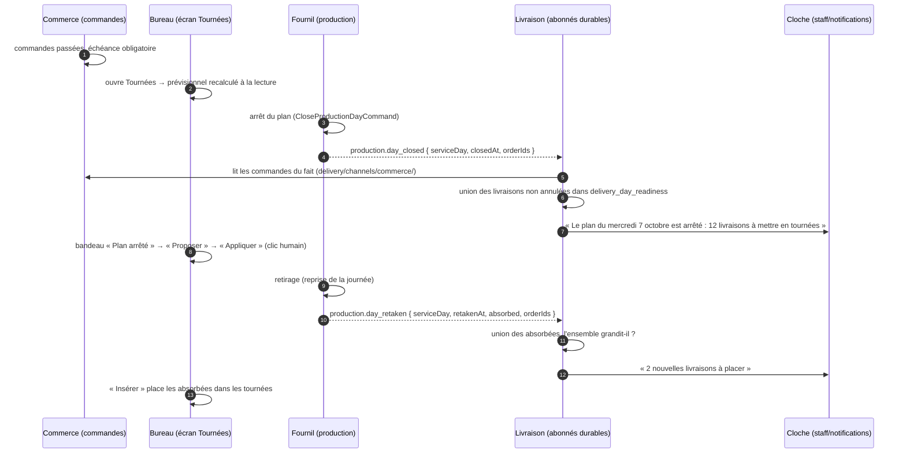
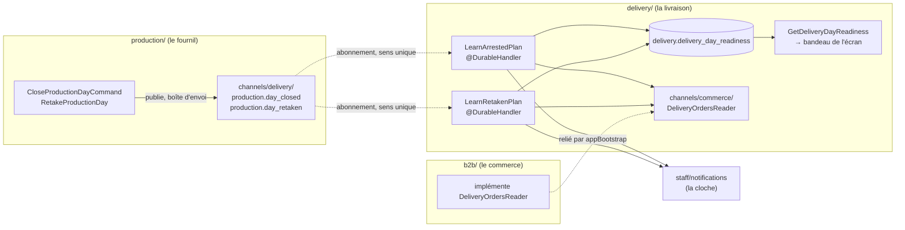
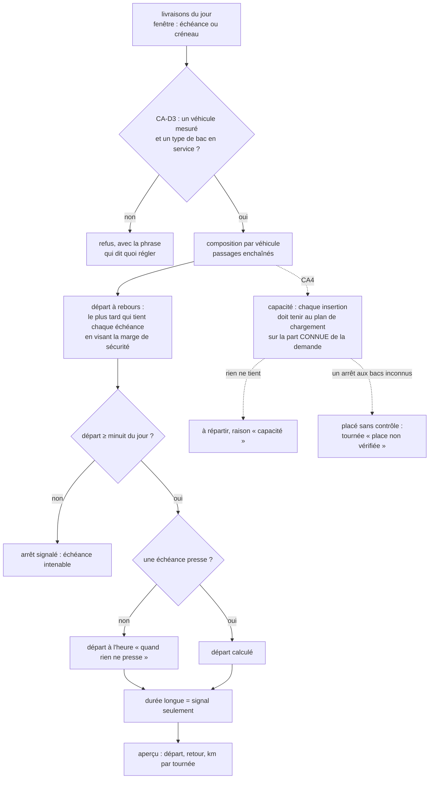

# Composer les tournées automatiquement

> 🟡 **Partiel. État vérifié le 2026-10-06** dans `git log` et le code.
> Ce document remplace le plan de composition automatique (renommé le
> 2026-10-06, ancien nom « plan-composition-automatique »). Les versions successives du plan (v1 à v4), et les contradictions
> de `vitruve` qui les ont corrigées, ne sont pas recopiées ici. Elles restent
> dans l'historique git :
> `git log --follow -p -- documentation/livraisons/composition-automatique.md` (le `--follow` traverse le renommage).

## 1. Le concept

**Le problème.** Avec le volume de commandes visé (environ 200 clients livrés par
jour), le bureau ne peut plus construire les tournées à la main. Le calcul doit
composer, et l'humain doit se contenter de **corriger**. Hugo l'a dit le
2026-10-03 : « déplacer une livraison ok, mais pas tout ».

**Règle n°1 : tout le monde est servi avant son échéance.** Rien ne passe
avant cette règle. Une tournée part aussi tôt qu'il le faut, même à 2 h du
matin, mais jamais avant minuit du jour de livraison. Les contraintes du
travail (heures du livreur, repos, durée d'une tournée) ne relèvent pas de
l'outil. Une durée longue est **signalée**, jamais refusée. Si une composition
ne peut pas tenir une échéance, c'est un **échec signalé arrêt par arrêt**. Un
retard n'est jamais accepté en silence.

**Créneau ou échéance.**

- Une **échéance** est une heure limite : « avant 6 h 00 ». La fenêtre n'a pas
  de début (`start: null`). C'est le réglage par défaut.
- Un **créneau** a un début et une fin : « entre 7 h et 8 h ». On le garde pour
  les adresses qui ne peuvent rien recevoir avant une certaine heure.
- Le mode se règle une fois pour tout le commerce et peut être changé adresse
  par adresse. Une adresse peut porter **plusieurs** échéances ou créneaux (par
  exemple 6 h pour le pain et 11 h pour le déjeuner). Une **commande**, elle,
  n'en porte toujours qu'**un seul**. Deux commandes donnent donc deux arrêts.
- Le commerce refuse toute commande livrée qui n'a ni échéance ni créneau.

**Qui décide quoi.** Le calcul **propose**, le bureau **applique**. Rien
n'écrit tout seul dans les tournées réelles. Le geste « Appliquer » est
toujours un clic humain. Quand un humain fait un geste, ce geste l'emporte sur
le calcul, même s'il rend une commande intenable. Dans ce cas la commande passe
en alerte, mais le calcul ne défait rien.

**Le prévisionnel est calculé à la lecture.** Aucune proposition n'est
stockée. Chaque fois qu'on ouvre l'écran des tournées, « Proposer » recalcule
à partir de l'état du moment. Le résultat n'est donc jamais périmé. Le mode
« Insérer » ne place que les commandes qui ne sont pas encore placées : il ne
gêne pas un bureau qui a déjà composé à la main.

**L'arrêt du plan fige la liste et prévient.** Quand le fournil clôt sa
journée de production (« arrêt du plan », à la main ou automatiquement), la
liste des commandes du jour est figée. Le jour de fabrication d'une commande
**est** son jour de livraison (`serviceDay = requestedDeliveryDate`). À ce
moment, la livraison retient les livraisons du jour et sonne la cloche du
bureau. Si le fournil reprend ensuite sa journée (« retirage »), il annonce les
commandes absorbées. La livraison les ajoute et sonne une seconde fois.

## 2. Schémas

### 2.1 La journée

### 2.2 Les blocs et le canal

L'arête est à **sens unique**. `delivery → production` est permis, mais
seulement par `production/channels/delivery/`, et seulement pour le fait (rien
de l'agrégat). `production → delivery` reste interdit : le fournil publie sans
savoir qui écoute. Le commerce ne relaie pas les faits des autres. La règle
vient de CLAUDE.md §3 et est tenue par `lint:context-boundaries`.

### 2.3 Une proposition (CA2)

## 3. État réel, lot par lot (vérifié le 2026-10-06)

| Lot      | Contenu                                                                                                                                                                           | État        | Commit                                                       |
| -------- | --------------------------------------------------------------------------------------------------------------------------------------------------------------------------------- | ----------- | ------------------------------------------------------------ |
| **CA0**  | Situer l'adresse (géocodage) dès la commande, en fond après validation ; rattrapage à la commande suivante du jour, à l'arrêt du plan et au retirage                              | ✅ bâti     | `0aa07eb63`                                                  |
| **CA1**  | Sans véhicule actif mesuré ni type de bac en service, « Proposer » refuse avec la phrase ; on ne peut pas retirer le dernier                                                      | ✅ bâti     | `57ed88723`                                                  |
| **CA1b** | Pas de livraison sans échéance ni créneau à la passation                                                                                                                          | ✅ bâti     | `8089a262c`                                                  |
| **CA2**  | Départ à rebours dès minuit, marge visée ; `maxRoundMinutes` devient un simple signal, sans pénalité de durée                                                                     | ✅ bâti     | `0cf2aaf30` (points validés `dc4bd9779`)                     |
| **CA3**  | Réglage créneau / échéance (global, puis par adresse), affichage « avant HH:MM »                                                                                                  | ✅ bâti     | `8089a262c`, écrans `6f245b864`                              |
| **CA3b** | Plusieurs créneaux ou échéances par adresse (`slotList`, l'ancien `slots` dérivé)                                                                                                 | ✅ bâti     | `d4972386a`, écrans `b7ee1c883`                              |
| §14.2    | Mode par défaut : échéance (migration `20261004090000_echeance_par_defaut`)                                                                                                       | ✅ bâti     | `d4972386a`                                                  |
| Horaire  | Une tournée garde son départ, son retour et ses km prévus, et le PDF les imprime                                                                                                  | ✅ bâti     | `3e9da566c`, aperçu `a9fb52c04`                              |
| **CA4**  | La capacité entre dans la composition : demande en bacs par commande (déclarés, sinon estimés, sinon inconnue — placée, « place non vérifiée »), `planLoading` à chaque insertion | ✅ bâti     | `4010899a1`, correction `bb7ba8fd1`                          |
| **Banc** | 200 clients, calcul pur, p95 < 5 s (`bench:composition`, qualité `bench:composition:quality`) ; complet p95 4,1 s, Insérer p95 0,15 s, sur un poste (§5 point 3)                  | ✅ bâti     | `97d163fdd`, accélération `aca1ee895` ; conteneur non mesuré |
| **CA5**  | Épinglage = les tournées enregistrées (aucune table) ; versions par tournée déjà exigées (409) ; alerte rouge « échéance intenable à cette place » à l'écran des tournées         | ✅ bâti     | `59e011547`                                                  |
| **CA6a** | Abonné à `production.day_closed`, table `delivery.delivery_day_readiness` (migration `20261007110000_le_plan_arrete_pour_la_livraison`), cloche, query et bandeau                 | ✅ bâti     | `4b79a8e06`                                                  |
| **CA6b** | `production.day_retaken` passe dans le canal avec `orderIds` ; un abonné ajoute les absorbées et sonne                                                                            | ✅ bâti     | `d5900081e`                                                  |
| **CA7**  | Place suggérée pour une commande arrivée sur un jour déjà appliqué (dérogation, retirage)                                                                                         | ❌ pas bâti | aujourd'hui, « Insérer » les prend comme non placées         |

## 4. Les décisions d'Hugo en vigueur

**La composition**

- **CA-D1 (2026-10-03).** Règle n°1 : tout le monde est servi avant son
  échéance. Le départ se calcule à rebours, et l'heure la plus basse possible
  est **minuit du jour de livraison** (Q1). Rien ne part la veille. La durée
  maximale d'une tournée **cède** devant la règle (Q2) : elle reste un signal
  et ne refuse jamais une place. Une échéance intenable est un échec signalé
  par arrêt.
- **CA2 (2026-10-03).** La passe arrière vise la marge de sécurité quand elle
  peut la tenir. Le retard se mesure sur la vraie fin de la fenêtre. L'heure
  « au plus tôt » des réglages devient l'heure de départ d'une tournée qu'aucune
  échéance ne presse. Aucune pénalité sur la durée : une seule tournée longue
  est acceptée plutôt que trois.
- **CA-D3 = la règle de « Proposer ».** Il faut au moins un véhicule actif
  **avec ses cotes** et un type de bac actif. Les cotes suffisent, c'est-à-dire
  le volume utile et le plancher ; passages de roue et caisse froide sont
  facultatifs (Q5). Sans eux, « Proposer » refuse, et on ne peut pas archiver
  le dernier véhicule ni le dernier bac.
- **Sans contenance, on place sans contrôler, et on le dit (2026-10-06,
  correction de CA4).** Une commande dont la demande en bacs est inconnue (ni
  bac déclaré, ni contenance pour tous ses produits) est placée comme avant
  CA4 : elle n'occupe rien au calcul. Une tournée mêlée est contrôlée sur sa
  part **connue** — un minorant de la charge réelle : si elle déborde déjà, le
  refus est sûr ; si elle tient, rien n'est promis. Toute tournée qui porte
  une telle commande est dite « Place non vérifiée — N commandes sans bacs
  connus » à l'écran, avec le geste qui la vérifie : régler les contenances,
  ou attendre les bacs du colisage. Raison : sans contenances réglées, CA4 ne
  plaçait presque rien avant le colisage, et le plan de chargement exact
  n'existe de toute façon qu'après lui.
- **Une tournée chargée n'est jamais touchée.** Un seul bac chargé suffit à la
  figer (`classifyRounds`).
- **§9.** « Appliquer » est un clic du bureau, jamais automatique. Le geste
  humain l'emporte. Une commande qu'il rend intenable passe en **alerte
  rouge** (tableau, résumé « à régler », carte), sans que le calcul défasse le
  geste.
- **Volume (Q3).** Environ 200 clients livrés par jour. Toute nouvelle commande
  doit pouvoir être jugée dans le prévisionnel de son jour.

**Créneau ou échéance**

- **CA-D2 / §13.** Le mode se règle globalement et peut être changé adresse
  par adresse. Une commande porte une seule fenêtre. Une commande livrée sans
  fenêtre est refusée. Les commandes déjà passées sans fenêtre sont
  signalées, jamais réécrites.
- **§14 / CA3b.** Une adresse porte une **liste** de créneaux (la même tous les
  jours, ou une par jour), triée et sans chevauchement. À la passation, on en
  choisit un.
- **§14.2.** Le mode par défaut est l'**échéance**. Toute la démo est en
  échéance.
- **Q4.** L'adresse doit être **située dès la commande**. Le prévisionnel ne
  place que ce qui a un point (c'est le lot CA0).

**L'arrêt du plan (§15, §16.5, validations du 2026-10-06)**

- La livraison **s'abonne** au fait de clôture du fournil (option B,
  2026-10-04). Elle ne le lit pas par l'intermédiaire du commerce.
- Les abonnés **ne calculent rien**. Ils tournent dans une transaction, et le
  calcul appelle OSRM. La seule vérification qu'ils font est CA-D3, en base.
  Une route indisponible n'est jamais rangée : c'est l'écran qui la constate.
- La clé est le **jour** : une ligne par `service_day`. Une journée close ne se
  rouvre pas.
- La ligne porte un **ensemble** (`delivery_order_ids`), pas un compteur.
  Chaque fait y ajoute ses livraisons par union. Le jeu est borné aux
  `orderIds` **du fait**, jamais au statut `confirmed`.
- Les **commandes annulées sont exclues** (`activeDeliveriesAmong`).
- **La cloche n'est jamais rejouée.** Elle ne sonne que si l'ensemble grandit,
  et dit de combien. Un fait rejoué ou une réannonce n'ajoute rien.
- **Un retirage reçu avant la clôture ne sonne pas.** Il range la ligne avec
  `closed_at` nul, et c'est la clôture qui annonce ensuite le total.
- Un ancien fait de retirage sans `orderIds` est accepté par la relecture, et
  l'abonné ne fait rien.

## 5. Ce qui manque

**Lots non bâtis, dans l'ordre**

1. ~~**CA0.**~~ Bâti le 2026-10-06. Sur `order.placed`, le
   commerce appelle `DeliveryOrderPlacedListener` (déclaré et implémenté par
   la livraison, `delivery/channels/commerce/`). La livraison relit la
   commande, puis, après la validation et en fond (`AfterCommit` +
   `BackgroundWork`), lance « Situer les arrêts » du jour : seul ce qui manque
   au carnet et au cache part au géocodeur. Les abonnés de l'arrêt du plan et
   du retirage relancent le même passage : c'est le rattrapage avant le jour
   J, idempotent. La passation n'attend jamais le géocodeur et n'échoue pas
   s'il est en panne. Une adresse non située reste dans `unlocated` et n'est
   jamais placée (règle déjà en place, `locateFromCache`). Reste hors CA0 : un
   changement de date ou d'adresse après la passation n'est rattrapé qu'à
   l'arrêt du plan ou par le geste « Situer ».
2. ~~**CA4.**~~ Bâti le 2026-10-06. Chaque commande a une
   demande en bacs (`stopDemandOf`) : ses bacs déclarés non annulés, sinon
   l'estimation du colisage (`proposePacking`, lignes × contenances, une
   moitié comptée pour un bac entier), sinon « inconnue ». **Corrigé le
   2026-10-06** : une commande à demande inconnue est placée
   sans contrôle (elle n'occupe rien dans `CompositionCapacity`), une tournée
   mêlée est contrôlée sur sa part connue, et la proposition nomme ces
   commandes (`unknownDemand`) pour que chaque colonne de l'aperçu dise
   « Place non vérifiée — N commandes sans bacs connus ». Les valeurs
   `unknown_demand` (`unfit`) et `unknown_demand_stop` (`kept`) sont retirées
   du contrat : une tournée qui porte un tel arrêt n'est plus gardée. Le banc
   de qualité (demandes toutes connues) reste 40/40 identique. À chaque essai d'insertion qui battrait
   la meilleure place, et à chaque geste d'amélioration retenu, la garde
   (`capacityGuardOf`) vérifie que la tournée tient : d'abord deux majorants
   (litres, surface des piles au sol), puis `planLoading`, compactage permis.
   Les alertes qui refusent sont `dry_over`, `cold_over`, `floor_over` et
   `unknown_cargo`. Un véhicule sans cotes ne porte donc aucun bac. Une place
   qui déborde n'est pas une place : la recherche passe à la suivante (autre
   véhicule, autre passage). Si rien ne tient, la commande reste à répartir
   avec la raison `capacity`. La capacité est une contrainte dure et jamais
   une pénalité : l'ordre des échéances (CA-D1) n'est pas touché. L'écran
   des tournées affiche la raison « capacité » sur la carte « À répartir ».
   Mesure sur le test à 60 arrêts (poste, médiane de 7, temps processeur) :
   158 ms au commit `0aa07eb63`, 163 ms sans capacité, 111 ms avec une
   capacité qui contraint (quatre caisses de 130 × 125 cm, 1 à 3 bacs par
   arrêt). Reste hors CA4 : la jauge de la composition à la main, et
   l'alerte quand les bacs déclarés ne tiennent plus là où l'estimation
   tenait (`todo-calculateur.md`).
3. **Banc à 200 clients.** Mesurer le calcul pur (matrice à part) : 200 arrêts,
   4 véhicules, 2 passages, 10 contraintes, médiane et p95 sur 20 tirages, une
   graine fixe. Seuil : p95 < 5 s, mesuré dans le conteneur. Les seuils restent
   à valider par Hugo. Le test actuel s'arrête à 60 arrêts, avec une borne
   relâchée à 3 s.
   **Bâti le 2026-10-06.** Script `tsx`
   `apps/lfd-api/src/delivery/domain/services/__tests__/propose-rounds.bench.ts`,
   scène
   `apps/lfd-api/src/delivery/domain/services/__tests__/composition-bench-day.ts` (mulberry32, graines 1..20, matrice plane
   tabulée d'avance) : 200 arrêts dans 25 min de rayon, 2 Trafic
   (250 × 160 cm) + 2 Kangoo (130 × 125 cm), 2 passages chacun, 5 échéances
   serrées (7 h–9 h) + 5 créneaux à début (9 h–11 h), les autres « avant
   12 h » ; demande 1/2/3/5 bacs M à 50/30/15/5 %. « Insérer » : la journée
   composée moins ses 20 dernières commandes, réinsérées. Mesure du
   2026-10-06, Apple M1 Pro, Node 22.23, temps processeur, Node nu :
   **complet médiane 3,3 s · p95 6,6 s · max 6,6 s ; Insérer médiane 80 ms ·
   p95 143 ms.** Le seuil n'est pas tenu en mode complet, sur un poste — le
   conteneur n'a pas été mesuré. Profil (graine 9, 5,8 s) : `improvePlans`
   93 % (dont `scoreVehicle` 1,9 s et le garde de capacité 1,1 s, lui-même
   `planLoading` 0,8 s), insertion 0,3 s, lecture de la matrice synthétique
   0,9 s. Les graines lentes sont celles où la place manque (à répartir non
   vide). Pas de garde à 200 arrêts dans la suite unitaire (2026-10-06) :
   sous Jest, le calcul est ~7 fois plus lent qu'en Node nu, et la garde
   coûtait ~40 s de CI ; le test à 60 arrêts reste la garde.
   **Seuil tenu sur le poste le 2026-10-06, propositions inchangées**
   (`aca1ee895`). Trois gestes, tous EXACTS (aucun ne change ce que
   `improvePlans` retient, seulement ce qu'il évite de calculer) :
   - un **minorant** du coût (`apps/lfd-api/src/delivery/domain/services/cost-floor.ts`) : route + livraisons +
     ouvertures, noté une fois par tournée neuve. `isBetterScore` est
     monotone ; si le meilleur cas (zéro retard, le minorant) n'améliore pas,
     le geste s'écarte sans `scoreVehicle`. Graine 9 : 40 % des gestes ;
   - la **mémoïsation par configuration retirée** : sa clé (tous les
     identifiants du véhicule mis bout à bout) coûtait plus que les 43 % de
     scores qu'elle épargnait ;
   - la **liste granulaire symétrisée d'avance** (`nearnessOf`) : une lecture
     par question au lieu de deux.

   | Mode    | Avant (méd. · p95 · max) | Après (méd. · p95 · max) |
   | ------- | ------------------------ | ------------------------ |
   | complet | 3,38 · 6,65 · 6,89 s     | 2,18 · 4,06 · 5,29 s     |
   | Insérer | 85 · 142 · 172 ms        | 75 · 146 · 155 ms        |

   Qualité : `pnpm --filter lfd-api bench:composition:quality` compare chaque
   graine (complet et Insérer) à la référence
   `apps/lfd-api/src/delivery/domain/services/__tests__/composition-bench-baseline.json`, enregistrée avant ces gestes,
   par empreinte du contenu puis par score ; il sort en échec sur un « PIRE ».
   Les 40 cas sont **identiques**. Ce qui pèse encore (graine 9, profil) : la
   lecture de la matrice (~1,4 s, deux `Map.get` par case, comme
   l'adaptateur OSRM) et `scoreVehicle` (~1 s), puis `planLoading` (~0,8 s).
   `improvePlans` atteint sa borne de 400 gestes sur les graines lentes :
   le résultat y est déjà fixé par la borne, en gestes, pas en temps.
   Reste : mesurer dans le conteneur (`todo-calculateur.md`).

4. ~~**CA5.**~~ Bâti le 2026-10-06. Décisions détaillées dans
   le ledger de la composition automatique (D20 à D27).
   - **Pas de table d'épinglage, pas de migration.** La contrainte humaine
     est déjà en base : c'est la tournée enregistrée. « Insérer » n'en
     déplace aucun arrêt (`insert-into-rounds.ts`, `pinned`), « Proposer »
     sans « tout recomposer » les garde toutes (`not_requested`), une tournée
     chargée ou partie n'est jamais recomposée. « Tout recomposer » peut
     déplacer un arrêt glissé à la main : c'est une demande du bureau, et
     « Appliquer » reste un clic.
   - **Pas de version par jour neuve.** Chaque geste porte déjà la version de
     sa tournée, écrite `WHERE version = lue` (409 sinon), et « Appliquer »
     exige les versions de toutes les tournées lues : la seconde personne
     relit déjà, tournée par tournée.
   - **L'alerte rouge** (`placementLateOrders`, domaine de la livraison) : un arrêt
     en retard dans la composition enregistrée alors qu'une course pour lui
     seul, partie au plus tard dès minuit, tiendrait son échéance. C'est donc
     sa place qui le condamne. En retard même seul : pas rouge, aucune place
     ne le sauverait. Le manque de flotte reste dit par l'aperçu (CA2) ; une
     fois appliquée, la composition est celle du bureau. « Chronométrer »
     le rend (`DeliveryTimedStopView.placementLate`) ; l'écran des tournées,
     qui l'appelait déjà pour les tracés, en fait un badge et un liseré
     rouges sur la carte de l'arrêt, un compte dans « à régler », et un
     marqueur en retard sur la carte. Rien n'est défait.
   - Reste : le rouge n'existe pas dans l'aperçu d'une proposition, ni sans
     calcul routier (comme les tracés). Pas de cache : le banc ne l'exige pas
     (complet p95 4,2 s, Insérer p95 0,14 s, 40/40 identique le 2026-10-06 ;
     le calcul de « Proposer » n'est pas touché par CA5).
5. **CA7.** Calculer la place suggérée d'une commande arrivée sur un jour déjà
   appliqué (par dérogation ou par retirage), en aperçu, applicable en un clic.

**Questions ouvertes**

- **Q7, « rouvrir le plan ».** Ce geste n'existe pas : une journée close ne se
  rouvre pas. S'il est décidé un jour, il demandera sa propre migration (la clé
  `service_day` ne suffira plus).
- **Une alerte avant le jour J.** L'écran devait prévenir quand un jour
  approche sans que le plan ait été appliqué. Ce n'est pas bâti, et aucun seuil
  n'est fixé.
- **Q-CA3b-1 à 4** (§14.3 de l'ancien plan), à confirmer avec Hugo :
  l'écrasement silencieux par un onglet resté sur l'ancien front, la saisie
  début/fin quand le carnet est vide, le message d'erreur résiduel, et la
  possibilité de saisir « un autre créneau » quand l'adresse en a plusieurs.

**Dette notée**

- Le champ `slots` est conservé à côté de `slotList`. Son retrait se fera en
  trois temps, sans date fixée.
- La liste des commandes arrivées a deux sources : `publishArrivals` pour le
  colisage et `day_retaken` pour la livraison. C'est assumé, chaque source sert
  son canal.
- Le calcul de « Proposer » dépasse la promesse de 2 s sur la CI (2,06 s CPU,
  mesuré avant les gestes du banc du 2026-10-06 — non remesuré depuis).
  Le travail d'algorithme est décrit dans
  [`todo-calculateur.md`](todo-calculateur.md).
