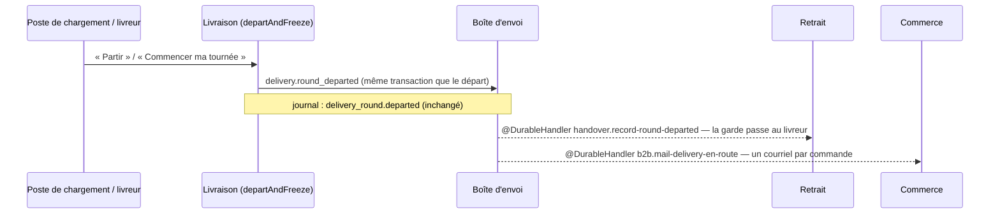

# « Votre livraison est en route »

> 📘 **Doc d'état** (2026-10-06). Ancien plan du lot PL3
> (bâti le 2026-10-01, `2932bb364`), devenu doc d'état quand le départ est
> passé en fait durable (lot DD1, 2026-10-06, `375f82225` ; sa conception :
> [`plan-depart-durable.md`](plan-depart-durable.md), gardé comme document de
> décision). Ce que DD1 a tranché pour le courriel est au § 1 ; les décisions
> PL3-D1 à PL3-D4 sont gardées en fin de document, datées.

Quand une tournée part, chaque client dont la commande est dans la tournée
reçoit un courriel « Votre livraison est en route ». La livraison ne sait pas
qu'un courriel existe : elle publie que la tournée est partie, et le
commerce, qui seul écrit aux clients (L6-C12), en tire le courriel.

## 1. Le mécanisme

- **Le fait** : `delivery.round_departed`, classe `DeliveryRoundDepartedFact`,
  déclarée dans `apps/lfd-api/src/delivery/channels/handover/` et
  réexportée par `delivery/channels/commerce/` (la même classe). Charge :
  `roundId`, `serviceDay`, `departedAt`, `orderIds` (les commandes des arrêts
  vivants au départ). Clé : `delivery.round_departed:<roundId>` — une tournée
  ne part qu'une fois ; un second passage est une autre tournée.
- **Sa publication** : dans `departAndFreeze`
  (`delivery/application/delivery-departure-support.ts`), le seul chemin
  commun aux deux portes du départ (poste de chargement,
  `DepartDeliveryRoundHandler` ; livreur, `DepartMyRoundHandler`), DANS la
  transaction du départ. Un départ refusé ou annulé n'a pas de fait ; le
  fait d'un départ validé est livré au moins une fois à chaque abonné, y
  compris à travers un redémarrage (le courriel, lui, a sa fenêtre : § 3).
- **Le journal** est à part : `DeliveryRoundDepartedEvent` (`JournaledEvent`)
  écrit toujours `delivery_round.departed`. Un fait de journal et un fait
  durable sont deux classes.
- **L'abonné du commerce** : `MailDeliveryEnRoute`
  (`b2b/orders/application/handlers/mail-delivery-en-route.handler.ts`),
  abonné `b2b.mail-delivery-en-route` — nom stable depuis le premier
  déploiement de DD1, c'est la clé de son reçu dans la boîte d'envoi. La
  garde du relais (`DurableDeliveryGuard`) le fait tourner dans la
  transaction qui pose ce reçu ; il n'y fait que décoder le fait (une charge
  illisible lève, la livraison échoue et sera rejouée), et **inscrit les
  envois pour après la validation** — le port `AfterCommit`, sur
  `deferUntilCommit` (`platform/database/transaction.store.ts`), le travail
  suivi par `BackgroundWork`. Les envois partent donc hors transaction, une
  fois le reçu validé, commande par commande et TOUTES : un envoi raté ne
  prive pas les suivants. Un échec est journalisé
  (`DeliveryEnRouteMailFailedError`, construite après avoir tenté toute la
  tournée) et **jamais relancé** : un courriel « en route » n'est pas
  critique, et le reçu est déjà validé quand les envois partent.
- **Pourquoi après la validation** (audit du 2026-10-07, B1).
  Jusque-là, l'abonné envoyait DANS la transaction du reçu, ce que
  `UnitOfWork` interdit : une transaction interactive a un délai (5 s, le
  défaut de Prisma, que `PrismaUnitOfWork` ne change pas) et tient une des
  connexions du pool tout le temps qu'elle dure. Une tournée longue, envoyée
  une commande après l'autre, pouvait dépasser ce délai : la transaction
  tombait avec le reçu, le fait était relivré, et tous les envois
  redemandés à Resend. Ce document disait aussi qu'une relance « renverrait aux
  clients déjà servis », ce que contredisait la clé ci-dessous. Même
  correction, le même jour, pour l'envoi du dossier de production.
- **L'envoi** : `DeliveryEnRouteMail`
  (`b2b/orders/application/services/delivery-en-route-mail.service.ts`). Clé
  Resend `delivery.en_route:<orderId>:<roundId>` : une relivraison du fait
  n'en fait pas partir un second, une commande rapportée qui repart dans une
  autre tournée a le sien.

## 2. Ce qui part, et à qui

- Un courriel **par commande** de la tournée (une commande = un arrêt), au
  **compte qui a commandé** : le contact de livraison n'a pas d'e-mail
  (L6-C13).
- Rien pour une commande **annulée**, **déjà retirée** ou disparue au moment
  de l'envoi, ni pour un client sans adresse lisible. Une commande annulée
  fait de toute façon refuser le départ (`DepartureOrderCancelledError`).
- Le contenu : la référence, l'adresse de livraison, « votre livreur est
  parti, il arrive dans la journée ». **Pas d'heure estimée**, pas de nom ni
  de téléphone du livreur. Gabarit : `platform/mailer/delivery-en-route-mail.ts`.

## 3. Le délai

Ce que l'e2e asserte (`test/delivery-departure-durable.e2e-spec.ts`) : le
fait est livré à chaque abonné au **premier réveil du relais** après la
validation, sans balayage (leurs reçus le disent : aucun échec, livrés), et
le courriel est enregistré moins de 2 s après la réponse HTTP du départ. Son
mailer est un enregistreur, sans réseau : l'e2e ne dit rien du temps d'un
vrai envoi. Les chiffres « 15 à 23 ms après la réponse HTTP, 70 à 98 ms
après la requête » ont été **mesurés une fois, à la main**, en bâtissant DD1
(2026-10-06, trois passages, Postgres local, ce même enregistreur) : ils
mesurent le réveil du relais, pas Resend. Si le chemin rapide manque (un
redémarrage), le balayage de la boîte d'envoi rattrape.

**Ce qui reste perdable** depuis le 2026-10-07 (B1) : un redémarrage pendant
les envois perd ceux qui restaient, puisque le reçu dit déjà l'abonné servi.
La fenêtre va de la validation du reçu au dernier envoi de la tournée ; avant
DD1, elle couvrait tout le trajet depuis la validation du départ, par le bus
en mémoire. Un départ annulé, lui, n'envoie jamais rien.

## 4. Les preuves

- `test/delivery-en-route.e2e-spec.ts` — deux commandes, deux courriels ; un
  départ rejoué refusé n'en rend pas ; une commande déjà retirée n'en reçoit
  pas ; un départ dont la validation échoue n'envoie rien.
- `test/delivery-departure-durable.e2e-spec.ts` — le fait, la garde et le
  courriel au premier essai ; la reprise d'un abonné qui échoue ; le départ
  par le livreur.
- `mail-delivery-en-route.handler.spec.ts` — clé par commande et par
  tournée, rejeu, second passage, échec non relancé ; et depuis B1 :
  rien ne part dans la transaction de la garde, les courriels partent après
  la validation, et une charge illisible lève dans la transaction sans rien
  inscrire.

## 5. Décisions d'origine (PL3, 2026-10-01), et ce qu'elles sont devenues

- **PL3-D1 — La livraison annonce, le commerce écrit au client.** Tient
  toujours. L'annonce était un port `DeliveryDepartureAnnouncer` que le
  commerce implémentait ; c'est un fait durable depuis le 2026-10-06 (DD1).
- **PL3-D2 — Après la validation, jamais dans la transaction du départ.**
  Le fait est écrit DANS la transaction ; c'est sa LIVRAISON qui vient après
  la validation, par le relais. Depuis le 2026-10-07 (B1), les envois
  attendent à leur tour la validation du reçu de l'abonné, hors transaction
  (§ 1). L'ancien abonné en mémoire (`AnnounceDeliveryDeparture`,
  `AfterCommit` + `BackgroundWork`) perdait le courriel à un redémarrage :
  retiré.
- **PL3-D3 — Un courriel par commande, une seule fois.** La clé est devenue
  `delivery.en_route:<orderId>:<roundId>` (DD1, 2026-10-06) : par commande
  ET par tournée, pour qu'une relivraison du fait n'en fasse pas partir un
  second, et qu'une commande rapportée qui repart dans une autre tournée ait
  le sien.
- **PL3-D4 — Le contenu.** Inchangé ; le gabarit vit dans l'app, pas dans
  `packages/mailer` (le plan se trompait).
