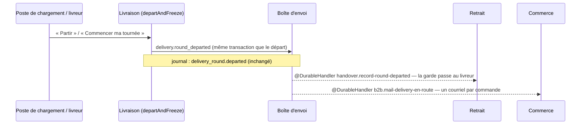

# « Votre livraison est en route »

> 📘 **Doc d'état** (2026-10-06). Ancien plan du lot PL3
> (bâti le 2026-10-01, `2932bb364`), devenu doc d'état quand le départ est
> passé en fait durable (lot DD1, [`plan-depart-durable.md`](plan-depart-durable.md)).
> Les décisions PL3-D1 à PL3-D4 sont gardées en fin de document, datées.

Quand une tournée part, chaque client dont la commande est dans la tournée
reçoit un courriel « Votre livraison est en route ». La livraison ne sait pas
qu'un courriel existe : elle publie que la tournée est partie, et le
commerce, qui seul écrit aux clients (L6-C12), en tire le courriel.

## 1. Le mécanisme

- **Le fait** : `delivery.round_departed`, classe `DeliveryRoundDepartedFact`,
  déclarée dans `apps/lfd-api/src/delivery/channels/handover/` et
  réexportée par `delivery/channels/commerce/` (la même classe). Charge :
  `roundId`, `serviceDay`, `departedAt`, `orderIds` (les commandes des arrêts
  vivants au départ). Clé : `delivery.round_departed:<roundId>` — une tournée
  ne part qu'une fois ; un second passage est une autre tournée.
- **Sa publication** : dans `departAndFreeze`
  (`delivery/application/delivery-departure-support.ts`), le seul chemin
  commun aux deux portes du départ (poste de chargement,
  `DepartDeliveryRoundHandler` ; livreur, `DepartMyRoundHandler`), DANS la
  transaction du départ. Un départ refusé ou annulé n'a pas de fait ; un
  départ validé est livré au moins une fois, y compris à travers un
  redémarrage.
- **Le journal** est à part : `DeliveryRoundDepartedEvent` (`JournaledEvent`)
  écrit toujours `delivery_round.departed`. Un fait de journal et un fait
  durable sont deux classes.
- **L'abonné du commerce** : `MailDeliveryEnRoute`
  (`b2b/orders/application/handlers/mail-delivery-en-route.handler.ts`),
  abonné `b2b.mail-delivery-en-route`. Il envoie commande par commande, et
  TOUTES : un envoi raté ne prive pas les suivants. Un échec est journalisé
  (`DeliveryEnRouteMailFailedError`) et **jamais relancé** — l'abonné ne lève
  pas : un courriel « en route » n'est pas critique, et relancer le fait
  renverrait aussi aux clients déjà servis.
- **L'envoi** : `DeliveryEnRouteMail`
  (`b2b/orders/application/services/delivery-en-route-mail.service.ts`). Clé
  Resend `delivery.en_route:<orderId>:<roundId>` : une relivraison du fait
  n'en fait pas partir un second, une commande rapportée qui repart dans une
  autre tournée a le sien.

## 2. Ce qui part, et à qui

- Un courriel **par commande** de la tournée (une commande = un arrêt), au
  **compte qui a commandé** : le contact de livraison n'a pas d'e-mail
  (L6-C13).
- Rien pour une commande **annulée**, **déjà retirée** ou disparue au moment
  de l'envoi, ni pour un client sans adresse lisible. Une commande annulée
  fait de toute façon refuser le départ (`DepartureOrderCancelledError`).
- Le contenu : la référence, l'adresse de livraison, « votre livreur est
  parti, il arrive dans la journée ». **Pas d'heure estimée**, pas de nom ni
  de téléphone du livreur. Gabarit : `platform/mailer/delivery-en-route-mail.ts`.

## 3. Le délai

Mesuré en e2e le 2026-10-06 (`test/delivery-departure-durable.e2e-spec.ts`,
trois passages, Postgres local) : le courriel part au **premier réveil du
relais** après la validation, sans balayage — 15 à 23 ms après la réponse
HTTP du départ, 70 à 98 ms après la requête. Si le chemin rapide manque (un
redémarrage), le balayage de la boîte d'envoi rattrape.

## 4. Les preuves

- `test/delivery-en-route.e2e-spec.ts` — deux commandes, deux courriels ; un
  départ rejoué refusé n'en rend pas ; une commande déjà retirée n'en reçoit
  pas ; un départ dont la validation échoue n'envoie rien.
- `test/delivery-departure-durable.e2e-spec.ts` — le fait, la garde et le
  courriel au premier essai ; la reprise d'un abonné qui échoue ; le départ
  par le livreur.
- `mail-delivery-en-route.handler.spec.ts` — clé par commande et par
  tournée, rejeu, second passage, échec non relancé.

## 5. Décisions d'origine (PL3, 2026-10-01), et ce qu'elles sont devenues

- **PL3-D1 — La livraison annonce, le commerce écrit au client.** Tient
  toujours. L'annonce était un port `DeliveryDepartureAnnouncer` que le
  commerce implémentait ; c'est un fait durable depuis le 2026-10-06 (DD1).
- **PL3-D2 — Après la validation, jamais dans la transaction du départ.**
  Le fait est écrit DANS la transaction ; c'est sa LIVRAISON qui vient après
  la validation, par le relais, dans l'unité de travail de l'abonné. L'ancien
  abonné en mémoire (`AnnounceDeliveryDeparture`, `AfterCommit` +
  `BackgroundWork`) perdait le courriel à un redémarrage : retiré.
- **PL3-D3 — Un courriel par commande, une seule fois.** La clé est devenue
  `delivery.en_route:<orderId>:<roundId>` (DD1, §5).
- **PL3-D4 — Le contenu.** Inchangé ; le gabarit vit dans l'app, pas dans
  `packages/mailer` (le plan se trompait).
