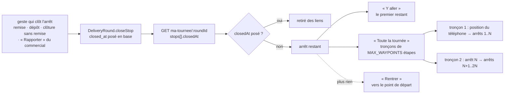
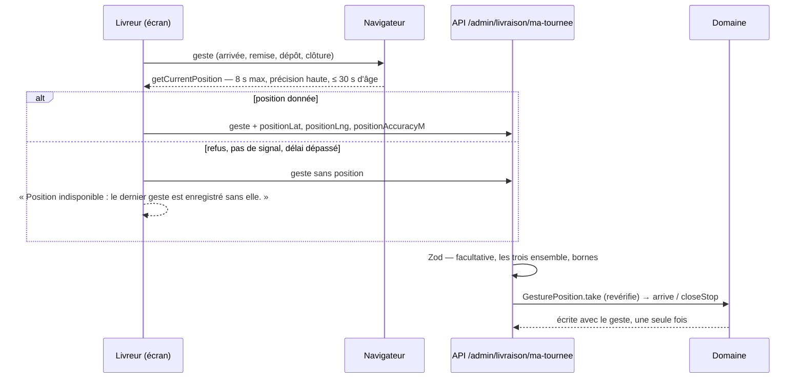
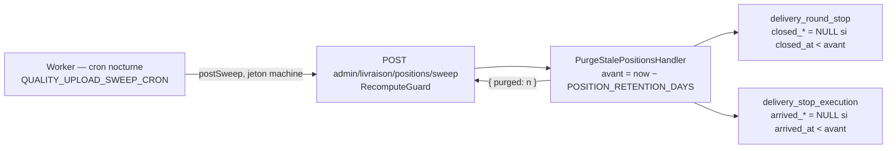

# « Y aller » et la position au geste

> ✅ **Doc technique, état au 2026-10-06.** Ce document décrit ce qui est bâti.
> C'était le plan « Y aller et la position » (2026-09-30) ; son historique se
> lit par `git log --follow documentation/livraisons/gps-y-aller-et-position.md`.
> Ce qui n'est pas bâti est dans **Reste à faire**, à la fin.

Deux choses, sur l'écran « Ma tournée » du livreur (`/coursier`) :

1. **« Y aller »** : ouvrir l'application de navigation vers l'arrêt suivant, ou
   vers toute la tournée découpée en tronçons, **sans les arrêts déjà clos**.
2. **La position au geste** : la position du téléphone relevée une fois, au
   moment d'un geste à la porte, jamais en continu, et effacée au bout de
   60 jours.

---

## 1. Les liens de navigation

### Un calcul, deux boutons (YA-D1)

Tout part de la même liste : **les arrêts de la tournée, dans l'ordre de
passage, sans ceux dont `closedAt` est posé** (`remainingStops`,
`apps/lfd-backoffice-frontend/src/app/livraison/my-round-navigation.ts`). Le
téléphone ne mémorise rien : relancer « Y aller » après avoir quitté
l'application de navigation relit la tournée, et ce qui est clos a disparu.



La chaîne est éprouvée de bout en bout (YA3, 2026-10-06) :

- côté serveur, `apps/lfd-api/test/delivery-gesture-position.e2e-spec.ts` : la
  remise du premier arrêt d'une tournée à deux arrêts → « Ma tournée » le rend
  clos, le second est le seul restant ;
- côté écran, `my-round-page.spec.ts` (« YA3 ») : le geste part, la tournée est
  relue, « Y aller » vise l'arrêt suivant et aucun tronçon ne porte plus
  l'arrêt clos.

Une livraison ratée puis rapportée par un commercial (B3) est close : elle sort
des liens (YA-Q2). Un arrêt seulement signalé reste ouvert.

### Les trois applications (YA-D3)

Un réglage **par appareil**, dans le navigateur (`lfd.livraison.navigation-app`),
pas en base.

| Application | « Y aller » | « Toute la tournée »                                    |
| ----------- | ----------- | ------------------------------------------------------- |
| Google Maps | ✅          | ✅ en tronçons                                          |
| Apple Plans | ✅          | liens Google Maps quand même (une destination par lien) |
| Waze        | ✅          | liens Google Maps quand même (une destination par lien) |

⚠️ Le plan voulait **cacher** « Toute la tournée » hors Google ; le code
(`routeLegs`, `my-round-page.html`, relus le 2026-10-06) l'affiche toujours, en
liens Google, quel que soit le choix.

Chaque étape est donnée par son **point GPS** quand le carnet en a un (figé au
départ : `delivery_stop_execution.gps_lat/gps_lng`), sinon par l'adresse en
texte. Un arrêt sans l'un ni l'autre n'entre dans aucun lien, et l'écran le
compte.

### La découpe en tronçons (YA-D2)

Lien Google `maps/dir/?api=1`, sans compte ni clé. Google suit l'ordre donné et
ne réordonne pas les étapes : c'est notre ordre qui tient les créneaux.

- Un tronçon = au plus `MAX_WAYPOINTS` étapes + la destination.
  **`MAX_WAYPOINTS = 3`** : la documentation Google (relue le 2026-10-01) annonce
  trois étapes sur navigateur mobile, neuf ailleurs, et le lien doit marcher
  partout.
- Le premier tronçon n'a pas de départ (Google part du téléphone) ; le suivant
  part du dernier arrêt du précédent.
- Un lien de plus de 2 048 caractères n'est pas garanti par Google
  (`MAX_URL_LENGTH`).
- Le retour n'est pas une étape : « Rentrer » apparaît quand plus rien ne reste.

Aucune donnée ne part vers Google, Apple ou Waze depuis le serveur : c'est un
lien que le livreur ouvre.

---

## 2. La position au geste (YA-D4)

### Ce qui est relevé, et quand

La position du téléphone (latitude, longitude, précision en mètres) est lue
**une fois, au geste**, par `navigator.geolocation.getCurrentPosition` — jamais
`watchPosition`, jamais en arrière-plan, rien entre deux gestes.

| Geste                  | Où elle s'écrit                                                                     |
| ---------------------- | ----------------------------------------------------------------------------------- |
| « Je suis arrivé »     | `delivery.delivery_stop_execution.arrived_lat`, `arrived_lng`, `arrived_accuracy_m` |
| « Remis au client »    | `delivery.delivery_round_stop.closed_lat`, `closed_lng`, `closed_accuracy_m`        |
| « Déposé avec preuve » | idem                                                                                |
| « Clore sans remise »  | idem                                                                                |

L'arrivée est relevée **en plus** de la clôture (Hugo, 2026-10-06) : l'écart
entre l'adresse prévue, l'endroit où le livreur arrive (où il se gare) et
l'endroit où il remet (la porte) est ce qui précise une adresse.

Une clôture décidée au bureau (« Rapporter », clôture par réglage) n'a pas de
position : personne n'est à la porte.



### Les règles

- **Facultative, jamais bloquante.** Une position indisponible laisse les
  colonnes nulles ; le geste s'enregistre. L'écran le dit, sans plus.
- **Les trois champs ensemble, ou aucun** — refusé par le contrat
  (`@lfd/contracts`, `delivery-doorstep.ts`), par le domaine
  (`GesturePosition`, `GesturePositionInvalidError` → 400) et par la base
  (CHECK `delivery_round_stop_closed_position_check`,
  `delivery_stop_execution_arrived_position_check`). Une position impossible
  refuse le geste : le livreur le refait, l'écran envoie une position valide ou
  rien.
- **Écrite une fois.** L'arrivée garde la première position (comme son heure).
  La clôture n'écrit la position que dans le `save` du geste qui clôt : un
  arrêt réhydraté ne la porte pas, donc aucun `save` plus tardif ne peut la
  réécrire après la purge (`DeliveryStopState.closedPosition`, présent
  seulement dans cette écriture).
- **Les champs sont à plat** (`positionLat`, `positionLng`, `positionAccuracyM`)
  parce que la remise et le dépôt sont en multipart.
- « Je suis arrivé » garde un corps **facultatif** : un appel sans corps vaut
  « sans position ».

### La finalité (Hugo, 2026-10-06)

D'abord **faciliter les tournées suivantes** du livreur : des adresses justes,
l'endroit où se garer, la bonne porte, les consignes d'accès — pour lui et le
prochain livreur. Puis **prouver la livraison** en cas de litige.
**Jamais** suivre ses déplacements, ni mesurer sa vitesse ou son temps de
travail.

### L'information du livreur

On **prévient**, on ne demande pas (Hugo, 2026-10-06). La **version 2** du texte
d'information
(`apps/lfd-api/src/delivery/domain/value-objects/driver-information-notice.ts`)
l'annonce ; le registre (`documentation/legal/rgpd-registre.json`) porte les six
colonnes en catégorie `position`, conservation 60 jours, et l'empreinte que la
v2 a vue — `pnpm lint:rgpd-staff` échoue si l'un bouge sans l'autre. Un livreur
qui avait accusé la version 1 revoit le dialogue une fois, au prochain
« Commencer ma tournée ».

### La purge à 60 jours



- **Une constante** : `POSITION_RETENTION_DAYS = 60`
  (`apps/lfd-api/src/delivery/domain/services/position-retention.ts`), lue par
  la purge et par le texte d'information.
- **Des colonnes, pas des lignes** : l'arrêt reste clos, à la même heure ;
  l'arrivée reste datée.
- Par lots de 500, idempotente ; une nuit manquée est rattrapée la suivante.
  Le cron enchaîne chaque balayage indépendamment : un échec ne saute pas les
  suivants, il s'écrit dans les logs du Worker.
- Aucun log ne contient de coordonnée : le compte rendu est un nombre.
- Chaque lot réveille le déclencheur `day_change` de lignes vieilles de deux
  mois : une version de journée que personne ne relit.

**Contrôle pour Hugo** (doit rendre `0` et `0`) :

```sql
SELECT count(*) AS clotures_trop_vieilles
  FROM delivery.delivery_round_stop
 WHERE closed_lat IS NOT NULL
   AND closed_at < now() - interval '60 days';

SELECT count(*) AS arrivees_trop_vieilles
  FROM delivery.delivery_stop_execution
 WHERE arrived_lat IS NOT NULL
   AND arrived_at < now() - interval '60 days';
```

Un résultat non nul d'un jour sur l'autre se lit en une nuit de retard au plus ;
au-delà, la purge ne tourne pas (`RECOMPUTE_TOKEN` absent du Worker, ou route en
erreur dans ses logs).

---

## 3. Ce que voit qui

| Qui                                                  | Ce qu'il voit                                                                                 |
| ---------------------------------------------------- | --------------------------------------------------------------------------------------------- |
| Le livreur (`delivery_driving`, `delivery_doorstep`) | ses tournées, ses liens, la mention « position indisponible » — jamais une coordonnée relevée |
| Le bureau (`delivery_rounds:read`)                   | **aucune position** au 2026-10-06 (voir Reste à faire)                                        |
| Google, Apple, Waze                                  | ce que contient le lien que le livreur ouvre ; rien n'est envoyé par le serveur               |
| La base                                              | les six colonnes, 60 jours au plus                                                            |

---

## 4. Les trois applis du dépôt concernées

- **`apps/lfd-api`** (bloc `delivery/`) : migration
  `20261007160000_la_position_au_geste` (additive) ; `GesturePosition`,
  `GesturePositionInvalidError`, `POSITION_RETENTION_DAYS` ; `closeStop(…, position)`,
  `DoorstepStop.arrive(…, position)` ; `gesturePositionOf` dans
  `doorstep-support.ts` ; la purge (`purge-stale-positions.*`,
  `GesturePositionPruner`, `PrismaGesturePositionPruner`,
  `PositionPurgeSweepController`, `POSITION_PURGE_PROVIDERS`) ;
  `container/worker.ts` appelle la route chaque nuit.
- **`packages/contracts`** : `delivery-doorstep.ts` — les champs de position
  sur les trois gestes de clôture et `declareStopArrivalPayloadSchema`.
- **`apps/lfd-backoffice-frontend`** : `apps/lfd-backoffice-frontend/src/app/livraison/gesture-position.ts`
  (`GesturePositionReader`, `appendPosition`), branché dans `my-round-page`,
  `handover-form`, `deposit-form` et `my-delivery-round.service.ts` ;
  `my-round-navigation.ts` pour les liens.

---

## 5. Décisions en vigueur

| #          | Décision                                                                                                                            |
| ---------- | ----------------------------------------------------------------------------------------------------------------------------------- |
| YA-D1      | Deux boutons, un calcul : les arrêts restants, sans les clos, relus à chaque fois.                                                  |
| YA-D2      | Tronçons de `MAX_WAYPOINTS` (3) étapes ; « Rentrer » à part.                                                                        |
| YA-D3      | Application choisie par appareil pour « Y aller » ; « Toute la tournée » toujours en liens Google (le code, relu le 2026-10-06).    |
| YA-D4      | Position au geste seulement — arrivée, remise, dépôt, clôture sans remise (arrivée ajoutée par Hugo le 2026-10-06) ; jamais exigée. |
| YA-Q1      | Pas de « Je suis passé » sans preuve : un arrêt sort par un geste qui le clôt.                                                      |
| YA-Q2      | Un arrêt raté puis rapporté est clos : il sort des liens.                                                                           |
| YA-Q3      | 60 jours (`POSITION_RETENTION_DAYS`), à faire valider.                                                                              |
| 2026-10-06 | On prévient, on ne demande pas : le texte énonce un fait.                                                                           |
| 2026-10-06 | Finalité : faciliter les tournées suivantes, puis prouver la livraison ; jamais suivre les déplacements.                            |

---

## 6. Reste à faire

- **Afficher l'écart au bureau** : arrivée ↔ adresse prévue, remise ↔ adresse
  prévue (Hugo, 2026-10-06), et le geste « corriger le carnet ? ». Aucune vue
  du bureau ne montre aujourd'hui un arrêt clos (« Planifier » ne lit que les
  arrêts vivants, la feuille de route ne connaît pas la clôture — vérifié le
  2026-10-06) : c'est un écran à concevoir, et **le droit qui voit les
  positions** est à trancher avec lui.
- **« Livré à 9 h 42 », le prochain arrêt, l'heure estimée des suivants** sur
  « Planifier » : non bâti, même raison.
- **Faire valider** par un juriste ou un DPO : finalité, proportionnalité,
  60 jours, information des représentants du personnel
  ([`../legal/rgpd-livreur.md`](../legal/rgpd-livreur.md) §5).
- **Annoncer la navigation tierce** dans la politique de confidentialité avant
  la mise en service (YA-Q4).
- **Mesurer `MAX_WAYPOINTS`** sur l'iPhone du livreur (application Google Maps
  installée et non installée) : la valeur 3 vient de la documentation, pas
  d'une mesure.
- Le contact pour exercer ses droits manque toujours au texte d'information
  (« [À COMPLÉTER : contact] »).
